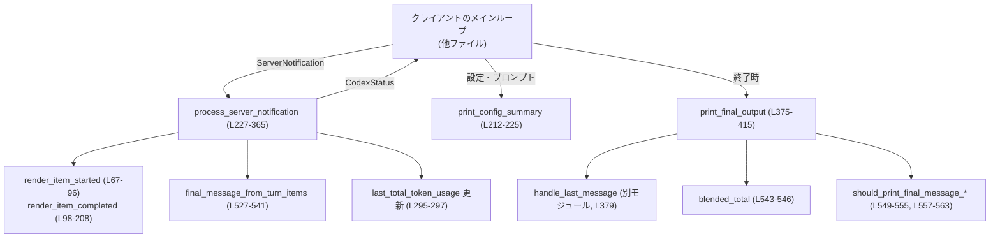
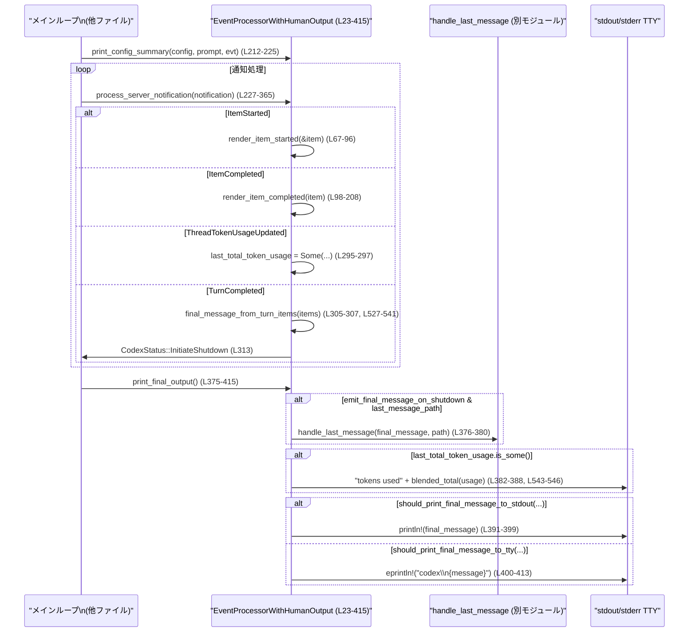

# exec/src/event_processor_with_human_output.rs

## 0. ざっくり一言

人間向けに整形されたメッセージを標準出力／標準エラーに表示するための、`EventProcessor` トレイト実装です。  
サーバからの各種イベント（コマンド実行、MCPツール呼び出し、推論ログ、最終メッセージなど）を受け取り、テキストとして出力します。

---

## 1. このモジュールの役割

### 1.1 概要

このモジュールは、Codex サーバから届くイベント (`ServerNotification`) を処理し、人間が読みやすい形でターミナルに表示する役割を持ちます。

- **問題**: サーバからのイベントや状態は構造化データとして届くため、そのままでは人間には読みにくい。
- **機能**:  
  - イベント内容を整形し、色付き（ANSI）で出力する  
  - 対話ターンの最終メッセージとトークン使用量をまとめて表示する  
  - 最終メッセージをファイルに保存するフックを提供する  

### 1.2 アーキテクチャ内での位置づけ

`EventProcessorWithHumanOutput` は、クライアント側のイベント処理レイヤに属し、`EventProcessor` トレイトの1実装です（`impl EventProcessor for EventProcessorWithHumanOutput`、`exec/src/event_processor_with_human_output.rs:L211-415`）。

- 呼び出し元（メインループなど）が `ServerNotification` を受信
- `EventProcessorWithHumanOutput::process_server_notification` に通知
- 内部状態（最終メッセージやトークン使用量）を更新しつつ、ターミナルへ表示
- 対話完了時に `print_final_output` で最終的な出力＆保存



※ カッコ内の行番号は `exec/src/event_processor_with_human_output.rs:Lxx-yy` を指します。

### 1.3 設計上のポイント

- **状態を持つ設計**（`EventProcessorWithHumanOutput` 構造体, L23-39）
  - ANSIスタイル設定（色・太字など）
  - 推論表示フラグ（`show_agent_reasoning`, `show_raw_agent_reasoning`）
  - 最終メッセージ文字列とその表示状態
  - トークン使用量の累計
- **責務分割**
  - 個々のスレッドアイテムの表示: `render_item_started` / `render_item_completed`（L67-96, L98-208）
  - 通知種別ごとの分岐処理: `process_server_notification`（L227-365）
  - 設定サマリ生成: `config_summary_entries`（L418-459）と `summarize_sandbox_policy`（L461-508）
  - 最終メッセージ決定ロジック: `final_message_from_turn_items`（L527-541）
  - 出力先の選択（stdout/tty）: `should_print_final_message_to_stdout` / `should_print_final_message_to_tty`（L549-555, L557-563）
- **エラーハンドリング方針**
  - 例外的状況はほぼすべて「メッセージを標準エラーに出力する」ことで扱う（例: `ServerNotification::Error` L242-248, `TurnStatus::Failed` L315-322）
  - パニックを明示的に起こすコードはなく、エラーは `CodexStatus` を通じて上位に伝える設計です。
- **並行性**
  - すべてのメソッドが `&mut self` を取る同期処理です（L212, L227, L367, L375）。
  - 同一インスタンスを複数スレッドから同時に扱う場合は、呼び出し側で排他制御が必要です（`Send`/`Sync` 実装はこのファイルからは不明）。

---

## 2. 主要な機能一覧

- 設定サマリの表示: 初期設定とモデル情報を人間向けに整形して出力します（`print_config_summary`, L212-225）。
- サーバ通知の処理: `ServerNotification` に応じてメッセージや状態を更新します（`process_server_notification`, L227-365）。
- 警告メッセージの表示: 任意の警告文字列を表示します（`process_warning`, L367-373）。
- ターン終了時の最終出力: 最終メッセージとトークン使用量を出力し、必要に応じてファイル保存します（`print_final_output`, L375-415）。
- スレッドアイテム開始／完了の表示: コマンド実行・MCPツールなどの開始／完了状態を出力します（`render_item_started`, L67-96 / `render_item_completed`, L98-208）。
- 設定サマリ用エントリの構築: `config_summary_entries`（L418-459）。
- サンドボックスポリシーの要約文字列生成: `summarize_sandbox_policy`（L461-508）。
- 推論テキストの選択と結合: `reasoning_text`（L510-525）。
- 最終メッセージの決定: `final_message_from_turn_items`（L527-541）。
- トークン使用数の集計（キャッシュ分を差し引き）: `blended_total`（L543-546）。
- 出力先選択ロジック: `should_print_final_message_to_stdout` / `should_print_final_message_to_tty`（L549-555, L557-563）。

### 2.1 コンポーネント一覧（構造体・関数インベントリー）

| 種別 | 名前 | 行範囲 | 役割 |
|------|------|--------|------|
| struct | `EventProcessorWithHumanOutput` | L23-39 | 人間向け出力のための状態とスタイルを保持するメイン構造体 |
| impl | `EventProcessorWithHumanOutput::create_with_ansi` | L42-65 | ANSI色の有無・設定に応じてインスタンスを初期化 |
| impl メソッド | `render_item_started` | L67-96 | スレッドアイテム開始時のログ出力 |
| impl メソッド | `render_item_completed` | L98-208 | スレッドアイテム完了時のログ出力と最終メッセージの更新 |
| trait impl | `print_config_summary` | L212-225 | 設定サマリとユーザープロンプトの出力 |
| trait impl | `process_server_notification` | L227-365 | `ServerNotification` 全種別の処理と状態更新 |
| trait impl | `process_warning` | L367-373 | 任意警告文字列の出力 |
| trait impl | `print_final_output` | L375-415 | シャットダウン時の最終出力処理 |
| 関数 | `config_summary_entries` | L418-459 | 設定サマリ表示用のキー／値ペア生成 |
| 関数 | `summarize_sandbox_policy` | L461-508 | `SandboxPolicy` を人間向け文字列に要約 |
| 関数 | `reasoning_text` | L510-525 | 推論テキスト（summary/content）の選択と連結 |
| 関数 | `final_message_from_turn_items` | L527-541 | ターン内アイテムから最終メッセージ文字列を抽出 |
| 関数 | `blended_total` | L543-546 | キャッシュ入力を除いたトークン合計を計算 |
| 関数 | `should_print_final_message_to_stdout` | L549-555 | stdoutに最終メッセージを出すか判定 |
| 関数 | `should_print_final_message_to_tty` | L557-563 | TTY向けに最終メッセージを出すか判定 |
| モジュール | `tests` | L566-568 | テストモジュールの宣言（中身はこのチャンクには現れません） |

---

## 3. 公開 API と詳細解説

このファイル内の型・関数は `pub(crate)` を含みますが、クレート外には直接公開されていません。ただし、`EventProcessor` トレイト実装として、クレート内の他コンポーネントからは利用される前提です。

### 3.1 型一覧

| 名前 | 種別 | 行範囲 | 役割 / 用途 |
|------|------|--------|-------------|
| `EventProcessorWithHumanOutput` | 構造体 | L23-39 | 人間向け出力処理の実装。ANSIスタイル、推論表示フラグ、最終メッセージ、トークン使用量などの状態を保持します。 |

主要フィールド（抜粋, L23-38）:

- `bold`, `cyan`, `dimmed`, `green`, `italic`, `magenta`, `red`, `yellow`: `owo_colors::Style` – 出力用の色とスタイル
- `show_agent_reasoning`: `bool` – Reasoning を表示するかどうか
- `show_raw_agent_reasoning`: `bool` – 生の reasoning 内容を表示するかどうか
- `last_message_path`: `Option<PathBuf>` – 最終メッセージを保存するパス
- `final_message`: `Option<String>` – 最終メッセージ本体
- `final_message_rendered`: `bool` – すでにターミナルに表示済みかどうか
- `emit_final_message_on_shutdown`: `bool` – シャットダウン時に最終メッセージを出力するかどうか
- `last_total_token_usage`: `Option<ThreadTokenUsage>` – 最後に受け取ったトークン使用統計

---

### 3.2 関数詳細（主要 7 件）

#### `EventProcessorWithHumanOutput::create_with_ansi(with_ansi: bool, config: &Config, last_message_path: Option<PathBuf>) -> Self`

（L42-65）

**概要**

ANSIカラーの有無と設定 (`Config`) に基づいて `EventProcessorWithHumanOutput` を初期化します。  
色付き出力を使うかどうか、および推論ログを表示するかどうかをここで決定します。

**引数**

| 引数名 | 型 | 説明 |
|--------|----|------|
| `with_ansi` | `bool` | ANSIスタイルを有効にするかどうか。`true` ならスタイル付き、`false` ならスタイル無し（プレーンテキスト）になります（L47-56）。 |
| `config` | `&Config` | Codex の設定。推論表示フラグに利用されます（L57-58）。 |
| `last_message_path` | `Option<PathBuf>` | 最終メッセージを書き出すパス。`None` の場合はファイル出力を行いません（L59）。 |

**戻り値**

- `EventProcessorWithHumanOutput` – スタイルとフラグが設定された新しいインスタンス。

**内部処理の流れ**

1. `style` というクロージャを定義し、`with_ansi` に応じてスタイル付き／プレーンの `Style` を返します（L47）。
2. 各色 (`bold`, `cyan` など) に対して `Style::new().xxx()` を生成し、`with_ansi` が `false` の場合はプレーンスタイルを設定します（L49-56）。
3. `show_agent_reasoning` を `!config.hide_agent_reasoning` から決定します（L57）。
4. `show_raw_agent_reasoning` を `config.show_raw_agent_reasoning` からセットします（L58）。
5. `last_message_path` を引数からそのまま格納し、`final_message` などの状態を初期値 (`None` / `false`) に設定します（L59-63）。

**Examples（使用例）**

```rust
use std::path::PathBuf;
use codex_core::config::Config;
use crate::event_processor_with_human_output::EventProcessorWithHumanOutput;

// Config は外部で読み込まれていると仮定
fn make_processor(config: &Config) -> EventProcessorWithHumanOutput {
    // ANSIカラーを有効にし、最終メッセージを "last_message.txt" に保存する
    EventProcessorWithHumanOutput::create_with_ansi(
        true,                                       // ANSIカラー有効
        config,                                     // 設定
        Some(PathBuf::from("last_message.txt")),    // 最終メッセージ保存先
    )
}
```

**Errors / Panics**

- 明示的に `Result` を返さず、パニックを起こす処理もありません。
- `Config` の内容はそのまま読み取るだけで、検証や I/O は行っていません。

**Edge cases（エッジケース）**

- `with_ansi == false` の場合、すべてのスタイルはプレーンになり、色・装飾は付きません（L47-56）。
- `last_message_path == None` の場合、後続の `print_final_output` でファイルへの書き出しがスキップされます（L375-380）。

**使用上の注意点**

- `Config` のフィールド (`hide_agent_reasoning`, `show_raw_agent_reasoning`) がどのような意味を持つかは、このファイルだけでは分かりませんが、その真偽値に応じて Reasoning 表示が変化します（L57-58）。
- インスタンス生成後にフラグを変更する API はこの型にはなく、動作を変えたい場合は再生成が必要です。

---

#### `render_item_started(&self, item: &ThreadItem)`

（L67-96）

**概要**

サーバから送られてきたスレッドアイテムが「開始」したタイミングで、その概要をターミナルに出力します。  
コマンド実行、MCPツール呼び出し、Web検索、ファイル変更、コラボエージェントなどに対応しています。

**引数**

| 引数名 | 型 | 説明 |
|--------|----|------|
| `item` | `&ThreadItem` | 開始されたスレッドアイテム。列挙体のバリアントごとに異なる表示を行います（L68-95）。 |

**戻り値**

- なし (`()`）。

**内部処理の流れ**

1. `match item` で `ThreadItem` のバリアントを分岐します（L68）。
2. `CommandExecution` の場合: `"exec"` ラベルとコマンド、カレントディレクトリを ANSIスタイル付きで標準エラーに出力します（L69-75）。
3. `McpToolCall` の場合: `"mcp:"` ラベルと `server/tool`、 `"started"` を出力します（L77-83）。
4. `WebSearch` の場合: `"web search:"` とクエリ文字列を出力します（L85-87）。
5. `FileChange` の場合: `"apply patch"` とだけ出力します（L88-90）。
6. `CollabAgentToolCall` の場合: `"collab:"` とツール名（`Debug`表現）を出力します（L91-93）。
7. その他のバリアントは何も出力しません（`_ => {}`, L94）。

**Examples（使用例）**

※ `ThreadItem` の生成ロジックはこのファイルにはないため、疑似コード例です。

```rust
use codex_app_server_protocol::ThreadItem;

fn on_item_started(proc: &EventProcessorWithHumanOutput, item: ThreadItem) {
    // item はどこか別の場所で構築済みとする
    proc.render_item_started(&item); // 開始メッセージが eprintln! される
}
```

**Errors / Panics**

- `eprintln!` が I/O エラーでパニックする可能性はありますが、標準ライブラリ依存の一般的な挙動であり、この関数固有の追加のパニック要因はありません。

**Edge cases**

- 対応していない `ThreadItem` バリアント（`_`）は何も出力されません（L94）。  
  そのため、新しいバリアントが追加された場合、この関数を更新しないと、開始時にログが出ない可能性があります。

**使用上の注意点**

- この関数は `&self` だけを受け取り、内部状態を変更しません（L67）。  
  スレッドアイテムの開始イベントに対して純粋にログ出力だけを行います。

---

#### `render_item_completed(&mut self, item: ThreadItem)`

（L98-208）

**概要**

スレッドアイテム完了時に、その結果をターミナルに出力し、必要に応じて内部状態（最終メッセージなど）を更新します。

**引数**

| 引数名 | 型 | 説明 |
|--------|----|------|
| `item` | `ThreadItem` | 完了したスレッドアイテム（所有権ごと受け取る, L98）。内容に応じて出力と状態更新を行います。 |

**戻り値**

- なし (`()`）。

**内部処理の流れ（主要分岐）**

1. `match item` によりバリアントごとに処理を分岐します（L99）。
2. `AgentMessage`（エージェントからのメッセージ, L100-108）:
   - `"codex"` ラベルとメッセージ本文を出力します（L101-105）。
   - `self.final_message` に `text` を保存し（L106）、`final_message_rendered = true` として表示済みであることを記録します（L107）。
3. `Reasoning`（推論ログ, L109-119）:
   - `self.show_agent_reasoning` が `true` であれば（L112）、
   - `reasoning_text(summary, content, self.show_raw_agent_reasoning)` で表示対象のテキストを生成（L113-115）。
   - 非空文字列なら dimmed スタイルで出力します（L115-117）。
4. `CommandExecution`（コマンド実行結果, L120-163）:
   - 実行時間 `duration_ms` から `" in XXXms"` のサフィックスを生成（L128-130）。
   - `status` に応じて `succeeded`, `exited`, `declined`, `in progress` を色付きで出力（L131-156）。
   - `aggregated_output` が `Some` かつ非空なら、コマンドの標準出力などをそのまま出力（L158-162）。
5. `FileChange`（パッチ適用, L164-177）:
   - `PatchApplyStatus` に応じて `"completed"`, `"failed"` 等を決めて `"patch:"` ラベルとともに出力（L167-173）。
   - 変更されたファイルパスごとに dimmed スタイルで表示（L174-176）。
6. `McpToolCall`（MCPツール呼び出し, L178-198）:
   - ステータスに応じて色付き `"completed"`, `"failed"`, `"in_progress"` を表示（L185-189）。
   - `error` があれば、そのメッセージを赤色で出力（L196-197）。
7. `WebSearch`（L200-202）:
   - `"web search:"` とクエリを再度出力します。
8. `ContextCompaction`（コンテキスト圧縮, L203-204）:
   - `"context compacted"` を dimmed スタイルで出力。
9. その他のバリアントは何もしません（L206）。

**Examples（使用例）**

```rust
use codex_app_server_protocol::ThreadItem;

fn on_item_completed(proc: &mut EventProcessorWithHumanOutput, item: ThreadItem) {
    // item はどこか別の場所で構築済みとする
    proc.render_item_completed(item); // 完了ログおよび最終メッセージ更新が行われる
}
```

**Errors / Panics**

- `exit_code.unwrap_or(1)` を使っているため、`exit_code` が `None` の場合でもパニックは発生しません（L139）。
- それ以外に `unwrap` やインデックスアクセスはなく、明示的なパニック要因はありません。

**Edge cases**

- `aggregated_output` が `Some` でも、空文字列または空白のみの場合は出力されません（L158-162）。
- `Reasoning` で `summary` / `content` の両方が空の場合は何も出力されません（`reasoning_text` の仕様, L510-525）。
- `AgentMessage` を受け取る前に `TurnCompleted` が来た場合、`final_message` が未設定のままになる可能性がありますが、その場合でも後述の `final_message_from_turn_items` が別途最終メッセージを決定します（L305-311, L527-541）。

**使用上の注意点**

- この関数は内部状態（`final_message`, `final_message_rendered`）を書き換えるため、`&mut self` が必要です（L98）。
- 一つの `ThreadItem` はここで消費されるため、この関数呼び出し後に同じ `item` を再利用することはできません。

---

#### `print_config_summary(&mut self, config: &Config, prompt: &str, session_configured_event: &SessionConfiguredEvent)`

（L212-225）

**概要**

セッション開始時に設定内容のサマリとユーザーの初期プロンプトを出力します。

**引数**

| 引数名 | 型 | 説明 |
|--------|----|------|
| `config` | `&Config` | 作業ディレクトリやモデルプロバイダなど、Codex の設定（L214）。 |
| `prompt` | `&str` | ユーザーの入力プロンプト（L215）。 |
| `session_configured_event` | `&SessionConfiguredEvent` | モデル名、プロバイダ、セッションIDなどの情報（L216）。 |

**戻り値**

- なし (`()`）。

**内部処理の流れ**

1. `env!("CARGO_PKG_VERSION")` からバージョン文字列を取得し、ヘッダ `"OpenAI Codex v{VERSION} (research preview)"` を出力（L218-219）。
2. `config_summary_entries(config, session_configured_event)` を呼び出し、キー／値ペアのベクタを得る（L220, L418-459）。
3. 各エントリについて `"key:"` を太字にし、値をそのまま出力（L220-222）。
4. 区切り線 `"--------"` を出力（L223）。
5. `"user"` ラベルとユーザープロンプトを出力（L224-225）。

**Examples（使用例）**

```rust
fn start_session(
    proc: &mut EventProcessorWithHumanOutput,
    config: &Config,
    prompt: &str,
    evt: &SessionConfiguredEvent,
) {
    // セッション立ち上げ時のサマリを表示
    proc.print_config_summary(config, prompt, evt);
}
```

**Errors / Panics**

- `env!` はコンパイル時に展開されるため、実行時のパニック要因にはなりません（L218）。
- I/O エラー以外のパニック要因はありません。

**Edge cases**

- `config_summary_entries` 内で `WireApi::Responses` 以外の場合、Reasoning 関連のエントリは出力されません（L438-453）。
- `SessionConfiguredEvent` の文字列フィールドが空であっても、そのまま出力されます。

**使用上の注意点**

- 出力順は `config_summary_entries` のベクタ順に従います。順序を変えたい場合は `config_summary_entries` の実装を変更する必要があります。

---

#### `process_server_notification(&mut self, notification: ServerNotification) -> CodexStatus`

（L227-365）

**概要**

`ServerNotification` の全バリアントに対応し、適切なログ出力と内部状態の更新を行った上で `CodexStatus` を返します。  
`CodexStatus::InitiateShutdown` を返した場合、上位レイヤーがシャットダウン処理を行うことが想定されます。

**引数**

| 引数名 | 型 | 説明 |
|--------|----|------|
| `notification` | `ServerNotification` | サーバからの通知。さまざまなイベント種別を持つ列挙体です（L227）。 |

**戻り値**

- `CodexStatus` – 処理後の状態。  
  - 通常は `CodexStatus::Running`（L240, L248, L259, L267, L276, など）。  
  - ターン完了／失敗／中断時には `CodexStatus::InitiateShutdown`（L313, L322, L329）。

**内部処理の流れ（主な分岐）**

1. `ConfigWarning`（設定警告, L229-241）:
   - `summary` と `details` を `"warning:"` ラベル付きで出力（L230-238）。
2. `Error`（エラー通知, L242-249）:
   - `"ERROR:"` ラベルとエラーメッセージを出力（L243-247）。
3. `DeprecationNotice`（非推奨通知, L250-260）:
   - `"deprecated:"` ラベルと `summary` を出力し（L251-255）、`details` があれば dimmed で出力（L256-258）。
4. `HookStarted` / `HookCompleted`（フックの開始・終了, L261-277）:
   - `"hook:"` ラベルとイベント名・ステータスを `Debug` 表示で出力。
5. `ItemStarted` / `ItemCompleted`（スレッドアイテムの開始・完了, L278-285）:
   - `render_item_started` / `render_item_completed` を呼び出し（L279, L283）、それぞれのログ出力を行う。
6. `ModelRerouted`（モデル切り替え, L286-293）:
   - `"model rerouted:" from_model -> to_model` を出力（L287-292）。
7. `ThreadTokenUsageUpdated`（トークン使用量更新, L295-298）:
   - `self.last_total_token_usage` に直近の使用量を保存（L296）。
8. `TurnCompleted`（ターン完了, L299-332）:
   - `match notification.turn.status` で更に分岐（L299）。
   - `TurnStatus::Completed`（L300-314）:
     - すでに表示済みのメッセージ（`final_message_rendered == true` のとき）を `rendered_message` に保持（L301-304）。
     - `final_message_from_turn_items` でターン内アイテムから最終メッセージを抽出（L305-307）。
     - 新しい `final_message` と、すでに表示済みかどうか（文字列比較）を更新（L308-311）。
     - `emit_final_message_on_shutdown = true` をセット（L312）。
     - `CodexStatus::InitiateShutdown` を返す（L313）。
   - `TurnStatus::Failed`（L315-323）:
     - 最終メッセージ関連の状態を全てリセット（L316-318）。
     - エラー文字列があれば `"ERROR:"` とともに出力（L319-320）。
     - `InitiateShutdown` を返す（L322）。
   - `TurnStatus::Interrupted`（L324-330）:
     - 最終メッセージ関連をリセット（L325-327）。
     - `"turn interrupted"` を dimmed で出力し（L328）、`InitiateShutdown` を返す（L329）。
   - `TurnStatus::InProgress` は単に `Running` を返すだけ（L331）。
9. `TurnDiffUpdated`（差分更新, L333-338）:
   - `diff` が非空ならそのまま出力（L334-335）。
10. `TurnPlanUpdated`（計画更新, L339-361）:
    - `explanation` があれば italic スタイルで出力（L340-342）。
    - 各ステップとそのステータスに応じて、チェックマーク (`✓`)、矢印 (`→`)、中点 (`•`) を色付きで表示（L343-357）。
11. `TurnStarted`（L362）:
    - 状態は変えずに `Running` を返す。
12. その他のバリアントもデフォルトで `Running` を返す（L363-364）。

**Examples（使用例）**

```rust
use codex_app_server_protocol::ServerNotification;
use crate::event_processor::CodexStatus;

fn handle_notification(
    proc: &mut EventProcessorWithHumanOutput,
    notification: ServerNotification,
) {
    let status = proc.process_server_notification(notification);
    if let CodexStatus::InitiateShutdown = status {
        // ここでシャットダウン手続きに入る想定
    }
}
```

**Errors / Panics**

- すべての分岐で `CodexStatus` を返しており、`unwrap` などのパニック要因はありません。
- エラー状況は `ServerNotification::Error` としてメッセージ表示されるだけで、本関数内で例外処理は行っていません。

**Edge cases**

- `ThreadTokenUsageUpdated` を一度も受け取っていない場合、`last_total_token_usage` は `None` のままで後述 `print_final_output` でもトークン使用量が表示されません（L295-298, L382-388）。
- `TurnCompleted` の `turn.items` に `AgentMessage` / `Plan` のいずれも含まれない場合、`final_message_from_turn_items` は `None` を返し、`final_message` は更新されません（L305-307, L527-541）。
- `TurnStatus::Failed` や `Interrupted` の場合、`emit_final_message_on_shutdown` が `false` に戻されるため、後続の `print_final_output` では最終メッセージは出力されません（L315-330, L375-415）。

**使用上の注意点**

- 通知の順序前提（例: `ItemCompleted` が先に来てから `TurnCompleted` が来る）は、このファイル単体では明確には書かれていませんが、`final_message` の更新ロジックから、通常は「アイテム完了→ターン完了」という順序を前提としていると解釈できます（L300-311）。
- 呼び出し側は `CodexStatus::InitiateShutdown` の戻りを見て適宜ループを抜ける必要があります。

---

#### `print_final_output(&mut self)`

（L375-415）

**概要**

対話終了時に呼び出されることを前提としたメソッドです。  
最終メッセージのファイル保存、トークン使用量の表示、標準出力／標準エラーへの最終メッセージ出力を行います。

**引数**

- なし（`&mut self` のみ）。

**戻り値**

- なし (`()`）。

**内部処理の流れ**

1. **最終メッセージのファイル保存**（L375-380）
   - `emit_final_message_on_shutdown` が `true` かつ `last_message_path` が `Some` の場合（L376-378）、
   - `handle_last_message(self.final_message.as_deref(), path)` を呼び出します（L379）。  
     ※ `handle_last_message` の実装は別モジュールにあり、このチャンクには現れません。
2. **トークン使用量の表示**（L382-388）
   - `last_total_token_usage` が `Some` であれば（L382）、
   - `"tokens used"` ラベルと `blended_total(usage)` を `format_with_separators` で整形して表示します（L383-387）。
3. **最終メッセージの出力先選択**
   - `final_message` を `emit_final_message_on_shutdown` フラグ付きでオプションに変換（`then_some(...).flatten()`, L392-394, L401-403）。
   - `should_print_final_message_to_stdout(...)` を呼び、`true` かつ `final_message` が `Some` の場合 `println!` で標準出力に出力（L391-399）。
   - そうでなければ `should_print_final_message_to_tty(...)` を呼び、`true` かつ `final_message` が `Some` の場合、`"codex"` ラベル付きで標準エラーに出力（L400-413）。
   - `std::io::stdout().is_terminal()` / `stderr().is_terminal()` により、TTY かどうかを判定しています（L395-396, L405-406）。

**Examples（使用例）**

```rust
fn shutdown(proc: &mut EventProcessorWithHumanOutput) {
    // ループ終了後、最後に呼び出す
    proc.print_final_output(); // 最終メッセージとトークン使用量が出力される
}
```

**Errors / Panics**

- `handle_last_message` の内部挙動による I/O エラーやパニックの可能性は、このファイルからは分かりません。
- `blended_total` での整数演算はオーバーフロー検査を明示的には行っていませんが、通常のトークン数であれば問題にならない前提と考えられます（L543-546）。

**Edge cases**

- `emit_final_message_on_shutdown == false` の場合、`final_message` が設定されていてもファイル出力・標準出力／エラー出力は行われません（L376-380, L392-394, L401-403）。
- `stdout` と `stderr` の TTY 状態によって出力先が決まります:
  - 両方 TTY: `should_print_final_message_to_stdout` は `false` になり、`should_print_final_message_to_tty` が判定されます（L549-555, L557-563）。
  - どちらか一方、または両方が非TTY: `should_print_final_message_to_stdout` が `true` になり、標準出力へ出力されます（L391-399）。
- `final_message_rendered == true` の場合は `should_print_final_message_to_tty` が `false` を返すため、二重表示を防ぎます（L557-563）。

**使用上の注意点**

- このメソッドは通常、対話ループの最後に1回だけ呼び出されることが想定されます。複数回呼び出すと、設定によっては最終メッセージが再度表示される可能性があります。
- `emit_final_message_on_shutdown` をセットするのは `process_server_notification` の `TurnCompleted` 分岐だけです（L312）。  
  したがって、ターンが正常完了しない場合（失敗・中断）にはここでの出力は行われません。

---

#### `reasoning_text(summary: &[String], content: &[String], show_raw_agent_reasoning: bool) -> Option<String>`

（L510-525）

**概要**

Reasoning 表示用に、summary か content のどちらを採用するかを決め、選ばれた配列を改行区切りで結合します。  
`render_item_completed` から呼ばれ、推論テキストの出力有無を決定する補助関数です（L112-115）。

**引数**

| 引数名 | 型 | 説明 |
|--------|----|------|
| `summary` | `&[String]` | 要約された推論テキスト。 |
| `content` | `&[String]` | 生の推論テキスト。 |
| `show_raw_agent_reasoning` | `bool` | `true` の場合、生の content を優先的に表示するかどうか（L515）。 |

**戻り値**

- `Option<String>` – 選択されたエントリを `"\n"` で結合した文字列。  
  - エントリが空の場合は `None`（L520-521）。

**内部処理の流れ**

1. `show_raw_agent_reasoning && !content.is_empty()` の場合は `entries = content`、それ以外は `entries = summary` とします（L515-519）。
2. `entries.is_empty()` で空かどうかをチェック（L520）。
3. 空であれば `None`、そうでなければ `entries.join("\n")` を `Some` で返します（L521-524）。

**Examples（使用例）**

```rust
fn example_reasoning() {
    let summary = vec!["要約: ファイルを解析しました".to_string()];
    let content = vec![
        "ステップ1: ファイルを読み込み".to_string(),
        "ステップ2: AST を構築".to_string(),
    ];

    let text = reasoning_text(&summary, &content, true).unwrap();
    // text には content の2行が改行で連結される
}
```

**Errors / Panics**

- パニック要因はなく、`None` を返すことで「表示すべきものがない」ことを表現します。

**Edge cases**

- `show_raw_agent_reasoning == true` でも `content` が空の場合、`summary` が代わりに使用されます（L515-519）。
- `summary`・`content` の両方が空の場合、`None` を返し、呼び出し側では何も出力されません（L520-521, L115-118）。

**使用上の注意点**

- 呼び出し側ではこの戻り値に対してさらに `text.trim().is_empty()` をチェックしているため、空白だけのエントリも表示されません（L115-116）。

---

#### `final_message_from_turn_items(items: &[ThreadItem]) -> Option<String>`

（L527-541）

**概要**

ターン内の `ThreadItem` の列から「最終メッセージ候補」を選び出します。  
優先順位は「最後の `AgentMessage`」、次点で「最後の `Plan`」です。

**引数**

| 引数名 | 型 | 説明 |
|--------|----|------|
| `items` | `&[ThreadItem]` | 対象ターンに含まれるスレッドアイテム配列（L527）。 |

**戻り値**

- `Option<String>` – 抽出されたメッセージ文字列。  
  - `AgentMessage` または `Plan` が見つからない場合は `None`（L535-540）。

**内部処理の流れ**

1. `items.iter().rev()` で末尾から逆順に走査（L528-530）。
2. 最初に見つかった `ThreadItem::AgentMessage { text, .. }` の `text` を `Some(text.clone())` で返す（L531-533）。
3. `AgentMessage` が一つも見つからない場合、再度 `items.iter().rev()` を行い（L535-536）、今度は `ThreadItem::Plan { text, .. }` を探して `Some(text.clone())` を返す（L537-538）。
4. どちらも見つからない場合は `None`（L539-540）。

**Examples（使用例）**

```rust
use codex_app_server_protocol::ThreadItem;

fn choose_final(items: &[ThreadItem]) -> Option<String> {
    final_message_from_turn_items(items)
}
```

**Errors / Panics**

- ループと `clone` のみで、パニック要因はありません。

**Edge cases**

- `items` が空配列の場合、`None` を返します（`.iter().rev()` が即座に終了）。
- `AgentMessage` と `Plan` の両方が存在する場合、配列の末尾に近い方が選ばれます（L528-540）。

**使用上の注意点**

- 返り値は `String` のクローンであり、`ThreadItem` 内部の所有権には影響しません。
- 呼び出し側では、このメッセージがすでに表示されたかどうかを別途管理しています（`process_server_notification`, L301-311）。

---

### 3.3 その他の関数

| 関数名 | 行範囲 | 役割（1 行） |
|--------|--------|--------------|
| `config_summary_entries` | L418-459 | 設定とセッション情報から `"key" -> "value"` のベクタを組み立てる。`WireApi::Responses` の場合は Reasoning 関連エントリも追加。 |
| `summarize_sandbox_policy` | L461-508 | `SandboxPolicy` を `"danger-full-access"`, `"read-only"`, `"workspace-write [...]"` などの短い文字列に要約。ネットワークアクセスの有無も付加。 |
| `blended_total` | L543-546 | `ThreadTokenUsage` からキャッシュ済み入力トークンを除いた合計（非負）を計算。 |
| `should_print_final_message_to_stdout` | L549-555 | 最終メッセージを stdout に出すべきかを、TTY 状態とメッセージ有無から判定。 |
| `should_print_final_message_to_tty` | L557-563 | まだレンダリングされていない最終メッセージを TTY に出すべきかを判定。 |

---

## 4. データフロー

ここでは「ターン中にイベントを処理し、終了時に最終出力する」典型的な流れを示します。

1. セッション開始時に `print_config_summary` が呼ばれ、設定と初期プロンプトが出力される（L212-225, L418-459）。
2. サーバから順次 `ServerNotification` が届き、`process_server_notification` が呼ばれる（L227-365）。
   - `ItemStarted` / `ItemCompleted` によって `render_item_started` / `render_item_completed` が呼ばれ、個々の操作状況がログ出力される（L278-285）。
   - `ThreadTokenUsageUpdated` によってトークン使用量が更新される（L295-298）。
   - `TurnCompleted` によって最終メッセージ候補が `final_message_from_turn_items` から決定される（L299-312, L527-541）。
3. `CodexStatus::InitiateShutdown` が返された後、上位がループを抜け、`print_final_output` を呼び出す（L375-415）。
4. `print_final_output` 内で、最終メッセージの保存・トークン使用量表示・最終メッセージ出力先選択が行われる（L375-415, L543-546, L549-563）。



---

## 5. 使い方（How to Use）

### 5.1 基本的な使用方法

このファイルだけからは呼び出し元の全体像は分かりませんが、`EventProcessor` トレイトのメソッド構成から、以下のような流れが想定できます。

```rust
use std::path::PathBuf;
use codex_core::config::Config;
use codex_app_server_protocol::ServerNotification;
use codex_protocol::protocol::SessionConfiguredEvent;
use crate::event_processor::{CodexStatus, EventProcessor};
use crate::event_processor_with_human_output::EventProcessorWithHumanOutput;

fn main_loop(
    config: Config,                                       // 設定
    prompt: String,                                       // 初期プロンプト
    session_evt: SessionConfiguredEvent,                  // セッション情報
    notifications: impl Iterator<Item = ServerNotification>, // 通知ストリーム
) {
    // 1. プロセッサの生成
    let mut proc = EventProcessorWithHumanOutput::create_with_ansi(
        true,                                             // ANSIカラー有効（例）
        &config,
        Some(PathBuf::from("last_message.txt")),          // 最終メッセージ保存先（任意）
    );

    // 2. 設定サマリとユーザープロンプトの表示
    proc.print_config_summary(&config, &prompt, &session_evt);

    // 3. 通知を処理するメインループ
    for notification in notifications {
        let status = proc.process_server_notification(notification);
        if let CodexStatus::InitiateShutdown = status {
            break;                                        // ターン完了などで終了
        }
    }

    // 4. 最終出力（メッセージ保存・トークン使用量・最終メッセージ）
    proc.print_final_output();
}
```

### 5.2 よくある使用パターン

- **Reasoning の表示制御**
  - `config.hide_agent_reasoning` が `true` の場合、`show_agent_reasoning` が `false` になり Reasoning は表示されません（L57, L109-119）。
  - `config.show_raw_agent_reasoning` が `true` の場合、生の content を表示し、`false` の場合は summary が表示されます（L58, L515-519）。

- **最終メッセージの保存先制御**
  - `create_with_ansi` に `last_message_path = None` を渡すと、`print_final_output` から `handle_last_message` は呼ばれず、ファイル保存は行われません（L59, L375-380）。

### 5.3 よくある間違い（想定）

このモジュールから推測できる、起こり得そうな誤用と正しいパターンを示します。

```rust
// 誤り例: ターン完了前に print_final_output を呼ぶ
// （final_message や last_total_token_usage が未設定の可能性がある）
proc.print_final_output();

// 正しい例: process_server_notification で InitiateShutdown を受け取った後
loop {
    let notification = /* ... */;
    if let CodexStatus::InitiateShutdown = proc.process_server_notification(notification) {
        break;
    }
}
proc.print_final_output();
```

```rust
// 誤り例: EventProcessorWithHumanOutput を複数スレッドから &mut なしで共有
// let shared = Arc::new(proc);
// thread::spawn({
//     let shared = shared.clone();
//     move || {
//         shared.process_server_notification(...); // &mut self が必要なためコンパイルエラー
//     }
// });

// 正しい例: 1スレッド内でミューテックス越しに &mut self を取得して使う
// （Mutex 使用はここでは擬似コード）
use std::sync::{Arc, Mutex};

let proc = EventProcessorWithHumanOutput::create_with_ansi(true, &config, None);
let shared = Arc::new(Mutex::new(proc));

let shared_clone = shared.clone();
std::thread::spawn(move || {
    let mut guard = shared_clone.lock().unwrap();
    guard.process_server_notification(/* ... */);
});
```

### 5.4 使用上の注意点（まとめ）

- **状態管理**
  - `final_message` や `last_total_token_usage` は `process_server_notification` の呼び出しによって更新されます。  
    通知を適切に処理していないと、`print_final_output` で期待どおりの情報が出力されない可能性があります。
- **並行性**
  - すべての状態を `&mut self` で扱う設計のため、同一インスタンスを複数スレッドから更新する場合は、呼び出し側が `Mutex` などで排他制御を行う必要があります。
- **最終メッセージの出力条件**
  - `emit_final_message_on_shutdown` が `true` にセットされていなければ、`final_message` が存在しても出力されません（L376-380, L392-394, L401-403）。
  - このフラグは `TurnStatus::Completed` のみで `true` に設定されます（L300-313）。

---

## 6. 変更の仕方（How to Modify）

### 6.1 新しい機能を追加する場合

- **新しい `ThreadItem` バリアントの表示を追加したい場合**
  1. `render_item_started` の `match item` に新バリアントの分岐を追加し、開始メッセージを定義します（L68-95）。
  2. 完了時の表示が必要であれば `render_item_completed` の `match item` にも分岐を追加します（L99-207）。

- **新しい `ServerNotification` バリアントに対応したい場合**
  1. `process_server_notification` の `match notification` に新バリアントの分岐を追加します（L228-364）。
  2. 必要に応じて内部状態を更新し、`CodexStatus` を返すロジックを追加します。

- **設定サマリに新しい項目を追加したい場合**
  1. `config_summary_entries` 内で `entries.push((..., ...))` を追加します（L422-458）。

### 6.2 既存の機能を変更する場合

- **最終メッセージの決定ロジック**
  - 仕様を変更したい場合は、`final_message_from_turn_items`（L527-541）と `process_server_notification` の `TurnCompleted` 分岐（L299-313）の両方を確認する必要があります。
  - `final_message_rendered` の更新条件（文字列比較, L308-311）を変更する場合は、二重表示防止ロジックへの影響に注意します。

- **トークン使用量の計算方法**
  - `blended_total`（L543-546）でキャッシュ入力トークンの扱いを変更した場合、表示される「tokens used」の意味が変わります。  
    これに依存するドキュメントや UI 側も合わせて確認する必要があります。

- **出力先（stdout/stderr）のポリシー**
  - `should_print_final_message_to_stdout` / `should_print_final_message_to_tty`（L549-555, L557-563）の条件式を変えると、パイプ／TTY環境での動作が変わります。  
    CI等での利用を想定している場合、既存の挙動との互換性に注意が必要です。

---

## 7. 関連ファイル

このモジュールと密接に関係するファイル・モジュール（コードから読み取れる範囲）です。

| パス | 役割 / 関係 |
|------|------------|
| `exec/src/event_processor.rs`（推定） | `EventProcessor` トレイトと `CodexStatus`, `handle_last_message` の定義元。`use crate::event_processor::{CodexStatus, EventProcessor, handle_last_message};` より（L19-21）。 |
| `exec/src/event_processor_with_human_output_tests.rs` | テストモジュール。`#[path = "event_processor_with_human_output_tests.rs"] mod tests;` により参照されていますが、中身はこのチャンクには現れません（L566-568）。 |
| `codex_app_server_protocol` クレート | `ServerNotification`, `ThreadItem`, `ThreadTokenUsage`, 各種ステータス列挙体の定義元（L4-10, L178-189, L345-357）。 |
| `codex_core::config::Config` | 設定情報の型。推論表示フラグ、作業ディレクトリ、権限設定などに利用（L11, L418-436）。 |
| `codex_protocol::protocol` | `SandboxPolicy`, `SessionConfiguredEvent` などのプロトコル定義元（L14-15, L461-508）。 |
| `codex_model_provider_info::WireApi` | モデルプロバイダの種別。Reasoning 関連のエントリ追加判断に使用（L12, L438）。 |

このファイル単体ではこれ以上の依存関係や実行コンテキストは分かりませんが、上記の型が外部でどのように使われているかを確認することで、イベント処理全体の挙動をより詳細に把握できます。
