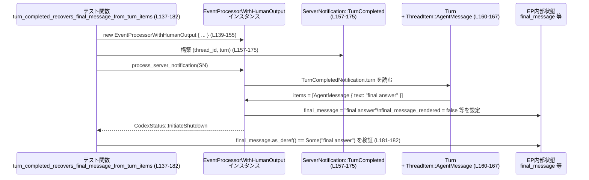

# exec/src/event_processor_with_human_output_tests.rs

## 0. ざっくり一言

`EventProcessorWithHumanOutput` とその周辺ユーティリティ（最終メッセージ出力条件・推論テキスト選択・turn items からの最終メッセージ抽出）のふるまいをテストで保証するファイルです。  
特に「いつ何をユーザーに見せるか」「ストリーミング出力と最終通知の関係」を検証しています。

---

## 1. このモジュールの役割

### 1.1 概要

このテストモジュールは、次の問題を検証しています。

- **最終メッセージをどこに出すか**（stdout / TTY）をどう判定するか  
- **要約と生 reasoning** のどちらを表示するかをどう決めるか  
- `ThreadItem` の列から **どのテキストを「最終メッセージ」とみなすか**  
- `ServerNotification::TurnCompleted` を受けたとき、`EventProcessorWithHumanOutput` が  
  **`final_message` と関連フラグをどう更新し、どのステータスを返すか**

いずれも「人間向け出力の最終形がどう決まるか」という観点の仕様テストです。

### 1.2 アーキテクチャ内での位置づけ

このファイルはテスト専用であり、本体ロジックは `super` や `crate::event_processor` にあります。  
依存関係を簡略化すると次のようになります。

```mermaid
graph TD
    subgraph "このファイル (exec/src/event_processor_with_human_output_tests.rs)"
        T[テスト関数群<br/>L15-360]
    end

    EP[super::EventProcessorWithHumanOutput<br/>(構造体, 実装はこのチャンク外)]
    F_stdout[super::should_print_final_message_to_stdout<br/>(L15-48 を通じてテスト)]
    F_tty[super::should_print_final_message_to_tty<br/>(L50-68 を通じてテスト)]
    F_reason[super::reasoning_text<br/>(L70-90 を通じてテスト)]
    F_final[super::final_message_from_turn_items<br/>(L92-135 を通じてテスト)]

    Proto_Server[codex_app_server_protocol::ServerNotification<br/>Turn/ThreadItem/TurnStatus]
    Trait_EP[crate::event_processor::EventProcessor<br/>(trait, 実体はこのチャンク外)]
    CodexStatus[crate::event_processor::CodexStatus::InitiateShutdown]

    T --> F_stdout
    T --> F_tty
    T --> F_reason
    T --> F_final
    T --> EP
    EP --> Trait_EP
    T --> Proto_Server
    T --> CodexStatus
```

- テストは `super` からインポートした関数・構造体に対して振る舞いを検証しています（L8-13）。
- `EventProcessorWithHumanOutput` は `EventProcessor` トレイトを実装し、`process_server_notification` を持つことがテストから分かります（L137-182 など）。
- 入力イベントは `codex_app_server_protocol::ServerNotification::TurnCompleted` と `Turn` / `ThreadItem` / `TurnStatus` です（L157-173, L204-220, L252-263, L295-306, L339-350）。

### 1.3 設計上のポイント（テストから読み取れる仕様）

※ 実装コードはこのチャンクにないため、「テストが要求している仕様」として記述します。

- **出力先の分離**  
  - stdout に書くべきか、TTY（端末）向けに書くべきかを別関数で判定  
    - `should_print_final_message_to_stdout`（L15-48）  
    - `should_print_final_message_to_tty`（L50-68）

- **reasoning の公開レベル切り替え**  
  - `reasoning_text` が「サマリ」と「生 reasoning コンテンツ」のどちらを返すかを `show_raw_agent_reasoning` で切り替え（L70-90）。

- **最終メッセージの選択ロジック**  
  - `final_message_from_turn_items` は `ThreadItem` 群から「最後の AgentMessage を優先し、なければ最後の Plan を使う」という挙動を満たす必要があります（L92-135）。

- **ストリーミングと最終通知の整合性**  
  - ストリーミング中に蓄積した `final_message` と、`TurnCompleted` 通知に含まれる `items` のどちらを採用するかを、turn の `status` と `items` の有無で切り替えています（L137-360）。
    - Completed + items あり → turn items から再取得して上書き（L137-182, L184-230）
    - Completed + items 空 → 既存 `final_message` を維持し、シャットダウン時出力フラグを立てる（L232-273）
    - Failed / Interrupted → stale な `final_message` とフラグをクリア（L275-316, L319-360）

- **安全性 / エラー / 並行性**  
  - すべてのテストは単一スレッドで `&mut processor` を操作し、所有権と可変借用の Rust ルールに従っています（例: L137-155 で `let mut processor = ...`）。  
  - エラーは `Result` ではなくテストとして失敗（`assert!`, `assert_eq!`）する形で扱われており、このファイル内に明示的なエラー型は出てきません。

---

## 2. 主要な機能一覧（このテストが検証している仕様）

- 最終 stdout メッセージ出力判定: `should_print_final_message_to_stdout` の挙動（L15-48）
- 最終 TTY メッセージ出力判定: `should_print_final_message_to_tty` の挙動（L50-68）
- reasoning テキスト選択: `reasoning_text` による summary/raw の切替（L70-90）
- turn items からの最終メッセージ抽出: `final_message_from_turn_items` の優先順位（L92-135）
- TurnCompleted 完了時の状態更新:
  - Completed + items あり: final_message を turn items から復元し、shutdown を開始（L137-182, L184-230）
  - Completed + items 空: ストリーミングされた final_message を維持し、shutdown 時出力フラグを立てる（L232-273）
  - Failed / Interrupted: stale final_message と関連フラグをクリアして shutdown（L275-316, L319-360）

---

## 3. 公開 API と詳細解説

### 3.1 型一覧（構造体・列挙体など）

※ 型定義自体はこのファイルにありませんが、テストから分かる利用目的を整理します。

| 名前 | 種別 | 役割 / 用途 | 根拠 |
|------|------|-------------|------|
| `EventProcessorWithHumanOutput` | 構造体（super からインポート） | サーバーからのイベントを処理し、人間向けの最終メッセージや reasoning 出力を管理するプロセッサ。テスト内でフィールドを直接初期化しているため、フィールド構成も一部分かります。 | `exec/src/event_processor_with_human_output_tests.rs:L8, L139-155, L186-202, L234-250, L278-293, L321-337` |
| `ServerNotification` | enum（外部 crate） | サーバーからクライアントへの通知。ここでは `ServerNotification::TurnCompleted` バリアントのみを使用。 | L1, L157, L204, L252, L295, L339 |
| `Turn` | 構造体（外部 crate） | 1 回のターンの情報。`id`, `items`, `status`, `error`, 時刻情報を含む。 | L3, L160-173, L207-220, L255-263, L298-306, L342-350 |
| `TurnStatus` | enum（外部 crate） | ターンの状態。テストでは `Completed`, `Failed`, `Interrupted` を使用。 | L4, L168, L215, L258, L301, L345 |
| `ThreadItem` | enum（外部 crate） | スレッド内での要素。`AgentMessage`, `Plan`, `Reasoning` をテストが利用。 | L2, L95-110, L119-123, L162-167, L209-214 |
| `Style` | 構造体（`owo_colors`） | 色やスタイル設定。`EventProcessorWithHumanOutput` の出力スタイルフィールドとして使用。 | L5, L139-147 など |
| `EventProcessor` | トレイト（`crate::event_processor`） | `process_server_notification` メソッドを提供するイベント処理インターフェース。`EventProcessorWithHumanOutput` がこれを実装していると推測されます。 | L13, L157-175 など |
| `CodexStatus` | enum（`crate::event_processor` 内） | イベント処理の進行状態。ここでは `CodexStatus::InitiateShutdown` のみ検証。 | L177-180, L224-227, L267-270, L310-313, L354-357 |

`EventProcessorWithHumanOutput` のフィールド構成（テストから分かる範囲）は次のとおりです。

| フィールド名 | 型（推定含む） | 説明 | 根拠 |
|-------------|----------------|------|------|
| `bold`, `cyan`, `dimmed`, `green`, `italic`, `magenta`, `red`, `yellow` | `Style` | 各種テキストスタイル。人間向け出力時の装飾に使用されると考えられます。 | L139-147, L186-194, L234-242, L278-286, L321-329 |
| `show_agent_reasoning` | `bool` | 推論（reasoning）を表示するかどうかのフラグ。 | L148, L195, L243, L286, L330 |
| `show_raw_agent_reasoning` | `bool` | 生の推論コンテンツを表示するかどうか。`reasoning_text` の挙動とも関係。 | L149, L196, L244, L287, L331 |
| `last_message_path` | `Option<…>`（型はこのチャンクでは不明） | 最後のメッセージの出力先パスなどを保持している可能性がありますが、ここでは常に `None`。 | L150, L197, L245, L288, L332 |
| `final_message` | `Option<String>` 相当 | 最終メッセージ（ストリーミング途中も含む）を保持。テストで `Some("…".to_string())` を代入し、`.as_deref()` で参照される。 | L151, L198-199, L246-247, L289-290, L333-334, L181, L228-229, L271, L314, L358 |
| `final_message_rendered` | `bool` | `final_message` がすでにユーザーに表示済みかどうか。 | L152, L199, L247, L290, L335, L229, L315, L359 |
| `emit_final_message_on_shutdown` | `bool` | シャットダウン時に `final_message` を出力する必要があるかどうかのフラグ。 | L153, L200, L248, L291, L336, L272, L316, L360 |
| `last_total_token_usage` | `Option<…>`（型はこのチャンクでは不明） | トークン使用量の合計など、統計情報を持つ可能性がありますが、ここでは常に `None`。 | L154-155, L201-202, L249-250, L292-293, L336-337 |

### 3.2 関数詳細（主要 5 件）

以下は **このテストファイルから分かる契約** を中心にまとめています。  
実装本体は他ファイルにあり、このチャンクからは確認できません。

---

#### `should_print_final_message_to_stdout(final_message, stdout_is_terminal, stderr_is_terminal) -> bool`

**概要**

- 最終メッセージを **stdout に出力すべきかどうか** を判定する関数です。
- テストから、以下の条件を満たす必要があります（L15-48）。

**引数（テストから分かる範囲）**

| 引数名 | 型（推定含む） | 説明 |
|--------|----------------|------|
| `final_message` | `Option<…>`（`Some("hello")` や `None` が渡される） | 出力候補となる最終メッセージ。`None` の場合はメッセージが存在しない状態。 |
| `stdout_is_terminal` | `bool` | stdout が TTY（端末）かどうか。コメントで明示（L19, L28, L45）。 |
| `stderr_is_terminal` | `bool` | stderr が TTY かどうか。コメントで明示（L20, L29, L46）。 |

**戻り値**

- `bool`  
  - `true`: stdout に最終メッセージを出力すべき。  
  - `false`: stdout には出力すべきでない。

**テストから確認できる挙動**

1. **メッセージが存在しない場合は常に false**  
   - `final_message = None`, 端末フラグがすべて false の場合、false を返します（L42-48）。  
     → メッセージがなければ stdout に何も出さない。

2. **両方のストリームが端末のときは suppress（出さない）**  
   - `Some("hello")`, `stdout_is_terminal = true`, `stderr_is_terminal = true` のとき false（L15-22）。  
     → すでに TTY 行きのメッセージが別経路で出ることを前提に、stdout での重複表示を避ける意図が読み取れます。

3. **いずれか一方が非端末なら出力**  
   - stdout が非端末（例えばパイプ/ファイル）で stderr は端末 → true（L24-31）。  
   - stdout が端末で stderr が非端末 → true（L33-40）。  
   → 「どこか 1 つでも非端末があるなら stdout にも出してよい」という契約になっています。

**内部処理の流れ（テストから分かる最小限の契約）**

実装は見えませんが、テストから少なくとも次の条件を満たすロジックである必要があります。

- `final_message` が `None` の場合、常に `false` を返す（L42-48）。
- `final_message` が `Some(_)` の場合:
  - `stdout_is_terminal && stderr_is_terminal` のとき `false`（L15-22）。
  - 上記以外（どちらかが非端末）のとき `true`（L24-31, L33-40）。

**Examples（使用例）**

```rust
// final_message があり、標準出力はパイプ、標準エラーは端末のケース
let should_print = should_print_final_message_to_stdout(
    Some("final answer"),  // 出力したい最終メッセージ
    false,                 // stdout は非端末（例: パイプ）
    true,                  // stderr は端末
);
// テストと同様に true になることが期待される
assert!(should_print);
```

**Errors / Panics**

- このテストからは、どの入力に対しても panic やエラーを返す様子は見られません（L15-48）。

**Edge cases（エッジケース）**

- `final_message = None` → 必ず `false`（L42-48）。
- 両方のストリームが端末 (`true, true`) → `false`（L15-22）。
- 片方のみ端末 (`false, true` / `true, false`) → `true`（L24-31, L33-40）。
- その他の組み合わせ（例えば将来 `isatty` の判定が追加条件を持つなど）は、このチャンクからは不明です。

**使用上の注意点**

- 最終メッセージを stdout に出したい場合、`final_message` が `Some` である必要があります。  
  `None` のままでは出力されません（L42-48）。
- 両方のストリームが端末の環境（ローカルの普通のターミナルなど）では stdout には出力されないため、TTY 用の別経路（`should_print_final_message_to_tty` 側）での表示を前提としていると考えられます（L15-22）。

---

#### `should_print_final_message_to_tty(final_message, final_message_rendered, stdout_is_terminal, stderr_is_terminal) -> bool`

**概要**

- 最終メッセージを **TTY（端末）向けに表示すべきかどうか** を判定する関数です。
- テストは「未表示なら出す」「既に表示済みなら出さない」という挙動を確認しています（L50-68）。

**引数（テストから分かる範囲）**

| 引数名 | 型（推定含む） | 説明 |
|--------|----------------|------|
| `final_message` | `Option<…>` | 表示候補の最終メッセージ。ここでは常に `Some("hello")` でテスト（L52-53, L62-63）。 |
| `final_message_rendered` | `bool` | すでに最終メッセージを表示済みかどうか。コメントで明示（L54, L64）。 |
| `stdout_is_terminal` | `bool` | stdout が端末かどうか。 | L55, L65 |
| `stderr_is_terminal` | `bool` | stderr が端末かどうか。 | L56, L66 |

**戻り値**

- `bool`  
  - `true`: TTY に最終メッセージを表示すべき。  
  - `false`: TTY には表示すべきでない。

**テストから確認できる挙動**

1. **未表示の場合は表示する**  
   - `final_message = Some("hello")`  
   - `final_message_rendered = false`  
   - 両ストリームが端末 (`true, true`)  
   → `true` を返す（L50-57）。

2. **すでに表示済みなら表示しない**  
   - 上記と同じ条件で `final_message_rendered = true` にすると `false`（L60-67）。

端末フラグの組み合わせによる違いはテストされていないため、このチャンクからは詳細不明です。

**内部処理の流れ（テストから分かる最小限の契約）**

- `final_message_rendered == true` であれば `false` を返す必要があります（L60-67）。
- `final_message` が `Some` で `final_message_rendered == false` であり、少なくとも stdout・stderr が端末のケースでは `true` を返す必要があります（L50-57）。

**Examples（使用例）**

```rust
// まだ最終メッセージを表示していない場合
let should_render_tty = should_print_final_message_to_tty(
    Some("final answer"), // 最終メッセージ
    false,                // 未表示
    true,                 // stdout は端末
    true,                 // stderr も端末
);
assert!(should_render_tty);

// 一度表示した後に再度呼ぶと false になることが期待される
let should_render_again = should_print_final_message_to_tty(
    Some("final answer"),
    true,  // 既に表示済み
    true,
    true,
);
assert!(!should_render_again);
```

**Errors / Panics**

- このテストからは panic やエラーの発生は確認できません（L50-68）。

**Edge cases（エッジケース）**

- `final_message = None` の場合の挙動は、このチャンクのテストではカバーされておらず不明です。
- 端末フラグの組み合わせによる違いも、このファイルでは検証されていません。

**使用上の注意点**

- `final_message_rendered` フラグを適切に管理しないと、TTY に同じメッセージを重複表示したり、逆に表示し忘れる可能性があります（L50-68）。
- stdout/stderr の端末性による分岐がある可能性がありますが、詳細は実装側コードを確認する必要があります（このチャンクには現れません）。

---

#### `reasoning_text(summary: &[String], raw: &[String], show_raw_agent_reasoning: bool) -> Option<…>`

**概要**

- エージェントの reasoning（思考過程）表示用テキストとして、**summary** か **raw content** のどちらを使うかを選択する関数です。
- 返り値は `Option` で、`Some(…)` の中身は Deref により `&str` として扱える型（`String` など）です（`as_deref` を利用、L78-79, L89）。

**引数**

| 引数名 | 型（推定含む） | 説明 |
|--------|----------------|------|
| `summary` | スライス `&[String]` または同等 | 要約済みの reasoning テキスト群。ここでは要素 1 個 `"summary"` のベクタ参照を渡しています（L72-74, L83-85）。 |
| `raw` | スライス `&[String]` または同等 | 生の reasoning コンテンツ。ここでは `"raw"` 1 要素（L73-75, L84-86）。 |
| `show_raw_agent_reasoning` | `bool` | 生 reasoning を表示するかどうかを制御するフラグ。 | L75-76, L86-87 |

**戻り値**

- `Option<T>`（`T: Deref<Target = str>`）  
  - テストでは `text.as_deref()` を取り、`Option<&str>` に変換して比較しています（L78-79, L88-89）。

**テストから確認できる挙動**

1. `show_raw_agent_reasoning = false` のとき  
   - `summary = ["summary"]`, `raw = ["raw"]` の入力に対して `Some("summary")` を返す（L70-79）。

2. `show_raw_agent_reasoning = true` のとき  
   - 同じ入力に対して `Some("raw")` を返す（L81-89）。

**内部処理の流れ（テストから分かる最小限の契約）**

- `show_raw_agent_reasoning == false` → `summary` の内容からテキストを返す（少なくとも先頭要素が使われている）（L70-79）。
- `show_raw_agent_reasoning == true` → `raw` の内容からテキストを返す（L81-89）。
- 空の `summary` / `raw` が渡されたときの挙動は、このチャンクからは不明です。

**Examples（使用例）**

```rust
let summary = vec!["Short summary".to_string()];
let raw = vec!["Very detailed internal reasoning".to_string()];

// 生 reasoning を隠す設定の場合
let text = reasoning_text(&summary, &raw, false);
assert_eq!(text.as_deref(), Some("Short summary"));

// 生 reasoning を表示する設定の場合
let text = reasoning_text(&summary, &raw, true);
assert_eq!(text.as_deref(), Some("Very detailed internal reasoning"));
```

**Errors / Panics**

- このテストでは、あらゆる入力に対する panic は確認されていません（L70-90）。

**Edge cases（エッジケース）**

- `summary` または `raw` が空配列の場合の挙動は不明です。
- 両者が複数要素を持つ場合、どの要素が選ばれるか（先頭か結合かなど）も、このチャンクからは判断できません。

**使用上の注意点**

- `show_raw_agent_reasoning` の値によって出力が大きく変わるため、**ユーザーにどこまで reasoning を見せるか** というポリシー設定と連動させる必要があります（L70-90）。
- summary/raw のどちらかが空の場合の扱いは実装を確認する必要があり、このテストだけでは保証されていません。

---

#### `final_message_from_turn_items(items: &[ThreadItem]) -> Option<…>`

**概要**

- `Turn` 内の `ThreadItem` 列から、「ユーザーに見せるべき最終メッセージ」のテキストを抽出する関数です。
- テストから、「AgentMessage を優先し、なければ Plan を使う」という優先順位が要求されていることが分かります（L92-135）。

**引数**

| 引数名 | 型 | 説明 |
|--------|----|------|
| `items` | `&[ThreadItem]` | `ThreadItem` のスライス。`AgentMessage` / `Plan` / `Reasoning` などが含まれます。 |

**戻り値**

- `Option<T>`（`T: Deref<Target = str>`）  
  - テストでは `message.as_deref()` として `Option<&str>` に変換して比較しています（L113-114, L134-135）。

**テストから確認できる挙動**

1. **AgentMessage が存在する場合**  
   - `AgentMessage("first")`, `Plan("plan")`, `AgentMessage("second")` の順に items を渡すと、`Some("second")` を返す（L92-114）。  
     → 最後の `AgentMessage` の `text` を返す契約になっています。

2. **AgentMessage が無く Plan のみの場合**  
   - `Reasoning`, `Plan("first plan")`, `Plan("final plan")` の順に items を渡すと、`Some("final plan")` を返す（L116-135）。  
     → AgentMessage がないときは、最後の `Plan` の `text` を返す契約です。

**内部処理の流れ（テストから分かる最小限の契約）**

- `items` に 1 つ以上の `ThreadItem::AgentMessage { text, .. }` がある場合  
  → その中の「一番後ろの要素」の `text` を返す（L92-114）。
- `AgentMessage` が 1 つもなく、`ThreadItem::Plan { text, .. }` が 複数ある場合  
  → その中で一番後ろの `text` を返す（L116-135）。
- 上記のどちらも存在しない場合（例: Reasoning のみ、または空配列）の挙動は、このチャンクからは不明です。

**Examples（使用例）**

```rust
use codex_app_server_protocol::ThreadItem;

// AgentMessage を含むケース
let items = vec![
    ThreadItem::AgentMessage {
        id: "msg-1".to_string(),
        text: "first".to_string(),
        phase: None,
        memory_citation: None,
    },
    ThreadItem::Plan {
        id: "plan-1".to_string(),
        text: "plan".to_string(),
    },
    ThreadItem::AgentMessage {
        id: "msg-2".to_string(),
        text: "second".to_string(),
        phase: None,
        memory_citation: None,
    },
];

let message = final_message_from_turn_items(&items);
assert_eq!(message.as_deref(), Some("second")); // L92-114 と同じパターン
```

**Errors / Panics**

- テストでは panic は発生せず、`items` が空のケースも別のテスト（`TurnCompleted` のシナリオ）で問題なく処理されています（L232-263 など）。  
  `final_message_from_turn_items` 自体の空入力挙動は不明ですが、 `Option` を返しているため、panic ではなく `None` を返す設計である可能性が高いと推測されます（ただしこのチャンクからは断定できません）。

**Edge cases（エッジケース）**

- `items` が空、または `Reasoning` のみ → 挙動はこのチャンクでは確認できません。
- `AgentMessage` と `Plan` が混在し、`AgentMessage` が先にあるがその後に `Plan` のみ続くなどの複雑なパターン → テストはカバーしていません。

**使用上の注意点**

- 「最終メッセージとして何をユーザーに見せるか」はこの関数の仕様に依存します。  
  AgentMessage がある turn では、それが優先される（Plan は fallback）ことを前提に全体設計を行う必要があります（L92-135）。
- AgentMessage/Plan 以外の ThreadItem（Reasoning など）は最終メッセージとしては使われない契約であることに注意が必要です（L118-123）。

---

#### `EventProcessorWithHumanOutput::process_server_notification(&mut self, notification: ServerNotification) -> CodexStatus`

**概要**

- サーバーからの通知（ここでは `TurnCompleted` のみ）を処理し、内部状態（`final_message` など）を更新するとともに、クライアント全体の状態を示す `CodexStatus` を返すメソッドです。
- テストは **5 つのシナリオ**（Completed 3 種類、Failed, Interrupted）を通じて、`final_message` と関連フラグの更新ロジックが正しく動くことを検証しています（L137-360）。

**引数**

| 引数名 | 型 | 説明 |
|--------|----|------|
| `self` | `&mut EventProcessorWithHumanOutput` | プロセッサのインスタンス。テストでは毎回新しく生成されている（L139-155 ほか）。 |
| `notification` | `ServerNotification` | サーバーからの通知。ここでは `ServerNotification::TurnCompleted(TurnCompletedNotification { … })` のみ使用（L157-175, L204-222, L252-265, L295-308, L339-352）。 |

**戻り値**

- `crate::event_processor::CodexStatus`  
  - テストでは常に `CodexStatus::InitiateShutdown` が返されている（L177-180, L224-227, L267-270, L310-313, L354-357）。

**テストで検証されているシナリオと挙動**

1. **Completed + items に AgentMessage が 1 件（final_message なし）**  
   - 初期状態: `final_message = None`, `final_message_rendered = false`, `emit_final_message_on_shutdown = false`（L139-155）。  
   - Turn: `status = TurnStatus::Completed`, items = `AgentMessage("final answer")` のみ（L160-168）。  
   - 結果:
     - `status == CodexStatus::InitiateShutdown`（L177-180）。  
     - `processor.final_message.as_deref() == Some("final answer")`（L181-182）。  
   → Completed 通知に含まれる items から final_message を復元し、shutdown を開始する。

2. **Completed + items に AgentMessage があり、古い final_message が既に存在する**  
   - 初期状態: `final_message = Some("stale answer")`, `final_message_rendered = true`（L186-202）。  
   - Turn: Completed + items に `AgentMessage("final answer")`（L207-215）。  
   - 結果:
     - `status == CodexStatus::InitiateShutdown`（L224-227）。  
     - `processor.final_message == Some("final answer")` に上書き（L228）。  
     - `processor.final_message_rendered == false` にリセット（L229）。  
   → 古い final_message は TurnCompleted の内容で上書きされ、表示状態フラグも「未表示」に戻されます。

3. **Completed + items 空、final_message はストリーミング済み（未表示）**  
   - 初期状態: `final_message = Some("streamed answer")`, `final_message_rendered = false`, `emit_final_message_on_shutdown = false`（L234-250）。  
   - Turn: Completed + items = 空のベクタ（L255-258）。  
   - 結果:
     - `status == CodexStatus::InitiateShutdown`（L267-270）。  
     - `processor.final_message` は `"streamed answer"` のまま維持（L271）。  
     - `processor.emit_final_message_on_shutdown == true` にセット（L272）。  
   → items が空の場合は、ストリーミングで蓄積した final_message をそのまま最終結果とみなし、シャットダウン時に出力するフラグを立てる。

4. **Failed + items 空、final_message は stale（表示済み）**  
   - 初期状態: `final_message = Some("partial answer")`, `final_message_rendered = true`, `emit_final_message_on_shutdown = true`（L278-293）。  
   - Turn: `status = TurnStatus::Failed`, items = 空（L299-301）。  
   - 結果:
     - `status == CodexStatus::InitiateShutdown`（L310-313）。  
     - `processor.final_message == None` にクリア（L314）。  
     - `processor.final_message_rendered == false`（L315）。  
     - `processor.emit_final_message_on_shutdown == false`（L316）。  
   → 失敗したターンでは、部分的な回答を最終メッセージとして保持/出力しないよう、関連状態をすべてリセットする。

5. **Interrupted + items 空、final_message は stale（表示済み）**  
   - 初期状態は Failed のケースと同様（L321-337）。  
   - Turn: `status = TurnStatus::Interrupted`, items = 空（L343-345）。  
   - 結果:
     - `status == CodexStatus::InitiateShutdown`（L354-357）。  
     - final_message/フラグのクリアも Failed ケースと同様（L358-360）。  
   → 中断されたターンも同様に「最終メッセージとして使わない」扱いになります。

**内部処理の流れ（テストから推測される高レベルフロー）**

実装は見えませんが、テストから推測できる処理フローをまとめると次のようになります。

1. `ServerNotification::TurnCompleted` を受け取る。
2. `TurnStatus` によって分岐:
   - `Completed`:
     - `turn.items` が空でなければ、`final_message_from_turn_items` を使って最終メッセージを抽出し、`self.final_message` を上書きし、`final_message_rendered = false` にする（L137-182, L184-230）。
     - `turn.items` が空で、`self.final_message` が保持されている場合はそれを維持し、`emit_final_message_on_shutdown = true` にする（L232-273）。
   - `Failed` / `Interrupted`:
     - `self.final_message = None` とし、`final_message_rendered = false`, `emit_final_message_on_shutdown = false` にリセット（L275-316, L319-360）。
3. いずれのパスでも `CodexStatus::InitiateShutdown` を返す（L177-180, L224-227, L267-270, L310-313, L354-357）。

**Examples（使用例）**

テストを簡略化した使用例です。

```rust
use codex_app_server_protocol::{ServerNotification, ThreadItem, Turn, TurnStatus};
use crate::event_processor::EventProcessor;

// プロセッサの初期化（スタイルやフラグはテストと同様）
let mut processor = EventProcessorWithHumanOutput {
    bold: Style::new(),
    cyan: Style::new(),
    dimmed: Style::new(),
    green: Style::new(),
    italic: Style::new(),
    magenta: Style::new(),
    red: Style::new(),
    yellow: Style::new(),
    show_agent_reasoning: true,
    show_raw_agent_reasoning: false,
    last_message_path: None,
    final_message: None,
    final_message_rendered: false,
    emit_final_message_on_shutdown: false,
    last_total_token_usage: None,
};

// Completed + AgentMessage 1 件の TurnCompleted を処理
let status = processor.process_server_notification(ServerNotification::TurnCompleted(
    codex_app_server_protocol::TurnCompletedNotification {
        thread_id: "thread-1".to_string(),
        turn: Turn {
            id: "turn-1".to_string(),
            items: vec![ThreadItem::AgentMessage {
                id: "msg-1".to_string(),
                text: "final answer".to_string(),
                phase: None,
                memory_citation: None,
            }],
            status: TurnStatus::Completed,
            error: None,
            started_at: None,
            completed_at: Some(0),
            duration_ms: None,
        },
    },
));

assert_eq!(status, crate::event_processor::CodexStatus::InitiateShutdown);
assert_eq!(processor.final_message.as_deref(), Some("final answer"));
```

**Errors / Panics**

- テストでは、どのシナリオでも panic は発生していません（L137-360）。
- `ServerNotification` の他バリアントに対する挙動や、`error` フィールドが `Some` のときの扱いは、このチャンクに存在しないため不明です（L169-170, L216-217, L259-260, L302-303, L346-347 ではすべて `error: None`）。

**Edge cases（エッジケース）**

- Turn が Completed だが `items` に AgentMessage/Plan が全く含まれないケース（Reasoning のみなど）はテストされていません。
- `status` が他の値（もし存在するなら）である場合の挙動も不明です（このチャンクには `Completed`, `Failed`, `Interrupted` しか現れません）。
- `final_message` が `Some` で `final_message_rendered = false` かつ `Completed + items 非空` のパターンはテストされていません。

**使用上の注意点**

- `TurnCompleted` を受け取った時点で、どのステータスでも `CodexStatus::InitiateShutdown` が返ってくる契約になっています（L177-180, L224-227, L267-270, L310-313, L354-357）。  
  つまり、1 ターン完了（成功・失敗・中断問わず）でプロセスを終了させる前提の設計です。
- ストリーミングで final_message を構築する場合、`Completed + items 空` のケースで `emit_final_message_on_shutdown` に依存するようになります（L232-273）。  
  これを使う場合は、シャットダウン処理側で当該フラグを必ず確認する必要があります。
- `Failed` / `Interrupted` の場合は stale な final_message を強制的に捨てる仕様であるため、「途中までの回答でも見せたい」という要件とは相性がよくありません（L275-316, L319-360）。その場合は仕様変更とテスト追加が必要になります。

---

### 3.3 その他の関数（テスト関数一覧）

このファイル内で定義されている `#[test]` 関数の一覧です。

| 関数名 | 役割（1 行） | 根拠 |
|--------|--------------|------|
| `suppresses_final_stdout_message_when_both_streams_are_terminals` | 両ストリームが端末のとき stdout 最終メッセージを抑制することを検証。 | L15-22 |
| `prints_final_stdout_message_when_stdout_is_not_terminal` | stdout が端末でないときに stdout 出力を許可することを検証。 | L24-31 |
| `prints_final_stdout_message_when_stderr_is_not_terminal` | stderr が端末でないときに stdout 出力を許可することを検証。 | L33-40 |
| `suppresses_final_stdout_message_when_missing` | final_message が `None` のとき stdout に出力しないことを検証。 | L42-48 |
| `prints_final_tty_message_when_not_yet_rendered` | まだレンダリングされていない final_message が TTY に出ることを検証。 | L50-57 |
| `suppresses_final_tty_message_when_already_rendered` | すでにレンダリング済みの final_message を TTY に再表示しないことを検証。 | L60-67 |
| `reasoning_text_prefers_summary_when_raw_reasoning_is_hidden` | raw reasoning が非表示設定のとき summary を優先することを検証。 | L70-79 |
| `reasoning_text_uses_raw_content_when_enabled` | raw reasoning 表示設定のとき raw コンテンツを使うことを検証。 | L81-89 |
| `final_message_from_turn_items_uses_latest_agent_message` | turn items から最終 AgentMessage を最終メッセージとして選ぶことを検証。 | L92-114 |
| `final_message_from_turn_items_falls_back_to_latest_plan` | AgentMessage がない場合、最終 Plan を最終メッセージとして選ぶことを検証。 | L116-135 |
| `turn_completed_recovers_final_message_from_turn_items` | Completed + items ありの TurnCompleted で final_message を復元し shutdown を開始することを検証。 | L137-182 |
| `turn_completed_overwrites_stale_final_message_from_turn_items` | Completed + items ありの TurnCompleted が stale final_message を上書きし rendered フラグをリセットすることを検証。 | L184-230 |
| `turn_completed_preserves_streamed_final_message_when_turn_items_are_empty` | Completed + items 空の TurnCompleted でストリーミング済み final_message を維持し shutdown 時出力フラグを立てることを検証。 | L232-273 |
| `turn_failed_clears_stale_final_message` | Failed ターンで stale final_message と関連フラグをクリアすることを検証。 | L275-316 |
| `turn_interrupted_clears_stale_final_message` | Interrupted ターンで stale final_message と関連フラグをクリアすることを検証。 | L319-360 |

---

## 4. データフロー

ここでは `EventProcessorWithHumanOutput::process_server_notification` 周辺のデータフローを、Completed + items ありのケースで示します。

### 概要

- サーバーから `TurnCompleted` 通知が来る。
- 通知内の `Turn` から `ThreadItem` が渡され、最終メッセージが抽出される。
- `EventProcessorWithHumanOutput` は `final_message` を更新し、`CodexStatus::InitiateShutdown` を返す。

### シーケンス図



- 他のシナリオ（items 空 / Failed / Interrupted）でも同じ `process_server_notification` が呼ばれますが、`TurnStatus` と `items` の有無によって `State` の更新内容だけが変化します（L184-230, L232-273, L275-316, L319-360）。

---

## 5. 使い方（How to Use）

### 5.1 基本的な使用方法（テストに基づく）

`EventProcessorWithHumanOutput` を利用する基本フローは、テストが示す次の形になります。

1. スタイル・フラグなどを指定して `EventProcessorWithHumanOutput` を構築する。
2. サーバーから受け取った `ServerNotification::TurnCompleted` を渡して `process_server_notification` を呼ぶ。
3. 戻り値の `CodexStatus` と `final_message` / フラグを確認し、必要に応じて出力処理やシャットダウン処理を行う。

```rust
use codex_app_server_protocol::{ServerNotification, ThreadItem, Turn, TurnStatus};
use crate::event_processor::EventProcessor;
use owo_colors::Style;

let mut processor = EventProcessorWithHumanOutput {
    bold: Style::new(),
    cyan: Style::new(),
    dimmed: Style::new(),
    green: Style::new(),
    italic: Style::new(),
    magenta: Style::new(),
    red: Style::new(),
    yellow: Style::new(),
    show_agent_reasoning: true,
    show_raw_agent_reasoning: false,
    last_message_path: None,
    final_message: None,
    final_message_rendered: false,
    emit_final_message_on_shutdown: false,
    last_total_token_usage: None,
};

// サーバーからの TurnCompleted 通知（Completed + AgentMessage 1件）
let notification = ServerNotification::TurnCompleted(
    codex_app_server_protocol::TurnCompletedNotification {
        thread_id: "thread-1".to_string(),
        turn: Turn {
            id: "turn-1".to_string(),
            items: vec![ThreadItem::AgentMessage {
                id: "msg-1".to_string(),
                text: "final answer".to_string(),
                phase: None,
                memory_citation: None,
            }],
            status: TurnStatus::Completed,
            error: None,
            started_at: None,
            completed_at: Some(0),
            duration_ms: None,
        },
    },
);

// 通知を処理
let status = processor.process_server_notification(notification);

// ステータスと最終メッセージを確認
assert_eq!(status, crate::event_processor::CodexStatus::InitiateShutdown);
if let Some(msg) = processor.final_message.as_deref() {
    println!("Final message: {msg}");
}
```

### 5.2 よくある使用パターン

1. **ストリーミング + Completed (items 空) パターン**

   - ストリーミング中に `processor.final_message` を更新しておき、最終的に `TurnCompleted` が来たとき `items` が空であれば、その値をそのまま最終メッセージとして採用し、シャットダウン時に出力する（L232-273）。
   - シャットダウン処理側は `emit_final_message_on_shutdown` を見て、必要であれば `final_message` を表示する。

2. **失敗 / 中断時に部分回答を捨てるパターン**

   - 途中まで生成された回答（`partial answer`）が残っていても、`Failed` や `Interrupted` の `TurnCompleted` を受け取った時点で `final_message` をクリアし、ユーザーには見せない（L275-316, L319-360）。
   - これは「不完全または信用できない回答を UI に残さない」という方針を反映したパターンです。

3. **stdout / TTY 出力制御**

   - CLI ツールで、TTY 向けには色付き・整形済みの最終メッセージを出し、stdout にはプレーンテキストだけを出したい場合に、  
     `should_print_final_message_to_stdout` / `should_print_final_message_to_tty` を使って出力先を切り替える（L15-68）。

### 5.3 よくある間違い（テストから推測されるもの）

```rust
// 間違い例: final_message が None のまま stdout に出そうとしている
let should_print = should_print_final_message_to_stdout(
    None,  // final_message を設定していない
    false,
    false,
);
// should_print は false になるので、何も出力されない（L42-48）
assert!(!should_print);

// 正しい例: final_message を Some(...) にしてから判定する
let should_print = should_print_final_message_to_stdout(
    Some("final answer"),
    false,
    false,
);
assert!(should_print);
```

```rust
// 間違い例: Failed/Interrupted 後も stale final_message を使おうとする
// （テストでは Failed/Interrupted 時に final_message をクリアする契約）
let status = processor.process_server_notification(failed_notification);
// この時点で final_message は None になっていることが期待される（L314, L358）
assert_eq!(processor.final_message, None);

// 正しい扱い: Failed/Interrupted では final_message に依存しない UI を構成する
```

### 5.4 使用上の注意点（まとめ）

- `TurnCompleted` のたびに `CodexStatus::InitiateShutdown` が返ってくるため、「複数ターンを 1 プロセスで処理する」設計とは合っていません（L137-360 全般）。
- `final_message` / `final_message_rendered` / `emit_final_message_on_shutdown` の 3 つの状態フラグは常に整合している必要があります。テストは代表的な組み合わせだけを検証しているため、その他のパターンでの変更時には追加テストが必要です。
- stdout / TTY 判定ロジック（`should_print_final_message_to_stdout` / `should_print_final_message_to_tty`）は、実行環境（パイプか TTY か）に依存するため、CI 上とローカルで挙動が変わらないよう注意が必要です。

---

## 6. 変更の仕方（How to Modify）

### 6.1 新しい機能を追加する場合（このテストファイル側）

- 例: 新しい `TurnStatus` バリアント（仮に `Cancelled`）が追加された場合、その挙動をテストするには次のような手順になります。

1. 新ステータス用のテストケースを追加する  
   - `#[test] fn turn_cancelled_behaviour()` のような関数をこのファイルに追加。
2. `EventProcessorWithHumanOutput` の初期状態を構築（他テストと同様にフィールドを明示）（L139-155 などを参考）。
3. `TurnStatus::Cancelled` を持つ `Turn` と `ServerNotification::TurnCompleted` を構築（L295-308, L339-352 を参考）。
4. `process_server_notification` を呼び、期待する `CodexStatus` と内部状態（`final_message` やフラグ）を `assert!` / `assert_eq!` で検証。

### 6.2 既存の機能を変更する場合（契約確認の観点）

- **最終メッセージ選択ロジックを変更する場合**  
  - 影響: `final_message_from_turn_items` と `TurnCompleted` シナリオのテスト（L92-135, L137-230）。  
  - 手順:
    - AgentMessage/Plan の優先順位を変える場合は、対応するテストを編集または追加。
    - 既存テストを落とさないようにするか、意図した仕様変更なら期待値を書き換える。

- **失敗時にも部分的な回答を見せたい場合**  
  - 影響: `turn_failed_clears_stale_final_message` / `turn_interrupted_clears_stale_final_message`（L275-316, L319-360）。  
  - 手順:
    - stale final_message をクリアする処理を変更する場合、上記 2 テストの期待値（`final_message == None` など）を仕様に合わせて変更。
    - 失敗/中断時でも final_message を保持したいのであれば、「どのタイミングでどの出力先に表示するか」について新しいテストを追加する。

- **stdout/TTY 判定ロジックの変更**  
  - 影響: `should_print_final_message_to_stdout` / `should_print_final_message_to_tty` 系テスト（L15-68）。  
  - 手順:
    - 端末フラグの扱いを変える（例: どちらも TTY でも stdout に出す）場合、対応するテストの期待値を変更する。
    - 追加の条件（環境変数や設定フラグ）を導入する場合、それを反映した新テストを追加する。

---

## 7. 関連ファイル

このテストモジュールと密接に関係するモジュール／ファイル（このチャンクから分かる範囲）です。

| パス / モジュール | 役割 / 関係 |
|-------------------|------------|
| `super::EventProcessorWithHumanOutput` | 本テストの主対象となる構造体。人間向け出力と final_message 管理を行う。構造体のフィールド構成は本ファイルで初期化されている（L139-155 ほか）。 |
| `super::final_message_from_turn_items` | `Turn` の `ThreadItem` 群から最終メッセージを抽出する関数。テストで優先順位（AgentMessage → Plan）が検証されている（L92-135）。 |
| `super::reasoning_text` | summary/raw reasoning 選択ロジックを持つ関数（L70-90）。 |
| `super::should_print_final_message_to_stdout` | stdout に最終メッセージを出力するかの判定関数（L15-48）。 |
| `super::should_print_final_message_to_tty` | TTY に最終メッセージを出力するかの判定関数（L50-68）。 |
| `crate::event_processor::EventProcessor` | `EventProcessorWithHumanOutput` が実装しているイベント処理トレイト（L13）。`process_server_notification` のインターフェースを提供。 |
| `crate::event_processor::CodexStatus` | イベント処理の状態を示す enum。ここでは `InitiateShutdown` のみ使用される（L177-180 ほか）。 |
| `codex_app_server_protocol` クレート（`ServerNotification`, `Turn`, `TurnStatus`, `ThreadItem`） | サーバーとのプロトコル定義。`TurnCompleted` 通知の中身やスレッド内アイテムの表現を提供（L1-4, L157-175 ほか）。 |

このチャンクには、これらモジュールの実装ファイルの具体的なパス（例: `exec/src/event_processor_with_human_output.rs` など）は現れないため、「どのファイルにあるか」は不明です。
