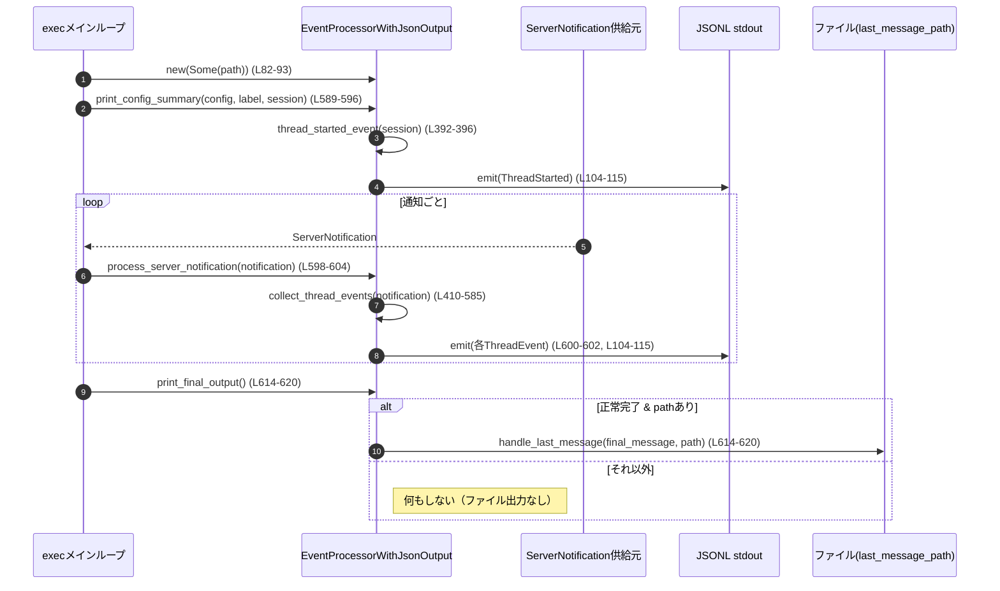

# exec/src/event_processor_with_jsonl_output.rs

## 0. ざっくり一言

`ServerNotification`（サーバー側の生イベント）を `ThreadEvent` に変換し、JSON Lines 形式で標準出力に流すためのイベントプロセッサ実装です。また、最終メッセージやトークン使用量などの状態を保持します。  
（根拠: 構造体定義とトレイト実装全体 `event_processor_with_jsonl_output.rs:L58-67, L588-621`）

---

## 1. このモジュールの役割

### 1.1 概要

- このモジュールは、`codex_app_server_protocol::ServerNotification` を受け取り、CLI 実行時用の `exec_events::ThreadEvent` に変換し、JSON で出力する役割を持ちます。  
  （`collect_thread_events`, `emit` 参照 `L104-115, L410-585`）
- 同時に、各アイテムの ID 管理、ToDo リスト状態、トークン使用量、最終メッセージ/エラーなどをキャッシュし、ターン完了時のまとめイベントや終了処理に利用します。  
  （フィールドと TurnCompleted 分岐 `L58-66, L492-548`）

### 1.2 アーキテクチャ内での位置づけ

このファイルは、抽象トレイト `EventProcessor` の実装として、サーバー通知と CLI 出力の間に入るアダプタです。

```mermaid
graph TD
    subgraph "codex_app_server_protocol"
        SN["ServerNotification\n(L12, L410-585)"]
        TI["ThreadItem\n(L13, L140-314)"]
    end

    subgraph "exec_events"
        TE["ThreadEvent\n(L46)"]
        ETI["ExecThreadItem\n(L47)"]
    end

    EP["EventProcessorWithJsonOutput\n(L58-67)"]
    TR["EventProcessor trait\n(event_processor.rs)"]
    OUT["JSONL stdout\nemit (L104-115)"]

    SN -->|process_server_notification\n(L598-604)| EP
    TI -->|map_item_with_id\n(L140-314)| EP
    EP -->|ThreadEvent| TE
    EP -->|impl EventProcessor\n(L588-621)| TR
    EP -->|serde_json::to_string| OUT
```

- メイン実行側は `EventProcessor` トレイト（別ファイル）を通じてこの型を操作します。  
  （`impl EventProcessor for EventProcessorWithJsonOutput` `L588-621`）
- サーバーからのイベント (`ServerNotification`) は `process_server_notification` 経由で入り、内部で `collect_thread_events` に渡されます。  
  （`L598-604, L410-585`）
- 変換された `ThreadEvent` は `emit` で JSON にシリアライズされ、1 行ごとに stdout へ書き出されます。  
  （`L104-115`）

### 1.3 設計上のポイント

- **責務分割**
  - 入力: `ServerNotification` のパターンマッチで型変換とステート更新。  
    （`collect_thread_events` の `match` `L415-582`）
  - 出力: `emit` 一箇所で JSON 直列化と `println!` を実施。  
    （`L104-115`）
- **状態管理**
  - アイテム ID 生成用の `AtomicU64` と、元 ID との対応表 `raw_to_exec_item_id`。  
    （`L58-61, L99-101, L316-330`）
  - ToDo リストの進行状態 `running_todo_list`。  
    （`L62, L551-575, L497-505`）
  - トークン使用量 `last_total_token_usage` と最終エラー `last_critical_error`。  
    （`L63-64, L117-125, L431-441, L524-538`）
  - 最終メッセージと終了時にファイルへ書くかどうかのフラグ。  
    （`final_message`, `emit_final_message_on_shutdown` `L65-66, L468-473, L509-516, L521-545, L614-620`）
- **エラーハンドリング**
  - JSON 直列化や Web 検索アクション変換では、失敗時に安全なデフォルト (`error` オブジェクトや `WebSearchAction::Other`) にフォールバックします。  
    （`L107-113, L304-307`）
  - 例外的状況も `ThreadErrorEvent` としてイベント化し、panic を避けています。  
    （`L431-441, L524-538`）
- **並行性**
  - ID 生成のみ `AtomicU64` を使い、`next_item_id` は `&self` で呼べますが、外部インターフェースはすべて `&mut self` を要求するため、通常は単一スレッドでの利用を想定した設計になっています。  
    （`L58-61, L82-93, L588-621`）

---

## 2. 主要な機能一覧（コンポーネントインベントリー）

### 2.1 型一覧

| 名前 | 種別 | 公開 | 役割 / 用途 | 定義位置 |
|------|------|------|------------|----------|
| `EventProcessorWithJsonOutput` | 構造体 | `pub` | サーバー通知を JSONL 出力する `EventProcessor` 実装。本ファイルの中心。 | `event_processor_with_jsonl_output.rs:L58-67` |
| `RunningTodoList` | 構造体 | 非公開 | 進行中の ToDo リスト（`TurnPlan`）の一時的な保持。 | `L69-73` |
| `CollectedThreadEvents` | 構造体 | `pub` | `collect_*` 系メソッドが返す、生成済み `ThreadEvent` と `CodexStatus` のペア。 | `L75-79` |

### 2.2 公開 API（メソッド / 関数）一覧

| 関数名 / メソッド | 所属 | 公開 | 概要 | 定義位置 |
|------------------|------|------|------|----------|
| `new(last_message_path)` | `EventProcessorWithJsonOutput` | `pub` | パスや内部状態を初期化し、新しいプロセッサを作成する。 | `L82-93` |
| `final_message(&self)` | 同上 | `pub` | 最後に観測された「最終メッセージ」（`AgentMessage` など）を参照として返す。 | `L95-97` |
| `map_todo_items(plan)` | 同上 | `pub` | `TurnPlanStep` の配列から `TodoItem` の配列を生成するユーティリティ。 | `L128-138` |
| `thread_started_event(session_configured)` | 同上 | `pub` | スレッド開始を表す `ThreadEvent::ThreadStarted` を構築する。 | `L392-396` |
| `collect_warning(&mut self, message)` | 同上 | `pub` | 警告メッセージを `ThreadEvent::ItemCompleted`（Error）としてラップする。 | `L398-407` |
| `collect_thread_events(&mut self, notification)` | 同上 | `pub` | 1 つの `ServerNotification` から複数の `ThreadEvent` と `CodexStatus` を生成するコア処理。 | `L410-585` |
| `print_config_summary(&mut self, ..)` | `impl EventProcessor` | トレイト | セッション開始時に `ThreadStarted` イベントを出力する。 | `L589-596` |
| `process_server_notification(&mut self, notification)` | 同上 | トレイト | `collect_thread_events` を呼び、得られたイベントを JSONL で出力する。 | `L598-604` |
| `process_warning(&mut self, message)` | 同上 | トレイト | `collect_warning` を呼び、得られたイベントを出力する。 | `L606-612` |
| `print_final_output(&mut self)` | 同上 | トレイト | 正常終了時に、最終メッセージをファイルに書き出す。 | `L614-620` |

### 2.3 主要な内部ヘルパー

| 名前 | 役割（1 行） | 定義位置 |
|------|--------------|----------|
| `next_item_id(&self)` | Atomic カウンタから一意な `"item_N"` 形式の ID を生成する。 | `L99-101` |
| `emit(&self, event)` | `ThreadEvent` を JSON へシリアライズし、stdout に 1 行出力する。 | `L104-115` |
| `usage_from_last_total(&self)` | `ThreadTokenUsage` から `Usage`（合計のみ）を取り出す。 | `L117-125` |
| `map_item_with_id(item, make_id)` | `ThreadItem` を `ExecThreadItem` にマッピングし、ID 付与する共通ロジック。 | `L140-314` |
| `started_item_id(&mut self, raw_id)` / `completed_item_id(&mut self, raw_id)` | サーバー側アイテム ID と内部アイテム ID の対応付け/解放。 | `L316-330` |
| `map_started_item(&mut self, item)` / `map_completed_item_mut(&mut self, item)` | ItemStarted/ItemCompleted 通知に応じた `ExecThreadItem` 生成。 | `L332-357` |
| `reconcile_unfinished_started_items(&mut self, turn_items)` | ターン終了時に、Start はあるが Complete が出ていないアイテムを補完する。 | `L359-374` |
| `final_message_from_turn_items(items)` | ターン内の最後の `AgentMessage` もしくは `Plan` テキストを抽出する。 | `L376-390` |

---

## 3. 公開 API と詳細解説

以下では、特に重要な 7 つの API について詳細を説明します。

### 3.1 型一覧（補足）

既に 2.1 で列挙したため、ここでは `CollectedThreadEvents` のフィールドだけ簡単に補足します。

| 名前 | フィールド | 説明 | 定義位置 |
|------|-----------|------|----------|
| `CollectedThreadEvents` | `events: Vec<ThreadEvent>` | 生成されたイベント群 | `L76-77` |
|  | `status: CodexStatus` | 呼び出し後に取るべき動作（継続/終了） | `L78` |

### 3.2 関数詳細

#### `EventProcessorWithJsonOutput::new(last_message_path: Option<PathBuf>) -> Self`

**概要**

- 全内部状態を初期化して、新しいイベントプロセッサを構築します。  
  （`L82-93`）

**引数**

| 引数名 | 型 | 説明 |
|--------|----|------|
| `last_message_path` | `Option<PathBuf>` | 正常終了時に「最終メッセージ」を書き出すファイルパス。`None` の場合は書き出しなし。 |

**戻り値**

- `EventProcessorWithJsonOutput` の新しいインスタンス。

**内部処理の流れ**

1. `next_item_id` を 0 で初期化した `AtomicU64` に設定。  
   （`L85`）
2. ID マッピングや ToDo リストなどの状態をすべて空 (`HashMap::new()`, `None`) にする。  
   （`L86-91`）

**Examples（使用例）**

```rust
use std::path::PathBuf;
use exec::event_processor_with_jsonl_output::EventProcessorWithJsonOutput; // 仮のパス

fn main() {
    // 最終メッセージを書き出すファイルのパスを指定する
    let path = Some(PathBuf::from("last_message.txt")); // PathBuf を生成

    // プロセッサを初期化する
    let mut processor = EventProcessorWithJsonOutput::new(path); // 内部状態がすべて初期化される

    // 以降、processor を EventProcessor として利用する
}
```

**Errors / Panics**

- 内部で panic を発生させるコードはありません。

**Edge cases**

- `last_message_path` が `None` の場合、後述の `print_final_output` でファイル出力は行われません。

**使用上の注意点**

- `EventProcessor` トレイト実装はすべて `&mut self` を要求するため、1 インスタンスを複数スレッドから同時に使う設計にはなっていません。

---

#### `EventProcessorWithJsonOutput::final_message(&self) -> Option<&str>`

**概要**

- 直近のターンで観測された「最終メッセージ」を参照として返します。  
  （`L95-97`）

**引数**

- なし (`&self` のみ)。

**戻り値**

- `Some(&str)`：成功したターンで得られた最後の `AgentMessage` または `Plan` テキスト。  
- `None`：まだメッセージがない、あるいは直近のターンが失敗/中断した場合。  

**内部処理の流れ**

1. `self.final_message.as_deref()` を返すだけのラッパー。  
   （`L96`）
2. `final_message` 自体は `collect_thread_events` で更新される。  
   - ItemCompleted の `AgentMessage` 完了時。`L468-473`  
   - `TurnStatus::Completed` のとき、ターン全体から再計算。`L509-515`  
   - `TurnStatus::Failed` / `Interrupted` でクリア。`L521-545`

**Examples**

```rust
// 最終メッセージをログに書き出す一例
if let Some(msg) = processor.final_message() {        // &str 参照として取得
    eprintln!("Final message: {}", msg);             // 必要に応じて利用
}
```

**Errors / Panics**

- 参照の有効期間は `processor` のライフタイム内に限定されるため安全です。内部で panic はありません。

**Edge cases**

- ターンが失敗 (`TurnStatus::Failed`) または中断 (`Interrupted`) した場合、`final_message` は `None` にリセットされます。  
  （`L521-545`）

**使用上の注意点**

- `print_final_output` 内で `final_message.as_deref()` が再利用されるため、外部から `final_message` の所有権を移動する API は存在しません（参照のみ）。  

---

#### `EventProcessorWithJsonOutput::thread_started_event(session_configured: &SessionConfiguredEvent) -> ThreadEvent`

**概要**

- セッション開始時に出力する `ThreadEvent::ThreadStarted` を生成します。  
  （`L392-396`）

**引数**

| 引数名 | 型 | 説明 |
|--------|----|------|
| `session_configured` | `&SessionConfiguredEvent` | セッション ID を含む構成完了イベント。 |

**戻り値**

- `ThreadEvent::ThreadStarted(ThreadStartedEvent { thread_id })`。  
  （`L392-395`）

**内部処理の流れ**

1. `session_configured.session_id` を `String` に変換し、`ThreadStartedEvent` の `thread_id` に設定。  
   （`L393-395`）

**Examples**

```rust
// print_config_summary 内での利用例 (実コード)
fn print_config_summary(&mut self, _: &Config, _: &str, session_configured: &SessionConfiguredEvent) {
    // スレッド開始イベントを生成して出力
    self.emit(
        EventProcessorWithJsonOutput::thread_started_event(session_configured)
    ); // L589-596
}
```

**Errors / Panics**

- 単純なフィールドのコピーのみで、panic 要素はありません。

**Edge cases**

- `session_id` が空文字でも、そのまま `thread_id` に入ります（特別扱いなし）。  

**使用上の注意点**

- このメソッド自体は純粋関数で副作用を持ちません。出力は `print_config_summary` が `emit` を通じて行います。  

---

#### `EventProcessorWithJsonOutput::collect_warning(&mut self, message: String) -> CollectedThreadEvents`

**概要**

- 任意の警告メッセージを、`ThreadItemDetails::Error` として 1 つの `ItemCompleted` イベントに変換し、`CodexStatus::Running` を付与して返します。  
  （`L398-407`）

**引数**

| 引数名 | 型 | 説明 |
|--------|----|------|
| `message` | `String` | 警告内容。 |

**戻り値**

- `CollectedThreadEvents { events: Vec<ThreadEvent>, status: CodexStatus::Running }`。  
  （`L399-407`）

**内部処理の流れ**

1. `next_item_id()` で一意な ID を払い出し。`L402-403`  
2. `ThreadItemDetails::Error(ErrorItem { message })` を持つ `ExecThreadItem` を組み立て。`L401-404`  
3. それを `ThreadEvent::ItemCompleted(ItemCompletedEvent { item })` でラップ。`L400-405`  
4. `status` に `CodexStatus::Running` を設定し返す。`L406-407`

**Examples**

```rust
// 手動で警告を追加するケース
let collected = processor.collect_warning("deprecated option".to_string()); // 警告イベント生成
for event in collected.events {                                            // 生成されたイベントを走査
    processor.emit(event);                                                 // JSONL として出力
}
assert_eq!(collected.status, CodexStatus::Running);                        // 実行は継続
```

**Errors / Panics**

- 文字列の移動と構造体生成のみで、panic 要素はありません。

**Edge cases**

- `message` が空文字でも、そのままエラーイベントとして出ます。  

**使用上の注意点**

- 実運用では、通常 `process_warning` を通じて使われる想定です。`process_warning` 内で `emit` まで行われます。  
  （`L606-612`）

---

#### `EventProcessorWithJsonOutput::collect_thread_events(&mut self, notification: ServerNotification) -> CollectedThreadEvents`

**概要**

- 1 つの `ServerNotification` を受け取り、0 個以上の `ThreadEvent` を生成し、合わせて次の状態（`CodexStatus::Running` or `InitiateShutdown`）を返す、コアロジックです。  
  （`L410-585`）

**引数**

| 引数名 | 型 | 説明 |
|--------|----|------|
| `notification` | `ServerNotification` | サーバーから送られてくる各種通知。 |

**戻り値**

- `CollectedThreadEvents { events, status }`  
  - `events`: この通知から派生した `ThreadEvent` のリスト。  
  - `status`: 次に何をすべきかを示す `CodexStatus`（`Running` / `InitiateShutdown`）。  

**内部処理の流れ（要約）**

1. 空の `events` ベクタを作成。`L414`  
2. `notification` に対して `match` を行い、バリアント別に処理。`L415-582`  
3. 各バリアントで必要に応じて:
   - メッセージを整形（summary + details など）。`L417-421, L432-437, L444-449`  
   - `ThreadEvent::ItemCompleted` / `Error` / `TurnStarted` / `TurnCompleted` / `TurnFailed` などを push。`L423-428, L439-441, L450-455, L462-465, L468-475, L479-489, L497-505, L516-518, L539-539, L557-573, L578-579`  
   - `last_critical_error`, `last_total_token_usage`, `final_message`, `emit_final_message_on_shutdown`, `running_todo_list` などの内部状態を更新。`L431-441, L492-495, L468-473, L509-516, L521-545, L551-575, L497-505`  
   - `ItemStarted`/`ItemCompleted` では `map_started_item` / `map_completed_item_mut` で `ThreadItem` を `ExecThreadItem` に変換。`L461-465, L467-475`  
4. `TurnCompleted` の場合は特別処理:
   - 進行中の ToDo リスト（`running_todo_list`）を `ItemCompleted` として flush。`L497-505`  
   - `reconcile_unfinished_started_items` で Start したままのアイテムを Completed に補完。`L507-507`  
   - `TurnStatus` に応じて `TurnCompleted` / `TurnFailed` を生成し、`CodexStatus::InitiateShutdown` を返す。`L508-548`  
5. 最後に `CollectedThreadEvents { events, status }` を返す。`L584-585`

**Examples（使用例）**

```rust
use codex_app_server_protocol::ServerNotification;

// 例: ConfigWarning を処理する
let notif = ServerNotification::ConfigWarning(/* ... */);  // サーバー通知を受け取る

let collected = processor.collect_thread_events(notif);    // 通知を内部イベントに変換
for event in collected.events {                            // 生成された ThreadEvent 群を処理
    processor.emit(event);                                 // JSONL 出力など
}

match collected.status {
    CodexStatus::Running => { /* 継続 */ }
    CodexStatus::InitiateShutdown => { /* 後処理へ */ }
}
```

**Errors / Panics**

- JSON シリアライズや WebSearchAction 変換で失敗した場合も、`unwrap_or_else` / `unwrap_or` で安全なデフォルトにフォールバックしており、panic は発生しません。  
  （`L304-307, L107-113`）
- `notification.turn.error` が `None` かつ `last_critical_error` もない場合には `"turn failed"` というメッセージで `ThreadErrorEvent` を生成します。  
  （`L524-538`）

**Edge cases（代表例）**

- `ItemStarted`/`ItemCompleted` で `ThreadItem::AgentMessage` や `Reasoning` が渡された場合:
  - `ItemStarted`: これらは `map_started_item` で無視され、Started イベントは出ません。`L332-335`  
  - `ItemCompleted`: `Reasoning` でテキストが空（改行結合して空白のみ）の場合は event 自体を出さない。`L342-347`  
- `TurnStatus::Interrupted` の場合:
  - `final_message` はクリアされ、`TurnFailed` イベントは出さず、`CodexStatus::InitiateShutdown` のみ返します。`L542-545`  
- `ThreadTokenUsageUpdated` が一度も来ないまま `TurnCompleted` になった場合:
  - `usage_from_last_total` は `Usage::default()` を返すため、トークン数 0 の `TurnCompleted` になります。`L117-125, L516-518`  

**使用上の注意点**

- `ServerNotification` に新しいバリアントが追加された場合、この `match` にハンドリングを追加しないと `_ => CodexStatus::Running` に流れてイベントが出ないままになります。`L581-581`  
- 内部状態（`running_todo_list`, `raw_to_exec_item_id` など）はインスタンスに紐付いているため、1 インスタンスを 1 スレッドでシーケンシャルに扱う前提です。

---

#### `impl EventProcessor for EventProcessorWithJsonOutput::process_server_notification(&mut self, notification: ServerNotification) -> CodexStatus`

**概要**

- トレイトのエントリポイント。`collect_thread_events` を呼び出し、その結果の各 `ThreadEvent` を `emit` で JSONL 出力したうえで、ステータスを返します。  
  （`L598-604`）

**引数**

| 引数名 | 型 | 説明 |
|--------|----|------|
| `notification` | `ServerNotification` | サーバーから受け取った通知。 |

**戻り値**

- `CodexStatus`：外側のループが継続すべきか、終了処理に移るべきかを示します。

**内部処理の流れ**

1. `collect_thread_events(notification)` を呼び出し、`CollectedThreadEvents` を取得。`L599-599`  
2. `for event in collected.events` で全イベントを反復し、各イベントを `emit` に渡して JSON 出力。`L600-602`  
3. 最後に `collected.status` を返す。`L603-603`

**Examples**

```rust
// 実際のメインループに近いイメージ
loop {
    let notif: ServerNotification = receive_from_server();   // サーバーから受信

    let status = processor.process_server_notification(notif); // 通知を処理し JSONL 出力

    if let CodexStatus::InitiateShutdown = status {           // 終了指示ならループを抜ける
        break;
    }
}
```

**Errors / Panics**

- 内部で発生しうるエラーはすべて `collect_thread_events` / `emit` 側で吸収またはイベント化されます。

**Edge cases**

- `collect_thread_events` が `events` を空で返すケースもありえます（例えば `ThreadTokenUsageUpdated` のみ）。その場合でもステータスだけは返されます。`L492-495`  

**使用上の注意点**

- `&mut self` を取るため、同じインスタンスを複数のスレッドから同時に `process_server_notification` することはできません（通常の Rust 所有権ルールでコンパイルエラーになります）。

---

#### `impl EventProcessor for EventProcessorWithJsonOutput::print_final_output(&mut self)`

**概要**

- 正常終了時（`TurnStatus::Completed`）に、最終メッセージをファイルへ書き出す処理です。  
  （`L614-620`）

**引数**

- なし (`&mut self` のみ)。

**戻り値**

- なし（`()`）。

**内部処理の流れ**

1. `emit_final_message_on_shutdown` が `true` かどうか確認。`L615`  
   - これは `TurnStatus::Completed` のときに `true` にセットされます。`L509-516`  
2. `last_message_path` が `Some(path)` の場合に限り、`handle_last_message(self.final_message.as_deref(), path)` を呼び出します。`L615-618`  

**Examples**

```rust
// メイン処理の最後で呼び出すイメージ
// すべての通知を処理し終えた後
processor.print_final_output(); // 必要なら last_message_path に最終メッセージを書き出す
```

**Errors / Panics**

- `handle_last_message` の内部実装は本チャンクにはありませんが、ここからはその成否をチェックしていません。I/O エラーなどが起きても、このメソッド自体は panic しない設計と推測できます（panic を呼んでいないため）。`L618`  

**Edge cases**

- `emit_final_message_on_shutdown == false` の場合:
  - 例: `TurnStatus::Failed` / `Interrupted`。ファイル出力は行われません。`L521-545`  
- `last_message_path == None` の場合:
  - 最終メッセージが存在していてもファイル出力は行われません。`L59, L615-618`  
- `final_message` が `None` の場合でも、そのまま `handle_last_message(None, path)` が呼ばれます。`L618`  

**使用上の注意点**

- 「正常にターンが完了した場合のみファイルへ書き出したい」という前提が `emit_final_message_on_shutdown` によって表現されています。単に `final_message` の有無だけでは判定していません。  

---

### 3.3 その他の関数（概要のみ）

| 関数名 | 役割（1 行） | 根拠 |
|--------|--------------|------|
| `map_todo_items(plan)` | `TurnPlanStep` を `TodoItem` のリストに変換する単純なマッパー。 | `L128-138` |
| `map_item_with_id(item, make_id)` | 各種 `ThreadItem`（コマンド実行、ファイル変更、MCP ツール呼び出し等）を `ExecThreadItem` に変換する共通ロジック。 | `L140-314` |
| `map_started_item` / `map_completed_item_mut` | `ItemStarted` と `ItemCompleted` 用に ID 管理を挟みつつ `map_item_with_id` を呼び出す。 | `L332-357` |
| `reconcile_unfinished_started_items` | ターン終了時に、Started だが Completed がまだのアイテムを補完して Completed イベントとする。 | `L359-374` |
| `usage_from_last_total` | `ThreadTokenUsage` の合計値を `Usage` 型へ抽出。 | `L117-125` |
| `emit` | `ThreadEvent` を JSON シリアライズ + `println!` する。失敗時は専用の error JSON を出力。 | `L104-115` |

---

### 3.4 安全性・エラー処理・並行性に関する補足

- **安全性**
  - 生ポインタや `unsafe` は使用しておらず、全体として Rust の所有権・借用ルールに従っています。  
    （ファイル全体に `unsafe` が存在しないことから）
- **エラー処理**
  - JSON 変換や WebSearchAction 変換はすべて `unwrap_or_else` / `unwrap_or` でデフォルト値にフォールバックし、panic を回避しています。`L107-113, L304-307`  
  - サーバーからのエラーは `ThreadEvent::Error` や `ThreadEvent::TurnFailed` に変換され、CLI 側に明示的に伝えられます。`L431-441, L524-540`  
- **並行性**
  - `next_item_id` は `AtomicU64` によりスレッドセーフなカウンタを利用しますが、外部からの API はすべて `&mut self` となっているため、通常はシングルスレッド利用です。`L60, L99-101, L588-621`  
  - これにより、`HashMap` や `Option` など非同期ではない内部状態もデータ競合なく扱えます。

---

## 4. データフロー

ここでは、代表的な実行シナリオ（セッション開始 → 通知処理ループ → 終了時出力）のデータフローを示します。



要点:

- サーバー通知は必ず `process_server_notification` を経由し、内部で `collect_thread_events` による変換 → `emit` による JSON 出力が行われます。  
  （`L598-604, L410-585, L104-115`）
- セッションの開始・終了は `print_config_summary` と `print_final_output` によって補完されます。  
  （`L589-596, L614-620`）

---

## 5. 使い方（How to Use）

### 5.1 基本的な使用方法

以下は、非常に単純化したメインループの例です。

```rust
use std::path::PathBuf;
use codex_app_server_protocol::ServerNotification;
use codex_core::config::Config;
use codex_protocol::protocol::SessionConfiguredEvent;
use exec::event_processor_with_jsonl_output::EventProcessorWithJsonOutput;
use exec::event_processor::EventProcessor; // トレイト

fn main() {
    // 設定・セッション情報は外部から渡される想定
    let config = Config::default();                              // 設定値（例）
    let session = SessionConfiguredEvent {                       // セッション情報（例）
        session_id: "session-123".into(),
        // 他フィールドは省略
    };

    // 最終メッセージを書き出すファイルパスを指定してプロセッサを初期化
    let last_msg_path = Some(PathBuf::from("last_message.txt"));
    let mut processor = EventProcessorWithJsonOutput::new(last_msg_path);

    // セッション開始のサマリを出力
    processor.print_config_summary(&config, "label", &session);  // ThreadStarted を JSONL で出力

    // 通知処理ループ（receive_notification() は仮想関数）
    loop {
        let notif: ServerNotification = receive_notification();  // サーバーから通知を受け取る

        let status = processor.process_server_notification(notif); // 通知を処理し JSONL 出力

        if let CodexStatus::InitiateShutdown = status {          // 終了指示かどうかを確認
            break;
        }
    }

    // 必要なら最終メッセージをファイルへ書き出す
    processor.print_final_output();                              // 正常完了時のみファイルI/O
}

// ダミーの受信関数
fn receive_notification() -> ServerNotification {
    unimplemented!()
}
```

### 5.2 よくある使用パターン

- **警告の処理**
  - サーバー以外のコマンドライン側から警告を発生させたい場合は、`process_warning` を使うと、`collect_warning` 経由で Error アイテムとして JSON 出力されます。  
    （`L606-612, L398-407`）
- **最終メッセージの利用**
  - CLI 側で「最後に何を発言したか」を別途ログなどに残したい場合は、`final_message()` を参照して利用できます。`print_final_output` とは独立して使えます。  
    （`L95-97`）

### 5.3 よくある間違い

```rust
// 間違い例: process_server_notification の戻り値を無視している
let _ = processor.process_server_notification(notif);  // ステータスを見ないと終了のタイミングを逃す

// 正しい例: CodexStatus を確認して終了タイミングを制御する
let status = processor.process_server_notification(notif);
if let CodexStatus::InitiateShutdown = status {
    // 後処理へ
}
```

```rust
// 間違い例: print_final_output を呼ばずに終了してしまう
// -> last_message_path を指定していても、ファイルに書き出されない

// 正しい例: ループ終了後に必ず呼ぶ
processor.print_final_output();
```

### 5.4 モジュール全体での注意点

- `EventProcessorWithJsonOutput` インスタンスは、通知の順序や内部状態（進行中の ToDo、最終メッセージなど）に依存するため、1 セッションにつき 1 インスタンスを素直に使うのが自然です。
- 標準出力への書き込みは `println!` で行われ、エラー（パイプ切断など）は特にハンドリングしていません。CLI 側で標準出力を適切に扱う必要があります。`L104-115`

---

## 6. 変更の仕方（How to Modify）

### 6.1 新しい機能を追加する場合

例: 新しい `ServerNotification` バリアントをサポートしたい場合。

1. `codex_app_server_protocol::ServerNotification` に新バリアントが追加されたら、`collect_thread_events` の `match` に新しい分岐を追加します。`L415-582`
2. そのバリアントが `ThreadItem` を含むなら、必要に応じて:
   - `map_item_with_id` に対応する `ThreadItem` 分岐を追加。`L140-314`  
   - `map_started_item` / `map_completed_item_mut` の扱いも確認。`L332-357`
3. 新たに生成される `ThreadEvent` を CLI 側が理解できるよう、`exec_events` 側の型定義も必要に応じて拡張します（このファイル外）。

### 6.2 既存の機能を変更する場合

- **ID 生成ロジックを変更したい場合**
  - `next_item_id` のフォーマット (`"item_N"`) を変更する場合は、他のコンポーネントが ID 形式に依存していないか確認します。`L99-101`
- **ToDo リスト表示を変えたい場合**
  - 表示されるアイテム内容は `map_todo_items` と `TurnPlanUpdated` の処理に依存しています。テキストだけでなく追加情報を出したい場合は、`TodoItem` / `TodoListItem`（`exec_events`）側も調整が必要です。`L128-138, L551-575`
- **エラー表示フォーマットを変えたい場合**
  - `ConfigWarning` / `DeprecationNotice` / `Error` / `ModelRerouted` の各分岐で `format!` を使ってメッセージを組み立てています。ここを変更すると CLI 上の表示が変わります。`L417-421, L432-437, L444-449, L483-486`

---

## 7. 関連ファイル

| パス | 役割 / 関係 |
|------|------------|
| `exec/src/event_processor.rs` | `EventProcessor` トレイトや `CodexStatus` の定義を提供し、本ファイルがその実装を行います。`L21-23, L588-621` |
| `exec/src/exec_events.rs`（想定） | `ThreadEvent`, `ExecThreadItem`, `TodoItem` など CLI 表示用のイベント型を定義しており、本ファイルから多数インポートされています。`L24-56` |
| `codex_app_server_protocol` クレート | `ServerNotification`, `ThreadItem`, `TurnStatus` などサーバー側プロトコル型を提供します。`L6-15, L128-138, L140-314, L410-585` |
| `codex_protocol::protocol::SessionConfiguredEvent` | セッション開始時の設定イベント型。`thread_started_event` や `print_config_summary` で利用。`L18, L392-396, L589-596` |
| `exec/src/event_processor_with_jsonl_output_tests.rs` | 本モジュールのテスト。内容はこのチャンクには現れませんが、`mod tests;` で読み込まれています。`L623-625` |

---

### 補足: バグ・セキュリティ・テスト・パフォーマンス・観測性の観点

- **明示的なバグ候補**
  - このチャンクから明確に誤りと断定できる挙動は見当たりません。例えば `CollabAgentTool::ResumeAgent` が `CollabTool::Wait` にマッピングされている点は仕様次第ですが、コードからだけでは意図の妥当性は判断できません。`L243-249`
- **セキュリティ**
  - ファイルへの書き込みは、`new` で渡された `PathBuf` をそのまま使って `handle_last_message` に渡しています。パスの妥当性チェックなどは `handle_last_message` 側の責務であり、本チャンクからは分かりません。`L59, L614-620`
- **契約・エッジケース**
  - 正常終了 (`TurnStatus::Completed`) のみが `emit_final_message_on_shutdown = true` となり、それ以外ではファイル出力も `final_message` の値もクリアされる、という振る舞いが「契約」として暗黙に定義されています。`L509-516, L521-545`
- **テスト**
  - `#[cfg(test)] mod tests;` で別ファイルのテストが存在しますが、本チャンクには内容がないため、どの API がどのようにカバーされているかは不明です。`L623-625`
- **パフォーマンス**
  - 主要な処理は `Vec` や `HashMap` の軽量な操作と文字列の複製で構成されており、ターンあたりのイベント数が極端に多くならない限り、一般的な CLI 用途では十分軽量と考えられます。  
  - 直列化は `serde_json::to_string` を毎イベントごとに呼び出すため、超高頻度なイベントストリームではこのコストが支配的になる可能性があります。`L104-115`
- **観測性**
  - すべての `ThreadEvent` が JSON 1 行として `stdout` に出力されるため、ログ収集や後処理（`jq` 等）との親和性が高い設計になっています。  
  - シリアライズに失敗した場合も「自分自身がエラーである」JSON を出力するため、問題の検知が容易になっています。`L107-113`
