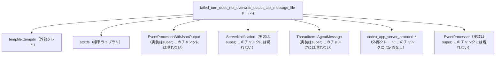
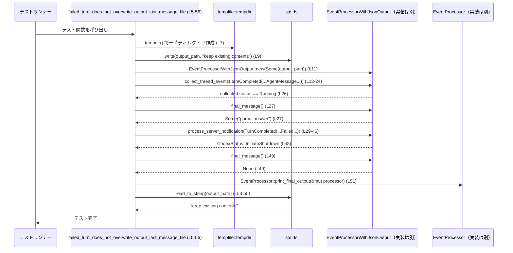

# exec/src/event_processor_with_jsonl_output_tests.rs コード解説

## 0. ざっくり一言

- `EventProcessorWithJsonOutput` が **失敗したターンの後に、既存の「最後のメッセージ」ファイルを上書きしないこと** を検証する単一のテスト関数を定義するモジュールです（根拠: `exec/src/event_processor_with_jsonl_output_tests.rs:L5-56`）。

---

## 1. このモジュールの役割

### 1.1 概要

- このモジュールは、`EventProcessorWithJsonOutput` と関連コンポーネントの振る舞いのうち、
  - 途中までエージェントメッセージが生成された後に
  - 対応するターンが `TurnStatus::Failed` で完了した場合でも
  - 既に存在する出力ファイル（`last-message.txt`）を上書きしない
- という仕様をテストで保証する役割を持ちます（根拠: L7-9, L11, L13-27, L29-56）。

### 1.2 アーキテクチャ内での位置づけ

このモジュールは「親モジュール（`super`）」で定義されている実装に対する **ブラックボックステスト** として機能します。  
`EventProcessorWithJsonOutput` を生成し、`ServerNotification` 系のイベントを流し込み、その結果としてファイル出力の有無を確認します。



- 本図は、本ファイル `exec/src/event_processor_with_jsonl_output_tests.rs` のコード範囲（概ね L1-56）における依存関係を表します。

### 1.3 設計上のポイント

- **テスト専用モジュール**
  - `#[test]` が付いた関数のみを含むテスト用ファイルです（根拠: L5-6）。
- **一時ディレクトリの利用**
  - `tempfile::tempdir` を使ってテストごとに一時ディレクトリを作成し、他のテストや実環境とファイルが干渉しないようになっています（根拠: L7）。
- **事前に出力ファイルをシード**
  - `std::fs::write` で `"keep existing contents"` を書き込んでから処理を行い、**既存ファイルが書き換えられないこと** を検証しています（根拠: L8-9, L53-56）。
- **ドメインイベント駆動のテスト**
  - `ServerNotification::ItemCompleted` と `ServerNotification::TurnCompleted` を送ることで、イベントプロセッサの内部状態変化と最終出力の有無を確認しています（根拠: L13-24, L29-46）。
- **エラー時の挙動に着目**
  - `TurnStatus::Failed` + `TurnError` を伴うケースに限定して挙動を検証しています（根拠: L35-40）。

---

## 2. 主要な機能一覧

このモジュールが提供する主要な「機能」（＝テストで検証している振る舞い）は次の通りです。

- 失敗ターン時のファイル非上書き検証:  
  事前に内容がある `last-message.txt` が、`TurnStatus::Failed` の通知後に `EventProcessor::print_final_output` を呼び出しても、その内容が変わらないことを確認します（根拠: L7-9, L29-46, L51, L53-56）。
- エージェントメッセージと `final_message` の関係検証:  
  `ItemCompleted` 通知で `ThreadItem::AgentMessage` を受け取った時点では `final_message()` がメッセージ内容 `"partial answer"` を返し、その後の失敗ターン処理後には `final_message()` が `None` になることを確認します（根拠: L13-27, L48-49）。

---

## 3. 公開 API と詳細解説

### 3.1 コンポーネントインベントリー

#### 3.1.1 型インベントリー（このファイルから参照される主な型）

| 名前 | 種別 | 役割 / 用途 | 定義位置 | 根拠 |
|------|------|-------------|----------|------|
| `EventProcessorWithJsonOutput` | 型（具体種別不明） | イベントを受け取り、JSON出力および最終メッセージ管理を行うコンポーネント。ここではテスト対象として使用される | 親モジュール `super`（このチャンクには定義が現れない） | L11 |
| `EventProcessor` | 型またはトレイト（不明） | 関連関数 `print_final_output` を提供し、`EventProcessorWithJsonOutput` を抽象化していると推測されるが、実体は不明 | 親モジュール `super`（このチャンクには定義が現れない） | L51 |
| `ServerNotification` | 列挙体と推測（定義不明） | サーバからの通知種別。`ItemCompleted` と `TurnCompleted` というバリアントがあることだけが分かる | 親モジュール `super`（このチャンクには定義が現れない） | L13, L29 |
| `ThreadItem` | 列挙体と推測（定義不明） | スレッド内のアイテム種別。`AgentMessage` バリアントによりエージェントメッセージを表現 | 親モジュール `super`（このチャンクには定義が現れない） | L15 |
| `CodexStatus` | 列挙体と推測 | イベント処理の状態を表す。ここでは `Running` と `InitiateShutdown` バリアントが使われていることのみ分かる | 親モジュール `super`（このチャンクには定義が現れない） | L26, L48 |
| `TurnStatus` | 列挙体と推測 | ターンの状態を表す。ここでは `Failed` バリアントのみ使用 | 外部クレート `codex_app_server_protocol` または親モジュール（このチャンクには定義が現れない） | L35 |
| `codex_app_server_protocol::ItemCompletedNotification` ほか | 構造体 | サーバ側プロトコル用の通知ペイロード。`TurnCompletedNotification`, `Turn`, `TurnError` などが使われている | クレート `codex_app_server_protocol` 内（このチャンクには定義が現れない） | L14, L30-40 |

> この表は「どの型が **使われているか**」のみを示し、実装詳細は他ファイルに依存します。

#### 3.1.2 関数インベントリー

| 関数名 | 種別 | 役割 / 用途 | 根拠 |
|--------|------|-------------|------|
| `failed_turn_does_not_overwrite_output_last_message_file` | テスト関数（`#[test]`） | 失敗したターン後に既存の出力ファイルが上書きされないことを検証する | L5-56 |
| `EventProcessorWithJsonOutput::new` | 関連関数（定義は別モジュール） | 出力パス（`Option<PathBuf>` と推測）を受け取ってイベントプロセッサを生成 | L11 |
| `EventProcessorWithJsonOutput::collect_thread_events` | メソッド（定義不明） | `ServerNotification::ItemCompleted` を処理し、進行中ステータスや最終メッセージを更新 | L13-24, L26-27 |
| `EventProcessorWithJsonOutput::process_server_notification` | メソッド（定義不明） | `ServerNotification::TurnCompleted` を処理し、`CodexStatus` を返す | L29-46, L48 |
| `EventProcessorWithJsonOutput::final_message` | メソッド（定義不明） | 現在保持している最終メッセージを `Option<&str>` などで返していると推測される | L27, L49 |
| `EventProcessor::print_final_output` | 関連関数（定義不明） | 渡されたプロセッサから最終出力をファイル等に書き出す | L51 |

> `EventProcessorWithJsonOutput` および `EventProcessor` の具体的なシグネチャや実装は、このチャンクには現れません。

---

### 3.2 関数詳細

#### `failed_turn_does_not_overwrite_output_last_message_file() -> ()`

**概要**

- 一時ディレクトリ内に事前に作成した `last-message.txt` を用意し（根拠: L7-9）、
- エージェントメッセージの `ItemCompleted` 通知と、`TurnStatus::Failed` の `TurnCompleted` 通知を順に `EventProcessorWithJsonOutput` に渡し（根拠: L13-24, L29-46）、
- 最後に `EventProcessor::print_final_output` を呼び出しても、`last-message.txt` の内容が変化しないことを検証します（根拠: L51, L53-56）。

**引数**

- 引数はありません。標準的な Rust のテスト関数として `fn test_name()` 形式です（根拠: L6）。

**戻り値**

- 戻り値は `()` です（テスト関数は戻り値を使用しないのが一般的であり、この関数も何も返さない宣言になっています。根拠: L6）。

**内部処理の流れ（アルゴリズム）**

1. **一時ディレクトリと出力ファイルの準備**（根拠: L7-9）
   - `tempfile::tempdir()` で一時ディレクトリを生成し、エラー時には `expect("create tempdir")` で即座にパニックします（L7）。
   - `tempdir.path().join("last-message.txt")` で出力ファイルパスを組み立てます（L8）。
   - `std::fs::write` を用いて `"keep existing contents"` をファイルに書き込み、初期状態を作ります（L9）。

2. **イベントプロセッサの生成**（根拠: L11）
   - `EventProcessorWithJsonOutput::new(Some(output_path.clone()))` を呼び出し、出力ファイルパスを指定したプロセッサを作成します（L11）。

3. **途中のエージェントメッセージの処理**（根拠: L13-27）
   - `processor.collect_thread_events` に `ServerNotification::ItemCompleted` を渡し、内部状態を更新します（L13-24）。
   - この通知には `ThreadItem::AgentMessage` が含まれ、`text` フィールドは `"partial answer"` です（L15-19）。
   - 戻り値 `collected.status` が `CodexStatus::Running` であることを検証します（L26）。
   - `processor.final_message()` が `Some("partial answer")` を返すことを検証します（L27）。

4. **失敗したターン完了通知の処理**（根拠: L29-49）
   - `processor.process_server_notification` に `ServerNotification::TurnCompleted` を渡します（L29-46）。
   - `TurnCompletedNotification` 内の `turn.status` は `TurnStatus::Failed` であり、`TurnError` の `message` は `"turn failed"` です（L35-40）。
   - 戻り値 `status` が `CodexStatus::InitiateShutdown` であることを検証します（L48）。
   - `processor.final_message()` が `None` を返すことを検証します（L49）。

5. **最終出力処理とファイル内容の確認**（根拠: L51-56）
   - `EventProcessor::print_final_output(&mut processor)` を呼び出します（L51）。
   - その後、`std::fs::read_to_string(&output_path)` で `last-message.txt` を読み込みます（L53-55）。
   - 読み込んだ内容が `"keep existing contents"` と一致することを `assert_eq!` で確認します（L53-56）。

**Examples（使用例）**

このテスト関数自体が `EventProcessorWithJsonOutput` の典型的な利用手順の一例になっています。

```rust
// 一時ディレクトリと事前の出力を準備する
let tempdir = tempdir().expect("create tempdir");
let output_path = tempdir.path().join("last-message.txt");
std::fs::write(&output_path, "keep existing contents").expect("seed output file");

// 出力パス付きでイベントプロセッサを初期化する
let mut processor = EventProcessorWithJsonOutput::new(Some(output_path.clone()));

// 途中のエージェントメッセージを処理する
let collected = processor.collect_thread_events(ServerNotification::ItemCompleted(
    codex_app_server_protocol::ItemCompletedNotification {
        item: ThreadItem::AgentMessage {
            id: "msg-1".to_string(),
            text: "partial answer".to_string(),
            phase: None,
            memory_citation: None,
        },
        thread_id: "thread-1".to_string(),
        turn_id: "turn-1".to_string(),
    },
));
assert_eq!(collected.status, CodexStatus::Running);
assert_eq!(processor.final_message(), Some("partial answer"));

// 失敗したターン完了通知を処理する
let status = processor.process_server_notification(ServerNotification::TurnCompleted(
    codex_app_server_protocol::TurnCompletedNotification {
        thread_id: "thread-1".to_string(),
        turn: codex_app_server_protocol::Turn {
            id: "turn-1".to_string(),
            items: Vec::new(),
            status: TurnStatus::Failed,
            error: Some(codex_app_server_protocol::TurnError {
                message: "turn failed".to_string(),
                additional_details: None,
                codex_error_info: None,
            }),
            started_at: None,
            completed_at: Some(0),
            duration_ms: None,
        },
    },
));
assert_eq!(status, CodexStatus::InitiateShutdown);
assert_eq!(processor.final_message(), None);

// 最終出力を実行しても既存ファイルは変わらないことを確認する
EventProcessor::print_final_output(&mut processor);
assert_eq!(
    std::fs::read_to_string(&output_path).expect("read output file"),
    "keep existing contents"
);
```

**Errors / Panics（エラー / パニック）**

- このテスト関数内では、以下の箇所でエラー時にパニックが発生します。
  - `tempdir().expect("create tempdir")`  
    一時ディレクトリの作成に失敗するとパニックします（根拠: L7）。
  - `std::fs::write(...).expect("seed output file")`  
    初期ファイルの書き込み失敗でパニックします（根拠: L9）。
  - `std::fs::read_to_string(...).expect("read output file")`  
    最終的なファイル読み込みに失敗するとパニックします（根拠: L53-55）。
- `EventProcessorWithJsonOutput` や `EventProcessor::print_final_output` 内部でのエラーハンドリング方針は、このチャンクには現れません。

**Edge cases（エッジケース）**

このテストでカバーしている／していないエッジケースは次の通りです。

- カバーしているケース
  - 既に内容を持つ出力ファイルが存在する（初期内容 `"keep existing contents"`）（根拠: L8-9）。
  - エージェントメッセージが 1 件だけ処理されている（`ThreadItem::AgentMessage` 1件）（根拠: L15-20）。
  - `TurnStatus::Failed` かつ `TurnError` が `Some(_)` である失敗ターン（根拠: L35-40）。
- カバーしていないケース（**挙動は不明**）
  - 出力ファイルが存在しない状態での `print_final_output` の挙動（このチャンクにはテストがない）。
  - ターンが成功 (`TurnStatus` の他バリアント) の場合の出力ファイル内容。
  - エージェントメッセージが複数ある場合や、メッセージが存在しない場合の `final_message()` の挙動。
  - `TurnError` が `None` の場合の処理。
  - ファイル I/O エラーが発生した場合のイベントプロセッサの挙動。

**使用上の注意点**

- このテストは **実際のファイル I/O** を行います。CI 環境などでファイルシステムの制限がある場合、`expect` によりテストがパニック終了する可能性があります。
- `EventProcessorWithJsonOutput::new` に `Some(output_path)` を渡しているため、**出力パスを設定した状態** を前提とした挙動のみを検証しています（`None` の挙動は不明です）。
- 並行性（スレッド間での共有・同時実行など）については、このテストでは扱っておらず、テストの中でもスレッドを生成していません（全処理は単一スレッド上で直列に行われています）。

### 3.3 その他の関数

- このファイルには、上記で解説した `failed_turn_does_not_overwrite_output_last_message_file` 以外のローカル関数やヘルパー関数は存在しません（根拠: L1-56 全体を見ても他の `fn` 定義がない）。

---

## 4. データフロー

このセクションでは、このテスト実行時におけるデータの流れをシーケンス図で表します。



- 図は `exec/src/event_processor_with_jsonl_output_tests.rs` の L5-56 に対応するデータフローを示します。
- `EventProcessorWithJsonOutput` および `EventProcessor` の内部処理は、このチャンクには現れないため、シーケンス図では抽象的に扱っています。

---

## 5. 使い方（How to Use）

### 5.1 基本的な使用方法（テストから読み取れるパターン）

このテストから、`EventProcessorWithJsonOutput` を使う基本的なフローとして、次のような流れが分かります。

1. 出力ファイルパスを決定し、そのパスを `Some(path)` として `EventProcessorWithJsonOutput::new` に渡してインスタンス化する（根拠: L8, L11）。
2. スレッド上の出来事を `ServerNotification::ItemCompleted` などの通知として `collect_thread_events` に渡す（根拠: L13-24）。
3. 必要に応じて `final_message()` で現在の最終メッセージを取得する（根拠: L27, L49）。
4. ターンの完了時に `ServerNotification::TurnCompleted` を `process_server_notification` に渡し、その戻り値 `CodexStatus` に基づいて後続の動作を決める（根拠: L29-48）。
5. 全処理終了後に `EventProcessor::print_final_output(&mut processor)` を呼び出して、最終出力（ファイル書き込みなど）を行う（根拠: L51）。

以上を踏まえた最小例は次のようになります（あくまでこのテストから読み取れる範囲の擬似的な利用例です）。

```rust
// 出力先を指定してプロセッサを生成する
let output_path = std::path::PathBuf::from("last-message.txt");
let mut processor = EventProcessorWithJsonOutput::new(Some(output_path.clone()));

// 途中のアイテム完了通知を処理する
let collected = processor.collect_thread_events(ServerNotification::ItemCompleted(
    /* ItemCompletedNotification の構築はテストと同様 */
));
// 状態や一時的なメッセージを確認する
assert_eq!(collected.status, CodexStatus::Running);
let maybe_message = processor.final_message();

// ターン完了通知を処理する
let status = processor.process_server_notification(ServerNotification::TurnCompleted(
    /* TurnCompletedNotification の構築はテストと同様 */
));

// 最終出力（失敗ターンの場合、このテストでは既存ファイルを上書きしないことが期待されている）
EventProcessor::print_final_output(&mut processor);
```

> `ServerNotification` や `codex_app_server_protocol` の詳細な使い方は、このチャンクには現れません。

### 5.2 よくある使用パターン

- このチャンクがカバーしているのは「**失敗ターン (`TurnStatus::Failed`)」のケース**のみであり、成功ターンや他の状態に関する使用パターンはこのファイルには現れません。
- そのため、成功ケースなど他のシナリオでの `EventProcessorWithJsonOutput` の使い方は、親モジュールや他のテストファイルを参照する必要があります。

### 5.3 よくある間違い（このチャンクから推測できる注意点）

このテストから読み取れる範囲で、考えられる誤用例と注意点を挙げます。

```rust
// （テストにおける誤用例のイメージ）
// 固定パスに直接書き込むテストは、他のテストや実行環境のファイルと干渉する可能性がある
let output_path = std::path::PathBuf::from("/tmp/last-message.txt"); // 固定パス
std::fs::write(&output_path, "seed").unwrap(); // 他テストと共有されうる
```

```rust
// このファイルが採用しているパターン（推奨される例の一つ）
let tempdir = tempfile::tempdir().expect("create tempdir"); // テストごとの一時ディレクトリ
let output_path = tempdir.path().join("last-message.txt");  // テスト専用の一時ファイル
std::fs::write(&output_path, "seed").expect("seed output file");
```

- 上記のように、一時ディレクトリを利用することで、テスト間の干渉や環境汚染を避けている点が、このファイルの設計から読み取れます（根拠: L7-9）。

### 5.4 使用上の注意点（まとめ）

- **ファイル I/O 前提**  
  テストはローカルファイルシステムへの読み書きに依存するため、読み書き権限がない環境では `expect` によるパニックが発生します。
- **失敗タ―ン時の仕様**  
  このテストは、「失敗したターンでは既存の出力を上書きしない」という仕様を前提にしています。  
  実装を変更して失敗ターンでも出力を書き換えるようにした場合、このテストは失敗するようになります。
- **並行実行**  
  テスト内でグローバルな固定パスを使っていないため、テストの並列実行時でもファイル競合は起きにくい設計になっています（根拠: L7-9; すべて tempdir 配下）。

---

## 6. 変更の仕方（How to Modify）

### 6.1 新しい機能（テストケース）を追加する場合

失敗ターン以外のシナリオをテストしたい場合、例えば次のようなステップで追加できます。

1. **新しいテスト関数の追加**
   - 同ファイル内に `#[test]` 属性付きの新しい関数を定義します。
2. **共通セットアップの再利用**
   - `tempdir` の生成と出力ファイルパスの構築（L7-8）、およびシード書き込み（L9）のパターンを再利用します。
3. **異なる `TurnStatus` / イベントシーケンスの構築**
   - 例えば成功ケースを検証するなら、`TurnStatus` の成功バリアント（名称はこのチャンクには現れません）を用いた `TurnCompletedNotification` を構築する必要があります。
4. **期待される挙動の検証**
   - `final_message()` の戻り値や、`print_final_output` 後のファイル内容が仕様通りかどうか、`assert_eq!` などで検証します。

### 6.2 既存の機能（テスト）を変更する場合

- **実装変更に伴うテスト再検証**
  - `EventProcessorWithJsonOutput` や `EventProcessor::print_final_output` の仕様を変更した際には、以下の点を確認する必要があります。
    - 失敗ターン後に既存ファイルを書き換えるべきかどうか（仕様の変更有無）。
    - `final_message()` が失敗ターン後に `None` を返すという契約を維持するかどうか（根拠: L49）。
- **影響範囲**
  - `CodexStatus::InitiateShutdown` を返す条件（根拠: L48）は、上位ロジック（プロセス全体の終了制御）に影響を与える可能性があります。  
    他のテストや上位モジュールで `CodexStatus::InitiateShutdown` を前提としている箇所がないか確認する必要があります（ただし、このチャンクだけからは他の使用箇所は分かりません）。
- **テストの契約（Contracts）の維持**
  - このテストが暗に定義している契約は次の通りです。
    - `ItemCompleted(AgentMessage)` → `status == Running` かつ `final_message() == Some(text)`（根拠: L26-27）。
    - `TurnCompleted(Failed, error=Some(_))` → `status == InitiateShutdown` かつ `final_message() == None`（根拠: L35-40, L48-49）。
    - その後の `print_final_output` は既存出力ファイルを上書きしない（根拠: L51, L53-56）。
  - これらの契約を変更する場合は、仕様書・他テストとの整合性を取る必要があります。

---

## 7. 関連ファイル

このモジュールと密接に関連するであろうコンポーネントをまとめます。

| パス / モジュール | 役割 / 関係 |
|-------------------|------------|
| `super`（親モジュール; 具体的なファイルパスはこのチャンクには現れない） | `EventProcessorWithJsonOutput`, `EventProcessor`, `ServerNotification`, `ThreadItem`, `CodexStatus` など、このテストで利用している型・関数の実装を提供しているモジュールです（根拠: L1, L11, L13, L29, L51）。 |
| `codex_app_server_protocol` クレート | `ItemCompletedNotification`, `TurnCompletedNotification`, `Turn`, `TurnError`, および `TurnStatus` など、サーバプロトコル関連の型を提供します（根拠: L14, L30-40, L35）。 |
| 標準ライブラリ `std::fs` | テスト内で出力ファイルの読み書きを行うために使用されています（根拠: L9, L53-55）。 |
| `tempfile` クレート | 一時ディレクトリを作成し、テスト用のファイルを安全に配置するために使用されています（根拠: L3, L7）。 |
| `pretty_assertions` クレート | `assert_eq` マクロを上書きし、差分が見やすいアサーション出力を提供します（根拠: L2, L26-27, L48-49, L53-56）。 |

---

### Bugs / Security 観点（このチャンクから分かる範囲）

- このファイル自体はテストコードであり、本番コードのバグ・脆弱性を直接含むわけではありません。
- テストが確認しているのは **「失敗したターン時に既存出力を上書きしないこと」** だけであり、それ以外のセキュリティ上の懸念（例えば、出力ファイル名の検証、パス・トラバーサル防止など）については、このチャンクからは何も分かりません。
- ファイル I/O 関連:
  - 絶対パスではなく `tempdir` 配下のパスを使っているため、このテストが任意の場所にファイルを作成することはありません（安全側の設計といえます）（根拠: L7-8）。

### Contracts / Edge Cases まとめ

- **Contracts（契約）**
  - 上述の通り、このテストは `EventProcessorWithJsonOutput` / `EventProcessor` に対して 3 つの契約（`Running` + `Some(msg)` → `Failed` + `InitiateShutdown` + `None` → ファイル非上書き）を暗に定義しています。
- **Edge Cases**
  - 成功ケース、エラー情報なしでの失敗、複数メッセージ、出力ファイルなし、I/O エラーなど多くのエッジケースはこのテストではカバーされていません。

このレポートは、あくまで `exec/src/event_processor_with_jsonl_output_tests.rs` のコード片から読み取れる事実に基づいています。それ以外の挙動については、親モジュールの実装や他のテストファイルの確認が必要です。
