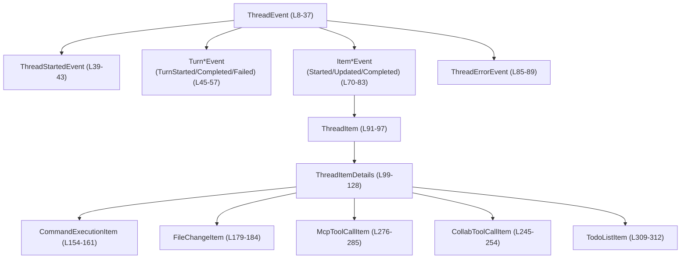
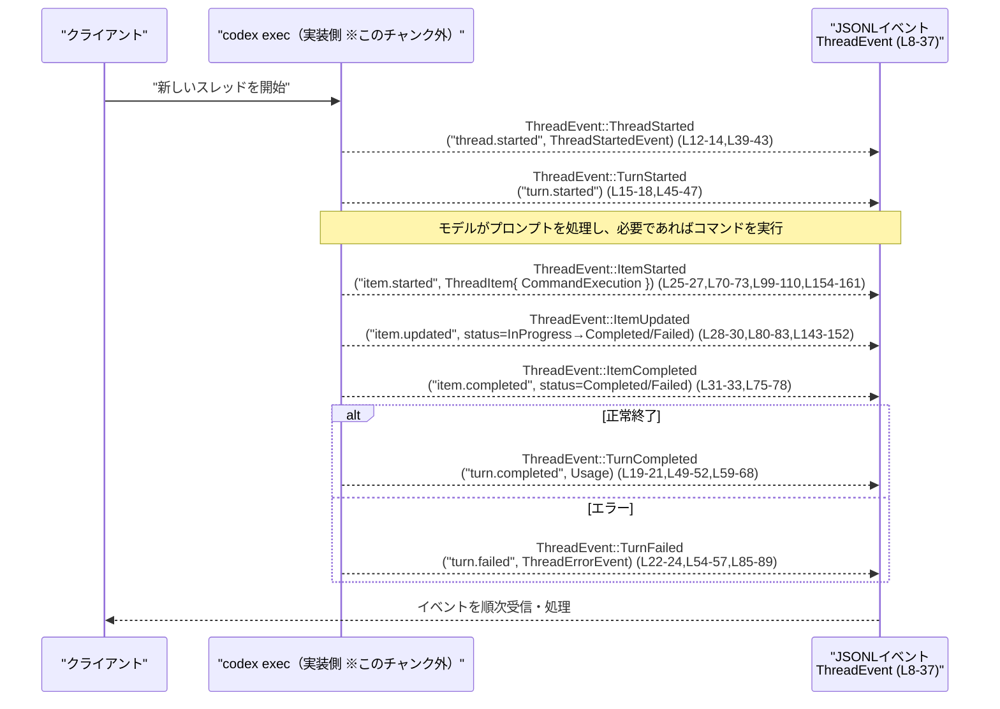

exec\src\exec_events.rs コード解説
=================================

## 0. ざっくり一言

- `codex exec` が JSONL で吐き出す「スレッド実行イベント」の **型定義（スキーマ）** をまとめたモジュールです。  
- Rust での構造体／列挙体定義と同時に、serde 用の JSON スキーマおよび TypeScript 型定義（`ts_rs::TS`）の元にもなります。  
  （`ThreadEvent` などの定義より。`exec\src\exec_events.rs:L8-37`）

---

## 1. このモジュールの役割

### 1.1 概要

- このモジュールは、**codex exec がストリーム出力するスレッド実行イベントを構造化して表現する** ために存在し、  
  スレッド・ターン・アイテム・ツール呼び出し・エラーなどの情報を Rust/TS で扱えるようにします。  
  （`ThreadEvent` コメントと各種アイテム型より。`exec\src\exec_events.rs:L8-37,L99-128`）

- すべての型は `Serialize` / `Deserialize` / `TS` を derive しており、  
  **JSON ↔ Rust ↔ TypeScript** の橋渡しを担う「データモデル層」です。  
  （`#[derive(Debug, Clone, Serialize, Deserialize, PartialEq, TS)]` が各型に付いていることより。`exec\src\exec_events.rs:L8-9,L39-40,...`）

### 1.2 アーキテクチャ内での位置づけ

このファイル内だけで見える範囲では:

- `ThreadEvent` が **トップレベルのイベント列挙体** です。各イベントは `serde(tag = "type")` により JSON の `"type"` フィールドで区別されます。  
  （`exec\src\exec_events.rs:L8-11`）
- `ThreadEvent` の一部（`ItemStarted` / `ItemUpdated` / `ItemCompleted`）は `ThreadItem` を含み、  
  `ThreadItem` はさらに `ThreadItemDetails` により具体的なペイロード型（コマンド実行・ファイル変更・MCP ツール呼び出しなど）に分岐します。  
  （`exec\src\exec_events.rs:L70-83,L91-97,L99-128`）

内部依存関係を簡略図にすると次のようになります（主要な型に限定・行番号付き）。



※ この図は **このチャンク内の型だけ** を対象にしています。他モジュール（たとえば実際にイベントを出力する実装）はこのチャンクには現れません。

### 1.3 設計上のポイント

- **タグ付き Enum によるイベント種別の明示**  
  - `ThreadEvent` / `ThreadItemDetails` は `#[serde(tag = "type")]` でタグ付き Enum としてシリアライズされます。  
    JSON では `"type": "thread.started"` や `"type": "agent_message"` のように区別されます。  
    （`exec\src\exec_events.rs:L10-11,L101-102,L13-36,L103-127`）

- **トップレベルとアイテムレベルの 2 階層構造**  
  - スレッド／ターン／アイテム／致命的エラーを `ThreadEvent` で表現し、  
    アイテムの具体的な内容は `ThreadItemDetails` に委譲する 2 段構造になっています。  
    （`exec\src\exec_events.rs:L8-37,L91-97,L99-128`）

- **状態（ステータス）の Enum 化**  
  - コマンド実行・パッチ適用・MCP ツール呼び出し・コラボツール呼び出し・エージェント状態などは、  
    状態を表す専用 Enum（例: `CommandExecutionStatus`, `PatchApplyStatus`）で管理されています。  
    （`exec\src\exec_events.rs:L143-152,L170-177,L195-203,L205-213,L225-236`）

- **JSON そのものを保持するフィールド**  
  - MCP の結果・引数・コンテンツは `serde_json::Value` (`JsonValue`) で保持し、  
    ワイヤフォーマットに忠実な構造を保ちつつスキーマ／TS 型を生成しやすくしています。  
    （`exec\src\exec_events.rs:L4,L256-268,L276-285` のコメント・定義より）

- **TypeScript 型／JSON Schema 生成のための `TS` derive**  
  - すべての公開型が `ts_rs::TS` を derive しており、Rust の定義から TypeScript 型を自動生成する設計です。  
    （`exec\src\exec_events.rs:L6` と全型の `TS` derive）

- **言語安全性／並行性の観点**  
  - フィールドは `String`, `i64`, `bool`, `Option`, `Vec`, `HashMap`, `serde_json::Value` などの所有型のみで構成されており、  
    `unsafe` やポインタ操作は使われていません。データはコピー／クローンしやすく、スレッド間で送りやすい構造です。  
    （フィールド一覧より。`exec\src\exec_events.rs:L39-312`）

---

## 2. 主要な機能一覧

このファイルには関数はありませんが、データモデルとして以下の「機能」を提供します。

- スレッドイベント（`ThreadEvent`）の型安全な表現と JSON シリアライズ
- スレッド開始・ターン開始／完了／失敗のメタ情報表現（`ThreadStartedEvent`, `Turn*Event`）
- アイテム開始／更新／完了イベントとその共通ラッパー（`Item*Event`, `ThreadItem`）
- エージェント応答・推論・コマンド実行・ファイル変更・MCP ツール呼び出し・コラボツール呼び出し・Web 検索・ToDo リスト・非致命的エラーなどのペイロード表現（`ThreadItemDetails` の各バリアント）
- トークン使用量の記録（`Usage`）
- MCP ツール／コラボツール／ファイルパッチ適用などの状態を表すステータス Enum 群

---

## 3. 公開 API と詳細解説

### 3.1 型一覧（構造体・列挙体など）

> 行番号はこのチャンク内で手計測したものです。形式は `exec\src\exec_events.rs:L開始-終了` です。

| 名前 | 種別 | 役割 / 用途 | 主なフィールド・関連型 | 定義位置 |
|------|------|-------------|------------------------|----------|
| `ThreadEvent` | enum | JSONL ストリームで出力されるトップレベルのイベント種別 | `ThreadStarted`, `TurnStarted`, `TurnCompleted`, `TurnFailed`, `ItemStarted`, `ItemUpdated`, `ItemCompleted`, `Error` | `exec\src\exec_events.rs:L8-37` |
| `ThreadStartedEvent` | struct | 新規スレッド開始イベントのペイロード | `thread_id: String` | `exec\src\exec_events.rs:L39-43` |
| `TurnStartedEvent` | struct | ターン開始イベント（空ペイロード） | フィールドなし | `exec\src\exec_events.rs:L45-47` |
| `TurnCompletedEvent` | struct | ターン完了イベントのペイロード | `usage: Usage` | `exec\src\exec_events.rs:L49-52` |
| `TurnFailedEvent` | struct | ターン失敗イベントのペイロード | `error: ThreadErrorEvent` | `exec\src\exec_events.rs:L54-57` |
| `Usage` | struct | ターンにおけるトークン使用量 | `input_tokens`, `cached_input_tokens`, `output_tokens` | `exec\src\exec_events.rs:L59-68` |
| `ItemStartedEvent` | struct | アイテム開始イベントのペイロード | `item: ThreadItem` | `exec\src\exec_events.rs:L70-73` |
| `ItemCompletedEvent` | struct | アイテム完了イベントのペイロード | `item: ThreadItem` | `exec\src\exec_events.rs:L75-78` |
| `ItemUpdatedEvent` | struct | アイテム更新イベントのペイロード | `item: ThreadItem` | `exec\src\exec_events.rs:L80-83` |
| `ThreadErrorEvent` | struct | ストリームが直接通知する致命的エラー | `message: String` | `exec\src\exec_events.rs:L85-89` |
| `ThreadItem` | struct | スレッド内の 1 アイテム（ID とドメイン固有ペイロード） | `id: String`, `details: ThreadItemDetails`（flatten） | `exec\src\exec_events.rs:L91-97` |
| `ThreadItemDetails` | enum | 各アイテムのドメイン固有ペイロード種別 | `AgentMessage`, `Reasoning`, `CommandExecution`, `FileChange`, `McpToolCall`, `CollabToolCall`, `WebSearch`, `TodoList`, `Error` | `exec\src\exec_events.rs:L99-128` |
| `AgentMessageItem` | struct | エージェントからの応答 | `text: String` | `exec\src\exec_events.rs:L130-135` |
| `ReasoningItem` | struct | エージェントの推論サマリ | `text: String` | `exec\src\exec_events.rs:L137-141` |
| `CommandExecutionStatus` | enum | コマンド実行の状態 | `InProgress` (デフォルト), `Completed`, `Failed`, `Declined` | `exec\src\exec_events.rs:L143-152` |
| `CommandExecutionItem` | struct | エージェントが実行したコマンドの結果 | `command`, `aggregated_output`, `exit_code: Option<i32>`, `status: CommandExecutionStatus` | `exec\src\exec_events.rs:L154-161` |
| `FileUpdateChange` | struct | 1 つのファイルに対する変更 | `path: String`, `kind: PatchChangeKind` | `exec\src\exec_events.rs:L163-168` |
| `PatchApplyStatus` | enum | ファイルパッチ適用の状態 | `InProgress`, `Completed`, `Failed` | `exec\src\exec_events.rs:L170-177` |
| `FileChangeItem` | struct | エージェントによる複数ファイルの変更 | `changes: Vec<FileUpdateChange>`, `status: PatchApplyStatus` | `exec\src\exec_events.rs:L179-184` |
| `PatchChangeKind` | enum | ファイル変更の種別 | `Add`, `Delete`, `Update` | `exec\src\exec_events.rs:L186-193` |
| `McpToolCallStatus` | enum | MCP ツール呼び出しの状態 | `InProgress` (デフォルト), `Completed`, `Failed` | `exec\src\exec_events.rs:L195-203` |
| `CollabToolCallStatus` | enum | コラボツール呼び出しの状態 | `InProgress` (デフォルト), `Completed`, `Failed` | `exec\src\exec_events.rs:L205-213` |
| `CollabTool` | enum | サポートされるコラボツール操作 | `SpawnAgent`, `SendInput`, `Wait`, `CloseAgent` | `exec\src\exec_events.rs:L215-223` |
| `CollabAgentStatus` | enum | コラボエージェントの状態 | `PendingInit`, `Running`, `Interrupted`, `Completed`, `Errored`, `Shutdown`, `NotFound` | `exec\src\exec_events.rs:L225-236` |
| `CollabAgentState` | struct | コラボエージェントの最新状態 | `status: CollabAgentStatus`, `message: Option<String>` | `exec\src\exec_events.rs:L238-243` |
| `CollabToolCallItem` | struct | コラボツール呼び出し | `tool: CollabTool`, `sender_thread_id`, `receiver_thread_ids: Vec<String>`, `prompt: Option<String>`, `agents_states: HashMap<String, CollabAgentState>`, `status: CollabToolCallStatus` | `exec\src\exec_events.rs:L245-254` |
| `McpToolCallItemResult` | struct | MCP ツール呼び出しの結果ペイロード | `content: Vec<JsonValue>`, `structured_content: Option<JsonValue>` | `exec\src\exec_events.rs:L256-268` |
| `McpToolCallItemError` | struct | MCP ツール呼び出しのエラー情報 | `message: String` | `exec\src\exec_events.rs:L270-274` |
| `McpToolCallItem` | struct | MCP ツール呼び出しイベント | `server`, `tool`, `arguments: JsonValue` (default), `result: Option<McpToolCallItemResult>`, `error: Option<McpToolCallItemError>`, `status: McpToolCallStatus` | `exec\src\exec_events.rs:L276-285` |
| `WebSearchItem` | struct | Web 検索リクエスト | `id: String`, `query: String`, `action: WebSearchAction` | `exec\src\exec_events.rs:L288-294` |
| `ErrorItem` | struct | 非致命的エラーを表すアイテム | `message: String` | `exec\src\exec_events.rs:L296-300` |
| `TodoItem` | struct | エージェントの ToDo の 1 項目 | `text: String`, `completed: bool` | `exec\src\exec_events.rs:L302-307` |
| `TodoListItem` | struct | エージェントの ToDo リスト全体 | `items: Vec<TodoItem>` | `exec\src\exec_events.rs:L309-312` |

### 3.2 関数詳細（最大 7 件）

このファイルには **関数（`fn`）定義が 1 つも存在しない** ため、  
関数テンプレートに沿った詳細解説の対象となる API はありません。  
（全チャンクを確認しても `fn` キーワードが出現しないことから。`exec\src\exec_events.rs:L1-312`）

代わりに、このモジュールを使う際の「中心的なエントリポイント」は次の 2 つの型になります。

1. **`ThreadEvent`** – イベントストリームのトップレベル  
2. **`ThreadItem` + `ThreadItemDetails`** – アイテム関連イベントのペイロード

これらについては以降の「データフロー」「使い方」の節で具体的に扱います。

#### バグになりうる点・セキュリティ上の観点（型全体に共通）

- **デシリアライズの失敗**  
  - `serde(tag = "type")` を用いているため、JSON 側の `"type"` 値が未知の文字列だった場合、デシリアライズは失敗します。  
    （`ThreadEvent` / `ThreadItemDetails` の `#[serde(tag = "type")]` より。`exec\src\exec_events.rs:L10-11,L101-102`）
- **`ThreadItem` の `flatten` によるキー衝突**  
  - `ThreadItem` は `id` フィールドと `details`（`ThreadItemDetails`）を `#[serde(flatten)]` で同一階層にマージします。  
    そのため、今後ペイロード側に `id` など既存キーと同名のフィールドを追加すると JSON が曖昧になりえます。  
    （現状の各アイテム型には `id` フィールドがないため、現行定義では衝突は起きません。`exec\src\exec_events.rs:L91-97,L130-161,L163-184,L247-285,L288-300,L302-312`）
- **任意 JSON の扱い (`JsonValue`)**  
  - `McpToolCallItemResult.content` や `McpToolCallItem.arguments` は任意 JSON です。  
    これらは外部ソース由来の可能性があり、**信頼できない入力として扱う前提** でパース・評価する必要があります。  
    （`exec\src\exec_events.rs:L256-268,L276-283`）

### 3.3 その他の関数

- 関数・メソッドは定義されていないため、この節に該当するものはありません。  
  （`exec\src\exec_events.rs:L1-312`）

---

## 4. データフロー

このファイル自体はロジックを持たずデータ定義のみですが、コメントから読み取れる典型的なフローを整理します。

### 4.1 典型シナリオ：コマンド実行付きのターン

コメントによる説明:

- `ThreadEvent::ThreadStarted` … 新しいスレッド開始時の最初のイベント  
  （`exec\src\exec_events.rs:L12-14`）
- `ThreadEvent::TurnStarted` … 新しいプロンプトをモデルに送った時  
  （`exec\src\exec_events.rs:L15-18`）
- `ThreadItemDetails::CommandExecution` … コマンドを spawn してから exit するまでをトラッキングする  
  （`exec\src\exec_events.rs:L108-110,L154-161,L143-152`）
- `ThreadEvent::TurnCompleted` / `TurnFailed` … ターンの成功／失敗の終端  
  （`exec\src\exec_events.rs:L19-21,L22-24`）

これを基に、**想定されるイベントのライフサイクル** をシーケンス図で表すと次のようになります（あくまでコメントに基づく例示です）。



※ `Exec`（実装側）はこのチャンクには定義されていません。コメントから推測される振る舞いを図示したものです。

---

## 5. 使い方（How to Use）

### 5.1 基本的な使用方法

代表的な使い方として、**コマンド実行アイテムの開始イベント** を構築して JSON として出力する例です。

```rust
use serde_json;                                            // JSON シリアライズ用
// 実際のパスはプロジェクト構成に合わせて調整する必要があります。
use crate::exec_events::*;                                 // exec\src\exec_events.rs の型をインポートする想定

fn main() -> Result<(), Box<dyn std::error::Error>> {
    // スレッド内のアイテム ID を決める                                  // 1 アイテムを識別する ID
    let item_id = "item-1".to_string();

    // コマンド実行ペイロードを作成                                       // CommandExecutionItem を構築
    let cmd_item = CommandExecutionItem {                   // exec\src\exec_events.rs:L154-161
        command: "ls -la".to_string(),                      // 実行されたコマンド
        aggregated_output: String::new(),                   // まだ出力がないので空文字列
        exit_code: None,                                    // プロセス未終了なので None
        status: CommandExecutionStatus::InProgress,         // 実行中を表すステータス
    };

    // ThreadItemDetails にラップ                                       // Enum バリアントに包む
    let details = ThreadItemDetails::CommandExecution(cmd_item);

    // ThreadItem を構築                                                // exec\src\exec_events.rs:L91-97
    let thread_item = ThreadItem {
        id: item_id,
        details,
    };

    // ItemStartedEvent を構築                                           // exec\src\exec_events.rs:L70-73
    let item_started = ItemStartedEvent {
        item: thread_item,
    };

    // トップレベルの ThreadEvent に包む                                // exec\src\exec_events.rs:L8-37
    let event = ThreadEvent::ItemStarted(item_started);

    // JSON にシリアライズ                                              // serde の Serialize 実装を利用
    let json = serde_json::to_string(&event)?;               // 失敗すると Result::Err を返す
    println!("{json}");

    Ok(())
}
```

このコードを実行すると、概ね次のような JSON が出力されます（フィールド順は実装依存です）:

```json
{
  "type": "item.started",
  "item": {
    "id": "item-1",
    "type": "command_execution",
    "command": "ls -la",
    "aggregated_output": "",
    "exit_code": null,
    "status": "in_progress"
  }
}
```

- `"type": "item.started"` は `ThreadEvent` の `#[serde(rename = "item.started")]` から、  
  `"type": "command_execution"` は `ThreadItemDetails` の `#[serde(rename_all = "snake_case")]` から決定されます。  
  （`exec\src\exec_events.rs:L25-27,L101-102,L108-110`）

### 5.2 よくある使用パターン

#### 5.2.1 ToDo リストの更新

ターン中の ToDo リストを表現する場合の典型例です。

```rust
use crate::exec_events::*;                                 // 実際のモジュールパスはプロジェクト依存

fn build_todo_event() -> ThreadEvent {
    // ToDo 項目を 2 件作成                                             // exec\src\exec_events.rs:L302-307
    let items = vec![
        TodoItem {
            text: "調査レポートを書く".to_string(),              // やることの説明
            completed: false,                                 // 未完了
        },
        TodoItem {
            text: "コードをリファクタリングする".to_string(),
            completed: true,                                  // 完了済み
        },
    ];

    // TodoListItem にまとめる                                          // exec\src\exec_events.rs:L309-312
    let todo_list = TodoListItem { items };

    // ThreadItemDetails に格納                                        // exec\src\exec_events.rs:L123-125
    let details = ThreadItemDetails::TodoList(todo_list);

    // ThreadItem と ItemUpdatedEvent を構築
    let thread_item = ThreadItem {
        id: "todo-1".to_string(),
        details,
    };
    let item_updated = ItemUpdatedEvent { item: thread_item };

    // トップレベル ThreadEvent を返す
    ThreadEvent::ItemUpdated(item_updated)
}
```

JSON 表現では（例）:

```json
{
  "type": "item.updated",
  "item": {
    "id": "todo-1",
    "type": "todo_list",
    "items": [
      { "text": "調査レポートを書く", "completed": false },
      { "text": "コードをリファクタリングする", "completed": true }
    ]
  }
}
```

#### 5.2.2 MCP ツール呼び出し結果の通知

`serde_json::Value` による任意コンテンツの詰め込みパターンです。

```rust
use serde_json::json;
use crate::exec_events::*;

fn build_mcp_completed_event() -> ThreadEvent {
    // MCP ツール結果を JSON で用意                                    // exec\src\exec_events.rs:L256-268
    let result = McpToolCallItemResult {
        content: vec![json!({"type": "text", "text": "OK"})],
        structured_content: Some(json!({"status": "ok"})),
    };

    // MCP ツール呼び出しアイテム本体                                  // exec\src\exec_events.rs:L276-285
    let mcp_item = McpToolCallItem {
        server: "my-server".to_string(),
        tool: "my-tool".to_string(),
        arguments: json!({"arg1": 1}),
        result: Some(result),
        error: None,
        status: McpToolCallStatus::Completed,
    };

    let details = ThreadItemDetails::McpToolCall(mcp_item);  // exec\src\exec_events.rs:L114-116
    let thread_item = ThreadItem {
        id: "mcp-1".to_string(),
        details,
    };
    let completed = ItemCompletedEvent { item: thread_item }; // exec\src\exec_events.rs:L75-78

    ThreadEvent::ItemCompleted(completed)
}
```

### 5.3 よくある間違い

コードとコメントから推測される、起こりがちな誤用と注意点です。

```rust
use crate::exec_events::*;

// 間違い例: status を Completed のまま ItemStartedEvent に入れてしまう
fn wrong() -> ThreadEvent {
    let cmd_item = CommandExecutionItem {
        command: "ls".to_string(),
        aggregated_output: String::new(),
        exit_code: None,
        status: CommandExecutionStatus::Completed,          // 実際にはまだ開始直後
    };
    let details = ThreadItemDetails::CommandExecution(cmd_item);
    let item = ThreadItem { id: "1".to_string(), details };

    ThreadEvent::ItemStarted(ItemStartedEvent { item })     // "item.started" なのに Completed
}

// 正しい例: 開始時は InProgress にしておき、更新/完了イベントで状態を変える
fn correct_start() -> ThreadEvent {
    let cmd_item = CommandExecutionItem {
        command: "ls".to_string(),
        aggregated_output: String::new(),
        exit_code: None,
        status: CommandExecutionStatus::InProgress,         // 開始時は実行中
    };
    let details = ThreadItemDetails::CommandExecution(cmd_item);
    let item = ThreadItem { id: "1".to_string(), details };

    ThreadEvent::ItemStarted(ItemStartedEvent { item })
}
```

- `CommandExecutionStatus` のコメントと `ItemStarted/Updated/Completed` の名前から、  
  **開始イベントでは `InProgress`、完了イベントで `Completed` / `Failed`** を使うのが自然な契約と解釈できます。  
  （`exec\src\exec_events.rs:L108-110,L143-152,L70-78`）

### 5.4 使用上の注意点（まとめ）

- **シリアライズ／デシリアライズ時の `"type"` 一貫性**  
  - `ThreadEvent` と `ThreadItemDetails` は `"type"` フィールドの文字列で識別されます。  
    JSON を手書きする／外部から受け取る場合、文字列が定義済みのものと一致しないとデシリアライズに失敗します。  
    （`exec\src\exec_events.rs:L10-11,L13-36,L101-102,L103-127`）

- **`ThreadItem` の `flatten` による JSON 形状**  
  - `ThreadItem` は `{ "id": ..., "type": ..., <payload> }` のようなフラットな JSON になります。  
    クライアント側のスキーマ／パーサーもこの形状を前提にする必要があります。  
    （`exec\src\exec_events.rs:L91-97,L99-128`）

- **`arguments: JsonValue` のデフォルト値**  
  - `McpToolCallItem.arguments` は `#[serde(default)]` なので、JSON にフィールドが存在しない場合でも `Value::Null` として復元されます。  
    「引数がない」と「`null` が明示されている」状態をどのように扱うかを、呼び出し側と揃えておく必要があります。  
    （`exec\src\exec_events.rs:L281-283`）

- **致命的エラーと非致命的エラーの区別**  
  - `ThreadErrorEvent` はコメント上「Fatal error emitted by the stream」とされており、トップレベルの `ThreadEvent::Error` で通知されます。  
    一方 `ErrorItem` は `ThreadItemDetails::Error` バリアントで「非致命的なエラー」を表すとコメントされています。  
    クライアント側でハンドリングを分ける前提があるため、混同しないよう注意が必要です。  
    （`exec\src\exec_events.rs:L85-89,L126-127,L296-300`）

- **並行性の観点**  
  - すべてのフィールドが値型 (`String`, `i64`, `bool`, `Vec`, `HashMap`, `serde_json::Value` など) で構成されており、  
    共有参照の内部可変性などは使われていません。このため、イベントオブジェクトをスレッド間で送る／クローンする使い方と相性のよい設計になっています。  
    （`exec\src\exec_events.rs:L39-312`）

---

## 6. 変更の仕方（How to Modify）

### 6.1 新しい機能を追加する場合

#### 6.1.1 新しいトップレベルイベントを追加したい場合

1. `ThreadEvent` に新しいバリアントを追加します。必要であれば専用のペイロード struct も定義します。  
   （`exec\src\exec_events.rs:L8-37`）
2. `#[serde(rename = "...")]` で JSON 側の `"type"` 文字列を決めます。  
3. TypeScript 側でも新しいイベント型が生成されるため、フロントエンド等のハンドリングコードを追加する必要があります。  

#### 6.1.2 新しいアイテム種別を追加したい場合

1. `ThreadItemDetails` に新しいバリアントを追加し、対応する struct を定義します。  
   （`exec\src\exec_events.rs:L99-128`）
2. `#[serde(rename_all = "snake_case")]` が付いているので、バリアント名 `NewItemKind` は自動的に `"new_item_kind"` という `"type"` 値になります。  
3. `ThreadItem` / `Item*Event` はそのまま再利用できます。新しいアイテム種別を利用するコード側だけ修正すればよい構造です。  

### 6.2 既存の機能を変更する場合

- **フィールドの追加・削除**  
  - 追加は比較的安全ですが、削除は既存 JSON との互換性を壊す可能性があります。  
  - 特に `ThreadItem` の `flatten` まわりで、フィールド名が衝突しないかを確認する必要があります。  
    （`exec\src\exec_events.rs:L91-97`）

- **Enum バリアント名／`#[serde(rename = "...")]` の変更**  
  - JSON の `"type"` 文字列が変わるため、既存ログやクライアント側のパーサーが壊れます。  
  - 互換性を保ちたい場合は、新バリアントを追加しつつ旧バリアントも残すなどの戦略が必要です。

- **状態 Enum (`*Status`) の変更**  
  - ステータス値の追加は比較的安全ですが、削除や意味の変更は状態遷移ロジック（このチャンク外）に影響します。  
    関連するコメント（例: コマンドが spawn されてから exit するまでをトラッキングする、など）を読んで意図を確認する必要があります。  
    （`exec\src\exec_events.rs:L108-110,L143-152,L170-177,L195-203,L205-213,L225-236`）

- **テスト**  
  - このファイルにはテストコードは含まれていませんが、変更時は少なくとも以下のテストを追加するのが有用です（テストファイルは別途作成）。  
    - 各イベントのシリアライズ結果が想定した JSON になること  
    - 既存の JSON サンプルが新しい型定義で問題なくデシリアライズできること  

---

## 7. 関連ファイル

このチャンク内から参照されているが、定義が存在しない型や外部依存をまとめます。

| パス / 型 | 役割 / 関係 |
|-----------|------------|
| `codex_protocol::models::WebSearchAction` | Web 検索アクション種別。`WebSearchItem.action` フィールドの型として利用されています。詳細なバリアントはこのチャンクには現れません。`exec\src\exec_events.rs:L1,L288-294` |
| `serde_json::Value` (`JsonValue`) | 任意 JSON を保持するための型。MCP ツールの引数や結果コンテンツに使用されます。`exec\src\exec_events.rs:L4,L256-268,L276-283` |
| `std::collections::HashMap` | コラボエージェントの状態一覧を表現するために使用。キーはエージェント ID と推測できますが、このチャンクからはキーの意味までは分かりません。`exec\src\exec_events.rs:L5,L245-254` |
| `ts_rs::TS` | Rust 型から TypeScript 型定義を生成するための derive マクロ。すべての公開型に付与されています。`exec\src\exec_events.rs:L6,L8-9,L39-40,...` |

> 他の実装ファイル（実際に `ThreadEvent` を生成・送信するコードや、これらを受信して処理するコード）は、このチャンクには現れません。そのため、ここで説明したのはあくまで「データモデル」とその JSON 形状・制約までです。
