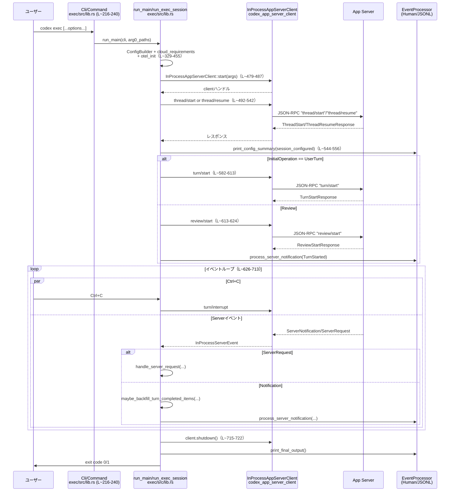

# exec/src/lib.rs コード解説

## 0. ざっくり一言

`exec/src/lib.rs` は、CLI コマンド `codex exec` の中核となるライブラリ部分であり、

- CLI 引数を解釈して設定 (`Config`) と接続情報を構築し、
- アプリケーションサーバーへスレッド・ターンを開始／再開するリクエストを送り、
- サーバーからのイベントを受信して、人間向け出力／JSONL 出力として整形する

といった処理を非同期に実行するモジュールです。

---

## 1. このモジュールの役割

### 1.1 概要

このモジュールは **`codex exec` サブコマンドの実行フロー全体** を担います（`run_main`・`run_exec_session`）。主な役割は以下です。

- CLI (`Cli`) のパラメータを受け取り、`Config` や OSS プロバイダ設定、OpenTelemetry などの **ランタイム環境を初期化** する
- `InProcessAppServerClient` を用いてアプリサーバーに接続し、`thread/start` や `turn/start` などの **JSON-RPC リクエストを送信** する
- サーバーからの `ServerNotification`/`ServerRequest` を監視し、`EventProcessor` 実装へ委譲して **標準出力/標準エラー向けの出力を生成** する
- `review`/`resume` サブコマンドや、標準入力経由のプロンプト読み取りを含む **各種実行モードの分岐ロジック** を提供する

### 1.2 アーキテクチャ内での位置づけ

このファイル単体で見える範囲の主要コンポーネントの関係を図示します。

```mermaid
graph TD
    subgraph CLI層
        A[Cli / Command<br/>exec/src/lib.rs (L~70-150)]
    end

    subgraph Execライブラリ
        B[run_main<br/>exec/src/lib.rs (L~150-310)]
        C[run_exec_session<br/>exec/src/lib.rs (L~310-620)]
        D[EventProcessorWithHumanOutput<br/>event_processor_with_human_output]
        E[EventProcessorWithJsonOutput<br/>event_processor_with_jsonl_output]
        F[decode_prompt_bytes / read_prompt_from_stdin<br/>exec/src/lib.rs (L~930-1130)]
        G[resolve_resume_thread_id<br/>exec/src/lib.rs (L~720-880)]
    end

    subgraph コア/周辺ライブラリ
        H[Config / ConfigBuilder<br/>codex_core]
        I[InProcessAppServerClient<br/>codex_app_server_client]
        J[Config & exec policy check<br/>codex_core]
        K[Login制限<br/>codex_login]
        L[OSS Provider準備<br/>codex_utils_oss]
    end

    subgraph App Server
        M[codex-app-server<br/>JSON-RPCスレッド/ターンAPI]
    end

    A --> B
    B --> H
    B --> J
    B --> K
    B --> L
    B --> I
    B --> C
    C -->|EventProcessor選択| D
    C -->|EventProcessor選択| E
    C -->|thread/list, thread/start, ...| I
    I --> M
    C -->|標準入力読み取り| F
    C -->|resume時のスレッド解決| G
```

※ 行番号はこのチャンク先頭を 1 とした概算です。

### 1.3 設計上のポイント

コードから読み取れる設計上の特徴は次の通りです。

- **責務分離**
  - CLI パース・設定構築（`run_main`）と、実際のセッション駆動（`run_exec_session`）が分離されています（`exec/src/lib.rs:L~150-620`）。
  - 出力形式（人間向け / JSONL）は `EventProcessor` トレイト実装に委譲され、`run_exec_session` は抽象的な `EventProcessor` を扱うだけです。
- **非同期・並行処理**
  - `tokio` ランタイム上で非同期に `InProcessAppServerClient` と対話し、`tokio::select!` により **サーバーイベント** と **Ctrl+C シグナル** を同時に待ち受けます（`run_exec_session` 内、`exec/src/lib.rs:L~430-560`）。
- **エラーハンドリング方針**
  - 「ユーザー入力・環境の前提が満たされていない」系のエラーは `std::process::exit(1)` により **早期終了** します（設定ロード失敗、プロンプト欠如、スキーマファイル読み込み失敗など）。
  - アプリサーバーやバックグラウンド処理からのエラーは `error_seen` フラグで蓄積し、セッション終了時に exit code 1 として返します（`run_exec_session`、`handle_server_request`）。
- **安全性（Sandbox / Approval）**
  - `ConfigOverrides` と `SandboxMode` により、**ファイル変更・コマンド実行の権限** がサンドボックスポリシーに従って制御されます（`run_main` 内、`exec/src/lib.rs:L~210-290`）。
  - `--dangerously-bypass-approvals-and-sandbox` の場合のみフルアクセスモードと Git リポジトリチェックのスキップを許可するなど、安全側に倒したデフォルトになっています（`run_exec_session`、`exec/src/lib.rs:L~340-410`）。
- **ストリーミング対処**
  - backpressure により非終端の item 通知が落ちても、`turn/completed` が来た段階で `thread/read` による **バックフィル** を行う設計です（`maybe_backfill_turn_completed_items`、`exec/src/lib.rs:L~610-700`）。

---

## 2. 主要な機能一覧（コンポーネントインベントリー）

このファイル内で定義されている主な機能・コンポーネントを列挙します。

### 2.1 型・構造のインベントリー

| 名前 | 種別 | 公開範囲 | 役割 / 用途 | 定義位置 |
|------|------|----------|-------------|----------|
| `Cli` | 構造体（re-export） | `pub` | `codex exec` の CLI 引数全体。`run_main` の入口に渡される | exec/src/lib.rs:L~40-60（re-export、定義は `cli` モジュール） |
| `Command` | 列挙体（re-export） | `pub` | `exec` のサブコマンド（`Review`, `Resume` など） | exec/src/lib.rs:L~40-60 |
| `ReviewArgs` | 構造体（re-export） | `pub` | `codex exec review` 用の CLI 引数 | exec/src/lib.rs:L~40-60 |
| `InitialOperation` | 列挙体 | モジュール内 | 最初に行う操作（通常ターン or レビュー）の種別とペイロードを表現 | exec/src/lib.rs:L~120-140 |
| `StdinPromptBehavior` | 列挙体 | モジュール内 | 標準入力からのプロンプト読み取り方針（必須・強制・追記） | exec/src/lib.rs:L~142-160 |
| `RequestIdSequencer` | 構造体 & メソッド | モジュール内 | JSON-RPC `RequestId` の連番生成器 | exec/src/lib.rs:L~162-180 |
| `ExecRunArgs` | 構造体 | モジュール内 | `run_exec_session` に渡す構成済みパラメータ一式 | exec/src/lib.rs:L~182-205 |
| `PromptDecodeError` | 列挙体 & `Display` | モジュール内 | 標準入力バイト列をテキストに変換する際のエラー種別 | exec/src/lib.rs:L~1010-1065 |
| `EventProcessor` | トレイト（import） | モジュール内 | サーバーイベントを人間向け/JSONL向けに整形する抽象インターフェース | exec/src/lib.rs:L~115-120（定義は `event_processor` モジュール） |
| 多数の `exec_events::*` 型 | 構造体/列挙体（re-export） | `pub` | スレッド・ターン・ツール呼び出しなどのイベント表現。外部から JSONL 結果を扱うための型群 | exec/src/lib.rs:L~60-110（re-exportのみ） |

### 2.2 関数インベントリー（概要）

主な関数をまとめます（詳細解説は 3.2）。

| 関数名 | 概要 | 定義位置 |
|--------|------|----------|
| `exec_root_span()` | `codex.exec` 用のトレース Span を作成 | exec/src/lib.rs:L~207-214 |
| `run_main(cli, arg0_paths)` | CLI エントリポイント。設定構築・OTEL初期化・`run_exec_session` 呼び出し | exec/src/lib.rs:L~216-360 |
| `run_exec_session(args)` | 実際の exec セッション処理本体。スレッド開始・ターン開始・イベントループ | exec/src/lib.rs:L~362-620 |
| `sandbox_mode_from_policy(...)` | `SandboxPolicy`（プロトコル側）を app-server 用 SandboxMode に変換 | exec/src/lib.rs:L~622-636 |
| `thread_start_params_from_config(config)` | `Config` から `ThreadStartParams` を構成 | exec/src/lib.rs:L~638-654 |
| `thread_resume_params_from_config(config, thread_id)` | 再開用パラメータ構築 | exec/src/lib.rs:L~656-673 |
| `config_request_overrides_from_config(config)` | プロファイル名を `config` オーバライドとして送るヘルパー | exec/src/lib.rs:L~675-683 |
| `approvals_reviewer_override_from_config(config)` | ApprovalsReviewer の変換 | exec/src/lib.rs:L~685-691 |
| `send_request_with_response<T>(...)` | 型付けされた JSON-RPC リクエスト送信ヘルパー | exec/src/lib.rs:L~693-706 |
| `session_configured_from_thread_start_response(...)` | `ThreadStartResponse` から `SessionConfiguredEvent` を構築 | exec/src/lib.rs:L~708-723 |
| `session_configured_from_thread_resume_response(...)` | 再開版 | exec/src/lib.rs:L~725-741 |
| `review_target_to_api(target)` | CLI 用 ReviewTarget を app-server 用の型にマッピング | exec/src/lib.rs:L~743-754 |
| `session_configured_from_thread_response(...)` | 上記2関数が共通で使うマッピング処理 | exec/src/lib.rs:L~756-791 |
| `lagged_event_warning_message(skipped)` | Lagged イベントの警告メッセージ生成 | exec/src/lib.rs:L~793-799 |
| `should_process_notification(notification, thread_id, turn_id)` | 通知が現在のスレッド/ターン向けかどうかを判定 | exec/src/lib.rs:L~801-843 |
| `maybe_backfill_turn_completed_items(...)` | `turn/completed` 通知時に `thread/read` を用いて items を補完 | exec/src/lib.rs:L~845-879 |
| `should_backfill_turn_completed_items(...)` | バックフィルすべきか判定 | exec/src/lib.rs:L~881-894 |
| `turn_items_for_thread(thread, turn_id)` | スレッドから指定ターンの items を取得 | exec/src/lib.rs:L~896-904 |
| `all_thread_source_kinds()` | ThreadSourceKind の全バリアント一覧 | exec/src/lib.rs:L~906-920 |
| `latest_thread_cwd(thread)` | ロールアウトログから最新の CWD を復元（なければ thread.cwd） | exec/src/lib.rs:L~922-933 |
| `parse_latest_turn_context_cwd(path)` | ロールアウトファイルを末尾から走査して最新 TurnContext の cwd を抽出 | exec/src/lib.rs:L~935-950 |
| `cwds_match(current_cwd, session_cwd)` | 正規化後のパス比較 | exec/src/lib.rs:L~952-956 |
| `resolve_resume_thread_id(client, config, args)` | `exec resume` 時に再開対象スレッド ID を決定 | exec/src/lib.rs:L~958-1030 |
| `resume_lookup_model_providers(config, args)` | resume 検索で使用する model_provider フィルタを構成 | exec/src/lib.rs:L~1032-1040 |
| `canceled_mcp_server_elicitation_response()` | MCP elicitation をキャンセルする応答 JSON を生成 | exec/src/lib.rs:L~1042-1050 |
| `request_shutdown(client, request_ids, thread_id)` | `thread/unsubscribe` を送信して優雅にシャットダウン | exec/src/lib.rs:L~1052-1064 |
| `resolve_server_request(...)` | サーバーからのリクエストを成功応答で解決 | exec/src/lib.rs:L~1066-1075 |
| `reject_server_request(...)` | サーバーリクエストを JSONRPC エラーで拒否 | exec/src/lib.rs:L~1077-1089 |
| `server_request_method_name(request)` | `ServerRequest` からメソッド名を抽出（ログ用） | exec/src/lib.rs:L~1091-1102 |
| `handle_server_request(client, request, error_seen)` | MCP や approval 系リクエストを処理（キャンセル/拒否） | exec/src/lib.rs:L~1104-1165 |
| `load_output_schema(path)` | JSON スキーマファイルを読み込み、`serde_json::Value` に変換 | exec/src/lib.rs:L~1167-1199 |
| `decode_prompt_bytes(input)` | BOM 判定付きのバイト列→UTF-8文字列変換 | exec/src/lib.rs:L~1201-1223 |
| `decode_utf16(input, encoding, decode_unit)` | UTF-16 LE/BE を UTF-8 に変換 | exec/src/lib.rs:L~1225-1240 |
| `read_prompt_from_stdin(behavior)` | 標準入力からプロンプト文字列を読み取り、デコード&検証 | exec/src/lib.rs:L~1242-1285 |
| `prompt_with_stdin_context(prompt, stdin_text)` | 既存プロンプトに `<stdin>...</stdin>` コンテキストを追加 | exec/src/lib.rs:L~1287-1295 |
| `resolve_prompt(prompt_arg)` | `-` や None を含むプロンプト指定から最終文字列を決定 | exec/src/lib.rs:L~1297-1310 |
| `resolve_root_prompt(prompt_arg)` | 「追加コンテキストとしての stdin」を考慮したプロンプト解決 | exec/src/lib.rs:L~1312-1327 |
| `build_review_request(args)` | `ReviewArgs` から `ReviewRequest` を構築（ターゲット決定） | exec/src/lib.rs:L~1329-1360 |

---

## 3. 公開 API と詳細解説

### 3.1 型一覧（構造体・列挙体など）

公開または重要な型の概要です。

| 名前 | 種別 | 公開 | 役割 / 用途 | 根拠 |
|------|------|------|-------------|------|
| `Cli` | 構造体 | `pub use` | `run_main` の第一引数。`command`, `images`, `model` などの CLI 引数を保持します（`let Cli { command, images, ... } = cli;` から判明）。 | exec/src/lib.rs:L~216-239 |
| `Command` | 列挙体 | `pub use` | `exec` コマンドのモードを表す。ここでは `Command::Review`, `Command::Resume`, `None`（デフォルト実行）の3パターンを分岐に使用。 | exec/src/lib.rs:L~362-401 |
| `ReviewArgs` | 構造体 | `pub use` | レビュー対象を指定する CLI 引数 (`uncommitted`, `base`, `commit`, `prompt` など) を保持。`build_review_request` で利用。 | exec/src/lib.rs:L~1329-1360 |
| `InitialOperation` | enum | private | セッション開始時に行う操作を `UserTurn`（通常プロンプト）か `Review` のどちらかで表現。`run_exec_session` 内で決定に使用。 | exec/src/lib.rs:L~120-137 |
| `StdinPromptBehavior` | enum | private | 標準入力の扱い方を `RequiredIfPiped` / `Forced` / `OptionalAppend` の3パターンで表現し、`read_prompt_from_stdin` の挙動を制御。 | exec/src/lib.rs:L~139-160, L~1242-1285 |
| `RequestIdSequencer` | struct | private | JSON-RPC の `RequestId::Integer` を 1,2,3,... と連番で生成。`thread/read` など複数リクエストで共有。 | exec/src/lib.rs:L~162-180, L~411-420 |
| `ExecRunArgs` | struct | private | `run_exec_session` に渡すために `run_main` で構築される引数バンドル。設定, CLI オプション, JSONモードフラグなどを含む。 | exec/src/lib.rs:L~182-205, L~334-359 |
| `PromptDecodeError` | enum | private | stdin デコード時のエラー種別（UTF-8不正, UTF-16不正, UTF-32 BOMサポート外）。`Display` 実装でユーザー向けメッセージを提供。 | exec/src/lib.rs:L~1010-1065 |
| `EventProcessor` | trait | private import | サーバー通知を処理し、`CodexStatus` を返す抽象インターフェース。JSONL / 人間向け表示を切替。 | exec/src/lib.rs:L~362-389 |
| `CodexStatus` | enum（re-export） | `pub` | `EventProcessor` が返す状態。`Running` or `InitiateShutdown`。通知ループを継続するかどうかを制御。 | exec/src/lib.rs:L~46-55, L~544-582 |
| 多数の `exec_events::*` 型 | struct / enum | `pub` | CLI 使用者が JSONL 出力を機械的に解釈するためのデータモデル。ここでは型エイリアスとして公開のみ。 | exec/src/lib.rs:L~60-110 |

### 3.2 重要関数の詳細

ここでは特に重要な 7 関数について詳しく解説します。

#### `pub async fn run_main(cli: Cli, arg0_paths: Arg0DispatchPaths) -> anyhow::Result<()>`

**概要**

`codex exec` サブコマンドのメインエントリです。CLI 引数 `Cli` を受け取り、

1. 設定 (`Config`) とクラウド要件、OpenTelemetry を初期化し、
2. `InProcessAppServerClient` を起動するための `InProcessClientStartArgs` を構築し、
3. それらをまとめた `ExecRunArgs` を `run_exec_session` に渡して実行します。

**引数**

| 引数名 | 型 | 説明 |
|--------|----|------|
| `cli` | `Cli` | `codex exec` の CLI 引数（サブコマンドやプロンプトなど） |
| `arg0_paths` | `Arg0DispatchPaths` | 実行ファイルパス等、サンドボックスやラッパーのパス情報 |

**戻り値**

- `anyhow::Result<()>`  
  成功時は `Ok(())` を返し、致命的な初期化エラー時はメッセージを標準エラーに出力して `std::process::exit(1)` でプロセス終了する箇所もあります（その場合この `Result` は呼び出し元に返りません）。

**内部処理の流れ**

1. **originator 設定**  
   `set_default_originator("codex_exec")` を呼び出し、失敗時は `warn!` でログに残します（`exec/src/lib.rs:L~216-223`）。

2. **CLI パラメータ展開 & カラー設定**  
   `let Cli { command, images, model: model_cli_arg, ... } = cli;` で構造体を分解し、`supports_color` によって stdout/stderr の ANSI カラーサポート有無を判定します（L~225-245）。

3. **tracing / logging 設定**  
   `EnvFilter` でログレベルを環境変数または `"error"` に設定し、`fmt_layer` を stderr に紐づけます（L~247-268）。

4. **sandbox モード決定**  
   `full_auto` や `dangerously_bypass_approvals_and_sandbox` に応じて `SandboxMode` を決定します（L~270-284）。

5. **`-c` オーバーライドのパース**  
   `config_overrides.parse_overrides()` に失敗した場合は `eprintln!` でエラーメッセージを出力し `std::process::exit(1)` します（L~286-299）。

6. **カレントディレクトリ・codex home の解決**  
   `cwd` を `AbsolutePathBuf` に正規化し（シンボリックリンク保持）、`find_codex_home()` で codex home を探します。失敗時はいずれも `eprintln!` の後 `exit(1)`（L~301-327）。

7. **config.toml のロード**  
   `load_config_as_toml_with_cli_overrides(...)` を `await` し、`ConfigLoadError` の場合はソース付きで整形表示します（L~329-353）。

8. **クラウド要件・OSS モデルの解決**  
   `cloud_requirements_loader_for_storage` や `resolve_oss_provider` / `get_default_model_for_oss_provider` により OSS/provider/model を決定します。OSS 有効だが provider 不明の場合は `Err(anyhow!(...))` を返して終了します（L~355-409）。

9. **`Config` の構築**  
   `ConfigOverrides` を組み立て、`ConfigBuilder::default().cli_overrides(...).harness_overrides(...).cloud_requirements(...)` で `config` を `await` しつつ構築します（L~411-455）。

10. **Exec ポリシー・ログイン制限のチェック**  
    `check_execpolicy_for_warnings` と `enforce_login_restrictions` により、ルールと認証制約を検証し、失敗時はメッセージ出力後 `exit(1)`（L~457-489）。

11. **OpenTelemetry / tracing 初期化**  
    `codex_core::otel_init::build_provider` を `catch_unwind` で安全に実行し、失敗時にも CLI 自体は動くように `None` を許容します。`tracing_subscriber::registry()` に OTEL レイヤーを組み込みます（L~491-527）。

12. **`ExecRunArgs` の構築と `run_exec_session` の呼び出し**  
    `exec_root_span()` でスパンを生成し、環境変数ベースの traceparent を親に設定した後、`ConfigWarningNotification` を組み立てて `InProcessClientStartArgs` に渡します。最後に `run_exec_session` を `.instrument(exec_span)` でスパンに紐づけて実行します（L~529-360終わり）。

**Errors / Panics**

- 設定ファイルや codex home が見つからない場合など、多くのケースで **`std::process::exit(1)` によるプロセス終了** を行います（panic ではなく明示終了）。
- `ConfigBuilder::build().await?` や `check_execpolicy_for_warnings` の失敗は `exit(1)` が呼ばれるため、この関数が `Err` を返すのは主に OSS provider 関連など `anyhow::Error` を返している部分です（例: provider 未設定時、L~377-409）。

**Edge cases（エッジケース）**

- `--oss` 指定だが `oss_provider` も `config.toml` も未設定の場合 → `Err(anyhow!(...))` を返す（L~377-409）。
- `-c` オーバーライドの書式が不正な場合 → 標準エラーに「Error parsing -c overrides: ...」と出力し `exit(1)`（L~286-299）。
- `config.toml` が構文エラーを含む場合 → `ConfigLoadError` の内容を元にソース付きでエラー表示（L~329-353）。

**使用上の注意点**

- この関数は **CLI エントリポイント想定** であり、途中で `std::process::exit` を呼ぶため、ライブラリ的に再利用するには適していません。
- `oss` モードでは `model` を CLI 引数で指定しない場合、`get_default_model_for_oss_provider` に依存するため、設定ファイルが正しく書かれている必要があります。

---

#### `async fn run_exec_session(args: ExecRunArgs) -> anyhow::Result<()>`

**概要**

`run_main` から呼ばれ、実際の **実行セッション**（スレッド開始/再開、ターン送信、イベントループ）を担当します。JSONL モードと人間向け出力モードを切り替えつつ、エラー・割り込み・サーバーイベントを処理します。

**引数**

| 引数名 | 型 | 説明 |
|--------|----|------|
| `args` | `ExecRunArgs` | 事前に構築されたセッション設定（`InProcessClientStartArgs`, `command`, `config`, JSON モードフラグなど） |

**戻り値**

- `anyhow::Result<()>`  
  成功時には `Ok(())`。ただしセッション中に致命的エラーが発生した場合は最終的に `std::process::exit(1)` で終了します（`error_seen` が true の時）。

**内部処理の流れ**

1. **`EventProcessor` の選択**（L~364-386）  
   - `json_mode == true` の場合: `EventProcessorWithJsonOutput::new(last_message_file)` を使用。
   - それ以外（デフォルト）: `EventProcessorWithHumanOutput::create_with_ansi(stderr_with_ansi, &config, last_message_file)` を使用。
   - いずれも `Box<dyn EventProcessor>` に格納します。

2. **OSS Provider の事前チェック**（L~386-401）  
   `oss` フラグが true の場合、`model_provider` が Some であることを確認し、`ensure_oss_provider_ready` を await します。`None` の場合はエラーをログ出力し `Err(anyhow!(...))` を返します。

3. **デフォルトパラメータの抽出**（L~403-411）  
   `config` から `default_cwd`, `default_approval_policy`, `default_sandbox_policy`, `default_effort` を取り出します。

4. **初期操作 (`InitialOperation`) の決定**（L~413-461）  
   `command` と CLI の `prompt`/`images` から、
   - `Command::Review` → `build_review_request` を使ってレビューリクエストを構築。
   - `Command::Resume` → `resolve_prompt` でプロンプト文字列を決定し、画像 (`images` + `args.images`) を `UserInput::LocalImage` に変換して `InitialOperation::UserTurn` を構築。
   - `command == None` → `resolve_root_prompt` により標準入力と組み合わせたプロンプトを決定し、同様に `UserTurn` を構成。
   各分岐で `prompt_summary` （設定サマリ表示用）も計算します。

5. **Git リポジトリチェック**（L~463-477）  
   `skip_git_repo_check == false` かつ `dangerously_bypass_approvals_and_sandbox == false` の場合に `get_git_repo_root(&default_cwd)` を呼び、見つからなければエラーメッセージを表示して `exit(1)` します。  
   → **安全性のため、「信頼されたディレクトリ」内でのみ exec を許可** する動きです。

6. **クライアント起動とスレッド開始/再開**（L~479-542）  
   - `RequestIdSequencer` を初期化。
   - `InProcessAppServerClient::start(in_process_start_args).await?` でクライアントを起動。
   - `Command::Resume` の場合は `resolve_resume_thread_id` で対象スレッド ID を見つけて `ClientRequest::ThreadResume` を送信。見つからない場合は `ThreadStart` で新規スレッドを作成。
   - それ以外の場合は常に `ThreadStart` を使用。  
   いずれもレスポンスから `SessionConfiguredEvent` を構築し、`primary_thread_id` と `session_configured` を得ます。

7. **設定サマリ出力 & sandbox 警告**（L~544-564）  
   - `event_processor.print_config_summary(&config, &prompt_summary, &session_configured);`
   - `json_mode == false` かつ `system_bwrap_warning(...)` が Some の場合に、sandox に関する警告を `event_processor.process_warning` で表示。

8. **Ctrl+C シグナル監視のセットアップ**（L~566-580）  
   - `mpsc::unbounded_channel::<()>()` で割り込み通知用チャネル `interrupt_tx`/`interrupt_rx` を作成。
   - 別タスクで `tokio::signal::ctrl_c().await` を待機し、発火したら `interrupt_tx.send(())` を送信。

9. **Turn/Review の開始**（L~582-624）  
   `InitialOperation` に応じて、
   - `UserTurn` → `ClientRequest::TurnStart` を送信し、`task_id = response.turn.id` を得る。
   - `Review` → `ClientRequest::ReviewStart` を送信し、補助的に `ServerNotification::TurnStarted` を `event_processor` に流した後、`task_id = response.turn.id`。  
   span に `turn.id` を記録します。

10. **イベントループ**（L~626-713）

    ```rust
    loop {
        let server_event = tokio::select! {
            maybe_interrupt = interrupt_rx.recv(), if interrupt_channel_open => { ... }
            maybe_event = client.next_event() => maybe_event,
        };
        ...
    }
    ```

    - Ctrl+C 受信時: `TurnInterrupt` リクエストを送信し、ループ継続。
    - サーバーイベント受信時:
      - `InProcessServerEvent::ServerRequest`: `handle_server_request` に処理を委譲し、`error_seen`（&mut bool）を更新。
      - `InProcessServerEvent::ServerNotification`: エラー/失敗/中断ステータスの場合は `error_seen = true`。必要なら `maybe_backfill_turn_completed_items` により `thread/read` で items を補完。`should_process_notification` でフィルタし、自スレッド/ターン向けの通知のみ `event_processor.process_server_notification` へ送る。`CodexStatus::InitiateShutdown` を受け取った場合は `request_shutdown` を呼び出してからループ終了。
      - `InProcessServerEvent::Lagged { skipped }`: `lagged_event_warning_message` で警告テキストを作り、`warn!` ログと `event_processor.process_warning` で利用者にも通知。

11. **クリーンアップと終了コード**（L~715-735）  
    ループ終了後に `client.shutdown().await` を試み、`event_processor.print_final_output()` を呼びます。最後に `error_seen` を見て、true なら `std::process::exit(1)`、false なら `Ok(())` を返します。

**並行性の観点**

- `tokio::select!` により、`client.next_event()` と Ctrl+C シグナルの **同時待機** を実現しています。
- 割り込みチャネルは `mpsc::unbounded_channel` を使用していますが、Ctrl+C を送信するタスクは一回だけ send して終了するため、チャネルの無限増加はありません。
- `InProcessAppServerClient` に対するリクエスト送信 (`request_typed`, `resolve_server_request`, 等) はこの関数内のタスクからのみ行われるため、複数タスクからの同時呼び出しは行っていません（スレッド安全性はクライアント側の実装に依存）。

**Errors / Panics**

- `ensure_oss_provider_ready` などからのエラーは `anyhow::Error` にラップされ、この関数から `Err` として返されます（L~386-401）。
- `thread/start` / `turn/start` / `thread/resume` / `review/start` のエラーは `anyhow::Error::msg` でラップされ、`Err` を返します（L~504-624）。
- イベントループ内でのエラー（サーバー側 Error 通知、Turn が Failed/Interrupted、`handle_server_request` 失敗など）は `error_seen` に反映され、最終的に exit code 1 になります。

**Edge cases**

- `--skip-git-repo-check` を指定しない状態で Git 管理外ディレクトリから `codex exec` を実行すると、即座にエラー表示して終了します（L~463-477）。
- ephemeral モード (`config.ephemeral == true`) の場合は、`maybe_backfill_turn_completed_items` が `thread/read` を行わず、永続ストレージに依存しない設計になっています（L~845-894）。
- JSONL モードでも config summary や警告は `EventProcessorWithJsonOutput` 経由で処理されるため、**stdout に JSON 以外が混入しない** ことが保証されます（`#![deny(clippy::print_stdout)]` と event_processor 実装に依存）。

**使用上の注意点**

- `run_exec_session` も、途中で `std::process::exit` を呼ぶため、ライブラリから呼び出す場合はプロセス終了を許容する前提が必要です。
- `--dangerously-bypass-approvals-and-sandbox` を指定すると、**Git リポジトリチェックもスキップされフルアクセス権限** で動作します。信頼できる外部サンドボックス環境（コンテナなど）以外では使用を避ける必要があります。
- Ctrl+C は一度だけ処理され、2 回目以降は `TurnInterrupt` を再送しません（`tokio::signal::ctrl_c()` の性質とチャネル設計による）。

---

#### `async fn resolve_resume_thread_id(client, config, args) -> anyhow::Result<Option<String>>`

**概要**

`exec resume` サブコマンドで「どのスレッドを再開するか」を決定します。候補は次の優先順です（`exec/src/lib.rs:L~958-1030`）。

1. `--last` 指定時: `thread/list` を使って最新更新スレッドを検索
2. `session_id` が UUID 形式ならそれをそのまま使用
3. `state_db` のローカルメタデータからタイトル一致で検索
4. app-server の `thread/list` + `search_term` でタイトル一致検索

**引数**

| 引数名 | 型 | 説明 |
|--------|----|------|
| `client` | `&InProcessAppServerClient` | app-server への in-process クライアント |
| `config` | `&Config` | 現在の設定（cwd, model_provider など） |
| `args` | `&crate::cli::ResumeArgs` | `exec resume` 用 CLI 引数 |

**戻り値**

- `Ok(Some(thread_id))` : 再開すべきスレッド ID が決まった
- `Ok(None)` : どのスレッドも見つからなかった／session_id が指定されていない
- `Err(anyhow::Error)` : JSON-RPC 通信や state_db アクセスなどでエラーが発生

**内部処理の流れ**

1. `resume_lookup_model_providers` で検索に使う model_providers のフィルタを決定。`args.last == true` なら現在の `config.model_provider_id` のみ、それ以外は `None`（フィルタ無し）（L~1032-1040）。

2. `args.last == true` の場合（L~966-995）:
   - `cursor` を使って `thread/list` をページングしつつ `ThreadSortKey::UpdatedAt` で最新順に取得。
   - 各 `thread` について `args.all || cwds_match(config.cwd.as_path(), &latest_thread_cwd(&thread).await)` を満たすものを見つけたら、その `thread.id` を返す。
   - 最後まで見つからなければ `Ok(None)`。

3. `args.last == false` の場合（L~997-1030）:
   - `session_id` が未指定 (`None`) なら `Ok(None)`。
   - `Uuid::parse_str(session_id).is_ok()` なら UUID とみなして `Ok(Some(session_id.to_string()))`。
   - それ以外は次の二段階で解決を試みる。
     1. `codex_core::get_state_db(config).await` が Some の場合:
        - `cwd` フィルタ（`args.all` によって有効/無効）を付けて `state_db.find_thread_by_exact_title(session_id, ...)` を呼び、タイトル一致のスレッドを探す。
        - 見つからなければ `find_thread_meta_by_name_str(&config.codex_home, session_id)` によりローカルメタファイルから検索し、cwd が一致するものを返す。
     2. 上記で見つからない場合、再度 `thread/list` を search_term = `session_id.to_string()` でページングし、`thread.name == session_id` かつ `cwd` 条件を満たすものを返す。

**Edge cases**

- `args.last == true` かつ条件を満たすスレッドが存在しない場合 → `Ok(None)` を返す（再開ではなく新規スレッド開始にフォールバックされます、L~500 付近の呼び出しコード参照）。
- `session_id` が UUID 形式と解釈可能な文字列であれば、タイトル検索よりも優先してそのまま ID として使用されます（誤入力には注意）。
- `state_db` が `None` の環境（ローカルメタストアが存在しない環境）では、ローカル検索ステップはスキップされて app-server への `thread/list` 検索にフォールバックします。

**使用上の注意点**

- `ResumeArgs` の `all` フラグが false の場合、**現在の cwd がスレッドの cwd と一致するか** が必須条件になります。別ディレクトリで同じタイトルのスレッドを再開したい場合は `--all` を付ける必要があります。
- `session_id` を適当に UUID っぽい文字列にすると、実在しない ID に対して再開を試みる可能性があります（エラーは `thread/resume` 呼び出し側で発生します）。

---

#### `fn read_prompt_from_stdin(behavior: StdinPromptBehavior) -> Option<String>`

**概要**

標準入力からプロンプト文字列を読み出し、文字コードを安全に UTF-8 に変換した上で返します。stdin が端末かパイプか、空入力かに応じてエラーメッセージや終了動作が変わります（`exec/src/lib.rs:L~1242-1285`）。

**引数**

| 引数名 | 型 | 説明 |
|--------|----|------|
| `behavior` | `StdinPromptBehavior` | `RequiredIfPiped` / `Forced` / `OptionalAppend` に応じて、stdin が必須か・追加コンテキストかを決定 |

**戻り値**

- `Some(prompt)` : 意味のある（空白以外を含む）プロンプト文字列
- `None` : `OptionalAppend` かつ stdin が端末、または stdin が空・空白のみで `OptionalAppend` の場合
- プロセス終了: `RequiredIfPiped` or `Forced` の挙動中に stdin が不適切な状態（空入力、読み取りエラー、非 UTF-8 等）の場合はエラーメッセージを出力して `std::process::exit(1)`。

**内部処理の流れ**

1. `stdin_is_terminal = std::io::stdin().is_terminal()` を取得（L~1244）。

2. `behavior` に応じた前段階の挙動（L~1246-1260）:
   - `RequiredIfPiped` かつ stdin が端末 →  
     「No prompt provided. Either specify one as an argument or pipe the prompt into stdin.」と表示し `exit(1)`。
   - `RequiredIfPiped` かつ stdin がパイプ →  
     「Reading prompt from stdin...」と標準エラーに表示。
   - `Forced` → 何も表示せず読み取り開始。
   - `OptionalAppend` かつ stdin が端末 → `None` を返す（追加コンテキストなし）。
   - `OptionalAppend` かつ stdin がパイプ → 「Reading additional input from stdin...」を表示。

3. stdin からの読み取りとデコード（L~1262-1277）:
   - `stdin().read_to_end(&mut bytes)` でバイト列を読み込み、失敗時は `exit(1)`。
   - `decode_prompt_bytes(&bytes)` で BOM 付き UTF-8/UTF-16 を処理し、失敗時もエラーメッセージの後 `exit(1)`。

4. 空チェックと戻り値（L~1279-1285）:
   - `buffer.trim().is_empty()` の場合:
     - `OptionalAppend` → `None` を返す。
     - `RequiredIfPiped` / `Forced` → 「No prompt provided via stdin.」と表示して `exit(1)`。
   - それ以外の場合 → `Some(buffer)` を返す。

**Edge cases**

- 標準入力が全く来ない状態で `RequiredIfPiped` を用いた場合、ユーザーにメッセージを出して強制終了します。
- BOM 付き UTF-16LE/BE の場合でも `decode_prompt_bytes` 経由で正しくデコードされます。
- UTF-32 BOM の場合は `PromptDecodeError::UnsupportedBom` として扱われ、ユーザーに「Convert it to UTF-8 and retry.」というメッセージが表示されます。

**使用上の注意点**

- この関数は **対話的なプロンプト入力を行わず、必ず EOF まで読み切る** ため、大きなファイルをパイプするとその分だけメモリを消費します。
- `OptionalAppend` を使う場合、パイプが空（空白のみ）だと `None` が返却されるため、「何もコンテキストが付かない」という挙動になります。

---

#### `fn decode_prompt_bytes(input: &[u8]) -> Result<String, PromptDecodeError>`

**概要**

標準入力から読み取った生のバイト列を UTF-8 文字列に変換します。UTF-8 BOM、UTF-16LE/BE BOM、UTF-32 BOM を検出し、サポートされるもののみを変換します（`exec/src/lib.rs:L~1201-1223`）。

**内部処理の流れ**

1. UTF-8 BOM (`EF BB BF`) を剥がす（L~1203）。
2. 先頭 4 バイトが UTF-32LE/BE BOM (`FF FE 00 00` / `00 00 FE FF`) の場合は `UnsupportedBom` エラーを返す（L~1205-1212）。
3. 先頭 2 バイトが UTF-16LE/BE BOM (`FF FE` / `FE FF`) の場合は `decode_utf16` に委譲する（L~1214-1221）。
4. 上記以外は `std::str::from_utf8` を呼び、失敗時は `PromptDecodeError::InvalidUtf8 { valid_up_to }` を返す。

**使用上の注意点**

- UTF-32 は明示的にサポート外として扱われており、ユーザーにエンコード変換を促します。
- `InvalidUtf8` の場合はどのバイト offset までが有効だったかがメッセージに含まれるため、デバッグの助けになります。

---

#### `async fn handle_server_request(client, request, error_seen)`

**概要**

app-server から送られてくる `ServerRequest` に対する処理を行います。`exec` モードではユーザーインタラクションや approval ができないため、ほとんどのリクエストはエラー応答で拒否し、一部（MCP elicitation）は自動キャンセルを返します（`exec/src/lib.rs:L~1104-1165`）。

**引数**

| 引数名 | 型 | 説明 |
|--------|----|------|
| `client` | `&InProcessAppServerClient` | in-process クライアント |
| `request` | `ServerRequest` | サーバーからのリクエスト（JSON-RPC） |
| `error_seen` | `&mut bool` | エラー発生フラグ（エラー発生時に true にセット） |

**内部処理の流れ**

1. `server_request_method_name` でメソッド名をログ用に抽出（L~1106）。
2. `match request` で各バリアントに応じた処理を行う。
   - `ServerRequest::McpServerElicitationRequest`:
     - `canceled_mcp_server_elicitation_response()` で `{"action": "cancel"}` 相当の JSON を作り、`resolve_server_request` で成功応答として返す（L~1110-1120）。
   - 各種 Approval / UserInput / DynamicToolCall / ChatgptAuthTokensRefresh:
     - `reject_server_request` を使って JSONRPC エラー（code: -32000, message: "... is not supported in exec mode ..."）を返す（L~1122-1159）。
3. どのパスでもエラーになった場合は `*error_seen = true; warn!("{err}");` として、後段の exit code 判定に影響させる（L~1161-1165）。

**Edge cases**

- enum `ServerRequest` に新しいバリアントが追加された場合、コンパイルエラーとなるため、ここで未処理のリクエストが silently 無視されることはありません。
- MCP elicitation に関しては「自動キャンセル」を返すため、ユーザーは `exec` モードで対話的な MCP 質問を受けることはありません。

**使用上の注意点**

- `exec` モードでは、**コマンド実行、ファイル変更、ツール入力要求などの approval が一切サポートされない** ことがこの関数により保証されます。こうした機能が必要な場合は、別のインタラクティブモードを使用する必要があります。

---

#### `async fn maybe_backfill_turn_completed_items(thread_ephemeral, client, request_ids, notification)`

**概要**

in-process 経路では backpressure により `ItemStarted`/`ItemUpdated` などの通知がドロップされても、`TurnCompleted` 通知だけは届く設計です。しかし app-server 側が `turn.items` を空で送ってくる場合があり、そのままでは最終メッセージが欠落します。この関数はその場合に `thread/read` を実行して **最終的な items を補完する** 処理です（`exec/src/lib.rs:L~845-879`）。

**引数**

| 引数名 | 型 | 説明 |
|--------|----|------|
| `thread_ephemeral` | `bool` | スレッドが ephemeral（履歴を永続化しない）かどうか |
| `client` | `&InProcessAppServerClient` | in-process クライアント |
| `request_ids` | `&mut RequestIdSequencer` | `thread/read` 用の request_id 生成器 |
| `notification` | `&mut ServerNotification` | 処理対象の通知。`TurnCompleted` かもしれないしそうでないかもしれない |

**内部処理の流れ**

1. `should_backfill_turn_completed_items(thread_ephemeral, notification)` を呼び、バックフィルすべきか判定（L~847-857）。
2. `ServerNotification::TurnCompleted` でなければ何もせず return。
3. `ClientRequest::ThreadRead { thread_id: payload.thread_id, include_turns: true }` を送信し、`ThreadReadResponse` を取得（L~859-870）。
4. `turn_items_for_thread(&response.thread, &payload.turn.id)` で対象 turn の `items` を探し、見つかれば `payload.turn.items = items;` として書き換える（L~870-875）。

**Edge cases**

- `thread_ephemeral == true` の場合は `should_backfill_turn_completed_items` が false を返し、バックフィルは行われません。
- `thread/read` がエラーになる場合は警告ログを出して終了し、`TurnCompleted` 通知の `items` は空のままです（L~872-878）。

**使用上の注意点**

- 永続ストレージ（rollout）と整合性が取れていることを前提としており、thread の履歴が壊れていると最終メッセージも壊れた状態で補完される可能性があります。
- `thread/read` が比較的重い操作であるため、**毎ターン必ず実行しないよう** 条件チェック (`should_backfill_turn_completed_items`) で抑制しています。

---

#### `fn resolve_root_prompt(prompt_arg: Option<String>) -> String`

**概要**

通常実行時（`Command` が None の場合）のプロンプト決定ロジックです。CLI引数で渡された `prompt` と、標準入力からの追加テキストをマージして 1 つのプロンプト文字列を生成します（`exec/src/lib.rs:L~1312-1327`）。

**内部処理の流れ**

1. `prompt_arg` が `Some(p)` かつ `p != "-"` の場合:
   - `read_prompt_from_stdin(StdinPromptBehavior::OptionalAppend)` を呼び、標準入力から追加コンテキストを取得する（なければ `None`）。
   - 追加コンテキストがあれば `prompt_with_stdin_context(&prompt, &stdin_text)` で `<stdin>...</stdin>` 形式で結合し、なければそのまま `prompt` を返す。
2. それ以外（`prompt_arg == None` または `Some("-")`）:
   - `resolve_prompt(maybe_dash)` を呼び出し、標準入力からプロンプトを完全に読み取る。

**使用上の注意点**

- `OptionalAppend` 挙動により、次のようなケースで柔軟に動作します。
  - `codex exec "Explain this" < extra.txt` → `"Explain this"` がメインプロンプト、`extra.txt` が `<stdin>...</stdin>` に入る。
  - `codex exec - < prompt.txt` → `prompt.txt` の内容がそのままプロンプトとして使用される。
- `resolve_prompt` 内で `StdinPromptBehavior::RequiredIfPiped` を用いるため、プロンプトも標準入力も一切指定されていない場合には強制終了します。

---

#### `fn build_review_request(args: &ReviewArgs) -> anyhow::Result<ReviewRequest>`

**概要**

`codex exec review` サブコマンドの CLI 引数 (`ReviewArgs`) から、API 用の `ReviewRequest` を構築します（`exec/src/lib.rs:L~1329-1360`）。

**内部処理の流れ**

1. `args.uncommitted` が true → `ReviewTarget::UncommittedChanges`。
2. それ以外で `args.base` が Some(branch) → `ReviewTarget::BaseBranch { branch }`。
3. それ以外で `args.commit` が Some(sha) → `ReviewTarget::Commit { sha, title: args.commit_title.clone() }`。
4. それ以外で `args.prompt` が Some(prompt_arg) →  
   `resolve_prompt(Some(prompt_arg))` で実際の文字列を取得し、`trim` 後に空でないことを確認。空なら `bail!("Review prompt cannot be empty")`。そうでなければ `ReviewTarget::Custom { instructions: prompt }`。
5. 上記どれにも当てはまらない場合 →  
   `"Specify --uncommitted, --base, --commit, or provide custom review instructions"` というエラーで `bail!`。

最後に `ReviewRequest { target, user_facing_hint: None }` を返します。

**使用上の注意点**

- カスタムレビューでは **空文字列は許容されません**。空白のみの場合も `trim()` により空とみなされ、エラーになります。
- `resolve_prompt` を使うため、`--prompt -` と指定するとレビュープロンプトを標準入力から読み取ることができます。

---

### 3.3 その他の関数

上記で詳細解説しなかった補助関数の一覧です（役割のみ）。

| 関数名 | 役割（1 行） | 定義位置 |
|--------|--------------|----------|
| `exec_root_span()` | `codex.exec` 用の tracing span を生成し、OTEL メタデータ用フィールドを確保する | exec/src/lib.rs:L~207-214 |
| `sandbox_mode_from_policy(...)` | プロトコル側の `SandboxPolicy` を app-server 用 `SandboxMode` に変換する | exec/src/lib.rs:L~622-636 |
| `thread_start_params_from_config(config)` | `Config` から `ThreadStartParams` を構築し、モデル・プロバイダ・cwd・承認ポリシーなどを反映する | exec/src/lib.rs:L~638-654 |
| `thread_resume_params_from_config(config, thread_id)` | 既存スレッド ID を含めて再開用の `ThreadResumeParams` を構築する | exec/src/lib.rs:L~656-673 |
| `config_request_overrides_from_config(config)` | active_profile を `"profile"` キーの JSON として `config` オーバライドに埋め込む | exec/src/lib.rs:L~675-683 |
| `approvals_reviewer_override_from_config(config)` | `config.approvals_reviewer` を app-server プロトコルの型に変換する | exec/src/lib.rs:L~685-691 |
| `send_request_with_response<T>(...)` | `client.request_typed(request)` のラッパー。エラーメッセージにメソッド名を含める | exec/src/lib.rs:L~693-706 |
| `session_configured_from_thread_start_response(...)` | `ThreadStartResponse` を `SessionConfiguredEvent` に変換するショートカット | exec/src/lib.rs:L~708-723 |
| `session_configured_from_thread_resume_response(...)` | `ThreadResumeResponse` 版 | exec/src/lib.rs:L~725-741 |
| `review_target_to_api(target)` | CLI 用 `ReviewTarget` を app-server 用 `ApiReviewTarget` に変換 | exec/src/lib.rs:L~743-754 |
| `session_configured_from_thread_response(...)` | 上記2つが共通で使う詳細なマッピングロジック | exec/src/lib.rs:L~756-791 |
| `lagged_event_warning_message(skipped)` | 「lagged; dropped N events」という警告文字列を生成 | exec/src/lib.rs:L~793-799 |
| `should_process_notification(notification, thread_id, turn_id)` | 通知が現在のスレッド/ターンに属しているかどうかを判定 | exec/src/lib.rs:L~801-843 |
| `should_backfill_turn_completed_items(...)` | `TurnCompleted` かつ非 ephemeral かつ items が空かどうかをチェック | exec/src/lib.rs:L~881-894 |
| `turn_items_for_thread(thread, turn_id)` | スレッドの `turns` から対象 ID の `items` を抽出 | exec/src/lib.rs:L~896-904 |
| `all_thread_source_kinds()` | `ThreadSourceKind` の全てのバリアント（CLI, VsCode, Exec, ...）を列挙 | exec/src/lib.rs:L~906-920 |
| `latest_thread_cwd(thread)` | ロールアウトファイル内の最新 `TurnContext` から cwd を取り出し、なければ `thread.cwd` を返す | exec/src/lib.rs:L~922-933 |
| `parse_latest_turn_context_cwd(path)` | ロールアウトファイルを末尾から読み、最初に見つかった `RolloutItem::TurnContext` の cwd を返す | exec/src/lib.rs:L~935-950 |
| `cwds_match(current_cwd, session_cwd)` | `path_utils::paths_match_after_normalization` でパスの同値性を判定 | exec/src/lib.rs:L~952-956 |
| `resume_lookup_model_providers(config, args)` | `args.last` に応じて thread/list 検索用の model_providers リストを生成 | exec/src/lib.rs:L~1032-1040 |
| `canceled_mcp_server_elicitation_response()` | `McpServerElicitationAction::Cancel` を JSON にシリアライズ | exec/src/lib.rs:L~1042-1050 |
| `request_shutdown(...)` | `thread/unsubscribe` を送信してスレッド購読を解除 | exec/src/lib.rs:L~1052-1064 |
| `resolve_server_request(...)` | `client.resolve_server_request` の薄いラッパー。エラーメッセージにメソッド名を含める | exec/src/lib.rs:L~1066-1075 |
| `reject_server_request(...)` | JSONRPC エラー `code: -32000` を返してリクエストを拒否 | exec/src/lib.rs:L~1077-1089 |
| `server_request_method_name(request)` | `serde_json::to_value(request)` から `"method"` フィールドを抜き出す | exec/src/lib.rs:L~1091-1102 |
| `load_output_schema(path)` | 出力スキーマの JSON ファイルを読み込み、失敗時はエラーメッセージ後 `exit(1)` | exec/src/lib.rs:L~1167-1199 |
| `decode_utf16(input, encoding, decode_unit)` | UTF-16 のバイト列を u16 配列に分解し、`String::from_utf16` でデコード | exec/src/lib.rs:L~1225-1240 |
| `prompt_with_stdin_context(prompt, stdin_text)` | ベースプロンプトに `<stdin>` ブロックを追加する | exec/src/lib.rs:L~1287-1295 |
| `resolve_prompt(prompt_arg)` | `"-"` 指定を stdin 読み取りに変換し、最終的なプロンプトを返す | exec/src/lib.rs:L~1297-1310 |

---

## 4. データフロー

`run_main` → `run_exec_session` → app-server → EventProcessor の一連のデータフローをシーケンス図で示します。



このフローから分かるポイント:

- CLI から見ると、ユーザーは `codex exec` を 1 回実行するだけですが、内部では **スレッド・ターン・レビュー開始** が JSON-RPC ベースで行われます。
- `EventProcessor` は app-server のイベントと Exec の状態を元に、人間向け UI（色付きログ）または JSONL イベントを構築します。
- エラーや Ctrl+C は、`turn/interrupt` と `error_seen` フラグで扱われ、最後の exit code に反映されます。

---

## 5. 使い方（How to Use）

### 5.1 基本的な使用方法

通常はバイナリとして利用されるため、ライブラリとして直接呼ぶよりも CLI からの使用が一般的です。挙動のイメージを示すために、簡易的な `main` 関数の例を示します。

```rust
use exec::Cli;                               // exec/src/lib.rs から re-export
use exec::run_main;                          // このファイルで公開されている唯一の pub 関数
use codex_arg0::Arg0DispatchPaths;

#[tokio::main]
async fn main() -> anyhow::Result<()> {
    // 実際には clap 等で Cli をパースする
    let cli = Cli::parse();                  // 仮のコード: 定義は cli モジュール側

    // Arg0DispatchPaths も通常は環境から解決される
    let arg0_paths = Arg0DispatchPaths::from_env()?;  // 仮

    // `run_main` に全てを委譲
    run_main(cli, arg0_paths).await
}
```

`run_main` 内で構成される `Config` や `InProcessAppServerClient` は完全に隠蔽されているため、通常はこの関数だけを呼び出せば `codex exec` の全機能が利用できます。

### 5.2 よくある使用パターン

#### 1. 通常のプロンプト実行

```bash
# カレントディレクトリのプロジェクトに対して質問する
codex exec "What does this project do?"
```

- `Command` は `None` となり、`resolve_root_prompt(Some("...".to_string()))` が呼ばれます（L~413-442）。
- 必要であれば、プロジェクトの状態から sandbox/policy が決定されます。

#### 2. 標準入力からプロンプトを渡す

```bash
# プロンプトをファイルから読み取る
cat prompt.txt | codex exec -
```

- CLI の `prompt` が `"-"` となり、`resolve_root_prompt(Some("-".to_string()))` → `resolve_prompt(Some("-"))` が呼ばれ、`read_prompt_from_stdin(Forced)` によって標準入力から全文を読み取ります。

#### 3. `exec resume` で前回セッションを再開

```bash
# 最後に更新されたセッションを再開
codex exec resume --last "Continue fixing the previous bug"
```

- `Command::Resume` が選ばれ、`resolve_resume_thread_id` によって `ThreadId` が解決された後、`thread/resume` → `turn/start` の順で送信されます（L~492-542, L~582-613）。

### 5.3 よくある間違い

```bash
# 間違い例: プロンプトも標準入力も渡さない
codex exec
# -> read_prompt_from_stdin(StdinPromptBehavior::RequiredIfPiped) が呼ばれ、
#    「No prompt provided. Either specify one as an argument or pipe the prompt into stdin.」
#    を表示して exit(1)

# 正しい例: いずれかを指定する
codex exec "Explain this code"              # 引数で指定
echo "Explain this code" | codex exec -     # 標準入力で指定
```

```bash
# 間違い例: 信頼されていないディレクトリで --skip-git-repo-check なしに実行
cd /tmp
codex exec "Do something"
# -> 「Not inside a trusted directory and --skip-git-repo-check was not specified.」と表示して exit(1)

# 正しい例: Git リポジトリ内で実行するか、自己責任でチェックを無効化する
cd /path/to/my/repo
codex exec "Do something"

# どうしても Git 管理外で実行したい場合（注意）
codex exec --skip-git-repo-check --dangerously-bypass-approvals-and-sandbox "..."
```

### 5.4 使用上の注意点（まとめ）

- **プロンプト入力**
  - プロンプトが CLI 引数にも標準入力にも存在しない場合、`run_exec_session` 内でエラーメッセージを表示して終了します。
  - UTF-8/UTF-16以外のエンコーディングはサポートされず、UTF-32 BOM は明示的にエラーとなります（`PromptDecodeError::UnsupportedBom`）。

- **Sandbox / セキュリティ**
  - デフォルトでは `SandboxMode::WorkspaceWrite` や `ReadOnly` を通じて、実行可能なファイル操作を制限します（`sandbox_mode_from_policy`）。
  - `--dangerously-bypass-approvals-and-sandbox` を指定すると、sandbox と Git リポジトリチェックが無効になり、**外部サンドボックスなしでは危険** です。

- **Approval 系 API**
  - `handle_server_request` で全て拒否しているため、`exec` モードではファイル編集やコマンド実行に対する確認ダイアログ的な挙動は一切ありません。  
    → これらは全て「サーバーからの要求をクライアントが拒否する」形で処理されます。

- **JSONL モード**
  - `EventProcessorWithJsonOutput` は標準出力に JSONL を書き出し、それ以外のログは stderr に出力することが前提です。`#![deny(clippy::print_stdout)]` により、標準出力への直接書き込みは禁止されています。

---

## 6. 変更の仕方（How to Modify）

### 6.1 新しい機能を追加する場合

例: 新しいサーバー通知を人間向けに表示したい場合。

1. **プロトコル型の確認**
   - `codex_app_server_protocol::ServerNotification` に新しいバリアントが追加されたか確認します。
2. **通知フィルタの更新**
   - `should_process_notification`（`exec/src/lib.rs:L~801-843`）に新バリアントのケースを追加し、「どの thread_id / turn_id に対して処理するか」の条件を定義します。
3. **表示ロジックの実装**
   - `EventProcessor` 実装（`event_processor_with_human_output` / `event_processor_with_jsonl_output`）の `process_server_notification` に新バリアントの表示処理を追加します。
4. **必要ならバックフィルロジックの更新**
   - アイテムが `TurnCompleted` の `items` に反映されるようなイベントなら、`maybe_backfill_turn_completed_items` の条件と `thread/read` の扱いを見直します。

### 6.2 既存の機能を変更する場合

- **プロンプト読み取り挙動を変えたい場合**
  - `StdinPromptBehavior` と `read_prompt_from_stdin` / `resolve_prompt` / `resolve_root_prompt` の組み合わせを確認し、どのモードでどの挙動を期待するかを明確にします。
  - 特に `OptionalAppend` のときに空 stdin をどう扱うか（現在は None 扱い）は、既存ユーザーの期待に影響するため注意が必要です。

- **resume 対象の決定ロジックを変えたい場合**
  - `resolve_resume_thread_id` は state_db / thread/list / cwd 一致など複数ソースを組み合わせた複雑なロジックを持っています。
  - 変更時には、`--last`, `--all`, タイトル指定、UUID 直接指定の各ケースがどのように動くかをテーブル化してから実装するのが安全です。

- **エラー時の exit code を変えたい場合**
  - CLI らしさ（失敗時は非 0 exit code）を保つには `error_seen` フラグと `std::process::exit(1)` の扱いを確認し、どのエラーを致命的と見なすかを整理する必要があります。

---

## 7. 関連ファイル

| パス | 役割 / 関係 |
|------|------------|
| `exec/src/cli.rs` | `Cli`, `Command`, `ReviewArgs`, `ResumeArgs` など CLI 引数型の定義。`run_main` と `build_review_request` で使用されます。 |
| `exec/src/event_processor.rs` | `EventProcessor` トレイトの定義。`run_exec_session` で `Box<dyn EventProcessor>` として利用されます。 |
| `exec/src/event_processor_with_human_output.rs` | 人間向けのログ形式を出力する `EventProcessor` 実装。色付きログ等を担当。 |
| `exec/src/event_processor_with_jsonl_output.rs` | JSONL 出力を行う `EventProcessor` 実装。`CodexStatus`, `CollectedThreadEvents`, `EventProcessorWithJsonOutput` などを re-export。 |
| `exec/src/exec_events.rs` | JSONL 出力用のイベント型定義（`ThreadEvent`, `AgentMessageItem`, `FileChangeItem` 等）。このファイルから多数 re-export されています。 |
| `codex_core` クレート | Config 構築 (`Config`, `ConfigBuilder`), exec policy チェック、otel 初期化、state_db アクセスなど、このモジュールが依存する基盤機能を提供。 |
| `codex_app_server_client` | `InProcessAppServerClient` や `EnvironmentManager` など、app-server との in-process 通信を担当。 |
| `codex_app_server_protocol` | `ClientRequest`, `ServerNotification`, `Thread*` 系パラメータとレスポンス型、`ThreadSourceKind` などの API プロトコル定義。 |
| `exec/src/lib_tests.rs` | `#[cfg(test)] #[path = "lib_tests.rs"] mod tests;` で参照されるテストコード。内容はこのチャンクには現れないため不明ですが、このモジュールの主要ロジックをカバーすると考えられます。 |

---

このレポートは、このファイル単体で読み取れる情報に基づいています。他モジュールやクレートの詳細な挙動は、該当ファイルを参照する必要があります。
