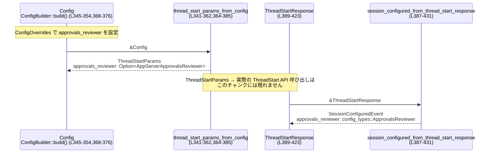

# exec/src/lib_tests.rs コード解説

## 0. ざっくり一言

このファイルは、`exec` クレートの公開 API（`exec_root_span`, `build_review_request`, `decode_prompt_bytes` など）について、**トレース・レビュー要求・プロンプト処理・スレッド起動パラメータ**などの振る舞いを検証するテスト群を定義しています（根拠: `exec/src/lib_tests.rs:L18-431`）。

---

## 1. このモジュールの役割

### 1.1 概要

- このモジュールは **`exec` ライブラリのコア機能が、外部とのインターフェース上どのように動作するか**を検証するためのテストを提供します。
- 主に次の領域をカバーしています（根拠: 各テスト本体の内容）
  - OpenTelemetry/`tracing` を用いたルートスパンの生成と親トレースコンテキストの継承（L23-40）
  - レビューコマンド用の `ReviewRequest` 構築ロジック（L42-101）
  - プロンプト文字列のバイト列デコード（BOM 処理・エラー）と `<stdin>` ラッパー（L104-197）
  - アプリサーバとのスレッド・ターン関連 API（turn アイテム取得・バックフィル判定など）（L241-322）
  - モデルプロバイダのフィルタリングやレビュー方針の反映など、設定とスレッド起動／セッション設定の橋渡し（L207-239, L341-385, L387-431）
  - MCP サーバーのエリシテーション（質問）キャンセルレスポンスの JSON 表現（L324-339）

### 1.2 アーキテクチャ内での位置づけ

このファイルは「親モジュール（`super::*`）」から公開されている関数・型に対する **ブラックボックステスト** の位置づけです（根拠: `use super::*;` `L1`）。

主な依存関係（テスト観点）を簡略化すると次のようになります。

```mermaid
graph TD
    subgraph Execライブラリ (super)
        ERS[exec_root_span]
        BRR[build_review_request]
        DPB[decode_prompt_bytes]
        PWC[prompt_with_stdin_context]
        LEW[lagged_event_warning_message]
        RLM[resume_lookup_model_providers]
        TIT[turn_items_for_thread]
        SBT[should_backfill_turn_completed_items]
        CMR[canceled_mcp_server_elicitation_response]
        TSP[thread_start_params_from_config]
        SCF[session_configured_from_thread_start_response]
    end

    T[lib_tests.rs] --> ERS
    T --> BRR
    T --> DPB
    T --> PWC
    T --> LEW
    T --> RLM
    T --> TIT
    T --> SBT
    T --> CMR
    T --> TSP
    T --> SCF

    T --> OTEL[opentelemetry / codex_otel]:::ext
    T --> CAPS[codex_app_server_protocol]:::ext
    T --> CPR[codex_protocol]:::ext
    T --> TOKIO[tokio]:::ext
    T --> SJ[serde_json]:::ext

    classDef ext fill:#eee,stroke:#999,stroke-width:1px;
```

- `super` モジュール（おそらく `exec/src/lib.rs`）の API を直接呼び出し、その挙動を検証します（根拠: `use super::*;` `L1`）。
- `codex_app_server_protocol` / `codex_protocol` といったプロトコル層の型を介して、**設定値 → プロトコル表現 → セッション設定イベント** といったデータの流れをテストしています（根拠: L241-288, L302-316, L387-423）。
- トレースについては OpenTelemetry/`tracing` の統合を前提に、`exec_root_span` が正しくトレースコンテキストを引き継げるかを確認しています（L23-40）。

### 1.3 設計上のポイント（テスト観点）

このファイルから読み取れる設計上の特徴をまとめます。

- **外部インターフェースに対するテストが中心**
  - CLI 引数風の構造体 (`ReviewArgs`, `ResumeArgs`) からドメインオブジェクト (`ReviewRequest`) への変換をテスト（L42-101, L219-232）。
  - 設定 (`Config`, `ConfigOverrides`) から、アプリサーバ用のパラメータ／イベント (`thread_start_params_from_config`, `session_configured_from_thread_start_response`) への変換をテスト（L341-385, L387-431）。

- **エラーとエッジケースを明示的に検証**
  - `decode_prompt_bytes` に対して、UTF-8/UTF-16 BOM・UTF-32 BOM・不正 UTF-8 のそれぞれをテストし、成功／失敗とエラー内容を確認（L104-177）。
  - イベントストリームのラグによるドロップ件数メッセージの明示性をテスト（L199-205）。
  - ephemeral なスレッドに対しては TurnCompleted イベントのバックフィルを行わないことをテスト（L302-322）。

- **Rust特有の安全性・エラー・並行性**
  - エラーは `Result` + 独自エラー型 (`PromptDecodeError`) により表現され、`expect`/`expect_err` で「成功すべき」「失敗すべき」ケースを明示しています（L108, L118, L128, L141, L159, L174）。
  - 非同期コンテキストでは `#[tokio::test]` を用いて `ConfigBuilder::build().await` などの async 関数を安全にテストしています（L207-239, L341-385）。
  - `test_tracing_subscriber` は `impl Subscriber + Send + Sync` を返しており、トレースサブスクライバがスレッドセーフであることが要求されています（L12）。

---

## 2. 主要な機能一覧（このテストで検証している機能）

このモジュール自体はテスト専用ですが、ここでは **テスト対象となっている主要機能** を列挙します。

- `DEFAULT_ANALYTICS_ENABLED` のデフォルト値が `true` であること（L18-21）。
- `exec_root_span` が W3C トレースコンテキストを親として引き継げること（L23-40）。
- `build_review_request` が `ReviewArgs` から適切な `ReviewRequest` を構築すること
  - 未コミット変更 (`UncommittedChanges`)（L42-59）
  - 特定コミット + タイトル付き (`Commit { sha, title }`)（L61-81）
  - カスタムプロンプト（前後の空白トリム）（L83-101）
- `decode_prompt_bytes` がプロンプトバイト列を文字列にデコード／エラー判定すること
  - UTF-8 BOM を除去（L104-111）
  - UTF-16LE/BE BOM を解釈（L113-131）
  - UTF-32LE/BE BOM をサポート外としてエラー（L133-167）
  - 不正 UTF-8 をエラーにする（L169-177）
- `prompt_with_stdin_context` が指定プロンプトと標準入力内容を `<stdin>` ブロックとして結合すること（末尾改行の有無に依らず整形）（L179-197）。
- `lagged_event_warning_message` がドロップされたイベント件数を埋め込んだ分かりやすい警告文を返すこと（L199-205）。
- `resume_lookup_model_providers` が `--last` などのフラグに応じてモデルプロバイダの絞り込み条件を返すこと（L207-239）。
- `turn_items_for_thread` が特定 Turn ID のアイテム一覧を返すこと（L241-300）。
- `should_backfill_turn_completed_items` が ephemeral スレッドをバックフィル対象から除外すること（L302-322）。
- `canceled_mcp_server_elicitation_response` が MCP サーバへの「キャンセル」レスポンス JSON を構築すること（L324-339）。
- `thread_start_params_from_config` がレビュー方針 (`ApprovalsReviewer`) をスレッド起動パラメータに含めること（L341-385）。
- `session_configured_from_thread_start_response` が ThreadStartResponse からセッション設定イベントを構築し、レビュー方針を持ち越すこと（L387-431）。

---

## 3. 公開 API と詳細解説

ここでは、このテストから振る舞いが読み取れる **親モジュール（`super`）側の主要 API** を整理します。

### 3.1 型一覧（外部／公開型）

このファイルに定義はありませんが、テストから読み取れる主要な型をまとめます。

| 名前 | 種別 | 役割 / 用途 | 根拠 |
|------|------|-------------|------|
| `ReviewArgs` | 構造体（親モジュール定義） | レビューコマンドの入力。未コミットかどうか・ベース/コミット SHA・コミットタイトル・カスタムプロンプトなどを保持。 | フィールドリテラル使用（`uncommitted`, `base`, `commit`, `commit_title`, `prompt`）（L44-50, L63-69, L85-91） |
| `ReviewRequest` | 構造体（親モジュール定義） | レビュー実行時に内部ロジックへ渡すリクエスト。`target` と `user_facing_hint` を持つ。 | リテラル構築（L53-56, L72-78, L94-99） |
| `ReviewTarget` | 列挙体（親モジュール定義） | レビュー対象（未コミット変更・特定コミット・カスタム指示）を表現。 | バリアント `UncommittedChanges`, `Commit { sha, title }`, `Custom { instructions }`（L54, L73-76, L95-97） |
| `PromptDecodeError` | 列挙体（親モジュール定義） | プロンプトバイト列のデコードエラーを表す。BOM 非対応/不正 UTF-8 など。 | バリアント `UnsupportedBom { encoding }`, `InvalidUtf8 { valid_up_to }`（L145-147, L163-165, L176） |
| `AppServerThread` | 構造体（`codex_app_server_protocol` or ラッパー） | アプリサーバ上のスレッド情報。ID、ephemeral フラグ、モデルなどと `turns` を持つ。 | フィールド初期化（L243-259, L260-287） |
| `AppServerThreadItem` | 列挙体（親モジュール定義またはプロトコル型 type alias） | ターン内のアイテム（エージェントメッセージ・プランなど）を表現。 | バリアント `AgentMessage { id, text, ... }`, `Plan { id, text }`（L263-268, L277-280, L292-297） |
| `ServerNotification` | 列挙体（親モジュール定義） | アプリサーバから CLI への通知。ここでは `TurnCompleted` をテスト。 | `ServerNotification::TurnCompleted(...)` の使用（L304-316） |
| `ConfigBuilder` | 構造体/ビルダ（親モジュール定義） | `Config` を非同期に構築するビルダ。`codex_home`, `fallback_cwd`, `harness_overrides` を設定可能。 | `ConfigBuilder::default().codex_home(...).fallback_cwd(...).harness_overrides(...).build().await`（L211-215, L345-353, L368-376） |
| `Config` | 構造体（親モジュール定義） | CLI 実行時の構成。`model_provider_id` フィールドなどを持つ。 | `let mut config = ...; config.model_provider_id = "test-provider".to_string();`（L211-217） |
| `ConfigOverrides` | 構造体（親モジュール定義） | テストハーネス用の設定上書き。`approvals_reviewer` など。`Default` 実装あり。 | `ConfigOverrides { approvals_reviewer: Some(...), ..Default::default() }`（L347-350, L370-373） |
| `ThreadStartResponse` | 構造体（親モジュールかテスト用型） | アプリサーバから返る「スレッド開始」レスポンス。`thread`, `approval_policy`, `approvals_reviewer`, `sandbox` などを含む。 | リテラル構築（L389-423） |
| `McpServerElicitationRequestResponse` | 構造体（親モジュール定義または別クレート） | MCP サーバーへのエリシテーションレスポンスを表現。`action`, `content`, `meta` を持つ。 | JSON をこの型に逆シリアライズし比較（L328-337） |
| `McpServerElicitationAction` | 列挙体 | MCP レスポンスのアクション種別。ここでは `Cancel` のみ使用。 | `McpServerElicitationAction::Cancel`（L334） |

> 注: これらの型の正確な定義（フィールドの完全な一覧や実装トレイト）はこのファイルには現れません。上記はテストで使用しているフィールド・バリアントから読み取れる範囲の整理です。

### 3.2 重要関数の詳細

このチャンクから挙動がよく見える関数を 7 個選び、テストから読み取れる契約を整理します。

#### `build_review_request(args: &ReviewArgs) -> Result<ReviewRequest, E> または Option<ReviewRequest>`

**概要**

- レビューサブコマンドの引数 (`ReviewArgs`) から、内部で使う `ReviewRequest` を構築する関数です。
- どのフィールドが埋まるかは `uncommitted`, `commit`, `prompt` などの組み合わせによって決まります（L42-59, L61-81, L83-101）。

**引数**

| 引数名 | 型 | 説明 |
|--------|----|------|
| `args` | `&ReviewArgs` | ユーザ入力を表す構造体。`uncommitted`, `base`, `commit`, `commit_title`, `prompt` フィールドを持つ（L44-50, L63-69, L85-91）。 |

**戻り値**

- テストでは `.expect("...")` を呼んでおり、`Result<ReviewRequest, E>` か `Option<ReviewRequest>` のいずれかです（L51, L70, L92）。
- 成功時には `ReviewRequest` を返し、テストではその値をリテラルと `assert_eq!` で比較しています（L53-56, L72-78, L94-99）。

**内部処理の流れ（テストから読める契約）**

1. `args.uncommitted == true` のとき  
   - `target` は `ReviewTarget::UncommittedChanges` になる（L44-55）。
   - `user_facing_hint` は `None`（L55-56）。
2. `args.uncommitted == false` かつ `args.commit` が `Some(sha)`、`args.commit_title` が `Some(title)` のとき  
   - `target` は `ReviewTarget::Commit { sha, title: Some(title) }` になる（L63-77）。
   - ここでも `user_facing_hint` は `None`（L77-78）。
3. `args.prompt` が `Some(prompt_str)` のとき  
   - `prompt_str` の前後の空白がトリムされ、`ReviewTarget::Custom { instructions }` に入る（L85-97）。  
     例: `"  custom review instructions  "` → `"custom review instructions"`（L90, L96）。
   - `user_facing_hint` は `None`（L98-99）。

**Examples（使用例）**

テストと同等の使い方の例です。

```rust
// ユーザが「未コミット変更をレビューしてほしい」と指定したケース
let args = ReviewArgs {
    uncommitted: true,
    base: None,
    commit: None,
    commit_title: None,
    prompt: None,
};

let request = build_review_request(&args)  // Result または Option
    .expect("uncommitted review request should be buildable");

assert_eq!(
    request,
    ReviewRequest {
        target: ReviewTarget::UncommittedChanges,
        user_facing_hint: None,
    }
);
```

**Errors / Panics**

- テストでは、成功してほしいケースで `.expect("...")` を使用しているため、ここで `Err` や `None` が返ると panic します（L51, L70, L92）。
- どの入力で失敗するかはこのファイルからは読み取れません。

**Edge cases（エッジケース）**

- カスタムプロンプトの前後の空白が削除されることがテストされています（L85-90, L94-97）。
  - 空文字や空白だけの文字列が渡された場合の挙動はテストされておらず、このチャンクからは不明です。
- `base` フィールドは常に `None` で使われており、ベースコミットが指定された場合の挙動は不明です（L46, L65, L87）。

**使用上の注意点**

- この関数の戻り値をそのまま `expect` する場合、入力に応じて panic しうるため、CLI 実装では本番時に `expect` ではなくエラーをユーザに返す形で扱う必要があります（テストが `expect` を使っているのは「成立するはずのケース」を検証するため、という意図と解釈できます）。

**根拠**

- 未コミットケース: `builds_uncommitted_review_request`（L42-59）。
- コミット + タイトル: `builds_commit_review_request_with_title`（L61-81）。
- カスタムプロンプト: `builds_custom_review_request_trims_prompt`（L83-101）。

---

#### `decode_prompt_bytes(bytes: &[u8]) -> Result<StringLike, PromptDecodeError>`

> `StringLike` は成功時に UTF-8 テキストを表す型で、テスト上は `"hi\n"` との比較に使われます（L110, L120, L130）。

**概要**

- プロンプト（指示文）をファイルなどからバイト列として読み込み、そのエンコーディングを自動判別して UTF-8 文字列に変換する関数です。
- UTF-8 BOM や UTF-16LE/BE BOM には対応し、UTF-32 BOM や不正な UTF-8 はエラーとして扱います（L104-167, L169-177）。

**引数**

| 引数名 | 型 | 説明 |
|--------|----|------|
| `bytes` | `&[u8]` | 元のバイト列。先頭に BOM がついている場合があります（L106, L116, L126, L136-138, L155-156, L172）。 |

**戻り値**

- `Result<StringLike, PromptDecodeError>` 型（`expect` と `expect_err` の両方が使われているので Result であることは確実）（L108, L118, L128, L141, L159, L174）。
- 成功時: UTF-8 文字列（`"hi\n"`）に変換されます（L110, L120, L130）。
- 失敗時: `PromptDecodeError` の各バリアントでエラーの種類が伝えられます（L145-147, L163-165, L176）。

**内部処理の流れ（テストから読める契約）**

概念的なフローは次のように整理できます。

```mermaid
flowchart LR
    B[bytes引数<br/>decode_prompt_bytes (L105-177)] --> C{先頭BOM?}
    C -->|UTF-8 BOM (EF BB BF)| U8[UTF-8としてデコード<br/>BOMは除去]
    C -->|UTF-16LE BOM (FF FE)| U16L[UTF-16LEとしてデコード]
    C -->|UTF-16BE BOM (FE FF)| U16B[UTF-16BEとしてデコード]
    C -->|UTF-32LE/BE BOM| E1[Err(UnsupportedBom)]
    C -->|BOMなし/その他| U8orErr[（詳細不明）UTF-8デコード or エラー]

    U8 --> Ok["Ok(StringLike)"]
    U16L --> Ok
    U16B --> Ok
    E1 --> Err["Err(PromptDecodeError::UnsupportedBom)"]
```

- UTF-8 + BOM:
  - 入力 `[0xEF, 0xBB, 0xBF, b'h', b'i', b'\n']` → `"hi\n"`（L105-111）。
  - BOM 部分は出力から取り除かれます。
- UTF-16LE:
  - 入力 `0xFF,0xFE,'h',0x00,'i',0x00,'\n',0x00` → `"hi\n"`（L113-121）。
- UTF-16BE:
  - 入力 `0xFE,0xFF,0x00,'h',0x00,'i',0x00,'\n'` → `"hi\n"`（L123-131）。
- UTF-32LE:
  - `0xFF,0xFE,0x00,0x00` から始まる BOM を検知した場合、  
    `Err(PromptDecodeError::UnsupportedBom{ encoding: "UTF-32LE" })` を返す（L133-148）。
- UTF-32BE:
  - `0x00,0x00,0xFE,0xFF` から始まる BOM を検知した場合、  
    `Err(PromptDecodeError::UnsupportedBom{ encoding: "UTF-32BE" })` を返す（L151-166）。
- 不正 UTF-8:
  - シーケンス `[0xC3, 0x28]` は UTF-8 として無効であり、  
    `Err(PromptDecodeError::InvalidUtf8 { valid_up_to: 0 })` を返す（L169-177）。

**Examples（使用例）**

```rust
// BOM 付き UTF-8 のプロンプトファイルをデコードする例
let raw = std::fs::read("prompt.txt")?;                 // ファイルからバイト列を読み込む
let prompt = decode_prompt_bytes(&raw)                  // Result で返る
    .map_err(|e| format!("プロンプトのデコードに失敗しました: {e:?}"))?;

println!("decoded prompt:\n{}", prompt);                // UTF-8 文字列として利用
```

**Errors / Panics**

- `UnsupportedBom { encoding: "UTF-32LE" | "UTF-32BE" }`  
  → UTF-32 の BOM が検出された際に返されます（L145-147, L163-165）。
- `InvalidUtf8 { valid_up_to }`  
  → UTF-8 デコードに失敗した際に返され、`valid_up_to` は有効だったバイト境界までのオフセット（テストでは 0）（L176）。
- テストでは `.expect`／`.expect_err` を使用しているため、想定外の成功/失敗時には panic しますが、ライブラリ利用者側で `match` などで安全に扱うことが想定されます。

**Edge cases（エッジケース）**

- UTF-32 BOM を含む入力は**あえて対応せず**、エラーにしている点が明示されています（L133-148, L151-166）。
- 不正 UTF-8 は `valid_up_to` を通じて部分的成功位置が分かるため、利用側でログなどに活用できます（L169-177）。
- BOM がない通常の UTF-8 入力の挙動は、このチャンクには現れません。

**使用上の注意点**

- UTF-32 のような大きなコード単位を持つエンコーディングはサポート外のため、そのような入力に対しては事前に変換する必要があります。
- エラーを無視して `expect` などで強制アンラップすると、ユーザ入力によって CLI が簡単にクラッシュする可能性があります。  
  実際の利用コードでは `Result` を適切に処理することが前提になります。

**根拠**

- 成功ケース: `decode_prompt_bytes_strips_utf8_bom`, `decode_prompt_bytes_decodes_utf16le_bom`, `decode_prompt_bytes_decodes_utf16be_bom`（L104-131）。
- 失敗ケース: `decode_prompt_bytes_rejects_utf32le_bom`, `decode_prompt_bytes_rejects_utf32be_bom`, `decode_prompt_bytes_rejects_invalid_utf8`（L133-177）。

---

#### `prompt_with_stdin_context(prompt: &str, stdin_text: &str) -> String`

**概要**

- ユーザプロンプトと、標準入力からのテキスト（例: `cmd | exec` の右側）を 1 つのプロンプト文字列にまとめるためのユーティリティです。
- 標準入力部分は `<stdin> ... </stdin>` ブロックとして埋め込まれます（L179-197）。

**引数**

| 引数名 | 型 | 説明 |
|--------|----|------|
| `prompt` | `&str` | ユーザ指定のメインプロンプト（例: 「Summarize this concisely」）（L181, L191）。 |
| `stdin_text` | `&str` | 標準入力から得たテキスト。末尾改行の有無はこの関数が吸収します（L181, L191）。 |

**戻り値**

- `String`（もしくはそれに準ずる所有型）で、次のような形式になります（テストからの例、L183-186, L193-196）:

  ```
  {prompt}

  <stdin>
  {normalized_stdin_text}
  </stdin>
  ```

**内部処理の流れ（テストから読める契約）**

1. 先頭に `prompt` を置き、その直後に空行（`\n\n`）を挿入する（L183-186, L193-196）。
2. `<stdin>` 行を追加し、その次の行に標準入力テキストを出力する（L183-186, L193-196）。
3. 標準入力テキストの末尾改行について:
   - `"my output"` → ブロック内は `"my output\n"`（L181-186）。
   - `"my output\n"` → ブロック内も `"my output\n"`（L191-196）。  
   少なくとも「末尾に 1 つ改行があるケース」と「ないケース」で、**結果として ちょうど 1 行分のテキスト + 改行**になっていることが確認できます。
4. 最後に `</stdin>` 行を追加する（L183-186, L193-196）。

**Examples（使用例）**

```rust
let prompt = "Summarize this concisely";
let stdin_output = "line1\nline2\n";                    // 何らかのコマンド出力

let combined = prompt_with_stdin_context(prompt, stdin_output);

println!("{}", combined);
// 期待されるイメージ:
// Summarize this concisely
//
// <stdin>
// line1
// line2
// </stdin>
```

**Errors / Panics**

- この関数は純粋な文字列操作のみであり、テストからはエラーを返さない純粋関数と読み取れます（L179-197）。

**Edge cases（エッジケース）**

- 入力の末尾に改行がある場合もない場合も、結果では `<stdin>` ブロック内が適切に整形されます（L179-197）。
- 空文字列が渡された場合や複数の末尾改行がある場合の挙動はテストされていません。

**使用上の注意点**

- `<stdin>` ブロックのマーカー文字列（`<stdin>` / `</stdin>`）はプロトコルやモデル側の約束事である可能性が高く、変更すると下流処理に影響するため注意が必要です（この点はコードから推測できる範囲です）。

**根拠**

- `prompt_with_stdin_context_wraps_stdin_block`, `prompt_with_stdin_context_preserves_trailing_newline` テスト（L179-197）。

---

#### `resume_lookup_model_providers(config: &Config, args: &crate::cli::ResumeArgs) -> Option<Vec<String>>`

**概要**

- `exec resume` のようなサブコマンドでセッション再開候補を探す際、「どのモデルプロバイダのセッションを対象にするか」をフィルタリングするための関数です。
- `--last` フラグなどに基づき、特定プロバイダだけを対象にするかどうかが決まります（L207-239）。

**引数**

| 引数名 | 型 | 説明 |
|--------|----|------|
| `config` | `&Config` | CLI 全体の設定。`model_provider_id` を含みます（L211-217）。 |
| `args` | `&crate::cli::ResumeArgs` | `resume` サブコマンドの引数。`session_id`, `last`, `all`, `images`, `prompt` を持つ（L219-225, L226-232）。 |

**戻り値**

- `Option<Vec<String>>`（テストで `Some(vec!["test-provider".to_string()])` と比較、L234-237）。
  - `Some(vec![...])`: モデルプロバイダ ID のフィルタを表す。
  - `None`: フィルタ無し、またはこのテストの文脈では「絞り込まない」ことを意味すると解釈できます。

**内部処理の流れ（テストから読める契約）**

1. `args.last == true` かつ `args.session_id == None` のケース（L219-225）:
   - 戻り値は `Some(vec![config.model_provider_id.clone()])` になる（L211-217, L234-237）。
2. `args.session_id == Some(..)` かつ `last == false` のケース（L226-232）:
   - 戻り値は `None` になる（L238-239）。
3. `all` フラグや `images`, `prompt` の影響はこのチャンクからは読み取れません。

**Examples（使用例）**

```rust
let mut config = ConfigBuilder::default()
    .codex_home(codex_home.path().to_path_buf())
    .fallback_cwd(Some(cwd.path().to_path_buf()))
    .build()
    .await?;
config.model_provider_id = "test-provider".to_string();

let args = crate::cli::ResumeArgs {
    session_id: None,
    last: true,
    all: false,
    images: vec![],
    prompt: None,
};

let providers = resume_lookup_model_providers(&config, &args);
assert_eq!(providers, Some(vec!["test-provider".to_string()]));
```

**Errors / Panics**

- `resume_lookup_model_providers` 自体は `Option` を返すのみで、panic する要素はテストからは見えません（L234-239）。

**Edge cases（エッジケース）**

- `last == true` かつ `session_id == None` のときだけ `Some` が返る、という最低限の契約が確認できます（L219-225, L234-237）。
- `session_id` が指定されているケースなど、`None` が返る条件は他にもある可能性がありますが、このチャンクには現れません。

**使用上の注意点**

- 戻り値 `None` は「エラー」ではなく「フィルタなし」などの正常系を表すため、呼び出し側は `Option` の意味を取り違えないように扱う必要があります。

**根拠**

- `resume_lookup_model_providers_filters_only_last_lookup` テスト（L207-239）。

---

#### `turn_items_for_thread(thread: &AppServerThread, turn_id: &str) -> Option<Vec<AppServerThreadItem>>`

**概要**

- アプリサーバのスレッド（`AppServerThread`）から、指定した Turn ID に対応するアイテム一覧を取り出す関数です（L241-300）。
- 存在しない Turn ID が指定された場合は `None` を返します。

**引数**

| 引数名 | 型 | 説明 |
|--------|----|------|
| `thread` | `&AppServerThread` | `turns: Vec<Turn>` を持つスレッドオブジェクト（L243-288）。 |
| `turn_id` | `&str` | 取得したいターンの ID。例: `"turn-1"`（L291, L299）。 |

**戻り値**

- `Option<Vec<AppServerThreadItem>>`（`Some` / `None` 比較から、L291-299）。
  - `Some(items)`: 指定 Turn ID が存在し、その `items` をそのまま返していると読み取れます。
  - `None`: 該当するターンが存在しない場合。

**内部処理の流れ（テストから読める契約）**

1. `thread.turns` を走査し、`turn.id == turn_id` のターンを探す（L260-263, L275-276）。
2. 見つかれば、その `turn.items` を `Vec<AppServerThreadItem>` として返す（L263-268, L292-297）。
3. 見つからなければ `None` を返す（L299）。

**Examples（使用例）**

```rust
let items = turn_items_for_thread(&thread, "turn-1");
if let Some(items) = items {
    for item in items {
        // AppServerThreadItem::AgentMessage などにマッチさせて処理
    }
} else {
    eprintln!("指定されたターンは見つかりませんでした");
}
```

**Errors / Panics**

- 見つからない場合は `None` を返すだけであり、panic にはなりません（L299）。

**Edge cases（エッジケース）**

- スレッドにターンが 1 つもない場合（`turns: vec![]`）の挙動は、このテストでは扱っていません。
- 複数のターンが同じ ID を持つケースは想定していないように見えますが、このチャンクからは断定できません。

**使用上の注意点**

- 戻り値が `Option` であるため、呼び出し側は `None` のケースを必ず考慮する必要があります。

**根拠**

- `turn_items_for_thread_returns_matching_turn_items` テストで、存在する ID と存在しない ID の両方に対する挙動が確認されています（L241-300）。

---

#### `should_backfill_turn_completed_items(thread_ephemeral: bool, notification: &ServerNotification) -> bool`

**概要**

- アプリサーバからの `TurnCompleted` 通知を受けて、CLI 側で「アイテムバックフィル」（たとえば欠落ログの補完）を行うべきかどうかを判定する関数です。
- テストでは、ephemeral スレッドに対してはバックフィルをスキップすることが確認されています（L302-322）。

**引数**

| 引数名 | 型 | 説明 |
|--------|----|------|
| `thread_ephemeral` | `bool` | 対象スレッドが ephemeral（一時的）かどうか（L318-320）。 |
| `notification` | `&ServerNotification` | `ServerNotification::TurnCompleted(...)` などの通知オブジェクト（L304-316）。 |

**戻り値**

- `bool`:
  - `true`: バックフィルを実行すべき。
  - `false`: バックフィルをスキップすべき。
- テストでは `thread_ephemeral == true` の場合に `false` を返していることが確認できます（L318-321）。

**内部処理の流れ（テストから読める契約）**

1. `thread_ephemeral == true` の場合は `false` を返す（L318-321）。
2. それ以外（非 ephemeral スレッド）の挙動はこのチャンクには現れません。

**Examples（使用例）**

```rust
let should_backfill = should_backfill_turn_completed_items(
    thread.ephemeral,
    &notification,
);

if should_backfill {
    // TurnCompleted の内容を使って何らかのバックフィル処理を行う
}
```

**Errors / Panics**

- 単純な真偽判定のみで、エラーや panic は想定されません（L318-321）。

**Edge cases（エッジケース）**

- ephemeral スレッドでは常にバックフィルしない、という方針が明示されます（L318-321）。
- 通知がどのような状態（空の items など）でも、この関数のテストはそこを判定条件にはしていません（L304-315）。

**使用上の注意点**

- ephemeral スレッドの定義（どのようなセッションが ephemeral とみなされるか）は他のモジュールに依存します。この関数に boolean を渡す側で正しく判断する必要があります。

**根拠**

- `should_backfill_turn_completed_items_skips_ephemeral_threads` テスト（L302-322）。

---

#### `thread_start_params_from_config(config: &Config) -> ThreadStartParams`

**概要**

- CLI 側の `Config` から、アプリサーバへスレッドを開始する際のパラメータ（`ThreadStartParams` のような型）を生成する関数です。
- 特に「レビューの担当者（approvals_reviewer）」の設定をパラメータに反映していることがテストで確認できます（L341-385）。

**引数**

| 引数名 | 型 | 説明 |
|--------|----|------|
| `config` | `&Config` | `ConfigBuilder` から構築された設定。`harness_overrides.approvals_reviewer` などを含む（L345-354, L368-376）。 |

**戻り値**

- `ThreadStartParams` 相当の構造体（型名はこのチャンクには現れない）が返され、その中に `approvals_reviewer: Option<codex_app_server_protocol::ApprovalsReviewer>` フィールドが存在します（L356-361, L379-383）。

**内部処理の流れ（テストから読める契約）**

1. `config.harness_overrides.approvals_reviewer` が `Some(ApprovalsReviewer::User)` のとき
   - 戻り値 `params.approvals_reviewer` は  
     `Some(codex_app_server_protocol::ApprovalsReviewer::User)` になる（L347-349, L356-361）。
2. `config.harness_overrides.approvals_reviewer` が `Some(ApprovalsReviewer::GuardianSubagent)` のとき
   - 戻り値 `params.approvals_reviewer` は  
     `Some(codex_app_server_protocol::ApprovalsReviewer::GuardianSubagent)` になる（L370-372, L379-383）。

**Examples（使用例）**

```rust
let config = ConfigBuilder::default()
    .codex_home(codex_home.path().to_path_buf())
    .harness_overrides(ConfigOverrides {
        approvals_reviewer: Some(ApprovalsReviewer::User),
        ..Default::default()
    })
    .fallback_cwd(Some(cwd.path().to_path_buf()))
    .build()
    .await?;

let params = thread_start_params_from_config(&config);
// params.approvals_reviewer が AppServer プロトコル側の enum に変換されている
assert_eq!(
    params.approvals_reviewer,
    Some(codex_app_server_protocol::ApprovalsReviewer::User),
);
```

**Errors / Panics**

- この関数自体は同期であり、テストからはエラーや panic を返す様子はありません（L356-361, L379-383）。

**Edge cases（エッジケース）**

- `approvals_reviewer` が `Some(...)` の場合のマッピングのみがテストされています。
- `None` の場合（レビュー機能無効など）に `params.approvals_reviewer` がどうなるかは、このチャンクからは不明です。

**使用上の注意点**

- `ConfigOverrides` による上書き設定は、テストハーネスだけでなく本番コードでもレビュー方針切り替えに用いられる可能性があります。そのため、この関数は config → プロトコル enum の対応関係を一元的に担っていると解釈できます。

**根拠**

- `thread_start_params_include_review_policy_when_review_policy_is_manual_only`（L341-362）。  
- `thread_start_params_include_review_policy_when_auto_review_is_enabled`（L364-385）。

---

#### `session_configured_from_thread_start_response(resp: &ThreadStartResponse) -> Result<Event, E>`

**概要**

- アプリサーバから返された `ThreadStartResponse` をもとに、CLI 側の「セッション設定完了」イベントを構築する関数です。
- レビュー方針 `approvals_reviewer` がレスポンスからイベントへ引き継がれることがテストされています（L387-431）。

**引数**

| 引数名 | 型 | 説明 |
|--------|----|------|
| `resp` | `&ThreadStartResponse` | アプリサーバからのスレッド開始レスポンス。`thread`, `approval_policy`, `approvals_reviewer`, `sandbox` などを含む（L389-423）。 |

**戻り値**

- `Result<Event, E>` または `Option<Event>`。テストでは `session_configured_from_thread_start_response(&response).expect("...")` として利用されており、成功時に `event` オブジェクトが得られます（L425-426）。
- `event` には `approvals_reviewer: codex_protocol::config_types::ApprovalsReviewer` フィールドが含まれます（L428-430）。

**内部処理の流れ（テストから読める契約）**

1. `resp.approvals_reviewer` が `codex_app_server_protocol::ApprovalsReviewer::GuardianSubagent` であるレスポンスを受け取り（L414-415）。
2. 戻り値のイベント `event.approvals_reviewer` が、`codex_protocol::config_types::ApprovalsReviewer::GuardianSubagent` になる（L428-430）。
3. `ThreadStartResponse` の他フィールド（`sandbox`, `approval_policy`, `thread` など）がどのようにイベントに反映されるかは、このチャンクからは不明です。

**Examples（使用例）**

```rust
let response: ThreadStartResponse = /* app server からのレスポンス */;

let event = session_configured_from_thread_start_response(&response)
    .expect("thread start response should be convertible to event");

// config_types::ApprovalsReviewer に変換されていることを前提に処理
match event.approvals_reviewer {
    ApprovalsReviewer::GuardianSubagent => { /* ... */ }
    ApprovalsReviewer::User => { /* ... */ }
    // 他のバリアント...
}
```

**Errors / Panics**

- テストからは成功ケースしか読み取れませんが、型が `Result` であれば、レスポンスが不正な場合などに `Err` を返す可能性があります。

**Edge cases（エッジケース）**

- `approvals_reviewer` が `GuardianSubagent` 以外の場合や `None` の場合のマッピングは、このチャンクには現れません。
- `ThreadStartResponse` の `approval_policy` との整合性チェックの有無も不明です（L413-414）。

**使用上の注意点**

- プロトコル層の enum（`codex_app_server_protocol::ApprovalsReviewer`）と設定層の enum（`codex_protocol::config_types::ApprovalsReviewer`）の変換がここで行われるため、新しいバリアントを追加する場合はこの関数も更新が必要になると考えられます。

**根拠**

- `session_configured_from_thread_response_uses_review_policy_from_response` テスト（L387-431）。

---

### 3.3 その他の関数（簡易一覧）

ここではテストから挙動がほぼ一意に決まる簡単な関数を一覧します。

| 関数名 | 役割（1 行） | 根拠 |
|--------|--------------|------|
| `exec_root_span()` | OpenTelemetry/`tracing` 用のルートスパンを作成し、`set_parent_from_w3c_trace_context` に渡せる `tracing::Span` を返す。 | `exec_root_span_can_be_parented_from_trace_context` で W3C TraceContext を親にしたトレース ID を検証（L24-40）。 |
| `lagged_event_warning_message(skipped: usize) -> String` | イベントストリームのラグによりドロップされたイベント件数を含む警告メッセージを生成する。 | `"in-process app-server event stream lagged; dropped 7 events"` との比較（L199-205）。 |
| `canceled_mcp_server_elicitation_response() -> Result<serde_json::Value, E> or Option<serde_json::Value>` | MCP サーバー向けに `{"action": "cancel", "content": null, "meta": null}` に相当するレスポンス JSON を生成する。 | `McpServerElicitationRequestResponse { action: Cancel, content: None, meta: None }` にデシリアライズして比較（L325-337）。 |
| `exec_defaults_analytics_to_enabled()`（テスト） | `DEFAULT_ANALYTICS_ENABLED` が `true` であることを検証するテスト関数。 | `assert_eq!(DEFAULT_ANALYTICS_ENABLED, true);`（L18-21）。 |
| `test_tracing_subscriber()`（テスト用ヘルパー） | OpenTelemetry をバックエンドとする `tracing` サブスクライバを構築し、テスト用に返す。 | `SdkTracerProvider::builder().build()` + `tracing_subscriber::registry().with(tracing_opentelemetry::layer().with_tracer(tracer))`（L12-15）。 |

---

## 4. データフロー

### 4.1 プロンプトバイト列のデコードフロー

`decode_prompt_bytes` がどうバイト列を扱うかを、テストでカバーされている範囲で示します。

```mermaid
flowchart TD
    A[ファイルなどから取得したバイト列<br/>decode_prompt_bytes (L105-177)] --> B{BOM種別}
    B -->|UTF-8 BOM| C[UTF-8 としてデコード<br/>BOMを除去]
    B -->|UTF-16LE BOM| D[UTF-16LE としてデコード<br/>UTF-8 に変換]
    B -->|UTF-16BE BOM| E[UTF-16BE としてデコード<br/>UTF-8 に変換]
    B -->|UTF-32LE/BE BOM| F[Err(PromptDecodeError::UnsupportedBom)]
    B -->|BOMなし or その他| G[UTF-8 としてデコード（不正 UTF-8 なら Err(InvalidUtf8))]

    C --> H[Ok(StringLike)]
    D --> H
    E --> H
    F --> I[Err(UnsupportedBom)]
    G --> H
    G --> J[Err(InvalidUtf8)]
```

- テストで具体的に確認されているのは UTF-8/16/32 の一部パターンですが、構造は上図のように「BOM → デコード戦略 → `Result`」という流れになっています（L105-177）。

### 4.2 設定からスレッド起動・セッション設定への流れ

レビュー方針 (`ApprovalsReviewer`) に関するデータフローを、テストの呼び出し関係に基づいて整理します。



- `ConfigBuilder` で `harness_overrides.approvals_reviewer` を埋める → `thread_start_params_from_config` が app-server プロトコルの enum にマッピング → app-server が `ThreadStartResponse.approvals_reviewer` に設定 → `session_configured_from_thread_start_response` が config_types の enum に再マッピング、という**往復の型変換**が行われていることが分かります（L345-354, L368-376, L356-361, L379-383, L414-415, L428-430）。

---

## 5. 使い方（How to Use）

ここでは、テストコードを参考にした **代表的な利用パターン** を示します。実際のモジュールパスは `super::*` 側に依存するため、擬似コード的な形になります。

### 5.1 基本的な使用方法例

#### 5.1.1 レビューリクエストの構築

```rust
// レビューコマンドの引数を構築する（例: 未コミット変更をレビュー）
let args = ReviewArgs {
    uncommitted: true,
    base: None,
    commit: None,
    commit_title: None,
    prompt: None,
};

// ReviewRequest を生成（エラー処理は省略）
let request = build_review_request(&args)
    .expect("レビューリクエストの構築に失敗しました");

// ここから先は request.target に応じて処理を分岐できる
match request.target {
    ReviewTarget::UncommittedChanges => { /* ワークスペース全体を対象にレビュー */ }
    ReviewTarget::Commit { ref sha, .. } => { /* 特定コミットを対象にレビュー */ }
    ReviewTarget::Custom { ref instructions } => { /* カスタム指示を使ったレビュー */ }
}
```

この例は `builds_uncommitted_review_request` テストと同じパターンです（L42-59）。

#### 5.1.2 プロンプトファイルの読み込みと `<stdin>` 結合

```rust
// ファイルからプロンプトを読み込み、エンコーディングを自動判別
let prompt_bytes = std::fs::read("prompt.txt")?;
let prompt_text = decode_prompt_bytes(&prompt_bytes)
    .map_err(|e| format!("プロンプトのデコードに失敗: {e:?}"))?;

// 標準入力の内容（例: 他コマンドの出力）を取得
let mut stdin_buf = String::new();
std::io::stdin().read_to_string(&mut stdin_buf)?;

// モデルに渡す最終プロンプトを構成
let combined = prompt_with_stdin_context(&prompt_text, &stdin_buf);
// combined を使ってモデルにクエリを投げる
```

これは `decode_prompt_bytes_*` と `prompt_with_stdin_context_*` テストの組み合わせ的な利用例です（L104-177, L179-197）。

### 5.2 よくある使用パターン

#### 5.2.1 `resume` サブコマンドでの `--last` フィルタ

```rust
// Config をビルダから構築し、model_provider_id を設定
let mut config = ConfigBuilder::default()
    .codex_home(codex_home.path().to_path_buf())
    .fallback_cwd(Some(cwd.path().to_path_buf()))
    .build()
    .await?;
config.model_provider_id = "test-provider".into();

// --last フラグ付きで resume
let args = crate::cli::ResumeArgs {
    session_id: None,
    last: true,
    all: false,
    images: vec![],
    prompt: None,
};

if let Some(providers) = resume_lookup_model_providers(&config, &args) {
    // providers = vec!["test-provider"]
    // このプロバイダのセッションだけを再開候補として検索する
}
```

このパターンはテスト `resume_lookup_model_providers_filters_only_last_lookup` に対応します（L207-239）。

#### 5.2.2 スレッド起動とセッション設定イベント

```rust
// Config にレビュー方針（例: GuardianSubagent）を設定
let config = ConfigBuilder::default()
    .codex_home(codex_home.path().to_path_buf())
    .harness_overrides(ConfigOverrides {
        approvals_reviewer: Some(ApprovalsReviewer::GuardianSubagent),
        ..Default::default()
    })
    .fallback_cwd(Some(cwd.path().to_path_buf()))
    .build()
    .await?;

// ThreadStartParams を生成して app-server に送る
let params = thread_start_params_from_config(&config);
// ... app-server に params を送って ThreadStartResponse を受信 ...

// 受信したレスポンスをセッション設定イベントに変換
let response: ThreadStartResponse = /* 受信したレスポンス */;
let event = session_configured_from_thread_start_response(&response)
    .expect("スレッド開始レスポンスからのイベント生成失敗");

assert_eq!(
    event.approvals_reviewer,
    ApprovalsReviewer::GuardianSubagent,
);
```

テスト `thread_start_params_include_review_policy_when_auto_review_is_enabled` と `session_configured_from_thread_response_uses_review_policy_from_response` に対応した流れです（L364-385, L387-431）。

### 5.3 よくある間違い（推測可能な範囲）

テストから推測できる誤用例とその修正版です。

```rust
// 誤り例: decode_prompt_bytes のエラーを無視してクラッシュさせる
let bytes = std::fs::read("prompt.txt")?;
let prompt = decode_prompt_bytes(&bytes).unwrap();  // 不正エンコーディングで panic しうる

// 正しい例: エラーを明示的に処理する
let prompt = match decode_prompt_bytes(&bytes) {
    Ok(p) => p,
    Err(e) => {
        eprintln!("プロンプトのデコードに失敗しました: {e:?}");
        std::process::exit(1);
    }
};
```

```rust
// 誤り例: turn_items_for_thread の None を考慮しない
let items = turn_items_for_thread(&thread, "turn-42").unwrap(); // 存在しない ID なら panic

// 正しい例: Option を安全に扱う
if let Some(items) = turn_items_for_thread(&thread, "turn-42") {
    // items を処理
} else {
    eprintln!("指定されたターンは存在しません");
}
```

### 5.4 使用上の注意点（まとめ）

- **エラー型 `PromptDecodeError` の扱い**  
  - BOM 非対応・不正 UTF-8 など、ユーザ入力に依存するエラーが多いため、必ず `Result` をハンドリングするべきです（L133-177）。
- **`Option` 戻り値の関数**  
  - `resume_lookup_model_providers` や `turn_items_for_thread` は `None` を正常系として返すため、`unwrap` は避けるべきです（L234-239, L291-299）。
- **レビュー方針のマッピング**  
  - `ApprovalsReviewer` のバリアント追加時には `thread_start_params_from_config` と `session_configured_from_thread_start_response` の両方を更新する必要があると考えられます（L347-349, L370-372, L414-415, L428-430）。

---

## 6. 変更の仕方（How to Modify）

このファイル自体はテストですが、**ライブラリ側の API を変更・拡張するときにどこを見直すべきか**という観点で整理します。

### 6.1 新しい機能を追加する場合

1. **レビュー対象の拡張（例: 新しい `ReviewTarget` バリアント）**
   - 追加するバリアントを親モジュール側の `ReviewTarget` に定義します（このファイルには定義なし）。
   - `build_review_request` にそのバリアントを生成するロジックを追加します。
   - 本ファイルの `builds_*_review_request` 系テストに、新しい入力パターンと期待される `ReviewRequest` の比較を追加するとよいです（L42-101）。

2. **新しいエンコーディングへの対応**
   - `decode_prompt_bytes` に新しい BOM パターンやエンコーディングを追加します。
   - ここに対応する「成功/失敗」テスト（`decode_prompt_bytes_*`）を本ファイルに追加します（L104-177）。

3. **新しい ApprovalsReviewer バリアントの追加**
   - `codex_protocol::config_types::ApprovalsReviewer` と `codex_app_server_protocol::ApprovalsReviewer` に新バリアントを追加。
   - `thread_start_params_from_config` と `session_configured_from_thread_start_response` のマッピングを拡張。
   - 本ファイルに新たなテストケースを追加し、設定 → パラメータ → イベントまで一貫して伝搬することを検証します（L341-385, L387-431）。

### 6.2 既存の機能を変更する場合

- **影響範囲の確認**
  - 例えば `decode_prompt_bytes` のエラー仕様を変える場合、このファイルの `decode_prompt_bytes_*` テスト（L104-177）がすべて影響を受けます。
  - `ReviewArgs` / `ReviewRequest` のフィールドを変更する場合、`builds_*_review_request` テスト（L42-101）が壊れないように注意します。

- **契約の維持**
  - ここでテストされている挙動（例: UTF-32 BOM の非対応、ephemeral スレッドでのバックフィル抑制）は、外部仕様に近い契約とみなせます。  
    仕様を変える場合は、テストを更新するとともに下流コード（CLI UI や app-server）への影響を確認する必要があります。

- **非同期コードの変更**
  - `ConfigBuilder::build().await` の戻り値型やエラー仕様を変更する場合、`#[tokio::test]` での利用箇所（L207-239, L341-385）を合わせて更新する必要があります。

---

## 7. 関連ファイル

このテストモジュールと密接に関係するモジュール／ファイルを、テストから推測できる範囲で列挙します。

| パス / モジュール | 役割 / 関係 |
|-------------------|------------|
| 親モジュール `super`（例: `exec/src/lib.rs`） | `exec_root_span`, `build_review_request`, `decode_prompt_bytes`, `prompt_with_stdin_context`, `lagged_event_warning_message`, `resume_lookup_model_providers`, `turn_items_for_thread`, `should_backfill_turn_completed_items`, `canceled_mcp_server_elicitation_response`, `thread_start_params_from_config`, `session_configured_from_thread_start_response` などを定義する本体。`use super::*;` で読み込まれています（L1）。 |
| `crate::cli` モジュール | `ResumeArgs` 型を提供し、`resume_lookup_model_providers` の引数として使われます（L219-232）。 |
| `codex_protocol::config_types` | `ApprovalsReviewer` 型を定義し、設定レベルのレビュー方針を表します（L3, L348-349, L371-372, L428-430）。 |
| `codex_app_server_protocol` | `Thread`, `Turn`, `ThreadStatus`, `SessionSource`, `TurnCompletedNotification`, `AskForApproval`, `ApprovalsReviewer`, `SandboxPolicy`, `ReadOnlyAccess` など、アプリサーバとの通信に用いるプロトコル型を提供します（L251-259, L261-287, L304-315, L398-421）。 |
| `codex_otel` | `set_parent_from_w3c_trace_context` 関数を提供し、OpenTelemetry の W3C Trace Context を `tracing` の span に親として設定する処理を行います（L2, L28-37）。 |
| `opentelemetry` / `opentelemetry_sdk` / `tracing_opentelemetry` | `test_tracing_subscriber` でテスト用トレーサ・サブスクライバを構築する際に利用されます（L4-7, L12-16）。 |
| `serde_json` | `canceled_mcp_server_elicitation_response` の戻り値（JSON）を `McpServerElicitationRequestResponse` に逆シリアライズするのに利用されます（L328-329）。 |

> 注: 実際のファイルパス（例: `exec/src/lib.rs`, `exec/src/cli.rs`）は Rust のモジュール規約から推測されるものであり、このチャンク単体からは明示されていません。そのため、上表のパス表記はあくまで「一般的な対応関係」を示しています。
