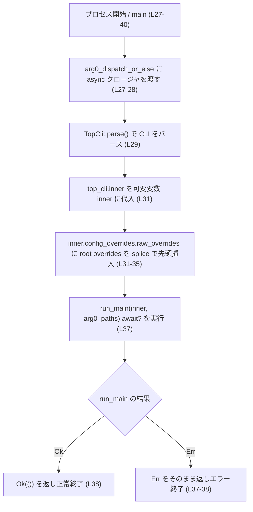
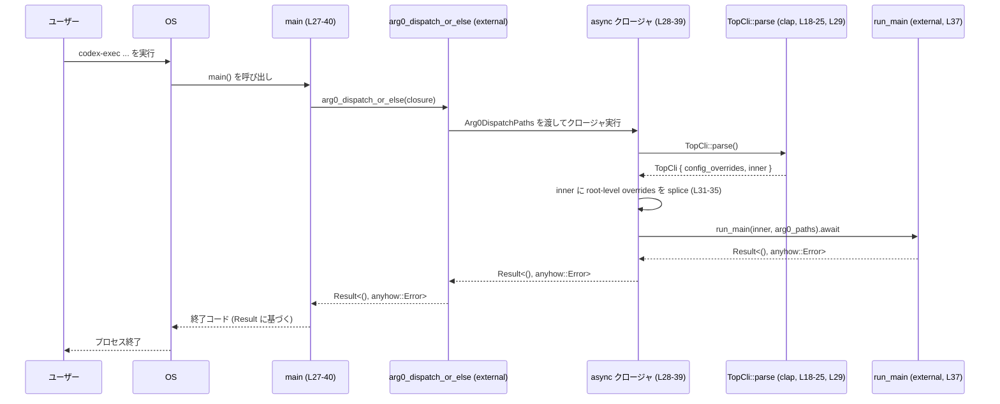

# exec/src/main.rs

## 0. ざっくり一言

`codex-exec` バイナリのエントリポイントであり、`arg0`（実行ファイル名）に応じて通常の Codex エージェント起動と、`codex-linux-sandbox` 用のサンドボックス実行ロジックのどちらかを起動するための土台を提供するモジュールです（exec/src/main.rs:L1-10, L27-40）。

---

## 1. このモジュールの役割

### 1.1 概要

- このモジュールは **`codex-exec` CLI バイナリの起動処理** を担当します（exec/src/main.rs:L1-10, L27-40）。
- `clap` によるコマンドライン引数パースを行うためのラッパ構造体 `TopCli` を定義し（exec/src/main.rs:L18-25）、  
  その結果を `codex_exec::run_main` に渡して実処理を委譲します（exec/src/main.rs:L37）。
- 実行ファイル名（arg0）が `codex-linux-sandbox` の場合は、スタンドアロンな `codex-linux-sandbox` ロジックを呼び出す経路も持ちますが、  
  その詳細な実装は `codex_arg0` 側にあり、このチャンクには現れません（exec/src/main.rs:L1-8, L27-40）。

### 1.2 アーキテクチャ内での位置づけ

- 依存関係:
  - `clap::Parser`: CLI 定義と引数パースに使用（exec/src/main.rs:L11, L18-25, L29）。
  - `codex_arg0::{Arg0DispatchPaths, arg0_dispatch_or_else}`: 実行ファイル名に応じて処理を振り分けるユーティリティ（exec/src/main.rs:L12-13, L28）。
  - `codex_exec::{Cli, run_main}`: 実際の Codex エージェントないし関連ツールのメインロジック（exec/src/main.rs:L14-15, L24-25, L37）。
  - `codex_utils_cli::CliConfigOverrides`: CLI 経由の設定上書き情報を表す型（exec/src/main.rs:L16, L21）。

この関係を簡略化した依存図です。

```mermaid
flowchart LR
    subgraph "exec/src/main.rs"
        TopCli["TopCli (L18-25)"]
        main_fn["main (L27-40)"]
    end

    TopCli -->|flatten field| Cli["codex_exec::Cli (external)"]
    TopCli -->|flatten field| CliConfigOverrides["codex_utils_cli::CliConfigOverrides (external)"]

    main_fn -->|calls| arg0["codex_arg0::arg0_dispatch_or_else (external)"]
    arg0 -->|passes| Arg0Paths["Arg0DispatchPaths (external)"]
    main_fn -->|calls (inside closure)| run_main["codex_exec::run_main (external, async)"]
```

※ `codex_exec` / `codex_arg0` / `codex_utils_cli` 内部の詳細な実装やファイルパスは、このチャンクには現れません。

### 1.3 設計上のポイント

- **責務の分離**（exec/src/main.rs:L18-25, L27-40）
  - このファイルは「起動処理」「引数パースと設定上書きの統合」「arg0 によるディスパッチ」に限定されており、  
    コアロジックは `codex_exec::run_main` に完全に委譲されています。
- **構成のラップとマージ**
  - `TopCli` が「ルートレベルの設定上書き (`CliConfigOverrides`)」と「実際の CLI 定義 (`Cli`)」を `#[clap(flatten)]` で束ねます（exec/src/main.rs:L18-24）。
  - `main` 内で、ルートレベルの上書き設定を `inner.config_overrides.raw_overrides` にスプライスして統合します（exec/src/main.rs:L31-35）。
- **非同期実行モデル**
  - `arg0_dispatch_or_else` に `async move` クロージャを渡し、その中で `run_main(...).await?` を呼び出す非同期パターンになっています（exec/src/main.rs:L28, L37）。
  - 非同期ランタイムの具体的な種類やスレッドモデルは、このチャンクには現れません。
- **エラーハンドリング**
  - `anyhow::Result<()>` を `main` の戻り値型とし、`?` 演算子で `run_main` からのエラーを透過的に伝播させます（exec/src/main.rs:L27, L37-38）。
  - CLI パース時のエラーや `--help` / `--version` 出力などは `clap::Parser` に委譲されます（exec/src/main.rs:L18-21, L29）。

---

## 2. 主要な機能一覧

### 2.1 コンポーネント一覧（インベントリ）

| 名前 | 種別 | 役割 / 用途 | 定義位置 |
|------|------|-------------|----------|
| `TopCli` | 構造体 | ルートレベルの設定上書き (`CliConfigOverrides`) と、実際の CLI 定義 (`Cli`) をまとめるラッパ。`clap` の `flatten` 機能を利用して両者を一体としてパースする。 | exec/src/main.rs:L18-25 |
| `main` | 関数 | プロセスのエントリポイント。`arg0_dispatch_or_else` に非同期クロージャを渡し、その中で `TopCli::parse()` による引数パース、設定上書きのマージ、`run_main` の実行とエラー伝播を行う。 | exec/src/main.rs:L27-40 |
| `tests` | モジュール（`cfg(test)`） | テストコードを `main_tests.rs` からインクルードするためのモジュール。実際のテスト内容はこのチャンクには現れない。 | exec/src/main.rs:L42-44 |

### 2.2 機能一覧（概要）

- `TopCli` による CLI パラメータの一元パース（exec/src/main.rs:L18-25, L29）。
- ルートレベルの設定上書きと内部 CLI 構造体の上書き設定を統合する処理（exec/src/main.rs:L31-35）。
- 実行ファイル名 (`arg0`) ごとのディスパッチ (`codex-linux-sandbox` 用の経路と通常経路) の起点（exec/src/main.rs:L1-8, L27-40）。
- 非同期 `run_main` の呼び出しと結果のエラー伝播によるプロセス終了コードの決定（exec/src/main.rs:L37-38）。

---

## 3. 公開 API と詳細解説

このファイル自体はバイナリ crate のエントリポイントであり、外部 crate から直接呼び出される想定の「公開 API」はほぼありませんが、設計理解のために主要な型と関数を整理します。

### 3.1 型一覧（構造体）

| 名前 | 種別 | フィールド | 役割 / 用途 | 定義位置 |
|------|------|-----------|-------------|----------|
| `TopCli` | 構造体 | `config_overrides: CliConfigOverrides` / `inner: Cli` | `clap` の `flatten` 属性を使い、ルートレベルの設定上書きと `codex_exec::Cli` を 1 つの CLI として扱うためのラッパ。後続の処理では `inner` の `config_overrides` にルート側をマージしてから `run_main` に渡す。 | exec/src/main.rs:L18-25 |

#### `TopCli` の詳細

- `#[derive(Parser, Debug)]` を付与し、`clap` による自動パーサ生成とデバッグ出力をサポートしています（exec/src/main.rs:L18）。
- `#[clap(flatten)]` によって、`TopCli` 自体には新たなサブコマンド名等は持たず、中身のフィールドをフラットな CLI オプションセットとして扱います（exec/src/main.rs:L20-24）。
- `CliConfigOverrides` および `Cli` の内部構造やそれぞれが提供する CLI オプションの詳細は、このチャンクには現れません。

### 3.2 関数詳細

#### `main() -> anyhow::Result<()>`

**概要**

プロセスのエントリポイントです。`arg0_dispatch_or_else` に非同期クロージャを渡し、その中で `TopCli::parse()` による CLI パース、設定上書き情報のマージ、`run_main` の実行およびエラー伝播を行います（exec/src/main.rs:L27-40）。

**引数**

- なし（標準的な `main` 関数と同様に、引数は暗黙に OS から取得されます）。

**戻り値**

- `anyhow::Result<()>`  
  - `Ok(())`: 正常終了。`run_main` がエラーを返さなかった場合（exec/src/main.rs:L37-38）。
  - `Err(anyhow::Error)`: 何らかのエラーが発生した場合。主に `run_main(inner, arg0_paths).await?` からのエラーがそのまま伝播します（exec/src/main.rs:L37）。

**内部処理の流れ（アルゴリズム）**

1. `arg0_dispatch_or_else` を呼び出し、引数として `Arg0DispatchPaths` を受け取る非同期クロージャを渡します（exec/src/main.rs:L27-28）。  
   - `arg0_dispatch_or_else` 自体は `arg0`（実行ファイル名）に応じて、Sandbox モードなど別のロジックを実行する機構を内包しているとコメントから読み取れますが、その詳細はこのチャンクには現れません（exec/src/main.rs:L1-8）。
2. 非同期クロージャ内で `TopCli::parse()` を呼び出し、コマンドライン引数をパースします（exec/src/main.rs:L29）。
3. パース結果から `inner`（`Cli` 型）を取り出し、可変変数として保持します（exec/src/main.rs:L31）。
4. `inner.config_overrides.raw_overrides.splice(0..0, top_cli.config_overrides.raw_overrides);` を呼び出し、ルートレベルの `config_overrides` の `raw_overrides` を `inner` 側の `raw_overrides` 先頭に挿入することで、上書き設定を統合します（exec/src/main.rs:L31-35）。
5. 統合済みの `inner` と `arg0_paths` を引数に `run_main(inner, arg0_paths).await?` を実行し、その結果を待機します（exec/src/main.rs:L37）。
6. `run_main` が `Ok(())` を返した場合は `Ok(())` を返します。エラーが返された場合は `?` によって即時に `Err` を返し、プロセス終了コードに反映されます（exec/src/main.rs:L37-38）。

この処理フローを簡易フローチャートで表すと、次のようになります。



**Examples（使用例）**

この `main` はバイナリのエントリポイントであり、通常は他の Rust コードから直接呼び出すことはありません。利用形態としては、次のようにコンパイルされたバイナリを CLI から起動する形になります。

```text
# 通常の codex-exec として起動（実行ファイル名が codex-exec）
$ codex-exec --config path/to/config.toml --some-flag

# サンドボックスモードとして起動（実行ファイル名が codex-linux-sandbox）
$ codex-linux-sandbox -s some_sandbox_option -- command-to-run
```

※ 実際にどのようなオプションがあるかは `Cli` および `CliConfigOverrides` の定義に依存し、このチャンクには現れません。

内部処理を別の関数から再利用する例（概念的なコード）を示すと、次のようになります。

```rust
use clap::Parser;                           // TopCli::parse に必要
use codex_arg0::Arg0DispatchPaths;          // arg0_dispatch_or_else と同じ型
use codex_exec::{Cli, run_main};           // コアロジック
use codex_utils_cli::CliConfigOverrides;   // 設定上書き

#[derive(Parser, Debug)]
struct TopCli {
    #[clap(flatten)]
    config_overrides: CliConfigOverrides,  // ルートレベルの上書き設定

    #[clap(flatten)]
    inner: Cli,                            // 実際の CLI 定義
}

async fn run_from_args(arg0_paths: Arg0DispatchPaths) -> anyhow::Result<()> {
    let top_cli = TopCli::parse();         // コマンドラインから TopCli を構築
    let mut inner = top_cli.inner;         // 内側の Cli を取り出して変更可能にする
    inner
        .config_overrides
        .raw_overrides
        .splice(0..0, top_cli.config_overrides.raw_overrides);
                                           // ルートの上書きを先頭にマージ

    run_main(inner, arg0_paths).await      // コアロジックを実行
}
```

この例は `main` の内部ロジックを関数として切り出した形を示したものであり、実際のコードでは `arg0_dispatch_or_else` が `Arg0DispatchPaths` を構築して渡す役割を担います。

**Errors / Panics**

- `Errors`
  - `run_main(inner, arg0_paths).await?` がエラーを返した場合、その `anyhow::Error` が `main` の戻り値としてそのまま返されます（exec/src/main.rs:L37）。
  - `TopCli::parse()` 中に `clap` がエラー（不正な引数）と判断した場合、`clap` の仕様によりプロセス終了（`std::process::exit`）となることが一般的で、`main` の `Result` は利用されません（一般的な `clap` の挙動に基づく説明であり、具体的な設定内容はこのチャンクには現れません）。
- `Panics`
  - このファイル内で明示的に `panic!` は呼び出されていません（exec/src/main.rs:L1-44）。
  - `splice` の使用（exec/src/main.rs:L31-35）は、範囲 0..0 を指定しているため、通常範囲外アクセスによるパニックは発生しません。
  - ただし、`run_main` や `clap` 内部でのパニック可能性については、このチャンクには情報がありません。

**Edge cases（エッジケース）**

- **引数なしでの起動**
  - `TopCli::parse()` が `clap` ルールに従ってデフォルト値や必須フラグチェックを行います。どのフラグが必須かなどは `Cli` の定義に依存し、このチャンクには現れません（exec/src/main.rs:L18-24, L29）。
- **`arg0` が `codex-linux-sandbox` の場合**
  - ファイル先頭コメントによると、この場合には `codex-linux-sandbox` 用のロジックを実行することになっています（exec/src/main.rs:L4-8）。  
    実際にどのような処理が `arg0_dispatch_or_else` で行われるかは、このチャンクには現れません。
- **設定上書きが大量に存在する場合**
  - `splice` によって `config_overrides.raw_overrides` の先頭にルートの上書きが挿入されます（exec/src/main.rs:L31-35）。  
    これにより内部ベクタの要素の移動が発生し、そのコストは上書き数に比例すると考えられますが、実際のサイズや頻度はこのチャンクには現れません。
- **マルチスレッド環境**
  - このファイル内では明示的なスレッド生成や `Send` / `Sync` 制約の指定はありません（exec/src/main.rs:L1-44）。  
    非同期ランタイムのスレッドモデルや `run_main` の並行性は外部に依存し、このチャンクには現れません。

**使用上の注意点**

- `TopCli::parse()` / `Cli` / `CliConfigOverrides` の定義と整合するように CLI オプションを利用する必要があります。どのオプションが存在するかはこのチャンクからは分かりません。
- 設定上書きのマージ順序（先頭への挿入）が `run_main` 側の解釈（先勝ち / 後勝ち）に影響する可能性があります。  
  優先順位の仕様は `run_main` / `CliConfigOverrides` の実装に依存し、このチャンクからは断定できません（exec/src/main.rs:L31-35）。
- `main` は非同期処理を `arg0_dispatch_or_else` に委譲しているため、別のエントリポイントから `run_main` を直接利用する場合は、適切な非同期ランタイム（例: `tokio`）の中で `.await` する必要があります。  
  どのランタイムが使われているかは `arg0_dispatch_or_else` の実装に依存し、このチャンクには現れません。

### 3.3 その他の関数

このファイル内で明示的に名前付きで定義されている関数は `main` のみです（exec/src/main.rs:L27-40）。  
`arg0_dispatch_or_else` に渡している無名の `async move` クロージャは、`main` の内部実装の一部として扱えます。

---

## 4. データフロー

ここでは、通常の `codex-exec` として起動した場合の代表的なデータフローを示します。

### 4.1 テキストによる説明

1. OS が `codex-exec` バイナリを、実行ファイル名 `arg0 = "codex-exec"` とともに起動します。
2. Rust ランタイムが `main()` を呼び出します（exec/src/main.rs:L27）。
3. `main` は `arg0_dispatch_or_else` に非同期クロージャを渡して呼び出します（exec/src/main.rs:L27-28）。
4. `arg0_dispatch_or_else` は `arg0` を判定し、通常経路の場合は `Arg0DispatchPaths` を構築してクロージャを実行します（`Arg0DispatchPaths` の詳細はこのチャンクには現れません）。
5. クロージャ内で `TopCli::parse()` が呼ばれ、`TopCli { config_overrides, inner }` が生成されます（exec/src/main.rs:L29-31）。
6. `inner` の `config_overrides.raw_overrides` に、ルートレベルの `config_overrides.raw_overrides` が `splice` で前置挿入され、設定上書きが統合されます（exec/src/main.rs:L31-35）。
7. この統合済み `inner` と `arg0_paths` が `run_main(inner, arg0_paths)` に渡され、非同期で実行されます（exec/src/main.rs:L37）。
8. `run_main` の結果に応じて `Ok(())` か `Err(anyhow::Error)` が返され、最終的なプロセス終了ステータスになります（exec/src/main.rs:L37-38）。

### 4.2 シーケンス図（Mermaid）



`codex-linux-sandbox` として起動された場合は、`arg0_dispatch_or_else` が別の経路を採用することがコメントから読み取れますが、その具体的なフローはこのチャンクには現れません（exec/src/main.rs:L4-8）。

---

## 5. 使い方（How to Use）

### 5.1 基本的な使用方法

このモジュールはバイナリ crate の `main.rs` であり、通常はライブラリとして利用するのではなく、コンパイルされたバイナリを CLI から実行します。

基本的なフローは次の通りです。

1. ビルド:

```text
cargo build --bin codex-exec
```

1. 通常モードでの実行例（`arg0 = "codex-exec"`）:

```text
$ ./target/debug/codex-exec [codex_exec::Cli で定義されたオプション] \
    [CliConfigOverrides 由来の設定上書きフラグ]
```

1. サンドボックスモードでの実行例（`arg0 = "codex-linux-sandbox"` にする）:

```text
ln -s ./target/debug/codex-exec ./target/debug/codex-linux-sandbox
./target/debug/codex-linux-sandbox [sandbox 固有の -s オプション] -- command
```

※ 具体的なオプション名・意味は `Cli` / `CliConfigOverrides` / `codex-linux-sandbox` の定義に依存し、このチャンクには現れません。

### 5.2 よくある使用パターン

- **設定ファイル + 上書きフラグの併用**
  - ベース設定をファイルや環境変数で指定し、個別の CLI 呼び出しごとに `CliConfigOverrides` 相当のフラグで上書きする。
  - `TopCli` では、ルートレベルの上書きと `Cli` 側の上書きを統合した上で `run_main` に渡す構造になっています（exec/src/main.rs:L18-25, L31-35）。
- **サンドボックス実行と通常実行の共存**
  - 1つのバイナリ (`codex-exec`) に `codex-linux-sandbox` 相当の機能を同梱し、シンボリックリンクなどで `arg0` を変えることで別ツールのように動作させる（exec/src/main.rs:L1-8）。

### 5.3 よくある間違い（起こり得る誤用）

このファイルの構造から、次のような誤用が起こり得ます。

```rust
// 想定される誤用例: TopCli を使わずに Cli::parse() だけを呼ぶ
// これを行うと、ルートレベルの CliConfigOverrides が取り込まれない可能性がある
let cli = codex_exec::Cli::parse();  // TopCli ではなく Cli だけを直接パース
// config_overrides の統合処理が行われない

// 正しいパターン（この main.rs と同じパターン）
let top_cli = TopCli::parse();              // TopCli をパース
let mut inner = top_cli.inner;             // 内部の Cli を取り出す
inner
    .config_overrides
    .raw_overrides
    .splice(0..0, top_cli.config_overrides.raw_overrides);
// ルートレベルの上書きを統合した後で run_main を呼び出す
```

※ 上記の「誤用例」はあくまで構造から推測されるパターンであり、実際に外部コードから `Cli::parse()` を直接利用することが想定されているかどうかは、このチャンクには現れません。

### 5.4 使用上の注意点（まとめ）

- **設定上書きの統合**
  - `TopCli` の `config_overrides` を `inner` に統合する処理（`splice(0..0, ...)`）が前提になっています（exec/src/main.rs:L31-35）。  
    同様の処理を別の場所で再実装する場合、この統合順序を変えると挙動が変わる可能性があります。
- **非同期実行環境**
  - `run_main` は `await` されているため、適切な非同期ランタイムが存在することが前提です（exec/src/main.rs:L28, L37）。  
    どのランタイムを使うかは `arg0_dispatch_or_else` 側が決定していると考えられますが、このチャンクには現れません。
- **セキュリティ（サンドボックス）**
  - コメントによると `codex-linux-sandbox` 経路では Landlock + seccomp によるサンドボックス実行を行う設計になっています（exec/src/main.rs:L4-8）。  
    実際のセキュリティ境界やポリシーの厳密さは、`codex-linux-sandbox` ロジック側に依存し、このチャンクだけでは判断できません。
- **ログ・トレース**
  - このファイル内ではログ出力やトレーシングの呼び出しは行われていません（exec/src/main.rs:L1-44）。  
    実際の観測性（ログやメトリクス）は `run_main` 等の外部ロジックに依存します。

---

## 6. 変更の仕方（How to Modify）

### 6.1 新しい機能を追加する場合

1. **新しいルートレベルの CLI オプションを追加したい場合**
   - `TopCli` に新たなフィールドを追加し、適切な `clap` 属性を付与します（exec/src/main.rs:L18-25）。
   - そのフィールドの値を `run_main` に渡す必要がある場合は、`Cli` に反映させるか、`run_main` の引数を拡張する必要がありますが、それらの定義は他ファイルにあり、このチャンクには現れません。
2. **別の arg0 エイリアスを追加したい場合**
   - `arg0_dispatch_or_else` の動作変更が必要になるため、`codex_arg0` crate 側のコードを変更することになります（exec/src/main.rs:L12-13, L27-28）。
   - このファイル側で行う変更は通常不要です。
3. **初期化ロジックを拡張したい場合**
   - たとえば CLI パース直後に何らかの共通初期化処理を行いたい場合、`TopCli::parse()` の直後（exec/src/main.rs:L29-31 の間）に追加するのが自然です。

### 6.2 既存の機能を変更する場合

- **設定上書きのマージ戦略を変更する**
  - 現在は `splice(0..0, ...)` で先頭に挿入しています（exec/src/main.rs:L31-35）。  
    これを末尾に挿入するなどの変更を行うと、`run_main` 側での解釈によっては優先順位が逆転するなどの影響が出る可能性があります。
- **エラー処理ポリシーを変更する**
  - 現在は `run_main(...).await?` によりエラーをそのまま伝播しています（exec/src/main.rs:L37）。  
    もし特定のエラーをハンドリングしたい場合は、`?` の代わりに `match` / `if let` 等で明示的に処理する必要があります。
- **テストの影響範囲の確認**
  - 変更時には `#[cfg(test)]` でインクルードされる `main_tests.rs` のテストが影響を受ける可能性があります（exec/src/main.rs:L42-44）。  
    ただし、その内容はこのチャンクには現れないため、別途ファイルを確認する必要があります。

---

## 7. 関連ファイル

| パス / シンボル | 役割 / 関係 |
|----------------|------------|
| `codex_exec::Cli` | 実際の CLI 定義を表す型。サブコマンドや各種フラグの定義を持っていると考えられますが、詳細はこのチャンクには現れません（exec/src/main.rs:L14, L24-25）。 |
| `codex_exec::run_main` | Codex エージェントや関連ツールのメインロジックを非同期に実行する関数。`main` から直接呼び出されます（exec/src/main.rs:L15, L37）。 |
| `codex_utils_cli::CliConfigOverrides` | CLI 経由で設定を上書きするための構造体。`TopCli` のフィールドとして使われ、`Cli` の `config_overrides` に統合されます（exec/src/main.rs:L16, L21, L31-35）。 |
| `codex_arg0::Arg0DispatchPaths` | 実行ファイル名（arg0）に応じたディスパッチ情報を表す型。`arg0_dispatch_or_else` からクロージャに渡されます（exec/src/main.rs:L12, L28, L37）。 |
| `codex_arg0::arg0_dispatch_or_else` | `arg0` に応じて Sandbox 経路などを選択し、必要に応じて渡されたクロージャを実行する関数。`main` から呼び出されます（exec/src/main.rs:L13, L27-28）。 |
| `exec/src/main_tests.rs` | `#[cfg(test)]`・`#[path = "main_tests.rs"]` でインクルードされるテストコードファイル。`main` や `TopCli` の振る舞いを検証するテストが含まれている可能性がありますが、内容はこのチャンクには現れません（exec/src/main.rs:L42-44）。 |

このファイルは、エントリポイントとして外部コンポーネントへの接続点の役割を担っており、実際のビジネスロジックやセキュリティ制御の詳細は関連ファイル側に存在します。
