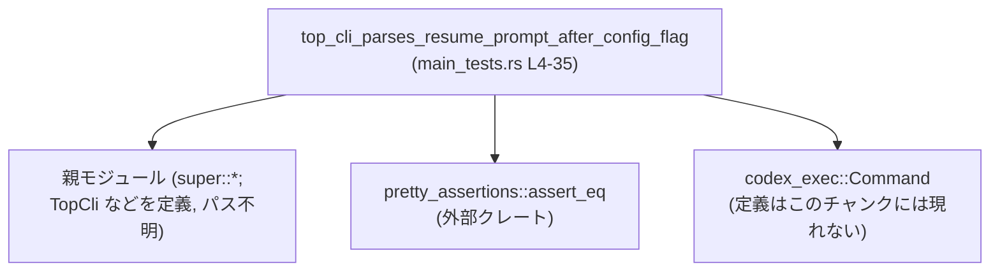

# exec/src/main_tests.rs コード解説

## 0. ざっくり一言

このファイルは、`TopCli` のコマンドライン引数パースが「`resume` サブコマンド + 設定フラグ + 危険なフラグ + プロンプト」の組み合わせを正しく扱えることを検証する単体テストを 1 件定義しています（`main_tests.rs:L1-35`）。

---

## 1. このモジュールの役割

### 1.1 概要

- このモジュールは、CLI のトップレベル引数パーサ `TopCli` に対し、
  - `resume` コマンドが選択されること
  - `--config` による設定上書きが保持されること
  - 最後の引数として与えたプロンプト文字列が、`resume` コマンドの実効プロンプトとして解釈されること  
  を検証します（`main_tests.rs:L4-35`）。

### 1.2 アーキテクチャ内での位置づけ

このテストモジュールは、親モジュールに定義された CLI 型群を `use super::*;` で取り込み（`main_tests.rs:L1`）、`TopCli` を通じて `codex_exec::Command::Resume` の挙動を確認します（`main_tests.rs:L7-8, L21-23`）。

依存関係を簡略化して図示すると次のようになります。



- `Super` ノードの具体的なファイルパス（`main.rs` など）は、このチャンクには現れません。
- `codex_exec::Command` の定義場所もこのチャンクからは分かりません。

### 1.3 設計上のポイント

コードから読める設計上の特徴は次の通りです。

- **高レベル API でのテスト**  
  - `TopCli::parse_from([...])` を使い、実際のコマンドライン引数配列から状態を構築する形でテストしています（`main_tests.rs:L7-19`）。
- **コマンド種別の明示検証**  
  - `let Some(codex_exec::Command::Resume(args)) = cli.inner.command else { ... }` というパターンマッチにより、`resume` コマンドであることを明確にチェックしています（`main_tests.rs:L21-23`）。
- **プロンプト決定ロジックのテスト内再現**  
  - `args.prompt` と `args.last` / `args.session_id` から `effective_prompt` を計算し、期待されるプロンプトと一致することを検証しています（`main_tests.rs:L24-30`）。
- **設定上書き（config overrides）の確認**  
  - `cli.config_overrides.raw_overrides` の長さと内容を `assert_eq!` で検証し、`--config` フラグの効果を確認しています（`main_tests.rs:L31-35`）。
- **エラーハンドリング**  
  - 条件不一致時はすべて `panic!` 由来のテスト失敗として扱われます（パターンマッチの `else` と `assert_eq!`、`main_tests.rs:L21-23, L31-35`）。
- **並行性**  
  - スレッドや `async`/`await` は登場せず、テストは同期的に動作します（`main_tests.rs:L1-35`）。

---

## 2. 主要な機能一覧

このファイルに定義されている機能と、テストから観測できるコンポーネントを一覧にします。

### 2.1 機能の概要

- `top_cli_parses_resume_prompt_after_config_flag`:  
  `TopCli` に `resume` コマンドと複数のグローバルフラグ（`--last`, `--json`, `--model`, `--config`, 危険フラグなど）およびプロンプトを与えたときに、  
  - `codex_exec::Command::Resume` が選択されること  
  - `effective_prompt` が末尾のプロンプト文字列になること  
  - `config_overrides` に `reasoning_level=xhigh` が格納されること  
  を検証するテストです（`main_tests.rs:L4-35`）。

### 2.2 コンポーネントインベントリー（関数・型・フィールド）

#### 関数

| 名称 | 種別 | 定義/使用 | 行範囲 | 根拠 | 役割 |
|------|------|-----------|--------|------|------|
| `top_cli_parses_resume_prompt_after_config_flag` | 関数（テスト） | 定義 | `main_tests.rs:L4-35` | `#[test] fn top_cli_parses_resume_prompt_after_config_flag() { ... }` | CLI 引数パースと `resume` コマンドのプロンプト・設定上書きの挙動を検証する |

#### このチャンクで使用される外部コンポーネント（定義は他ファイル）

| 名称 | 種別（推定を含む） | 定義/使用 | 行範囲 | 根拠 | 備考 |
|------|--------------------|-----------|--------|------|------|
| `TopCli` | 型（詳細不明） | 使用 | `main_tests.rs:L7` | `let cli = TopCli::parse_from([ ... ]);` | `parse_from` という関連関数を持つ型。CLI 構造体である可能性が高いが、定義はこのチャンクには現れません。 |
| `TopCli::parse_from` | 関連関数 | 使用 | `main_tests.rs:L7-19` | `TopCli::parse_from([ "codex-exec", ... ])` | 引数配列から CLI 状態 `cli` を生成する。実装は不明。 |
| `codex_exec::Command::Resume` | 関連項目（おそらく列挙体バリアント） | 使用 | `main_tests.rs:L21` | `let Some(codex_exec::Command::Resume(args)) = cli.inner.command else { ... }` | `Command` 型の `Resume` 分岐を表していると推測されますが、定義はこのチャンクには現れません。 |
| `cli.inner.command` | フィールドパス | 使用 | `main_tests.rs:L21` | `cli.inner.command` | `cli` に `inner` フィールド、その中に `command` フィールドが存在することが読み取れます。型は不明。 |
| `cli.config_overrides.raw_overrides` | フィールドパス | 使用 | `main_tests.rs:L31-35` | `cli.config_overrides.raw_overrides.len()`, `raw_overrides[0]` | 設定上書き文字列のリストのように扱われています。中身は `String` のスライス/ベクタと推測されますが、定義はこのチャンクには現れません。 |
| `pretty_assertions::assert_eq` | マクロ | 使用 | `main_tests.rs:L2, L31-35` | `use pretty_assertions::assert_eq;`, `assert_eq!(...)` | 標準 `assert_eq!` と互換のインターフェースで、差分表示が見やすいマクロです。 |

#### この関数内のローカル要素

| 名称 | 種別 | 行範囲 | 根拠 | 説明 |
|------|------|--------|------|------|
| `PROMPT` | 関数内定数 `&str` | `main_tests.rs:L6` | `const PROMPT: &str = "echo resume-with-global-flags-after-subcommand";` | 期待されるプロンプト文字列。 |
| `cli` | ローカル変数 | `main_tests.rs:L7` | `let cli = TopCli::parse_from([...]);` | CLI 状態を保持するオブジェクト。 |
| `args` | ローカル変数 | `main_tests.rs:L21` | `let Some(codex_exec::Command::Resume(args)) = ...` | `resume` コマンドに対応する引数集合。 |
| `args.prompt` | フィールド | `main_tests.rs:L24` | `let effective_prompt = args.prompt.clone().or_else(|| { ... });` | `Option` 型として `clone()` + `or_else` されていることから、`Option<T>`（かつ `T: Clone`）であると読み取れます。 |
| `args.last` | フィールド（`bool`） | `main_tests.rs:L25` | `if args.last { ... }` | `if` の条件式に直接使われているため `bool` 型です。 |
| `args.session_id` | フィールド | `main_tests.rs:L25-27` | `args.session_id.clone()` | `clone()` が呼ばれていることから、`Clone` 実装を持つ型（おそらく `Option<String>` 等）です。 |
| `effective_prompt` | ローカル変数 | `main_tests.rs:L24-30` | `let effective_prompt = ...;` | `Option` に対して `as_deref()` を呼んでいるので `Option<String>` または `Option<impl Deref<Target=str>>` と解釈できます。 |

---

## 3. 公開 API と詳細解説

このファイル自体には公開 API はなく、テスト関数のみが定義されています。ただし、テストを通じて以下の公開インターフェースの挙動が観察されます。

- `TopCli::parse_from(&[&str])`
- `TopCli` のフィールド `inner.command`, `config_overrides.raw_overrides`
- `codex_exec::Command::Resume` と、その引数構造体（`args`）のフィールド `prompt`, `last`, `session_id`

### 3.1 型一覧（構造体・列挙体など）

このモジュール内に型定義はありません（テスト対象の型はすべて外部定義です）。

テストから観測される主要な型を参考情報としてまとめます（定義は他モジュール）。

| 名前 | 種別（推定） | 役割 / 用途 | 根拠 |
|------|-------------|------------|------|
| `TopCli` | CLI 全体を表す型 | `parse_from` から構築され、`inner` や `config_overrides` を持つ（詳細は不明） | `main_tests.rs:L7, L21, L31-35` |
| `codex_exec::Command` | コマンド種別を表す型（列挙体と推測） | `Resume` などのサブコマンドを表現する | `main_tests.rs:L21` |
| `Resume` 引数構造体（名前不明） | 構造体と推測 | `prompt`, `last`, `session_id` フィールドを持ち、`Resume(args)` の `args` として扱われる | `main_tests.rs:L21, L24-27` |
| `cli.config_overrides` の型（名前不明） | 構造体と推測 | `raw_overrides` というフィールドを持ち、設定上書きの文字列リストを格納する | `main_tests.rs:L31-35` |

### 3.2 関数詳細

#### `top_cli_parses_resume_prompt_after_config_flag()`

**概要**

- `TopCli::parse_from` に特定の引数列を渡し、`resume` コマンドのプロンプトおよび設定上書きの処理が意図どおりに行われるかを検証するテスト関数です（`main_tests.rs:L4-35`）。

**引数**

- 引数はありません（`fn top_cli_parses_resume_prompt_after_config_flag()`、`main_tests.rs:L5`）。

**戻り値**

- 戻り値型は `()`（単位型）で、Rust のテストフレームワークにより自動的に実行されます（戻り値はコード上明示されませんが、通常のテスト関数と同様と解釈できます）。

**内部処理の流れ（アルゴリズム）**

1. **期待プロンプト定数の定義**  
   - `const PROMPT: &str = "echo resume-with-global-flags-after-subcommand";`（`main_tests.rs:L6`）。

2. **CLI 状態の構築**  
   - `TopCli::parse_from` に引数配列を渡し、`cli` を生成します（`main_tests.rs:L7-19`）。
   - 渡している引数は以下のとおりです（`main_tests.rs:L8-18`）。
     - バイナリ名: `"codex-exec"`
     - サブコマンド: `"resume"`
     - フラグ: `"--last"`, `"--json"`, `"--model"`, `"--config"`, `"--dangerously-bypass-approvals-and-sandbox"`, `"--skip-git-repo-check"`
     - 引数値: `"gpt-5.2-codex"`, `"reasoning_level=xhigh"`, `PROMPT`

3. **`resume` コマンドであることの検証**  
   - `cli.inner.command` が `Some(codex_exec::Command::Resume(args))` であることをパターンマッチで確認します（`main_tests.rs:L21-23`）。
   - それ以外の場合（`None` や `Resume` 以外の変種）は、`panic!("expected resume command");` によりテストが失敗します（`main_tests.rs:L22`）。

4. **実効プロンプト `effective_prompt` の算出**  
   - `args.prompt.clone().or_else(|| { if args.last { args.session_id.clone() } else { None } })` というロジックで `effective_prompt` を求めます（`main_tests.rs:L24-30`）。
     - まず `args.prompt`（`Option<_>`）を `clone()` し、`Some` であればそれを優先します。
     - `args.prompt` が `None` の場合にのみ `or_else` のクロージャが評価されます。
     - クロージャ内では、`args.last` が `true` のとき `args.session_id.clone()` を返し、それ以外は `None` を返します（`main_tests.rs:L25-28`）。

5. **プロンプトが期待どおりかの検証**  
   - `assert_eq!(effective_prompt.as_deref(), Some(PROMPT));` により、`effective_prompt` が `PROMPT` と一致することを検証します（`main_tests.rs:L31`）。
     - `as_deref()` により `Option<String>` 等から `Option<&str>` に変換し、`PROMPT`（`&str`）との比較を行っています。

6. **設定上書き `--config` の検証**  
   - `assert_eq!(cli.config_overrides.raw_overrides.len(), 1);`  
     で上書きエントリが 1 件であることを確認します（`main_tests.rs:L32`）。
   - 続けて  
     `assert_eq!(cli.config_overrides.raw_overrides[0], "reasoning_level=xhigh");`  
     で、その内容が `"reasoning_level=xhigh"` であることを確認します（`main_tests.rs:L33-35`）。

**内部処理の流れ（簡易フローチャート）**

```mermaid
flowchart TD
    A["開始<br/>top_cli_parses_resume_prompt_after_config_flag (L4-35)"]
    B["PROMPT 定義 (L6)"]
    C["TopCli::parse_from で cli 構築 (L7-19)"]
    D["cli.inner.command をパターンマッチ (L21-23)"]
    E["Resume(args) か？"]
    F["panic!(\"expected resume command\") (L22)"]
    G["effective_prompt 算出 (L24-30)"]
    H["プロンプト検証 (L31)"]
    I["config_overrides.len() == 1 検証 (L32)"]
    J["raw_overrides[0] 検証 (L33-35)"]
    K["終了"]

    A --> B --> C --> D --> E
    E -- Yes --> G --> H --> I --> J --> K
    E -- No  --> F --> K
```

**Examples（使用例）**

この関数自体がテストであり、使用例を兼ねています。`TopCli::parse_from` を用いて CLI 引数を構築する一般的なパターンを抜き出すと次のようになります。

```rust
// CLI に与える引数を &str の配列で定義する（main_tests.rs:L7-18 相当）
let argv = [
    "codex-exec",                            // バイナリ名
    "resume",                                // サブコマンド
    "--last",                                // オプションフラグ
    "--json",                                // 出力形式フラグ（推測、定義は不明）
    "--model", "gpt-5.2-codex",              // モデル指定
    "--config", "reasoning_level=xhigh",     // 設定上書き
    "--dangerously-bypass-approvals-and-sandbox", // 危険なフラグ（意味はこのチャンクには現れない）
    "--skip-git-repo-check",                 // リポジトリチェックをスキップするフラグ（推測）
    "echo resume-with-global-flags-after-subcommand", // プロンプト
];

// TopCli の parse_from で解析する（main_tests.rs:L7）
let cli = TopCli::parse_from(argv);

// 以降、cli.inner.command や cli.config_overrides を用いて処理する
```

**Errors / Panics**

- **`panic!("expected resume command")`**  
  - `cli.inner.command` が `Some(codex_exec::Command::Resume(_))` とマッチしない場合（`None` または別のコマンドである場合）に発生します（`main_tests.rs:L21-23`）。
- **`assert_eq!` 由来のパニック**  
  - `effective_prompt.as_deref() != Some(PROMPT)` の場合（`main_tests.rs:L31`）。
  - `cli.config_overrides.raw_overrides.len() != 1` の場合（`main_tests.rs:L32`）。
  - `cli.config_overrides.raw_overrides[0] != "reasoning_level=xhigh"` の場合（`main_tests.rs:L33-35`）。
- いずれもテストが失敗するための「意図したパニック」です。

**Edge cases（エッジケース）**

このテストが明示的に扱っている／暗黙の前提としているエッジケースは次のとおりです。

- **`args.prompt` が `Some` の場合**  
  - テストケースでは、おそらく `args.prompt` が `Some(PROMPT)` になっていることが期待されています。  
    そのため、`effective_prompt` は `args.prompt` を優先し、`args.last` や `args.session_id` は使われません（`main_tests.rs:L24-30`）。
- **`args.prompt` が `None` で `args.last == true` の場合**  
  - テスト内ロジック上は、この場合 `effective_prompt` は `args.session_id.clone()` になります（`main_tests.rs:L25-27`）。
  - 実際にそのような CLI 入力が想定されているかは、このチャンクからは分かりません。
- **`args.prompt` が `None` かつ `args.last == false` の場合**  
  - テスト内ロジックでは `None` になります（`main_tests.rs:L25-28`）。
  - この状況が実際に発生しうるか、および本番コードがどう扱うかは、このチャンクには現れません。
- **設定上書きの個数**  
  - このテストは `raw_overrides.len() == 1` のケースのみ検証しており、複数の `--config` フラグが指定された場合の挙動は不明です（`main_tests.rs:L31-32`）。

**使用上の注意点**

- この関数は `#[test]` 属性付きであり、他のコードから呼び出すことを前提としていません（`main_tests.rs:L4`）。
- テストのアサーションロジック（`effective_prompt` の算出）は、本番コード側に同一のヘルパー関数があるかどうかは分かりません。  
  - そのため、「本番コードの実装」と「テスト内での算出ロジック」がずれてもコンパイルは通ります。挙動の正しさは別途確認が必要です。
- `--dangerously-bypass-approvals-and-sandbox` のようなセキュリティに関わるフラグが含まれていますが、このテストでは **そのフラグの効果は一切検証していません**（`main_tests.rs:L16`）。  
  - ここでは「このフラグを含めた形でも `resume` プロンプトと `config` 上書きが正しく扱われるか」を確認しているのみです。

### 3.3 その他の関数

- このモジュールには他の関数やヘルパーは定義されていません（`main_tests.rs:L1-35`）。

---

## 4. データフロー

このセクションでは、代表的な処理シナリオとして、テスト関数内でのデータの流れを説明します。

### 4.1 テスト内でのデータフロー概要

処理の要点は次のようになります。

1. 生の文字列配列（擬似的なコマンドライン引数）から `TopCli` を構築する（`main_tests.rs:L7-19`）。
2. `TopCli` から `inner.command` を取り出し、`Resume(args)` にパターンマッチする（`main_tests.rs:L21-23`）。
3. `args` から `prompt`, `last`, `session_id` を使って `effective_prompt` を算出する（`main_tests.rs:L24-30`）。
4. `cli.config_overrides.raw_overrides` の内容を検証する（`main_tests.rs:L31-35`）。

### 4.2 シーケンス図

```mermaid
sequenceDiagram
    participant T as "Test関数<br/>top_cli_parses_resume_prompt_after_config_flag<br/>(L4-35)"
    participant Args as "引数配列 [&str; N]<br/>(L7-18)"
    participant CLI as "TopCli インスタンス<br/>(L7-19)"
    participant Inner as "cli.inner.command<br/>(L21-23)"
    participant Resume as "Resume(args)<br/>(L21-23)"
    participant Conf as "cli.config_overrides.raw_overrides<br/>(L31-35)"

    T->>Args: 構築: [\"codex-exec\", \"resume\", ... , PROMPT] (L7-18)
    T->>CLI: TopCli::parse_from(Args) (L7-19)
    CLI-->>T: cli (L7)
    T->>Inner: 参照: cli.inner.command (L21)
    Inner-->>T: Some(Command::Resume(args)) (期待) (L21-23)
    T->>Resume: args.prompt, args.last, args.session_id から\n effective_prompt を算出 (L24-30)
    Resume-->>T: effective_prompt (L24-30)
    T->>T: effective_prompt.as_deref() == Some(PROMPT)? (L31)
    T->>Conf: len(), index 0 を参照 (L31-35)
    Conf-->>T: [\"reasoning_level=xhigh\", ...]? (L33-35)
    T-->>T: すべての assert が成功するとテスト成功
```

---

## 5. 使い方（How to Use）

このファイルの直接の「使い方」はテストとしての実行になりますが、内容は `TopCli` や `Command::Resume` の利用方法の参考にもなります。

### 5.1 基本的な使用方法（テストとして）

テストは通常通り、`cargo test` で実行されます（プロジェクト全体の構成やワークスペースについては、このチャンクには現れません）。

`TopCli` を用いてコマンドライン引数をパースする基本的な流れは、テストコードと同様です。

```rust
// 1. 擬似的なコマンドライン引数を用意する（main_tests.rs:L7-18 相当）
let argv = [
    "codex-exec",
    "resume",
    "--last",
    "--json",
    "--model", "gpt-5.2-codex",
    "--config", "reasoning_level=xhigh",
    "--dangerously-bypass-approvals-and-sandbox",
    "--skip-git-repo-check",
    "echo resume-with-global-flags-after-subcommand",
];

// 2. TopCli でパースする（main_tests.rs:L7）
let cli = TopCli::parse_from(argv);

// 3. コマンドの分岐（main_tests.rs:L21-23 と同様のパターン）
if let Some(codex_exec::Command::Resume(args)) = cli.inner.command {
    // args.prompt / args.last / args.session_id などを使った処理を行う
}
```

この例は、テストで観察される `TopCli` の典型的な使い方を示しています。

### 5.2 よくある使用パターン

このチャンクから分かる範囲でのパターンを挙げます。

- **CLI パースのテストパターン**  
  - `TopCli::parse_from` に固定の配列を渡し、特定の引数の組み合わせに対する挙動を検証する（`main_tests.rs:L7-19`）。
- **サブコマンドごとの分岐**  
  - `cli.inner.command` をパターンマッチし、特定のサブコマンド（ここでは `Resume`）のときだけ詳細な検証を行う（`main_tests.rs:L21-23`）。
- **オプション値の決定ロジックのテスト**  
  - `prompt` のようなオプション値について、「明示指定された値 vs. フラグによる暗黙値（ここでは `--last` 時の `session_id`）」の優先関係をテストコード側で再現して検証する（`main_tests.rs:L24-30`）。

### 5.3 よくある間違い（推測されるもの）

コードから推測される誤用例と、正しいパターンを対比します。

```rust
// 誤りの可能性があるパターン（推測の一例・このチャンクには直接書かれていません）

// 誤り例: `TopCli` を通さず、`Command::Resume` を直接構築してしまう
// そうすると CLI オプションのパースロジックと乖離する危険があります。
let args = /* 手書きで ResumeArgs を構築 */;
let cmd = codex_exec::Command::Resume(args);

// 正しいパターンの一例: TopCli::parse_from を通じて構築する（main_tests.rs:L7-23 を参考）
let cli = TopCli::parse_from(argv);
let Some(codex_exec::Command::Resume(args)) = cli.inner.command else {
    panic!("expected resume command");
};
```

※ 上記の誤用例は推測であり、実際にそうしたコードが存在するかはこのチャンクからは分かりません。

### 5.4 使用上の注意点（まとめ）

- テスト内の `effective_prompt` 算出ロジックは、実運用のロジックとの整合性を保つ必要があります。  
  - 本番側のロジックが変わった場合、このテストも対応して変更しないと、期待値がずれる可能性があります。
- セキュリティに関わるフラグ（`--dangerously-bypass-approvals-and-sandbox`）が含まれているにもかかわらず、このテストでは **そのフラグの有効性や制約を検証していません**。  
  - フラグの有効化・無効化がセキュリティに影響する場合は、別途専用のテストが必要になる可能性があります。
- 並行性・スレッド安全性についてはこのテストからは何も分かりません。`TopCli` や `Command` のスレッド安全性は、別のコードやドキュメントを確認する必要があります。

---

## 6. 変更の仕方（How to Modify）

### 6.1 新しい機能を追加する場合（このテスト観点から）

`resume` コマンドに新しいオプションや動作を追加する場合、このテストをどう変更／拡張すべきかの観点をまとめます。

1. **CLI 引数の追加**  
   - 新しいフラグや引数を `TopCli::parse_from([...])` の配列に追加します（`main_tests.rs:L7-18`）。
2. **`Resume` 引数構造体のフィールド追加**  
   - 新しいフィールドが `args` に追加された場合、そのフィールドを検証するアサーションをこのテストに追加することが考えられます（`main_tests.rs:L21-30`）。
3. **プロンプト決定ロジックの変更**  
   - 例えば、「`--model` の種類によってプロンプトの扱いが変わる」といった仕様を追加する場合、`effective_prompt` の算出ロジック（`main_tests.rs:L24-30`）も追従させる必要があります。
4. **設定上書きの形式変更**  
   - `config_overrides.raw_overrides` の構造が変わる場合（例: `key=value` 文字列から構造体への変更）、検証方法を `assert_eq!` からより適切な比較方法に変える必要が出てきます（`main_tests.rs:L31-35`）。

### 6.2 既存の機能を変更する場合

`resume` コマンドの仕様変更に伴い、このテストを修正する際の注意点です。

- **`resume` コマンドの契約**  
  - このテストは少なくとも次の契約を暗黙に期待しています。
    - `TopCli::parse_from` で `"resume"` を指定すると、`cli.inner.command` に `Some(Command::Resume(args))` が格納される（`main_tests.rs:L7-23`）。
    - `--config` フラグは `config_overrides.raw_overrides` に生の文字列として格納される（`main_tests.rs:L31-35`）。
    - プロンプトは `args.prompt` か、`args.last` が真のとき `args.session_id` から導出される（`main_tests.rs:L24-30`）。
  - これらの前提を変更する場合、このテストの期待値（特に `effective_prompt` と `raw_overrides` の検証）を明確に更新する必要があります。
- **エラー条件の見直し**  
  - `panic!("expected resume command")` はテストの意図しない失敗を検出するための仕掛けです（`main_tests.rs:L21-23`）。
  - 実装変更により、`resume` 以外の形で正しい挙動になる設計に変える場合、このパターンマッチ自体を見直す必要が出てきます。
- **テストカバレッジの補完**  
  - このテストは 1 パターンの入力のみ扱っているため、
    - `--config` を複数回指定した場合
    - `--last` だけでプロンプトを省略した場合  
    などのシナリオを別テストで補完するかどうかは、全体のテスト戦略に依存します（このチャンクには現れません）。

---

## 7. 関連ファイル

このモジュールと密接に関連すると思われるファイル・モジュールを、コードから分かる範囲でまとめます。

| パス / モジュール名 | 役割 / 関係 |
|---------------------|------------|
| `super`（親モジュール、具体的なファイルパスはこのチャンクには現れない） | `TopCli` 型や `cli.inner` / `cli.config_overrides` などの定義を提供しており、`use super::*;` でインポートされています（`main_tests.rs:L1`）。 |
| `codex_exec` クレート（ファイルパス不明） | `Command` 型および `Command::Resume` を提供し、`TopCli` から導出されるコマンドの一種としてこのテストで検証されています（`main_tests.rs:L21`）。 |
| `pretty_assertions` クレート | `assert_eq` マクロを提供し、このテストで結果比較に使用されています（`main_tests.rs:L2, L31-35`）。 |

これ以上の関連ファイル（例: `TopCli` の定義ファイル、`Resume` 引数構造体の定義ファイルなど）の具体的なパスや内容は、このチャンクには現れません。
