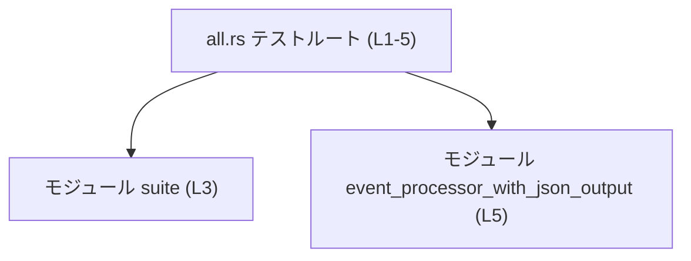

# exec\tests\all.rs コード解説

## 0. ざっくり一言

`exec\tests\all.rs` は、複数のテストモジュールを 1 つの「統合テスト用バイナリ」にまとめるための、非常に小さなルートファイルです（exec\tests\all.rs:L1-3）。

---

## 1. このモジュールの役割

### 1.1 概要

- コメントにある通り、このファイルは「すべてのテストモジュールをまとめる単一の統合テストバイナリ」として振る舞うことが意図されています（exec\tests\all.rs:L1）。
- 実際のテストロジックは `mod suite;` と `mod event_processor_with_json_output;` で読み込まれる別ファイル／ディレクトリ側に存在し、このファイルには関数やテスト本体は定義されていません（exec\tests\all.rs:L3-5）。

### 1.2 アーキテクチャ内での位置づけ

- このファイルは「テストクレートのルート」として 2 つのモジュールを束ねています。
  - `suite` モジュール（exec\tests\all.rs:L3）
  - `event_processor_with_json_output` モジュール（exec\tests\all.rs:L5）
- コメントから、少なくとも `suite` モジュールに関連するソースは `tests/suite/` ディレクトリに存在することが分かります（exec\tests\all.rs:L2）。

依存関係を簡単に図示すると、次のようになります。



この図は、「`all.rs` が 2 つのモジュールに依存している」という静的な構造を表しています。

### 1.3 設計上のポイント

コードから読み取れる設計上の特徴は次の通りです。

- **役割の分割**
  - このファイルは「モジュールの集約」に特化し、実際のテストケースの実装はすべてサブモジュールに委ねています（exec\tests\all.rs:L3-5）。
- **状態の非保持**
  - このファイル内には構造体・グローバル変数などの状態を保持する要素がなく、コンパイル時のモジュール宣言のみが存在します（exec\tests\all.rs:L1-5）。
- **エラーハンドリング**
  - 実行時のエラー処理ロジックは存在しません。
  - `mod` 宣言に対応するファイル／ディレクトリが存在しない場合は、コンパイル時エラーになるのが Rust の仕様です（一般的な言語仕様による説明）。
- **安全性・並行性**
  - `unsafe` ブロックやスレッド生成等のコードはなく、このファイル自体は完全に安全な Rust コードです（exec\tests\all.rs:L1-5）。

---

## 2. 主要な機能一覧（コンポーネントインベントリー）

このファイルが提供する「機能」は、実行ロジックというより「テストモジュールの集約」という構造的なものです。

| コンポーネント | 種別 | 位置 | 役割 / 説明 |
|----------------|------|------|-------------|
| `all`（このファイル） | テストクレートのルート | exec\tests\all.rs:L1-5 | 統合テストバイナリとして 2 つのテストモジュールを束ねる。自身にはテスト関数を持たない。 |
| `suite` | モジュール宣言 | exec\tests\all.rs:L3 | コメントより `tests/suite/` 配下にあるテスト群をまとめるモジュール（exec\tests\all.rs:L2-3）。 |
| `event_processor_with_json_output` | モジュール宣言 | exec\tests\all.rs:L5 | `event_processor_with_json_output` 関連のテストをまとめるモジュールであることが名前から推測されるが、具体的な中身はこのチャンクには現れません。 |

> 補足: このファイル内には関数・構造体・列挙体などの定義は存在しません（exec\tests\all.rs:L1-5）。

---

## 3. 公開 API と詳細解説

### 3.1 型一覧（構造体・列挙体など）

このファイルには、構造体・列挙体・型エイリアスなどの型定義はありません（exec\tests\all.rs:L1-5）。

| 名前 | 種別 | 役割 / 用途 |
|------|------|-------------|
| なし | -    | このファイルには型定義が存在しません。 |

### 3.2 関数詳細

このファイルには、関数・メソッド・テスト関数などの定義はありません（exec\tests\all.rs:L1-5）。したがって、関数詳細のテンプレートを適用できる対象はありません。

### 3.3 その他の関数

同様に、補助関数やラッパー関数も定義されていません（exec\tests\all.rs:L1-5）。

---

## 4. データフロー

このファイル単体では、値を受け取って処理するようなロジックが存在しないため、「データの流れ」という観点で説明できる具体的な処理はありません。

ここでは、**コンパイル時のモジュール読み込みフロー**を概念的に示します。

```mermaid
sequenceDiagram
    participant Rustc as "Rustコンパイラ"
    participant All as "all.rs (L1-5)"
    participant Suite as "モジュール suite"
    participant EventJson as "モジュール event_processor_with_json_output"

    Rustc->>All: all.rs を読み込む
    All->>All: コメントを無視して解析 (L1-2)
    All->>Suite: `mod suite;` を解決 (L3)
    All->>EventJson: `mod event_processor_with_json_output;` を解決 (L5)
```

- この図は「コンパイル時に `mod` 宣言を辿ってソースを読み込む」という Rust の一般的な挙動を表しています。
- 実際のテスト実行時にどのようなデータが流れるかは、サブモジュール側の実装がこのチャンクには存在しないため不明です。

---

## 5. 使い方（How to Use）

### 5.1 基本的な使用方法

実際にこのファイルを「使う」のは、開発者ではなく `cargo test` などのテストランナーです。開発者視点で関わる操作は次の通りです。

1. `tests/suite/` や `event_processor_with_json_output` モジュール側にテストコードを書く（exec\tests\all.rs:L2-3）。
2. `cargo test` を実行すると、この `all.rs` をルートとする統合テストバイナリがビルドされ、モジュール配下のテストが一括で実行される（この２の挙動は一般的な Rust のテスト仕組みに基づく説明であり、このチャンク単体には明示されていません）。

このファイル自体には呼び出すべき関数がないため、直接コードから呼ぶ「使用例」は存在しません。

### 5.2 よくある使用パターン

このファイルの用途はほぼ一つです。

- **テストモジュールの追加**
  - 新しいテストモジュールを統合テストバイナリに含めたい場合、同様の `mod` 宣言を追加します。

例（このファイルを拡張するイメージ）:

```rust
// 既存
mod suite;                                   // exec\tests\all.rs:L3
mod event_processor_with_json_output;        // exec\tests\all.rs:L5

// 新しいテストモジュールを追加したい場合の例
mod new_feature_tests;                       // new_feature_tests.rs or new_feature_tests/mod.rs を読み込む
```

### 5.3 よくある間違い

このファイルの性質上、起こりやすい誤りは主に **モジュール宣言とファイル構成の不整合** に関するものです。

- 誤り例
  - `mod suite;` と書いているが、実際には `suite.rs` や `suite/mod.rs` が存在しない。
- 結果
  - コンパイル時に「ファイルが見つからない」旨のエラーが発生します。
- 正しい状態
  - `mod` 宣言に対応するファイル／ディレクトリ構造を用意する。

### 5.4 使用上の注意点（まとめ）

- `mod` 宣言に対応するソースファイルを必ず用意する必要があります。
- このファイル自体にはテストケースを直接書かない構造になっているため、新しいテストは通常、`tests/suite/` や `event_processor_with_json_output` モジュール側に追加することになります（前者はコメントからの事実、後者はモジュール名からの推測であり具体的パスはこのチャンクには現れません）。

---

## 6. 変更の仕方（How to Modify）

### 6.1 新しい機能（テストモジュール）を追加する場合

このファイルは「テストモジュールを束ねるための入口」です。新しいテストグループを追加する場合の典型的な手順は次のようになります。

1. 新しいテストモジュール用のファイル（例: `tests/new_feature_tests.rs` や `tests/new_feature_tests/mod.rs`）を作成する。  
   ※ 具体的なパス名は、このチャンクには現れないため例示にとどまります。
2. `exec\tests\all.rs` に対応する `mod new_feature_tests;` を追記する。
3. `cargo test` を実行してコンパイルとテスト実行を確認する。

### 6.2 既存の機能を変更する場合

既存モジュールを差し替えたり、構成を変更する場合の注意点です。

- 影響範囲の確認
  - `mod suite;` を削除すると、`tests/suite/` 配下にあるテストがこの統合バイナリからは参照されなくなります（exec\tests\all.rs:L2-3）。
  - `mod event_processor_with_json_output;` を削除すると、そのモジュール内のテストも同様です（exec\tests\all.rs:L5）。
- 契約・前提条件
  - `mod` 宣言と対応するファイル名・ディレクトリ構造の整合性を保つことが前提条件です。
- テスト・使用箇所の再確認
  - モジュール構成を変えた場合、`cargo test` によるテストスイート全体の再実行が必要です。

---

## 7. 関連ファイル

このファイルと密接に関係するファイル・ディレクトリは、コメントとモジュール名から次のように読み取れます。

| パス / モジュール | 役割 / 関係 |
|-------------------|------------|
| `tests/suite/` | コメントで「サブモジュールが存在する」と明記されているディレクトリ。`mod suite;` に対応するテスト群が配置されると考えられます（exec\tests\all.rs:L2-3）。具体的なファイル構成はこのチャンクには現れません。 |
| `event_processor_with_json_output` モジュール | `mod event_processor_with_json_output;` により読み込まれるモジュールです（exec\tests\all.rs:L5）。Rust の規則から、同名の `.rs` ファイルまたはディレクトリが存在することが前提となりますが、実際のパスや中身はこのチャンクには現れません。 |

---

### Bugs / Security / Edge Cases に関する補足

- **Bugs**
  - このファイル自体に実行ロジックがないため、ランタイムバグは発生しません。
  - モジュール宣言とファイル構成の不一致によるコンパイルエラーのみが考えられます。
- **Security**
  - テスト専用のモジュール構成ファイルであり、外部入力の処理などは行っていません。
  - セキュリティ上の懸念は、このファイル単体からは読み取れません。
- **Edge Cases**
  - `mod` 先のファイルが存在しない・名前が異なる場合 → コンパイルエラー。
  - `mod` 先のモジュールで同名のモジュールをさらに定義しているなどの複雑な構成 → このチャンクには情報がないため不明です。
