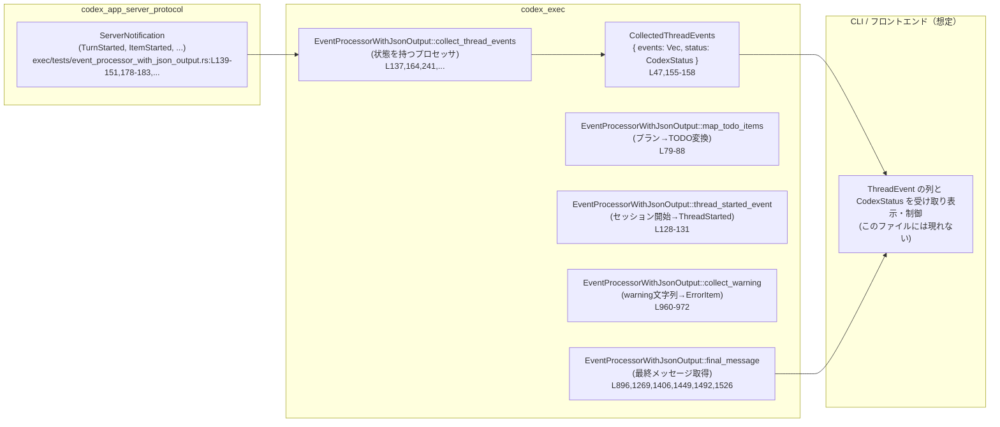
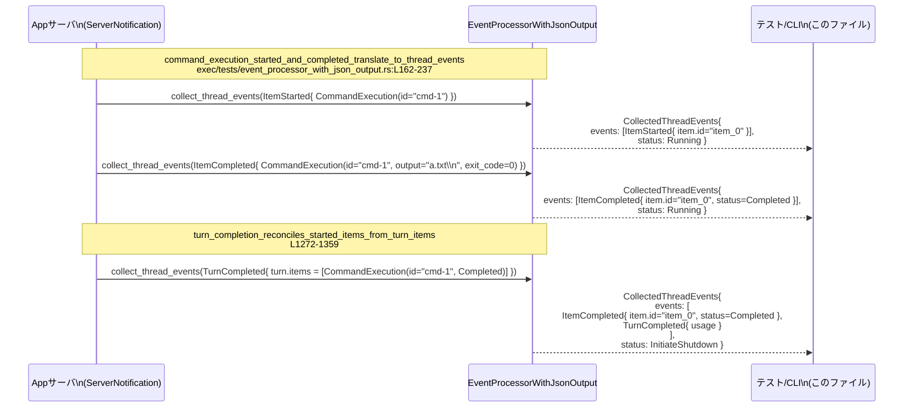

# exec/tests/event_processor_with_json_output.rs コード解説

## 0. ざっくり一言

`codex_app_server_protocol` から届く各種 `ServerNotification` を、`codex_exec` クレートの `EventProcessorWithJsonOutput` がどのような内部イベント (`ThreadEvent`) と状態 (`CodexStatus`, `final_message`) に変換するかを網羅的に検証するテスト群です（`exec/tests/event_processor_with_json_output.rs:L77-1605`）。

---

## 1. このモジュールの役割

### 1.1 概要

このテストモジュールは、次の問題を検証対象としています。

> 「App サーバからのスレッド／ターン通知 (`ServerNotification`) を、CLI 等で扱いやすい JSON ベースのイベント列 (`ThreadEvent` 群) とスレッド状態に正しく変換できているか」

具体的には、`EventProcessorWithJsonOutput` が以下を正しく行うことを確認します。

- さまざまな `ThreadItem` / `ServerNotification` のバリアントを、対応する `ThreadEvent` へマッピングすること  
  （例: CommandExecution, WebSearch, MCP Tool Call, FileChange, CollabAgent call など）
- 合成 ID (`item_0`, `item_1`, …) を使ってアイテムの開始・更新・完了を一貫して識別すること
- 最終的な回答テキスト (`final_message`) やトークン使用量 (`Usage`) を正しく更新すること
- エラー／警告／モデルリルートなどをエラーイベントとして表現し、失敗時に `CodexStatus::InitiateShutdown` を返すこと

### 1.2 アーキテクチャ内での位置づけ

このファイルは **テストコード** であり、本体実装は `codex_exec` クレート側（このチャンクには含まれていません）にあります。

テストが前提としている全体像は、以下のように整理できます。



このテストファイル自身は、`EventProcessorWithJsonOutput` へ様々な `ServerNotification` を入力し、返ってくる `CollectedThreadEvents` と `final_message` の値を `assert_eq!` で検証する役割を持ちます。

### 1.3 設計上のポイント（テストから読み取れる前提）

コードから読み取れる設計上の特徴を列挙します。

- **状態を持つイベントプロセッサ**  
  - すべてのテストが `let mut processor = EventProcessorWithJsonOutput::new(None);` のように **同じインスタンスに対して逐次的に通知を流す** 形になっています（`exec/tests/event_processor_with_json_output.rs:L137,164,241,266,...`）。
  - これにより、  
    - 合成 ID カウンタ（`item_0`, `item_1` …）  
    - 現在進行中の TODO リスト  
    - トークン使用量  
    - 直近のエラーメッセージ  
    - `final_message`  
    などを内部状態として保持していることが示唆されます。

- **公開 API 形状**（推定・実装は別ファイル）
  - `new(last_message_path: Option<PathBuf>) -> EventProcessorWithJsonOutput`  
    （`None` を渡す使い方のみがこのテストで登場: L137,164,241,...）
  - `collect_thread_events(notification: ServerNotification) -> CollectedThreadEvents`  
    （多数の呼び出し箇所: L139-151, 178-183, 243-253, ...）
  - `final_message(&self) -> Option<&str>` または同等の API  
    （`assert_eq!(processor.final_message(), Some("..."));` から推定: L896,1269,...）
  - `map_todo_items(steps: &[TurnPlanStep]) -> Vec<TodoItem>`  
    （L79-88 での利用から推定）
  - `thread_started_event(session_configured: &SessionConfiguredEvent) -> ThreadEvent`（L128-131）
  - `collect_warning(message: String) -> CollectedThreadEvents`（L960-972）

- **エラーハンドリング方針**
  - 例外や `Result` を返す設計ではなく、**`ThreadEvent::Error` / `ThreadEvent::TurnFailed` / `ThreadItemDetails::Error`** などのイベントとしてエラーを表現します（L965-977, 1545-1551, 1568-1576）。
  - 処理継続可否は `CodexStatus` で表現され、`Running` から `InitiateShutdown` への遷移がターン完了・失敗時に起こります（例: L1081-1087, 1223-1232, 1367-1405, 1491-1492, 1517-1524, 1568-1576）。

- **安全性／情報制御に関するルール**
  - Reasoning アイテムでは、**生の思考内容 (`content`) は一切表へ出さず、`summary` だけをユーザーに見せる**方針がテストされています（L245-249, 323-340）。
  - `summary` が空の場合は Reasoning のイベント自体を無視する（L239-262）。
  - モデルの自動リルートや高リスク検知など、ユーザに知らせるべき重要な挙動は `ErrorItem` として必ず表面化します（L1584-1605）。

- **並行性について**
  - すべてのテストは **単一スレッド・同期的** に `collect_thread_events` を呼び出しています。
  - `&mut processor` を使う設計のため、**同一インスタンスを複数スレッドから同時に利用する前提ではない**ことが読み取れます（Rust の借用規則的にも同時可変借用は不可）。
  - マルチスレッド環境下での利用や `Send`/`Sync` 実装有無は、このチャンクからは分かりません。

---

## 2. 主要な機能一覧（テスト対象としての機能）

テストから逆算される、`EventProcessorWithJsonOutput` の主な機能を列挙します。

- TODO 変換:  
  - `TurnPlanStep` の配列を、`TodoItem { text, completed }` のリストへマッピング（L77-103）。
- スレッド開始イベント生成:  
  - `SessionConfiguredEvent` から `ThreadEvent::ThreadStarted(ThreadStartedEvent)` を生成（L105-133）。
- ターン開始処理:  
  - `ServerNotification::TurnStarted` を `ThreadEvent::TurnStarted` に変換し、`CodexStatus::Running` を維持（L135-160）。
- アイテム開始／完了のマッピング:
  - `ThreadItem::CommandExecution` / `WebSearch` / `McpToolCall` / `CollabAgentToolCall` / `FileChange` / `Reasoning` / `AgentMessage` などを、対応する `ThreadItemDetails` バリアントに変換し、`ItemStarted` / `ItemCompleted` / `ItemUpdated` イベントとして出力（L162-237, 348-386, 455-582, 584-670, 673-761, 763-863, 865-897, 924-953 等）。
- 合成 ID (`item_0`, `item_1` …) 管理:
  - 未サポートアイテム（`ThreadItem::Plan`）を無視するときに **IDを消費しない**（L264-314）。
  - 同じ論理アイテム（WebSearchなど）の Start/Completed で **同じ合成 ID を再利用**（L388-452）。
- Reasoning アイテムの扱い:
  - `summary` が空ならイベント無し（L239-262）。
  - `summary` があれば `ReasoningItem { text: summary }` として出力し、`content` は無視（L316-346）。
- ファイル変更のマッピング:
  - `ApiPatchChangeKind::{Add,Delete,Update{..}}` → `PatchChangeKind::{Add,Delete,Update}` へマッピングし、`PatchApplyStatus::{Completed,Declined}` → `{Completed,Failed}` へマッピング（L763-823, 825-863）。
- MCP ツール呼び出し:
  - 引数 `arguments` が `Null` の場合でもそのまま保持（L585-599, 632-637）。
  - `McpToolCallStatus::{InProgress,Completed,Failed}` を内部の `McpToolCallStatus` に反映し、結果／エラーも構造を維持（L455-582, 584-670）。
- 協調エージェント呼び出し:
  - `CollabAgentTool::SpawnAgent` などの呼び出しを `CollabToolCallItem` へマッピングし、エージェント状態 (`CollabAgentState`) も変換（L673-761）。
- TODO リスト (Turn プラン) 管理:
  - `TurnPlanUpdated` 通知を `ItemStarted` / `ItemUpdated` へマッピング。
  - ターン完了時に TODO リストを `ItemCompleted` として終える。
  - 次のターンでは新しい合成 ID で新たな TODO リストを開始（L980-1108, 1110-1168）。
- トークン使用量の取り扱い:
  - `ThreadTokenUsageUpdated` ではイベントを出さず、内部に保存のみ。
  - 対応する `TurnCompleted` で `Usage { input_tokens, cached_input_tokens, output_tokens }` を `TurnCompletedEvent` に埋め込む（L1171-1233）。
- 最終メッセージ (`final_message`) 決定ロジック:
  - `ItemCompleted(AgentMessage)` 受信時に `final_message` を更新（L865-897）。
  - `TurnCompleted` で
    - ターン内 `ThreadItem::AgentMessage` があればそれを最終メッセージとする（L1236-1270, 1361-1407）。
    - それがなければ `ThreadItem::Plan` のテキストにフォールバック（L1495-1527）。
    - `items` が空かつ `final_message` が既にあれば、それを維持（L1409-1450）。
    - ターンが `TurnStatus::Failed` の場合は `final_message` をクリア（L1452-1493）。
- エラーイベント処理:
  - `ErrorNotification` の `TurnError { message, additional_details }` から、詳細付きのメッセージ `"message (details)"` を組み立て `ThreadEvent::Error` を生成し保持（L1529-1551）。
  - その後の `TurnCompleted (Failed)` では `ThreadEvent::TurnFailed` として同じメッセージを使用（L1553-1577）。
- モデルリルートの通知:
  - `ModelReroutedNotification` を `ThreadItemDetails::Error(ErrorItem)` へ変換し、ユーザに分かる形で「model rerouted: from -> to (Reason)」と表示（L1580-1605）。
- 警告文字列からのエラーアイテム生成:
  - `collect_warning` は単純なメッセージ文字列を `ThreadItemDetails::Error` へ変換するユーティリティ（L956-977）。

---

## 3. 公開 API と詳細解説

### 3.1 主要な型一覧（このファイルに現れるもの）

このファイルで重要な役割を果たす型をまとめます。定義自体は他クレートにありますが、ここでは「このテストから読み取れる役割」に限定して説明します。

| 名前 | 種別 | 役割 / 用途 | 根拠 |
|------|------|-------------|------|
| `EventProcessorWithJsonOutput` | 構造体（推定） | `ServerNotification` を受け、`ThreadEvent` 列と `CodexStatus`、`final_message` を管理するメインのイベントプロセッサ | `use` 行: `exec/tests/event_processor_with_json_output.rs:L51-51`、利用: L137,164,241,... |
| `CollectedThreadEvents` | 構造体 | 処理結果として返される、`events: Vec<ThreadEvent>` と `status: CodexStatus` のペア | インポート L47, 比較 L155-158,186-199,... |
| `CodexStatus` | 列挙体（推定） | プロセッサの継続状態 (`Running` / `InitiateShutdown`) を表す | インポート L41, アサート L157-158, 198-199, 820-821, 1051-1052, 1231-1232, 1403-1404, 1491-1492 等 |
| `ThreadEvent` | 列挙体 | UI に通知する高レベルイベント (`ThreadStarted`, `TurnStarted`, `ItemStarted`, `ItemCompleted`, `ItemUpdated`, `TurnCompleted`, `TurnFailed`, `Error`) | インポート L66, 使用 L129-131,156,187,223,258,303,335,370,421,437,498,517,564,630,649,720,739,798,848,885,943,967,1004,1045,1084,1101,1155,1224,1263,1341,1352,1399,1441,1519,1546,1570,1595-1604 |
| `ExecThreadItem` | 構造体 | 合成 ID (`id: "item_0"` など) と詳細 (`ThreadItemDetails`) を持つ、内部表現上のターンアイテム | インポート L52, 使用 L188-196,224-232,305-309,337-340,371-380,422-428,499-508,519-530,566-576,631-640,651-665,721-731,741-755,799-817,849-857,887-890,945-948,969-972,1005-1018,1046-1058,1085-1098,1156-1163 |
| `ThreadItemDetails` | 列挙体 | 個々のアイテム種別（AgentMessage, Reasoning, CommandExecution, WebSearch, McpToolCall, FileChange, CollabToolCall, TodoList, Error など）のペイロード | インポート L67, パターン比較・構築 L190-195,227-231,306-309,338-340,373-380,424-428,501-508,520-530,567-576,633-640,652-665,723-730,742-755,801-817,851-857,888-890,946-948,970-972,1007-1017,1048-1057,1087-1097,1158-1163,1600-1604 |
| `Usage` | 構造体 | トークン使用量（input, cached_input, output）を表現 | インポート L74, 使用 L1102,1224-1229,1264,1353,1401,1521, |
| `TodoItem`, `TodoListItem` | 構造体 | TODO リストの 1 項目およびその集合を表現。プランステップの UI 表示用 | インポート L69-70, マッピング L93-101,1009-1017,1049-1058,1088-1097,1159-1162 |
| `CommandExecutionItem` | 構造体 | コマンド実行内容と出力、終了コード、状態を保持 | インポート L48, 使用 L190-195,227-231,1299-1304,1345-1349 |
| `WebSearchItem` | 構造体 | Web 検索の ID, クエリ, アクションを保持 | インポート L75, 使用 L373-380,425-428,440-447 |
| `McpToolCallItem`, `McpToolCallItemResult`, `McpToolCallItemError` | 構造体 | MCP ツール呼び出しのサーバ名・ツール名・引数・結果・エラーメッセージを保持 | インポート L58-60, 使用 L501-508,519-530,567-576,633-640,652-665 |
| `FileChangeItem`, `ExecFileUpdateChange` | 構造体 | ファイルパッチの適用結果、および各ファイルの変更種別を表現 | インポート L53-54, 使用 L801-817,851-857 |
| `CollabToolCallItem`, `CollabAgentState`, `CollabAgentStatus`, `CollabTool`, `CollabToolCallStatus` | 構造体/列挙体 | 協調エージェントツール呼び出しの内容と各エージェントの状態を表現 | インポート L42-46, 使用 L723-730,742-755 |
| `ErrorItem`, `ThreadErrorEvent`, `TurnFailedEvent` | 構造体 | エラー（1件単位）とターン失敗イベントを表現 | インポート L50,65,72, 使用 L969-972,1546-1551,1570-1574,1600-1604 |

（ここに挙げた型のフィールド定義などは、このチャンクには含まれていません。役割は全てテストから読み取れる利用箇所に基づきます。）

### 3.2 関数詳細（推定含む）

ここでは、このファイルから見える範囲で **特に重要な 5 つの API** を取り上げます。シグネチャは実装ファイルが無いため一部推測を含みますが、その旨を明記します。

---

#### `EventProcessorWithJsonOutput::map_todo_items(steps: &[TurnPlanStep]) -> Vec<TodoItem>`（推定）

**概要**

`TurnPlanStep` の配列から、UI 表示用の TODO 項目 (`TodoItem`) のリストを生成します。  
`TurnPlanStepStatus` が `Completed` かどうかを `TodoItem.completed` に反映します。

**根拠**

- 呼び出し: `exec/tests/event_processor_with_json_output.rs:L79-88`  
- 期待結果: `TodoItem { text, completed }` のベクタ（L90-102）

**引数（推定）**

| 引数名 | 型 | 説明 |
|--------|----|------|
| `steps` | `&[TurnPlanStep]` | プランステップの配列。`step: String`, `status: TurnPlanStepStatus` を含む（L80-87）。 |

**戻り値**

- 型: `Vec<TodoItem>`（推定）
- 意味: 各ステップの `step` を `text` にコピーし、`status == Completed` であれば `completed: true`、それ以外は `false` とする TODO 項目の配列（L90-102）。

**内部処理の流れ（テストからの推定）**

1. `steps` を順番にイテレートする。
2. 各ステップ `s` について `TodoItem { text: s.step.clone(), completed: s.status == TurnPlanStepStatus::Completed }` を生成。
3. 生成した `TodoItem` を `Vec` に集めて返す。

**Examples（使用例）**

```rust
// プランステップを構築
let plan = &[
    TurnPlanStep {
        step: "inspect bootstrap".to_string(),
        status: TurnPlanStepStatus::InProgress,
    },
    TurnPlanStep {
        step: "drop legacy notifications".to_string(),
        status: TurnPlanStepStatus::Completed,
    },
];

// TODO リストへ変換
let items = EventProcessorWithJsonOutput::map_todo_items(plan);

// 1 つ目は未完了、2 つ目は完了
assert_eq!(
    items,
    vec![
        TodoItem {
            text: "inspect bootstrap".to_string(),
            completed: false,
        },
        TodoItem {
            text: "drop legacy notifications".to_string(),
            completed: true,
        },
    ]
);
```

（根拠: L77-103）

**Errors / Panics**

- このテストではエラーやパニック条件は検証されていません。
- 入力 `steps` によるパニック等の挙動は、このチャンクからは分かりません。

**Edge cases（推測されるもの）**

- 空スライス `&[]` が渡された場合、空の `Vec<TodoItem>` を返すと考えるのが自然ですが、このファイルでは検証されていません。
- `TurnPlanStepStatus` の他のバリアント（`Pending` など）は、`completed: false` になることが `plan_update_emits_started_then_updated_then_completed` のテスト（L980-1023）から読み取れます。

**使用上の注意点**

- `TurnPlanUpdatedNotification` の処理でも内部的に本関数が使われていると推定されます（L984-1003,1025-1063）。変更する場合は TODO リスト関連のテストへの影響に注意が必要です。

---

#### `EventProcessorWithJsonOutput::thread_started_event(session: &SessionConfiguredEvent) -> ThreadEvent`（推定）

**概要**

セッション設定完了イベント (`SessionConfiguredEvent`) から、スレッド開始イベント `ThreadEvent::ThreadStarted(ThreadStartedEvent)` を生成します。

**根拠**

- 呼び出しと期待結果: L105-133

**引数（推定）**

| 引数名 | 型 | 説明 |
|--------|----|------|
| `session` | `&SessionConfiguredEvent` | スレッド ID を含むセッション設定イベント。`session.session_id` から ID を取り出す（L107-125）。 |

**戻り値**

- 型: `ThreadEvent`
- 意味: `ThreadEvent::ThreadStarted(ThreadStartedEvent { thread_id })` を返す（L128-131）。

**内部処理の流れ（推定）**

1. `session.session_id` を文字列に変換（`ThreadId::from_string(...).to_string()` 相当）。
2. その文字列 ID を持つ `ThreadStartedEvent` を構築。
3. `ThreadEvent::ThreadStarted` でラップして返す。

**Examples**

```rust
let session_configured = SessionConfiguredEvent {
    session_id: ThreadId::from_string("67e55044-10b1-426f-9247-bb680e5fe0c8").unwrap(),
    // 他のフィールドは省略
    ..unimplemented!()
};

let event = EventProcessorWithJsonOutput::thread_started_event(&session_configured);

assert_eq!(
    event,
    ThreadEvent::ThreadStarted(ThreadStartedEvent {
        thread_id: "67e55044-10b1-426f-9247-bb680e5fe0c8".to_string(),
    })
);
```

（テスト実装は L105-133 に相当）

**Errors / Panics**

- この関数自身はテスト上 Result を返しておらず、パニックも検証されていません。
- ID のパースエラーはテスト側で `expect("thread id should parse")` に任されており（L108-109）、本関数の外側の責務とされています。

**使用上の注意点**

- この関数はセッション開始直後の「スレッド開始」を 1 回だけ通知する想定です。複数回呼ぶことの意味／影響は、このチャンクからは分かりません。

---

#### `EventProcessorWithJsonOutput::collect_thread_events(notification: ServerNotification) -> CollectedThreadEvents`（推定・中核関数）

**概要**

App サーバからの `ServerNotification` を 1 件受け取り、内部状態を更新したうえで、UI に渡すための `ThreadEvent` のリストと、処理継続可否を示す `CodexStatus` を返します。

**根拠**

- ほぼ全てのテストでこのメソッドを呼び出している: L139-151, 178-183, 243-253, 268-277, 287-297, 320-329, 352-365, 392-401, 403-415, 459-473, 474-493, 542-559, 588-602, 603-624, 678-692, 693-715, 767-793, 829-843, 869-880, 903-913, 928-937, 984-1000, 1025-1041, 1066-1078, 1114-1124, 1125-1137, 1140-1149, 1175-1198, 1207-1219, 1240-1257, 1276-1292, 1311-1334, 1364-1375, 1377-1394, 1412-1423, 1425-1437, 1456-1467, 1472-1488, 1499-1515, 1533-1542, 1553-1565, 1584-1592。

**引数（推定）**

| 引数名 | 型 | 説明 |
|--------|----|------|
| `notification` | `ServerNotification` | サーバからの単一通知。`TurnStarted`, `ItemStarted`, `ItemCompleted`, `TurnCompleted`, `TurnPlanUpdated`, `ThreadTokenUsageUpdated`, `Error`, `ModelRerouted` などのバリアントを持つ。 |

**戻り値**

- 型: `CollectedThreadEvents`
- 意味:
  - `events: Vec<ThreadEvent>`: 今回の通知に対応して発生した UI 向けイベントの列。
  - `status: CodexStatus`: 全体の処理状態。`Running` 中は引き続き通知処理を行い、`InitiateShutdown` になったら CLI 側で終了処理を行うことが想定されます（例: L1081-1107, 1223-1232）。

**内部処理の主な分岐（テストからの読み取り）**

以下は通知種別ごとの挙動です。実装は見えていないため、**すべてテストに現れた挙動に限定して**記述します。

1. **`TurnStarted`**（ターン開始）  
   - 入力: `ServerNotification::TurnStarted(TurnStartedNotification { ... })`（L139-151）
   - 出力: `events = [ThreadEvent::TurnStarted(TurnStartedEvent {})]`、`status = CodexStatus::Running`（L153-159）。

2. **`ItemStarted`**（アイテム開始）
   - `ThreadItem::CommandExecution` の場合:
     - 合成 ID (`"item_0"`) を割り当て（L188-190）。
     - `CommandExecutionItem` を `CommandExecutionStatus::InProgress` で作成（L190-195）。
     - `ThreadEvent::ItemStarted` で返す（L187-197）。
   - `ThreadItem::WebSearch` の場合:
     - 合成 ID `"item_0"` を割り当て（L422-424）。
     - `WebSearchItem { id: "search-1", query: "", action: WebSearchAction::Other }` を構築（L424-428）。
   - `ThreadItem::McpToolCall` の場合:
     - MCP 関連フィールドを保持しつつ `McpToolCallStatus::InProgress` で構築（L501-508, 631-640）。
   - `ThreadItem::CollabAgentToolCall` の場合:
     - `CollabToolCallItem` にマッピングし、`CollabToolCallStatus::InProgress` をセット（L723-730）。
   - `ThreadItem::AgentMessage` の場合:
     - **イベントは生成されず**、`events = []`（L903-921）。
   - いずれも `CodexStatus::Running` のまま（L198-199, 431-432, 511-512, 643-644, 733-734）。

3. **`ItemCompleted`**（アイテム完了）
   - `CommandExecution`:
     - 事前に開始されていれば、**同じ合成 ID** の `ExecThreadItem` を `CommandExecutionStatus::Completed` に更新（L223-231, 1299-1304, 1341-1351）。
   - `Reasoning`:
     - `summary` が空 (`Vec::new()`) の場合はイベント無し（L245-253, 255-261）。
     - `summary` が 1 つ以上あれば、その内容のみを `ReasoningItem.text` に使用し、`content` は無視（L323-340）。
     - 合成 ID (`"item_0"`) を割り当て（L337-338, 945-947）。
   - `Plan`:
     - `ItemCompleted` として入力した場合、**イベントは生成されない**（L268-285）。
     - ただし、ターン完了時の「最終回答テキスト」のフォールバック先としては利用される（L1499-1515, 1526-1527）。
   - `AgentMessage`:
     - `ThreadItemDetails::AgentMessage(AgentMessageItem { text })` として `ItemCompleted` を生成し（L883-891）、**同時に `final_message` を text で更新**（L896）。
   - `WebSearch`:
     - 完了時には `WebSearchAction::Search{..}` など具体的なアクションを保持して返す（L373-380, 440-447）。
   - `FileChange`:
     - 変更種別 `ApiPatchChangeKind` を内部の `PatchChangeKind` へマッピング（Add→Add, Delete→Delete, Update→Update）（L803-815）。
     - ステータス `ApiPatchApplyStatus::{Completed,Declined}` を `PatchApplyStatus::{Completed,Failed}` へ変換（L816-817, 852-857）。
   - `McpToolCall`:
     - 成功時: `McpToolCallItemResult` に `content` / `structured_content` をコピー（L524-527, 656-662）。
     - 失敗時: `McpToolCallItemError { message }` を設定し、`status: Failed` にする（L568-576, 571-575）。
   - `CollabAgentToolCall`:
     - 完了時: `agents_states` を `ApiCollabAgentState` → `CollabAgentState` へマッピングし、`status: Completed` とする（L742-755, 704-710, 747-753）。
   - これらの完了処理自体では `CodexStatus::Running` を維持します（L579-580, 668-669, 758-759, 820-821, 860-861, 951-952, 975-976）。

4. **`TurnPlanUpdated`**（プラン更新）
   - 初回のプラン更新で `ItemStarted` として TODO リストを開始し、合成 ID `"item_0"` を割り当てる（L984-1003）。
   - 同じターン内で再度 `TurnPlanUpdated` が来た場合は、同じ ID `"item_0"` の `ItemUpdated` を出す（L1025-1063）。
   - 別ターン (`turn_id` が異なる) のプラン更新が、前ターンの TODO リスト完了後に来た場合は、新しい合成 ID `"item_1"` で `ItemStarted` を出す（L1114-1168）。

5. **`TurnCompleted`**（ターン完了）
   - ステータス `TurnStatus::Completed` の場合:
     - もし TODO リスト（Plan）が進行中であれば、その TODO リストを `ItemCompleted` として出す（L1066-1078, 1081-1107）。
     - 直近の `ThreadTokenUsageUpdated` から `Usage` を計算し、`ThreadEvent::TurnCompleted(TurnCompletedEvent { usage })` を出す（L1207-1219, 1223-1232）。
     - `final_message` の扱い:
       - ターン内の `ThreadItem::AgentMessage` のテキストを優先（L1238-1270, 1361-1407）。
       - なければ `ThreadItem::Plan` のテキストにフォールバック（L1499-1515, 1526-1527）。
       - `items` が空で、既に `final_message` がある場合はそれを維持（L1412-1437, 1440-1447）。
     - `CodexStatus::InitiateShutdown` に遷移する（L1081-1107, 1223-1232, 1261-1267, 1352-1357, 1398-1404, 1519-1524）。
   - ステータス `TurnStatus::Failed` の場合:
     - `final_message` をクリアし `None` にする（L1472-1492）。
     - 直近の `ErrorNotification` で記録しておいたエラーメッセージがあれば、それを用いて `TurnFailed(TurnFailedEvent { error: ThreadErrorEvent { message } })` を出す（L1553-1565, 1568-1576）。
     - `CodexStatus::InitiateShutdown` に遷移（L1491-1492, 1575-1576）。

6. **`ThreadTokenUsageUpdated`**
   - 直ちにはイベントを出さず、内部に保持するのみ（L1175-1198, 1200-1205）。
   - 対応するターンの `TurnCompleted` で初めて `TurnCompletedEvent.usage` として反映される（L1207-1233）。

7. **`Error`（ErrorNotification）**
   - `TurnError { message, additional_details }` を `"message (additional_details)"` に組み立て、`ThreadEvent::Error(ThreadErrorEvent { message })` を `events` に追加（L1533-1542, 1545-1551）。
   - このメッセージは後続の `TurnCompleted(Failed)` で再利用される（L1553-1565, 1570-1574）。

8. **`ModelRerouted`**
   - `ThreadEvent::ItemCompleted(ItemCompletedEvent { ThreadItemDetails::Error(ErrorItem { message: "model rerouted: ..." }) })` を生成し、`status` は `Running` のまま（L1584-1592, 1594-1604）。

**Errors / Panics**

- 本メソッド自体は `Result` を返していません。
- テスト中で唯一の明示的パニックはパターンマッチで `else { panic!("expected ItemCompleted") }` を書いている箇所であり（L1596-1598）、これはテスト側のガードロジックです。
- `collect_thread_events` 内でのパニックの有無はこのチャンクからは分かりません。

**Edge cases（テストでカバーされているもの）**

- Reasoning の `summary` が空 → イベント無し（L239-262）。
- 未サポートアイテム（`ThreadItem::Plan` の単独完了）→ イベント無し & 合成 ID カウンタ非増加（L264-314）。
- `AgentMessage` の `ItemStarted` → イベント無し（L899-922）。
- `ThreadTokenUsageUpdated` のみで `TurnCompleted` が来ない → `TurnCompletedEvent` が出ない（この状況はテストされていません。テストでは必ず後に `TurnCompleted` が来ています）。
- `TurnCompleted(Failed)` で `error` フィールドが `Some` のケースは存在せず（L1479-1483, 1559-1563 では `error: Some` / `None` の双方あり）、`ErrorNotification` との組み合わせのみテストされています。

**使用上の注意点**

- この関数は **順序を考慮したイベントストリーム処理** を前提としており、同じターン／スレッドに対する通知は正しい順序で渡す必要があります（例: `ItemStarted` → `ItemCompleted` → `TurnCompleted`）。
- 同一の `ThreadItem` ID に対する `ItemStarted` → `ItemCompleted` の順序が守られる前提で、合成 ID の再利用が行われます（L388-452, 1276-1292, 1311-1335）。
- 異なるスレッド ID やターン ID の並行処理はこのテストでは扱われておらず、その挙動は不明です。

---

#### `EventProcessorWithJsonOutput::final_message(&self) -> Option<&str>`（推定）

**概要**

現在のターンに対応する最終メッセージ（ユーザへ表示される回答テキスト）を返します。  
`AgentMessage` や `Plan` の `text`、またはストリーム途中の `AgentMessage` に基づいて更新・クリアされます。

**根拠**

- 参照箇所: L896,1269,1406,1449,1492,1526。

**戻り値**

- 型: `Option<&str>` または `Option<String>`（テストでは `Option<&str>` と比べているため `Option<&str>` である可能性が高い）。
- `Some(text)` の場合: 最後に確定した回答テキスト。
- `None` の場合: 有効な最終メッセージが存在しない（失敗などでクリアされた）状態。

**内部ルール（テストからの読み取り）**

1. `ItemCompleted(AgentMessage)` 受信時に `text` で上書きされる（L865-897）。
2. `TurnCompleted(Completed)` で
   - ターン内に `AgentMessage` があれば、その `text` で上書き（L1238-1270, 1361-1407）。
   - なければ `Plan.text` を使って上書き（L1499-1515, 1526-1527）。
   - `items` が空で既に `Some` なら値を維持（L1412-1437, 1440-1447）。
3. `TurnCompleted(Failed)` で `None` にクリアされる（L1472-1493）。

**Examples**

- ストリーム途中でメッセージが届き、`TurnCompleted` で items が空でもそれを保持する例（L1409-1450）:

```rust
let mut processor = EventProcessorWithJsonOutput::new(None);

// ストリームされた途中の回答
let _ = processor.collect_thread_events(ServerNotification::ItemCompleted(
    ItemCompletedNotification {
        item: ThreadItem::AgentMessage { text: "streamed answer".to_string(), .. },
        // 省略
        ..unimplemented!()
    }
));

// ターン完了（items は空）
let _ = processor.collect_thread_events(ServerNotification::TurnCompleted(
    TurnCompletedNotification {
        turn: Turn { items: Vec::new(), status: TurnStatus::Completed, ..unimplemented!() },
        // 省略
        ..unimplemented!()
    }
));

assert_eq!(processor.final_message(), Some("streamed answer"));
```

**Edge cases**

- 直前のターンのメッセージが残っている状態で次のターンを開始したときの挙動はこのファイルでは検証されていません。
- 複数の AgentMessage が来た場合、**最後のものが勝つ**ことが `turn_completion_overwrites_stale_final_message_from_turn_items`（L1361-1407）から読み取れます。

**使用上の注意点**

- CLI 側は、`CodexStatus::InitiateShutdown` に到達したタイミング（ターン完了・失敗）でこのメソッドを呼び出し、「最終回答」をユーザに提示するのが自然です。
- 失敗ターンでは `None` になることに注意が必要です（L1452-1493）。

---

#### `EventProcessorWithJsonOutput::collect_warning(message: String) -> CollectedThreadEvents`（推定）

**概要**

単純な警告メッセージ（文字列）を、`ThreadItemDetails::Error(ErrorItem)` を持つ `ItemCompleted` イベントとしてラップし、`CodexStatus::Running` とともに返します。

**根拠**

- 呼び出し: L960-962  
- 期待結果: `ThreadEvent::ItemCompleted(ItemCompletedEvent { ThreadItemDetails::Error(ErrorItem { message }) })`（L965-973）

**引数**

| 引数名 | 型 | 説明 |
|--------|----|------|
| `message` | `String` | ユーザに伝えるべき警告文。 |

**戻り値**

- 型: `CollectedThreadEvents`
- 意味: `events` に 1 つの `ItemCompleted`（ErrorItem）を含み、`status` は `CodexStatus::Running`。

**内部処理の流れ（推定）**

1. 合成 ID （ここでは `"item_0"`）を生成。
2. `ExecThreadItem { id: "item_0".to_string(), details: ThreadItemDetails::Error(ErrorItem { message }) }` を作成（L969-972）。
3. それを `ThreadEvent::ItemCompleted(ItemCompletedEvent { item })` にラップ。
4. `CollectedThreadEvents { events: vec![...], status: CodexStatus::Running }` として返す（L965-977）。

**Examples**

```rust
let mut processor = EventProcessorWithJsonOutput::new(None);

let events = processor.collect_warning(
    "Heads up: Long conversations ...".to_string(),
);

assert_eq!(events.status, CodexStatus::Running);
assert!(matches!(
    &events.events[0],
    ThreadEvent::ItemCompleted(ItemCompletedEvent {
        item: ExecThreadItem {
            details: ThreadItemDetails::Error(ErrorItem { message }),
            ..
        }
    }) if message.starts_with("Heads up:")
));
```

**使用上の注意点**

- このメソッドは `ServerNotification` を介さず、ローカルに生成した警告を UI に伝えたい場合に利用するユーティリティと解釈できます。
- 合成 ID カウンタに影響するため、テストのように最初のアイテムが警告の場合、その ID は `"item_0"` になります（L969-970）。

---

### 3.3 その他の関数（このファイル内のテスト関数）

このファイルには 30 個の `#[test]` 関数があり、それぞれ特定の挙動を検証しています。代表的なものを簡潔にまとめます（すべて `exec/tests/event_processor_with_json_output.rs` 内に定義）。

| 関数名 | 役割（1 行） | 行範囲 |
|--------|--------------|--------|
| `map_todo_items_preserves_text_and_completion_state` | `map_todo_items` がステップ文言と完了状態を維持して `TodoItem` に変換することを検証 | L77-103 |
| `session_configured_produces_thread_started_event` | `thread_started_event` が `SessionConfiguredEvent` から `ThreadStarted` を生成することを検証 | L105-133 |
| `turn_started_emits_turn_started_event` | `TurnStarted` 通知が `ThreadEvent::TurnStarted` を生成し、`CodexStatus::Running` を維持することを検証 | L135-160 |
| `command_execution_started_and_completed_translate_to_thread_events` | コマンド実行の開始／完了が適切な `ItemStarted` / `ItemCompleted` に変換されることを検証 | L162-237 |
| `empty_reasoning_items_are_ignored` | `summary` が空の Reasoning 完了がイベントを生成しないことを検証 | L239-262 |
| `unsupported_items_do_not_consume_synthetic_ids` | 未サポートアイテム（Plan 完了）が ID カウンタを消費しないことを検証 | L264-314 |
| `reasoning_items_emit_summary_not_raw_content` | Reasoning の `summary` のみが出力され `content` が無視されることを検証 | L316-346 |
| `web_search_completion_preserves_query_and_action` | Web 検索完了が元の query および action を保持していることを検証 | L348-386 |
| `web_search_start_and_completion_reuse_item_id` | Web 検索の開始・完了で同じ合成 ID を再利用することを検証 | L388-452 |
| `mcp_tool_call_begin_and_end_emit_item_events` | MCP ツール呼び出しの開始・完了が `McpToolCallItem` の Start/Completed にマッピングされることを検証 | L455-536 |
| `mcp_tool_call_failure_sets_failed_status` | MCP 呼び出し失敗時に `status: Failed` とエラーメッセージがセットされることを検証 | L538-581 |
| `mcp_tool_call_defaults_arguments_and_preserves_structured_content` | 引数 `Null` を保持しつつ構造化コンテンツを維持することを検証 | L584-670 |
| `collab_spawn_begin_and_end_emit_item_events` | 協調エージェント Spawn の開始・完了が `CollabToolCallItem` として出力されることを検証 | L673-760 |
| `file_change_completion_maps_change_kinds` | ファイル変更の種別が `PatchChangeKind` へ正しくマッピングされることを検証 | L763-823 |
| `file_change_declined_maps_to_failed_status` | パッチ適用 Declined が `PatchApplyStatus::Failed` にマッピングされることを検証 | L825-863 |
| `agent_message_item_updates_final_message` | `AgentMessage` 完了が `final_message` を更新することを検証 | L865-897 |
| `agent_message_item_started_is_ignored` | `AgentMessage` 開始がイベントを生成しないことを検証 | L899-922 |
| `reasoning_item_completed_uses_synthetic_id` | Reasoning 完了が合成 ID (`item_0`) を使用することを検証 | L924-953 |
| `warning_event_produces_error_item` | `collect_warning` が ErrorItem を生成することを検証 | L956-977 |
| `plan_update_emits_started_then_updated_then_completed` | `TurnPlanUpdated` と `TurnCompleted` の組み合わせで TODO リストの Start/Update/Complete が生じることを検証 | L980-1108 |
| `plan_update_after_completion_starts_new_todo_list_with_new_id` | 前ターン完了後の新プランが新しい合成 ID (`item_1`) を使用することを検証 | L1110-1168 |
| `token_usage_update_is_emitted_on_turn_completion` | `ThreadTokenUsageUpdated` が TurnCompleted で `Usage` に反映されることを検証 | L1171-1233 |
| `turn_completion_recovers_final_message_from_turn_items` | `TurnCompleted` の `items` 内の AgentMessage から `final_message` を復元できることを検証 | L1236-1270 |
| `turn_completion_reconciles_started_items_from_turn_items` | `ItemStarted` 済みアイテムが `TurnCompleted` の `items` によって Completed として reconciled されることを検証 | L1272-1359 |
| `turn_completion_overwrites_stale_final_message_from_turn_items` | 古い `final_message` が、`TurnCompleted.items` に基づく新しいメッセージで上書きされることを検証 | L1361-1407 |
| `turn_completion_preserves_streamed_final_message_when_turn_items_are_empty` | ターン内 items が空でも、ストリーム済みの `final_message` が保持されることを検証 | L1409-1450 |
| `failed_turn_clears_stale_final_message` | 失敗ターンが `final_message` をクリアすることを検証 | L1452-1493 |
| `turn_completion_falls_back_to_final_plan_text` | AgentMessage がない場合に Plan テキストが `final_message` になることを検証 | L1495-1527 |
| `turn_failure_prefers_structured_error_message` | `ErrorNotification` の詳細付きメッセージが `TurnFailed` に再利用されることを検証 | L1529-1577 |
| `model_reroute_surfaces_as_error_item` | モデルリルート通知が ErrorItem として UI に現れることを検証 | L1580-1605 |

---

## 4. データフロー

ここでは代表的なシナリオとして、**コマンド実行アイテムの開始→完了→ターン完了** に至るデータフローを示します。

### 4.1 コマンド実行のフロー（L162-237, 1272-1359）

1. CLI や UI がコマンド実行を要求し、App サーバが `ThreadItem::CommandExecution` とともに `ItemStarted` 通知を送る（L165-176,178-183）。
2. `EventProcessorWithJsonOutput::collect_thread_events` がこの通知を受け取り、
   - 合成 ID `"item_0"` を割り振った `ExecThreadItem` を生成し、`ThreadEvent::ItemStarted` を `events` に入れて返す（L185-199）。
3. 実行が完了すると、App サーバは同じ `id: "cmd-1"` の `ThreadItem::CommandExecution` を `ItemCompleted` 通知として送る（L202-218）。
4. プロセッサは内部に保持していた `"item_0"` のアイテムを参照し、`aggregated_output` や `exit_code`、`status: Completed` を反映した `ExecThreadItem` で `ThreadEvent::ItemCompleted` を返す（L221-235）。
5. ターン完了時に `TurnCompleted` 通知が `items` 内に同じ `CommandExecution` アイテムを含んでいる場合、プロセッサは
   - 再度 `"cmd-1"` に対応する `"item_0"` を Completed に更新する `ItemCompleted` イベントを出し
   - 併せて `TurnCompletedEvent { usage }` を出す（L1311-1335, 1337-1357）。
6. `CodexStatus` は `ItemStarted` / `ItemCompleted` のたびに `Running` を維持し、`TurnCompleted` によって `InitiateShutdown` へ遷移する（L198-199, 234-235, 1356-1357）。

Mermaid のシーケンス図で表すと次のようになります。



この図から分かるように:

- プロセッサは、**論理 ID (`cmd-1`) と合成 ID (`item_0`) を関連付ける内部状態**を持ち、
- `TurnCompleted` の段階でも開始済みアイテムとの整合性をとるようになっています（L1276-1292, 1311-1335）。

---

## 5. 使い方（How to Use）

ここでは **テストコードを元にした実用的な呼び出しパターン** を整理します。

### 5.1 基本的な使用方法

もっとも基本的なフローは、

1. プロセッサを初期化する。
2. サーバから届く `ServerNotification` を順に `collect_thread_events` に渡す。
3. 各タイミングで返ってくる `ThreadEvent` を UI に反映する。
4. `CodexStatus::InitiateShutdown` 時に `final_message` 等を参照して終了する。

という形です。

```rust
use codex_exec::{EventProcessorWithJsonOutput, CodexStatus};
use codex_app_server_protocol::{ServerNotification, TurnStartedNotification, Turn, TurnStatus};

fn main_loop(notifications: Vec<ServerNotification>) {
    // 1. プロセッサの初期化（過去の最終メッセージ等を復元したい場合は Some(path) を渡す設計かもしれませんが、
    //    このテストでは常に None を利用しています: L137,164,...
    let mut processor = EventProcessorWithJsonOutput::new(None);

    for notification in notifications {
        // 2. 通知を順に処理
        let collected = processor.collect_thread_events(notification);

        // 3. 返ってきた ThreadEvent 列を UI に描画（ここでは単純に println ）
        for event in collected.events {
            println!("event: {:?}", event); // 実際には JSON 出力などが想定されます
        }

        // 4. 状態が InitiateShutdown ならループ終了
        if matches!(collected.status, CodexStatus::InitiateShutdown) {
            break;
        }
    }

    // 5. 最終メッセージがあれば表示
    if let Some(message) = processor.final_message() {
        println!("final message: {message}");
    }
}
```

### 5.2 よくある使用パターン

#### パターン 1: TODO リスト付きターン

- `TurnPlanUpdated` が複数回来るターンでは、TODO リストの進捗をリアルタイムに更新できます（L980-1064）。
- ターン完了時に TODO リスト全体の最終状態を `ItemCompleted` として受け取り、同時に `TurnCompleted` イベントも受け取ります（L1066-1107）。

```rust
// プラン開始
let started = processor.collect_thread_events(ServerNotification::TurnPlanUpdated(
    TurnPlanUpdatedNotification { /* plan: Pending, InProgress */ .. }
));
// UI 側: ItemStarted(TodoList) を表示

// プラン更新
let updated = processor.collect_thread_events(ServerNotification::TurnPlanUpdated(
    TurnPlanUpdatedNotification { /* plan: Completed, InProgress */ .. }
));
// UI 側: ItemUpdated(TodoList) を反映

// ターン完了
let completed = processor.collect_thread_events(ServerNotification::TurnCompleted(
    TurnCompletedNotification { /* status: Completed */ .. }
));
// UI 側: ItemCompleted(TodoList) と TurnCompleted(Usage) を処理
```

#### パターン 2: ストリーミングされた最終回答

- ストリーミング中の AgentMessage を `ItemCompleted` で逐次送り、最後に `TurnCompleted` を送るが、`TurnCompleted.turn.items` には AgentMessage を含めないケース（L1409-1450）。

```rust
// ストリーム途中の回答
let _ = processor.collect_thread_events(ServerNotification::ItemCompleted(
    /* AgentMessage { text: "streamed answer" } */
));

// ターン完了（items は空）
let completed = processor.collect_thread_events(ServerNotification::TurnCompleted(
    /* Turn { items: [] } */
));

// final_message はストリーミングされた回答のまま
assert_eq!(processor.final_message(), Some("streamed answer"));
```

#### パターン 3: エラー通知とターン失敗

- エラー詳細を `ErrorNotification` で先に送り、続いて `TurnCompleted(Failed)` を送ることで、構造化されたエラーメッセージ付きの `TurnFailed` イベントを得る（L1529-1577）。

```rust
// サーバ側のエラー発生
let _error_events = processor.collect_thread_events(ServerNotification::Error(
    ErrorNotification {
        error: TurnError {
            message: "backend failed".to_string(),
            additional_details: Some("request id abc".to_string()),
            codex_error_info: None,
        },
        will_retry: false,
        // ...
        ..unimplemented!()
    }
));

// ターン失敗
let failed = processor.collect_thread_events(ServerNotification::TurnCompleted(
    TurnCompletedNotification {
        turn: Turn { status: TurnStatus::Failed, error: None, ..unimplemented!() },
        // ...
        ..unimplemented!()
    }
));

// UI では TurnFailedEvent の message に "backend failed (request id abc)" を表示できる
```

### 5.3 よくある間違い（テストから分かる NG パターン）

テストから読み取れる「やっても意味がない／期待通りに動かない」パターンを整理します。

```rust
// 間違い例 1: AgentMessage を ItemStarted で送る
let collected = processor.collect_thread_events(ServerNotification::ItemStarted(
    ItemStartedNotification {
        item: ThreadItem::AgentMessage { text: "hello".to_string(), .. },
        // ...
        ..unimplemented!()
    }
));
// => events は空、final_message も更新されない（L899-922）

// 正しい例: AgentMessage は ItemCompleted で送る
let collected = processor.collect_thread_events(ServerNotification::ItemCompleted(
    ItemCompletedNotification {
        item: ThreadItem::AgentMessage { text: "hello".to_string(), .. },
        // ...
        ..unimplemented!()
    }
));
// => ItemCompleted(AgentMessage) が生成され、final_message = Some("hello")（L865-897）
```

```rust
// 間違い例 2: Reasoning の生コンテンツをユーザに見せたい（と思って content に詳細を書く）

let collected = processor.collect_thread_events(ServerNotification::ItemCompleted(
    ItemCompletedNotification {
        item: ThreadItem::Reasoning {
            summary: vec!["safe summary".to_string()],
            content: vec!["raw reasoning".to_string()],
        },
        // ...
        ..unimplemented!()
    }
));
// => content は無視され、summary だけが ReasoningItem.text に入る（L316-346）
```

### 5.4 使用上の注意点（まとめ）

- **順序の保証**  
  - このプロセッサは通知の順序に依存する設計です。`ItemStarted` より先に `ItemCompleted` を送ったり、`TurnCompleted` を先に送ると挙動は未定義（このファイルではテストされていません）。
- **単一スレッド前提**  
  - すべてのテストが単一の `mut processor` を使う形で書かれており（L137,164,...）、マルチスレッドから同一インスタンスを同時に操作することは Rust の借用規則上もできません。
- **エラーの扱い**  
  - 失敗ターンでは `final_message` がクリアされます（L1452-1493）。CLI 側で「部分的な回答」を残したい場合は、TurnFailed イベントなどを別途扱う必要があります。
- **未サポートアイテム**  
  - `ThreadItem::Plan` の単独完了はイベントを生成せず、合成 ID も消費しません（L264-314）。Plan をユーザ UI に出したい場合は、専用のマッピング拡張が必要になります。

---

## 6. 変更の仕方（How to Modify）

このファイルはテストのみを含み、実装は `codex_exec` クレート側にあります。その前提で、拡張／変更時の観点を整理します。

### 6.1 新しい機能を追加する場合

例: `ThreadItem` に新しいバリアント `FooToolCall` を追加し、`ThreadItemDetails::FooToolCall` として扱いたい場合。

1. **実装側 (`EventProcessorWithJsonOutput`) の拡張**  
   - `ServerNotification::ItemStarted` / `ItemCompleted` のマッチに `ThreadItem::FooToolCall` の分岐を追加し、新しい `ThreadItemDetails` バリアントへマッピングする。
   - 必要に応じて合成 ID 管理や状態保持のロジックを追加。

2. **テストの追加場所**  
   - 本ファイルに、既存の MCP / Collab / FileChange テスト（L455-760, 763-863 あたり）を参考に、  
     - 開始／完了でのイベント内容  
     - 失敗時ステータス  
     を検証するテスト関数を追加する。

3. **final_message / Usage との連携**  
   - 新アイテムが最終回答の候補になる場合は、`TurnCompleted` の最終メッセージ決定ロジックを拡張し、対応するテストを追加する。

### 6.2 既存の機能を変更する場合

変更時に確認すべき観点です。

- **Reasoning の出力ポリシーを変更する**場合
  - 現在は `summary` のみ出力して `content` を捨てる設計です（L316-346）。
  - 生 reasoning を出したい場合は、**安全性上の理由**（モデルの生思考を見せないポリシー）と衝突しないかを検討し、本ファイルの該当テストを調整する必要があります。

- **final_message の優先順位を変更する**場合
  - 優先順位: AgentMessage > Plan > 既存 final_message > None（失敗時クリア）というロジックがテストで固定化されています（L865-897, 1236-1270, 1409-1450, 1495-1527, 1452-1493）。
  - 仕様変更するなら、該当テストを全て見直し、期待する挙動になるように更新します。

- **トークン使用量の扱いを変える**場合
  - 現状は `ThreadTokenUsageUpdated.total` のうち、`input_tokens`, `cached_input_tokens`, `output_tokens` のみを `Usage` に渡していると読み取れます（L1181-1186, 1224-1229）。
  - `reasoning_output_tokens` なども必要であれば、`Usage` 型やテストを拡張する必要があります。

- **エラーメッセージの構成を変える**場合
  - 現状は `"message (additional_details)"` 形式で結合されていることがテストに焼き付いています（L1535-1538,1546-1547,1571-1573）。
  - 表記を変更する際は `turn_failure_prefers_structured_error_message`（L1529-1577）の期待文字列も更新してください。

---

## 7. 関連ファイル・モジュール

このテストが依存している主なクレート／モジュールをまとめます。ファイルパスはこのチャンクでは不明なため、クレート名レベルで記載します。

| パス / クレート | 役割 / 関係 |
|-----------------|------------|
| `codex_exec` | 本テストの対象となる実装を含むクレート。`EventProcessorWithJsonOutput`, `ThreadEvent`, `ExecThreadItem`, `TodoItem`, `FileChangeItem`, `McpToolCallItem`, `CollabToolCallItem`, `ErrorItem`, `Usage` など、本レイヤのドメインモデルを提供（インポート: L40-75）。 |
| `codex_app_server_protocol` | App サーバから送られる通知とアイテムのプロトコル定義を提供するクレート。`ServerNotification`, `ThreadItem`, `Turn`, `TurnPlanStep`, `ThreadTokenUsage`, `ErrorNotification`, `ModelReroutedNotification` などを定義（インポート: L3-31,19-30,21-23,24-31,1175-1197,1584-1591）。 |
| `codex_protocol` | 一部の高レベルイベント（`SessionConfiguredEvent`, `ThreadId`, `WebSearchAction`, `AskForApproval`, `SandboxPolicy` など）を定義するクレート。`thread_started_event` のテストで利用（L32-36,105-125）。 |
| `pretty_assertions` | テスト用の `assert_eq!` マクロラッパー。差分表示を見やすくするために使用（L37）。 |
| `serde_json` | MCP ツール呼び出しや Web 検索の引数／結果などに JSON を使用するためのクレート（`json!` マクロ, `Value::Null` など）（L38,595-596,612-617,657-662）。 |

---

このファイルは、`EventProcessorWithJsonOutput` の仕様を **テストという形でほぼドキュメント化している**と言えます。  
実際の実装を読む際は、このテストファイルに示された期待挙動（特に Reasoning の情報制御、final_message 決定ロジック、Usage の反映、エラーの扱い）を **契約（Contract）** として参照すると、安全に変更・拡張しやすくなります。
