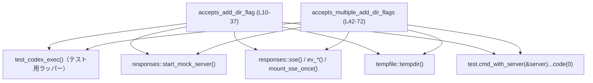
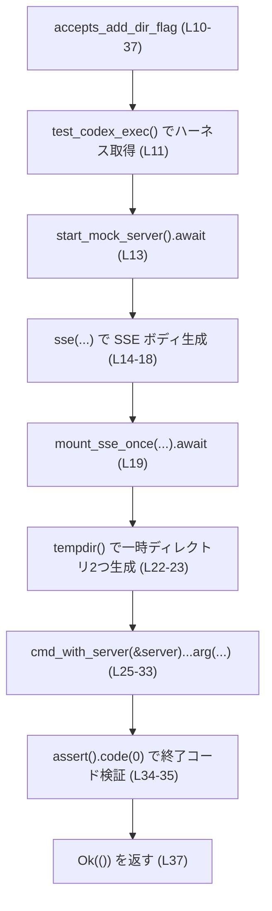
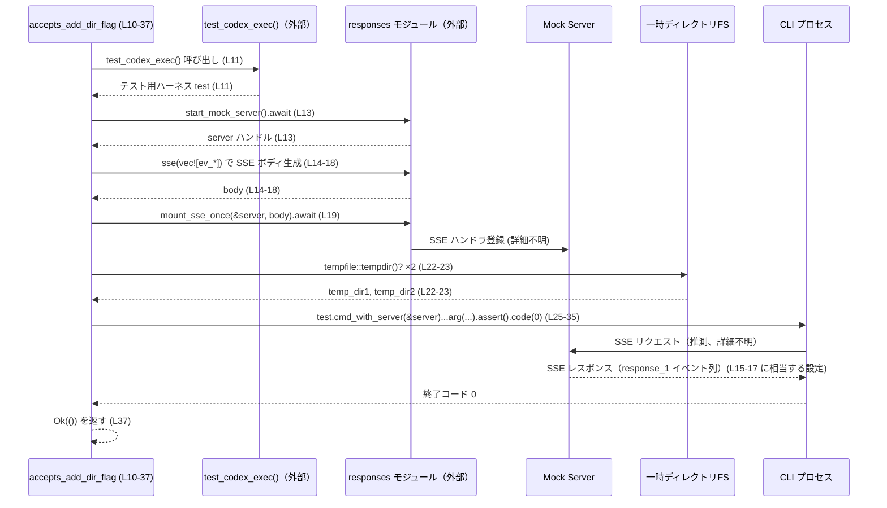

# exec/tests/suite/add_dir.rs コード解説

## 0. ざっくり一言

`exec/tests/suite/add_dir.rs` は、CLI の `workspace-write` コマンドに対して `--add-dir` フラグが 1 回／複数回指定できることを検証する非同期テストを定義したファイルです（`#[tokio::test]` による async テスト）【exec/tests/suite/add_dir.rs:L7-8,L40-42】。

---

## 1. このモジュールの役割

### 1.1 概要

- このテストモジュールは、CLI が `--add-dir` フラグを正しく受け付けるかどうかを確認するために存在します。
- モック SSE サーバと一時ディレクトリを用意し、`workspace-write` 実行時に `--add-dir` を 1 回・複数回指定した場合でもコマンドが正常終了すること（終了コード 0）を確認します【exec/tests/suite/add_dir.rs:L7-8,L21-23,L40,L53-55】。

### 1.2 アーキテクチャ内での位置づけ

このファイルに現れる主なコンポーネント間の依存関係は次の通りです。



- `test_codex_exec` は CLI 実行用のテストハーネスを構築します【exec/tests/suite/add_dir.rs:L11,L43】。
- `responses` モジュールはモック SSE サーバの起動・レスポンス生成・マウントを担当します【exec/tests/suite/add_dir.rs:L13-19,L45-51】。
- `tempfile::tempdir()` は一時ディレクトリを生成し、`--add-dir` の引数として渡されます【exec/tests/suite/add_dir.rs:L22-23,L53-55】。
- `test.cmd_with_server(&server)...` は、モックサーバに対して CLI コマンドを実行し、終了コードを検証します【exec/tests/suite/add_dir.rs:L25-35,L57-69】。

（`test_codex_exec` や `responses` の内部実装やファイルパスは、このチャンクには現れません。）

### 1.3 設計上のポイント

- **非同期テスト**  
  - 両テストとも `#[tokio::test(flavor = "multi_thread", ...)]` を利用しており、Tokio ランタイム上で非同期に実行されます【exec/tests/suite/add_dir.rs:L9,L41】。
- **モックサーバを用いた外部依存の隔離**  
  - 実際の外部サービスの代わりに、モック SSE サーバを起動し、決まったイベントシーケンスを返すようにしています【exec/tests/suite/add_dir.rs:L13-19,L45-51】。
- **一時ディレクトリによる副作用の隔離**  
  - `tempfile::tempdir()` によりテスト専用のディレクトリを作成し、`--add-dir` 引数として渡します【exec/tests/suite/add_dir.rs:L22-23,L53-55】。
- **終了コードによる検証**  
  - コマンドの成否は終了コード `0` で判断し、フラグが受け付けられたかどうかを検証しています【exec/tests/suite/add_dir.rs:L25-35,L57-69】。
- **エラー伝播**  
  - テスト関数は `anyhow::Result<()>` を返し、`?` 演算子でエラーを上位（テストランナー）に伝播させる構成です【exec/tests/suite/add_dir.rs:L10,L22-23,L37,L42,L53-55,L71】。

---

## 2. 主要な機能一覧

このファイルで定義されている主な機能（テスト）は次の 2 つです。

- `accepts_add_dir_flag`: `--add-dir` フラグを 2 回指定した場合でも CLI が正常終了することを検証します【exec/tests/suite/add_dir.rs:L7-8,L10-37】。
- `accepts_multiple_add_dir_flags`: `--add-dir` フラグを 3 回指定できることを検証し、複数のディレクトリ指定をサポートしていることを確認します【exec/tests/suite/add_dir.rs:L40-42,L53-69】。

---

## 3. 公開 API と詳細解説

このファイルはテスト用であり、外部クレート向けの公開 API（`pub` 関数・型）は定義されていません。  
以下ではテスト関数を「このファイルが提供する機能」として整理します。

### 3.1 型一覧（構造体・列挙体など）

このファイル内で新たに定義される型はありません。

| 名前 | 種別 | 役割 / 用途 | 定義位置 |
|------|------|-------------|----------|
| （なし） | - | 型定義は行われていません | - |

利用している型（`anyhow::Result`, `tempfile::TempDir` など）はすべて他モジュール由来であり、このチャンクには定義が現れません。

### 3.1.1 関数・テストインベントリ

| 名前 | 種別 | 役割 / 用途 | 定義位置 |
|------|------|-------------|----------|
| `accepts_add_dir_flag` | 非同期テスト関数 | `--add-dir` フラグが CLI により受け付けられ、コマンドが正常終了することを検証する | `exec/tests/suite/add_dir.rs:L7-8,L10-37` |
| `accepts_multiple_add_dir_flags` | 非同期テスト関数 | `--add-dir` フラグを複数回指定できることを検証する | `exec/tests/suite/add_dir.rs:L40-42,L53-72` |

### 3.2 関数詳細

#### `accepts_add_dir_flag() -> anyhow::Result<()>`

**概要**

- `workspace-write` サブコマンドに対して `--add-dir` を 2 回指定した場合でも、CLI が終了コード 0 で正常終了することを検証する非同期テストです【exec/tests/suite/add_dir.rs:L7-8,L21-23,L25-35】。

**属性・実行環境**

- `#[tokio::test(flavor = "multi_thread", worker_threads = 1)]` により、Tokio のマルチスレッドランタイム（ワーカー 1 スレッド）上で実行されます【exec/tests/suite/add_dir.rs:L9】。

**引数**

- なし（テストランナーから直接呼び出されます）。

**戻り値**

- `anyhow::Result<()>`【exec/tests/suite/add_dir.rs:L10】  
  - 成功時: `Ok(())` を返します【exec/tests/suite/add_dir.rs:L37】。  
  - 失敗時: `tempdir` の作成やモックサーバ登録などでエラーが発生すると `Err(anyhow::Error)` を返し、テストは失敗します【exec/tests/suite/add_dir.rs:L22-23】。

**内部処理の流れ（アルゴリズム）**

1. テスト用 CLI ハーネスの準備  
   - `let test = test_codex_exec();` で CLI 実行をラップするオブジェクトを取得します【exec/tests/suite/add_dir.rs:L11】。

2. モック SSE サーバの起動とレスポンス準備  
   - `responses::start_mock_server().await` で非同期にモックサーバを起動します【exec/tests/suite/add_dir.rs:L13】。
   - `responses::sse(vec![ ... ])` で SSE レスポンスボディを構築します【exec/tests/suite/add_dir.rs:L14-18】。
     - `ev_response_created`, `ev_assistant_message`, `ev_completed` イベントがこの順で送信されるように設定されています【exec/tests/suite/add_dir.rs:L15-17】。
   - `responses::mount_sse_once(&server, body).await` により、用意した SSE ボディを 1 回だけ返すようサーバに登録します【exec/tests/suite/add_dir.rs:L19】。

3. 一時ディレクトリの作成  
   - コメントで目的を明示した上で【exec/tests/suite/add_dir.rs:L21】、`tempfile::tempdir()?` を 2 回呼び、`temp_dir1`, `temp_dir2` を生成します【exec/tests/suite/add_dir.rs:L22-23】。
   - `?` により一時ディレクトリ作成失敗時は即座に `Err` を返し、テストを失敗させます【exec/tests/suite/add_dir.rs:L22-23】。

4. CLI コマンドの実行と引数設定  
   - `test.cmd_with_server(&server)` でモックサーバと紐づくコマンド実行ハンドルを取得します【exec/tests/suite/add_dir.rs:L25】。
   - その後メソッドチェーンで、以下の引数を順に追加します【exec/tests/suite/add_dir.rs:L25-33】。
     - `--skip-git-repo-check`
     - `--sandbox`
     - サブコマンド `workspace-write`
     - `--add-dir <temp_dir1>`
     - `--add-dir <temp_dir2>`
     - プロンプトと思われる文字列 `"test with additional directories"`
   - `.assert().code(0)` により、コマンドの終了コードが 0 であることを検証します【exec/tests/suite/add_dir.rs:L34-35】。

5. 正常終了  
   - すべて成功した場合、`Ok(())` を返します【exec/tests/suite/add_dir.rs:L37】。

**Mermaid フローチャート（処理の流れ）**



**Examples（使用例）**

この関数はテストランナーから自動的に呼び出される想定であり、通常コードから直接呼び出すことはありません。  
テストを個別に実行する場合のコマンド例です。

```bash
# このテストだけを実行する例
cargo test accepts_add_dir_flag --test add_dir -- --nocapture
```

**Errors / Panics**

- `tempfile::tempdir()?`  
  - 一時ディレクトリの作成に失敗した場合、`std::io::Error` 由来のエラーが `anyhow::Error` に包まれ、`Err` として返されます【exec/tests/suite/add_dir.rs:L22-23】。
- `responses::start_mock_server().await` / `mount_sse_once(...).await`  
  - これらが `Result` を返しているか・どのようなエラーを返すかは、このチャンクには現れません。`?` が使われていないため、少なくともこのテスト内ではこれらからのエラー伝播は直接行っていません【exec/tests/suite/add_dir.rs:L13,L19】。
- `.assert().code(0)`  
  - 終了コードが 0 以外の場合の挙動（パニックか、`Result` かなど）は `cmd_with_server` が返す型の定義に依存し、このチャンクだけからは断定できません【exec/tests/suite/add_dir.rs:L25-35】。

**Edge cases（エッジケース）**

- 一時ディレクトリ生成失敗  
  - `tempdir()` が失敗すると `?` によりテストは即時失敗します【exec/tests/suite/add_dir.rs:L22-23】。
- CLI が `--add-dir` を受け付けない場合  
  - コマンドのパースエラーや実行エラーにより終了コードが 0 でない場合、`.code(0)` でテストが失敗します【exec/tests/suite/add_dir.rs:L34-35】。
- SSE が予期した形で返らない場合  
  - `mount_sse_once` がどのようなチェックを行うかはこのチャンクには現れませんが、少なくともテスト側では SSE 内容を直接検証していません【exec/tests/suite/add_dir.rs:L19】。

**使用上の注意点**

- テスト関数であるため、通常のアプリケーションコードから呼び出すことは想定されていません。
- `worker_threads = 1` のため、このテスト単体では Tokio のマルチスレッドランタイムを 1 スレッドで動作させています【exec/tests/suite/add_dir.rs:L9】。
- `--add-dir` に渡すパスとして `tempfile::tempdir()` で生成したディレクトリを使用しており、テスト終了時に自動削除されるため、永続的なファイル・ディレクトリは作成しません【exec/tests/suite/add_dir.rs:L22-23】。

---

#### `accepts_multiple_add_dir_flags() -> anyhow::Result<()>`

**概要**

- `workspace-write` サブコマンドに対して `--add-dir` を 3 回指定できることを検証する非同期テストです【exec/tests/suite/add_dir.rs:L40-42,L53-69】。

**属性・実行環境**

- `#[tokio::test(flavor = "multi_thread", worker_threads = 2)]` により、Tokio マルチスレッドランタイム（ワーカー 2 スレッド）上で実行されます【exec/tests/suite/add_dir.rs:L41】。

**引数**

- なし。

**戻り値**

- `anyhow::Result<()>`【exec/tests/suite/add_dir.rs:L42】  
  - 成功時: `Ok(())`【exec/tests/suite/add_dir.rs:L71】。  
  - 失敗時: 一時ディレクトリ作成等のエラーが `Err(anyhow::Error)` として返され、テストが失敗します【exec/tests/suite/add_dir.rs:L53-55】。

**内部処理の流れ（アルゴリズム）**

1. テスト用 CLI ハーネスの準備  
   - `let test = test_codex_exec();`【exec/tests/suite/add_dir.rs:L43】。

2. モック SSE サーバの起動とレスポンス準備  
   - `responses::start_mock_server().await`【exec/tests/suite/add_dir.rs:L45】。
   - `responses::sse(vec![ ... ])` で SSE ボディを構築します【exec/tests/suite/add_dir.rs:L46-50】。
     - メッセージは `"Multiple directories accepted"` に変わっています【exec/tests/suite/add_dir.rs:L48】。
   - `responses::mount_sse_once(&server, body).await`【exec/tests/suite/add_dir.rs:L51】。

3. 一時ディレクトリの作成  
   - `tempfile::tempdir()?` を 3 回呼び、`temp_dir1`, `temp_dir2`, `temp_dir3` を生成します【exec/tests/suite/add_dir.rs:L53-55】。

4. CLI コマンドの実行と引数設定  
   - `test.cmd_with_server(&server)` でコマンド実行ハンドルを取得【exec/tests/suite/add_dir.rs:L57】。
   - 以下の引数を順に追加します【exec/tests/suite/add_dir.rs:L57-67】。
     - `--skip-git-repo-check`
     - `--sandbox`
     - `workspace-write`
     - `--add-dir <temp_dir1>`
     - `--add-dir <temp_dir2>`
     - `--add-dir <temp_dir3>`
     - `"test with three directories"`
   - `.assert().code(0)` で終了コード 0 を検証【exec/tests/suite/add_dir.rs:L68-69】。

5. 正常終了  
   - 成功時は `Ok(())` を返します【exec/tests/suite/add_dir.rs:L71】。

**Examples（使用例）**

このテストを単独で実行する例です。

```bash
# 複数 --add-dir のテストだけを実行
cargo test accepts_multiple_add_dir_flags --test add_dir -- --nocapture
```

**Errors / Panics**

- エラー条件は `accepts_add_dir_flag` と同様で、一時ディレクトリ生成やモックサーバ操作のエラー時に `Err` が返されます【exec/tests/suite/add_dir.rs:L53-55】。
- `.assert().code(0)` の詳細動作は、このチャンクには現れません【exec/tests/suite/add_dir.rs:L57-69】。

**Edge cases（エッジケース）**

- 3 個の `--add-dir` のいずれかが CLI に受け付けられない場合、終了コードが 0 でないはずであり、その場合テストは失敗します【exec/tests/suite/add_dir.rs:L57-69】。
- ディレクトリパスが無効になっているケース（例えば事前削除）は、このテストでは作成直後に渡しているため発生しません【exec/tests/suite/add_dir.rs:L53-55】。

**使用上の注意点**

- `worker_threads = 2` で実行されるため、このテスト内部の非同期処理は最大 2 スレッド上で並行実行されうる設計です【exec/tests/suite/add_dir.rs:L41】。
- モックサーバのイベントシーケンスは `"Multiple directories accepted"` というメッセージを通じて、このテスト専用のシナリオであることが識別できるようになっています【exec/tests/suite/add_dir.rs:L48】。

---

### 3.3 その他の関数

- このファイル内に、補助的な関数やラッパー関数の定義はありません。

---

## 4. データフロー

ここでは代表的なシナリオとして、`accepts_add_dir_flag` の処理中にデータがどのように流れるかを示します。

### 4.1 シーケンス図



※ CLI プロセスと SSE のやり取りの細かい内容は、このチャンクには現れないため「詳細不明」としています。

---

## 5. 使い方（How to Use）

このファイルはテスト専用ですが、同様のパターンで新しいテストを追加する際の参考になります。

### 5.1 基本的な使用方法（テスト追加の基本パターン）

以下は、別のフラグ `--add-file` をテストする際に、このファイルのパターンを流用する例です。

```rust
use core_test_support::responses;                           // モックサーバ関連をインポート
use core_test_support::test_codex_exec::test_codex_exec;   // CLI テストハーネスを取得する関数

#[tokio::test(flavor = "multi_thread", worker_threads = 1)] // Tokio 非同期テスト
async fn accepts_add_file_flag() -> anyhow::Result<()> {    // anyhow::Result でエラーを外に伝播
    let test = test_codex_exec();                           // テストハーネスの構築

    let server = responses::start_mock_server().await;      // モック SSE サーバ起動
    let body = responses::sse(vec![
        responses::ev_response_created("response_1"),       // レスポンス作成イベント
        responses::ev_assistant_message(
            "response_1",
            "File flag accepted",
        ),                                                  // メッセージイベント
        responses::ev_completed("response_1"),              // 完了イベント
    ]);
    responses::mount_sse_once(&server, body).await;         // SSE ハンドラを 1 回分登録

    let temp_file = tempfile::NamedTempFile::new()?;        // 一時ファイル作成（tempfile クレート）

    test.cmd_with_server(&server)                           // モックサーバ付きで CLI を起動
        .arg("--skip-git-repo-check")                       // 共通フラグ
        .arg("--sandbox")
        .arg("workspace-write")                             // サブコマンド
        .arg("--add-file")                                  // テスト対象フラグ
        .arg(temp_file.path())                              // 一時ファイルパスを渡す
        .arg("test with file")                              // プロンプト等
        .assert()                                           // 結果検証オブジェクトに変換
        .code(0);                                           // 終了コード 0 を期待

    Ok(())                                                  // テスト成功
}
```

この例は、`accepts_add_dir_flag` / `accepts_multiple_add_dir_flags` と同じ構造で新しいフラグのテストを作る際のひな型になります。

### 5.2 よくある使用パターン

このファイルでのパターンは概ね次の通りです。

1. **モックサーバ＋一時リソースの準備 → CLI 実行 → 終了コード検証**  
   - 外部サービス相当: `responses::start_mock_server()`＋`mount_sse_once`【exec/tests/suite/add_dir.rs:L13-19,L45-51】。
   - 一時リソース: `tempfile::tempdir()`【exec/tests/suite/add_dir.rs:L22-23,L53-55】。
   - 実行と検証: `cmd_with_server(&server)...assert().code(0)`【exec/tests/suite/add_dir.rs:L25-35,L57-69】。

2. **テストごとに SSE メッセージ内容を変えてシナリオを識別**  
   - `"Task completed"` と `"Multiple directories accepted"` でテストケースを区別しています【exec/tests/suite/add_dir.rs:L16,L48】。

### 5.3 よくある間違い

このファイルのパターンから推測される誤用例です。

```rust
// 誤り例: モックサーバを起動せずに CLI を実行してしまう
let test = test_codex_exec();
// let server = responses::start_mock_server().await;      // 未起動
test.cmd(/* ... */)                                       // 実際のエンドポイントにアクセスしてしまう可能性
    .assert()
    .code(0);

// 正しい例: 必ずモックサーバを起動し、コマンドと関連付ける
let test = test_codex_exec();
let server = responses::start_mock_server().await;
let body = responses::sse(/* ... */);
responses::mount_sse_once(&server, body).await;

test.cmd_with_server(&server)                             // モックサーバを紐付けて実行
    .arg(/* ... */)
    .assert()
    .code(0);
```

### 5.4 使用上の注意点（まとめ）

- **モックサーバ起動の順序**  
  - SSE ボディの構築と `mount_sse_once` は、CLI 実行前に完了している必要があります【exec/tests/suite/add_dir.rs:L13-19,L25-35】。
- **一時ディレクトリのライフタイム**  
  - `tempfile::tempdir()` で生成したハンドルがスコープを抜けるとディレクトリは削除されます。テスト中に必要な間は変数として保持しています【exec/tests/suite/add_dir.rs:L22-23,L53-55】。
- **並行実行**  
  - `worker_threads` の値により、非同期処理が複数スレッドで実行される可能性があります。共有状態を持つ場合はスレッド安全性に注意が必要ですが、このファイル内では共有ミュータブル状態は定義されていません【exec/tests/suite/add_dir.rs:L9,L41】。
- **検証内容の範囲**  
  - 現状のテストは「終了コードが 0 であること」を主に検証しており、`--add-dir` が内部でどのように解釈・利用されているかまでは検証していません【exec/tests/suite/add_dir.rs:L25-35,L57-69】。

---

## 6. 変更の仕方（How to Modify）

### 6.1 新しい機能（新しいフラグ）を追加する場合

1. **既存テストのコピー**  
   - `accepts_add_dir_flag` もしくは `accepts_multiple_add_dir_flags` をコピーし、新しい関数名とテストコメントに変更します【exec/tests/suite/add_dir.rs:L7-8,L40-42】。
2. **SSE メッセージの変更**  
   - シナリオ識別のため、`responses::ev_assistant_message` に渡すメッセージ文言をテスト内容に合わせて変更します【exec/tests/suite/add_dir.rs:L16,L48】。
3. **CLI 引数の変更**  
   - `.arg("--add-dir")` 部分をテスト対象の新フラグ（例: `--add-file`）に置き換えます【exec/tests/suite/add_dir.rs:L29,L31,L61,L63,L65】。
4. **必要に応じて一時リソースを変更**  
   - ディレクトリではなくファイルを渡すなど、フラグ仕様に応じて `tempfile` 呼び出しを調整します【exec/tests/suite/add_dir.rs:L22-23,L53-55】。

### 6.2 既存の機能（`--add-dir`）の仕様変更に対応する場合

- **影響範囲の確認**
  - `--add-dir` を使用しているテストはこのファイルの 2 関数です【exec/tests/suite/add_dir.rs:L25-33,L57-67】。
- **前提条件・契約の確認**
  - 現在の契約は「`--add-dir` が複数回指定可能であり、正常終了すること」にあります【exec/tests/suite/add_dir.rs:L7-8,L40】。
  - 仕様変更により、複数指定が不可になる場合は、テスト内容（期待する終了コードやエラーメッセージ）を変更する必要があります。
- **テストの更新**
  - 引数の数や順序が変わる場合は `.arg(...)` チェーンを修正します【exec/tests/suite/add_dir.rs:L25-33,L57-67】。
- **追加検証**
  - 新たに期待されるエラーメッセージやログなどを検証したい場合は、`assert` 周りの API を拡張して利用する必要がありますが、その方法は `cmd_with_server` が返す型の機能に依存し、このチャンクからは分かりません【exec/tests/suite/add_dir.rs:L25-35,L57-69】。

---

## 7. 関連ファイル

このテストから参照されているモジュール・関数と、その関係をまとめます。モジュールパスは分かりますが、実際のファイルパスはこのチャンクには現れません。

| パス / モジュール | 役割 / 関係 |
|-------------------|------------|
| `core_test_support::test_codex_exec::test_codex_exec` | CLI 用テストハーネスを構築する関数。両テストで共通して利用され、CLI コマンド実行の起点となります【exec/tests/suite/add_dir.rs:L11,L43】。 |
| `core_test_support::responses` | モック SSE サーバの起動 (`start_mock_server`)、SSE レスポンスボディ生成 (`sse`, `ev_response_created`, `ev_assistant_message`, `ev_completed`)、サーバへのハンドラ登録 (`mount_sse_once`) を提供します【exec/tests/suite/add_dir.rs:L4,L13-19,L45-51】。 |
| `tempfile::tempdir` | 一時ディレクトリを作成する関数。`--add-dir` に渡すディレクトリパスを生成するために使用されます【exec/tests/suite/add_dir.rs:L22-23,L53-55】。 |
| `tokio::test` マクロ | 非同期テストを実行するためのマクロ。`flavor = "multi_thread"` と `worker_threads` の設定により、テスト毎のランタイム構成を指定しています【exec/tests/suite/add_dir.rs:L9,L41】。 |
| `anyhow::Result` | テスト関数の戻り値に利用される汎用エラー型。`?` 演算子によりエラーを簡潔に伝播させるために利用されています【exec/tests/suite/add_dir.rs:L10,L22-23,L37,L42,L53-55,L71】。 |

---

## Bugs / Security / Contracts / Edge Cases の補足

- **潜在的なバグ・制約**
  - 現在のテストは終了コードのみを検証しており、`--add-dir` が実際に CLI 内部でどのように解釈・利用されているか（例: ディレクトリが正しくスキャンされるか）まではカバーしていません【exec/tests/suite/add_dir.rs:L25-35,L57-69】。
- **セキュリティ観点**
  - 一時ディレクトリは `tempfile` により安全に生成され、テスト専用のサンドボックス環境（`--sandbox` フラグ）で使用されています【exec/tests/suite/add_dir.rs:L22-23,L27,L53-55,L59】。
  - テストはモックサーバに対してのみアクセスする構造のため、外部サービスへの誤アクセスリスクは抑えられています【exec/tests/suite/add_dir.rs:L13-19,L45-51】。
- **契約（Contracts）**
  - `--add-dir` は少なくとも 3 回までは繰り返し指定可能である、という挙動が暗黙の前提（契約）としてテストされています【exec/tests/suite/add_dir.rs:L57-67】。
- **エッジケース**
  - 空の `--add-dir` や存在しないパスを渡した場合の挙動は、このテストでは扱っていません（`tempdir()` は有効な一時ディレクトリだけを生成するため）【exec/tests/suite/add_dir.rs:L22-23,L53-55】。

この範囲を超える詳細（モックサーバ内部の動き、CLI の内部処理など）は、このファイルのチャンクには現れないため不明です。
