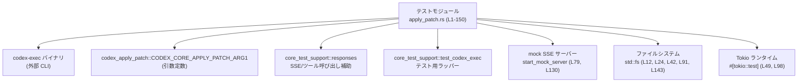
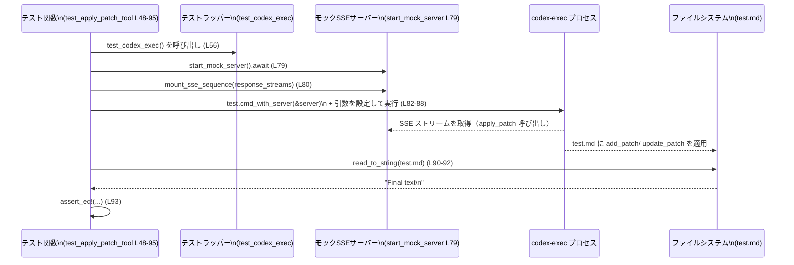

# exec/tests/suite/apply_patch.rs コード解説

---

## 0. ざっくり一言

`codex-exec` CLI が「apply_patch」パッチ適用機能を正しく使えるかどうかを、スタンドアロン実行と SSE（Server-Sent Events）ベースのツール呼び出し経由の 2 パターンで検証する統合テスト群です（`exec/tests/suite/apply_patch.rs:L16-150`）。

---

## 1. このモジュールの役割

### 1.1 概要

- このテストモジュールは、`codex-exec` という CLI ツールが **パッチ形式のテキスト入力を受けてファイルを作成・更新できること** を検証します。
- 具体的には、次の 3 点を確認します（いずれも `exec/tests/suite/apply_patch.rs` 内で実装されています）:
  - `codex-exec` を直接起動し、`apply_patch` 相当の引数を渡したときに、テキストファイルが期待どおりに書き換えられること（`L20-45`）。
  - モック SSE サーバーからの「ツール呼び出し」イベントで `apply_patch` が呼ばれ、最終的に `test.md` が期待どおりの内容になること（`L48-95`）。
  - 同様に、Python ファイル `app.py` への「自由形式（freeform）」パッチ適用が期待どおりになること（`L97-150`）。

### 1.2 アーキテクチャ内での位置づけ

このモジュールは「テストコード」であり、プロダクションロジックを直接提供するのではなく、外部コンポーネントを組み合わせて挙動を検証しています。

主な依存関係は次のとおりです（`L3-14, L48-52, L97-101`）:

- `codex-exec` バイナリ（`codex_utils_cargo_bin::cargo_bin("codex-exec")` 経由で起動、`L26`）
- `codex_apply_patch::CODEX_CORE_APPLY_PATCH_ARG1`（`apply_patch` 実行モードを指定する引数、`L5, L27`）
- `core_test_support::responses` 群（SSE モックサーバーと apply_patch ツールイベントの生成、`L6-11, L68-79, L119-131`）
- `core_test_support::skip_if_no_network!`（ネットワークがない環境でテストをスキップ、`L51, L54, L100, L103`）
- `core_test_support::test_codex_exec::test_codex_exec`（`codex-exec` のテスト用ラッパー、`L52, L56, L101, L105`）
- 標準ライブラリの `std::fs`, `std::process::Command`, `tempfile::tempdir` など

依存関係の簡略図（本ファイル全体 `L1-150` を対象）:



### 1.3 設計上のポイント

コードから読み取れる設計上の特徴は次のとおりです。

- **テスト専用モジュール**  
  - すべての関数は `#[test]` または `#[tokio::test]` が付いたテスト関数であり、公開 API は定義されていません（`L19, L48-50, L97-99`）。
- **プロセス実行ベースの統合テスト**  
  - `std::process::Command` や専用ヘルパー（`test.cmd_with_server`）を用いて、実際の `codex-exec` バイナリを子プロセスとして起動し、標準出力・標準エラーと生成ファイルを検証します（`L26-40, L82-88, L133-139`）。
- **SSE を使ったツール呼び出しのモック**  
  - `sse`, `ev_apply_patch_*`, `mount_sse_sequence`, `start_mock_server` により、LLM からのツール呼び出しを模した SSE ストリームを順番に返すモックサーバーを構成しています（`L6-11, L68-80, L119-131`）。
- **エラーハンドリング方針**  
  - テスト関数は `anyhow::Result<()>` を返し、ファイル操作やテンポラリディレクトリ作成には `?` を用いてエラーを早期伝播します（`L20, L21, L24, L41-43`）。
  - 一部の確認には `unwrap_or_else(... panic!(...))` を使用しており、テスト失敗時の情報量を増やしています（`L91-92, L143-144`）。
- **非同期・並行実行**  
  - 2 つのテストは `#[tokio::test(flavor = "multi_thread", worker_threads = 4)]` でマルチスレッドランタイム上で動作しますが、テスト関数内には明示的な並列タスク生成はありません（`L49, L98`）。

---

## 2. 主要な機能一覧

本ファイルはすべてテスト用関数で構成されています。

- `test_standalone_exec_cli_can_use_apply_patch`:  
  `codex-exec` CLI が `apply_patch` 引数を直接受け取り、ローカルファイル `source.txt` をパッチに従って更新できることを検証します（`L20-45`）。
- `test_apply_patch_tool`:  
  SSE モックサーバー経由で `apply_patch` ツールが 2 回呼ばれ、`test.md` が最終的に `"Final text\n"` になることを非同期テストで検証します（`L48-95`）。
- `test_apply_patch_freeform_tool`:  
  自由形式のパッチで Python ファイル `app.py` を追加・更新し、最終内容がフィクスチャファイルと一致することを検証します（`L97-150`）。

---

## 3. 公開 API と詳細解説

### 3.1 コンポーネント（関数）インベントリー

本ファイル内で定義される関数はすべてテスト関数です。

| 名前 | 種別 | 非同期 | 役割 / 用途 | 定義位置（根拠） |
|------|------|--------|-------------|-------------------|
| `test_standalone_exec_cli_can_use_apply_patch` | テスト関数（同期） | いいえ | `codex-exec` を直接起動し、`apply_patch` CLI と同等の動作ができるかを確認する | `exec/tests/suite/apply_patch.rs:L20-45` |
| `test_apply_patch_tool` | テスト関数（Tokio 非同期） | はい | SSE 経由のカスタムツール／function call で `apply_patch` を呼び出し、`test.md` の最終内容を検証する | `exec/tests/suite/apply_patch.rs:L48-95` |
| `test_apply_patch_freeform_tool` | テスト関数（Tokio 非同期） | はい | 自由形式パッチで `app.py` を追加・更新し、フィクスチャと一致することを検証する | `exec/tests/suite/apply_patch.rs:L97-150` |

このファイル内で新たに定義される構造体や列挙体はありません。

---

### 3.2 関数詳細

#### `test_standalone_exec_cli_can_use_apply_patch() -> anyhow::Result<()>`

**概要**

- 一時ディレクトリ内に `source.txt` を作成し、`codex-exec` CLI に `CODEX_CORE_APPLY_PATCH_ARG1` とパッチ文字列を引数として渡します（`L21-24, L26-35`）。
- CLI の実行結果（終了コード・標準出力・標準エラー）と、更新された `source.txt` の内容を検証します（`L37-44`）。

**引数**

- テスト関数であり、外部からの引数はありません。

**戻り値**

- `anyhow::Result<()>`（`L20`）  
  - I/O エラーなどが起きた場合に `Err` を返し、それ以外は `Ok(())` を返します。

**内部処理の流れ**

1. テンポラリディレクトリを作成し、その配下に `source.txt` へのパスを組み立てます（`tempdir()`, `tmp.path().join(...)`, `L21-23`）。
2. `source.txt` に `"original content\n"` を書き込みます（`fs::write`, `L24`）。
3. `codex_utils_cargo_bin::cargo_bin("codex-exec")?` を使って `codex-exec` バイナリのパスを取得し、`Command::new(...)` で子プロセス起動準備を行います（`L26`）。  
   - `codex_utils_cargo_bin::cargo_bin` の具体的な動作はこのチャンクには定義がないため不明です。
4. 最初の引数として `CODEX_CORE_APPLY_PATCH_ARG1` を渡し（`L27`）、2 番目の引数として apply_patch 形式のパッチ文字列を渡します（`L28-35`）。
5. `current_dir(tmp.path())` で作業ディレクトリをテンポラリディレクトリに設定し、`assert().success()` で正常終了を確認します（`L36-38`）。
6. 標準出力が `"Success. Updated the following files:\nM source.txt\n"`、標準エラーが空であることを検証します（`L39-40`）。
7. 実際に `source.txt` を読み取り、その内容が `"modified by apply_patch\n"` になっていることを `assert_eq!` で確認します（`L41-44`）。

**Examples（使用例）**

このテストが検証している CLI 呼び出しパターンを、テスト外で利用するイメージコードです。

```rust
use std::process::Command;
use codex_apply_patch::CODEX_CORE_APPLY_PATCH_ARG1;

fn run_apply_patch_example() {
    let patch = r#"*** Begin Patch
*** Update File: source.txt
@@
-original content
+modified by apply_patch
*** End Patch"#;

    // 実際には "codex-exec" が PATH にある前提
    let output = Command::new("codex-exec")          // 実行する CLI
        .arg(CODEX_CORE_APPLY_PATCH_ARG1)           // apply_patch モード指定
        .arg(patch)                                 // パッチ内容
        .output()                                   // 子プロセスを実行し、結果を取得
        .expect("failed to run codex-exec");

    assert!(output.status.success());
}
```

※ 上記はテストファイルから構造を抽出した例であり、`codex_utils_cargo_bin` は使用していません。

**Errors / Panics**

- `tempdir()?`, `fs::write(&absolute_path, ...)` で I/O エラーが発生した場合、`?` により `anyhow::Error` として呼び出し元（テストランナー）に伝播します（`L21, L24`）。
- `fs::read_to_string(absolute_path)?` での読み込み失敗も同様に `Err` となります（`L41-43`）。
- `Command::new(...).assert().success()` は、プロセスが非ゼロ終了コードで終了した場合に panic します（assert_cmd の一般的な仕様に基づく説明。`L37-38`）。

**Edge cases（エッジケース）**

- `CODEX_CORE_APPLY_PATCH_ARG1` の値が誤っている場合  
  → `codex-exec` が apply_patch モードに入れず、`.success()` アサーションが失敗する可能性があります。この定数の中身は本チャンクには出現しません（`L5`）。
- パッチ文字列中のファイル名 (`source.txt`) と実際のファイル名が一致しない場合  
  → CLI 側の実装次第ですが、パッチ適用に失敗し、アサーションが失敗する可能性があります（テストでは一致している、`L22-24, L30`）。

**使用上の注意点**

- テストは CLI の標準出力を **完全一致** で比較しているため（`L39`）、CLI 側のメッセージフォーマット変更はテスト失敗につながります。
- テンポラリディレクトリを `current_dir` に設定しているため、CLI はカレントディレクトリ相対でファイルを解決する前提になっています（`L36`）。

---

#### `test_apply_patch_tool() -> anyhow::Result<()>`

**概要**

- モック SSE サーバーを立て、`ev_apply_patch_custom_tool_call` と `ev_apply_patch_function_call` で 2 回のパッチ適用イベントをシミュレートします（`L68-77`）。
- `codex-exec` をテストラッパー経由で起動し（`L56-57, L82-88`）、最終的に `test.md` の内容が `"Final text\n"` であることを確認します（`L90-93`）。

**引数**

- 外部からの引数はありません。利用している外部コンポーネントはすべてテスト内で生成されています。

**戻り値**

- `anyhow::Result<()>`（`L50`）  
  - 本関数内で `?` を使っている箇所はなく、`Ok(())` で終了しています（`L94`）。

**内部処理の流れ**

1. `skip_if_no_network!(Ok(()));` により、ネットワーク環境が整っていない場合にテストをスキップします（マクロの具体的な挙動はこのチャンクにはありません、`L51, L54`）。
2. `test_codex_exec()` でテスト用の `codex-exec` 実行環境（カレントディレクトリなど）をラップしたオブジェクトを取得します（`L52, L56`）。
3. `test.cwd_path().to_path_buf()` により、テストの作業ディレクトリパスを取得します（`L57`）。
4. `add_patch` と `update_patch` の 2 種類のパッチ文字列を定義します（`L58-67`）。
5. `response_streams` に 3 つの SSE ストリームを構築します（`L68-78`）。  
   - 1つ目: `ev_apply_patch_custom_tool_call("request_0", add_patch)` → `ev_completed("request_0")`  
   - 2つ目: `ev_apply_patch_function_call("request_1", update_patch)` → `ev_completed("request_1")`  
   - 3つ目: `ev_completed("request_2")`
6. `start_mock_server().await` でモック SSE サーバーを起動し（`L79`）、`mount_sse_sequence(&server, response_streams).await` で前述の SSE シーケンスをサーバーに登録します（`L80`）。
7. `test.cmd_with_server(&server)` で `codex-exec` の子プロセスコマンドを生成し、以下の引数を与えて実行します（`L82-88`）。
   - `--skip-git-repo-check`
   - `-s`
   - `danger-full-access`
   - `foo`
8. 実行結果が成功ステータスであることを確認します（`.assert().success()`, `L87-88`）。
9. 作業ディレクトリ配下の `test.md` を読み出し（`L90-92`）、内容が `"Final text\n"` であることを検証します（`L93`）。

**Mermaid シーケンス図（処理フロー）**

テスト関数 `test_apply_patch_tool (L48-95)` のデータフロー:



**Errors / Panics**

- `std::fs::read_to_string(&final_path)` でファイル読み込みに失敗した場合、`unwrap_or_else` 内で `panic!` します（`L91-92`）。
- `.assert().success()` により、`codex-exec` プロセスが失敗した場合にも panic します（`L87-88`）。
- `start_mock_server()` や `mount_sse_sequence()` がどのようなエラー型を返しうるかは、このチャンクには現れていないため不明です。テスト内では `?` を使用していないため、少なくとも `Result` を返していないか、すでに内部で panic している可能性があります（推測であり、確定はできません）。

**Edge cases（エッジケース）**

- ネットワークが利用できない環境  
  → `skip_if_no_network!` によりテストがスキップされる想定です（`L54`）。  
  詳細な判定条件はこのチャンクには現れません。
- SSE ストリームの順序が変わった場合  
  → `mount_sse_sequence` の挙動次第ですが、テストが期待する `add_patch` → `update_patch` → 完了 の順序が崩れると、`test.md` の内容が変わる可能性があります（`L68-80`）。

**使用上の注意点**

- `#[tokio::test(flavor = "multi_thread", worker_threads = 4)]` によってマルチスレッドランタイム上で実行されますが、このテスト自体は単一の async 関数内で直列に await しており、明示的な並行タスクはありません（`L49-50`）。
- ファイルシステムへの書き込み・読み出しが `codex-exec` プロセスとテストコードの両方から行われるため、作業ディレクトリの扱いには注意が必要です（`tmp_path`, `L57, L90`）。

---

#### `test_apply_patch_freeform_tool() -> anyhow::Result<()>`

**概要**

- `test_apply_patch_tool` と同様にモック SSE サーバーを使用しますが、対象は Python ファイル `app.py` です（`L105-112`）。
- 自由形式のパッチで `app.py` を追加・更新し、最終内容がフィクスチャファイル `../fixtures/apply_patch_freeform_final.txt` と一致することを確認します（`L141-147`）。

**引数**

- なし。

**戻り値**

- `anyhow::Result<()>`（`L99`）  
  - 関数内では `?` は使用されておらず、`Ok(())` で終了します（`L149`）。

**内部処理の流れ**

1. `skip_if_no_network!(Ok(()));` でネットワーク条件をチェックし、必要に応じてテストをスキップします（`L100-103`）。
2. `test_codex_exec()` からテスト用ラッパーを取得します（`L101, L105`）。
3. `freeform_add_patch` と `freeform_update_patch` の 2 種類のパッチ文字列を構築します（`L106-118`）。
   - `app.py` を新規作成するパッチ（`Add File`、`L106-111`）。
   - `method` 関数の戻り値を `False` から `True` に変更するパッチ（`Update File`, `L112-118`）。
4. `response_streams` に 3 つの SSE ストリームを構築し、いずれも `ev_apply_patch_custom_tool_call` を使用します（`L119-128`）。
5. `start_mock_server().await` と `mount_sse_sequence(&server, response_streams).await` でモック SSE サーバーを設定します（`L130-131`）。
6. `test.cmd_with_server(&server)` で `codex-exec` を起動し、前のテストと同じ引数で実行します（`L133-139`）。
7. 作業ディレクトリの `app.py` を読み出し（`L142-144`）、`include_str!("../fixtures/apply_patch_freeform_final.txt")` との一致を検証します（`L145-147`）。

**Errors / Panics**

- `std::fs::read_to_string(&final_path)` の失敗は `unwrap_or_else(... panic! ...)` により panic につながります（`L143-144`）。
- `include_str!` で指定されたパスが存在しない場合、コンパイル時エラーになります（Rust の `include_str!` マクロの仕様に基づく）。
- `.assert().success()` により `codex-exec` の失敗は panic となります（`L138-139`）。

**Edge cases（エッジケース）**

- フィクスチャファイル `../fixtures/apply_patch_freeform_final.txt` の内容を変更すると、`assert_eq!` が失敗します（`L145-147`）。
- `freeform_update_patch` のパッチ文脈（`@@  def method():` 周辺）が実際の `app.py` の内容と合わなくなった場合、apply_patch の実装次第でパッチ適用に失敗する可能性があります（`L112-118`）。

**使用上の注意点**

- パッチ文字列とフィクスチャファイルの内容は密接に結びついているため、どちらか一方だけを変更するとテストが失敗します（`L106-118, L145-147`）。
- こちらも `#[tokio::test(flavor = "multi_thread", worker_threads = 4)]` によりマルチスレッドランタイムで実行されますが、テスト内で明示的な並行タスクは使用していません（`L98-99`）。

---

### 3.3 その他の関数・マクロ

本ファイル内には補助関数は定義されておらず、利用している主な外部マクロ／関数は次のとおりです（定義は他ファイル）。

| 名前 | 種別 | 役割（1 行） | 使用位置（根拠） |
|------|------|--------------|-------------------|
| `skip_if_no_network!` | マクロ | ネットワーク環境が不十分な場合にテストをスキップする | `exec/tests/suite/apply_patch.rs:L51, L54, L100, L103` |
| `test_codex_exec` | 関数 | `codex-exec` 実行用のテストラッパーを生成する | `exec/tests/suite/apply_patch.rs:L52, L56, L101, L105` |
| `sse` | 関数 | SSE イベント列からストリームを構築する | `exec/tests/suite/apply_patch.rs:L69, L73, L77, L120, L124, L128` |
| `ev_apply_patch_custom_tool_call` | 関数 | apply_patch ツール呼び出し SSE イベントを生成する（custom tool） | `exec/tests/suite/apply_patch.rs:L70, L121, L125` |
| `ev_apply_patch_function_call` | 関数 | apply_patch 関数呼び出し SSE イベントを生成する | `exec/tests/suite/apply_patch.rs:L74` |
| `ev_completed` | 関数 | リクエスト完了 SSE イベントを生成する | `exec/tests/suite/apply_patch.rs:L71, L75, L77, L122, L127, L128` |
| `start_mock_server` | 関数 | モック SSE サーバーを起動する | `exec/tests/suite/apply_patch.rs:L79, L130` |
| `mount_sse_sequence` | 関数 | モックサーバーに SSE シーケンスを登録する | `exec/tests/suite/apply_patch.rs:L80, L131` |

これらの実装はこのファイルには現れないため、詳細な挙動は不明です。

---

## 4. データフロー

代表的な処理シナリオとして、`test_apply_patch_tool` のフローを図示しました（`L48-95`）。

- テストコードは、テストラッパー・モックサーバー・`codex-exec` プロセス・ファイルシステムを順に呼び出し、SSE 経由の apply_patch 呼び出しを通じてファイルを書き換えます。
- データは「パッチ文字列 → SSE イベント → codex-exec プロセス → ファイルシステム → テストコードの検証」という順に流れます。

（シーケンス図は 3.2 の `test_apply_patch_tool` の項を参照してください。）

---

## 5. 使い方（How to Use）

### 5.1 基本的な使用方法（テストの実行）

このモジュールはテスト専用です。通常の利用方法は、対象クレートのルートからテストを実行することです。

```bash
# 例: ワークスペース全体のテストとして実行
cargo test --test apply_patch

# または exec クレート配下で
cargo test --tests
```

`cargo` からはテスト関数を直接呼び出す必要はなく、テストハーネスが自動的に `#[test]` / `#[tokio::test]` 関数を実行します。

### 5.2 よくある使用パターン（テスト追加の参考）

このファイルを参考に新しい apply_patch 関連テストを追加する際の典型パターンです。

1. **スタンドアロン CLI テストを追加する場合**
   - `test_standalone_exec_cli_can_use_apply_patch`（`L20-45`）を雛形として利用し、以下を変更します。
     - 初期ファイル内容（`fs::write` の第 2 引数、`L24`）
     - パッチ文字列（`L28-35`）
     - 期待する CLI 出力と最終ファイル内容（`L39-44`）

2. **SSE 経由のツールテストを追加する場合**
   - `test_apply_patch_tool` または `test_apply_patch_freeform_tool`（`L48-95, L97-150`）をベースにします。
     - 新しいパッチ文字列を定義
     - `response_streams` 内の `ev_apply_patch_*` の組み合わせを調整
     - 最後に検証するファイルパスと期待内容（またはフィクスチャ）を変更

### 5.3 よくある間違い

推測の範囲を超えない範囲で、誤りそうなポイントと正しい例を示します。

```rust
// 間違い例: テスト環境の作業ディレクトリと CLI 実行ディレクトリがずれている
let tmp = tempdir()?;
// ファイルは tmp 配下に作成
fs::write(tmp.path().join("source.txt"), "content\n")?;
// しかし current_dir を設定していない
Command::new(codex_utils_cargo_bin::cargo_bin("codex-exec")?)
    .arg(CODEX_CORE_APPLY_PATCH_ARG1)
    .arg(patch)
    .assert() // CLI 側は別ディレクトリを見てしまう可能性
    .success();

// 正しい例: test_standalone_exec_cli_can_use_apply_patch と同様に current_dir を合わせる
Command::new(codex_utils_cargo_bin::cargo_bin("codex-exec")?)
    .arg(CODEX_CORE_APPLY_PATCH_ARG1)
    .arg(patch)
    .current_dir(tmp.path())  // 作業ディレクトリを明示
    .assert()
    .success();
```

（上記の正しい例は `L26-37` を参考にしています。）

### 5.4 使用上の注意点（まとめ）

- **前提条件**
  - `codex-exec` バイナリがビルド済みであり、`test_codex_exec` や `codex_utils_cargo_bin::cargo_bin` から参照可能であること（`L26, L56, L105`）。
  - SSE 関連テストでは、ネットワーク／ループバックインターフェースが利用可能であること（`skip_if_no_network!`, `L54, L103`）。

- **エラー・パニック**
  - `assert_cmd` の `.assert().success()` により、CLI の失敗はすべて panic として扱われます（`L37-38, L87-88, L138-139`）。
  - ファイル読み込み失敗時は `unwrap_or_else(... panic! ...)` により詳細情報付きで panic します（`L91-92, L143-144`）。

- **パフォーマンス**
  - テストごとにモックサーバーと `codex-exec` プロセスが起動されます（`L79-80, L82-88, L130-131, L133-139`）。大量の類似テストを追加すると、テストスイート全体の実行時間が伸びる可能性があります。

- **セキュリティ / 安全性の観点**
  - テストでは実ファイルシステムへの書き込みを行いますが、`tempdir` やテスト専用ディレクトリに限定されており、システム全体に影響しない構成になっています（`L21, L57, L142`）。
  - `danger-full-access` というスコープ文字列が引数として使われていますが（`L85, L136`）、その影響範囲は `codex-exec` の実装側に依存し、このチャンクからは判断できません。

---

## 6. 変更の仕方（How to Modify）

### 6.1 新しい機能を追加する場合（テストケース追加）

1. **対象シナリオを決める**
   - 例: 新しい apply_patch サブモード、追加のファイル種別、エラーパスなど。
2. **既存テストからパターンを選ぶ**
   - CLI の直接呼び出し → `test_standalone_exec_cli_can_use_apply_patch`（`L20-45`）。
   - SSE ツール経由 → `test_apply_patch_tool` / `test_apply_patch_freeform_tool`（`L48-95, L97-150`）。
3. **パッチと期待結果を定義する**
   - 新規パッチ文字列を追加し、必要ならフィクスチャファイルも `../fixtures` 配下に追加します（`include_str!` のパスと整合するようにする、`L145-147`）。
4. **モック SSE シーケンスを構成する**
   - `sse`, `ev_apply_patch_*`, `ev_completed` を組み合わせて `response_streams` を構築します（`L68-78, L119-128`）。
5. **アサーションを実装する**
   - CLI の終了コード・標準出力／エラー（必要なら）・最終ファイル内容を `assert!` / `assert_eq!` で検証します。

### 6.2 既存の機能を変更する場合

- **影響範囲の確認**
  - CLI のメッセージや挙動を変更する場合、`stdout` を完全一致比較しているテスト（`L39`）が影響を受ける可能性が高いです。
  - apply_patch のパッチ適用ロジックを変更した場合、`test.md` や `app.py` の最終内容に依存するテスト（`L90-93, L141-147`）が影響を受けます。

- **契約（前提条件・返り値の意味）**
  - テストは `codex-exec` が与えられたパッチを **適用しきる** 前提で書かれており、中途半端な状態（例: 1 回目のパッチだけ適用）は想定していません。
  - SSE イベントの順序や形式が変わると、`mount_sse_sequence` を介したインタラクションが変わる可能性があります（`L68-80, L119-131`）。

- **変更時の注意**
  - フィクスチャ (`include_str!`) を変更する場合は、パッチ文字列との整合性を必ず確認する必要があります（`L106-118, L145-147`）。
  - Tokio のランタイム設定を変更する場合（`flavor`, `worker_threads`, `L49, L98`）、他の非同期テストとの相互作用やパフォーマンスへの影響を検討する必要があります。

---

## 7. 関連ファイル

このモジュールと密接に関連するコンポーネント・ファイルは次のとおりです。

| パス / モジュール | 役割 / 関係 |
|-------------------|------------|
| `core_test_support::responses` | SSE イベント (`sse`, `ev_apply_patch_*`, `ev_completed`) とモックサーバー (`start_mock_server`, `mount_sse_sequence`) を提供し、本テストから呼び出されています（`L6-11, L68-80, L119-131`）。 |
| `core_test_support::skip_if_no_network` | ネットワークが利用できない場合にテストをスキップするマクロを提供します（`L51, L54, L100, L103`）。 |
| `core_test_support::test_codex_exec` | `codex-exec` CLI を起動するためのテスト用ラッパーを提供します（`L52, L56, L101, L105`）。 |
| `codex_apply_patch` クレート | `CODEX_CORE_APPLY_PATCH_ARG1` 定数を提供し、`codex-exec` に apply_patch モードを指示するために使用されます（`L5, L27`）。 |
| `../fixtures/apply_patch_freeform_final.txt` | `test_apply_patch_freeform_tool` の期待する最終ファイル内容を定義するフィクスチャファイルです（`L145-147`）。 |
| `codex_utils_cargo_bin` | `codex-exec` バイナリのパスを取得するヘルパーと推測されますが、このチャンクには定義がないため詳細は不明です（`L26`）。 |

このファイル自体はテストモジュールであり、`codex-exec` や apply_patch の実装詳細は別クレート／モジュール側にあります。
