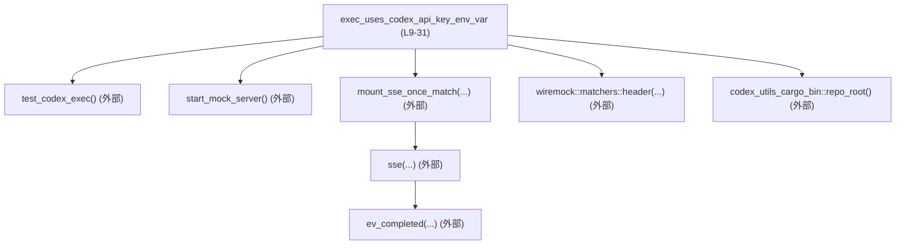
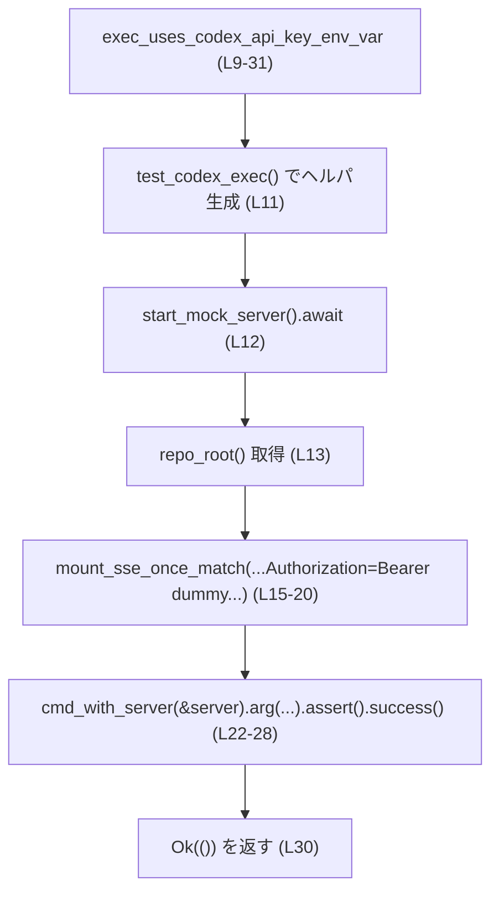
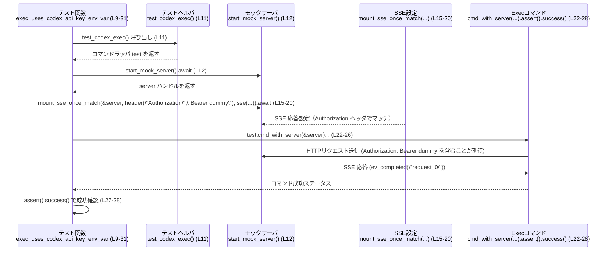

# exec/tests/suite/auth_env.rs コード解説

## 0. ざっくり一言

`exec_uses_codex_api_key_env_var` という非同期テスト関数を通じて、`exec` コマンドが Codex API 呼び出し時に特定の `Authorization` ヘッダ（`Bearer dummy`）を付与していることをモック HTTP サーバと SSE（Server-Sent Events）で検証するファイルです（`exec/tests/suite/auth_env.rs:L9-31`）。

---

## 1. このモジュールの役割

### 1.1 概要

- このファイルは、Codex の `exec` 相当のサブコマンドが、外部 Codex API にアクセスする際に正しい認証情報（Bearer トークン形式）を HTTP ヘッダとして送出しているかを検証する **統合テスト** を提供します（`exec/tests/suite/auth_env.rs:L9-31`）。
- モックサーバ（Wiremock）に対し、`Authorization: Bearer dummy` ヘッダを持つリクエストに対してのみ SSE ストリームを返すように設定し、その条件を満たすリクエストが実際に送られるかどうかを確認します（`exec/tests/suite/auth_env.rs:L15-20`）。
- テスト名から、API キーが環境変数由来であることを意図していると推測されますが、環境変数名などはこのチャンクのコードからは直接分かりません（`exec/tests/suite/auth_env.rs:L10`）。

### 1.2 アーキテクチャ内での位置づけ

このファイルは「テストスイート」の一部として、他コンポーネントに依存しつつ、挙動のみを検証する位置づけです。

- 依存先（このファイルでは定義されていないもの）

  - `core_test_support::test_codex_exec::test_codex_exec`  
    テスト用の Codex 実行ラッパを生成するヘルパ関数（`exec/tests/suite/auth_env.rs:L11`）。
  - `core_test_support::responses::{start_mock_server, mount_sse_once_match, sse, ev_completed}`  
    Wiremock ベースのモックサーバ起動と SSE レスポンス設定用ヘルパ（`exec/tests/suite/auth_env.rs:L2-5, L12, L15-18`）。
  - `wiremock::matchers::header`  
    HTTP ヘッダを条件にマッチングする Wiremock のマッチャ（`exec/tests/suite/auth_env.rs:L7, L17`）。
  - `codex_utils_cargo_bin::repo_root`  
    テスト対象バイナリ実行時に利用するリポジトリルートパスを取得するユーティリティ（`exec/tests/suite/auth_env.rs:L13`）。

- テスト関数自身は外部から呼び出されず、Rust のテストランナー（`cargo test`）が `#[tokio::test]` 属性を介して自動的に呼び出します（`exec/tests/suite/auth_env.rs:L9-10`）。

これを簡易な依存関係図で表すと次のようになります。



### 1.3 設計上のポイント

- **非同期テスト + マルチスレッドランタイム**  
  - `#[tokio::test(flavor = "multi_thread", worker_threads = 2)]` により、Tokio のマルチスレッドランタイム上でテストを実行します（`exec/tests/suite/auth_env.rs:L9`）。
  - これにより、モックサーバとテスト対象プロセスの I/O を非同期に処理する前提が整っています。
- **エラーハンドリング**  
  - テスト関数の戻り値は `anyhow::Result<()>` であり、`?` 演算子を使った簡易なエラー伝播が可能です（`exec/tests/suite/auth_env.rs:L10, L13`）。
  - このファイル内では `codex_utils_cargo_bin::repo_root()?` にのみ `?` が使われており、ここでの失敗は即座にテスト失敗（エラー終了）につながります（`exec/tests/suite/auth_env.rs:L13`）。
- **モックサーバによるプロトコル検証**  
  - `mount_sse_once_match` と `wiremock::matchers::header` を組み合わせることで、HTTP ヘッダ（`Authorization: Bearer dummy`）を条件に SSE レスポンスを返す設定を行っています（`exec/tests/suite/auth_env.rs:L15-18`）。
- **CLI 実行の検証パターン**  
  - `test_codex_exec` から取得したオブジェクトに対して `cmd_with_server(&server)` を呼び出し、さらにコマンドライン引数をチェーンで付与して `.assert().success()` で成功をアサートする、という CLI テストの共通パターンを用いています（`exec/tests/suite/auth_env.rs:L11, L22-28`）。

---

## 2. 主要な機能一覧

このファイルが提供する主要な機能は次の 1 つです。

- `exec_uses_codex_api_key_env_var`: Codex `exec` コマンドがモック Codex API に対して、期待どおりの `Authorization` ヘッダ付きでリクエストを送信し、SSE 応答を正常に処理できることを検証する非同期テスト（`exec/tests/suite/auth_env.rs:L9-31`）。

### 2.1 コンポーネント一覧（このファイル内で定義）

| 名前 | 種別 | 位置 | 役割 / 用途 |
|------|------|------|-------------|
| `exec_uses_codex_api_key_env_var` | 非同期テスト関数 (`#[tokio::test]`) | `exec/tests/suite/auth_env.rs:L9-31` | Codex `exec` コマンドが `Authorization: Bearer dummy` ヘッダ付きのリクエストをモック Codex API に送出し、SSE 応答を受け取った上でコマンドが成功することを検証する |

※ このファイル内で新規に定義される型（構造体・列挙体など）はありません。

---

## 3. 公開 API と詳細解説

### 3.1 型一覧（構造体・列挙体など）

このファイル内で **新たに定義されている型はありません**。

- 参照している主な外部型・トレイト（定義は他モジュール）

  | 名前 | 種別 | 出典 / 備考 |
  |------|------|-------------|
  | `anyhow::Result` | 型エイリアス（`Result<T, anyhow::Error>`） | テスト関数の戻り値として利用（`exec/tests/suite/auth_env.rs:L10`） |
  | `tokio::test` | 属性マクロ | 非同期テストを宣言するためのマクロ（`exec/tests/suite/auth_env.rs:L9`） |

### 3.2 関数詳細

#### `exec_uses_codex_api_key_env_var() -> anyhow::Result<()>`

**概要**

- Codex の `exec` サブコマンドが、モックされた Codex API エンドポイントに対して `Authorization: Bearer dummy` ヘッダ付きのリクエストを送信し、SSE 応答を受信した上で正常終了することを検証する非同期テストです（`exec/tests/suite/auth_env.rs:L10-28`）。
- テストは Tokio のマルチスレッドランタイム上で並行処理可能な形で実行されます（`exec/tests/suite/auth_env.rs:L9`）。

**引数**

- このテスト関数は引数を取りません。Rust のテストランナーが自動的に呼び出します（`exec/tests/suite/auth_env.rs:L9-10`）。

**戻り値**

- 戻り値: `anyhow::Result<()>`（`exec/tests/suite/auth_env.rs:L10`）
  - `Ok(())` の場合: テストが正常に完了したことを意味します（最後の `Ok(())`、`exec/tests/suite/auth_env.rs:L30`）。
  - `Err(anyhow::Error)` の場合: セットアップ中のエラー（`repo_root` 取得失敗など）が発生したことを示し、その時点でテストは失敗扱いとなります（`exec/tests/suite/auth_env.rs:L13`）。

**内部処理の流れ（アルゴリズム）**

コードの流れを 7 ステップ程度に分解します。

1. **テストヘルパの初期化**  
   - `let test = test_codex_exec();`  
     Codex `exec` コマンドをテストするためのヘルパオブジェクトを生成します（`exec/tests/suite/auth_env.rs:L11`）。

2. **モックサーバの起動**  
   - `let server = start_mock_server().await;`  
     Wiremock ベースのモック HTTP サーバを非同期に起動し、そのハンドル（`server`）を取得します（`exec/tests/suite/auth_env.rs:L12`）。

3. **リポジトリルートパスの取得**  
   - `let repo_root = codex_utils_cargo_bin::repo_root()?;`  
     テスト対象バイナリ実行に利用するリポジトリルートのパスを取得します（`exec/tests/suite/auth_env.rs:L13`）。  
     ここでエラーが発生した場合、`?` によりテスト関数は即座に `Err` を返し終了します。

4. **SSE 応答のモック設定**  
   - `mount_sse_once_match(&server, header("Authorization", "Bearer dummy"), sse(vec![ev_completed("request_0")]), ).await;`（`exec/tests/suite/auth_env.rs:L15-20`）
     - モックサーバ `server` に対し、  
       `Authorization: Bearer dummy` ヘッダを持つリクエストにのみ適用される SSE レスポンスを 1 回分設定します。
     - SSE レスポンスの内容は `sse(vec![ev_completed("request_0")])` によって構築されたものです。

5. **テスト対象コマンドの生成と引数設定**  
   - `test.cmd_with_server(&server)` でモックサーバに紐付いたコマンドオブジェクトを取得し（`exec/tests/suite/auth_env.rs:L22`）、  
     以下の引数をチェーン形式で追加します（`exec/tests/suite/auth_env.rs:L22-26`）。
     - `--skip-git-repo-check`  
     - `-C`  
     - `&repo_root`  
     - `"echo testing codex api key"`

6. **コマンドの実行と成功アサーション**  
   - `.assert().success();` により、コマンドが成功ステータスで終了することをアサートします（`exec/tests/suite/auth_env.rs:L27-28`）。
   - 実行の詳細（プロセス生成や I/O）は `test_codex_exec` やその戻り値の型に依存しており、このチャンクからは内部実装の詳細は不明です。

7. **テスト関数の正常終了**  
   - すべての処理が例外なく完了した場合、`Ok(())` を返してテスト関数を終了します（`exec/tests/suite/auth_env.rs:L30`）。

**簡易フロー図**



**Examples（使用例）**

このテスト関数は直接呼び出すものではなく、`cargo test` によって自動実行されます。テストだけを個別に実行したい場合は、次のようなコマンドで対象を絞り込むことができます。

```bash
# 関数名にマッチするテストだけを実行する例
cargo test exec_uses_codex_api_key_env_var
```

テストの書き方のテンプレートとして、同様のパターンで別のヘッダや挙動を検証するテストを書く例を示します。

```rust
#[tokio::test(flavor = "multi_thread", worker_threads = 2)] // Tokioのマルチスレッドランタイムで実行するテスト
async fn exec_uses_custom_header_example() -> anyhow::Result<()> { // anyhow::Resultでエラーを伝播
    let test = test_codex_exec();                     // Codex exec 用テストヘルパの生成
    let server = start_mock_server().await;          // モックHTTPサーバを起動
    let repo_root = codex_utils_cargo_bin::repo_root()?; // リポジトリルートのパスを取得（失敗するとテストも失敗）

    mount_sse_once_match(                           // 一度だけマッチする SSE レスポンスを設定
        &server,                                     // 対象モックサーバ
        header("Authorization", "Bearer my_token"),  // 期待する Authorization ヘッダ
        sse(vec![ev_completed("request_0")]),        // SSEイベントのセット
    )
    .await;                                          // 非同期にマウント処理を完了させる

    test.cmd_with_server(&server)                   // モックサーバに紐付いたコマンドを取得
        .arg("--skip-git-repo-check")               // Git リポジトリチェックをスキップ
        .arg("-C")
        .arg(&repo_root)                            // 実行ディレクトリに repo_root を指定
        .arg("echo testing custom header")          // 実際に exec させるコマンド
        .assert()                                   // 実行結果のアサート構造体を取得
        .success();                                 // 成功ステータスで終了したことを検証

    Ok(())                                          // テスト成功
}
```

**Errors / Panics**

このテスト関数の失敗要因は主に次の通りです。

- `Err` を返す可能性のある部分

  - `codex_utils_cargo_bin::repo_root()?`  
    - リポジトリルートの取得に失敗した場合（パスが見つからないなど）、`Err(anyhow::Error)` が返され、テストはエラー終了します（`exec/tests/suite/auth_env.rs:L13`）。

- テスト失敗（アサーション失敗）・パニックの可能性

  - `.assert().success()`  
    - コマンドが非 0 の終了ステータスを返した場合、または実行自体に失敗した場合、アサーションが失敗し、テストは失敗扱いになります（`exec/tests/suite/auth_env.rs:L27-28`）。
    - 実際に panic を起こすかどうかは `assert()` 実装に依存し、このチャンクのコードだけでは断定できません。

- その他のエラー源

  - `start_mock_server().await` や `mount_sse_once_match(...).await` については、戻り値の型がコード上に現れておらず、エラー伝播の方式はこのチャンクからは不明です（`exec/tests/suite/auth_env.rs:L12, L15-20`）。

**Edge cases（エッジケース）**

- **モックサーバ起動失敗**  
  - `start_mock_server().await` の内部で起動失敗があった場合の挙動は、このチャンクからは分かりませんが、テスト全体が失敗する可能性があります（`exec/tests/suite/auth_env.rs:L12`）。
- **HTTP ヘッダ不一致**  
  - テスト対象コマンドが `Authorization: Bearer dummy` 以外のヘッダを送信した場合、`mount_sse_once_match` に設定した条件に一致せず、モック側で未マッチのままになることが想定されます（`exec/tests/suite/auth_env.rs:L15-18`）。  
    その場合の具体的な失敗モード（テストのタイムアウト、アサーション失敗など）は、このチャンクからは分かりません。
- **SSE イベント未消費 / 回数超過**  
  - `mount_sse_once_match` が「一度だけマッチ」と解釈できる名前であるため、リクエスト回数が 0 回・2 回以上などのケースでは追加のアサーションが内部で行われている可能性がありますが、詳細は不明です（`exec/tests/suite/auth_env.rs:L15`）。
- **リポジトリパス不整合**  
  - `repo_root` が期待とは異なるディレクトリを指した場合、`exec` コマンドが必要なファイルや設定を見つけられず失敗する可能性があります（`exec/tests/suite/auth_env.rs:L13, L22-26`）。

**使用上の注意点**

- このテストは **非同期** かつ **マルチスレッドランタイム** 上で動作するため、テスト内で共有状態を扱う場合はスレッド安全性（`Send` / `Sync` など）に配慮する必要があります（`exec/tests/suite/auth_env.rs:L9`）。
- `codex_utils_cargo_bin::repo_root()` が返すパスに依存するため、テスト環境ごとに実行パスが変化しうる場合は、その影響を考慮する必要があります（`exec/tests/suite/auth_env.rs:L13`）。
- モックサーバと実行コマンドの両方が OS のリソース（ポート、プロセス）を利用するため、テストを大量並列実行する場合はポート競合やリソース枯渇に注意が必要です。  

---

### 3.3 その他の関数（このファイルから使用している外部関数）

| 関数名 / マクロ | 位置 | 役割（1 行） |
|----------------|------|--------------|
| `test_codex_exec()` | `exec/tests/suite/auth_env.rs:L11` | Codex `exec` コマンドを呼び出すためのテストヘルパを生成する |
| `start_mock_server().await` | `exec/tests/suite/auth_env.rs:L12` | Wiremock ベースのモック HTTP サーバを起動し、そのハンドルを返す |
| `codex_utils_cargo_bin::repo_root()?` | `exec/tests/suite/auth_env.rs:L13` | テスト対象バイナリの実行に利用するリポジトリルートのパスを取得する |
| `mount_sse_once_match(&server, ...)` | `exec/tests/suite/auth_env.rs:L15-20` | 条件にマッチしたリクエストに対して一度だけ SSE レスポンスを返すようモックサーバを設定する |
| `header("Authorization", "Bearer dummy")` | `exec/tests/suite/auth_env.rs:L17` | `Authorization: Bearer dummy` ヘッダをマッチ条件とする Wiremock のマッチャを生成する |
| `sse(vec![ev_completed("request_0")])` | `exec/tests/suite/auth_env.rs:L18` | 完了イベント `request_0` を含む SSE レスポンスを構築する |
| `#[tokio::test(...)]` | `exec/tests/suite/auth_env.rs:L9` | 非同期テスト関数として登録し、Tokio ランタイム上で実行させる属性マクロ |

---

## 4. データフロー

ここでは、テスト `exec_uses_codex_api_key_env_var (L9-31)` 実行時の代表的なデータフローを示します。

1. テストランナーが `exec_uses_codex_api_key_env_var` を呼び出します（`exec/tests/suite/auth_env.rs:L9-10`）。
2. テストヘルパ `test_codex_exec()` により、Codex `exec` コマンドをラップするオブジェクトが作られます（`exec/tests/suite/auth_env.rs:L11`）。
3. `start_mock_server()` によってモック HTTP サーバが起動し、以降の HTTP リクエストを受け付けます（`exec/tests/suite/auth_env.rs:L12`）。
4. `mount_sse_once_match` が `Authorization: Bearer dummy` ヘッダを条件とする SSE レスポンスをモックサーバに登録します（`exec/tests/suite/auth_env.rs:L15-20`）。
5. `cmd_with_server(&server)` によって、モックサーバを指すエンドポイント情報がテスト対象コマンドに渡されます（`exec/tests/suite/auth_env.rs:L22`）。
6. コマンド実行時に Codex `exec` バイナリ（または相当するプロセス）がモックサーバに接続し、`Authorization: Bearer dummy` ヘッダ付きのリクエストを送信することで、SSE 応答を受信します（具体的な内部処理はこのチャンクからは不明）。
7. コマンドが正常終了すれば、`.assert().success()` が満たされ、テストが成功します（`exec/tests/suite/auth_env.rs:L27-28`）。

### シーケンス図



※ Codex `exec` バイナリ内部でのデータフローや SSE の具体的な処理は、このファイルからは分かりません。

---

## 5. 使い方（How to Use）

### 5.1 基本的な使用方法

このファイル自体はテスト専用であり、「使い方」は主に **同様のテストを追加する際のテンプレート** という意味になります。

もっとも単純な利用は、`cargo test` によるテスト実行です。

```bash
# プロジェクト全体のテストを実行
cargo test

# このテストだけを実行
cargo test exec_uses_codex_api_key_env_var
```

`exec_uses_codex_api_key_env_var` の構造は、次の 3 段階に分けて再利用できます。

1. **テスト環境の準備**  
   - テストヘルパの生成（`test_codex_exec()`）  
   - モックサーバ起動（`start_mock_server()`）  
   - 実行ディレクトリの決定（`repo_root()`）
2. **モックレスポンスの設定**  
   - `mount_sse_once_match` と `header`、`sse`、`ev_completed` の組み合わせで期待される HTTP リクエストと SSE レスポンスを定義
3. **コマンド実行と検証**  
   - `cmd_with_server(&server)` から始まるメソッドチェーンで引数設定と `.assert().success()` による結果検証

### 5.2 よくある使用パターン

このファイルをベースに新しいテストを作る場合、次のようなパターンが考えられます。

1. **異なるヘッダ値の検証**

```rust
mount_sse_once_match(
    &server,
    header("Authorization", "Bearer another_key"), // 検証したい別のトークン
    sse(vec![ev_completed("request_1")]),
)
.await;
```

1. **異なるコマンドライン引数の検証**

```rust
test.cmd_with_server(&server)
    .arg("--skip-git-repo-check")
    .arg("-C")
    .arg(&repo_root)
    .arg("echo different command") // 実行コマンドを変更
    .assert()
    .success();
```

1. **失敗パターンを明示的に検証するテスト**

- このファイルには成功パターンのみが含まれますが、別テストとして「認証ヘッダが不正な場合に失敗すること」を確認するテストを書くときも、同じ構造をほぼ流用できます。

### 5.3 よくある間違い

このファイルの構造から推測できる誤用例と正しい使い方を示します。

```rust
// 誤り例: モックサーバを渡さずコマンドを実行してしまう
let test = test_codex_exec();
let server = start_mock_server().await;

// server を紐付けずにコマンドを生成してしまう可能性
// let cmd = test.cmd(); // このようなAPIがあると仮定した場合（このチャンクには現れない）

// 正しい例: 常にモックサーバに紐付いたコマンドを使う
let cmd = test.cmd_with_server(&server); // exec/tests/suite/auth_env.rs:L22
```

```rust
// 誤り例: 非同期処理で .await を付け忘れる
mount_sse_once_match(
    &server,
    header("Authorization", "Bearer dummy"),
    sse(vec![ev_completed("request_0")]),
); // .await がないとコンパイルエラー

// 正しい例
mount_sse_once_match(
    &server,
    header("Authorization", "Bearer dummy"),
    sse(vec![ev_completed("request_0")]),
)
.await; // exec/tests/suite/auth_env.rs:L15-20
```

### 5.4 使用上の注意点（まとめ）

- **非同期/並行性**  
  - テストは Tokio のマルチスレッドランタイムで動作するため、モックサーバやテスト対象コマンドが内部でさらに非同期処理を行っても問題なく実行できます（`exec/tests/suite/auth_env.rs:L9`）。
- **ネットワークリソース**  
  - モックサーバは OS のポートを利用するため、大量のテストを平行に走らせる場合、ポート競合やリソース制限の影響を受ける可能性があります（`exec/tests/suite/auth_env.rs:L12`）。
- **環境依存性**  
  - `repo_root()` の解釈や、テスト対象コマンドが参照する環境変数（API キーなど）は環境ごとに異なりうるため、CI とローカルで挙動が変わらないように整える必要があります（`exec/tests/suite/auth_env.rs:L13`）。
- **テストの前提条件**  
  - Codex バイナリ（または相当する実行物）がビルドされており、`test_codex_exec()` がそれを適切に参照できることが前提になります（`exec/tests/suite/auth_env.rs:L11`）。

---

## 6. 変更の仕方（How to Modify）

### 6.1 新しい機能を追加する場合

このファイルに **新しいテストケース** を追加する流れを示します。

1. **テスト関数の追加**  
   - 同じファイル内に `#[tokio::test(...)]` 付きの新規関数を定義します。
2. **セットアップの再利用**  
   - `test_codex_exec()`, `start_mock_server().await`, `repo_root()?` の呼び出しパターンをほぼそのまま再利用します（`exec/tests/suite/auth_env.rs:L11-13`）。
3. **モック条件の調整**  
   - `mount_sse_once_match` の引数（ヘッダ条件や SSE イベント内容）を、検証したいシナリオに合わせて変更します（`exec/tests/suite/auth_env.rs:L15-18`）。
4. **コマンドライン引数の変更**  
   - `.arg(...)` 部分を追加/変更し、新しい挙動を引き出します（`exec/tests/suite/auth_env.rs:L22-26`）。
5. **期待結果の検証**  
   - `.assert().success()` 以外にも、失敗を期待する場合には別のアサーションメソッド（存在する場合）に切り替えることが考えられますが、具体的な API はこのチャンクには現れないため外部ドキュメントの確認が必要です。

### 6.2 既存の機能を変更する場合

`exec_uses_codex_api_key_env_var` の挙動を変更する際の注意点です。

- **影響範囲の確認**

  - このテストは特定の `Authorization` ヘッダ値（`Bearer dummy`）に依存しています（`exec/tests/suite/auth_env.rs:L17`）。  
    もし実装側のデフォルトトークン値やフォーマットを変更した場合、テストを同時に更新する必要があります。
  - `test_codex_exec()` や `mount_sse_once_match` の挙動を変更した場合、このテストを含む関連テスト全般に影響が出る可能性があります（`exec/tests/suite/auth_env.rs:L11, L15`）。

- **契約（前提条件・返り値の意味）の維持**

  - テストは「モックサーバに `Authorization: Bearer dummy` ヘッダ付きでリクエストが到達すること」を暗黙の契約としているため、ヘッダ名・値のフォーマットなどを変更するなら、テスト内の期待値も合わせる必要があります（`exec/tests/suite/auth_env.rs:L17`）。
  - `repo_root()` の返すディレクトリに依存した動作（例: 作業ディレクトリ）が変わる場合も、セットアップや検証内容の調整が必要になります（`exec/tests/suite/auth_env.rs:L13, L22-26`）。

- **関連テストの確認**

  - 同様の目的（環境変数や認証情報の利用）を検証する他のテストファイルがある場合は、合わせて挙動の整合性を確認する必要があります。このチャンクにはそれらの位置は現れません。

---

## 7. 関連ファイル

このテストが直接依存しているモジュール・関数群を一覧にします（ファイルパスはモジュールパスとして記載します）。

| パス / モジュール | 役割 / 関係 |
|-------------------|------------|
| `core_test_support::test_codex_exec` | Codex `exec` コマンドのテスト実行ラッパを提供し、本テストから `test_codex_exec()` が呼び出されます（`exec/tests/suite/auth_env.rs:L6, L11`）。 |
| `core_test_support::responses` | モックサーバ起動 (`start_mock_server`)、SSE 設定 (`mount_sse_once_match`、`sse`、`ev_completed`) を提供します（`exec/tests/suite/auth_env.rs:L2-5, L12, L15-18`）。 |
| `wiremock::matchers` | HTTP ヘッダを条件にマッチングする `header` マッチャを提供し、モックサーバ側の期待する `Authorization` ヘッダを定義します（`exec/tests/suite/auth_env.rs:L7, L17`）。 |
| `codex_utils_cargo_bin` | `repo_root()` 関数を通じてテスト対象バイナリの実行ルートディレクトリ取得を行います（`exec/tests/suite/auth_env.rs:L13`）。 |
| `tokio` | `#[tokio::test]` 属性を通じて非同期テストランタイム（マルチスレッド）を提供します（`exec/tests/suite/auth_env.rs:L9`）。 |

このチャンク内には、これらモジュールの実装は含まれていないため、より詳細な仕様やエッジケースは各モジュール側のコードおよびドキュメントを参照する必要があります。
