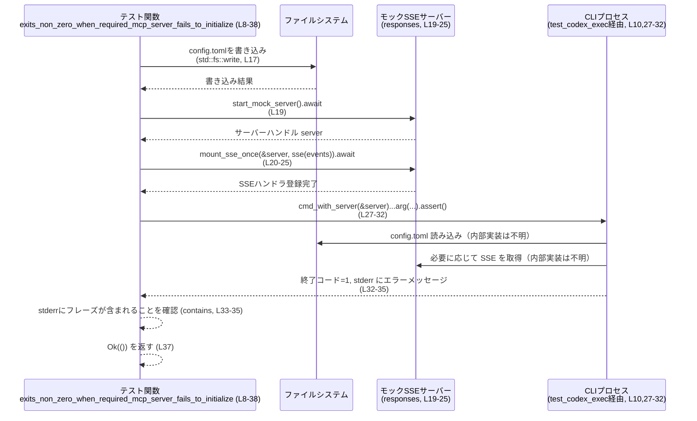

# exec/tests/suite/mcp_required_exit.rs コード解説

## 0. ざっくり一言

- **非 Windows 環境専用**の Tokio 非同期テストで、**「必須 MCP サーバーが起動に失敗したとき、CLI プロセスがコード 1 で終了し、特定メッセージを stderr に出す」**ことを検証するテストです（`exec/tests/suite/mcp_required_exit.rs:L1-2, L8-35`）。

---

## 1. このモジュールの役割

### 1.1 概要

- このモジュールは、`codex` と推測される CLI 実行ファイルのテストランナー（`test_codex_exec`）を用いて、**設定ファイルに「必須だが起動に失敗する MCP サーバー」が含まれている場合の終了コードとエラーメッセージの挙動**を検証します（`exec/tests/suite/mcp_required_exit.rs:L10-17, L27-35`）。
- テストでは、存在しないバイナリ名を `command` に指定した MCP サーバー設定を `config.toml` に書き込み、CLI 実行結果の **終了コードが 1（非ゼロ）**であり、stderr に **`"required MCP servers failed to initialize: required_broken"`** が含まれることを確認します（`exec/tests/suite/mcp_required_exit.rs:L12-16, L27-35`）。

### 1.2 アーキテクチャ内での位置づけ

このテストが依存している主なコンポーネントの関係を示します。

```mermaid
graph TD
    T["exits_non_zero_when_required_mcp_server_fails_to_initialize (L8-38)"]
    CFG["std::fs::write (L17)"]
    TC["test_codex_exec (別モジュール, L10)"]
    RSP["core_test_support::responses (別モジュール, L4, L19-25)"]
    PRED["predicates::str::contains (別クレート, L6, L33-34)"]
    TOKIO["#[tokio::test(flavor = \"multi_thread\", worker_threads = 2)] (L8)"]

    TOKIO --> T
    T --> CFG
    T --> TC
    T --> RSP
    T --> PRED
```

- テスト関数 `exits_non_zero_when_required_mcp_server_fails_to_initialize` が中心で、Tokio のマルチスレッドランタイムの上で実行されます（`exec/tests/suite/mcp_required_exit.rs:L8`）。
- テスト対象の CLI プロセスは `test_codex_exec()` から得たオブジェクト経由で実行されます（`exec/tests/suite/mcp_required_exit.rs:L10, L27-32`）。
- HTTP(S) モックサーバーと SSE レスポンスは `core_test_support::responses` モジュールのヘルパーにより提供されます（`exec/tests/suite/mcp_required_exit.rs:L4, L19-25`）。
- 結果検証には `assert_cmd` 系と推測されるアサートチェーンと、`predicates::str::contains` による stderr 文字列部分一致判定が使われます（`exec/tests/suite/mcp_required_exit.rs:L6, L27-35`）。

### 1.3 設計上のポイント

- **プラットフォーム条件付きコンパイル**  
  - モジュール全体に `#![cfg(not(target_os = "windows"))]` が付与されており、Windows ではこのテストはコンパイル／実行されません（`exec/tests/suite/mcp_required_exit.rs:L1`）。  
    - 理由はコードからは明示されていませんが、存在しないバイナリ起動の挙動やパス扱いが OS 依存である可能性があります（推測であり、このチャンクからは断定できません）。
- **非同期・並行実行**  
  - `#[tokio::test(flavor = "multi_thread", worker_threads = 2)]` により、Tokio のマルチスレッドランタイム上でテストが実行されます（`exec/tests/suite/mcp_required_exit.rs:L8`）。  
  - `worker_threads = 2` の指定により、内部の非同期タスクは最大 2 本の OS スレッドで並行実行され得ます。
- **エラーハンドリング**  
  - テスト関数の戻り値は `anyhow::Result<()>` であり、`std::fs::write` の I/O エラーは `?` 演算子によりテストの失敗として伝播されます（`exec/tests/suite/mcp_required_exit.rs:L9, L17`）。
  - それ以外の非同期ヘルパー呼び出し（`start_mock_server`, `mount_sse_once`）は `?` を使っておらず、**このテストからはそれらのエラー型やハンドリング方針は読み取れません**（`exec/tests/suite/mcp_required_exit.rs:L19-25`）。
- **CLI の契約検証に特化**  
  - テスト内容は、CLI プロセスの **終了コード** と **stderr の一部文字列**のみを検証しており、標準出力やその他ログは検証対象になっていません（`exec/tests/suite/mcp_required_exit.rs:L27-35`）。

---

## 2. 主要な機能一覧

このファイルが提供する主要機能は 1 つのテスト関数です。

- **必須 MCP サーバー起動失敗時の終了コード検証**  
  - `exits_non_zero_when_required_mcp_server_fails_to_initialize`:  
    - `config.toml` に存在しないバイナリを `command` に持つ必須 MCP サーバー (`required_broken`) を設定する（`exec/tests/suite/mcp_required_exit.rs:L12-17`）。
    - モックサーバーを起動し、SSE イベント列を 1 回分マウントする（`exec/tests/suite/mcp_required_exit.rs:L19-25`）。
    - CLI コマンドを実行し、終了コードが `1` であること、stderr に `"required MCP servers failed to initialize: required_broken"` が含まれることを検証する（`exec/tests/suite/mcp_required_exit.rs:L27-35`）。

---

## 3. 公開 API と詳細解説

このファイルはテスト用モジュールであり、**ライブラリとしての公開 API は定義していません**。ここでは、テスト関数と使用している外部ヘルパーの一覧・詳細を整理します。

### 3.1 型一覧（構造体・列挙体など）

このファイル内で **新たに定義されている構造体・列挙体・型エイリアスはありません**（`exec/tests/suite/mcp_required_exit.rs:L1-38`）。

#### 関数・テスト関数インベントリー

| 名前 | 種別 | 役割 / 用途 | 定義位置 |
|------|------|------------|----------|
| `exits_non_zero_when_required_mcp_server_fails_to_initialize` | 非同期テスト関数（Tokio） | 必須 MCP サーバーの起動失敗時に CLI がコード 1 で終了し、特定メッセージを stderr に出力することを検証する | `exec/tests/suite/mcp_required_exit.rs:L8-38` |

#### 外部コンポーネント（このファイルから使用しているもの）

| 名前 | 種別 | 由来 | 役割 / 用途 | 使用位置 |
|------|------|------|------------|----------|
| `core_test_support::test_codex_exec::test_codex_exec` | 関数 | テストサポートモジュール | CLI 実行環境（ホームディレクトリなど）をカプセル化したテストハーネスを生成 | `exec/tests/suite/mcp_required_exit.rs:L5, L10, L27` |
| `core_test_support::responses::start_mock_server` | 非同期関数 | テストサポートモジュール | モック HTTP/SSE サーバーを起動 | `exec/tests/suite/mcp_required_exit.rs:L4, L19` |
| `core_test_support::responses::sse` | 関数 | テストサポートモジュール | SSE イベント列から HTTP レスポンスボディを構築 | `exec/tests/suite/mcp_required_exit.rs:L20` |
| `core_test_support::responses::ev_response_created` | 関数 | テストサポートモジュール | SSE の「レスポンス作成」イベントオブジェクトを作成（と推測） | `exec/tests/suite/mcp_required_exit.rs:L21` |
| `core_test_support::responses::ev_assistant_message` | 関数 | テストサポートモジュール | SSE の「アシスタントメッセージ」イベントオブジェクトを作成（と推測） | `exec/tests/suite/mcp_required_exit.rs:L22` |
| `core_test_support::responses::ev_completed` | 関数 | テストサポートモジュール | SSE の「完了」イベントオブジェクトを作成（と推測） | `exec/tests/suite/mcp_required_exit.rs:L23` |
| `core_test_support::responses::mount_sse_once` | 非同期関数 | テストサポートモジュール | 指定サーバーに対して SSE レスポンスを 1 回だけ返すハンドラをマウント | `exec/tests/suite/mcp_required_exit.rs:L25` |
| `predicates::str::contains` | 関数 | `predicates` クレート | 文字列に特定部分文字列が含まれているかどうかを検証する述語を生成 | `exec/tests/suite/mcp_required_exit.rs:L6, L33-34` |
| `std::fs::write` | 関数 | Rust 標準ライブラリ | ファイル `config.toml` に TOML 文字列を書き出す | `exec/tests/suite/mcp_required_exit.rs:L17` |

> `responses::*` で作成されるイベントの詳細な構造や HTTP ハンドラ実装は、このチャンクには現れません。

### 3.2 関数詳細（テスト関数）

#### `exits_non_zero_when_required_mcp_server_fails_to_initialize() -> anyhow::Result<()>`

**概要**

- Tokio のマルチスレッドランタイム上で動作する非同期テスト関数です（`exec/tests/suite/mcp_required_exit.rs:L8-9`）。
- `config.toml` に「必須 (`required = true`) だが存在しないバイナリを指す MCP サーバー `required_broken`」を設定し、その状態で CLI を実行した際の挙動を検証します（`exec/tests/suite/mcp_required_exit.rs:L12-17, L27-35`）。

**引数**

- 引数はありません（`exec/tests/suite/mcp_required_exit.rs:L8-9`）。

**戻り値**

- 戻り値の型: `anyhow::Result<()>`（`exec/tests/suite/mcp_required_exit.rs:L9`）
  - **正常時 (`Ok(())`)**:  
    - 設定ファイル書き込み・モックサーバー起動・CLI 実行・アサーションがすべて成功した場合に返されます（`exec/tests/suite/mcp_required_exit.rs:L17-37`）。
  - **異常時 (`Err(anyhow::Error)`)**:  
    - この関数内では `?` が `std::fs::write` に対してのみ使われているため、**ファイル書き込み時の I/O エラー**が発生すると `Err` が返ります（`exec/tests/suite/mcp_required_exit.rs:L17`）。  
    - それ以外の部分でのエラー発生や `panic!` の可能性は、このチャンクだけからは分かりません。

**内部処理の流れ（アルゴリズム）**

次のようなステップで処理が行われます。

1. **テストハーネスの初期化**  
   - `let test = test_codex_exec();` で CLI 実行用のテストコンテキストを取得します（`exec/tests/suite/mcp_required_exit.rs:L10`）。
2. **設定ファイル内容の組み立て**  
   - `config_toml` 変数に TOML 文字列を格納します。セクション `[mcp_servers.required_broken]` に `command` と `required = true` が設定されています（`exec/tests/suite/mcp_required_exit.rs:L12-16`）。
3. **`config.toml` の書き込み**  
   - `test.home_path().join("config.toml")` でテスト用ホームディレクトリ配下の `config.toml` パスを作成し、`std::fs::write` で TOML 文字列を書き込みます（`exec/tests/suite/mcp_required_exit.rs:L17`）。  
   - `?` により、書き込み失敗時には直ちに `Err` を返してテストが失敗します。
4. **モック SSE サーバーの起動**  
   - `responses::start_mock_server().await` でモックサーバーを起動し、ハンドルを `server` に保持します（`exec/tests/suite/mcp_required_exit.rs:L19`）。
5. **SSE イベントボディの構築**  
   - `responses::sse` に 3 つのイベント (`ev_response_created`, `ev_assistant_message`, `ev_completed`) を渡して SSE ボディ `body` を構築します（`exec/tests/suite/mcp_required_exit.rs:L20-24`）。
6. **SSE ハンドラのマウント**  
   - `responses::mount_sse_once(&server, body).await` で、起動したモックサーバーに先ほどの SSE ボディを 1 回だけ返すハンドラを登録します（`exec/tests/suite/mcp_required_exit.rs:L25`）。
7. **CLI プロセスの実行とアサーション**  
   - `test.cmd_with_server(&server)` からコマンドビルダーを取得し、以下の引数を追加します（`exec/tests/suite/mcp_required_exit.rs:L27-30`）。  
     - `--skip-git-repo-check`  
     - `--experimental-json`  
     - `"tell me something"`  
   - その後 `.assert().code(1)` で終了コードが `1` であることを確認し、`.stderr(contains("required MCP servers failed to initialize: required_broken"))` で stderr に該当文字列が含まれることを検証します（`exec/tests/suite/mcp_required_exit.rs:L31-35`）。
8. **正常終了**  
   - 最後に `Ok(())` を返してテストを成功として終了します（`exec/tests/suite/mcp_required_exit.rs:L37`）。

**Examples（使用例）**

この関数はテストとして自動実行されるため、通常は直接呼び出しません。利用方法としては、テストスイートを走らせる形になります。

```bash
# このテストファイルを含むクレートで、すべてのテストを実行
$ cargo test

# このテストファイルに限定して実行（テストターゲット名はプロジェクト構成に依存します）
$ cargo test --test mcp_required_exit

# テスト関数名でフィルタして実行
$ cargo test exits_non_zero_when_required_mcp_server_fails_to_initialize
```

Rust コード側では、`#[tokio::test]` によりテストハーネスが自動的にこの関数を非同期実行します（`exec/tests/suite/mcp_required_exit.rs:L8-9`）。

**Errors / Panics**

- **`Err` になる条件**
  - `std::fs::write` による `config.toml` 書き込みが何らかの I/O エラーで失敗した場合、`?` によって `Err(anyhow::Error)` が返ります（`exec/tests/suite/mcp_required_exit.rs:L17`）。
- **`panic` の可能性**
  - このチャンク内には明示的な `panic!` 呼び出しや `unwrap()` / `expect()` はありません（`exec/tests/suite/mcp_required_exit.rs:L1-38`）。
  - ただし、外部ヘルパー（`test_codex_exec`, `responses::*` など）が内部で `panic` するかどうかは、このファイルからは分かりません。
- **アサーション失敗**
  - CLI の終了コードが 1 以外だったり（`exec/tests/suite/mcp_required_exit.rs:L32`）、stderr に期待文字列が含まれない場合（`exec/tests/suite/mcp_required_exit.rs:L33-35`）、アサーションが失敗してテストが失敗扱いになります。

**Edge cases（エッジケース）**

- **設定ファイルの書き込み失敗**  
  - 権限不足やディスクフルなどにより `std::fs::write` が失敗すると、テストは CLI の挙動を検証する前に `Err` で終了します（`exec/tests/suite/mcp_required_exit.rs:L17`）。
- **モックサーバー関連の異常**  
  - `responses::start_mock_server` や `responses::mount_sse_once` の内部で何が起きるかはこのチャンクから判断できませんが、戻り値を `?` で伝播していないため、ここでのエラー処理方針は不明です（`exec/tests/suite/mcp_required_exit.rs:L19-25`）。
- **CLI のメッセージ形式の変更**  
  - stderr については `contains(...)` による部分一致で検証しているため、改行や前後の文言が変わっても、指定文字列が含まれていればテストは成功します（`exec/tests/suite/mcp_required_exit.rs:L33-35`）。  
  - 逆に、このフレーズ自体が変更された場合はテストが失敗します。

**使用上の注意点**

- **非 Windows 専用**  
  - Windows ではコンパイルされないため、Windows 上で同様の動作を検証したい場合は別途テストを用意する必要があります（`exec/tests/suite/mcp_required_exit.rs:L1`）。
- **非同期ランタイムへの依存**  
  - `#[tokio::test(flavor = "multi_thread", worker_threads = 2)]` を用いているため、Tokio クレートが開発依存関係として適切に設定されている必要があります（`exec/tests/suite/mcp_required_exit.rs:L8`）。
- **テスト環境の分離**  
  - `test.home_path()` がどのように実装されているかはこのチャンクにはありませんが、通常はテストごとに分離されたディレクトリを返す設計が想定されます（推測）。  
    - 実際の実装は `core_test_support::test_codex_exec` 側を確認する必要があります。
- **セキュリティ面**  
  - このテスト自身は、ローカルな一時ディレクトリとモックサーバーを使う構成であり、外部ネットワークや任意のユーザ入力を扱っていないため、セキュリティ上の影響は限定的と考えられます（このチャンクの範囲内で読み取れる限り）。

### 3.3 その他の関数（外部ヘルパーの利用）

このファイル内で定義されてはいませんが、頻繁に利用されているヘルパー関数を整理します。

| 関数名 | 役割（1 行） | 備考 |
|--------|--------------|------|
| `test_codex_exec()` | CLI 実行のためのテストコンテキストを生成し、ホームディレクトリ等の環境を提供する | 実装は `core_test_support::test_codex_exec` モジュールにあり、このチャンクには現れません（`exec/tests/suite/mcp_required_exit.rs:L5, L10, L27`）。 |
| `responses::start_mock_server()` | モック HTTP/SSE サーバーを起動し、ハンドルを返す | 戻り値の型は `cmd_with_server(&server)` に渡されていることから、CLI 実行時にサーバー URL 等を埋め込む型であると推測されます（`exec/tests/suite/mcp_required_exit.rs:L19, L27`）。 |
| `responses::sse(events)` | SSE イベント列からレスポンスボディを構築する | テストでは 3 種類のイベントオブジェクトをベクタで渡しています（`exec/tests/suite/mcp_required_exit.rs:L20-24`）。 |
| `responses::mount_sse_once(&server, body)` | 指定したサーバーに対し、1 回だけ SSE ボディを返すようにマウントする | 戻り値の型は無視されているため、`Future<Output = ()>` であるか、`Future<Output = T>` だが `T` を破棄しているものと考えられます（`exec/tests/suite/mcp_required_exit.rs:L25`）。 |

> ここでの型推測は、関数の呼び出し方（代入／引数としての利用）を根拠としたものであり、正確なシグネチャは該当モジュールの実装を確認する必要があります。

---

## 4. データフロー

### 4.1 代表的な処理シナリオ

このテストにおける典型的なデータフローは次のようになります。

1. テストハーネスが **一時ホームディレクトリ** を用意し、そこに `config.toml` を書き込みます（`exec/tests/suite/mcp_required_exit.rs:L10, L17`）。
2. モック SSE サーバーを起動し、固定の SSE イベント列を返すように設定します（`exec/tests/suite/mcp_required_exit.rs:L19-25`）。
3. CLI プロセスを、モックサーバーと設定ファイルを参照する形で起動します（`exec/tests/suite/mcp_required_exit.rs:L27-30`）。
4. CLI は（内部実装は不明ですが）設定ファイルを読み込み、MCP サーバー `required_broken` を起動しようとして失敗し、その結果をもとに終了コード 1 とエラーメッセージを出力します（内部動作はこのチャンクには出てこず、テストの期待値としてのみ現れます）。
5. テストはプロセスの終了コードと stderr を検査し、期待通りであれば `Ok(())` を返して終了します（`exec/tests/suite/mcp_required_exit.rs:L27-37`）。

### 4.2 シーケンス図



> CLI プロセスがどのタイミングで MCP サーバーを起動しようとして失敗しているか、およびモックサーバーとの通信プロトコルの詳細は、このチャンクには現れません。テストは「結果」としての終了コードとメッセージのみを検証しています。

---

## 5. 使い方（How to Use）

### 5.1 基本的な使用方法

このファイルはテスト用であり、ユーザーコードから直接呼び出すのではなく、`cargo test` コマンドで利用されます。

```bash
# プロジェクト全体のテストを実行
$ cargo test

# このテストファイルを含むターゲットに絞る（一例）
$ cargo test --test mcp_required_exit

# テスト関数名でフィルタして実行
$ cargo test exits_non_zero_when_required_mcp_server_fails_to_initialize
```

Tokio の非同期テストマクロ `#[tokio::test]` により、テストランナーは自動的に非同期コンテキストを用意してこの関数を実行します（`exec/tests/suite/mcp_required_exit.rs:L8`）。

### 5.2 よくある使用パターン（類似テストを書く場合）

このテストは「特定の設定ファイル＋モックサーバー＋CLI 実行結果の検証」というパターンの一例です。類似のテストを書くときは、次のような流れになります。

```rust
#[tokio::test(flavor = "multi_thread", worker_threads = 2)] // Tokio のマルチスレッドランタイムで実行
async fn some_other_cli_behavior_test() -> anyhow::Result<()> { // anyhow::Result でエラー伝播
    let test = test_codex_exec();                               // テストコンテキストを初期化

    // 1. 設定ファイルの内容を組み立てる
    let config_toml = r#"
        [mcp_servers.some_case]
        command = "..."
        required = false
    "#;                                                          // シナリオに応じた TOML を用意

    // 2. 設定ファイルを書き出す
    std::fs::write(test.home_path().join("config.toml"), config_toml)?; // I/O エラーは ? で伝播

    // 3. 必要ならモックサーバーを起動
    let server = responses::start_mock_server().await;          // モックサーバーを起動
    let body = responses::sse(vec![
        responses::ev_response_created("resp_1"),               // 任意の SSE イベント列
        responses::ev_completed("resp_1"),
    ]);
    responses::mount_sse_once(&server, body).await;             // 1 回だけ SSE を返すように設定

    // 4. CLI を実行し、期待する終了コード・メッセージを検証
    test.cmd_with_server(&server)
        .arg("--experimental-json")                             // 必要なフラグを付与
        .arg("some query")
        .assert()
        .code(0)                                                // 期待する終了コード
        .stderr(predicates::str::contains("expected message")); // 期待するメッセージの一部

    Ok(())                                                      // テスト成功
}
```

> 上記はあくまでこのファイルのパターンを一般化した例であり、実際のテスト内容は対象機能に応じて変更が必要です。

### 5.3 よくある間違い（想定される誤用）

このファイルから推測される、類似テストを書く際の典型的な落とし穴を挙げます。

```rust
// 間違い例: config.toml を書かずに CLI を実行してしまう
#[tokio::test(flavor = "multi_thread", worker_threads = 2)]
async fn missing_config_test() -> anyhow::Result<()> {
    let test = test_codex_exec();

    // std::fs::write(...) を呼んでいないため、デフォルト設定が使われる可能性がある
    // 期待したシナリオが再現されない

    test.cmd_with_server(&server) // server も初期化されていない
        .arg("...")
        .assert()
        .code(1);

    Ok(())
}

// 正しいパターン: 必要な設定やモックサーバーを先に初期化してから CLI を実行する
#[tokio::test(flavor = "multi_thread", worker_threads = 2)]
async fn proper_test() -> anyhow::Result<()> {
    let test = test_codex_exec();                              // コンテキスト取得

    let config_toml = r#" ... "#;                              // 設定内容を用意
    std::fs::write(test.home_path().join("config.toml"), config_toml)?; // 書き込み

    let server = responses::start_mock_server().await;         // モックサーバーを起動
    responses::mount_sse_once(&server, responses::sse(vec![])).await; // 必要に応じてマウント

    test.cmd_with_server(&server)                              // 準備が整った状態で実行
        .arg("...")
        .assert()
        .code(1);

    Ok(())
}
```

### 5.4 使用上の注意点（まとめ）

- **テスト順序への依存を避ける**  
  - `test.home_path()` が設定ファイルを書き込むディレクトリを決めるため、他のテストと同じファイルを上書きしない設計であることが重要です（設計の詳細はこのチャンクにはありません）。テストの独立性を保つことが望まれます。
- **非同期ヘルパーの戻り値**  
  - `responses::mount_sse_once(...).await;` の戻り値を無視しているため、`Future<Output = ()>` であるか、戻り値に `#[must_use]` が付いていないことが前提になっています（`exec/tests/suite/mcp_required_exit.rs:L25`）。  
  - インターフェース変更時にはコンパイラ警告に注意が必要です。
- **メッセージ検証の粒度**  
  - `stderr(contains("..."))` による部分一致検証は、メッセージが完全一致でなくても許容される一方で、他のテストケースとメッセージが衝突すると誤解を招く可能性があります（`exec/tests/suite/mcp_required_exit.rs:L33-35`）。

---

## 6. 変更の仕方（How to Modify）

### 6.1 新しい機能／シナリオを追加する場合

別の MCP サーバー設定やエラーシナリオをテストしたい場合の、具体的な追加手順です。

1. **新しいテスト関数を定義**  
   - 同じファイル、あるいは同じテストスイート配下に、`#[tokio::test]` 付きの関数を追加します（`exec/tests/suite/mcp_required_exit.rs:L8` を参考）。
2. **`config.toml` の内容を変更**  
   - 新しいシナリオに応じて `[mcp_servers.<name>]` セクションやその他設定を変更します（`exec/tests/suite/mcp_required_exit.rs:L12-16` を参考）。
3. **モックサーバーの挙動を調整**  
   - 必要に応じて SSE イベント列や HTTP ステータスなどを変えるため、`responses::sse` に渡すイベントや `mount_sse_once` の使い方を調整します（`exec/tests/suite/mcp_required_exit.rs:L20-25`）。
4. **CLI 引数・期待値の更新**  
   - `.arg(...)` で CLI 引数を、`.code(...)` と `.stderr(contains(...))` で期待する終了コードとメッセージを設定します（`exec/tests/suite/mcp_required_exit.rs:L27-35`）。

### 6.2 既存のテストを変更する場合

このテストの仕様を変更する際に注意すべき点です。

- **終了コードの契約変更**  
  - CLI の仕様変更により「必須 MCP サーバー起動失敗時の終了コード」が変わる場合、`.code(1)` の値を新しい仕様に合わせて変更する必要があります（`exec/tests/suite/mcp_required_exit.rs:L32`）。
- **エラーメッセージの変更**  
  - エラーメッセージ形式を変更する場合、`contains("required MCP servers failed to initialize: required_broken")` の文字列を新仕様に合わせる必要があります（`exec/tests/suite/mcp_required_exit.rs:L33-35`）。  
  - 部分一致であることを活かし、極力「意味的に安定したフレーズ」のみに依存するのが安全です。
- **非同期ランタイムの設定変更**  
  - `worker_threads = 2` を変える（あるいはシングルスレッドにする）場合、同じテストファイル内の他の非同期テストや、共有リソースの扱いに影響が出ないかを確認する必要があります（`exec/tests/suite/mcp_required_exit.rs:L8`）。
- **関連するテストの再確認**  
  - MCP サーバーの初期化ロジックやエラー処理を変更した場合、このテストに加え、同じ設定キー (`mcp_servers.*`) を扱う他のテストも合わせて確認するのが望ましいです（他テストはこのチャンクには現れません）。

---

## 7. 関連ファイル

このファイルと密接に関係するモジュール／コンポーネントを整理します。

| パス / モジュール | 役割 / 関係 |
|------------------|------------|
| `core_test_support::test_codex_exec` | CLI 実行用テストコンテキスト `test_codex_exec` を提供し、`home_path()` や `cmd_with_server()` などを通じてテスト環境構築を支援します（`exec/tests/suite/mcp_required_exit.rs:L5, L10, L27`）。ファイルパス自体はこのチャンクには現れません。 |
| `core_test_support::responses` | モックサーバー起動 (`start_mock_server`)、SSE ボディ生成 (`sse`)、SSE イベント生成 (`ev_*`)、SSE ハンドラ登録 (`mount_sse_once`) など、HTTP/SSE テストサポートを提供します（`exec/tests/suite/mcp_required_exit.rs:L4, L19-25`）。 |
| `predicates::str` | `contains` 述語を提供し、stderr 文字列が期待する部分文字列を含むかどうかの検証に利用されています（`exec/tests/suite/mcp_required_exit.rs:L6, L33-34`）。 |
| `tokio` | `#[tokio::test]` マクロを通じて、非同期テストランタイムを提供します（`exec/tests/suite/mcp_required_exit.rs:L8`）。 |
| `anyhow` | テスト関数の戻り値として `anyhow::Result<()>` を提供し、エラーのラップ・伝播を簡潔にしています（`exec/tests/suite/mcp_required_exit.rs:L9`）。 |
| `std::fs` | `write` 関数を通じて `config.toml` への書き込みを行います（`exec/tests/suite/mcp_required_exit.rs:L17`）。 |

> これらの関連モジュールの具体的な実装やファイルパスは、このチャンクには含まれていません。詳細を知るには、それぞれのモジュール定義ファイルを参照する必要があります。
