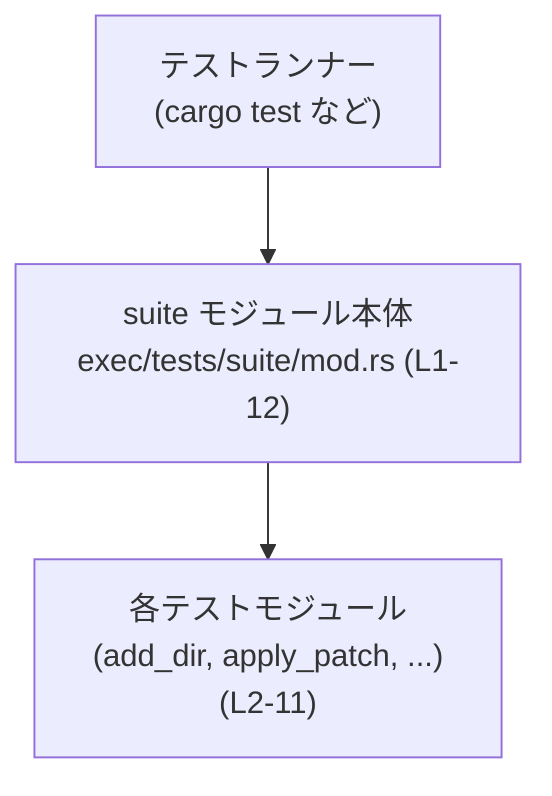
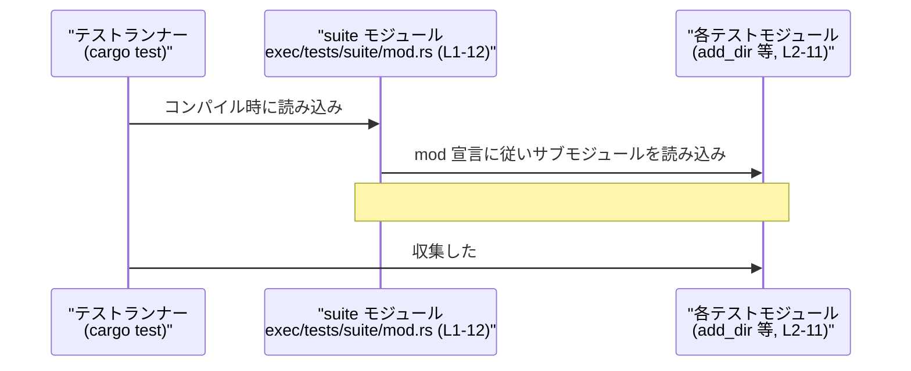

# exec/tests/suite/mod.rs コード解説

## 0. ざっくり一言

以前は個別ファイルとして存在していたインテグレーションテスト群を、1 つのテストスイートとして **モジュール単位で集約するためのハブモジュール** です（`exec/tests/suite/mod.rs:L1-11`）。

---

## 1. このモジュールの役割

### 1.1 概要

- 1 行目のコメントにあるとおり、**「以前はスタンドアロンだったインテグレーションテスト」をモジュールとして集約**する役割を持ちます（`exec/tests/suite/mod.rs:L1`）。
- 具体的には、このファイル内の `mod xxx;` 宣言を通じて、複数のテストモジュール（`add_dir` など）をコンパイル対象に含めています（`exec/tests/suite/mod.rs:L2-11`）。
- このファイル自体にはテスト関数やロジックは定義されておらず、**モジュール定義だけを持つ薄いオーケストレーション層**です。

### 1.2 アーキテクチャ内での位置づけ

このファイルは「テストスイートを構成するモジュールの一覧」を宣言するだけの、上位レベルの集約ポイントです。

- Rust のモジュールシステムでは、`mod add_dir;` のような宣言により、同名のモジュールソースをコンパイル対象に含めます（一般的な Rust の仕様）。
- このファイルの `mod` 群（`exec/tests/suite/mod.rs:L2-11`）により、各テストモジュールが 1 つの「スイート」としてまとめられます。
- 実際のテスト関数（`#[test]`）やテストロジックは、それぞれのサブモジュール側に定義されていると考えられますが、その中身はこのチャンクには現れていません。

概念的な関係を Mermaid 図で表すと次のようになります。



- `Runner` は Rust のテストハーネス（`cargo test` のようなもの）を表す概念ノードです。
- `SuiteMod` がこのファイルで、複数の `SubModules` を `mod` 宣言でぶら下げています（`exec/tests/suite/mod.rs:L2-11`）。

### 1.3 設計上のポイント

コードから読み取れる範囲での特徴は次のとおりです。

- **責務の分割**
  - このファイルは **テストモジュールの集約だけ** を担当し、実際のテストロジックは各モジュールに分離されています（`exec/tests/suite/mod.rs:L2-11`）。
- **状態を持たない**
  - グローバル変数や構造体などの状態は定義されておらず、**純粋にモジュール宣言のみ**を行っています（`exec/tests/suite/mod.rs:L1-11`）。
- **エラーハンドリング / 並行性**
  - 実行時ロジックがないため、このファイル単体ではエラーハンドリングやスレッド並行性に関するコードは存在しません。
- **テスト構成の一元管理**
  - 「どのインテグレーションテストモジュールをスイートに含めるか」が、この 1 ファイルで一覧できるようになっています（`exec/tests/suite/mod.rs:L2-11`）。

---

## 2. 主要な機能一覧

このファイルが提供する機能は、テストの「機能」を直接実装するものではなく、**テストモジュールの構成を定義する機能**です。

- テストモジュールの集約: 以前は別々のインテグレーションテストだったものを、モジュールとして 1 箇所に集約します（`exec/tests/suite/mod.rs:L1-11`）。
- モジュールのコンパイル対象化: `mod xxx;` 宣言によって、各テストモジュールをコンパイル対象に含めます（`exec/tests/suite/mod.rs:L2-11`）。

### 2.1 コンポーネント（モジュール）一覧

このチャンクに現れるコンポーネント（モジュール）の一覧です。  
※ 役割のうち、具体的な内容はこのファイルには書かれていないため、「インテグレーションテストの一部である」という範囲にとどめています。

| コンポーネント | 種別 | 定義位置（根拠） | 説明 |
|----------------|------|------------------|------|
| （このファイルのモジュール本体） | モジュール | `exec/tests/suite/mod.rs:L1-11` | コメントにあるとおり、以前はスタンドアロンだったインテグレーションテストをモジュールとして集約する役割を持つモジュールです（`L1`）。 |
| `add_dir` | サブモジュール | `exec/tests/suite/mod.rs:L2` | インテグレーションテストスイートの一部として含まれるテストモジュールのひとつです。中身はこのチャンクには現れません。 |
| `apply_patch` | サブモジュール | `exec/tests/suite/mod.rs:L3` | 同上。スイートに含まれるテストモジュールです。 |
| `auth_env` | サブモジュール | `exec/tests/suite/mod.rs:L4` | 同上。 |
| `ephemeral` | サブモジュール | `exec/tests/suite/mod.rs:L5` | 同上。 |
| `mcp_required_exit` | サブモジュール | `exec/tests/suite/mod.rs:L6` | 同上。 |
| `originator` | サブモジュール | `exec/tests/suite/mod.rs:L7` | 同上。 |
| `output_schema` | サブモジュール | `exec/tests/suite/mod.rs:L8` | 同上。 |
| `prompt_stdin` | サブモジュール | `exec/tests/suite/mod.rs:L9` | 同上。 |
| `resume` | サブモジュール | `exec/tests/suite/mod.rs:L10` | 同上。 |
| `sandbox` | サブモジュール | `exec/tests/suite/mod.rs:L11` | 同上。 |
| `server_error_exit` | サブモジュール | `exec/tests/suite/mod.rs:L12` | 同上。 |

---

## 3. 公開 API と詳細解説

### 3.1 型一覧（構造体・列挙体など）

このファイルには **構造体・列挙体などの型定義は一切ありません**（`exec/tests/suite/mod.rs:L1-12`）。  
そのため、公開型 API も存在しません。

| 名前 | 種別 | 役割 / 用途 |
|------|------|-------------|
| （なし） | - | このファイル内には型定義がありません。 |

### 3.2 関数詳細（最大 7 件）

このファイルには **関数／メソッド定義が 1 つも存在しません**（`exec/tests/suite/mod.rs:L1-12`）。  
したがって、「関数詳細」テンプレートに沿って解説すべき対象はありません。

- テスト関数（`#[test] fn ...`）や補助関数は、ここで `mod` 宣言されている各サブモジュール側に定義されていると考えられますが、そのコードはこのチャンクには含まれていません。

### 3.3 その他の関数

- 該当なし（関数定義そのものが存在しません）。

---

## 4. データフロー

このファイル自体には実行時ロジックがないため、「値がこの関数からあの関数へ渡る」といった通常の意味でのデータフローは存在しません。

ここでは、**テスト実行時の「モジュール読み込み・テスト実行」の流れ**を、概念的なフローとして整理します。

1. Rust のテストランナー（`cargo test` など）が、テストを含むクレートをコンパイル・実行します。
2. コンパイル段階で `exec/tests/suite/mod.rs` が読み込まれ、`mod add_dir;` などの宣言にしたがって各テストモジュールがコンパイル対象に含まれます（`exec/tests/suite/mod.rs:L2-11`）。
3. 各テストモジュール内に定義された `#[test]` 関数がテストハーネスにより検出され、実行されます。
   - このステップで何が起こるかは各モジュールの中身に依存し、このチャンクからは詳細不明です。

この流れを Mermaid のシーケンス図で表現します。



### バグ・セキュリティ観点（このファイル単体）

- このファイルは **コンパイル時のモジュール指定のみ**であり、実行時にユーザー入力や外部システムと直接やり取りするコードがありません。
- そのため、このファイル単体から読み取れる **メモリ安全性・セキュリティ上のリスク・並行性バグ** は特にありません。
- ただし、どのテストモジュールを含めるかはここで制御されるため、**「テストがコンパイルされて実行されるかどうか」**という観点では重要です（`mod` 宣言を削除すると、そのモジュール内のテストが実行されなくなる）。

---

## 5. 使い方（How to Use）

### 5.1 基本的な使用方法

このファイルは「テストスイートの構成ファイル」であり、通常のライブラリ API のように **コードから直接呼び出す対象ではありません**。

一般的な利用形態は次のようになります。

1. 各テストモジュール（例: `add_dir`）に `#[test]` 関数を実装する。
2. そのモジュールをこのファイルで `mod add_dir;` のように宣言しておく（`exec/tests/suite/mod.rs:L2-11`）。
3. `cargo test` を実行すると、このファイルを経由して各モジュールのテストが実行される（Rust のテストハーネスの一般的な挙動）。

新しいテストモジュールを追加するシンプルな例を示します（モジュール名 `new_case` の場合）：

```rust
// exec/tests/suite/mod.rs 側に行を追加する例                     // このファイルがテストスイートの集約ポイント
// 既存の mod 宣言（L2-11）は変更せず、その下などに追記する
mod new_case;                                                   // 新しいテストモジュール new_case をスイートに含める
```

対応する `new_case` モジュール側（ファイルパスや上位モジュール構成はこのチャンクからは断定できませんが、一般的な例を示します）:

```rust
// 例: exec/tests/suite/new_case.rs などに配置されると想定されるコード    // 一般的な Rust モジュール配置の例

#[test]                                                             // テスト関数であることを示す属性
fn it_works() {                                                     // テスト関数の宣言
    // ここにテストロジックを書く                                   // 実際のテスト内容はプロジェクト固有
    assert_eq!(1 + 1, 2);                                          // 例として単純なアサーション
}
```

- このように、**新しいテストモジュールを追加するときは、この集約ファイルに `mod` を追加する**ことが必須です。

### 5.2 よくある使用パターン

このファイルを使った典型的なパターンは次のとおりです。

- **テストケースの論理的なグルーピング**
  - 振る舞いや機能ごとにテストをモジュールに分割し、それらをこのファイルに列挙して 1 つのスイートとして扱う（`exec/tests/suite/mod.rs:L2-11`）。
- **モジュール単位での有効化 / 無効化**
  - 一時的に特定のテストモジュールを無効化したい場合、その `mod` 行にコメントアウトを施すことで、モジュール単位でテストを外すことができます（一般的な Rust の挙動）。

```rust
// 一時的に sandbox テストを無効化する例（一般的な操作例）
// mod sandbox;   // ← この行をコメントアウトすると sandbox モジュールがコンパイル対象から外れる
```

※ 実際にこのように無効化してよいかどうかは、プロジェクトの運用方針によります。

### 5.3 よくある間違い

このファイルの性質から起こりそうな誤用例と、その正しい形です。

```rust
// 誤り例: テストモジュールファイルを追加しただけで、mod 宣言を追加していない
// （このファイルの L2-11 に相当する行がない）
// ファイル exec/tests/suite/new_case.rs を作ったが、mod new_case; を書いていない

// 正しい例: 追加したモジュールを必ず mod 宣言にも反映する
mod add_dir;
mod apply_patch;
// ...
mod server_error_exit;
mod new_case;  // ← 新しく追加したテストモジュールをここに列挙する
```

- **誤りの結果**: `mod new_case;` がないと、`new_case` 内のテストはコンパイルされず、テストランナーに認識されません。
- これは静的にテストが「実行されない」という意味で、**テスト漏れ**につながります。

### 5.4 使用上の注意点（まとめ）

- **前提条件**
  - 各 `mod` 宣言（`exec/tests/suite/mod.rs:L2-11`）に対応するモジュールファイルが存在している必要があります。存在しない場合はコンパイルエラーになります（Rust の一般仕様）。
- **テストカバレッジへの影響**
  - `mod` 行を削除・コメントアウトすると、そのモジュール内のテストが実行されなくなります。テストを整理する際は意図した変更かどうかを確認する必要があります。
- **安全性・並行性**
  - このファイル自体には実行時ロジックがないため、メモリ安全性・エラーハンドリング・並行処理の観点で気を付けるべきポイントはありません。これらは各テストモジュールの中身に依存します。
- **観測性（ログなど）**
  - ログ出力やメトリクスの仕込みはこのファイルではなく、各テストモジュール側で行う必要があります。このファイルからはその有無を判断できません。

---

## 6. 変更の仕方（How to Modify）

### 6.1 新しい機能（テストモジュール）を追加する場合

新しいテストを追加する際、このファイルとどう関係するかを整理します。

1. **テストモジュールを作成**
   - 新しいテストファイル（例: `new_case` モジュール）を作成し、`#[test]` 関数などを定義します。
   - 具体的なファイルパスはこのチャンクからは分かりませんが、一般的には本ファイルと同じディレクトリ配下に置かれます。
2. **このファイルに `mod` 行を追加**
   - `exec/tests/suite/mod.rs` の既存の `mod` 群に新しい行を追加します（`exec/tests/suite/mod.rs:L2-11` と同じ形式）。
   - 例: `mod new_case;`
3. **ビルド・テスト**
   - `cargo test` を実行し、新しいモジュールがコンパイルされ、テストが実行されることを確認します。

このとき依存すべき既存の構造は次のとおりです。

- 「どのテストモジュールがすでに存在しているか」を確認するために、このファイルの `mod` 一覧（`L2-11`）を起点にすると整理しやすくなります。
- 既存モジュールの中身を再利用する場合は、対応するモジュール（例: `add_dir`）を参照します。ファイルパスはこのチャンク外で確認する必要があります。

### 6.2 既存の機能（テスト構成）を変更する場合

既存のテスト構成を変更する場合のポイントです。

- **モジュール名の変更**
  - あるテストモジュール名を変更する場合、
    - 対応するモジュールファイル名（このチャンク外）と
    - このファイルの `mod` 行（`exec/tests/suite/mod.rs:L2-11`）
    の両方を整合させる必要があります。
- **モジュールの削除**
  - `mod sandbox;` などの行を削除すると、そのモジュール内のテストがすべて実行されなくなります。テストカバレッジが減るため、削除が妥当かどうかを確認する必要があります。
- **影響範囲の確認**
  - このファイルから他モジュールを呼び出すコードはないため、構成変更に伴う影響は「どのテストが実行されるか」に限られます。
  - 実際のテストロジックへの影響（例: 共通ヘルパーの移動など）は、各サブモジュール側のコード（このチャンク外）を確認する必要があります。

---

## 7. 関連ファイル

このファイルと密接に関係するのは、ここで `mod` 宣言されている各テストモジュールです。  
具体的なソースファイルパスはこのチャンクには現れていないため、「モジュール名」として列挙します。

| パス（モジュール名） | 役割 / 関係 |
|----------------------|------------|
| `add_dir` | `mod add_dir;` で参照されるサブモジュールです（`exec/tests/suite/mod.rs:L2`）。中身はこのチャンク外ですが、インテグレーションテストスイートの一部です。 |
| `apply_patch` | 同上。`mod apply_patch;` によりスイートに含まれます（`L3`）。 |
| `auth_env` | 同上。`mod auth_env;` によりスイートに含まれます（`L4`）。 |
| `ephemeral` | 同上。`mod ephemeral;` によりスイートに含まれます（`L5`）。 |
| `mcp_required_exit` | 同上。`mod mcp_required_exit;` によりスイートに含まれます（`L6`）。 |
| `originator` | 同上。`mod originator;` によりスイートに含まれます（`L7`）。 |
| `output_schema` | 同上。`mod output_schema;` によりスイートに含まれます（`L8`）。 |
| `prompt_stdin` | 同上。`mod prompt_stdin;` によりスイートに含まれます（`L9`）。 |
| `resume` | 同上。`mod resume;` によりスイートに含まれます（`L10`）。 |
| `sandbox` | 同上。`mod sandbox;` によりスイートに含まれます（`L11`）。 |
| `server_error_exit` | 同上。`mod server_error_exit;` によりスイートに含まれます（`L12`）。 |

- 実際のテストコードや補助ユーティリティは、これらモジュールの定義ファイル側に存在し、このチャンクだけでは内容を確認できません。
- このファイルは、それらを **1 箇所に束ねるインデックス役** を担っています。
