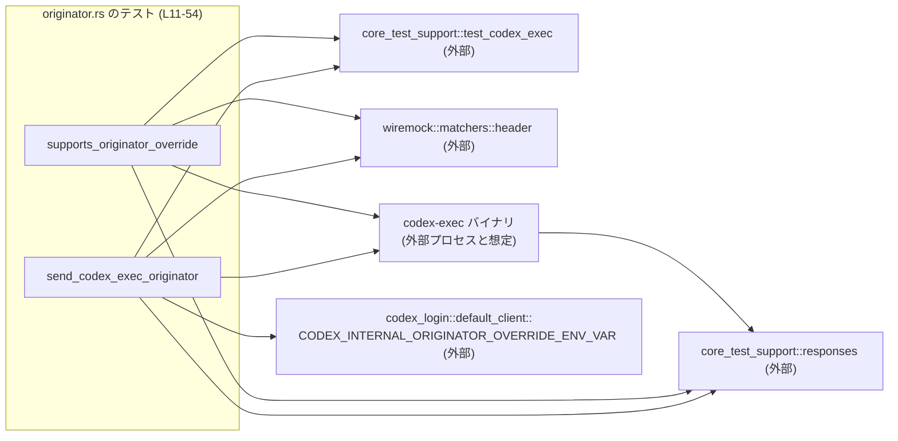
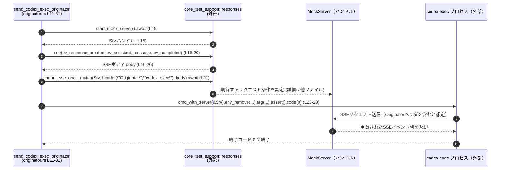

# exec/tests/suite/originator.rs

## 0. ざっくり一言

`codex-exec` バイナリが送信する HTTP ヘッダ `Originator` の値が、デフォルト値および環境変数による上書き時に期待どおりになるかを、Tokio ベースのモックサーバを使って検証する **非 Windows 向けの統合テスト**です（originator.rs:L1-7, L11-54）。

---

## 1. このモジュールの役割

### 1.1 概要

- `codex-exec` がバックエンドサーバにアクセスするときに付与する `Originator` ヘッダの値を検証します。  
  - 環境変数未設定時に `"codex_exec"` が送られること（originator.rs:L12-28）。  
  - 環境変数で `"codex_exec_override"` に上書きできること（originator.rs:L34-51）。
- テストは Tokio のマルチスレッドランタイム上で実行され、モックサーバに対する SSE（Server-Sent Events）レスポンスを用いて CLI とサーバ間のやり取りを模擬します（originator.rs:L11, L33, L15-21, L37-44）。
- Windows ではビルド／実行されないよう `cfg(not(target_os = "windows"))` が指定されています（originator.rs:L1）。

### 1.2 アーキテクチャ内での位置づけ

このファイルは **テストスイート** の一部であり、実際のクライアント実装やサーバ実装は他モジュールに存在します。

依存関係の概要を Mermaid 図で示します。



- `test_codex_exec()` は `codex-exec` のテスト用ラッパを構築するヘルパ関数と解釈できますが、実装はこのチャンクにはありません（originator.rs:L13, L35）。
- `responses` モジュールは WireMock ベースのモックサーバおよび SSE レスポンス生成ユーティリティを提供しています（originator.rs:L5, L15-21, L37-44）。
- `header("Originator", ...)` は HTTP リクエストヘッダのマッチ条件を表します（originator.rs:L7, L21, L43）。
- `CODEX_INTERNAL_ORIGINATOR_OVERRIDE_ENV_VAR` は内部向け環境変数名を表す定数です（originator.rs:L4, L24）。  
  文字列リテラル `"CODEX_INTERNAL_ORIGINATOR_OVERRIDE"` との関係は、このチャンクだけでは断定できません（originator.rs:L47）。

### 1.3 設計上のポイント

- **プラットフォーム条件付きコンパイル**  
  - テスト全体が `cfg(not(target_os = "windows"))` によってガードされ、Windows ではコンパイルされません（originator.rs:L1）。
- **非同期・並行テスト**  
  - 両テストとも `#[tokio::test(flavor = "multi_thread", worker_threads = 2)]` で定義され、マルチスレッドの Tokio ランタイム上で実行されます（originator.rs:L11, L33）。
  - これにより、テスト内の `async` 関数・`.await` が自然に扱われます。
- **外部プロセス／コマンドの検証スタイル**  
  - `test.cmd_with_server(&server)...assert().code(0)` の形で、終了コードをアサーションしています（originator.rs:L23-28, L46-51）。
  - 失敗時にはアサーションがパニックし、テストが失敗します。
- **環境変数による設定**  
  - デフォルト動作のテストでは `env_remove(CODEX_INTERNAL_ORIGINATOR_OVERRIDE_ENV_VAR)` により内部用環境変数を削除してから実行します（originator.rs:L23-25）。
  - 上書き動作のテストでは `.env("CODEX_INTERNAL_ORIGINATOR_OVERRIDE", "codex_exec_override")` で環境変数を設定しています（originator.rs:L46-47）。
- **コメントと実装の差異**  
  - ファイル先頭のドキュメンテーションコメントは「サーバがエラーを返したときに非ゼロ終了コードを期待する」と書かれていますが（originator.rs:L9-10）、実際のコードでは `.code(0)` を期待しており、このテストではサーバ正常時の振る舞いを検証しているように見えます（originator.rs:L28, L51）。  
    これはコメントが他テストからの流用で更新されていない可能性を示しますが、このチャンクからは意図を断定できません。

---

## 2. 主要な機能一覧

このファイル内で定義されている主な「機能」（テスト関数）は次の 2 つです。

- `send_codex_exec_originator`: 環境変数が未設定のときに、`Originator` ヘッダとして `"codex_exec"` が送信され、コマンドが正常終了することを検証します（originator.rs:L11-31）。
- `supports_originator_override`: 環境変数 `CODEX_INTERNAL_ORIGINATOR_OVERRIDE` によって、`Originator` ヘッダを `"codex_exec_override"` に上書きできることを検証します（originator.rs:L33-53）。

---

## 3. 公開 API と詳細解説

### 3.1 型一覧（構造体・列挙体など）

このファイル内で新たに定義されている構造体・列挙体などの型はありません。

| 名前 | 種別 | 役割 / 用途 | 根拠 |
|------|------|-------------|------|
| （なし） | — | — | ファイル全体に型定義が存在しません（originator.rs:L1-54） |

### 3.2 関数詳細

#### `send_codex_exec_originator() -> anyhow::Result<()>`

**概要**

- 非同期テスト関数です（originator.rs:L11-12）。
- モックサーバを起動し、`Originator` ヘッダが `"codex_exec"` のリクエストに対して SSE レスポンスを返すよう設定します（originator.rs:L15-21）。
- 内部用環境変数を削除した状態で `codex-exec` を実行し、終了コード 0（成功）を期待します（originator.rs:L23-28）。

**引数**

- 引数はありません（originator.rs:L12）。

**戻り値**

- `anyhow::Result<()>`  
  - 成功時は `Ok(())` を返し（originator.rs:L30）、失敗時には `Err` を返すことができますが、現在のコードでは `?` 演算子は使われておらず、明示的にエラーを返してはいません。

**内部処理の流れ（アルゴリズム）**

1. `test_codex_exec()` を呼び出して、`codex-exec` のテスト環境（コマンドラッパ）を生成します（originator.rs:L13）。
2. `responses::start_mock_server().await` でモックサーバを起動し、ハンドルを取得します（originator.rs:L15）。
3. SSE レスポンスのボディを `responses::sse(vec![ ... ])` で構築します。  
   - `ev_response_created("response_1")`  
   - `ev_assistant_message("response_1", "Hello, world!")`  
   - `ev_completed("response_1")`（originator.rs:L16-20）
4. `responses::mount_sse_once_match(&server, header("Originator", "codex_exec"), body).await` を呼ぶことで、`Originator: codex_exec` を持つリクエストに対して上記 SSE を 1 回返すようにモックサーバを設定します（実際の挙動は他ファイル、originator.rs:L21）。
5. `test.cmd_with_server(&server)` でテスト用コマンドにサーバ情報を紐づけます（originator.rs:L23）。
6. `.env_remove(CODEX_INTERNAL_ORIGINATOR_OVERRIDE_ENV_VAR)` で内部用環境変数をコマンド環境から削除します（originator.rs:L24）。
7. `.arg("--skip-git-repo-check").arg("tell me something")` で CLI に渡す引数を指定します（originator.rs:L25-26）。
8. `.assert().code(0)` でコマンドを実行し、終了コード 0 を期待します（originator.rs:L27-28）。
9. 最後に `Ok(())` を返してテストを成功として終了します（originator.rs:L30）。

**Examples（使用例）**

この関数はテストエントリポイントであり、直接他コードから呼び出されることは通常ありません。  
同じパターンで別のヘッダを検証するテストを書く場合のイメージコードは次のようになります。

```rust
#[tokio::test(flavor = "multi_thread", worker_threads = 2)] // マルチスレッドTokioランタイムでテストを実行する
async fn send_custom_header_example() -> anyhow::Result<()> { // anyhow::Resultで?を使えるようにする
    let test = test_codex_exec();                            // codex-exec用テストコマンドを生成（実装は別モジュール）

    let server = responses::start_mock_server().await;       // モックサーバを起動
    let body = responses::sse(vec![
        responses::ev_response_created("response_1"),        // SSEイベント: レスポンス作成
        responses::ev_completed("response_1"),               // SSEイベント: 完了
    ]);
    responses::mount_sse_once_match(
        &server,
        header("X-Custom", "value"),                         // Originator の代わりに X-Custom ヘッダを検証するイメージ
        body,
    )
    .await;

    test.cmd_with_server(&server)                            // サーバ情報をコマンドに関連付け
        .arg("some query")                                   // コマンドライン引数を設定
        .assert()
        .code(0);                                            // 正常終了を期待

    Ok(())
}
```

※ `test_codex_exec` や `responses` の詳細はこのチャンクにはないため、ここではテストパターンのみ示しています。

**Errors / Panics**

- コマンドの終了コードが 0 でない場合、`.assert().code(0)` の内部でパニックが発生し、テストは失敗します（originator.rs:L27-28）。
- モックサーバへのアクセスが期待どおりに行われない場合（例えば `Originator` ヘッダが `"codex_exec"` でない、そもそもリクエストが飛ばない等）、`mount_sse_once_match` 側の検証ロジックによってテストが失敗する可能性がありますが、その具体的な挙動はこのチャンクには現れません（originator.rs:L21）。

**Edge cases（エッジケース）**

コードから読み取れる範囲でのエッジケースは以下のとおりです。

- 環境変数 `CODEX_INTERNAL_ORIGINATOR_OVERRIDE_ENV_VAR` が既に設定されている場合  
  - `.env_remove(...)` でテスト用コマンドの環境からは削除されますが、どのレベルの環境（プロセス vs 子プロセス）に影響するかは、このチャンクでは分かりません（originator.rs:L24）。
- `test_codex_exec()` が内部的に共有状態を持っている場合  
  - 並列に実行される他テストとの干渉が起こりうるかどうかは、このチャンクでは不明です（originator.rs:L13）。
- モックサーバが起動できない場合  
  - `responses::start_mock_server().await` の失敗時の振る舞いは不明です。戻り値が `Result` ではないように使用されているため（`?` 演算子なし、originator.rs:L15）、失敗を返さない実装の可能性がありますが、断定はできません。

**使用上の注意点**

- テストは非 Windows 環境でのみ動作するため、Windows 上で同様の検証を行いたい場合は別途テストが必要です（originator.rs:L1）。
- 環境変数の削除は `test` オブジェクトのメソッド経由で行われており、グローバル環境変数に影響するかどうかは、このチャンクでは判断できません（originator.rs:L23-24）。
- 並行実行されるテストが同じモックサーバポートや同じ環境変数を利用する場合、相互干渉の有無は外部実装依存です。

---

#### `supports_originator_override() -> anyhow::Result<()>`

**概要**

- 非同期テスト関数です（originator.rs:L33-34）。
- モックサーバを起動し、`Originator` ヘッダが `"codex_exec_override"` のリクエストを受け取ったときに SSE レスポンスを返すよう設定します（originator.rs:L37-44）。
- 環境変数 `CODEX_INTERNAL_ORIGINATOR_OVERRIDE` に `"codex_exec_override"` を設定して `codex-exec` を実行し、終了コード 0 を期待します（originator.rs:L46-51）。

**引数**

- 引数はありません（originator.rs:L34）。

**戻り値**

- `anyhow::Result<()>`（originator.rs:L34, L53）。  
  内容は前述のテストと同様で、現在のコードでは `Ok(())` のみを返しています。

**内部処理の流れ（アルゴリズム）**

1. `test_codex_exec()` を呼び出してテストコマンドを構築します（originator.rs:L35）。
2. `responses::start_mock_server().await` でモックサーバを起動します（originator.rs:L37）。
3. SSE レスポンスボディを `responses::sse(vec![ ... ])` で構築します（originator.rs:L38-42）。
4. `responses::mount_sse_once_match(&server, header("Originator", "codex_exec_override"), body).await` で、`Originator: codex_exec_override` のリクエストにのみ SSE を返すようモックサーバを設定します（originator.rs:L43-44）。
5. `test.cmd_with_server(&server)` でコマンドとサーバを紐づけます（originator.rs:L46）。
6. `.env("CODEX_INTERNAL_ORIGINATOR_OVERRIDE", "codex_exec_override")` で環境変数を設定します（originator.rs:L47）。
7. `.arg("--skip-git-repo-check").arg("tell me something")` で CLI に渡す引数を指定します（originator.rs:L48-49）。
8. `.assert().code(0)` で終了コード 0 を検証します（originator.rs:L50-51）。
9. `Ok(())` を返してテストを完了します（originator.rs:L53）。

**Examples（使用例）**

こちらもテスト関数ですが、環境変数でヘッダ値を上書きする検証パターンとして利用できます。

```rust
#[tokio::test(flavor = "multi_thread", worker_threads = 2)] // 非同期テスト
async fn override_originator_like_example() -> anyhow::Result<()> {
    let test = test_codex_exec();                          // codex-exec 用テストコマンドを構築

    let server = responses::start_mock_server().await;     // モックサーバ起動
    let body = responses::sse(vec![
        responses::ev_response_created("id"),              // 仮のSSEイベント列
        responses::ev_completed("id"),
    ]);
    responses::mount_sse_once_match(
        &server,
        header("Originator", "my_override"),               // 上書き後に期待するOriginator
        body,
    )
    .await;

    test.cmd_with_server(&server)
        .env("CODEX_INTERNAL_ORIGINATOR_OVERRIDE", "my_override") // 環境変数でヘッダ値を指定
        .arg("--skip-git-repo-check")
        .arg("query")
        .assert()
        .code(0);                                          // 正常終了を期待

    Ok(())
}
```

**Errors / Panics**

- 環境変数で指定した値が実際に `Originator` ヘッダに反映されない場合、`mount_sse_once_match` が期待するリクエストを受け取れず、テスト失敗となる可能性があります（originator.rs:L43-44）。
- 終了コードが 0 以外の場合、`.assert().code(0)` によりパニックが発生します（originator.rs:L50-51）。

**Edge cases（エッジケース）**

- 環境変数名の不一致  
  - `.env("CODEX_INTERNAL_ORIGINATOR_OVERRIDE", ...)` で使っている文字列リテラルと、`CODEX_INTERNAL_ORIGINATOR_OVERRIDE_ENV_VAR` 定数の値が異なる場合、テスト間で扱っている環境変数が異なる可能性があります（originator.rs:L4, L24, L47）。  
    ただし、定数の中身はこのチャンクにはありません。
- 既に同名の環境変数が設定されている場合  
  - `.env(...)` メソッドがどのような優先順位で値を決定するかは `test_codex_exec` 側に依存し、このチャンクからは分かりません。

**使用上の注意点**

- このテストは「環境変数を設定した場合の上書き動作」を前提としているため、将来クライアント実装が環境変数ではなく別の設定方法を採用した場合、テスト内容の更新が必要です。
- 並列実行時に同じ環境変数名を使用する他テストがあると、テストフレームワークの環境変数スコープ次第では干渉する可能性がありますが、その可否はこのチャンクでは不明です。

### 3.3 その他の関数

このファイル内で定義されている関数は上記 2 つのみです（originator.rs:L11-31, L33-53）。  
ヘルパ関数やラッパ関数の定義は存在しません。

---

## 4. データフロー

ここでは `send_codex_exec_originator` を例に、テスト実行時の典型的なデータフローを示します。

### 処理の要点

- テストはまずモックサーバを起動し、特定の `Originator` ヘッダを持つリクエストに対して SSE イベント列を返すよう設定します（originator.rs:L15-21）。
- その後 `codex-exec` コマンドを起動し、クエリ `"tell me something"` を送ることでバックエンドに SSE リクエストが飛ぶことを期待しています（originator.rs:L23-28）。
- モックサーバ側でヘッダやリクエスト内容がマッチすれば用意した SSE が返され、CLI はこれを処理して正常終了すると想定されます（CLI の詳細はこのチャンクにはありません）。

### シーケンス図



`supports_originator_override` もほぼ同じフローですが、`header("Originator", "codex_exec_override")` と環境変数設定が追加されます（originator.rs:L43-47）。

---

## 5. 使い方（How to Use）

このファイルはテスト用ですが、新たに類似のテストを書く際の参考としてまとめます。

### 5.1 基本的な使用方法

典型的なテストのコードフローは以下のようになります。

```rust
#[tokio::test(flavor = "multi_thread", worker_threads = 2)] // Tokioマルチスレッドランタイム上でテスト
async fn example_test() -> anyhow::Result<()> {             // anyhow::Resultで?が使えるようにしている
    let test = test_codex_exec();                           // codex-exec用テストコマンドを取得（L13, L35）

    let server = responses::start_mock_server().await;      // モックサーバ起動（L15, L37）
    let body = responses::sse(vec![
        responses::ev_response_created("response_1"),       // SSEイベント列（L16-20, L38-42）
        responses::ev_completed("response_1"),
    ]);
    responses::mount_sse_once_match(
        &server,
        header("Originator", "expected_value"),             // 検証したいOriginatorヘッダ値
        body,
    )
    .await;

    test.cmd_with_server(&server)                           // サーバとコマンドを紐付け（L23, L46）
        // 必要なら .env_remove(...) や .env(...) で環境変数を調整（L24, L47）
        .arg("--skip-git-repo-check")                      // 実行オプション（L25, L48）
        .arg("tell me something")                          // プロンプト/クエリ（L26, L49）
        .assert()
        .code(0);                                          // 終了コードの検証（L28, L51）

    Ok(())
}
```

### 5.2 よくある使用パターン

- **デフォルトヘッダ値の検証**  
  - `env_remove(CODEX_INTERNAL_ORIGINATOR_OVERRIDE_ENV_VAR)` を使って内部用環境変数を明示的に無効化し、既定の `Originator` ヘッダ値を検証するパターン（originator.rs:L23-25）。
- **環境変数による上書きの検証**  
  - `.env("CODEX_INTERNAL_ORIGINATOR_OVERRIDE", "codex_exec_override")` で環境変数を設定し、モックサーバ側では `"codex_exec_override"` を期待するパターン（originator.rs:L43-47）。

### 5.3 よくある間違い（起こりうる誤用例）

コードから推測される、起こりうる誤用とその修正例です。

```rust
// 誤りの例: モックサーバに期待条件を設定していない
#[tokio::test(flavor = "multi_thread", worker_threads = 2)]
async fn missing_mount_example() -> anyhow::Result<()> {
    let test = test_codex_exec();
    let server = responses::start_mock_server().await;

    // mount_sse_once_match を呼んでいないため、テストがタイムアウトする、
    // あるいは期待どおりのSSEが返らない可能性がある（L15-21参照）

    test.cmd_with_server(&server)
        .arg("query")
        .assert()
        .code(0);

    Ok(())
}

// 正しい例: 先に mount_sse_once_match で期待条件を設定してから実行する
#[tokio::test(flavor = "multi_thread", worker_threads = 2)]
async fn with_mount_example() -> anyhow::Result<()> {
    let test = test_codex_exec();
    let server = responses::start_mock_server().await;
    let body = responses::sse(vec![
        responses::ev_response_created("response_1"),
        responses::ev_completed("response_1"),
    ]);
    responses::mount_sse_once_match(&server, header("Originator", "codex_exec"), body).await;

    test.cmd_with_server(&server)
        .arg("query")
        .assert()
        .code(0);

    Ok(())
}
```

### 5.4 使用上の注意点（まとめ）

- **プラットフォーム**: このファイルにあるテストは Windows では動作しません（originator.rs:L1）。
- **非同期・並行性**:  
  - 両テストともマルチスレッド Tokio ランタイムを使用するため、モックサーバと CLI の処理が並行して進みます（originator.rs:L11, L33）。
  - 共有状態（環境変数やグローバル設定）を操作する場合は、テストフレームワーク側のスコープの扱いに注意が必要です。
- **エラーハンドリング**:  
  - 現状のテストでは `?` 演算子を使ったエラー伝播はありませんが、戻り値が `anyhow::Result<()>` であるため、将来的に `.await?` を追加してもシグネチャを変えずに済みます（originator.rs:L12, L34）。
- **コメントの整合性**:  
  - 先頭コメントの説明と実際のアサーション（終了コード 0）は一致していないため、テスト意図を確認したうえでコメントを更新する必要があるかもしれません（originator.rs:L9-10, L28, L51）。

---

## 6. 変更の仕方（How to Modify）

### 6.1 新しい機能（テストケース）を追加する場合

1. **新しいテスト関数を追加**  
   - 既存の 2 関数と同様に `#[tokio::test(flavor = "multi_thread", worker_threads = 2)]` を付けて `async fn` を定義します（originator.rs:L11, L33）。
2. **モックサーバの起動と SSE 設定**  
   - `responses::start_mock_server().await` でモックサーバを起動し（originator.rs:L15, L37）、必要なイベント列を `responses::sse` と `ev_...` 関数で構築します（originator.rs:L16-20, L38-42）。
   - `responses::mount_sse_once_match` でヘッダ条件やエンドポイントに応じて期待するリクエストを設定します（originator.rs:L21, L43-44）。
3. **コマンドの構成**  
   - `test_codex_exec()` から取得したオブジェクトで `.cmd_with_server(&server)` を呼び（originator.rs:L13, L23, L35, L46）、必要に応じて `.env_remove(...)` や `.env(...)` で環境変数を変更します（originator.rs:L24, L47）。
   - `.arg(...)` で CLI の引数を追加します（originator.rs:L25-26, L48-49）。
4. **検証**  
   - `.assert().code(expected_code)` で終了コードを検証します（originator.rs:L28, L51）。  
     必要なら標準出力・標準エラーを検査するメソッドがテストヘルパに存在するか（他ファイル）を確認します。
5. **コメント**  
   - 追加テストの目的をドキュメンテーションコメントで明示し、実装内容と整合させます（originator.rs:L9-10 とのズレに注意）。

### 6.2 既存の機能を変更する場合

- **`Originator` ヘッダ仕様の変更**  
  - デフォルト値や環境変数名が変更された場合、以下の箇所を確認する必要があります。
    - `header("Originator", "codex_exec")` / `"codex_exec_override"`（originator.rs:L21, L43）。
    - `.env("CODEX_INTERNAL_ORIGINATOR_OVERRIDE", ...)`（originator.rs:L47）。
    - `CODEX_INTERNAL_ORIGINATOR_OVERRIDE_ENV_VAR` の import と利用箇所（originator.rs:L4, L24）。
- **エラー終了コードの検証を追加したい場合**  
  - `.code(0)` を `.code(1)` などに変更するだけでなく、モックサーバ側のレスポンスをエラーケースに変更する必要がある可能性があります（SSE イベント列の定義、originator.rs:L16-20, L38-42）。
- **並行性に関する変更**  
  - `worker_threads` の数や `flavor` を変更すると、テストの実行特性（並列実行の度合い）が変わるため、タイミング依存の問題がないか確認が必要です（originator.rs:L11, L33）。

---

## 7. 関連ファイル

このモジュールと密接に関係する外部モジュール・コンポーネントは次のとおりです。

| パス / モジュール | 役割 / 関係 | 根拠 |
|-------------------|------------|------|
| `codex_login::default_client::CODEX_INTERNAL_ORIGINATOR_OVERRIDE_ENV_VAR` | 内部向けの環境変数名を表す定数。デフォルト `Originator` の挙動を制御するために使用されていると考えられますが、定義はこのチャンクにはありません。 | import と使用（originator.rs:L4, L24） |
| `core_test_support::responses` | モックサーバの起動、SSE レスポンスの生成、ヘッダ条件付きのエンドポイント設定など、HTTP レベルのテスト支援を行うモジュールです。 | 利用箇所（originator.rs:L5, L15-21, L37-44） |
| `core_test_support::test_codex_exec::test_codex_exec` | `codex-exec` をテスト用に起動するためのヘルパ関数。コマンドラッパオブジェクトを返し、`cmd_with_server`, `env`, `env_remove`, `arg`, `assert`, `code` などのメソッドチェーンを提供していると見られます。実装はこのチャンクにはありません。 | import および使用（originator.rs:L6, L13, L35, L23-28, L46-51） |
| `wiremock::matchers::header` | WireMock のリクエストマッチャで、特定の HTTP ヘッダと値にマッチする条件を生成します。ここでは `Originator` ヘッダの値を検証するために用いられます。 | import および使用（originator.rs:L7, L21, L43） |

これらのモジュールの実装はこのチャンクには含まれていないため、詳細な挙動やエッジケースについては、それぞれの定義ファイルを参照する必要があります。
