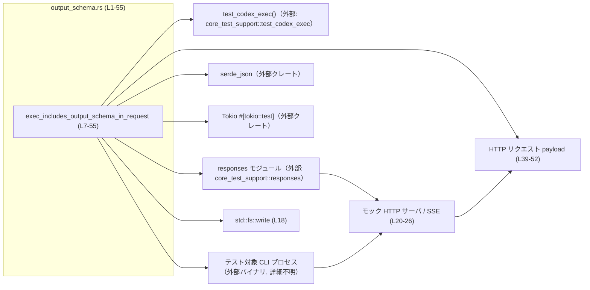
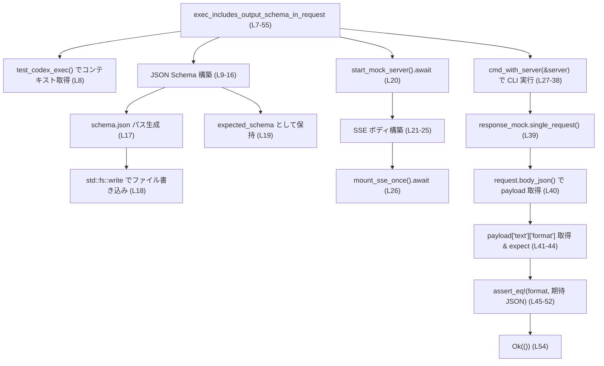
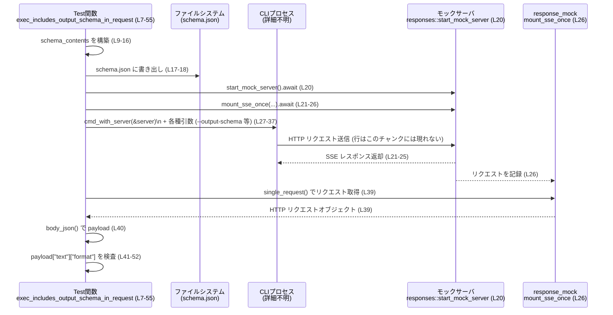

# exec/tests/suite/output_schema.rs コード解説

## 0. ざっくり一言

`--output-schema` フラグ付きで CLI を実行したとき、HTTP リクエストの `text.format` フィールドに JSON Schema が正しく埋め込まれることを、モックサーバと SSE レスポンスを使って検証する非同期テストです（`output_schema.rs:L1-55`）。

---

## 1. このモジュールの役割

### 1.1 概要

- このモジュールは、CLI 実行系（おそらく「codex exec」相当）が **`--output-schema` 引数で指定された JSON Schema ファイルを、リクエストの `text.format.schema` にそのまま載せる** ことを検証します（`output_schema.rs:L9-19, L32-38, L45-52`）。
- モックサーバ（Server-Sent Events, SSE）とテスト用ヘルパを使い、実際に CLI を起動して HTTP リクエストをキャプチャする「ブラックボックステスト」の形になっています（`output_schema.rs:L20-27, L39-40`）。
- テストは Tokio のマルチスレッドランタイム上で非同期に実行され、I/O（ファイル書き込み・HTTP）には `?` 演算子でエラー伝播を行います（`output_schema.rs:L6, L18`）。

### 1.2 アーキテクチャ内での位置づけ

このテスト関数と、その周辺コンポーネントの依存関係を簡略図で示します。



- テスト本体は `exec_includes_output_schema_in_request` 関数（`output_schema.rs:L7-55`）です。
- `test_codex_exec()` はテスト用のラッパ（作業ディレクトリ・コマンド実行ヘルパ）を返すと推測されますが、実装はこのチャンクには現れません（`output_schema.rs:L8`）。
- `responses` モジュールはモックサーバの起動と SSE レスポンスの構築・マウントを担っていることが関数名から読み取れます（`output_schema.rs:L20-26`）。
- CLI プロセス本体は `test.cmd_with_server(&server)` の先で起動されますが、どのバイナリかはこのチャンクからは分かりません（`output_schema.rs:L27-38`）。

### 1.3 設計上のポイント

コードから読み取れる設計上の特徴は次のとおりです。

- **プラットフォーム限定のテスト**  
  - ファイル先頭で Windows を除外しています（`#![cfg(not(target_os = "windows"))]`, `output_schema.rs:L1`）。
- **静的解析（Clippy）への対応**  
  - テスト内で `expect` / `unwrap` を使うことを許可しています（`#![allow(clippy::expect_used, clippy::unwrap_used)]`, `output_schema.rs:L2`）。
- **非同期・マルチスレッド実行**  
  - `#[tokio::test(flavor = "multi_thread", worker_threads = 2)]` により、Tokio のマルチスレッドランタイムでテストを実行します（`output_schema.rs:L6`）。
- **外部依存を使った高レベル検証**  
  - 実シリアライズされた HTTP ボディ（`request.body_json()`）を検査することで、内部実装ではなく外部インターフェースを検証しています（`output_schema.rs:L39-52`）。
- **JSON Schema をファイル経由で指定**  
  - `serde_json::json!` でスキーマを構築し（`output_schema.rs:L9-16`）、`schema.json` としてディスクに書き出したうえで CLI に渡しています（`output_schema.rs:L17-18, L32-38`）。

---

## 2. 主要な機能一覧（コンポーネントインベントリー）

このファイル内で定義・利用される主要コンポーネントを一覧化します。

### 2.1 関数・テスト関数

| 名前 | 種別 | 役割 / 用途 | 定義/使用行 |
|------|------|-------------|-------------|
| `exec_includes_output_schema_in_request` | 非同期テスト関数 | CLI が `--output-schema` で指定された JSON Schema を `text.format.schema` に含めることを検証する | 定義: `output_schema.rs:L7-55` |

### 2.2 外部ヘルパ・モジュール（このチャンクでは定義されないもの）

| 名前 | 出典 | 種別 | 役割 / 用途（名称から読み取れる範囲） | 使用行 |
|------|------|------|--------------------------------------|--------|
| `core_test_support::test_codex_exec::test_codex_exec` | 外部クレート / モジュール | 関数 | テスト用に CLI 実行環境（カレントディレクトリ・コマンドビルダ等）を準備するヘルパと推測されます（実装は不明） | `output_schema.rs:L3, L8` |
| `core_test_support::responses` | 外部クレート / モジュール | モジュール | モック HTTP サーバの起動と SSE イベントの構築・マウントを行うテストヘルパ群と推測されます（実装は不明） | `output_schema.rs:L3, L20-26` |
| `responses::start_mock_server` | 同上 | 関数 | モックサーバを起動しハンドルを返すと読み取れます | `output_schema.rs:L20` |
| `responses::sse` | 同上 | 関数 | SSE イベント列からモックレスポンスボディを構築すると読み取れます | `output_schema.rs:L21` |
| `responses::ev_response_created` | 同上 | 関数 | 「レスポンス作成」SSE イベントを生成すると読み取れます | `output_schema.rs:L22` |
| `responses::ev_assistant_message` | 同上 | 関数 | アシスタントメッセージ用 SSE イベントを生成すると読み取れます | `output_schema.rs:L23` |
| `responses::ev_completed` | 同上 | 関数 | 完了イベント用 SSE イベントを生成すると読み取れます | `output_schema.rs:L24` |
| `responses::mount_sse_once` | 同上 | 関数 | 指定した SSE レスポンスをサーバに 1 回だけマウントし、リクエスト記録オブジェクトを返すと読み取れます | `output_schema.rs:L26` |
| `test.cmd_with_server` | `test_codex_exec()` が返す型のメソッド（推測） | メソッド | CLI をモックサーバに向けて起動するためのコマンドビルダ | `output_schema.rs:L27` |
| `response_mock.single_request` | `mount_sse_once` の戻り値のメソッド（推測） | メソッド | 受信した HTTP リクエストを 1 件取り出す | `output_schema.rs:L39` |
| `request.body_json` | request オブジェクトのメソッド（推測） | メソッド | HTTP リクエストボディを JSON としてパースして返す | `output_schema.rs:L40` |

### 2.3 型

このファイル内で新しく定義されている構造体・列挙体はありません。利用のみされている主な型は次の通りです。

| 名前 | 種別 | 出典 | 役割 / 用途 | 使用行 |
|------|------|------|-------------|--------|
| `serde_json::Value` | 列挙体（動的 JSON 値） | `serde_json` クレート | リクエストボディおよび期待されるスキーマの比較に用いる動的 JSON 表現 | `output_schema.rs:L5, L19, L40` |

---

## 3. 公開 API と詳細解説

このファイル自体はテスト用であり、ライブラリとして外部に公開される API はありません。  
ただし、テストの振る舞いを理解しやすくするために、唯一のテスト関数について詳しく解説します。

### 3.1 型一覧（構造体・列挙体など）

このチャンクで新たに定義される型はありません。

---

### 3.2 関数詳細

#### `exec_includes_output_schema_in_request() -> anyhow::Result<()>`

**概要**

- Tokio のマルチスレッドランタイム上で動作する非同期テストです（`output_schema.rs:L6-7`）。
- JSON Schema をファイルとして保存し、そのパスを `--output-schema` フラグで CLI に渡したとき、送信される HTTP リクエストの `text.format` が期待通りの JSON オブジェクトになっていることを検証します（`output_schema.rs:L9-19, L32-38, L45-52`）。

**引数**

- このテスト関数は引数を取りません（`output_schema.rs:L7`）。

**戻り値**

- 戻り値の型は `anyhow::Result<()>` です（`output_schema.rs:L7`）。
  - 正常終了時は `Ok(())` を返します（`output_schema.rs:L54`）。
  - I/O エラーやシリアライズエラー等が発生した場合は `Err(anyhow::Error)` が返されます。これは `?` 演算子を通じて暗黙に伝播されます（`output_schema.rs:L18`）。

**内部処理の流れ（アルゴリズム）**

処理をステップに分解すると次のようになります。

1. **テスト用環境オブジェクトの取得**  
   - `let test = test_codex_exec();` でテスト専用のコンテキストを取得します（`output_schema.rs:L8`）。
   - ここで返される型の詳細は、このチャンクには現れません。

2. **JSON Schema オブジェクトの構築とファイルへの書き出し**  
   - `serde_json::json!` マクロで JSON Schema を生成します（`output_schema.rs:L9-16`）。内容は:
     - ルートが `"type": "object"`
     - `"properties.answer.type" == "string"`
     - `"required": ["answer"]`
     - `"additionalProperties": false`
   - テストのカレントディレクトリ配下に `schema.json` を指すパスを作成します（`output_schema.rs:L17`）。
   - `std::fs::write` で `schema.json` にこの JSON を pretty-print なバイト列として書き込みます（`output_schema.rs:L18`）。
   - 比較用に `expected_schema: Value` として `schema_contents` を保存します（`output_schema.rs:L19`）。

3. **モックサーバと SSE レスポンスのセットアップ**  
   - `responses::start_mock_server().await` でモック HTTP サーバを起動します（`output_schema.rs:L20`）。
   - `responses::sse` と複数の `ev_*` 関数で、SSE ベースのレスポンスボディを構築します（`output_schema.rs:L21-25`）。
   - `responses::mount_sse_once(&server, body).await` で、この SSE レスポンスを 1 回だけ返すようモックサーバにマウントし、リクエストを記録するハンドル（`response_mock`）を受け取ります（`output_schema.rs:L26`）。

4. **CLI コマンドの構築と実行**  
   - `test.cmd_with_server(&server)` からコマンドビルダを取得し（`output_schema.rs:L27`）、メソッドチェーンで次の引数を追加します（`output_schema.rs:L28-37`）。
     - `--skip-git-repo-check`
     - `-C <test.cwd_path()>`（コメントから、「フラグの動作もテストしたい」という意図が読み取れます, `output_schema.rs:L29-31`）
     - `--output-schema <schema_path>`（`output_schema.rs:L32-33`）
     - `-m gpt-5.1`（`output_schema.rs:L34-35`）
     - 引数 `"tell me a joke"`（`output_schema.rs:L36`）
   - `.assert().success();` により、コマンドが成功終了（ステータスコード 0）であることを検証します（`output_schema.rs:L37-38`）。

5. **送信された HTTP リクエストの取得と JSON パース**  
   - `let request = response_mock.single_request();` で、モックサーバが受信した HTTP リクエストを 1 件取得します（`output_schema.rs:L39`）。
   - `let payload: Value = request.body_json();` で、そのボディを JSON としてパースし `serde_json::Value` として保持します（`output_schema.rs:L40`）。

6. **`text.format` フィールドの検証**  
   - `payload.get("text")` で `text` フィールドを取得し、存在しない場合は `expect("request missing text field")` で panic にします（`output_schema.rs:L41`）。
   - `text.get("format")` で `format` フィールドを取得し、同様に `expect("request missing text.format field")` で存在を強制します（`output_schema.rs:L42-44`）。
   - `assert_eq!` で `format` が次の JSON と等しいことを検証します（`output_schema.rs:L45-52`）:

     ```json
     {
       "name": "codex_output_schema",
       "type": "json_schema",
       "strict": true,
       "schema": <expected_schema>
     }
     ```

     ここで `<expected_schema>` はステップ 2 で作成した JSON Schema そのものです（`output_schema.rs:L19`）。

7. **正常終了**  
   - 検証がすべて通れば `Ok(())` を返し、テスト成功となります（`output_schema.rs:L54`）。

**内部処理フロー図**



**Examples（使用例）**

この関数自体はテストランナーによって自動的に呼び出され、他のコードから直接呼び出すことは想定されていません。  
ただし、「このテストパターンを真似て別のフラグを検証する」という観点で参考になる簡略化例を示します。

```rust
// 別のテスト例: --foo-json フラグが text.foo_format に反映されることを検証するイメージ
#[tokio::test(flavor = "multi_thread", worker_threads = 2)]
async fn cli_includes_custom_json_in_request() -> anyhow::Result<()> {
    let test = test_codex_exec();                          // テストコンテキストを取得

    // JSON コンテンツを構築してファイルに書き出す
    let json_contents = serde_json::json!({ "foo": 123 }); // 任意の JSON
    let json_path = test.cwd_path().join("foo.json");      // 作業ディレクトリ配下の foo.json
    std::fs::write(&json_path, serde_json::to_vec_pretty(&json_contents)?)?;

    // モックサーバと SSE レスポンスを準備
    let server = responses::start_mock_server().await;
    let body = responses::sse(vec![
        responses::ev_response_created("resp1"),
        responses::ev_completed("resp1"),
    ]);
    let response_mock = responses::mount_sse_once(&server, body).await;

    // CLI を実行
    test.cmd_with_server(&server)
        .arg("--foo-json")
        .arg(&json_path)
        .arg("some prompt")
        .assert()
        .success();

    // リクエストの検証
    let request = response_mock.single_request();
    let payload: serde_json::Value = request.body_json();
    let foo_format = payload
        .get("text").expect("missing text")
        .get("foo_format").expect("missing text.foo_format");

    assert_eq!(foo_format, &json_contents);                // JSON がそのまま載っていることを検証

    Ok(())
}
```

上記はあくまでパターン例であり、`--foo-json` や `text.foo_format` といったフィールドが実際に存在するかどうかはこのチャンクからは分かりません。

**Errors / Panics**

この関数のエラーハンドリングと panic の可能性は次の通りです。

- `Result` 経由で返るエラー（`?` 演算子, `output_schema.rs:L18`）
  - `serde_json::to_vec_pretty(&schema_contents)` の失敗  
    → JSON シリアライズエラー。
  - `std::fs::write(&schema_path, ...)` の失敗  
    → ファイル書き込みエラー（パーミッション・ディスクフル等）。
  - `responses::start_mock_server().await` / `responses::mount_sse_once(...).await` が `Result` を返している場合  
    → モックサーバ起動やマウントの失敗（詳細はこのチャンクには現れません）。

- panic の可能性（`expect`・`assert_eq!`・その他）:
  - `payload.get("text").expect("request missing text field")`  
    → `payload` に `"text"` フィールドが存在しない場合、panic します（`output_schema.rs:L41`）。
  - `text.get("format").expect("request missing text.format field")`  
    → `text` に `"format"` フィールドが存在しない場合、panic します（`output_schema.rs:L42-44`）。
  - `assert_eq!`  
    → `format` の値が期待される JSON と一致しない場合、テスト失敗（panic）となります（`output_schema.rs:L45-52`）。

**Edge cases（エッジケース）**

コードから読み取れる代表的なエッジケースは次のとおりです。

- **JSON Schema ファイル関連**
  - `schema.json` が書き込めない場合（ディレクトリ無し・権限不足など）  
    → `std::fs::write` がエラーを返し、`?` により `Err` が返ってテストは失敗します（`output_schema.rs:L17-18`）。
  - 大きな Schema を書き込む場合  
    → コード上はサイズ制限などなく、そのまま `serde_json::to_vec_pretty` と `std::fs::write` に渡されます（`output_schema.rs:L9-18`）。

- **HTTP リクエスト構造**
  - CLI 実装が `text` フィールドを送らない場合  
    → `payload.get("text")` が `None` となり、`expect` により panic します（`output_schema.rs:L41`）。
  - `text.format` が存在しない場合  
    → `text.get("format")` が `None` となり、同様に panic します（`output_schema.rs:L42-44`）。
  - `text.format.schema` の内容が `schema.json` と異なる場合  
    → `assert_eq!` で不一致となり、テストが失敗します（`output_schema.rs:L45-52`）。

**使用上の注意点**

- **Tokio ランタイムの制約**  
  - `#[tokio::test(flavor = "multi_thread", worker_threads = 2)]` でマルチスレッドランタイムが自動的に用意されるため、この関数内で別途ランタイムを生成する必要はありません（`output_schema.rs:L6`）。
- **プラットフォーム依存**  
  - `#![cfg(not(target_os = "windows"))]` により Windows ではコンパイルすらされません（`output_schema.rs:L1`）。Windows 向けのテストが必要な場合は別のファイル／条件付きコンパイルが必要です。
- **Clippy の lint 設定**  
  - `expect` の利用はテストでは一般的ですが、本ファイルでは明示的に lint を無効化しています（`output_schema.rs:L2`）。プロダクションコードに同様の設定を持ち込むと静的解析の意義が薄れるため、テスト限定であることに注意が必要です。
- **Bugs / Security 上の注意**
  - テストで扱う JSON Schema はローカルファイル `schema.json` から読み込まれますが、このテストでは CLI 側が任意の Schema をそのままリクエストに載せることを前提にしています（`output_schema.rs:L9-19, L45-52`）。  
    セキュリティ観点では、実装側に入力検証がない場合、巨大なスキーマや悪意ある内容を送信できる可能性がありますが、その是非についてはこのチャンクだけでは判断できません。
  - ファイル名は固定 `"schema.json"` であり（`output_schema.rs:L17`）、テストが並列実行される環境では作業ディレクトリの分離が重要になります。`test_codex_exec()` が各テストごとに固有のディレクトリを用意している可能性がありますが、このチャンクだけでは断定できません。

---

### 3.3 その他の関数

このファイル内で定義されている関数は上記 1 件のみです。  
補助的な処理はすべて外部ヘルパやメソッドチェーンとして呼び出されており、ここでは追加の関数一覧はありません。

---

## 4. データフロー

このテストにおける代表的なデータフローは、「JSON Schema → ファイル → CLI 引数 → HTTP リクエスト body.text.format.schema」という流れです。

### 4.1 データフロー概要

1. Rust オブジェクトとして JSON Schema を構築（`serde_json::json!`, `output_schema.rs:L9-16`）。
2. それを pretty-print な JSON として `schema.json` に書き出し（`output_schema.rs:L17-18`）。
3. CLI 実行時に `--output-schema schema.json` としてファイルパスを渡す（`output_schema.rs:L32-33`）。
4. CLI が外部 API へ送る HTTP リクエストをモックサーバが受信し（`output_schema.rs:L20-26`）、テスト側でそのボディを `serde_json::Value` として取得（`output_schema.rs:L39-40`）。
5. `payload["text"]["format"]` を取り出し、`schema` フィールドが元の `schema_contents` と一致することを確認する（`output_schema.rs:L41-52`）。

### 4.2 シーケンス図



---

## 5. 使い方（How to Use）

このファイルはテスト専用ですので、「使い方」は「同様のテストを書き足す・変更する際の手順」として説明します。

### 5.1 基本的な使用方法（テストパターンとしての利用）

このモジュールのパターンを用いて、新しいフラグや出力形式を検証する基本フローは次のようになります。

```rust
#[tokio::test(flavor = "multi_thread", worker_threads = 2)]    // マルチスレッドランタイムで実行 (L6)
async fn some_cli_behavior_is_tested() -> anyhow::Result<()> {
    let test = test_codex_exec();                              // テストコンテキスト取得 (L8)

    // 1. 必要ならファイルを準備（ここでは JSON Schema と同様）
    let contents = serde_json::json!({ "key": "value" });      // 任意の JSON
    let path = test.cwd_path().join("input.json");             // 作業ディレクトリ配下にファイルパス (類似: L17)
    std::fs::write(&path, serde_json::to_vec_pretty(&contents)?)?; // ファイルに書き出し (類似: L18)

    // 2. モックサーバ + SSE レスポンスを準備 (L20-26)
    let server = responses::start_mock_server().await;
    let body = responses::sse(vec![
        responses::ev_response_created("resp1"),
        responses::ev_completed("resp1"),
    ]);
    let response_mock = responses::mount_sse_once(&server, body).await;

    // 3. CLI を実行し、期待するフラグを渡す (L27-37)
    test.cmd_with_server(&server)
        .arg("--some-flag")
        .arg(&path)
        .arg("some prompt")
        .assert()
        .success();

    // 4. リクエストを取得して検証 (L39-52)
    let request = response_mock.single_request();
    let payload: serde_json::Value = request.body_json();
    // payload の内容を検証する ...
    // 例: assert!(payload.get("text").is_some());

    Ok(())
}
```

このように、「テストコンテキストの取得 → 必要な事前ファイルの準備 → モックサーバのセットアップ → CLI 実行 → リクエスト検証」という流れが基本となります。

### 5.2 よくある使用パターン

コードから読み取れる範囲での使用パターンは次のとおりです。

- **パターン 1: ファイルベース設定の伝播確認**
  - JSON などの構成ファイルを作成し（`output_schema.rs:L9-18`）、CLI にそのパスを渡して（`output_schema.rs:L32-33`）、実際に送信されるリクエストに反映されているか確認する（`output_schema.rs:L39-52`）。

- **パターン 2: SSE を使った非同期レスポンスのモック**
  - `responses::sse` と `ev_*` 関数を使い、CLI が期待する SSE イベントのシーケンスを構成する（`output_schema.rs:L21-25`）。
  - `mount_sse_once` により 1 リクエスト分のモックレスポンスを登録し、`single_request` で対応する HTTP リクエストを検証する（`output_schema.rs:L26, L39`）。

### 5.3 よくある間違い（このコードを変更する際の注意点）

このファイルを編集・拡張する際に起こり得る誤りを、コードの構造から推測できる範囲で挙げます。

```rust
// 誤り例: キー名を変えたのに expect のメッセージや取得箇所を直していない
let text = payload.get("body").expect("request missing text field");
// ↑ payload["text"] -> payload["body"] に変えたのに、メッセージが "text field" のまま

// 正しい例: キー名を変えるときは、取得部分とメッセージを一貫して修正する
let text = payload.get("body").expect("request missing body field");
```

- `payload.get("text")` / `text.get("format")` のキー名を変更する場合は、テストの意図が変わるため、コメントや `expect` メッセージも合わせて修正する必要があります（`output_schema.rs:L41-44`）。
- `schema_contents` の構造を変えたのに `assert_eq!` 側を更新し忘れると、不一致でテストが壊れます（`output_schema.rs:L9-16, L45-52`）。

### 5.4 使用上の注意点（まとめ）

- テストは Windows ではコンパイルされません（`output_schema.rs:L1`）。
- 非同期テストであるため、モックサーバ呼び出しにはすべて `.await` を付ける必要があります（`output_schema.rs:L20, L26`）。
- `anyhow::Result<()>` を返しているため、`?` によるエラー伝播が発生しうる箇所を増やす際は、エラーの意味（I/O, ネットワークなど）がテストとして妥当かを確認する必要があります（`output_schema.rs:L18`）。
- `schema.json` のパスなど、ファイル名を固定文字列にしている箇所を変更する際は、他のテストやクリーンアップ処理との整合性に注意する必要があります（`output_schema.rs:L17`）。

---

## 6. 変更の仕方（How to Modify）

### 6.1 新しい機能（別の出力形式など）を検証するテストを追加する場合

1. **ファイルの準備**
   - 必要であれば、新しいテスト関数内で JSON などの入力ファイルを作成します。`schema_contents` → `std::fs::write` のパターンが参考になります（`output_schema.rs:L9-18`）。

2. **モックサーバのセットアップ**
   - `responses::start_mock_server().await` → `responses::sse(...)` → `responses::mount_sse_once(&server, body).await` の流れを踏襲します（`output_schema.rs:L20-26`）。

3. **CLI 実行部分の構築**
   - `test.cmd_with_server(&server)` を起点に、必要なフラグを `.arg(...)` で積み上げていきます（`output_schema.rs:L27-37`）。
   - 新しいフラグ（例: `--another-flag`）やモデル指定（`-m`）などもこの部分で追加します。

4. **検証ロジックの追加**
   - `response_mock.single_request()` → `request.body_json()` の流れで JSON を取得し（`output_schema.rs:L39-40`）、検証したいフィールドを `get` で辿って `assert_eq!` / `assert!` で検証します（`output_schema.rs:L41-52`）。

### 6.2 既存の機能（出力スキーマの仕様）が変わった場合の修正

仕様変更で `text.format` の構造が変わった場合に、影響する箇所と注意点を挙げます。

- **影響箇所**
  - 期待値としてハードコードしている JSON 部分（`output_schema.rs:L45-52`）。
  - JSON Schema の構造そのもの（`output_schema.rs:L9-16`）。
  - パスやフラグ名が変わる場合は CLI 実行部分（`output_schema.rs:L32-37`）。

- **契約（前提条件）の確認**
  - 「CLI は `--output-schema <path>` を受け取り、HTTP リクエストに `text.format.schema` として含める」という前提が崩れる場合、テスト名や Assertion の内容も変更が必要です（`output_schema.rs:L7, L41-52`）。

- **関連テストの確認**
  - 同様のパターンで `text.*` フィールドを検証している他のテストが存在する可能性があります。  
    このチャンクには現れていませんが、プロジェクト全体での検索が推奨されます。

---

## 7. 関連ファイル

このモジュールと密接に関係する（とコードから読み取れる）ファイル・モジュールは次のとおりです。

| パス / モジュール | 役割 / 関係 |
|------------------|------------|
| `core_test_support::test_codex_exec` | `test_codex_exec()` を提供するモジュールです（`output_schema.rs:L3, L8`）。テスト用 CLI 実行環境（カレントディレクトリ・サーバとの接続設定など）を準備していると推測されますが、実装はこのチャンクには現れません。 |
| `core_test_support::responses` | モックサーバ起動・SSE レスポンス構築・マウント・リクエスト記録などのテストヘルパを提供するモジュールです（`output_schema.rs:L3, L20-26`）。 |
| テスト対象 CLI バイナリ | `test.cmd_with_server(&server)` により起動される実行ファイルです（`output_schema.rs:L27-38`）。実際のバイナリ名や場所はこのチャンクには現れません。 |
| `serde_json` クレート | JSON Schema の構築（`json!` マクロ）および HTTP ボディ JSON のパース（`Value`）に利用されます（`output_schema.rs:L5, L9-16, L19, L40, L47, L53`）。 |

このファイル単体では、プロジェクト全体のテスト戦略や他のテストファイルとの関係は分かりませんが、`core_test_support` 名前空間が「テスト基盤モジュール」であることが示唆されています。
