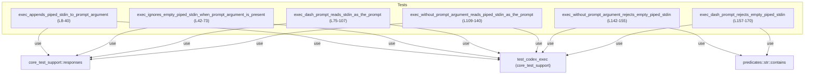
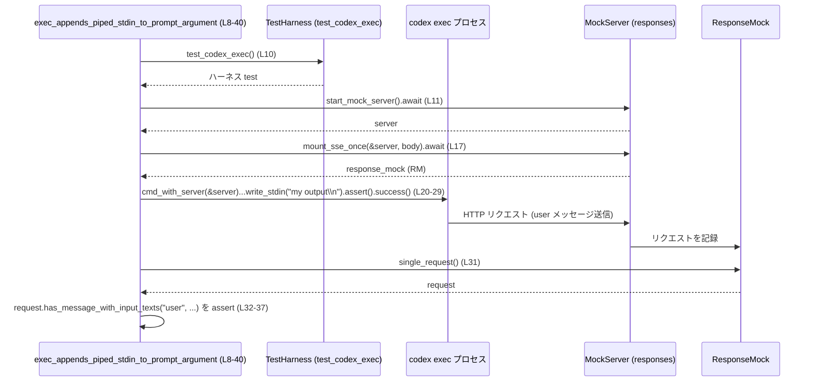

# exec/tests/suite/prompt_stdin.rs コード解説

## 0. ざっくり一言

`codex exec` サブコマンドが **標準入力（stdin）とプロンプト引数をどう扱うか** の挙動を、モック HTTP サーバーとテスト用 CLI ハーネスを使って検証するテストモジュールです（`prompt_stdin.rs:L1-6`）。

---

## 1. このモジュールの役割

### 1.1 概要

- このモジュールは、`codex exec` コマンドが以下の状況でどのような **「ユーザープロンプト」** を外部サービスに送信するかを検証します（`prompt_stdin.rs:L8-140`）。
  - プロンプト引数あり／なし
  - `-`（ダッシュ）をプロンプトとして指定
  - 標準入力が空／非空
- 実際のコード実装には触れず、**HTTP リクエストの内容** と **プロセスの終了コード／標準エラー出力** を観察することで CLI の仕様をテストしています（`prompt_stdin.rs:L31-37, L65-70, L98-104, L131-137, L146-154, L161-170`）。

### 1.2 アーキテクチャ内での位置づけ

- 依存関係（このチャンクで明示されている範囲）:
  - `core_test_support::test_codex_exec::test_codex_exec`  
    → `codex exec` を起動・操作するテスト用ハーネスを生成（`prompt_stdin.rs:L5, L10, L44, L77, L111, L144, L159`）。
  - `core_test_support::responses`  
    → モック HTTP サーバーの起動と SSE レスポンスの組み立て・マウントを提供（`prompt_stdin.rs:L4, L11-17, L45-51, L78-84, L112-118`）。
  - `predicates::str::contains`  
    → エラーメッセージを部分一致で検証するための述語（`prompt_stdin.rs:L6, L154, L170`）。
  - Tokio ランタイム（非同期テスト用）  
    → `#[tokio::test(flavor = "multi_thread", worker_threads = 2)]` で multi-thread 実行（`prompt_stdin.rs:L8, L42, L75, L109`）。

- モジュールレベル属性:
  - `#![cfg(not(target_os = "windows"))]` により、このテストは Windows ではコンパイル／実行されません（`prompt_stdin.rs:L1`）。
  - `#![allow(clippy::expect_used, clippy::unwrap_used)]` で Clippy の lint を緩和していますが、このチャンク内には `expect` / `unwrap` 呼び出しはありません（`prompt_stdin.rs:L2`）。

依存関係を簡略に示すと次のようになります（テストコード視点、対象: `prompt_stdin.rs:L1-171`）。



### 1.3 設計上のポイント

- **プラットフォーム条件**  
  - `cfg(not(target_os = "windows"))` により、UNIX 系 OS のみ対象としています（`prompt_stdin.rs:L1`）。
- **非同期テストとモックサーバー**  
  - HTTP リクエスト内容を検証する 4 つのテストは `#[tokio::test(flavor = "multi_thread", worker_threads = 2)]` を使用しており、Tokio のマルチスレッドランタイム上で動作します（`prompt_stdin.rs:L8, L42, L75, L109`）。
  - それぞれ独自のモックサーバーを立ち上げ、SSE ストリームを 1 回だけ返すように構成しています（`prompt_stdin.rs:L11-17, L45-51, L78-84, L112-118`）。
- **CLI プロセスの起動と検証**  
  - CLI は `test_codex_exec()` が返すハーネスの `cmd()` / `cmd_with_server()` を通して起動されます（`prompt_stdin.rs:L10, L20, L44, L54, L77, L87, L111, L121, L144, L147, L159, L162`）。
  - 実行後は `.assert().success()` で成功、または `.assert().code(1)` で異常終了コードを検証しています（`prompt_stdin.rs:L28-29, L62-63, L95-96, L128-129, L152-153, L168-169`）。
- **外部サービスへのリクエスト検証**  
  - `response_mock.single_request()` が返すリクエストオブジェクトに対して `has_message_with_input_texts` を呼び出し、「user ロール」のメッセージ内容を配列として検証しています（`prompt_stdin.rs:L31-37, L65-70, L98-104, L131-137`）。
- **エラー検証**  
  - プロンプトが決定できないケースでは exit code 1 と、`"No prompt provided via stdin."` を含む標準エラー出力を期待しています（`prompt_stdin.rs:L146-154, L161-170`）。

### 1.4 コンポーネント一覧（インベントリー）

このモジュール内で定義されている関数（すべてテスト関数）の一覧です。

| 名前 | 種別 | 役割 / 用途 | 行範囲 |
|------|------|-------------|--------|
| `exec_appends_piped_stdin_to_prompt_argument` | 非同期テスト関数 | プロンプト引数と非空 stdin がある場合、メッセージに両方が含まれることを検証 | `prompt_stdin.rs:L8-40` |
| `exec_ignores_empty_piped_stdin_when_prompt_argument_is_present` | 非同期テスト関数 | プロンプト引数があり stdin が空のとき、stdin が無視されることを検証 | `prompt_stdin.rs:L42-73` |
| `exec_dash_prompt_reads_stdin_as_the_prompt` | 非同期テスト関数 | プロンプトとして `-` を指定した場合、stdin 全体がプロンプトになることを検証 | `prompt_stdin.rs:L75-107` |
| `exec_without_prompt_argument_reads_piped_stdin_as_the_prompt` | 非同期テスト関数 | プロンプト引数なしで非空 stdin の場合、stdin がプロンプトとして使われることを検証 | `prompt_stdin.rs:L109-140` |
| `exec_without_prompt_argument_rejects_empty_piped_stdin` | 同期テスト関数 | プロンプト引数も stdin も空のとき、エラー終了することを検証 | `prompt_stdin.rs:L142-155` |
| `exec_dash_prompt_rejects_empty_piped_stdin` | 同期テスト関数 | プロンプト `-` で stdin が空のとき、エラー終了することを検証 | `prompt_stdin.rs:L157-170` |

---

## 2. 主要な機能一覧

ここでは「機能」を、このテストが前提としている **CLI の外部仕様** として整理します。

- 「プロンプト引数 + 非空 stdin」:  
  プロンプト引数に続き、空行と `<stdin> ... </stdin>` ブロックで stdin 内容が追記される（`prompt_stdin.rs:L20-29, L31-37`）。
- 「プロンプト引数 + 空 stdin」:  
  stdin が空の場合、プロンプト引数のみがメッセージとして送信される（`prompt_stdin.rs:L54-63, L65-70`）。
- 「プロンプト `-` + 非空 stdin」:  
  `-` が指定されると、stdin 内容そのものが user メッセージになる（`prompt_stdin.rs:L87-96, L98-104`）。
- 「プロンプト引数なし + 非空 stdin」:  
  引数にプロンプトが無くても、stdin が非空であればそれが user メッセージとして送信される（`prompt_stdin.rs:L121-129, L131-137`）。
- 「プロンプト引数なし + 空 stdin」:  
  exit code 1 で異常終了し、標準エラーに `"No prompt provided via stdin."` を出力する（`prompt_stdin.rs:L142-155`）。
- 「プロンプト `-` + 空 stdin」:  
  同様に exit code 1 で異常終了し、標準エラーに同じメッセージを出力する（`prompt_stdin.rs:L157-170`）。

---

## 3. 公開 API と詳細解説

このモジュールは単体で再利用される「公開 API」は定義していません（`pub` 項目がありません, `prompt_stdin.rs:L8-170`）。  
ここではテスト関数を「CLI の仕様を表す API ドキュメント」とみなし、詳細を整理します。

### 3.1 型一覧（構造体・列挙体など）

このファイル内に新しく定義された型はありません（`prompt_stdin.rs:L1-171`）。  
ただし、外部から利用している代表的な型／オブジェクトは以下の通りです（型名はコードからは不明であり、ここでは変数名と役割のみを記述します）。

| 変数名 / メソッド | 出どころ | 役割 / 用途 | 根拠 |
|------------------|----------|-------------|------|
| `test` | `test_codex_exec()` の戻り値 | `cmd()` / `cmd_with_server()` により `codex exec` を起動するテストハーネス | `prompt_stdin.rs:L10, L44, L77, L111, L144, L159` |
| `server` | `responses::start_mock_server()` の戻り値 | HTTP モックサーバー（SSE を返す） | `prompt_stdin.rs:L11, L45, L78, L112` |
| `response_mock` | `responses::mount_sse_once(&server, body)` の戻り値 | サーバーに届いたリクエストを 1 件保持し、`single_request()` で取得する | `prompt_stdin.rs:L17, L51, L84, L118` |
| `request` | `response_mock.single_request()` の戻り値 | `has_message_with_input_texts` により user メッセージを検査するオブジェクト | `prompt_stdin.rs:L31-36, L65-69, L98-103, L131-136` |

### 3.2 関数詳細（テスト 6 件）

#### `exec_appends_piped_stdin_to_prompt_argument() -> anyhow::Result<()>`

**概要**

- `codex exec` に **プロンプト引数 + 非空の piped stdin** を与えた場合、送信される user メッセージが  
  「プロンプト引数 → 空行 → `<stdin>` ブロックで囲まれた stdin 内容」の形式になることを検証します（`prompt_stdin.rs:L19-29, L31-37`）。

**引数**

- 引数はありません（テスト関数のため）。

**戻り値**

- `anyhow::Result<()>`  
  - テストが成功すると `Ok(())` を返します（`prompt_stdin.rs:L39`）。  
  - テスト失敗時は `assert!` パニックにより終了するため、`Err` は実質的には使用されません。

**内部処理の流れ**

1. テストハーネスとモックサーバーの初期化（`prompt_stdin.rs:L10-17`）
   - `test_codex_exec()` で CLI ハーネスを取得。
   - `responses::start_mock_server().await` でモック HTTP サーバーを起動。
   - `responses::sse([...])` で SSE イベントの配列を組み立て（レスポンス内容はテストでは未検証）。
   - `responses::mount_sse_once(&server, body).await` で、サーバーに 1 回だけ SSE を返すよう設定。
2. CLI プロセスの起動（`prompt_stdin.rs:L19-29`）
   - `test.cmd_with_server(&server)` でモックサーバーに接続する `codex exec` コマンドを構築。
   - `--skip-git-repo-check`, `-C <cwd>`, `-m gpt-5.1`, `"Summarize this concisely"` を引数として追加。
   - `.write_stdin("my output\n")` で stdin に文字列 `"my output\n"` を与える。
   - `.assert().success()` でプロセスが正常終了することを検証。
3. 送信されたリクエストの検証（`prompt_stdin.rs:L31-37`）
   - `response_mock.single_request()` でサーバーに届いたリクエストを 1 件取得。
   - `request.has_message_with_input_texts("user", |texts| { ... })` で user メッセージの内容を配列として検査。
   - 配列 `texts` が  
     `["Summarize this concisely\n\n<stdin>\nmy output\n</stdin>".to_string()]`  
     と完全一致することを `assert!` で検証。

**Examples（使用例）**

このテストは、次のようなシェルコマンドに対応しています（コメントとして明示されています, `prompt_stdin.rs:L19`）。

```sh
echo "my output" \
  | codex exec --skip-git-repo-check -C <cwd> -m gpt-5.1 "Summarize this concisely"
```

テストから読み取れる仕様としては、外部サービスに送信される user メッセージは次の 1 要素配列です。

```text
"Summarize this concisely

<stdin>
my output
</stdin>"
```

**Errors / Panics**

- このテストに関する限り:
  - CLI プロセスは **正常終了** することが期待されています（`prompt_stdin.rs:L28-29`）。
  - `assert!` による失敗時はテストがパニックします（`prompt_stdin.rs:L32-37`）。

**Edge cases（エッジケース）**

- stdin に含まれるのは `"my output\n"` という 1 行のみであり、複数行や空行混在のケースは別途テストされていません（`prompt_stdin.rs:L27`）。
- `<stdin>` / `</stdin>` タグで囲むフォーマットが固定であることを前提としています（`prompt_stdin.rs:L34`）。

**使用上の注意点**

- このテストは **プロンプト引数が必須** であるケースを対象としており、プロンプト引数がない状況は他のテストで扱われています。
- `<stdin>` ブロックを挿入する仕様を変更した場合、このテストの期待文字列も変更が必要になります（`prompt_stdin.rs:L34`）。

---

#### `exec_ignores_empty_piped_stdin_when_prompt_argument_is_present() -> anyhow::Result<()>`

**概要**

- プロンプト引数が与えられていても、stdin が空文字列の場合は **stdin を無視** し、プロンプト引数だけが user メッセージになることを検証します（`prompt_stdin.rs:L53-63, L65-70`）。

**内部処理の流れ**

1. 初期化処理は前述テストと同様（モックサーバー + SSE）（`prompt_stdin.rs:L44-51`）。
2. CLI 実行:
   - 引数は前のテストと同じですが、`write_stdin("")` で **空文字列** を stdin に送ります（`prompt_stdin.rs:L54-61`）。
   - `.assert().success()` で正常終了を確認（`prompt_stdin.rs:L62-63`）。
3. リクエスト検証:
   - user メッセージ配列が `["Summarize this concisely".to_string()]` の 1 要素のみになることを検証します（`prompt_stdin.rs:L65-69`）。

**Edge cases**

- stdin は完全に空 (`""`) のケースのみが検証されています。  
  空行だけ（例: `"\n"`）が送られた場合の扱いは、このチャンクからは不明です。

**使用上の注意点**

- 「空の stdin は無視される」という仕様は、**プロンプト引数がある場合に限る** という点が重要です（プロンプト引数がない場合は別テストの通りエラーになります, `prompt_stdin.rs:L142-155`）。

---

#### `exec_dash_prompt_reads_stdin_as_the_prompt() -> anyhow::Result<()>`

**概要**

- プロンプトとして **単一の `-`** を指定した場合、stdin の内容そのものが user メッセージになることを検証します（`prompt_stdin.rs:L86-96, L98-104`）。

**内部処理の流れ**

1. 初期化（モックサーバー + SSE）は同様（`prompt_stdin.rs:L77-84`）。
2. CLI 実行:
   - 引数として `-` を指定しています（`prompt_stdin.rs:L87-93`）。
   - stdin に `"prompt from stdin\n"` を書き込みます（`prompt_stdin.rs:L94`）。
   - `.assert().success()` で正常終了を確認（`prompt_stdin.rs:L95-96`）。
3. リクエスト検証:
   - user メッセージ配列が `["prompt from stdin\n".to_string()]` の 1 要素のみであることを確認します（`prompt_stdin.rs:L98-102`）。

**Examples**

テストに対応するコマンド（コメント）:

```sh
echo "prompt from stdin" \
  | codex exec --skip-git-repo-check -C <cwd> -m gpt-5.1 -
```

**Edge cases**

- stdin が複数行の場合や非常に長い場合の挙動は、このテストでは扱われていません。
- `-` 以外の特殊値（空文字列、`"--"` など）に対する挙動はこのチャンクでは不明です。

**使用上の注意点**

- `-` を使うと **「プロンプト引数を完全に無効化し、stdin を唯一のプロンプトとして扱う」** 振る舞いになることを前提にしています（`prompt_stdin.rs:L92-95, L98-102`）。

---

#### `exec_without_prompt_argument_reads_piped_stdin_as_the_prompt() -> anyhow::Result<()>`

**概要**

- 明示的なプロンプト引数がない場合でも、stdin が非空であればその内容が user メッセージとして使用されることを検証します（`prompt_stdin.rs:L120-129, L131-137`）。

**内部処理の流れ**

1. 初期化（モックサーバー + SSE）は同様（`prompt_stdin.rs:L111-118`）。
2. CLI 実行:
   - プロンプト引数を指定せず、`-m gpt-5.1` の後ろに引数が続かない形でコマンドを構築します（`prompt_stdin.rs:L121-127`）。
   - stdin に `"prompt from stdin\n"` を書き込みます（`prompt_stdin.rs:L127`）。
   - `.assert().success()` で正常終了を確認します（`prompt_stdin.rs:L128-129`）。
3. リクエスト検証:
   - user メッセージ配列が `["prompt from stdin\n".to_string()]` となることを `assert!` で確認します（`prompt_stdin.rs:L131-135`）。

**Examples**

対応するコマンド（コメント）:

```sh
echo "prompt from stdin" \
  | codex exec --skip-git-repo-check -C <cwd> -m gpt-5.1
```

**使用上の注意点**

- 「プロンプト引数なし + 非空 stdin」であれば、`-` を使わなくても stdin がプロンプトになるという仕様を前提としています（`prompt_stdin.rs:L121-129, L131-135`）。
- 一方で stdin が空の場合は次のテストの通りエラーになります。

---

#### `exec_without_prompt_argument_rejects_empty_piped_stdin()`

**概要**

- プロンプト引数も指定せず、stdin も空だった場合に、`codex exec` が exit code 1 で失敗し、  
  `"No prompt provided via stdin."` を含むエラーメッセージを出力することを検証します（`prompt_stdin.rs:L142-155`）。

**戻り値**

- 戻り値は `()` （通常の同期テスト関数）です。

**内部処理の流れ**

1. テストハーネスを初期化（`test_codex_exec()`）（`prompt_stdin.rs:L144`）。
2. `test.cmd()` で `codex exec` コマンドを構築し、`--skip-git-repo-check`, `-C <cwd>` を指定します（`prompt_stdin.rs:L147-150`）。
3. `write_stdin("")` で空の stdin を与えます（`prompt_stdin.rs:L151`）。
4. `.assert().code(1)` で exit code が 1 であることを検証し、  
   `.stderr(contains("No prompt provided via stdin."))` で標準エラーに指定文字列が含まれることを確認します（`prompt_stdin.rs:L152-154`）。

**Edge cases**

- エラーメッセージの完全一致ではなく、`contains` による部分一致で検証しています（`prompt_stdin.rs:L6, L154`）。

**使用上の注意点**

- 「プロンプト引数なし」の場合、**stdin が空であればエラー** になる仕様です。  
  何らかのプロンプトを渡す必要があります（引数／`-`／非空 stdin のいずれか）。

---

#### `exec_dash_prompt_rejects_empty_piped_stdin()`

**概要**

- プロンプトとして `-` を指定したにもかかわらず stdin が空の場合に、  
  前テストと同じく exit code 1 と `"No prompt provided via stdin."` を期待通り出力することを検証します（`prompt_stdin.rs:L157-170`）。

**内部処理の流れ**

1. テストハーネス初期化（`prompt_stdin.rs:L159`）。
2. `test.cmd()` で `codex exec` を構築し、`--skip-git-repo-check`, `-C <cwd>`, `-` を指定（`prompt_stdin.rs:L162-166`）。
3. `write_stdin("")` で空の stdin を提供（`prompt_stdin.rs:L167`）。
4. `.assert().code(1)` と `.stderr(contains("No prompt provided via stdin."))` で検証（`prompt_stdin.rs:L168-170`）。

**使用上の注意点**

- `-` を使って「stdin からのみプロンプトを受け取る」モードにした場合、stdin が空だとエラーになる仕様がテストから読み取れます（`prompt_stdin.rs:L162-170`）。

---

### 3.3 その他の関数（外部ヘルパー）

このモジュール内には他の関数定義はありませんが、外部ヘルパーの役割を簡単にまとめます（シグネチャはこのチャンクからは不明です）。

| 関数 / メソッド名 | 出どころ | 役割（1 行） | 根拠 |
|-------------------|----------|--------------|------|
| `test_codex_exec()` | `core_test_support::test_codex_exec` | `codex exec` 用のテストハーネスを生成し、`cmd()` / `cmd_with_server()` を提供する | `prompt_stdin.rs:L5, L10, L44, L77, L111, L144, L159` |
| `responses::start_mock_server()` | `core_test_support::responses` | モック HTTP サーバーを起動する | `prompt_stdin.rs:L4, L11, L45, L78, L112` |
| `responses::sse(...)` | 同上 | SSE イベント列からレスポンスボディを生成する | `prompt_stdin.rs:L12-16, L46-50, L79-83, L113-117` |
| `responses::mount_sse_once(&server, body)` | 同上 | サーバーに SSE レスポンスを 1 回だけマウントし、リクエストを記録するモックを返す | `prompt_stdin.rs:L17, L51, L84, L118` |
| `response_mock.single_request()` | `mount_sse_once` の戻り値のメソッド | モックサーバーに届いた単一のリクエストを取得する | `prompt_stdin.rs:L31, L65, L98, L131` |
| `request.has_message_with_input_texts(...)` | `single_request()` の戻り値のメソッド | 指定ロールのメッセージ本文が、期待する文字列配列と一致するかを検証 | `prompt_stdin.rs:L32-36, L66-69, L99-103, L132-135` |

---

## 4. データフロー

代表的なシナリオとして、  
「プロンプト引数 + 非空 stdin」を扱う `exec_appends_piped_stdin_to_prompt_argument` のデータフローを示します（対象: `prompt_stdin.rs:L8-40`）。

### 4.1 処理の要点

- テストコードは **テストハーネス** を通じて `codex exec` プロセスを起動し、stdin に文字列を供給します（`prompt_stdin.rs:L10, L20-27`）。
- CLI プロセスはモック HTTP サーバーにリクエストを送り、user メッセージにプロンプト引数と stdin の両方を含めます（`prompt_stdin.rs:L31-36`）。
- モック側で記録されたリクエストを取り出し、メッセージ内容を検証します（`prompt_stdin.rs:L31-37`）。

### 4.2 シーケンス図



同期テスト（エラーケース）のデータフローは、モックサーバーが存在しない点を除き類似であり、  
`cmd()` から直接 CLI を起動し、終了コードと標準エラー出力を検証するのみです（`prompt_stdin.rs:L147-154, L162-170`）。

---

## 5. 使い方（How to Use）

ここでの「使い方」は主に二つの意味があります。

1. **CLI ユーザーとして**: `codex exec` の振る舞いを理解する。
2. **開発者として**: 同種のテストを追加する際のパターンを理解する。

### 5.1 基本的な使用方法（CLI 視点）

#### プロンプト引数 + 追加コンテキストとしての stdin

```sh
# prompt_stdin.rs:L19 に対応
echo "my output" \
  | codex exec --skip-git-repo-check -C <cwd> -m gpt-5.1 "Summarize this concisely"
```

このときテストが前提とする仕様:

- 外部サービスには、次の内容の **user メッセージ 1 件** が送信されます（`prompt_stdin.rs:L34`）。

```text
Summarize this concisely

<stdin>
my output
</stdin>
```

#### プロンプトをすべて stdin から渡す (`-` 使用)

```sh
# prompt_stdin.rs:L86 に対応
echo "prompt from stdin" \
  | codex exec --skip-git-repo-check -C <cwd> -m gpt-5.1 -
```

- user メッセージは `"prompt from stdin\n"` のみとなります（`prompt_stdin.rs:L101`）。

#### プロンプト引数なしで stdin のみをプロンプトにする

```sh
# prompt_stdin.rs:L120 に対応
echo "prompt from stdin" \
  | codex exec --skip-git-repo-check -C <cwd> -m gpt-5.1
```

- user メッセージは `"prompt from stdin\n"` のみです（`prompt_stdin.rs:L134`）。

### 5.2 よくある使用パターン（テスト視点）

1. **HTTP リクエスト内容の検証パターン**

```rust
// モックサーバーと SSE の設定（L10-17 と同様）
let test = test_codex_exec();                            // CLI テストハーネスの取得
let server = responses::start_mock_server().await;       // モック HTTP サーバー起動
let body = responses::sse(vec![
    responses::ev_response_created("resp1"),
    responses::ev_assistant_message("m1", "fixture hello"),
    responses::ev_completed("resp1"),
]);
let response_mock = responses::mount_sse_once(&server, body).await;

// CLI 実行と検証（L20-37 と同様）
test.cmd_with_server(&server)
    .arg("--skip-git-repo-check")
    .arg("-C")
    .arg(test.cwd_path())
    .arg("-m")
    .arg("gpt-5.1")
    .arg("Summarize this concisely")
    .write_stdin("my output\n")
    .assert()
    .success();

let request = response_mock.single_request();
assert!(
    request.has_message_with_input_texts("user", |texts| {
        texts == ["Summarize this concisely\n\n<stdin>\nmy output\n</stdin>".to_string()]
    })
);
```

1. **エラー終了と標準エラーの検証パターン**

```rust
let test = test_codex_exec();                            // L144, L159 と同様

test.cmd()
    .arg("--skip-git-repo-check")
    .arg("-C")
    .arg(test.cwd_path())
    .write_stdin("")                                     // 空 stdin（L151）
    .assert()
    .code(1)                                             // exit code の検証（L152）
    .stderr(contains("No prompt provided via stdin."));  // エラーメッセージ（L154）
```

### 5.3 よくある間違い（想定）

このチャンクから読み取れる「誤用になりうる例」とその修正版です。

```sh
# 誤り例: プロンプトを何も指定していない（L146-151 に相当）
printf "" \
  | codex exec --skip-git-repo-check -C <cwd>

# → テストでは exit code 1 とエラーメッセージを期待（L152-154）

# 正しい例 1: 明示的なプロンプト引数を付ける
printf "" \
  | codex exec --skip-git-repo-check -C <cwd> -m gpt-5.1 "Write something"

# 正しい例 2: stdin でプロンプトを渡す
echo "Write something" \
  | codex exec --skip-git-repo-check -C <cwd> -m gpt-5.1
```

### 5.4 使用上の注意点（まとめ）

- **プロンプトが必須**  
  - 次の 3 通りのいずれかで「非空のプロンプト」を提供する必要があります（テストの組み合わせより, `prompt_stdin.rs:L19-29, L54-63, L86-96, L120-129, L142-170`）。
    1. 引数として文字列を渡す。
    2. `-` をプロンプトとして指定し、stdin から読み込ませる。
    3. プロンプト引数なしで、非空の stdin を渡す。
  - いずれにも該当しない場合（プロンプト引数なし + 空 stdin／`-` + 空 stdin）は exit code 1 となり、  
    `"No prompt provided via stdin."` を標準エラーに出力します（`prompt_stdin.rs:L152-154, L168-170`）。
- **プラットフォーム**  
  - このテストは Windows では無効化されており、stdin の扱いや改行コードに依存する挙動がある可能性が示唆されます（`prompt_stdin.rs:L1`）。
- **並行性**  
  - 非同期テストは Tokio の multi-thread ランタイム上で動いていますが、テスト自身は単純な逐次処理であり、並列実行や競合状態はこのチャンクからは見られません（`prompt_stdin.rs:L8, L42, L75, L109`）。

---

## 6. 変更の仕方（How to Modify）

### 6.1 新しい機能（仕様）をテストとして追加する場合

`codex exec` の stdin / プロンプトに関する仕様を拡張するときは、既存テストと同じパターンでテストを追加するのが自然です。

1. **シナリオの決定**
   - 例: 「stdin が 2 行以上のときの `<stdin>` ブロックのフォーマット」など。
2. **テスト関数の追加**
   - `#[tokio::test(flavor = "multi_thread", worker_threads = 2)]` を付けて非同期テストとして定義（HTTP リクエストを検証したい場合）。
3. **モックサーバーの準備**
   - `start_mock_server()` / `sse()` / `mount_sse_once()` の 3 ステップは既存テストと同様に記述します（`prompt_stdin.rs:L11-17, L45-51, L78-84, L112-118`）。
4. **CLI 起動と stdin 設定**
   - `cmd_with_server(&server)` で CLI を構築し、必要なフラグ・引数を追加したうえで `write_stdin(...)` を呼びます。
5. **期待されるリクエスト内容の検証**
   - `single_request()` の結果に対して `has_message_with_input_texts` を使い、必要な配列を検証します。

### 6.2 既存仕様を変更する場合

例えば `"<stdin>"` タグを廃止して別の表現に変えるような変更を行う場合、以下の点を確認する必要があります。

- **影響範囲の把握**
  - このファイル内では `exec_appends_piped_stdin_to_prompt_argument` の期待文字列が直接影響を受けます（`prompt_stdin.rs:L34`）。
  - 他のテストファイルでも同様の期待文字列が存在する可能性があります。このチャンクからは他ファイルは不明です。
- **契約（前提条件）の再確認**
  - 「プロンプト引数 + 非空 stdin」 の場合に stdin をどう扱うか、という仕様そのものを見直す必要があります。
- **終了コード／エラーメッセージ**
  - 「プロンプトなし + 空 stdin」での exit code やエラーメッセージを変更する場合、最後の 2 つの同期テストも合わせて調整する必要があります（`prompt_stdin.rs:L142-155, L157-170`）。

---

## 7. 関連ファイル

このチャンクから直接分かる関連モジュール／ファイルは以下の通りです。  
具体的なファイルパスはコードからは読み取れないため、「不明」と記載します。

| パス / モジュール | 役割 / 関係 |
|-------------------|------------|
| `core_test_support::test_codex_exec` | `test_codex_exec()` により `codex exec` のテストハーネスを提供し、本モジュールの全テストから利用されています（`prompt_stdin.rs:L5, L10, L44, L77, L111, L144, L159`）。 |
| `core_test_support::responses` | SSE ベースのモック HTTP サーバー機能を提供し、外部サービスとの通信をテスト環境で再現するために使われています（`prompt_stdin.rs:L4, L11-17, L45-51, L78-84, L112-118`）。 |
| `predicates::str` | `contains` による標準エラー出力の部分一致チェックに利用されています（`prompt_stdin.rs:L6, L154, L170`）。 |
| （不明）`codex exec` 実装 | このテストが対象としている CLI 本体です。実装ファイルのパスはこのチャンクには現れません。 |

---

### Bugs / Security 観点（このチャンクから読み取れる範囲）

- **バグと思われる挙動**  
  - このファイルの範囲では、テスト内容に矛盾や明らかな問題は確認できません。
- **セキュリティ**  
  - テストコード自体は外部からの入力を直接解釈することはなく、固定文字列やテスト用の stdin を使っています。
  - エラーメッセージ `"No prompt provided via stdin."` に機密情報は含まれません（`prompt_stdin.rs:L154, L170`）。
  - よって、このテストコードからセキュリティ上の懸念点は特に読み取れません。

以上が、このモジュールの構造と挙動の整理です。
