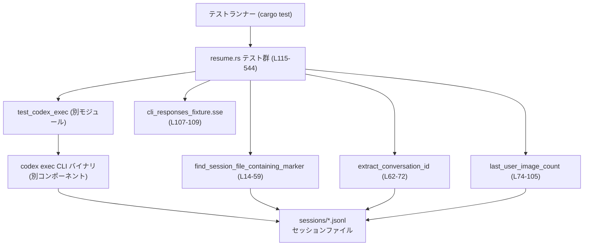
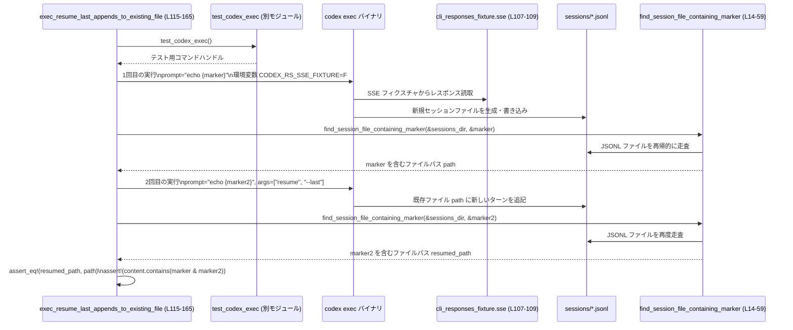

# exec/tests/suite/resume.rs コード解説

## 0. ざっくり一言

`codex exec` CLI の **`resume` 系サブコマンドの振る舞い** を、実際のバイナリ実行とセッションファイル(JSONL)の検査で確認する **統合テスト群** と、そのための **セッション検索ユーティリティ関数** を定義しているファイルです。

---

## 1. このモジュールの役割

### 1.1 概要

このモジュールは、`codex exec` CLI の「セッション再開 (`resume`)」機能について、次のような点を E2E で検証するために存在します。

- セッションファイル(JSONL)から、特定のマーカー文字列を含むファイルを探すユーティリティ（`find_session_file_containing_marker`）を提供する  
- セッションメタ情報から会話 ID（UUID）を抽出するユーティリティ（`extract_conversation_id`）を提供する  
- ユーザーターンの画像入力件数をカウントするユーティリティ（`last_user_image_count`）を提供する  
- これらのユーティリティを使って、`resume --last`/`resume <id>`/`--all`/`--json`/画像添付/モデルやサンドボックス設定の上書きなどの挙動をテストする

### 1.2 アーキテクチャ内での位置づけ

このファイルは **テスト層** に属し、実際の CLI バイナリとファイルシステムを通じて振る舞いを確認します。

- コマンド実行は `core_test_support::test_codex_exec::test_codex_exec` 経由（定義はこのチャンクには現れません）
- SSE レスポンスは `CODEX_RS_SSE_FIXTURE` 環境変数と `cli_responses_fixture.sse`（テスト用フィクスチャ）で差し替え
- CLI が書き出す `sessions/*.jsonl` を、WalkDir + serde_json で読み取り、期待どおりの更新が行われているか検査

依存関係を簡易的に表すと次のようになります。



※ 行番号はこのファイル内での位置を示します（例: `L14-59` は `exec/tests/suite/resume.rs:L14-59`）。

### 1.3 設計上のポイント

コードから読み取れる設計上の特徴は以下の通りです。

- **責務分割**
  - JSONL セッションファイルの走査・解析ロジックは、テストから切り出した小さなユーティリティ関数として定義  
    - `find_session_file_containing_marker`（検索）`exec/tests/suite/resume.rs:L14-59`
    - `extract_conversation_id`（メタ行から ID 抽出）`exec/tests/suite/resume.rs:L62-72`
    - `last_user_image_count`（画像数カウント）`exec/tests/suite/resume.rs:L74-105`
  - 各テスト関数は「ある CLI の使い方シナリオ」を 1 つ検証する構造になっています
- **状態管理**
  - グローバル状態は持たず、テストごとに `test_codex_exec()` や `TempDir` により独立した環境が生成されます
  - セッションの識別には、テキストに埋め込んだ `Uuid` ベースのマーカー文字列を利用します（例: `format!("resume-last-{}", Uuid::new_v4())` `exec/tests/suite/resume.rs:L122`）
- **エラーハンドリング**
  - ユーティリティ関数は「テスト用」のため、`unwrap` / `expect` を積極的に使用しています（クレート属性で Clippy 警告を無効化 `exec/tests/suite/resume.rs:L1`）
  - JSON パースやファイル読み込みでエラーが起きる場合は、多くの箇所でその要素をスキップして処理継続する方針です（`find_session_file_containing_marker` / `last_user_image_count`）
  - テスト関数の戻り値は `anyhow::Result<()>` で、`?` により I/O などの失敗をそのままテスト失敗として扱います
- **時間・並行性**
  - `resume --last` が `updated_at`（秒単位）でソートされる前提がコメントと `std::thread::sleep` の使用から読み取れます
  - 同時刻の更新がテスト結果に影響しないよう、1.1 秒のスリープを入れて「確実に別の秒」に書き込みが行われるようにしています（`exec/tests/suite/resume.rs:L255-257`, `L274-277`）

---

## 2. 主要な機能一覧

このファイルが提供する主要な機能を列挙します。

- セッションファイル検索:
  - `find_session_file_containing_marker` により、sessions ディレクトリ配下の JSONL から特定のマーカー文字列を含むファイルを探索します
- 会話 ID 抽出:
  - `extract_conversation_id` で、セッションファイル先頭のメタ行から会話 UUID を取り出します
- ユーザー画像件数カウント:
  - `last_user_image_count` で、最後のユーザー `message` に含まれる `input_image` の件数を数えます
- `resume --last` の挙動検証:
  - 「最後のセッションファイルに追記されること」や `--json` モードでの引数位置の許容などを確認します
- `resume --last --all` と CWD フィルタの挙動検証:
  - 現在の作業ディレクトリに紐づくセッションだけを対象にするフィルタと、`--all` 指定時にそれを解除する挙動を検証します
- `resume <id>` の挙動検証:
  - セッション ID（UUID）を明示指定して再開する際に、既存ファイルへ追記されることを検証します
- CLI 設定オーバーライドの保持検証:
  - `--model` や `--sandbox` などの CLI オプションが、`resume` 実行時にも意図どおり上書きされることを stderr 出力から確認します
- 画像添付付き `resume` の検証:
  - `resume --last --image <path> --image <path2>` の実行結果として、ユーザーターンに 2 件の画像が含まれることを JSONL から検査します

---

## 3. 公開 API と詳細解説

このファイルはテストモジュールであり、「ライブラリとしての公開 API」は定義していませんが、他のテストからも再利用しうるユーティリティ関数がいくつかあります。

### 3.1 型一覧（構造体・列挙体など）

このファイル内で新たに定義されている構造体・列挙体はありません。

外部から利用している主な型のみ列挙しておきます（定義自体は他クレートにあります）。

| 名前 | 種別 | 役割 / 用途 | 定義位置 |
|------|------|-------------|----------|
| `Value` | 構造体（serde_json） | JSON オブジェクト表現。セッションファイル内の JSONL 行を解析するために使用します | `serde_json` クレート（このチャンクには定義が現れません） |
| `TempDir` | 構造体 | 一時ディレクトリを表す。CWD フィルタのテストで独立したワークスペースを作るために使用します | `tempfile` クレート |
| `Uuid` | 構造体 | ランダムな UUID。マーカー文字列をユニークにするために使用します | `uuid` クレート |

### 3.2 関数詳細（7 件）

#### `find_session_file_containing_marker(sessions_dir: &std::path::Path, marker: &str) -> Option<std::path::PathBuf>`

**概要**

`sessions_dir` 配下を再帰的に走査し、`.jsonl` 拡張子のファイルのうち、任意の `response_item` の `message.content` に `marker` 文字列を含むものを探して、そのファイルパスを返します。  
定義位置: `exec/tests/suite/resume.rs:L14-59`

**引数**

| 引数名 | 型 | 説明 |
|--------|----|------|
| `sessions_dir` | `&std::path::Path` | セッションファイルが保存されているルートディレクトリ（通常は `~/.codex/sessions` に相当するテスト用ディレクトリ） |
| `marker` | `&str` | 探索対象となるマーカー文字列。各テストで UUID 付きのユニークな値が渡されます |

**戻り値**

- `Option<std::path::PathBuf>`  
  - `Some(path)` : 条件に一致する `.jsonl` ファイルを見つけた場合、その絶対パス  
  - `None` : 一致するファイルが見つからなかった場合  

**内部処理の流れ**

1. `WalkDir::new(sessions_dir)` でディレクトリ以下の全エントリを再帰的に列挙します（`exec/tests/suite/resume.rs:L18`）。
2. `entry` が `Err` の場合はそのエントリをスキップし、次のエントリへ進みます（`L19-22`）。
3. ファイルでないエントリ（ディレクトリなど）はスキップします（`L23-25`）。
4. ファイル名が `.jsonl` で終わらない場合はスキップします（`L26-27`）。
5. 対象ファイルを `std::fs::read_to_string` で読み込み、失敗した場合はそのファイルをスキップします（`L29-31`）。
6. 最初の 1 行（メタ行）を飛ばし、残りの各行を JSONL として処理します（`L33-38`）。
   - 空行はスキップ（`L39-41`）
   - `serde_json::from_str` でパースに失敗した行もスキップ（`L42-44`）
7. 各 JSON オブジェクトについて、以下の条件をすべて満たすかをチェックします（`L45-52`）。
   - `type` フィールドが `"response_item"`  
   - `payload.type` が `"message"`  
   - `payload.content` の `ToString` 出力に `marker` が含まれている
8. 条件を満たした場合、そのファイルパスを `Some(path.to_path_buf())` で返します（`L54-55`）。
9. 最後まで見つからなければ `None` を返します（`L58`）。

**Examples（使用例）**

テスト内での典型的な使い方のパターンです。

```rust
// sessions ディレクトリを取得する                               // テスト環境内の sessions ディレクトリ
let sessions_dir = test.home_path().join("sessions");           // home_path()/sessions を組み立てる

// マーカー文字列を使って CLI 実行結果のセッションファイルを探す // 先の CLI 実行で echo {marker} を含めておく
let path = find_session_file_containing_marker(                 // マーカーを含む .jsonl ファイルを検索
    &sessions_dir,                                              // 探索対象ディレクトリ
    &marker,                                                    // 探す文字列
).expect("no session file found after first run");              // 見つからなければテスト失敗
```

**Errors / Panics**

- この関数内では明示的な `panic!` 呼び出しはありません。
- JSON パースエラーやファイル読み込みエラーは、該当行またはファイルを **スキップ** する形で処理されます（`exec/tests/suite/resume.rs:L30-32`, `L42-44`）。
- そのため、期待するセッションがそもそも作成されていない場合や JSON 構造が異なる場合、`None` が返り、呼び出し側で `expect(...)` によりパニックすることがあります。

**Edge cases（エッジケース）**

- `sessions_dir` 配下に `.jsonl` ファイルがない場合  
  → 全てスキップされ、`None` が返ります。
- `marker` を含む複数のセッションファイルが存在する場合  
  → `WalkDir` の列挙順で最初に見つかったファイルのみが返されます（順序はファイルシステム依存）。
- `payload.content` が配列やオブジェクトであっても、`ToString` により JSON 文字列に変換され、その文字列に対して `contains(marker)` が行われます。

**使用上の注意点**

- テストではマーカー文字列に `Uuid` を含めてユニークにしており、**1 テストにつき 1 ファイルだけがヒットする**ことを前提にしています。
- 大量のセッションファイルがある場合でも全体を走査するため、テストの実行時間に影響する可能性がありますが、このモジュールはテスト専用であり、パフォーマンス最適化は主目的ではない構造になっています。

---

#### `extract_conversation_id(path: &std::path::Path) -> String`

**概要**

JSONL セッションファイルの **最初の 1 行**（メタ情報）を JSON としてパースし、`payload.id` フィールドを文字列として取り出します。  
定義位置: `exec/tests/suite/resume.rs:L62-72`

**引数**

| 引数名 | 型 | 説明 |
|--------|----|------|
| `path` | `&std::path::Path` | 対象となるセッションファイルのパス |

**戻り値**

- `String`  
  - `payload.id` が文字列として存在する場合: その値  
  - 存在しない・文字列でない場合: 空文字列（`""`）

**内部処理の流れ**

1. `std::fs::read_to_string(path).unwrap()` でファイルを読み込みます（`L63`）。読み込み失敗時は即座にパニックします。
2. `content.lines()` で行イテレータを得て、`next()` で最初の行を取得します（`L64-65`）。
   - 最初の行が存在しない場合は `expect("missing meta line")` によりパニックします。
3. 最初の行 `meta_line` を `serde_json::from_str` で `Value` にパースします（`L66`）。
   - パースに失敗すると `expect("invalid meta json")` によりパニックします。
4. `meta["payload"]["id"]` を辿り、`as_str()` で文字列として取り出し、`unwrap_or_default().to_string()` で `String` に変換して返します（`L67-71`）。

**Examples**

```rust
// セッションファイルパスが既に分かっている前提                      // 例えば find_session_file_containing_marker の結果
let session_id = extract_conversation_id(&path);                      // メタ行から conversation id を抽出する

assert!(
    !session_id.is_empty(),                                          // 空でないことをチェック
    "missing conversation id in meta line",                          // 空ならテスト失敗
);
```

**Errors / Panics**

- ファイル読み込みエラー時に `unwrap()` によりパニックします（`L63`）。
- ファイルが空（1 行もない）場合に `expect("missing meta line")` でパニックします（`L65`）。
- 最初の行が JSON でない場合に `expect("invalid meta json")` でパニックします（`L66`）。
- `payload.id` が非文字列・存在しない場合はパニックせず、空文字列を返します。

**Edge cases**

- ファイルが存在しても読み取り権限がないなどで `read_to_string` が失敗するとパニックします。
- JSON 構造が想定と異なり `payload.id` が存在しない場合、空文字列が返り、その後のテスト側で `is_empty()` チェックに引っかかります（`exec/tests/suite/resume.rs:L381-384`）。

**使用上の注意点**

- テストコードとして、CLI が生成するセッションファイル構造が「最初の 1 行にメタ JSON を含み、`payload.id` に会話 ID が入っている」という前提に強く依存しています。
- ライブラリコードではなくテスト用なので `unwrap`/`expect` を使用していますが、本番コードに転用する場合はエラーを `Result` として扱う実装が必要になる点に注意が必要です。

---

#### `last_user_image_count(path: &std::path::Path) -> usize`

**概要**

与えられたセッションファイル（JSONL）の全行を順に走査し、「ユーザーのメッセージ (`type=response_item`, `payload.type=message`, `payload.role=user`)」における `content` 配列のうち、最後に現れたものに含まれる `input_image` タイプの要素数をカウントして返します。  
定義位置: `exec/tests/suite/resume.rs:L74-105`

**引数**

| 引数名 | 型 | 説明 |
|--------|----|------|
| `path` | `&std::path::Path` | 対象セッションファイルのパス |

**戻り値**

- `usize`  
  - 条件に一致した最後のユーザー message の `payload.content` の中で `type == "input_image"` の要素数  
  - 条件に一致する行がなかった場合は `0`

**内部処理の流れ**

1. `std::fs::read_to_string(path).unwrap_or_default()` でファイル内容を文字列として読み込みます（`L75`）。
   - 読み込み失敗時は空文字列として扱います。
2. `last_count` を 0 で初期化します（`L76`）。
3. `content.lines()` で全行を走査します（`L77`）。
   - 空行はスキップ（`L78-80`）
   - `serde_json::from_str` でパースに失敗した行もスキップ（`L81-83`）
4. 各 JSON オブジェクトについて、  
   - `type == "response_item"` 出ないものはスキップ（`L84-86`）
   - `payload` が存在しないものはスキップ（`L87-89`）
   - `payload.type != "message"` はスキップ（`L90-92`）
   - `payload.role != "user"` はスキップ（`L93-95`）
5. 条件を満たした行で、`payload.content` を配列として取得し（`L96-98`）、その配列内で `type == "input_image"` の要素数を数えて `last_count` に代入します（`L99-102`）。
   - ループは最後まで続くため、「最後に出現したユーザー message」の画像数が最終的な `last_count` になります。
6. ループ終了後に `last_count` を返します（`L104`）。

**Examples**

```rust
// resume 実行後のセッションファイルを取得している前提                 // 例: find_session_file_containing_marker で見つけたパス
let image_count = last_user_image_count(&resumed_path);              // 最後のユーザーターンの画像数を数える

assert_eq!(
    image_count, 2,                                                  // 2 枚の画像が付与されているはず
    "resume prompt should include both attached images",             // そうでなければテスト失敗
);
```

**Errors / Panics**

- ファイル読み込み失敗はパニックせず、空文字列として扱われます（`unwrap_or_default`）。
- JSON パースエラーや不正な構造は全てスキップされるため、この関数自体からのパニックはありません。

**Edge cases**

- ファイルが存在しない・読み込めない場合  
  → 空文字列扱いとなり、ループが 0 回で終わるため `0` が返ります。
- JSONL のうち一部の行が壊れている場合  
  → 壊れた行はスキップされ、残りの正常な行のみからカウントが行われます。
- `payload.content` が配列でない場合  
  → `and_then(|v| v.as_array())` が `None` を返し、その行はスキップされます。

**使用上の注意点**

- 最後に出現したユーザー message だけを対象にしているため、「履歴の中に複数のユーザーターンが混在している場合でも、最新の状態を確認する」という用途に適しています。
- 画像数が 0 の場合、「画像が一切ない」ケースと「ファイルが読めていない/構造が変わっている」ケースの両方が混在しうるため、テスト側で補助的なチェック（ファイル存在確認など）を合わせて行う必要があります。

---

#### `exec_resume_last_appends_to_existing_file() -> anyhow::Result<()>`

**概要**

`resume --last` サブコマンドが、直前のセッションファイルに **追記** する挙動になっていることを検証するテストです。  
定義位置: `exec/tests/suite/resume.rs:L115-165`

**引数**

- なし（テスト関数）

**戻り値**

- `anyhow::Result<()>`  
  - 通常は `Ok(())` を返し、途中の `?` アンラップでエラーが発生した場合はそのままテスト失敗になります。

**内部処理の流れ**

1. テスト環境を初期化し、フィクスチャパス・リポジトリルートを取得（`L117-119`）。
2. ユニークなマーカー文字列 `marker` を `Uuid` を使って生成し、`echo {marker}` をプロンプトとして CLI を 1 回実行（`L121-132`）。
3. `sessions` ディレクトリを探し、`find_session_file_containing_marker` で `marker` を含むセッションファイルパス `path` を取得（`L135-137`）。
4. 2 回目の実行として、別のマーカー `marker2` を含むプロンプト `prompt2` で `resume --last` を実行（`L139-152`）。
5. 再び `find_session_file_containing_marker` で `marker2` を含むファイルパス `resumed_path` を取得し、最初に作成した `path` と同一であることを `assert_eq!` で検証（`L155-160`）。
6. `resumed_path` のファイル内容を読み取り、`marker` と `marker2` の両方を含むことを `assert!` で検証（`L161-163`）。

**Examples**

このテスト自体が使用例ですが、簡略化した pseudo コードを示します。

```rust
// 1回目の実行: 新しいセッションを作る                           // echo {marker} を投げる
run_exec(&repo_root, &fixture, format!("echo {marker}"))?;

// セッションファイルを検索                                     // marker を含むファイルを探す
let path = find_session_file_containing_marker(&sessions_dir, &marker)
    .expect("no session file found after first run");

// 2回目の実行: resume --last で再開                            // echo {marker2} と共に再開
run_exec_with_args(
    &repo_root,
    &fixture,
    &[
        &prompt2,                                              // プロンプト
        "resume",                                              // サブコマンド
        "--last",                                              // 最新セッションを再開
    ],
)?;

// 2個目のマーカーを含むファイルを確認                         // 新しいマーカーで再検索
let resumed_path = find_session_file_containing_marker(&sessions_dir, &marker2)
    .expect("no resumed session file containing marker2");

// ファイルが同じであり、両方のマーカーを含んでいることを確認
assert_eq!(resumed_path, path);
let content = std::fs::read_to_string(&resumed_path)?;
assert!(content.contains(&marker));
assert!(content.contains(&marker2));
```

（実コードでは `run_exec*` 部分が `test.cmd().env(...).arg(...).assert().success()` で表現されています）

**Errors / Panics**

- `exec_fixture()` / `exec_repo_root()` の失敗や、ファイル読み込み失敗などは `?` により `Err` となり、テスト失敗になります。
- `find_session_file_containing_marker(...).expect(...)` により、セッションが見つからない場合はパニックします（`L136-137`, `L155-156`）。

**Edge cases**

- 1 回目の CLI 実行が内部で失敗してセッションファイルを生成しなかった場合、`find_session_file_containing_marker` が `None` となり、`expect` でパニックします。
- 2 回目の CLI 実行が、別のファイルを新規作成してしまう実装になっていると、`assert_eq!(resumed_path, path)` が失敗しテストが落ちます。

**使用上の注意点**

- マーカー文字列には UUID を含めており、複数テスト間で衝突しないことが前提になっています。
- `CODEX_RS_SSE_FIXTURE` で SSE レスポンスが固定されている前提なので、この環境変数をセットし忘れるとテストの前提が崩れる可能性があります。

---

#### `exec_resume_last_respects_cwd_filter_and_all_flag() -> anyhow::Result<()>`

**概要**

`resume --last` における「カレントディレクトリ (CWD) フィルタ」と `--all` フラグの影響を検証するテストです。  
定義位置: `exec/tests/suite/resume.rs:L219-323`

**引数・戻り値**

- 引数: なし
- 戻り値: `anyhow::Result<()>`（途中の I/O などで失敗した場合にテスト失敗）

**内部処理の流れ（要点）**

1. テスト環境とフィクスチャを準備し、2 つの一時ディレクトリ `dir_a`, `dir_b` を作成（`L221-225`）。
2. `dir_a` を CWD として CLI を実行し、マーカー `marker_a` を含むセッションを作成（`L227-236`）。
3. `dir_b` を CWD として CLI を実行し、マーカー `marker_b` を含む別セッションを作成（`L238-247`）。
4. 両方のマーカーを含むセッションファイルが存在することを確認し、`marker_b` のファイルパスを `path_b` として保持（`L249-253`）。
5. `updated_at` が秒単位で比較される仕様に合わせ、1.1 秒スリープで時刻差を確保（`L255-257`）。
6. `path_b` から `session_id_b` を抽出し（`extract_conversation_id`、`L260`）、`dir_b` CWD で `resume <session_id_b>` を実行して「セッション B を最新にする」ようにメタ情報を更新（`L261-272`）。
7. 再度 1.1 秒スリープし、今度は `dir_a` CWD から `resume --last --all` を実行して `marker_b2` を含むセッションを追記（`L274-291`）。
   - ここで `--all` により CWD フィルタを解除し、「最も新しいセッション」（セッション B）が選ばれることを期待しています。
8. `marker_b2` の含まれるファイルを探し、`path_b` と一致することを確認（`L293-298`）。
9. 続いて、`dir_a` CWD から `resume --last`（`--all` なし）を実行して `marker_a2` を送信（`L300-311`）。
10. `marker_a2` を含むファイルを探し、それがセッション B のパス `path_b` であることを確認（`L313-321`）。
    - 前のステップで「`dir_a` から `resume --last --all` を実行したことにより、セッション B の最新ターンの CWD が `dir_a` になっている」という前提がコメントに記載されています（`L315-317`）。

**使用上の注意点・エッジケース**

- `updated_at` が秒単位のため、非常に高速な CI 環境では同じ秒に複数の更新が行われるとソート順が不安定になる可能性があります。このテストでは 1.1 秒の `sleep` を挟むことでそれを避けています。
- `extract_conversation_id` が失敗するとパニックするため、セッションファイルのメタ行が期待どおりに生成されていることが前提です。

---

#### `exec_resume_by_id_appends_to_existing_file() -> anyhow::Result<()>`

**概要**

`resume <id>` 形式で、特定の会話 ID を指定した再開が、対応する既存セッションファイルへの **追記** として行われることを検証するテストです。  
定義位置: `exec/tests/suite/resume.rs:L359-410`

**内部処理の流れ（要点）**

1. 1 回目の CLI 実行で `marker` を含むセッションを作成（`L364-375`）。
2. `find_session_file_containing_marker` でファイルパス `path` を取得し、`extract_conversation_id` で会話 ID `session_id` を取得（`L377-381`）。
3. `session_id` が空でないことを `assert!` で確認（`L381-384`）。
4. 2 回目の CLI 実行で、プロンプト `prompt2` を送信しつつ `resume <session_id>` を指定（`L386-398`）。
5. 2 つ目のマーカー `marker2` を含むセッションファイルが、最初の `path` と同一であることを確認し（`L401-406`）、さらにファイル内容に `marker` と `marker2` の両方が含まれることを確認（`L407-409`）。

**Errors / Edge cases**

- `session_id` が空文字列の場合、実装では `assert!(!session_id.is_empty())` により明示的にテスト失敗となります（`L381-384`）。
- CLI が `resume <id>` を新規セッションとして扱う実装であれば、`assert_eq!(resumed_path, path)` が失敗し、テストで検知されます。

---

#### `exec_resume_preserves_cli_configuration_overrides() -> anyhow::Result<()>`

**概要**

初回実行と `resume` 実行で異なる CLI オプション（特に `--model` と `--sandbox`）を指定したときに、`resume` 実行時のオプション指定が stderr に反映されていることを確認し、「再開時の設定上書き」が期待どおりに機能していることを検証するテストです。  
定義位置: `exec/tests/suite/resume.rs:L413-485`

**内部処理の流れ（要点）**

1. 初回実行:  
   - `--sandbox workspace-write` `--model gpt-5.1` などを指定してセッションを作成（`L422-433`）。
2. `find_session_file_containing_marker` でセッションファイルを確認（`L435-437`）。
3. 2 回目の実行（`resume`）では、  
   - `--sandbox workspace-write` `--model gpt-5.1-high` を指定し、`resume --last` を実行  
   - `.output()` で結果を直接取得し、`anyhow::Context` でエラー文脈を付与（`L442-456`）。
4. `output.status.success()` が真であることを確認（`L458`）。
5. `stderr` を UTF-8 文字列に変換し、  
   - `model: gpt-5.1-high` を含むことを確認（`L460-464`）  
   - OS が Windows の場合は `sandbox: read-only`、それ以外では `sandbox: workspace-write` を含むことを確認（`L465-475`）。
6. `find_session_file_containing_marker` により 2 回目のマーカーを含むファイルが初回と同じであることを確認（`L477-479`）。
7. セッションファイル内容に両方のマーカーが含まれることを確認（`L481-483`）。

**注意点**

- サンドボックスの実際の挙動はこのチャンクには現れず、stderr 出力の文字列のみで判定しています。
- Windows においてはサンドボックス設定が `read-only` に「ダウングレード」されることが期待されている点が分岐条件から読み取れます（`cfg!(target_os = "windows")` ）。

---

#### `exec_resume_accepts_images_after_subcommand() -> anyhow::Result<()>`

**概要**

`resume` サブコマンドの後に `--image <path>` フラグを複数回指定して画像を添付し、その結果としてユーザーターンに 2 件の `input_image` が含まれることをセッションファイルから検証するテストです。  
定義位置: `exec/tests/suite/resume.rs:L487-544`

**内部処理の流れ（要点）**

1. 1 回目の CLI 実行でマーカー `marker` を含むセッションを作成（`L493-503`）。
2. テスト用の PNG 画像データ `image_bytes` をファイル `resume_image.png` と `resume_image_2.png` として書き出し（`L505-515`）。
3. 2 回目の実行として、  
   - `resume --last --image <image_path> --image <image_path_2> {prompt2}`  
   を実行し、`resume` サブコマンド以降に `--image` フラグを 2 回続けて指定（`L517-531`）。
4. `find_session_file_containing_marker` で `marker2` を含むセッションファイルを取得し（`L534-536`）、`last_user_image_count` により最後のユーザーターンの画像数をカウント（`L537`）。
5. 画像数が 2 であることを確認（`L538-540`）。

**注意点**

- 画像ファイルは最小限の PNG ヘッダを持つバイナリ配列としてテスト内で生成されており、外部リソースに依存していません（`L507-513`）。
- JSONL 形式に `input_image` タイプがどのように表現されるかの詳細はこのチャンクには現れませんが、`last_user_image_count` が利用している構造（`type == "input_image"`）に依存しています。

---

### 3.3 その他の関数

上記で詳細説明していない補助関数・テスト関数を一覧します。

| 関数名 | 種別 | 役割（1 行） | 定義位置 |
|--------|------|--------------|----------|
| `exec_fixture() -> anyhow::Result<std::path::PathBuf>` | 補助関数 | `find_resource!` マクロを用いて `tests/fixtures/cli_responses_fixture.sse` のパスを取得する | `exec/tests/suite/resume.rs:L107-109` |
| `exec_repo_root() -> anyhow::Result<std::path::PathBuf>` | 補助関数 | `codex_utils_cargo_bin::repo_root()` を呼んでリポジトリルートのパスを取得する | `exec/tests/suite/resume.rs:L111-113` |
| `exec_resume_last_accepts_prompt_after_flag_in_json_mode()` | テスト関数 | `--json` モードで `resume --last` の後ろにプロンプトを渡す書き方が許容されることをテストする | `exec/tests/suite/resume.rs:L167-217` |
| `exec_resume_accepts_global_flags_after_subcommand()` | テスト関数 | `resume` サブコマンドの後に `--json` や `--model` などのグローバルフラグを続けて指定できることをテストする | `exec/tests/suite/resume.rs:L326-355` |

---

## 4. データフロー

ここでは代表的なシナリオとして、`exec_resume_last_appends_to_existing_file` におけるデータフローを示します。

### 4.1 処理の要点

1. テストが `test_codex_exec()` を通じて CLI バイナリを実行し、`echo {marker}` をプロンプトとして送信します。
2. CLI は SSE フィクスチャからレスポンスを受け取りつつ、`sessions/*.jsonl` に会話履歴を保存します。
3. テストは JSONL を `find_session_file_containing_marker` で走査し、作成されたセッションファイルを特定します。
4. 2 回目の実行で `resume --last` を指定し、同じセッションに対して新しいターンを追加します。
5. 再度ファイルを走査して、新しいマーカーを含むファイルが最初のファイルと同じであること、かつ両方のマーカーが含まれていることを検証します。

### 4.2 シーケンス図



このように、テストは **CLI バイナリをブラックボックス的に呼び出し、生成されたファイルを JSON として検査する** ことで、`resume` の実装とファイルフォーマットに対する契約を検証しています。

---

## 5. 使い方（How to Use）

このファイルはテストコードですが、同様のパターンで新しい `resume` 関連テストを追加する際の参考になります。

### 5.1 基本的な使用方法

新しいテストを追加する場合の典型的なフローは次の通りです。

```rust
#[test]                                                          // テスト関数であることを示す属性
fn my_new_resume_test() -> anyhow::Result<()> {                  // anyhow::Result で I/O エラー等を?で伝播
    let test = test_codex_exec();                                // CLI を実行するためのテストハーネスを作成
    let fixture = exec_fixture()?;                               // SSE フィクスチャファイルのパスを取得
    let repo_root = exec_repo_root()?;                           // リポジトリルートのパスを取得

    // 1) 初回実行: ユニークなマーカー付きでセッションを作成
    let marker = format!("my-new-resume-{}", Uuid::new_v4());    // マーカー文字列を UUID 付きで生成
    let prompt = format!("echo {marker}");                       // プロンプト文字列を生成

    test.cmd()                                                   // コマンドビルダーを取得
        .env("CODEX_RS_SSE_FIXTURE", &fixture)                   // SSE フィクスチャを指定
        .arg("--skip-git-repo-check")                            // テスト簡略化のためのフラグ
        .arg("-C")                                               // 作業ディレクトリ指定
        .arg(&repo_root)
        .arg(&prompt)                                            // プロンプトを渡す
        .assert()
        .success();                                              // 成功終了を期待

    // 2) セッションファイルを特定
    let sessions_dir = test.home_path().join("sessions");        // テスト用 HOME/sessions
    let path = find_session_file_containing_marker(              // マーカーを含むファイルを探索
        &sessions_dir,
        &marker,
    )
    .expect("no session file found after first run");            // 見つからなければテスト失敗

    // 3) 必要に応じて resume を実行し、結果を検証
    // 例: resume --last を使う
    let marker2 = format!("my-new-resume-2-{}", Uuid::new_v4()); // 2つ目のマーカー
    let prompt2 = format!("echo {marker2}");

    test.cmd()
        .env("CODEX_RS_SSE_FIXTURE", &fixture)
        .arg("--skip-git-repo-check")
        .arg("-C")
        .arg(&repo_root)
        .arg("resume")                                           // サブコマンド
        .arg("--last")                                           // 最新セッションを再開
        .arg(&prompt2)                                           // 新しいプロンプト
        .assert()
        .success();

    // 4) JSONL ファイルを再度読み取り、期待どおりに更新されているかを検証
    let resumed_path = find_session_file_containing_marker(
        &sessions_dir,
        &marker2,
    )
    .expect("no resumed session file containing marker2");

    assert_eq!(resumed_path, path);                              // 同じファイルに追記されていること
    let content = std::fs::read_to_string(&resumed_path)?;       // ファイル内容を読み取る
    assert!(content.contains(&marker));                          // 1つ目のマーカーが含まれる
    assert!(content.contains(&marker2));                         // 2つ目のマーカーも含まれる
    Ok(())                                                       // テスト成功
}
```

### 5.2 よくある使用パターン

このファイルから読み取れる典型的なパターンを挙げます。

1. **`resume --last` の検証**
   - 初回実行 → セッションファイルを特定 → `resume --last` 実行 → 同一ファイルへの追記を検証  
   - 例: `exec_resume_last_appends_to_existing_file`（`exec/tests/suite/resume.rs:L115-165`）

2. **ID 指定 `resume <id>` の検証**
   - 初回セッションのメタ行から ID を抽出し、その ID を使って再開したときに同じファイルが更新されるかを確認  
   - 例: `exec_resume_by_id_appends_to_existing_file`（`L359-410`）

3. **CLI 引数の許容順序の検証**
   - `resume` サブコマンドの **後に** グローバルフラグやプロンプトを渡せるかを確認  
   - 例:  
     - `exec_resume_last_accepts_prompt_after_flag_in_json_mode`（`L167-217`）  
     - `exec_resume_accepts_global_flags_after_subcommand`（`L326-355`）

4. **画像添付の検証**
   - テスト内で PNG を生成し、`--image` フラグで添付 → JSONL 中の `input_image` 数を数える  
   - 例: `exec_resume_accepts_images_after_subcommand`（`L487-544`）

### 5.3 よくある間違い

このファイルから推測できる、起こりうる誤用例と正しいパターンを示します。

```rust
// 誤りの例: マーカー文字列をユニークにしていない
let marker = "fixed-marker";                                     // 全テストで同じ値を使ってしまう
// ...
let path = find_session_file_containing_marker(&sessions_dir, &marker);
// → 複数のセッションに同じ marker が含まれると、どのファイルが返るか不定になる

// 正しい例: UUID を付与してテストごとにユニークにする
let marker = format!("my-test-marker-{}", Uuid::new_v4());       // UUID で一意にする
let path = find_session_file_containing_marker(&sessions_dir, &marker);
```

```rust
// 誤りの例: CODEX_RS_SSE_FIXTURE を指定していない
test.cmd()
    // .env("CODEX_RS_SSE_FIXTURE", &fixture)                    // 指定し忘れている
    .arg("--skip-git-repo-check")
    .arg("echo something")
    .assert()
    .success();                                                  // フィクスチャを使わない挙動はテストの前提とずれる可能性

// 正しい例: exec_fixture() で取得したフィクスチャを必ず指定する
let fixture = exec_fixture()?;
test.cmd()
    .env("CODEX_RS_SSE_FIXTURE", &fixture)                       // テスト用 SSE フィクスチャを指定
    .arg("--skip-git-repo-check")
    .arg("echo something")
    .assert()
    .success();
```

### 5.4 使用上の注意点（まとめ）

- **マーカーの一意性**  
  - 各テストで `Uuid::new_v4()` を埋め込んだマーカー文字列を使用しており、検索対象のセッションが一意である前提になっています。
- **セッションファイル構造への依存**  
  - 先頭行がメタ JSON、以降が JSONL という構造、および `type` / `payload.type` / `payload.role` / `payload.content` などのフィールド名に依存したテストになっています。
- **時間に依存するテスト**  
  - `resume --last` が `updated_at`（秒単位）でソートされる前提を、`std::thread::sleep` による 1.1 秒スリープで補強しています。
- **テスト専用のエラーハンドリング**  
  - `unwrap` / `expect` を用いた単純なエラーハンドリングになっており、本番コードのエラーパス検証には直接流用できない点に注意が必要です。

---

## 6. 変更の仕方（How to Modify）

### 6.1 新しい機能を追加する場合

`resume` 周辺に新しい CLI 機能が追加された場合、このファイルにテストを追加する際の流れは次のようになります。

1. **シナリオを定義する**
   - どのフラグ・サブコマンドを、どの順序で呼び出したときに、セッションファイルや stderr/stdout がどう変化するべきかを文章で整理します。
2. **テスト関数を追加する**
   - `#[test] fn exec_resume_<scenario_name>() -> anyhow::Result<()> { ... }` の形で新しいテスト関数を追加します。
3. **CLI を実行する**
   - `test_codex_exec()` / `exec_fixture()` / `exec_repo_root()` を使って環境を構築し、`test.cmd().env(...).arg(...).assert().success()` で CLI を実行します。
4. **セッションファイルまたは出力を検証する**
   - セッション内容に依存する検証であれば `find_session_file_containing_marker` / `extract_conversation_id` / `last_user_image_count` を活用します。
   - stderr/stdout の内容に依存する検証であれば `.output()` を用い、`String::from_utf8` で文字列化して検証します（`exec_resume_preserves_cli_configuration_overrides` 参照）。

### 6.2 既存の機能を変更する場合

CLI の仕様変更により JSONL 構造や `resume` の挙動が変わった場合、テストの更新にあたって注意すべき点です。

- **影響範囲の確認**
  - JSON フィールド名や構造を変更する場合、`find_session_file_containing_marker`（`L14-59`）、`last_user_image_count`（`L74-105`）、`extract_conversation_id`（`L62-72`）のロジックに影響がないか確認が必要です。
- **契約（前提条件）の見直し**
  - `resume --last` がソートキーやフィルタ条件を変更した場合、`exec_resume_last_respects_cwd_filter_and_all_flag`（`L219-323`）など、現状の仕様を前提にしているテストを調整する必要があります。
- **テストの安定性**
  - 時刻ベースのソートに依存するテストでは、必要に応じて `sleep` の時間を調整することで CI 環境でも安定させる必要があります。
- **関連するテストファイル**
  - このファイル以外にも `exec` コマンドをテストしているファイルが存在する可能性がありますが、その具体的なパスはこのチャンクには現れません。`rg "test_codex_exec"` などで探索すると、他の関連テストを把握できます（ツールの実行はここでは行っていません）。

---

## 7. 関連ファイル

このモジュールと密接に関係するコンポーネントをまとめます（定義の詳細はこのチャンクには現れません）。

| パス / モジュール | 種別 | 役割 / 関係 |
|-------------------|------|-------------|
| `core_test_support::test_codex_exec` | モジュール/関数 | テスト用に `codex exec` CLI バイナリをラップし、`test.cmd()` でコマンドを組み立てられるハーネスを提供していると解釈できます（`exec/tests/suite/resume.rs:L4, L117, L169` など）。 |
| `codex_utils_cargo_bin::find_resource!` | マクロ | `tests/fixtures/cli_responses_fixture.sse` といったテストリソースのパスを解決するために使用されます（`exec/tests/suite/resume.rs:L3, L107-109`）。 |
| `codex_utils_cargo_bin::repo_root()` | 関数 | リポジトリルートのパスを返し、`-C <repo_root>` で CLI を特定のワークスペースから実行するために利用されます（`exec/tests/suite/resume.rs:L111-113`）。 |
| `tests/fixtures/cli_responses_fixture.sse` | ファイル（SSE フィクスチャ） | `CODEX_RS_SSE_FIXTURE` 環境変数で指定される SSE レスポンスのフィクスチャ。CLI 実行結果の決定性を高めるために使用されています（`exec/tests/suite/resume.rs:L107-109, L126, L144` 等）。 |
| `sessions/*.jsonl` | ファイル（生成物） | CLI によって生成されるセッションログ。`find_session_file_containing_marker` や `last_user_image_count` により解析されます。テストが検証対象とする主な成果物です。 |

---

## Bugs / Security / Contracts / Edge Cases（このファイルから読み取れる範囲）

- **バグ候補・注意点**
  - `extract_conversation_id` はファイル読み込み・JSON パース失敗時にパニックする実装ですが、テスト用であるため意図的な選択と考えられます（`exec/tests/suite/resume.rs:L63-66`）。
  - `find_session_file_containing_marker` は `WalkDir` の順序に依存しており、複数ファイルが同じマーカーを含む場合にどれが選ばれるかは未定義です。現状のテストではマーカーを UUID 付きでユニークにしているため問題にならない前提です。
- **セキュリティ観点**
  - テストコード内で `--dangerously-bypass-approvals-and-sandbox` を使用するテストがありますが（`exec_resume_accepts_global_flags_after_subcommand`、`exec/tests/suite/resume.rs:L349`）、これはフラグの受け渡しを確認するのが目的であり、実際の危険な処理の有無はこのチャンクには現れません。
  - 画像ファイルの読み書きや一時ディレクトリの使用は、すべてテスト用のローカルパスに限定されており、外部からの入力値をそのまま扱う箇所はありません。
- **契約・エッジケース**
  - JSONL セッションファイルのフォーマット（メタ行＋`response_item` 行群、`payload.type == "message"`, `payload.role == "user"` など）がこのテストの暗黙の契約になっています。構造変更時にはユーティリティ関数が要更新です。
  - `updated_at` が秒単位であること、および `resume --last` がこのフィールドをソートに使用することがコメントから読み取れるため（`exec/tests/suite/resume.rs:L255-257, L274-276`）、時刻精度が異なる環境ではテストの安定性に注意が必要です。
- **並行性**
  - このファイル内にはスレッド生成や async 処理はなく、`std::thread::sleep` のみが使用されています。テストは基本的にシングルスレッドで動作する前提です。

以上が、`exec/tests/suite/resume.rs` におけるコンポーネント一覧・コアロジック・データフローの整理です。
