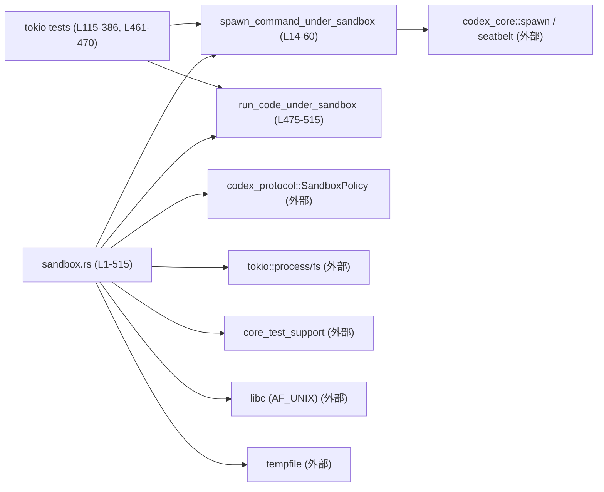
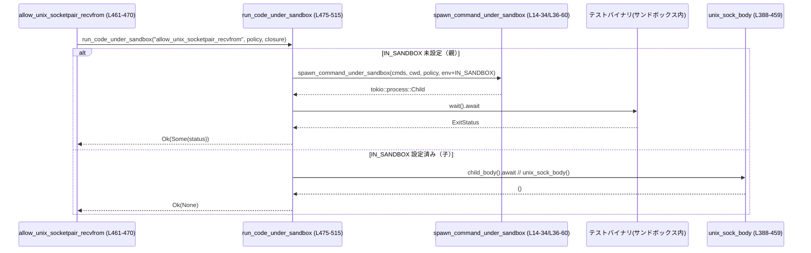

# exec/tests/suite/sandbox.rs

## 0. ざっくり一言

Unix 系環境で Codex のサンドボックス実装を検証するための統合テスト群と、そのための補助関数（特に `run_code_under_sandbox`）を提供するファイルです (exec/tests/suite/sandbox.rs:L1-515)。

---

## 1. このモジュールの役割

### 1.1 概要

- このモジュールは **Codex のサンドボックス実装が期待どおりに動くか** を検証するためのテストとヘルパーを提供します (L115-386, L461-470)。
- 実際に Python や `bash`、UNIX ソケットなどを使った子プロセスをサンドボックス内で実行し、**ファイル書き込み制限、`.codex` ディレクトリ作成の禁止、AF_UNIX ソケット許可**などの挙動をテストします (L136-142, L250-256, L332-338, L388-459)。
- さらに `run_code_under_sandbox` により、**テストバイナリ自身をサンドボックス付きで再実行**する仕組みも提供します (L475-515)。

### 1.2 アーキテクチャ内での位置づけ

このファイルはテスト専用のモジュールであり、以下のコンポーネントと連携します。



- **サンドボックス・ランチャ**
  - `spawn_command_under_sandbox` が macOS / Linux で適切なサンドボックスプログラムを呼び出します (L14-34, L36-60)。
- **ポリシー定義**
  - `SandboxPolicy` 型（外部 crate）が読み書き可能ディレクトリやネットワーク可否などを表現し、ここではテストごとにインスタンス化されます (例: L136-142, L199-203, L250-256, L332-338)。
- **再実行ヘルパ**
  - `run_code_under_sandbox` がテストバイナリ自身を `--exact <テスト名>` 付きで再実行し、その子プロセス内でテスト本体を実行します (L475-515)。

### 1.3 設計上のポイント

- **Unix 限定**
  - ファイル全体が `#![cfg(unix)]` でガードされ、Unix 系 OS のみでコンパイルされます (L1)。
- **OS ごとの実装切り替え**
  - `spawn_command_under_sandbox` は `cfg(target_os = "macos")` と `cfg(target_os = "linux")` で別実装になっています (L14, L36)。
- **非同期 I/O とプロセス管理**
  - すべてのテストは `#[tokio::test]` で動作し、`tokio::process::Child` を async/await で待機します (L115, L179, L225, L316, L461)。
- **能力プローブによるテストスキップ**
  - Linux では Landlock によるサンドボックスが実際に適用できるかを `can_apply_linux_sandbox_policy` で事前に確認し、不可ならテストをスキップします (L62-82, L90-113, L115-125 など)。
- **環境変数による再実行制御**
  - `IN_SANDBOX` 環境変数で「親プロセス（再実行前）」と「サンドボックス内の子プロセス」を切り替えます (L472, L484-485, L510-513)。
- **unsafe を使った AF_UNIX ソケット検証**
  - `unix_sock_body` 内では `libc` を使った unsafe なソケット操作で AF_UNIX ソケットがサンドボックス内で動作するかを確認します (L388-459)。

---

## 2. 主要な機能一覧

### 2.1 機能サマリ

- サンドボックス付き子プロセス起動 (`spawn_command_under_sandbox`)
- Linux サンドボックス可用性チェック (`linux_sandbox_test_env`, `can_apply_linux_sandbox_policy`)
- Python の multiprocessing / `pwd.getpwuid` がサンドボックス内で動くかのテスト
- サンドボックスポリシーと CWD の関係のテスト
- `.codex` ディレクトリ初回作成の禁止テスト
- AF_UNIX socketpair + `recvfrom` の許可テスト
- テストバイナリの再実行ヘルパ (`run_code_under_sandbox`)

### 2.2 コンポーネントインベントリー（関数・定数）

| 名前 | 種別 | cfg 条件 | 公開 | 行範囲 | 役割 |
|------|------|---------|------|--------|------|
| `spawn_command_under_sandbox` | async 関数 | `target_os = "macos"` | 非公開 | L14-34 | macOS で seatbelt サンドボックスの下でコマンドを起動するラッパー (exec/tests/suite/sandbox.rs:L14-34)。 |
| `spawn_command_under_sandbox` | async 関数 | `target_os = "linux"` | 非公開 | L36-60 | Linux で `codex_linux_sandbox` バイナリ経由でコマンドを起動するラッパー (L36-60)。 |
| `linux_sandbox_test_env` | async 関数 | `target_os = "linux"` | 非公開 | L62-82 | Landlock サンドボックスがこのホストで有効かを判定し、テスト用環境変数マップを返す (L62-82)。 |
| `can_apply_linux_sandbox_policy` | async 関数 | `target_os = "linux"` | 非公開 | L84-113 | 指定ポリシーで `/usr/bin/true` を実行できるかを試し、Landlock が有効か判定する (L90-113)。 |
| `python_multiprocessing_lock_works_under_sandbox` | tokio テスト関数 | なし | 非公開 | L115-177 | Python の `multiprocessing.Lock` がサンドボックス内で動作するかを検証 (L115-177)。 |
| `python_getpwuid_works_under_sandbox` | tokio テスト関数 | なし | 非公開 | L179-223 | Python の `pwd.getpwuid(os.getuid())` が read-only サンドボックスで動くかを検証 (L179-223)。 |
| `sandbox_distinguishes_command_and_policy_cwds` | tokio テスト関数 | なし | 非公開 | L225-314 | コマンド CWD とポリシー CWD の違いに応じて書き込みが許可/拒否されることを検証 (L225-314)。 |
| `sandbox_blocks_first_time_dot_codex_creation` | tokio テスト関数 | なし | 非公開 | L316-386 | `.codex` ディレクトリの初回作成と設定ファイル生成がサンドボックスでブロックされるかを検証 (L316-386)。 |
| `unix_sock_body` | 関数 | なし | 非公開 | L388-459 | AF_UNIX datagram/stream socketpair で送受信が動作するかを確認するテスト本体 (L388-459)。 |
| `allow_unix_socketpair_recvfrom` | tokio テスト関数 | なし | 非公開 | L461-470 | `run_code_under_sandbox` を使って `unix_sock_body` をサンドボックス内で実行する (L461-470)。 |
| `IN_SANDBOX_ENV_VAR` | 定数 | なし | 非公開 | L472 | 再実行済みかどうかを判定するための環境変数名 `"IN_SANDBOX"` (L472)。 |
| `run_code_under_sandbox` | async 関数 | なし | 公開 | L475-515 | テストバイナリを `--exact <テスト名>` 付きでサンドボックス内に再実行し、その中で任意の async ボディを実行するヘルパー (L475-515)。 |

---

## 3. 公開 API と詳細解説

### 3.1 型一覧（構造体・列挙体など）

このファイル内で新しい構造体・列挙体・トレイトは定義されていません。  
サンドボックスの設定には外部 crate の `SandboxPolicy` 型が利用されています (L18, L40, L72, L136, L199, L250, L332, L465, L477)。

補助的な定数:

| 名前 | 種別 | 役割 / 用途 | 行範囲 |
|------|------|-------------|--------|
| `IN_SANDBOX_ENV_VAR` | `&'static str` | `run_code_under_sandbox` で「すでにサンドボックス内で実行中か」を判定するための環境変数キー (値は `"IN_SANDBOX"`) | L472 |

---

### 3.2 関数詳細（重要なもの）

#### `run_code_under_sandbox<F, Fut>(test_selector: &str, policy: &SandboxPolicy, child_body: F) -> io::Result<Option<ExitStatus>>` (L475-515)

**概要**

- テストバイナリ自身を、指定した `SandboxPolicy` の下で **新しいサンドボックス付き子プロセスとして再実行**し、その子プロセスの中で `child_body`（任意の async 処理）を実行するヘルパーです (L475-483)。
- 親プロセス側では子プロセスの `ExitStatus` を `Some(status)` で受け取り、サンドボックス内の子プロセス側では `child_body` を実行して `Ok(None)` を返します (L484-513)。

**引数**

| 引数名 | 型 | 説明 |
|--------|----|------|
| `test_selector` | `&str` | `cargo test -- --exact <test_selector>` に相当するテスト名フィルタ。再実行時にこのテストだけが実行されます (L486-487, L493)。 |
| `policy` | `&SandboxPolicy` | 再実行されるテストバイナリに適用するサンドボックスポリシー (L477, L499-502)。 |
| `child_body` | `F` | サンドボックス内の子プロセスで実行したい async 処理。`FnOnce() -> Fut + Send + 'static` 制約あり (L478, L480-482, L511-513)。 |

**戻り値**

- `io::Result<Option<ExitStatus>>`:
  - `Err(e)`: 再実行のための準備やプロセス起動、待機中に I/O エラーが発生した場合 (L485, L498-506, L508)。
  - `Ok(Some(status))`: 親プロセス側（`IN_SANDBOX` 未設定）で、子プロセスの終了ステータスを受け取った場合 (L484-509)。
  - `Ok(None)`: サンドボックス内の子プロセス側（`IN_SANDBOX` 設定済み）で `child_body` の実行が完了した場合 (L510-513)。

**内部処理の流れ**

1. `IN_SANDBOX_ENV_VAR` 環境変数がセットされているか確認し、**未設定なら「親ブランチ」**、設定済みなら「子ブランチ」に分岐します (L484-485, L510)。
2. 親ブランチ:
   1. `std::env::current_exe()` で現在実行中のテストバイナリのパスを取得 (L485)。
   2. `cmds = [<exe>, "--exact", test_selector]` を構築し、さらに `--nocapture` が元コマンドラインに含まれていれば `cmds` に追加しつつ `StdioPolicy` を `Inherit` に変更 (L486-493)。
   3. カレントディレクトリを取得し、サンドボックス CWD としても同じパスを使う (L495-497)。
   4. `spawn_command_under_sandbox` を呼び出し、`IN_SANDBOX=1` を含む環境変数マップを渡して子プロセスを起動 (L498-505)。
   5. `child.wait().await` で子プロセスの終了を待ち、`Ok(Some(status))` を返す (L508-509)。
3. 子ブランチ:
   1. 渡された `child_body` クロージャを呼び出し、その Future を `await` (L511-512)。
   2. 終了後に `Ok(None)` を返す (L513)。

**Examples（使用例）**

1. 本ファイル内での使用（AF_UNIX ソケットのテスト）(L461-470):

```rust
#[tokio::test]
async fn allow_unix_socketpair_recvfrom() {
    run_code_under_sandbox(
        "allow_unix_socketpair_recvfrom",                // test_selector
        &SandboxPolicy::new_read_only_policy(),          // サンドボックスは読み取り専用
        || async { unix_sock_body() },                   // 子プロセス内で実行するボディ
    )
    .await
    .expect("should be able to reexec");
}
```

この場合、親プロセスは子プロセスを再実行して `unix_sock_body` をサンドボックス内で動かし、親側では `Result` の `Err` だけをチェックしています。

1. 新しいテストでの利用例（概念例）

```rust
#[tokio::test]
async fn my_feature_works_in_sandbox() {
    let policy = SandboxPolicy::new_read_only_policy(); // 適切なポリシーを構築

    let result = run_code_under_sandbox(
        "my_feature_works_in_sandbox",                   // テスト名と一致させる
        &policy,
        || async {
            // ここはサンドボックス内子プロセスで実行される
            // テストしたいコードを呼び出す
            my_feature_body();
        },
    )
    .await
    .expect("reexec failed");

    // 子プロセスの ExitStatus もチェックしたい場合
    if let Some(status) = result {
        assert!(status.success(), "sandboxed test failed: {status:?}");
    }
}
```

**Errors / Panics**

- `Err(io::Error)` になるケース:
  - 現在の実行ファイルパス取得に失敗した場合 (`std::env::current_exe()` が Err) (L485)。
  - `spawn_command_under_sandbox` が I/O エラーを返した場合 (L498-506)。
  - 子プロセス待機 (`child.wait().await`) が失敗した場合 (L508)。
- panic の可能性:
  - 本関数内では `expect` / `unwrap` は使用されていませんが、呼び出し元が `expect("should be able to reexec")` を呼んでいるため (L469)、`io::Error` が返るとテストは panic します。

**Edge cases（エッジケース）**

- **IN_SANDBOX が既にセットされている場合**:
  - すぐに「子ブランチ」に入り、**新たなプロセスは起動せず** `child_body` を実行します (L484-485, L510-513)。
- **`test_selector` が実際のテスト名と一致しない場合**:
  - 子プロセス側では該当テストが実行されない可能性がありますが、その場合の挙動（テストゼロで成功終了するかなど）は Rust テストランナー側の仕様に依存し、このファイルだけからは断定できません。
- **子プロセス内で panic する場合**:
  - そのプロセスの終了コードは非ゼロになると考えられますが（OS/ランタイム依存）、親側では `ExitStatus` を `Some(status)` として受け取るだけで、本ファイル内の例ではそれを検査していません (L461-470)。  
    そのため、**親側テストでは子プロセスの失敗を検出できない**ケースがありえます（後述の「使用上の注意点」参照）。

**使用上の注意点**

- **ExitStatus をチェックしないと検証漏れの可能性**:
  - `allow_unix_socketpair_recvfrom` のように `Result` の `Err` のみを `expect` し、`ExitStatus` を検査していないと (L461-470)、サンドボックス内のテストが失敗しても親テストは成功してしまいます。  
    子プロセス内のテスト結果も重要な場合は、`Some(status)` を取り出して `status.success()` を確認する必要があります。
- **`test_selector` とテスト名の整合性**:
  - `--exact` を使うため、`test_selector` はテスト名と一致している必要があります (L486-487, L493)。誤った名前を渡すと期待したテストが再実行されません。
- **環境変数の扱い**:
  - 子プロセスには少なくとも `"IN_SANDBOX" = "1"` が渡されます (L472, L504-505)。その他の環境変数がどのように引き継がれるかは `spawn_command_under_sandbox` の実装次第であり、このファイルからは分かりません。
- **非同期コンテキスト必須**:
  - `async fn` であり、`tokio` などの非同期ランタイム上で `await` する必要があります。

---

#### `spawn_command_under_sandbox(...) -> std::io::Result<Child>` (L14-34, L36-60)

**概要**

- 与えられたコマンドラインを、プラットフォーム固有のサンドボックス機構の下で実行する共通ヘルパーです。
  - macOS: `codex_core::seatbelt::spawn_command_under_seatbelt` を呼びます (L23-24)。
  - Linux: `codex_core::spawn_command_under_linux_sandbox` を呼びます (L45, L48-58)。

**引数**

| 引数名 | 型 | 説明 |
|--------|----|------|
| `command` | `Vec<String>` | 実行するコマンドと引数。`command[0]` がプログラムパスである前提 (L16, L38, L48-51)。 |
| `command_cwd` | `PathBuf` | プロセスのカレントディレクトリ (L17, L39, L51)。 |
| `sandbox_policy` | `&SandboxPolicy` | 適用するサンドボックスポリシー (L18, L40, L52)。 |
| `sandbox_cwd` | `&Path` | サンドボックスポリシーの基準パス（Workspace root のような概念） (L19, L41, L53)。 |
| `stdio_policy` | `StdioPolicy` | 標準入出力の扱い (継承/リダイレクトなど) (L20, L42, L55)。 |
| `env` | `HashMap<String, String>` | 環境変数の設定 (L21, L43, L57)。 |

**戻り値**

- `Ok(Child)`: サンドボックス下で立ち上げた非同期子プロセスのハンドル。
- `Err(io::Error)`: サンドボックス実装側の起動エラーなど。
  - Linux では、`codex_linux_sandbox` 実行ファイルが見つからなかった場合に `io::ErrorKind::NotFound` でエラー変換されています (L46-47)。

**内部処理の流れ（Linux 版）**

1. `core_test_support::find_codex_linux_sandbox_exe()` で Codex の Linux サンドボックスバイナリを探す (L46)。
2. 見つからなければ `io::ErrorKind::NotFound` に包んで返す (L46-47)。
3. 見つかった場合は `spawn_command_under_linux_sandbox` に必要なパラメータを渡し、サンドボックス付き子プロセスを起動 (L48-58)。
4. `await` して `Child` を受け取り、呼び出し元に返す (L59)。

**Errors / Panics**

- `spawn_command_under_sandbox` 自体は `panic!` を発生させておらず、すべて `io::Result` でエラーを返します。
- Linux 版でサンドボックス実行ファイルが見つからない場合に `io::ErrorKind::NotFound` として返すのがポイントです (L46-47)。

**Edge cases / 使用上の注意点**

- **コマンドパスの存在チェックはしない**:
  - 引数 `command` の先頭要素が存在しないパスであっても、この関数はそのエラーを OS 依存の形で返すだけです（詳細は外部関数に依存します）。
- **環境変数のマージ方法は不明**:
  - 渡した `env` が「追加」なのか「完全置き換え」なのかは、外部の `spawn_command_under_seatbelt` / `spawn_command_under_linux_sandbox` 実装に依存し、このファイルからは分かりません。

---

#### `linux_sandbox_test_env() -> Option<HashMap<String, String>>` (L62-82, Linux のみ)

**概要**

- Linux サンドボックス（Landlock）が「実際に enforce されているか」を軽量なコマンド実行で確認し、テスト時に使用する環境変数マップを返します (L62-82)。
- 有効でない場合は `None` を返し、そのテストはスキップされます (L80-81, L115-123 など)。

**引数**

- なし。

**戻り値**

- `Some(HashMap::new())`: サンドボックスポリシーが適用可能であると判定された場合 (L74-78)。
- `None`: カレントディレクトリ取得に失敗した場合、または `can_apply_linux_sandbox_policy` が `false` を返した場合 (L70, L74-78, L80-81)。

**内部処理の流れ**

1. `std::env::current_dir()` で現在の作業ディレクトリを取得し、失敗したら `None` (L70)。
2. `SandboxPolicy::new_read_only_policy()` で読み取り専用ポリシーを構築 (L72)。
3. `can_apply_linux_sandbox_policy` に上記ポリシーと CWD を渡して、`/usr/bin/true` がサンドボックス下で実行できるか確認 (L74-75, L90-113)。
4. true なら `Some(HashMap::new())`、false ならメッセージを出力して `None` (L74-78, L80-81)。

**Errors / Panics**

- この関数は `Result` ではなく `Option` を返しており、途中で発生する失敗はすべて `None` にマッピングされています (L70, L74-78)。
- panic は使用されていません。

**使用上の注意点**

- 呼び出し側では `match` で `Some(env)` / `None` を分岐し、`None` の場合はテストを早期リターンしてスキップする前提になっています (L115-123, L179-187, L229-232, L320-323)。
- 戻り値の `HashMap` は現在のコードでは空ですが、将来的にサンドボックス特有の環境設定を渡すために拡張される可能性があることがコメントから示唆されています（ただし、このファイルからは断定できません）。

---

#### `can_apply_linux_sandbox_policy(policy, command_cwd, sandbox_cwd, env) -> bool` (L90-113, Linux のみ)

**概要**

- 指定した `SandboxPolicy` を用いて `/usr/bin/true` をサンドボックス内で実行できるかを確認し、Landlock が実際に enforce されているかを判定する能力プローブです (L90-113)。

**引数**

| 引数名 | 型 | 説明 |
|--------|----|------|
| `policy` | `&SandboxPolicy` | 適用したいサンドボックスポリシー (L91, L99)。 |
| `command_cwd` | `&Path` | コマンドの CWD。`Path` の参照 (L92, L98)。 |
| `sandbox_cwd` | `&Path` | ポリシー CWD (L93, L100)。 |
| `env` | `HashMap<String, String>` | テスト用の環境変数マップ (L94, L102)。 |

**戻り値**

- `true`: `/usr/bin/true` がサンドボックス付きで正常終了した場合 (L108-112)。
- `false`: 子プロセスの spawn に失敗した場合、または終了ステータスが失敗／待機でエラーになった場合 (L96-107, L108-112)。

**内部処理の流れ**

1. `spawn_command_under_sandbox` を使い、コマンド `["/usr/bin/true"]` を指定ポリシー付きで起動 (L96-103)。
2. spawn が `Err` の場合は即座に `false` を返す (`let Ok(mut child) = spawn_result else { return false; }`) (L105-107)。
3. 子プロセスの終了を待ち、`status.success()` を返す。待機中にエラーが出た場合は `unwrap_or(false)` で `false` (L108-112)。

**Errors / Panics**

- `spawn_command_under_sandbox` 内で `io::Error` が発生した場合は `false` にマッピングされます (L96-107)。
- panic にはなりません。

**使用上の注意点**

- `/usr/bin/true` パスが存在しない環境では常に `false` になり、その結果として Linux サンドボックス関連テストがスキップされます (呼び出し元で `None` と解釈)。
- あくまで「能力プローブ」であり、本番コードの挙動を直接テストするものではありません。

---

#### `python_multiprocessing_lock_works_under_sandbox()`（tokio テスト）(L115-177)

**概要**

- Python の `multiprocessing.Lock` を使った簡単なプログラムをサンドボックス内で実行し、**Python の共有ロックとフォークベースの並列実行がサンドボックスで正常動作するか**を検証します (L144-156)。

**ポイント**

- Linux では `linux_sandbox_test_env` により Landlock が enforce される環境のみで実行されます (L115-123)。
- macOS では `writable_roots` を空にし、Linux では `/dev/shm` を writable root として認可しています (L126-127, L133-134)。
- `SandboxPolicy::WorkspaceWrite` で一時的な書き込みを許可した上で Python プロセスを起動しています (L136-142, L158-171)。

**使用上の注意点 / Edge cases**

- `python3` の存在はここでは明示的にチェックされておらず、存在しなければ `spawn_command_under_sandbox` がエラーになりテストが失敗します。
- Linux のみ `/dev/shm` を writable root にしているのは、POSIX named semaphore の実装が `/dev/shm` を使うという Linux の仕様に対応したものです (コメント L129-133)。

---

#### `sandbox_distinguishes_command_and_policy_cwds()`（tokio テスト）(L225-314)

**概要**

- サンドボックスポリシーに指定した CWD と、実際にコマンドを実行する CWD が異なる場合に、**ポリシー CWD の配下だけが書き込み可能になる**ことを検証するテストです。

**ポイント**

1. 一時ディレクトリを作成し、その中に `sandbox` と `command` ディレクトリを作成 (L235-239)。
2. `sandbox_root` を `canonicalize` し、その配下に `allowed.txt` を想定 (L240-243)。
3. `Policy`:
   - `writable_roots: vec![]`
   - `exclude_tmpdir_env_var: true`
   - `exclude_slash_tmp: true` (L250-256)。
4. 「禁止されるべき操作」:
   - CWD=`command_root` のまま `forbidden.txt` へ書き込み (`echo forbidden > forbidden.txt`) を実行 (L258-269)。
   - 結果としてコマンドは失敗し、`forbidden.txt` は作成されていないことを確認 (L274-288)。
5. 「許可されるべき操作」:
   - 同じポリシーのもとで `/usr/bin/touch <canonical_allowed_path>` を実行 (L291-301)。
   - コマンドは成功し、`allowed.txt` が存在することを確認 (L305-313)。

**使用上の注意点**

- `writable_roots` を空にしており、「ポリシー CWD だから書ける」ことを確かめるテストになっています (L247-256)。
- `/usr/bin/touch` の存在が前提となっており、存在しない環境ではテストが失敗します。

---

#### `sandbox_blocks_first_time_dot_codex_creation()`（tokio テスト）(L316-386)

**概要**

- 空のリポジトリディレクトリ内で `.codex/config.toml` を初めて作成しようとしたときに、**サンドボックスがこの操作をブロックすること**を検証するテストです。

**ポイント**

1. 一時ディレクトリ配下に `repo` ディレクトリを作成 (L327-329)。
2. `.codex` とその下の `config.toml` のパスを定義 (L330-331)。
3. `SandboxPolicy::WorkspaceWrite` で以下のように設定 (L332-338):
   - `writable_roots: vec![]`
   - `exclude_tmpdir_env_var: true`
   - `exclude_slash_tmp: true`
4. `bash -lc 'mkdir -p .codex && echo ... > .codex/config.toml'` を `repo_root` を CWD としてサンドボックス内で実行 (L340-351)。
5. コマンドは失敗することを期待 (`!status.success()`) (L356-359)。
6. `.codex` のメタデータを `symlink_metadata` で取得し、ディレクトリとしては存在しない or そもそも NotFound であることを確認 (L361-375)。
7. `config.toml` は存在しないか、`NotADirectory` を適切に処理していないことを確認 (L376-380)。
8. 最終的に `!config_toml_exists` をアサート (L381-385)。

**使用上の注意点**

- `.codex` に関する挙動は Codex のセキュリティモデルに関わる重要な部分であり、本テストは「初回作成を禁止」する仕様を確認しています。
- `try_exists` の戻り値が `NotADirectory` の場合は `false` 扱いにするなど、エッジケースの扱いがコード上で明示されています (L376-380)。

---

#### `allow_unix_socketpair_recvfrom()`（tokio テスト）(L461-470)

**概要**

- `run_code_under_sandbox` を使って `unix_sock_body`（AF_UNIX socketpair による送受信テスト）をサンドボックス内で実行し、「AF_UNIX ソケット通信用の syscalls がサンドボックスで許可されているか」を検証します (L388-459, L461-470)。

**ポイント**

- `SandboxPolicy::new_read_only_policy()` を使用しており、ファイルシステムは読み取り専用ですが UNIX ドメインソケットの利用は許可されている前提です (L465)。
- 実際のソケット操作は `unix_sock_body` で unsafe コードとして実装されています (L388-459)。

**注意点**

- 前述のとおり、このテストでは `run_code_under_sandbox` の戻り値 `Option<ExitStatus>` を検査しておらず、サンドボックス内の `unix_sock_body` が失敗しても親テストが成功する可能性があります (L461-470, L475-515)。

---

### 3.3 その他の関数

| 関数名 | 役割（1 行） | 行範囲 |
|--------|--------------|--------|
| `python_getpwuid_works_under_sandbox` | `pwd.getpwuid(os.getuid())` を Python から呼び出した際の動作を read-only サンドボックス内で検証 (exec/tests/suite/sandbox.rs:L179-223)。 | L179-223 |
| `unix_sock_body` | `libc::socketpair` と `write`/`recvfrom`/`recv` を用いて AF_UNIX datagram/stream ソケット通信が成功することを確認するテスト本体 (L388-459)。 | L388-459 |

---

## 4. データフロー

ここでは、`allow_unix_socketpair_recvfrom` における **再実行 + サンドボックス内実行** のデータフローを示します。

- 親テストプロセスは `run_code_under_sandbox` を呼び出し、`IN_SANDBOX` が未設定であるため、テストバイナリ自身をサンドボックス内で再実行します (L461-470, L484-505)。
- 子プロセスでは `IN_SANDBOX=1` が設定されているため、`run_code_under_sandbox` は `child_body`（ここでは `unix_sock_body`）を直接実行します (L510-513)。



このフローにより、**テストロジックとサンドボックス適用のロジックが分離**され、同じテスト関数をサンドボックスの外と中で一貫して利用できるようになっています。

---

## 5. 使い方（How to Use）

### 5.1 基本的な使用方法（`run_code_under_sandbox`）

新しいサンドボックス挙動テストを追加する際の典型的なパターンです。

```rust
#[tokio::test]                                            // tokio ランタイム上の async テスト
async fn my_feature_works_in_sandbox() {
    // 1. サンドボックスポリシーを用意する
    let policy = SandboxPolicy::new_read_only_policy();   // 読み取り専用ポリシーなど

    // 2. 再実行ヘルパを呼び出す
    let result = run_code_under_sandbox(
        "my_feature_works_in_sandbox",                    // このテストの名前と一致させる
        &policy,
        || async {
            // 3. サンドボックス内で実行したいコード
            my_feature_body();                            // 必要ならさらに関数に切り出す
        },
    )
    .await
    .expect("reexec failed");

    // 4. 子プロセスのステータスも確認しておくと安全
    if let Some(status) = result {
        assert!(status.success(), "sandboxed test failed: {status:?}");
    }
}
```

### 5.2 よくある使用パターン

1. **Linux サンドボックスが有効な場合だけ実行するテスト**

```rust
#[tokio::test]
async fn linux_only_sandbox_test() {
    core_test_support::skip_if_sandbox!();                // 他の上位サンドボックス環境ではスキップ (L117, L181, L227, L318)

    #[cfg(target_os = "linux")]
    let sandbox_env = match linux_sandbox_test_env().await {
        Some(env) => env,                                 // Landlock enforce 可能
        None => return,                                   // enforce 不能ならテストスキップ
    };

    #[cfg(not(target_os = "linux"))]
    let sandbox_env = HashMap::new();                     // 他 OS では通常の env

    // sandbox_env を spawn_command_under_sandbox に渡してテストする...
}
```

1. **外部コマンドを直接サンドボックス下で実行するテスト**

`python_multiprocessing_lock_works_under_sandbox` や `sandbox_distinguishes_command_and_policy_cwds` がこれに該当します (L115-177, L225-314)。  
`spawn_command_under_sandbox` に対して:

- `command`: `vec!["bash".into(), "-lc".into(), "echo ...".into()]` のようなコマンドライン (L258-264, L340-346)。
- `command_cwd`: テスト用に作成した一時ディレクトリ (L265, L347)。
- `sandbox_cwd`: ポリシーのベースとなるディレクトリ (L267-268, L349-350)。
- `policy`: テストしたい `SandboxPolicy` (L250-256, L332-338)。
- `env`: `sandbox_env` など (L268-269, L351-352)。

### 5.3 よくある間違いとその修正

#### 1. 子プロセスの終了ステータスを検査しない

```rust
// 間違い例: ExitStatus を無視している (L461-470 相当)
let _ = run_code_under_sandbox(
    "allow_unix_socketpair_recvfrom",
    &SandboxPolicy::new_read_only_policy(),
    || async { unix_sock_body() },
)
.await
.expect("should be able to reexec");
// 子プロセスが失敗しても、このテストは成功してしまう可能性がある
```

```rust
// 正しい例: ExitStatus をチェックする
let result = run_code_under_sandbox(
    "allow_unix_socketpair_recvfrom",
    &SandboxPolicy::new_read_only_policy(),
    || async { unix_sock_body() },
)
.await
.expect("reexec failed");

if let Some(status) = result {
    assert!(status.success(), "sandboxed body failed: {status:?}");
}
```

#### 2. `test_selector` とテスト名の不一致

```rust
// 間違い例: 実際のテスト名と異なる selector を渡している
run_code_under_sandbox(
    "typo_in_test_name",                  // 実際のテスト名と違う
    &policy,
    || async { /* ... */ },
).await?;
```

```rust
// 正しい例: `#[tokio::test]` 関数名をそのまま selector に使う
run_code_under_sandbox(
    "my_feature_works_in_sandbox",        // テスト関数名と一致
    &policy,
    || async { /* ... */ },
).await?;
```

### 5.4 使用上の注意点（まとめ）

- **非同期テスト前提**:
  - すべての主要関数（`run_code_under_sandbox`, `linux_sandbox_test_env`, `can_apply_linux_sandbox_policy`, 各テスト）は async であり、`tokio` ランタイム上で動作することが前提です (L115, L179, L225, L316, L461, L475)。
- **Unix 限定**:
  - ファイル全体が `#![cfg(unix)]` のため、Windows ではコンパイルされません (L1)。
- **unsafe コードの存在**:
  - `unix_sock_body` で `libc` の関数を unsafe に呼び出しており、バッファ長や戻り値チェックを丁寧に行っていますが、**この部分を変更する際は特に注意が必要**です (L388-459)。
- **外部バイナリへの依存**:
  - `/usr/bin/true`、`/usr/bin/touch`、`python3` などに依存しています (L96-103, L203-208, L291-295)。これらが存在しない環境ではテストが失敗またはスキップされる可能性があります。

---

## 6. 変更の仕方（How to Modify）

### 6.1 新しい機能（テスト）を追加する場合

1. **どこに書くか**
   - 新しいサンドボックス挙動テストは、このファイルの既存テストと同様に `#[tokio::test]` 関数として追加するのが自然です (例: L115-177, L225-314, L316-386, L461-470)。
2. **どの関数・型に依存するか**
   - サンドボックス内で**外部コマンド**を動かしたい → `spawn_command_under_sandbox` + `SandboxPolicy` を直接使う (L158-171, L259-271, L340-352)。
   - サンドボックス内で**Rust コードだけを動かしたい** → `run_code_under_sandbox` にテスト用の async ボディを渡す (L461-470, L475-515)。
   - Linux サンドボックスの有効性に依存する → `linux_sandbox_test_env` を使って `None` の場合はスキップする (L115-123, L179-187, L229-232, L320-323)。
3. **呼び出し元との接続**
   - テスト関数名と `test_selector` を一致させることで、`run_code_under_sandbox` が `--exact` を通じて正しいテストを再実行できます (L486-487, L493)。

### 6.2 既存の機能を変更する場合の注意点

- **`run_code_under_sandbox` を変更する場合**
  - `IN_SANDBOX` 環境変数を使った親/子ブランチの分岐ロジック (L484-485, L510-513) は、無限再帰的な再実行を防ぐための重要な契約です。この構造を崩さないようにする必要があります。
  - `cmds` の構成（`--exact`, `--nocapture` の扱い）を変える場合、テストハーネスの挙動に影響するため、関連テストを追加することが望ましいです (L486-493)。
- **Linux サンドボックス関連関数を変更する場合**
  - `linux_sandbox_test_env` と `can_apply_linux_sandbox_policy` は「テストを実行してよいかどうか」の能力判定の契約を担っています (L62-82, L90-113)。  
    エラーを `None`/`false` にマッピングする挙動を変えると、テストが実行される環境が変わるため、影響範囲を慎重に確認する必要があります。
- **UNIX ソケットテストを変更する場合**
  - `unix_sock_body` の unsafe ブロック (L388-459) を変更する場合は、バッファサイズ、戻り値チェックなどの安全性条件を崩さないように注意が必要です。

---

## 7. 関連ファイル

| パス / モジュール | 役割 / 関係 |
|------------------|------------|
| `codex_core::spawn::StdioPolicy` | 子プロセスの標準入出力をどう扱うか（継承・リダイレクトなど）を指定するための型として利用されています (exec/tests/suite/sandbox.rs:L2, L20, L42, L101, L169-170, L212, L268, L299, L350, L487, L491, L503)。 |
| `codex_core::seatbelt::spawn_command_under_seatbelt` | macOS でサンドボックス付き子プロセスを起動する関数として呼び出されています (L23-24)。 |
| `codex_core::spawn_command_under_linux_sandbox` | Linux で Codex 専用 sandbox バイナリを通じて子プロセスを起動する関数として呼び出されています (L45, L48-58)。 |
| `codex_protocol::protocol::SandboxPolicy` | サンドボックスのファイルアクセスやネットワーク許可などを表現するポリシー型で、本ファイルの全テストで使用されています (L3, L18, L40, L72, L136, L199, L250, L332, L465, L477)。 |
| `core_test_support` | `skip_if_sandbox!` マクロ（親サンドボックス環境にいる場合のスキップ）や `find_codex_linux_sandbox_exe()` など、テスト支援機能を提供します (L46, L115, L181, L227, L318)。 |
| `tokio::process::Child` / `tokio::fs` | 非同期に子プロセスを管理し、ディレクトリ作成・パス解決・存在確認を行うために使用されています (L11-12, L238-243, L282-283, L310-312, L329-331, L361-375)。 |
| `libc` | `unix_sock_body` で AF_UNIX ソケットの作成・送受信・クローズを行うために使用されています (L388-457)。 |
| `tempfile` | テスト用の一時ディレクトリを作成するために使用されています (L235, L327)。 |

このファイルはテスト専用であり、サンドボックス機能そのものは外部の `codex_core` / `codex_protocol` などに実装されています。本レポートで説明したのは、それらをどのように組み合わせて検証しているか、という点になります。
