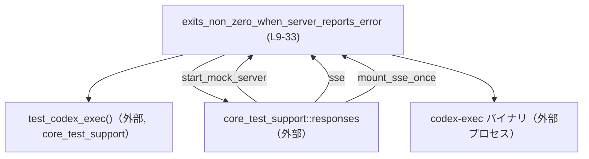
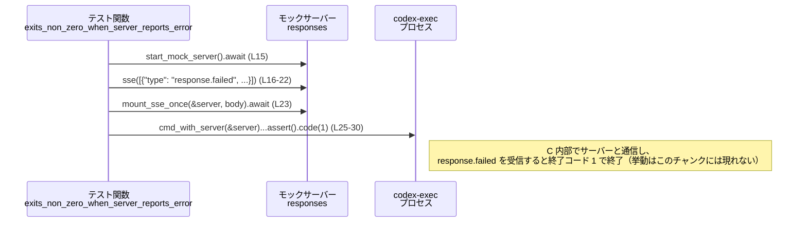

# exec/tests/suite/server_error_exit.rs

## 0. ざっくり一言

サーバーがエラー（`response.failed` イベント）を報告したときに、`codex-exec` バイナリが **非ゼロ終了コード（1）で終了すること** を検証する非 Windows 向けの非同期テストです（`cfg(not(target_os = "windows"))`、`#[tokio::test]`、`code(1)` より、`exec/tests/suite/server_error_exit.rs:L1-2,L9-10,L29-30`）。

---

## 1. このモジュールの役割

### 1.1 概要

- このファイルは、`codex-exec` という実行バイナリが **バックエンドサーバーからのエラー通知をどのように扱うか** を検証するためのテストを 1 件だけ定義しています（`exec/tests/suite/server_error_exit.rs:L7-10`）。
- サーバーを模倣するモックサーバー（`responses::start_mock_server`）に対し、SSE（Server-Sent Events）ストリームで `response.failed` イベントを 1 件だけ配信させ、その結果 `codex-exec` が終了コード 1 で終了することを確認します（`exec/tests/suite/server_error_exit.rs:L15-23,L25-30`）。

### 1.2 アーキテクチャ内での位置づけ

このテストは、本体ロジックではなく **テストスイート** に属し、以下の外部コンポーネントに依存しています。

- `core_test_support::test_codex_exec::test_codex_exec`  
  `codex-exec` バイナリをテストしやすく扱うためのヘルパーを返す関数（定義はこのチャンクにはありません）。`exec/tests/suite/server_error_exit.rs:L5,L11`
- `core_test_support::responses` モジュール  
  モックレスポンスサーバーの起動・SSE ストリーム生成・マウント用ヘルパー群（定義はこのチャンクにはありません）。`exec/tests/suite/server_error_exit.rs:L4,L15-16,L23`

Mermaid での依存関係図は次の通りです（この図は **このファイル内で呼び出している範囲（L4-33）** を表します）。



※ `codex-exec` バイナリの実装や、`core_test_support` 内部の実装は **このチャンクには現れません**。テスト関数からこれらの API を呼び出している事実だけが確認できます。

### 1.3 設計上のポイント

コードから読み取れる設計上の特徴は次の通りです。

- **非 Windows 環境のみで有効**  
  `#![cfg(not(target_os = "windows"))]` により、このテストモジュールは Windows ではコンパイルされません（`exec/tests/suite/server_error_exit.rs:L1`）。
- **非同期かつマルチスレッドなテスト実行**  
  `#[tokio::test(flavor = "multi_thread", worker_threads = 2)]` により、Tokio のマルチスレッドランタイム上で非同期テストとして実行されます（`exec/tests/suite/server_error_exit.rs:L9-10`）。
- **エラー伝搬のための `anyhow::Result`**  
  テスト関数は `anyhow::Result<()>` を返すシグネチャですが、本文では `Ok(())` のみ返しており、明示的な `Err` や `?` は使っていません（`exec/tests/suite/server_error_exit.rs:L10,L32`）。  
  実質的に、テスト失敗は `.assert().code(1)` や外部ヘルパーの中で起こるパニック／アサートに依存します。
- **外部プロセスを用いるブラックボックステスト**  
  `test.cmd_with_server(&server)` のメソッドチェーンから、別プロセスとして `codex-exec` を起動し、その終了コードを検証するブラックボックステストであることが分かります（`exec/tests/suite/server_error_exit.rs:L11,L25-30`）。
- **SSE によるサーバー側イベントの模倣**  
  `responses::sse` と `responses::mount_sse_once` を用いて、SSE ストリームで `response.failed` イベントを一度だけ返すモックサーバーを構成しています（`exec/tests/suite/server_error_exit.rs:L15-23`）。  
  これにより、「サーバーがエラーを報告する」状況を再現しています。

---

## 2. 主要な機能一覧

このファイルが提供する主要な機能は 1 つのテスト関数です。

- `exits_non_zero_when_server_reports_error`:  
  モックサーバーが `response.failed` イベントを返したときに `codex-exec` が終了コード 1 で終了することを検証する非同期テスト（`exec/tests/suite/server_error_exit.rs:L9-33`）。

---

## 3. 公開 API と詳細解説

### 3.1 型・関数一覧（コンポーネントインベントリー）

#### このファイル内で定義される型

このファイル内では、独自の構造体・列挙体などの **新しい型定義はありません**。

| 名前 | 種別 | 役割 / 用途 | 定義位置 |
|------|------|-------------|----------|
| なし | -    | -           | -        |

#### このファイル内で定義される関数

| 名前 | 種別 | 役割 / 用途 | 定義位置 |
|------|------|-------------|----------|
| `exits_non_zero_when_server_reports_error` | 非公開 `async` 関数（テスト、`#[tokio::test]`） | サーバーの `response.failed` イベントに対し `codex-exec` が終了コード 1 で終了することを検証する | `exec/tests/suite/server_error_exit.rs:L9-33` |

> 以降の詳細解説では、このテスト関数を中心に説明します。

---

### 3.2 関数詳細

#### `exits_non_zero_when_server_reports_error() -> anyhow::Result<()>`

**概要**

- Tokio のマルチスレッドランタイム上で実行される非同期テストです（`#[tokio::test(flavor = "multi_thread", worker_threads = 2)]`、`exec/tests/suite/server_error_exit.rs:L9-10`）。
- モックサーバーに SSE で `response.failed` イベントを一度だけ返させ、そのサーバーを参照する形で `codex-exec` を起動し、終了コードが **1** であることを検証します（`exec/tests/suite/server_error_exit.rs:L15-23,L25-30`）。
- 成功時には `Ok(())` を返し、テストフレームワーク（Tokio + テストランナー）の観点では「テスト成功」となります（`exec/tests/suite/server_error_exit.rs:L32`）。

**引数**

この関数は引数を取りません。

| 引数名 | 型 | 説明 |
|--------|----|------|
| なし   | -  | -    |

**戻り値**

- 型: `anyhow::Result<()>`（`exec/tests/suite/server_error_exit.rs:L10`）
  - `Ok(())` のみが実際に返されています（`exec/tests/suite/server_error_exit.rs:L32`）。
  - 関数内で `?` 演算子や `Err(...)` を返していないため、エラー終了は **関数内では明示的に行われていません**。  
    テスト失敗は `.assert()` 等からのパニックにより検出される設計です（`exec/tests/suite/server_error_exit.rs:L25-30`）。

**内部処理の流れ（アルゴリズム）**

行番号に沿って、処理の流れを分解します。

1. **テスト用ハンドルの取得**  
   `let test = test_codex_exec();`（`exec/tests/suite/server_error_exit.rs:L11`）  
   - `core_test_support::test_codex_exec::test_codex_exec` を呼び出し、`codex-exec` を操作するためのテスト用オブジェクトを取得します。  
   - 戻り値の具体的な型はこのチャンクには現れませんが、後続で `.cmd_with_server(...)` メソッドを呼び出せるオブジェクトです（`exec/tests/suite/server_error_exit.rs:L25`）。

2. **モックサーバーの起動**  
   `let server = responses::start_mock_server().await;`（`exec/tests/suite/server_error_exit.rs:L15`）  
   - `core_test_support::responses::start_mock_server` を `await` して、SSE レスポンスを提供するモックサーバーを起動します。
   - 戻り値 `server` の型はこのチャンクには現れませんが、少なくとも `&server` を参照として渡せる値です（`exec/tests/suite/server_error_exit.rs:L23,L25`）。

3. **SSE ストリームボディの構築**  

   ```rust
   let body = responses::sse(vec![serde_json::json!({
       "type": "response.failed",
       "response": {
           "id": "resp_err_1",
           "error": {"code": "rate_limit_exceeded", "message": "synthetic server error"}
       }
   })]);
   ```  

   （`exec/tests/suite/server_error_exit.rs:L16-22`）
   - `serde_json::json!` マクロで `response.failed` イベントを表す JSON オブジェクトを 1 つ生成し、それを `Vec` に包んで `responses::sse` に渡しています（`exec/tests/suite/server_error_exit.rs:L16-22`）。
   - `responses::sse` の戻り値の型やデータフォーマットはこのチャンクには現れませんが、後で `mount_sse_once` に渡され、SSE ストリームとして扱われることが分かります（`exec/tests/suite/server_error_exit.rs:L23`）。

4. **SSE ストリームのマウント（1 回限り）**  
   `responses::mount_sse_once(&server, body).await;`（`exec/tests/suite/server_error_exit.rs:L23`）  
   - モックサーバー `server` に対して、先ほど構築した `body` を SSE ストリームとして 1 回だけ返すように設定していると解釈できます（関数名と引数からの推測）。  
   - 具体的な実装はこのチャンクには現れません。

5. **`codex-exec` の起動と終了コードの検証**  

   ```rust
   test.cmd_with_server(&server)
       .arg("--skip-git-repo-check")
       .arg("tell me something")
       .arg("--experimental-json")
       .assert()
       .code(1);
   ```  

   （`exec/tests/suite/server_error_exit.rs:L25-30`）
   - `test.cmd_with_server(&server)` によって、モックサーバー `server` を利用する設定で `codex-exec` コマンドを構築します（`exec/tests/suite/server_error_exit.rs:L25`）。
   - `.arg(...)` を 3 回呼び出し、コマンドライン引数を設定しています（`exec/tests/suite/server_error_exit.rs:L26-28`）。
     - `--skip-git-repo-check`: Git リポジトリチェックをスキップするフラグと推測できます（引数名からの推測）。  
     - `"tell me something"`: CLI へのプロンプト／入力テキストと考えられます。
     - `--experimental-json`: JSON 形式での出力など、実験的機能を有効化するフラグと推測できます（引数名からの推測）。
   - `.assert().code(1)` により、プロセスの終了コードが 1 であることを検証します。  
     - ここで 1 以外の終了コードだった場合、`assert()` 由来のアサーションエラー／パニックとしてテスト全体が失敗します。

6. **正常終了**  
   `Ok(())` を返し、テスト関数としては正常終了します（`exec/tests/suite/server_error_exit.rs:L32`）。

**使用例（Examples）**

この関数自体が使用例に相当しますが、簡略化した形で同様のテストを書く場合のサンプルを示します。

```rust
use core_test_support::responses;                       // モックレスポンス用ヘルパーをインポート
use core_test_support::test_codex_exec::test_codex_exec; // codex-exec テスト用ヘルパーをインポート

#[tokio::test(flavor = "multi_thread", worker_threads = 2)] // Tokio のマルチスレッドテスト
async fn exits_non_zero_on_server_error_example() -> anyhow::Result<()> { // anyhow::Result でラップ
    let test = test_codex_exec();                       // codex-exec を操作するテストハンドルを取得

    let server = responses::start_mock_server().await;  // モックサーバーを非同期に起動

    // サーバーが即座に response.failed イベントを 1 回返すように設定する
    let body = responses::sse(vec![serde_json::json!({
        "type": "response.failed",
        "response": {
            "id": "example",
            "error": {"code": "some_error", "message": "example error"}
        }
    })]);                                               // 単一のエラーイベントから SSE ボディを生成

    responses::mount_sse_once(&server, body).await;     // モックサーバーに SSE ボディを 1 回だけマウント

    // モックサーバーを指す codex-exec プロセスを起動し、終了コード 1 を期待する
    test.cmd_with_server(&server)                       // サーバーを紐づけたコマンドを構築
        .arg("--skip-git-repo-check")                   // テスト環境依存の Git チェックをスキップ
        .arg("some prompt")                             // CLI に渡すテキスト
        .arg("--experimental-json")                     // JSON 出力などの実験的フラグ
        .assert()                                       // コマンド実行 & アサーションチェーン開始
        .code(1);                                       // 終了コードが 1 であることを検証

    Ok(())                                              // テスト関数としては成功を返す
}
```

**Errors / Panics**

- **戻り値としての `Err`**  
  この関数本文では `Err` を返していないため、`anyhow::Result` を通じてエラーを返す経路はありません（`exec/tests/suite/server_error_exit.rs:L10,L32`）。
- **パニックの可能性**  
  - `.assert().code(1)` が **期待通りでない終了コード** を検出した場合、内部でパニック／アサーションエラーを発生させる可能性があります（具体的実装はこのチャンクには現れませんが、一般的な `assert` スタイル API の挙動と整合します）。`exec/tests/suite/server_error_exit.rs:L25-30`
  - `responses::start_mock_server` や `responses::mount_sse_once` 内部でも、ポートのバインド失敗などに起因するパニック／エラーが起こり得ますが、その詳細はこのチャンクには現れません（`exec/tests/suite/server_error_exit.rs:L15,L23`）。

**Edge cases（エッジケース）**

このテストコードの観点から想定されるエッジケースは次の通りです。

- **モックサーバーが正しく起動しない場合**  
  - `start_mock_server().await` が失敗した場合の挙動はこのチャンクでは不明ですが、通常はエラーまたはパニックとなりテストが失敗すると考えられます（`exec/tests/suite/server_error_exit.rs:L15`）。
- **SSE ストリームが空の場合**  
  - このテストでは `vec![...]` に 1 要素だけを渡しているため、**空ストリームのケースは扱っていません**（`exec/tests/suite/server_error_exit.rs:L16-22`）。  
    空の SSE を渡した場合の挙動は不明です（このチャンクには現れません）。
- **終了コードが 1 以外の場合**  
  - `codex-exec` が 0（成功）や 2 など別の終了コードで終了した場合、`.code(1)` の検証が失敗し、テスト全体が失敗します（`exec/tests/suite/server_error_exit.rs:L25-30`）。
- **Windows 上での挙動**  
  - `cfg(not(target_os = "windows"))` のため、このテストは Windows ではコンパイル・実行されません（`exec/tests/suite/server_error_exit.rs:L1`）。  
    Windows 上での `codex-exec` の終了コードに関する挙動は、このテストからは分かりません。

**使用上の注意点**

- **非同期ランタイムの存在前提**  
  `#[tokio::test]` により、テストランナーが Tokio ランタイムを用意してくれる前提で書かれています。通常の `fn` テストとして呼び出すことはできません（`exec/tests/suite/server_error_exit.rs:L9-10`）。
- **外部プロセス依存**  
  `codex-exec` バイナリがビルドされ、テスト環境内で実行可能であることが前提です。ビルドされていない／PATH にない場合、`.cmd_with_server` 実行時にエラーとなる可能性があります（`exec/tests/suite/server_error_exit.rs:L11,L25`）。
- **Git リポジトリへの依存を避けるフラグ**  
  `--skip-git-repo-check` が付与されているため、このテストはローカルの Git 設定・状態に依存しないよう配慮されています（`exec/tests/suite/server_error_exit.rs:L26`）。  
  このフラグを外すと、環境によってテストが不安定になる可能性があります。
- **テストの契約（Contract）**  
  - 「サーバーが `response.failed` を返したとき、`codex-exec` は非ゼロ終了コード（ここでは 1）で終了する」という契約を明示的に表現しています（`exec/tests/suite/server_error_exit.rs:L7-8,L16-22,L29-30`）。
  - `codex-exec` の仕様を変更して、別の終了コードを使うようにした場合、このテストもそれに合わせて更新する必要があります。

---

### 3.3 その他の関数・外部依存

このファイル内で **定義されていない** が、呼び出されている関数やメソッドの一覧です。

| 名前 | 種別 | 役割（推測を含む） | このファイルでの使用位置 |
|------|------|--------------------|---------------------------|
| `core_test_support::test_codex_exec::test_codex_exec` | 関数 | `codex-exec` をテストするためのラッパー／ヘルパーオブジェクトを返す | `exec/tests/suite/server_error_exit.rs:L5,L11` |
| `core_test_support::responses::start_mock_server` | `async` 関数 | SSE レスポンスを返すモックサーバーを起動する | `exec/tests/suite/server_error_exit.rs:L4,L15` |
| `core_test_support::responses::sse` | 関数 | JSON ベクタから SSE ストリームボディを作成するヘルパーと推測される | `exec/tests/suite/server_error_exit.rs:L4,L16-22` |
| `core_test_support::responses::mount_sse_once` | `async` 関数 | 指定した SSE ボディをモックサーバーに 1 回だけマウントするヘルパーと推測される | `exec/tests/suite/server_error_exit.rs:L4,L23` |
| `test.cmd_with_server(&server)` | メソッド | モックサーバーを利用する設定で `codex-exec` のコマンド実行オブジェクトを構築する | `exec/tests/suite/server_error_exit.rs:L25` |
| `.arg(...)` | メソッド | プロセスのコマンドライン引数を追加する | `exec/tests/suite/server_error_exit.rs:L26-28` |
| `.assert()` | メソッド | コマンド実行および結果検証用のアサーションチェーンを開始する | `exec/tests/suite/server_error_exit.rs:L29` |
| `.code(1)` | メソッド | 終了コードが指定値（ここでは 1）であることを検証する | `exec/tests/suite/server_error_exit.rs:L29-30` |

これらの関数・メソッドの **具体的な実装やエラー条件** は、このチャンクには現れません。

---

## 4. データフロー

このテストにおける代表的なデータフローは「モックサーバーの SSE 設定 → `codex-exec` の実行 → 終了コード 1 の検証」です。

1. テスト関数が `responses::start_mock_server()` でモックサーバーを起動します（`exec/tests/suite/server_error_exit.rs:L15`）。
2. `serde_json::json!` で `response.failed` イベントを含む JSON を生成し、それを `responses::sse` に渡して SSE ボディを構築します（`exec/tests/suite/server_error_exit.rs:L16-22`）。
3. `responses::mount_sse_once(&server, body)` でモックサーバーに SSE ボディをマウントします（`exec/tests/suite/server_error_exit.rs:L23`）。
4. `test.cmd_with_server(&server)` により、モックサーバーに接続する設定で `codex-exec` を起動し、終了コードが 1 であることを `.assert().code(1)` で検証します（`exec/tests/suite/server_error_exit.rs:L25-30`）。

この流れを sequence diagram で表すと次のようになります（この図は **本ファイルの L9-33 に対応**）。



`codex-exec` プロセスとモックサーバー `R` の間の HTTP/SSE 通信はこのファイルには明示されていませんが、それを前提とするテストであることは `.cmd_with_server(&server)` という名前から推測できます。

---

## 5. 使い方（How to Use）

このファイル自体はテストモジュールであるため、「使い方」は **同様のテストを追加・変更するときのパターン** という観点で説明します。

### 5.1 基本的な使用方法

基本的な流れは次の 3 ステップです。

1. `test_codex_exec()` からテスト用ハンドルを取得する。
2. `responses` モジュールでモックサーバーと SSE ストリームを設定する。
3. `cmd_with_server` で `codex-exec` を起動し、`.assert().code(...)` で終了コードを検証する。

簡略版のコード例は 3.2 に示した通りです。

### 5.2 よくある使用パターン

このテストパターンは、次のようなバリエーションに応用できると考えられます（コードはこのチャンクには現れませんが、パラメータを変えるだけで実現可能です）。

- **異なるエラーコードに対する終了コード検証**  
  - `serde_json::json!` 内の `"error": {"code": ...}` を変更し、`codex-exec` が別のエラー種別に対しても同様に非ゼロで終了するか検証する。
- **正常系の挙動検証**  
  - `response.failed` ではなく成功イベントを SSE で返すモックサーバーを構成し、`codex-exec` が終了コード 0 で終了することを検証する（このテストファイルでは実装されていませんが、パターンとして自然です）。

### 5.3 よくある間違い

このパターンで起こり得る誤りと、その修正例を挙げます。

```rust
// 誤り例: モックサーバーに SSE をマウントせずにコマンドを実行している
let server = responses::start_mock_server().await;
// responses::mount_sse_once(&server, body).await; // ← 呼び忘れている

test.cmd_with_server(&server)
    .arg("tell me something")
    .assert()
    .code(1); // サーバーが何も返さないため、期待した挙動にならない可能性がある

// 正しい例: SSE ボディを生成し、モックサーバーにマウントしてからコマンド実行
let body = responses::sse(vec![serde_json::json!({
    "type": "response.failed",
    "response": { "id": "resp_err_1", "error": {"code": "rate_limit_exceeded", "message": "synthetic server error"} }
})]);
responses::mount_sse_once(&server, body).await;

test.cmd_with_server(&server)
    .arg("--skip-git-repo-check")
    .arg("tell me something")
    .arg("--experimental-json")
    .assert()
    .code(1);
```

また、非同期テスト特有の誤りとして次のようなものがあります。

```rust
// 誤り例: 非同期関数に #[tokio::test] を付け忘れる
async fn my_test() {
    // ...
}

// 正しい例: Tokio ランタイムで実行されるよう #[tokio::test] を付与する
#[tokio::test(flavor = "multi_thread", worker_threads = 2)]
async fn my_test() {
    // ...
}
```

### 5.4 使用上の注意点（まとめ）

- **プラットフォーム依存性**  
  - このテストは `cfg(not(target_os = "windows"))` のため Windows では動作しません（`exec/tests/suite/server_error_exit.rs:L1`）。
- **ポート競合の可能性**  
  - `start_mock_server` がどのポートを利用するかはこのチャンクには現れませんが、他のテストと同じポートを使用している場合、並列実行時に競合が発生する可能性があります。
- **終了コードの契約**  
  - `.code(1)` により、終了コード 1 を仕様として固定しています（`exec/tests/suite/server_error_exit.rs:L29-30`）。`codex-exec` 側の仕様変更時にはテストの更新が必要です。
- **セキュリティ上の注意**  
  - テストコードはローカルのモックサーバーとローカルプロセスのみを扱い、外部ネットワークへのアクセスやユーザー入力の処理は含んでいません。  
    このため、このファイル単体で目立ったセキュリティリスクは見当たりません。

---

## 6. 変更の仕方（How to Modify）

### 6.1 新しい機能（テストケース）を追加する場合

新しいサーバーエラーシナリオや正常系シナリオのテストを追加したい場合の手順は次の通りです。

1. **新しいテスト関数を追加**  
   - `#[tokio::test]` 属性付きの `async fn` を同ファイルまたは別のテストファイルに追加します。
2. **モックサーバーのセットアップ**  
   - `responses::start_mock_server().await` でモックサーバーを起動します（`exec/tests/suite/server_error_exit.rs:L15`）。
   - 必要に応じて `serde_json::json!` で別のイベント（成功・警告・別種のエラー）を構築し、`responses::sse` に渡して SSE ボディを作成します（`exec/tests/suite/server_error_exit.rs:L16-22`）。
   - `responses::mount_sse_once(&server, body).await` でサーバーにマウントします（`exec/tests/suite/server_error_exit.rs:L23`）。
3. **`codex-exec` の起動と検証**  
   - `test_codex_exec()` からハンドルを取得し（`exec/tests/suite/server_error_exit.rs:L11`）、`cmd_with_server(&server)` でプロセスを起動します（`exec/tests/suite/server_error_exit.rs:L25`）。
   - 想定するシナリオに応じて `.code(0)` や `.code(2)` など、期待する終了コードを指定します。

### 6.2 既存の機能（このテスト）を変更する場合

`codex-exec` の仕様変更に伴い、このテストを調整する場合の注意点です。

- **影響範囲の確認**  
  - このテストは「サーバーが `response.failed` を返した場合の終了コードは 1」という契約をテストしています（`exec/tests/suite/server_error_exit.rs:L7-8,L29-30`）。  
    終了コードを 2 など別の値に変更した場合、このテストおよび類似のテストを検索し、一括で更新する必要があります。
- **契約の確認**  
  - SSE イベントの形式（`"type": "response.failed"` や `"error": {"code": ...}`）が変わると、`codex-exec` 側のパースロジックに影響します。  
    仕様変更に合わせて `serde_json::json!({ ... })` の構造を更新する必要があります（`exec/tests/suite/server_error_exit.rs:L16-22`）。
- **テスト安定性の確認**  
  - モックサーバーの起動方法やポートの使い方を変更する場合、他のテストと干渉しないかを確認する必要があります（`exec/tests/suite/server_error_exit.rs:L15,23`）。
- **並行性の影響**  
  - `flavor = "multi_thread", worker_threads = 2` 設定を変更する場合、他の非同期テストと並行実行したときの挙動（特に共有リソースの利用）を確認する必要があります（`exec/tests/suite/server_error_exit.rs:L9-10`）。

---

## 7. 関連ファイル

このモジュールと密接に関係するファイル・モジュールは次の通りです（パスや内容は、このチャンクに現れる情報から分かる範囲に限ります）。

| パス / モジュール | 役割 / 関係 |
|-------------------|------------|
| `core_test_support::responses` | モックレスポンスサーバーの起動・SSE ストリーム生成・マウントなどを提供するテストサポートモジュール。`start_mock_server` / `sse` / `mount_sse_once` がこのテストから呼ばれています（`exec/tests/suite/server_error_exit.rs:L4,L15-16,L23`）。 |
| `core_test_support::test_codex_exec::test_codex_exec` | `codex-exec` バイナリをテストしやすく扱うためのヘルパーを返す関数。`cmd_with_server` などのメソッドチェーンを提供するオブジェクトを返します（`exec/tests/suite/server_error_exit.rs:L5,L11,L25-30`）。 |
| `exec/tests/suite/*` | 他のテストケースが存在すると考えられるディレクトリ（実際のファイル内容はこのチャンクには現れません）。本テストはその一部です。 |

`codex-exec` バイナリ本体のコード（例: `exec/src/main.rs` など）は、このチャンクには現れないため、正確なパスや構造は不明です。ただし、このテストはそのバイナリの終了コード仕様に対する回帰テストとして機能していると解釈できます。
