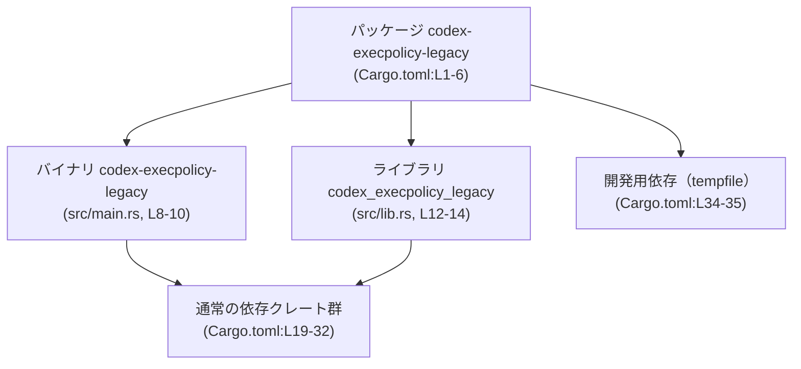
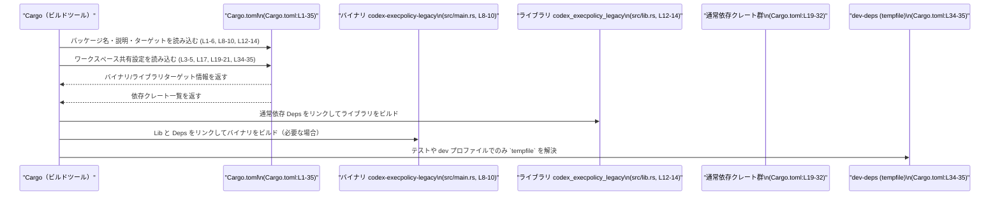

# execpolicy-legacy/Cargo.toml コード解説

## 0. ざっくり一言

このファイルは、`codex-execpolicy-legacy` という Rust クレートの Cargo マニフェストであり、**「提案された exec 呼び出しを検証するレガシー実行ポリシーエンジン」**（説明文より）のパッケージ構成・バイナリ／ライブラリターゲット・依存クレートを定義しています（execpolicy-legacy/Cargo.toml:L1-6, L8-10, L12-14, L19-32）。

---

## 1. このモジュールの役割

### 1.1 概要

- このマニフェストは、`codex-execpolicy-legacy` パッケージの **名前・説明・ターゲット（bin/lib）・依存クレート** を定義します（L1-6, L8-10, L12-14, L19-35）。
- パッケージ説明によると、このクレートは **proposed exec calls（提案された exec 呼び出し）を検証するレガシー実行ポリシーエンジン** であると記述されています（L6）。
- バージョン・エディション・ライセンス・lints・依存クレートのバージョンなどは、すべてワークスペース側で一元管理される構成になっています（L3-5, L17, L19-32, L34-35）。

このファイルには Rust の関数・構造体といった実装コードは含まれていません。公開 API やコアロジックは `src/lib.rs` や `src/main.rs` 側に存在しますが、このチャンクには現れません（L10, L14）。

### 1.2 アーキテクチャ内での位置づけ

Cargo の定義から、このクレートがワークスペース内で次のように位置づけられていることが分かります。

- ワークスペース内の 1 パッケージ（L1-5, L17, L19-21, L34-35）
- 1 つのバイナリターゲット `codex-execpolicy-legacy`（L8-10）
- 1 つのライブラリターゲット `codex_execpolicy_legacy`（L12-14）
- 共通の依存クレート群（L19-32）と dev-dependency `tempfile`（L34-35）

これを簡略化した依存関係図で示します。



この図は、**ビルド単位としての構成**のみを表しています。バイナリからライブラリを呼び出しているかどうか、ライブラリの公開 API がどうなっているか、といった実装上の依存関係は、このファイルからは分かりません。

### 1.3 設計上のポイント（Cargo.toml から読み取れる範囲）

Cargo マニフェストから読み取れる設計上の特徴は次の通りです。

- **ワークスペース一元管理**
  - `version.workspace = true`、`edition.workspace = true`、`license.workspace = true` により、バージョン・Edition・ライセンスはワークスペースルートで共通管理されています（L3-5）。
  - `[lints] workspace = true` により、Lint 設定もワークスペース側で共通化されています（L16-17）。
  - `allocative` から `starlark` までの依存クレート、`tempfile` の dev-dependency もすべて `{ workspace = true }` となっており、依存バージョンもワークスペースで共有されています（L19-32, L34-35）。
- **バイナリとライブラリの併存**
  - `[[bin]]` と `[lib]` が両方定義されており（L8-10, L12-14）、同一パッケージで実行可能ファイルとライブラリの両方を提供する構成になっています。
- **典型的な周辺機能の存在**
  - CLI 引数処理（`clap`、L22）
  - ログ出力（`log` と `env_logger`、L24-25）
  - シリアライズ／デシリアライズ（`serde`, `serde_json`, `serde_with`、L29-31）
  - 正規表現（`regex-lite`、L28）
  - ファイルパス操作（`path-absolutize`、L27）
  - マルチマップ構造（`multimap`、L26）
  - Starlark 言語サポート（`starlark`、L32）
  
  などが依存として列挙されています。ただし、これらが実際にどのような形で使用されているかは、このファイルからは分かりません。

---

## 2. 主要な機能一覧

このファイル自体は設定ファイルであり、Rust の関数やメソッドを定義していません。そのため、ここでは **Cargo.toml から推測できる「クレート全体としての機能カテゴリ」** を列挙します（いずれも実際の実装内容は別ファイルで確認が必要です）。

- 実行ポリシーエンジン:
  - `description` により、「提案された exec 呼び出しを検証するレガシー exec policy engine」であることが明示されています（L6）。
- コマンドラインツール:
  - `[[bin]]` によりバイナリターゲットが定義されており（L8-10）、`clap` 依存（L22）から CLI ツールとしての利用が想定されます。
- ライブラリ API 提供:
  - `[lib]` によりライブラリターゲットが定義されており（L12-14）、他クレートから `codex_execpolicy_legacy` として利用できる構成になっています。
- ロギング:
  - `log` / `env_logger` の依存により、ログ出力機構を備えていると考えられます（L24-25）。
- シリアライズ／設定:
  - `serde`, `serde_json`, `serde_with` 依存から、構造体のシリアライズや JSON ベースの設定・データ入出力が使われている可能性があります（L29-31）。
- Starlark ベースの処理:
  - `starlark` 依存（L32）から、Starlark スクリプトを何らかの形で扱うコードが存在する可能性がありますが、用途はこのファイルだけでは断定できません。

---

## 3. 公開 API と詳細解説

### 3.1 型一覧（構造体・列挙体など）／コンポーネント一覧

このファイルには Rust の型定義は登場しないため、ここでは **ビルドターゲットと依存コンポーネント** を整理します。

| 名前 | 種別 | 役割 / 用途 | 定義位置 |
|------|------|-------------|----------|
| `codex-execpolicy-legacy` | パッケージ名 | ワークスペース内の 1 クレート。実行ポリシーエンジンを提供するパッケージと記述されています。 | execpolicy-legacy/Cargo.toml:L1-6 |
| `codex-execpolicy-legacy` | バイナリターゲット | `src/main.rs` をエントリポイントとする実行ファイル。CLI ツールであることが想定されますが、具体的な挙動は不明です。 | execpolicy-legacy/Cargo.toml:L8-10 |
| `codex_execpolicy_legacy` | ライブラリターゲット | `src/lib.rs` を本体とするライブラリ crate。公開 API やモジュール構成はこのファイルからは分かりません。 | execpolicy-legacy/Cargo.toml:L12-14 |
| `allocative` ほか依存群 | 通常依存クレート | パッケージのビルド／実行に必要な外部クレート。全て `{ workspace = true }` でバージョン管理されています。 | execpolicy-legacy/Cargo.toml:L19-32 |
| `tempfile` | 開発用依存クレート | テストや開発時に使用される dev-dependency。`tempfile` の存在から一時ファイルを使うテストが書かれている可能性があります。 | execpolicy-legacy/Cargo.toml:L34-35 |

### 3.2 関数詳細（最大 7 件）

本ファイルには Rust の関数定義が一切含まれていません（execpolicy-legacy/Cargo.toml:L1-35）。

- 公開 API（関数・メソッド・型）は、`src/lib.rs` や `src/main.rs`、およびそれが参照するモジュールに実装されていると考えられますが、このチャンクには現れないため、**具体的な関数シグネチャやエラー型、並行性の扱い**については何も記述できません。
- したがって、このセクションで説明すべき「代表的な関数」は **該当なし** となります。

### 3.3 その他の関数

- 本ファイルには補助関数やラッパー関数を含め、**いかなる Rust コードも定義されていません**（L1-35）。

---

## 4. データフロー

### 4.1 このファイルから分かるデータフローの範囲

- `Cargo.toml` はビルドツール Cargo が読む設定ファイルであり、**実行時のビジネスロジックにおけるデータの流れ**は記述されていません。
- このため、実際に「exec 呼び出し」がどのようなデータ構造でライブラリに渡され、どのような検証を経て結果が返るか、といったフローはこのチャンクからは不明です。
- ここでは代わりに、**ビルド時に Cargo がこのマニフェストをどのように利用するか**という観点でのデータフローを示します。

### 4.2 ビルド時の処理フロー（Cargo 観点）



この図は、**マニフェスト情報がビルドにどのように影響するか**を示したものであり、実行時のデータ構造やアルゴリズムの流れについては何も表していません。

### 4.3 言語固有の安全性・エラー・並行性（このチャンクから分かること）

- Rust における **メモリ安全性・エラー処理・並行性の扱い**は、ソースコード側（`src/lib.rs` やその配下のモジュール）に依存します。
- Cargo.toml から直接読み取れるのは、
  - エラー処理に `anyhow` を使っている可能性が高い（L21）
  - ロギングに `log` / `env_logger` を使っている（L24-25）
  - Starlark インタプリタを利用している可能性がある（L32）
  といった **利用クレートレベルの情報**のみです。
- **実際にどのような Result / Error 型が使われているか、どの程度スレッド安全な設計か、どのような並列実行モデルを取っているか**などは、このチャンクには現れません。

---

## 5. 使い方（How to Use）

### 5.1 基本的な使用方法（ビルドと実行）

実際の API 呼び出し例はソースコードがないため示せませんが、このパッケージを **CLI ツールとして／ライブラリとして**使うための基本的な入口は Cargo.toml から分かります。

#### 5.1.1 CLI ツールとしての実行

このパッケージ自身を CLI として実行する場合の典型的なコマンド例です。

```bash
# ワークスペースルートから、このクレートのバイナリを実行する例
cargo run -p codex-execpolicy-legacy -- --help
```

- `-p codex-execpolicy-legacy` は `name = "codex-execpolicy-legacy"` に対応しています（execpolicy-legacy/Cargo.toml:L2）。
- 実際にどのようなサブコマンド／オプションが存在するかは、`clap` を使った `src/main.rs` の実装を確認する必要があります（L10, L22）。

#### 5.1.2 ライブラリとして他クレートから利用する

同じワークスペース内や別プロジェクトから、このライブラリターゲットを利用する場合の Cargo.toml 側の例です。

```toml
[dependencies]
codex-execpolicy-legacy = { path = "path/to/execpolicy-legacy" }
```

- 実際のパスはワークスペース構成によって異なります。
- Rust コード側では `codex_execpolicy_legacy` という crate 名で `use` することが想定されますが（execpolicy-legacy/Cargo.toml:L13）、**どのモジュールや関数が公開されているかはこのチャンクからは不明**です。

### 5.2 よくある使用パターン（推測できる範囲）

Cargo.toml から推測できる「利用パターンの種類」だけを挙げます。具体の API 名は不明です。

- CLI 実行パターン:
  - コマンドライン引数でポリシーファイルや設定ファイル、検証対象の exec 呼び出し定義などを渡し、検証結果を標準出力や終了コードで返すような CLI が考えられます。
  - これは `clap` 依存があることからの一般的な推測であり、**実際のオプション構成はコードを確認する必要があります**（L22）。
- ライブラリ利用パターン:
  - 他のクレートから、「exec 呼び出しの情報（構造体など）」を渡すと「ポリシー検証結果（OK/NG や理由）」が返るような API が提供されている可能性がありますが、**関数名や型は Cargo.toml からは一切分かりません**。

### 5.3 よくある間違い（Cargo レベル）

このファイルに関して起こりうる誤用は、主に Cargo の設定レベルに関するものです。

```toml
# （誤り例）ワークスペース外に単独でコピーして使用しようとする
[package]
name = "codex-execpolicy-legacy"
version.workspace = true    # ルートに version がないとエラーになる
edition.workspace = true
license.workspace = true

# 正しい前提：ワークスペースルートに version / edition / license などが定義されている
```

- このマニフェストは、`version.workspace = true` などワークスペース前提の記述が多数あるため（L3-5, L17, L19-21, L34-35）、**ワークスペース外に単独でコピーして使おうとすると Cargo の設定エラー**になります。

### 5.4 使用上の注意点（まとめ）

Cargo.toml から読み取れる範囲での注意点をまとめます。

- **ワークスペース前提**
  - `version.workspace = true` / `edition.workspace = true` / `license.workspace = true` / `lints.workspace = true` / 依存クレートの `{ workspace = true }` により、このマニフェストは **ワークスペースルートの Cargo.toml の設定に依存**しています（L3-5, L17, L19-21, L34-35）。
  - 単独パッケージとして切り出す場合、これらを具体値に書き換える必要があります。
- **セキュリティ上の性質**
  - 説明文から、このクレートは exec 呼び出しの検証というセキュリティ的に重要な役割を担う可能性があります（L6）。
  - ただし、実際の検証ロジックやバリデーションの厳密さ・エラー時の扱いについてはコードを確認する必要があります。
- **ログ・エラーの扱い**
  - ログ関連（`log`, `env_logger`）・エラーラッパ（`anyhow`）といった依存の存在から、ログやエラー出力は何らかの形で行われていると考えられますが（L21, L24-25）、**ログレベルやエラーの分類などの詳細はこのチャンクからは不明**です。

---

## 6. 変更の仕方（How to Modify）

このセクションでは、**Cargo.toml レベルでの変更**に限定して説明します。実際の Rust コードの変更方法は、このチャンクからは説明できません。

### 6.1 新しい機能を追加する場合（Cargo.toml 側）

新しい機能を実装する際、Cargo.toml に関係しそうな変更ポイントは次の通りです。

1. **新しい依存クレートを追加する**
   - 何らかの新機能に別の外部クレートが必要になった場合、`[dependencies]` または `[dev-dependencies]` に追記します。
   - このパッケージでは既存依存はすべて `{ workspace = true }` となっているため（L19-32, L34-35）、**可能であればワークスペースルートでバージョン定義を行い、ここでは `{ workspace = true }` のみを記述するスタイルを維持**するのが自然です。
2. **バイナリターゲットを追加する**
   - 別の CLI エントリポイントを増やしたい場合、`[[bin]]` を複数記述することができます。
   - ただし、このファイルには既に `codex-execpolicy-legacy` というバイナリが 1 つ定義されているため（L8-10）、新バイナリは別名を付ける必要があります。
3. **ライブラリ名やパスの変更**
   - ライブラリの crate 名や `src/lib.rs` 以外のパスを使いたい場合は、`[lib]` セクション（L12-14）を変更します。
   - 他クレートが `codex_execpolicy_legacy` を前提に依存している場合、crate 名の変更は広範囲に影響を与えるため、事前に参照箇所を確認する必要があります。

### 6.2 既存の機能を変更する場合（Cargo.toml 観点）

Cargo.toml 内の既存設定を変更する場合の注意点です。

- **バージョン・Edition・ライセンス**
  - これらはワークスペース共有設定 (`*.workspace = true`) であるため（L3-5）、変更はワークスペースルートで行うことになります。
- **依存クレートの入れ替え**
  - 例えば `regex-lite` を別の正規表現クレートに変更したい場合（L28）、ワークスペースルート側の依存定義を変更する必要があり、この crate 以外の影響範囲も考慮する必要があります。
- **テスト関連**
  - `tempfile` 依存（L34-35）を削除・変更する場合、テストコード（たとえば `tests/` や `src` 内の `#[cfg(test)]`）での利用箇所を確認する必要があります。このチャンクにはテストコードが含まれないため、具体的な影響範囲は不明です。

---

## 7. 関連ファイル

この Cargo.toml から推測できる、密接に関連するファイル・設定を一覧にします。

| パス / ファイル | 役割 / 関係 | 根拠 |
|----------------|------------|------|
| `src/main.rs` | バイナリターゲット `codex-execpolicy-legacy` のエントリポイント。CLI のメイン関数や引数処理が実装されていると考えられます。 | `path = "src/main.rs"`（execpolicy-legacy/Cargo.toml:L10） |
| `src/lib.rs` | ライブラリターゲット `codex_execpolicy_legacy` の本体。公開 API やポリシーエンジンの中核ロジックが置かれている可能性があります。 | `path = "src/lib.rs"`（execpolicy-legacy/Cargo.toml:L14） |
| ワークスペースルートの `Cargo.toml` | `version.workspace = true` や依存クレートの `{ workspace = true }` の具体値を定義しているファイル。Edition・ライセンス・lint 設定などもここで決まります。 | `*.workspace = true` 設定（execpolicy-legacy/Cargo.toml:L3-5, L17, L19-21, L34-35） |
| テストコード（場所不明） | `tempfile` dev-dependency を利用するテストコード。ユニットテスト／統合テストのいずれかに存在する可能性がありますが、このチャンクからは位置は分かりません。 | `[dev-dependencies]\ntempfile = { workspace = true }`（execpolicy-legacy/Cargo.toml:L34-35） |

---

### まとめ（このチャンクから分かること／分からないこと）

- 分かること
  - クレート名・バイナリ／ライブラリターゲット名とパス（L1-6, L8-10, L12-14）
  - ワークスペース共有設定の存在（L3-5, L17, L19-21, L34-35）
  - 依存クレートと、ログ／CLI／シリアライズ／Starlark などの周辺技術が利用されていること（L19-32）
- 分からないこと
  - ライブラリの公開 API（関数・型の詳細）、コアロジックのアルゴリズム、エラー型や並行性モデル
  - 実際のポリシー表現形式（Starlark や JSON など）と具体的な検証手順
  - テストの内容やカバレッジ、実際のセキュリティ保証のレベル

これらの詳細を把握するには、`src/lib.rs` や `src/main.rs`、および関連モジュール・テストコードの内容が必要です。
