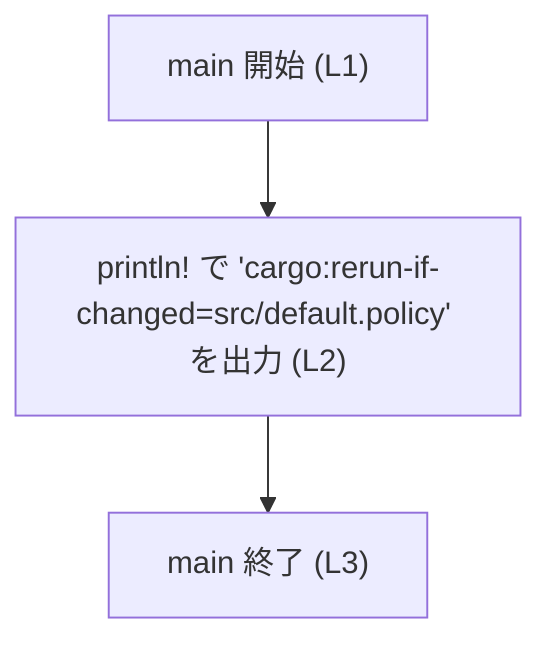
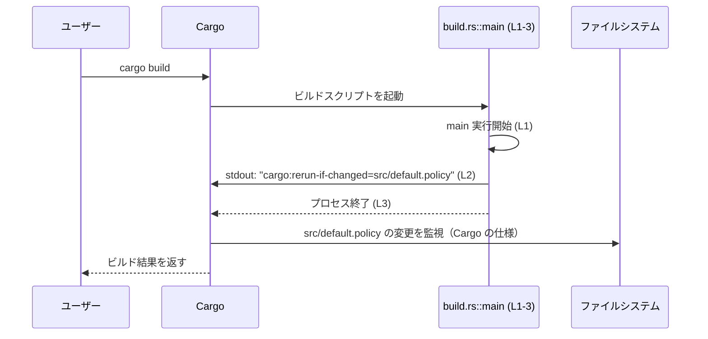

# execpolicy-legacy/build.rs

## 0. ざっくり一言

`execpolicy-legacy` クレート用の Cargo ビルドスクリプトで、`src/default.policy` が変更されたときだけビルドスクリプトを再実行するよう Cargo に指示する役割を持ちます（`println!` の出力を利用）【execpolicy-legacy/build.rs:L1-3】。

---

## 1. このモジュールの役割

### 1.1 概要

- このファイルは Cargo によって自動的に実行されるビルドスクリプト（`build.rs`）です。
- ビルドスクリプトのエントリポイント `main` 関数内で、`src/default.policy` の変更を監視させるためのメタ情報を標準出力へ出力します【execpolicy-legacy/build.rs:L1-3】。
- これにより、`src/default.policy` が変わらない限り、ビルドスクリプトが不要に再実行されないように制御されます。

### 1.2 アーキテクチャ内での位置づけ

このファイルが、ビルドプロセス全体の中でどのように位置づけられるかを簡易に図示します。

```mermaid
flowchart LR
    subgraph Crate["execpolicy-legacy クレート"]
        BuildRs["build.rs::main (L1-3)"]
    end

    Cargo["Cargo ビルドシステム"] -->|"ビルド時に実行"| BuildRs
    BuildRs -->|"stdout に 'cargo:rerun-if-changed=src/default.policy' を出力"| CargoMeta["Cargo のメタ情報解釈"]
    BuildRs -.->|"パス文字列として参照"| DefaultPolicy["\"src/default.policy\"（ファイルパス）"]

    CargoMeta -->|"ファイル変更検知条件の更新"| RebuildLogic["再ビルド判定ロジック"]
```

- `build.rs::main` は Cargo から呼ばれるだけで、他の Rust モジュールから直接呼び出されることはありません（Cargo の一般的な仕様による）。
- `src/default.policy` というパスを文字列として埋め込んでおり【execpolicy-legacy/build.rs:L2】、そのファイルの変更状況に応じて Cargo の再ビルド判定に影響を与えます。

### 1.3 設計上のポイント

コードから読み取れる設計上の特徴は次のとおりです。

- **単一責務・ステートレス**
  - 関数は `main` ひとつで、内部で状態を持たず、1 行の出力のみを行います【execpolicy-legacy/build.rs:L1-3】。
- **標準出力によるメタ情報の伝達**
  - Cargo ビルドスクリプトの慣習に従い、`println!` を通じてメタ情報（`cargo:rerun-if-changed=...`）を出力します【execpolicy-legacy/build.rs:L2】。
- **エラーハンドリングの省略**
  - `println!` の結果に対するエラーハンドリングは行っていません【execpolicy-legacy/build.rs:L2】。I/O エラーが起きた場合は `println!` マクロ内部で panic する可能性がありますが、コード上で明示的に扱ってはいません。
- **並行性**
  - 並行処理やスレッドは使用しておらず、単一スレッドで直列に 1 回だけ実行される前提の処理になっています【execpolicy-legacy/build.rs:L1-3】。

---

## 2. 主要な機能一覧

このファイルが提供する機能は非常に限定的です。

- ビルドスクリプトのエントリポイント: Cargo に対して「`src/default.policy` が変更されたときだけ再実行する」条件を伝える。

---

## 3. 公開 API と詳細解説

このファイルはクレートの通常の「公開 API」（他モジュールから呼び出される関数や型）を提供していません。Cargo から直接実行されるビルドスクリプト専用エントリポイントのみ存在します。

### 3.1 型一覧（構造体・列挙体など）

このファイル内に独自の型定義はありません【execpolicy-legacy/build.rs:L1-3】。

| 名前 | 種別 | 役割 / 用途 | 定義箇所 |
|------|------|------------|----------|
| なし | -    | -          | -        |

### コンポーネント一覧（関数）

このチャンクに現れる関数の一覧です。

| 名前  | 種別       | 役割 / 用途                                                                 | 定義箇所                                 |
|-------|------------|------------------------------------------------------------------------------|------------------------------------------|
| `main` | 関数（ビルドスクリプト） | Cargo ビルドスクリプトのエントリポイントとして、`cargo:rerun-if-changed=src/default.policy` を出力する | `execpolicy-legacy/build.rs:L1-3` |

※ このチャンク以外に定義されている関数・構造体は、このチャンクからは分かりません（「このチャンクには現れません」）。

### 3.2 関数詳細

#### `fn main()`

**概要**

- Cargo によってビルド時に自動的に実行されるエントリポイントです【execpolicy-legacy/build.rs:L1】。
- 実行時に標準出力へ `cargo:rerun-if-changed=src/default.policy` という行を出力し、`src/default.policy` の変更を監視するよう Cargo に指示します【execpolicy-legacy/build.rs:L2】。

**引数**

- 引数はありません【execpolicy-legacy/build.rs:L1】。

**戻り値**

- 戻り値は `()`（ユニット型）で、何も返しません【execpolicy-legacy/build.rs:L1】。

**内部処理の流れ（アルゴリズム）**

1. 関数 `main` が Cargo によって起動されます【execpolicy-legacy/build.rs:L1】。
2. `println!` マクロを呼び出し、`"cargo:rerun-if-changed=src/default.policy"` という文字列を標準出力に出力します【execpolicy-legacy/build.rs:L2】。
   - Cargo のビルドスクリプト仕様では、このような形式の出力をパースし、指定されたパスのファイルが変更されたときにのみビルドスクリプトを再実行するように扱います（Rust/Cargo の一般的な仕様に基づく説明であり、このファイルのコードには直接記述されていません）。
3. `main` 関数はそのまま終了します【execpolicy-legacy/build.rs:L3】。

簡単なフロー図を示します。



**Examples（使用例）**

この関数は Cargo によって自動的に呼び出されるため、利用者が直接呼ぶことはありません。参考として、ほぼ同じ内容の `build.rs` を持つプロジェクト全体のイメージを示します。

```rust
// execpolicy-legacy/build.rs
fn main() {                                                           // ビルドスクリプトのエントリポイント
    // src/default.policy が変更されたときだけビルドスクリプトを再実行するよう Cargo に指示
    println!("cargo:rerun-if-changed=src/default.policy");
}
```

この `build.rs` をプロジェクトルートに置いておくと、`cargo build` 実行時にこの `main` が走り、以降は `src/default.policy` を変更したときにのみ再実行されるようになります（Cargo の仕様による）。

**Errors / Panics**

- コード中に明示的なエラーハンドリングはありません【execpolicy-legacy/build.rs:L1-3】。
- Rust 標準ライブラリの仕様上、`println!` は標準出力への書き込みに失敗した場合に panic する可能性がありますが、その場合もこの関数内では捕捉していません【execpolicy-legacy/build.rs:L2】。
- `src/default.policy` の存在確認や読み込みは行っていないため、この関数自身はそのファイルの有無に直接依存していません【execpolicy-legacy/build.rs:L2】。

**Edge cases（エッジケース）**

コードから直接読み取れる範囲のエッジケースは次のとおりです。

- **`src/default.policy` が存在しない場合**
  - この関数内ではファイル I/O を行っておらず、文字列としてパスを出力しているだけです【execpolicy-legacy/build.rs:L2】。
  - 従って、ビルドスクリプトの実行時点でこのファイルが存在しなくても、少なくともこの関数の中でエラーになるコードは書かれていません（実際に Cargo がどう扱うかは Cargo の仕様によります）。
- **標準出力が利用できない／閉じている場合**
  - その場合、`println!` の内部で panic する可能性がありますが、このコードではそれを捕捉していません【execpolicy-legacy/build.rs:L2】。
- **同一ビルド内で複数回呼ばれるケース**
  - コードは副作用として 1 行出力するだけであり、何度呼ばれても同じ結果を出力します【execpolicy-legacy/build.rs:L2】。

**使用上の注意点**

- **パスの整合性**
  - `src/default.policy` というパスは文字列リテラルでハードコードされています【execpolicy-legacy/build.rs:L2】。
  - 実際のファイル構成を変更した場合（例: `policies/default.policy` に移動した場合）は、このパスも合わせて変更する必要があります。
- **監視対象の限定**
  - このコードは `src/default.policy` のみを監視対象としています【execpolicy-legacy/build.rs:L2】。
  - 他にもビルド結果に影響する設定ファイルがある場合、それらは自動で監視されません。必要であれば、同じ形式の `println!` 行を追加する必要があります（これは将来の変更方針であり、現在のコードには含まれていません）。
- **並行性**
  - 並行実行を想定したコードではないため、共有状態もロックも存在しません【execpolicy-legacy/build.rs:L1-3】。Cargo はビルドスクリプトを単独プロセスとして実行するのが一般的です。

### 3.3 その他の関数

- このファイルには `main` 以外の関数は存在しません【execpolicy-legacy/build.rs:L1-3】。

---

## 4. データフロー

このファイルにおける実際の「データ」としては、標準出力へ流れる 1 行の文字列だけです。また、その後 Cargo がそれをどのように利用するかが重要になります。

### 処理シナリオ：`cargo build` 実行時

`cargo build` が実行されたとき、`build.rs` の `main` を含む処理の流れをシーケンス図で示します。



要点：

- `build.rs::main` は、Cargo によってプロセスとして起動されます（この起動部分は Cargo の仕様であり、このファイルには現れません）。
- `main` は 1 行の文字列を Cargo に向けて標準出力に書き出し、その後すぐに終了します【execpolicy-legacy/build.rs:L2-3】。
- Cargo はその出力を解析し、今後のビルドで `src/default.policy` が変更されたときに、再度 `build.rs` を実行するかどうかを決定します。

---

## 5. 使い方（How to Use）

### 5.1 基本的な使用方法

この `build.rs` は、ユーザーコードから直接呼び出すものではなく、Cargo が自動的に実行するものです。利用者目線では、プロジェクトルートにこのファイルを置くことで機能します。

典型的な構成例（概念的なもの）:

```text
execpolicy-legacy/
├─ Cargo.toml                   # クレート定義（このチャンクには内容が現れません）
├─ build.rs                     # 本ファイル
└─ src/
   ├─ lib.rs / main.rs 等       # 通常の Rust ソースコード（このチャンクには現れません）
   └─ default.policy            # 監視対象としたいポリシーファイル（存在はこのチャンクからは不明）
```

`cargo build` を実行すると:

1. Cargo が `build.rs` を検出し、コンパイルして `main` を実行します。
2. `main` が `cargo:rerun-if-changed=src/default.policy` を出力します【execpolicy-legacy/build.rs:L2】。
3. Cargo はその出力に基づき、以降 `src/default.policy` の変更をトリガとしてビルドスクリプトを再実行するようになります（Cargo の一般仕様）。

### 5.2 よくある使用パターン

このファイル自体は 1 行の出力のみですが、一般的なパターンとして次のような使い方が考えられます。

1. **単一ファイルの監視（現在のコード）**

   ```rust
   fn main() {
       println!("cargo:rerun-if-changed=src/default.policy"); // 現在の実装 (L2)
   }
   ```

2. **複数ファイルの監視（変更案の一例）**
   - これは現状のコードには含まれていませんが、今後拡張する場合のパターンです。

   ```rust
   fn main() {
       println!("cargo:rerun-if-changed=src/default.policy");
       println!("cargo:rerun-if-changed=src/extra.policy");   // 追加の監視ファイル（仮の例）
   }
   ```

このように、監視したいファイルごとに `cargo:rerun-if-changed=...` の行を増やす、という使い方をするのが一般的です。

### 5.3 よくある間違い

このチャンクには具体的な誤用例は現れませんが、一般的な build.rs 利用において起こり得る間違いを、現在のコードとの対比で示します。

```rust
// （誤りになりがちな例）相対パスが実際のファイル構成と一致していない
fn main() {
    // 実際には "policies/default.policy" に置いているのに、パスを更新し忘れる
    println!("cargo:rerun-if-changed=src/default.policy");
}

// （現在のコードのような正しい例）実際の配置に合わせたパスを使用する
fn main() {
    println!("cargo:rerun-if-changed=src/default.policy"); // このチャンクの実装 (L2)
}
```

### 5.4 使用上の注意点（まとめ）

- **パスの変更時は build.rs も要更新**
  - `src/default.policy` の場所やファイル名を変更した場合、`build.rs` のハードコードされたパスも合わせて修正する必要があります【execpolicy-legacy/build.rs:L2】。
- **ファイル以外の条件は監視されない**
  - このコードは 1 つのファイルだけを監視対象としており、環境変数や他の設定ファイルなどは監視していません【execpolicy-legacy/build.rs:L2】。
- **ビルド時間への影響は軽微**
  - 処理は標準出力に 1 行を出すだけのため、ビルド時間やリソース消費への影響は非常に小さいと考えられます【execpolicy-legacy/build.rs:L1-3】。

---

## 6. 変更の仕方（How to Modify）

### 6.1 新しい機能を追加する場合

このビルドスクリプトに新しい機能を追加する場合の典型的な方向性は次のとおりです。

1. **監視対象ファイルを増やす**
   - 追加したいファイルごとに `println!("cargo:rerun-if-changed=...");` を増やします。
   - すべて `build.rs` 内（このファイル）に追記するのが自然です。

   ```rust
   fn main() {
       println!("cargo:rerun-if-changed=src/default.policy");    // 既存 (L2)
       println!("cargo:rerun-if-changed=src/another.policy");    // 新規追加（例）
   }
   ```

2. **ビルド時にファイルを読み込んで何か生成する**
   - 現在のコードにはそのような処理はありませんが、`std::fs` などを用いてファイルを読み込み、コード生成や設定の検証を行うことも一般的です。
   - その場合、I/O エラー処理やパスの扱いなど、追加のエラーハンドリングが必要になります。

### 6.2 既存の機能を変更する場合

`src/default.policy` のパスや監視戦略を変更したい場合の注意点を整理します。

- **影響範囲の確認**
  - `src/default.policy` が他のコード（ライブラリ本体など）でどのように利用されているかを確認する必要がありますが、その利用箇所はこのチャンクには現れません。
- **契約の維持**
  - 現状の暗黙の前提は「`src/default.policy` が変更されるときだけビルドスクリプトを再実行する」という条件です【execpolicy-legacy/build.rs:L2】。
  - この条件を変更する場合（例えば監視対象を増やす・減らす場合）、ビルド成果物がどの入力に依存しているかを再確認する必要があります。
- **関連ファイルの確認**
  - 実際に `src/default.policy` が存在しているか、ファイル名・パスの変更がないかを、プロジェクト全体で確認することが重要です。

---

## 7. 関連ファイル

このファイルと密接に関係しそうなファイルを、コード中の文字列リテラルなどを根拠に列挙します。

| パス | 役割 / 関係 |
|------|------------|
| `execpolicy-legacy/src/default.policy` | `println!("cargo:rerun-if-changed=src/default.policy");` で文字列として参照されているファイルパスです【execpolicy-legacy/build.rs:L2】。実際にこのファイルが存在するか、どのような内容かはこのチャンクからは分かりません。 |
| `execpolicy-legacy/Cargo.toml` | 一般的な Rust プロジェクト構成において、`build.rs` をビルドスクリプトとして認識させるクレート定義ファイルです。このチャンクには内容が現れていませんが、通常は同じディレクトリ階層に存在します。 |

このチャンクには、`src/default.policy` を実際に読み込んだり利用したりするコードは現れていません。そのため、「このポリシーファイルがビルド結果にどのように影響するか」という詳細は、他のファイル（例: `src/lib.rs` や `src/main.rs` など）を確認しないと分かりません。
