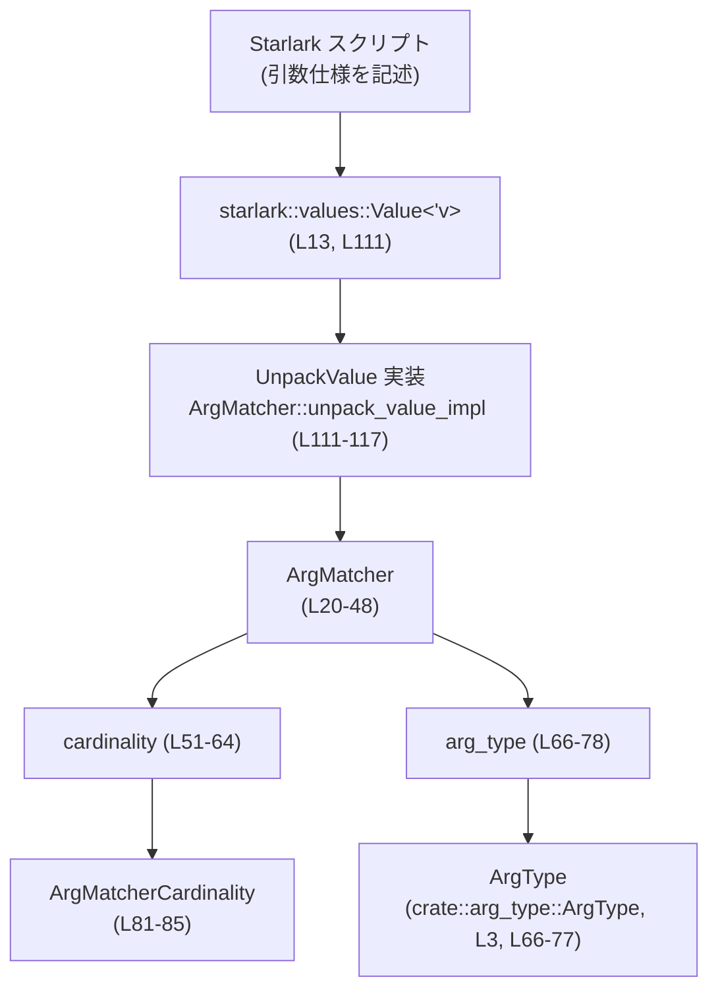
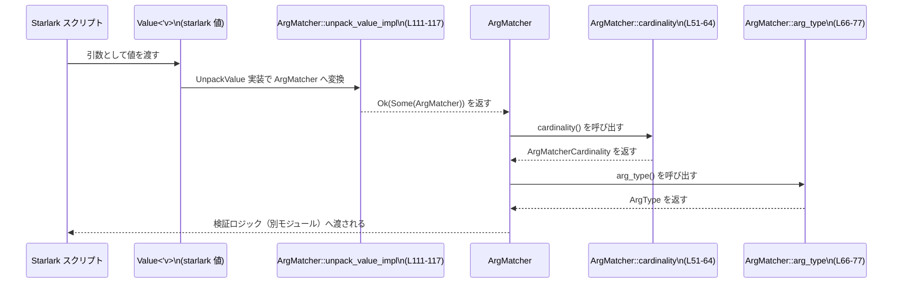

## execpolicy-legacy/src/arg_matcher.rs

---

## 0. ざっくり一言

コマンドライン引数を「どんな意味・型・個数のパターンで受け付けるか」を表現する `ArgMatcher` と、その個数制約を表す `ArgMatcherCardinality` を定義し、Starlark から使えるようにするモジュールです（execpolicy-legacy/src/arg_matcher.rs:L20-48, L81-85, L97-118）。

---

## 1. このモジュールの役割

### 1.1 概要

- このモジュールは、**コマンド引数の期待パターン**（文字列、ファイル、整数、sed コマンドなど）を列挙型 `ArgMatcher` として表現します（execpolicy-legacy/src/arg_matcher.rs:L20-47）。
- さらに、各パターンが「何個の引数を消費するか」という**カーディナリティ**（個数制約）を `ArgMatcherCardinality` で表現します（execpolicy-legacy/src/arg_matcher.rs:L81-85）。
- Starlark の `Value` から `ArgMatcher` へ変換するためのトレイト実装（`AllocValue`, `StarlarkValue`, `UnpackValue`）も提供し、Starlark スクリプトから安全に利用できるようにしています（execpolicy-legacy/src/arg_matcher.rs:L97-118）。

### 1.2 アーキテクチャ内での位置づけ

このファイルは、引数ポリシーの「型レベル表現」を担う小さなコンポーネントで、`ArgType` や Starlark ランタイムと連携します。



- Starlark スクリプトが値を生成 (`Value<'v>`) し（execpolicy-legacy/src/arg_matcher.rs:L13, L111）、
- `UnpackValue` 実装経由で `ArgMatcher` に変換され（execpolicy-legacy/src/arg_matcher.rs:L108-117）、
- 利用側の Rust コードが `cardinality`・`arg_type` を呼んで検証・解釈を行う、という構造になっています（execpolicy-legacy/src/arg_matcher.rs:L51-78）。

### 1.3 設計上のポイント

- **責務の分離**  
  - 「どんな値か（ファイル・整数など）」は `ArgType` に委譲し、`ArgMatcher` は「パターン＋個数」を表現する構造になっています（execpolicy-legacy/src/arg_matcher.rs:L66-77）。
  - 個数制約は別 enum `ArgMatcherCardinality` に切り出されており、複数の matcher で再利用できるようになっています（execpolicy-legacy/src/arg_matcher.rs:L51-64, L81-94）。
- **Starlark 連携**  
  - `AllocValue`, `StarlarkValue`, `UnpackValue` の実装により、Starlark 側の値から `ArgMatcher` を透過的に扱えるようにしています（execpolicy-legacy/src/arg_matcher.rs:L97-118）。
  - 文字列 `StarlarkStr` が与えられた場合は、自動的に `Literal` として扱う仕様です（execpolicy-legacy/src/arg_matcher.rs:L111-114）。
- **型安全性**  
  - enum と match をフルパターンで書いているため、新しいバリアント追加時にコンパイラが対応漏れを検出できます（execpolicy-legacy/src/arg_matcher.rs:L51-63, L66-77, L88-93）。
- **エラーハンドリング方針**  
  - `UnpackValue` 実装は、対応できない型が来た場合でも `Ok(None)` を返し panic しない設計です（execpolicy-legacy/src/arg_matcher.rs:L111-117）。

---

## 2. 主要な機能一覧

- `ArgMatcher` 列挙体: 引数が満たすべきパターン（リテラル文字列・ファイル・整数・sed コマンド・未検証 varargs など）を表現する（execpolicy-legacy/src/arg_matcher.rs:L20-47）。
- `ArgMatcher::cardinality`: 各 `ArgMatcher` が消費する引数の個数パターン（1 個・1 個以上・0 個以上）を返す（execpolicy-legacy/src/arg_matcher.rs:L51-64）。
- `ArgMatcher::arg_type`: 各 `ArgMatcher` から、より汎用的な `ArgType` へのマッピングを行う（execpolicy-legacy/src/arg_matcher.rs:L66-77）。
- `ArgMatcherCardinality` 列挙体: 個数制約そのものを表し、「正確に何個か」を問い合わせるメソッドを提供する（execpolicy-legacy/src/arg_matcher.rs:L81-85, L88-94）。
- Starlark 連携トレイト実装:
  - `AllocValue` 実装: `ArgMatcher` を Starlark `Heap` に割り当てて `Value<'v>` に変換する（execpolicy-legacy/src/arg_matcher.rs:L97-100）。
  - `StarlarkValue` 実装: `ArgMatcher` を Starlark 値として認識させる（execpolicy-legacy/src/arg_matcher.rs:L103-106）。
  - `UnpackValue` 実装: `Value<'v>` から `ArgMatcher` への変換ロジックを提供する（execpolicy-legacy/src/arg_matcher.rs:L108-117）。

---

## 3. 公開 API と詳細解説

### 3.1 型一覧（構造体・列挙体など）

#### 列挙体・トレイト関連のインベントリー

| 名前 | 種別 | 公開性 | 役割 / 用途 | 根拠 |
|------|------|--------|-------------|------|
| `ArgMatcher` | enum | `pub` | コマンド引数のパターン（文字列・ファイル・整数・sed コマンド・未検証 varargs）を表現する | execpolicy-legacy/src/arg_matcher.rs:L20-47 |
| `ArgMatcherCardinality` | enum | `pub` | 1 個 / 1 個以上 / 0 個以上といった個数制約を表す | execpolicy-legacy/src/arg_matcher.rs:L81-85 |
| `AllocValue<'v> for ArgMatcher` | トレイト実装 | - | `ArgMatcher` を Starlark ヒープに割り当てるための実装 | execpolicy-legacy/src/arg_matcher.rs:L97-100 |
| `StarlarkValue<'v> for ArgMatcher` | トレイト実装 | - | Starlark ランタイムに `ArgMatcher` 型を認識させる | execpolicy-legacy/src/arg_matcher.rs:L103-106 |
| `UnpackValue<'v> for ArgMatcher` | トレイト実装 | - | Starlark 値から `ArgMatcher` への変換ロジック | execpolicy-legacy/src/arg_matcher.rs:L108-117 |

#### `ArgMatcher` のバリアント一覧

| バリアント名 | 説明 | 根拠 |
|--------------|------|------|
| `Literal(String)` | リテラル文字列として一致させる | execpolicy-legacy/src/arg_matcher.rs:L21-22 |
| `OpaqueNonFile` | 型は不明だが「ファイルではない」値に一致させる | execpolicy-legacy/src/arg_matcher.rs:L24-25 |
| `ReadableFile` | 読み取り可能なファイルに一致させる | execpolicy-legacy/src/arg_matcher.rs:L27-28 |
| `WriteableFile` | 書き込み可能なファイルに一致させる | execpolicy-legacy/src/arg_matcher.rs:L30-31 |
| `ReadableFiles` | 非空の読み取り可能ファイルのリストに一致させる | execpolicy-legacy/src/arg_matcher.rs:L33-34 |
| `ReadableFilesOrCwd` | 非空の読み取り可能ファイルのリスト、または空リスト（カレントディレクトリを意味）に一致させる | execpolicy-legacy/src/arg_matcher.rs:L36-37 |
| `PositiveInteger` | 正の整数に一致させる（例: `head -n` の引数） | execpolicy-legacy/src/arg_matcher.rs:L39-40 |
| `SedCommand` | 安全な sed コマンド向けの特別なマッチャー | execpolicy-legacy/src/arg_matcher.rs:L42-43 |
| `UnverifiedVarargs` | 意味付けされていない任意個の引数（検証は呼び出し側の責任） | execpolicy-legacy/src/arg_matcher.rs:L45-47 |

### 3.2 関数詳細（5 件）

#### `ArgMatcher::cardinality(&self) -> ArgMatcherCardinality`

**概要**

- このメソッドは、`ArgMatcher` が「何個の引数を消費する想定か」を `ArgMatcherCardinality` で返します（execpolicy-legacy/src/arg_matcher.rs:L51-64）。

**実装位置**

- execpolicy-legacy/src/arg_matcher.rs:L51-64

**引数**

| 引数名 | 型 | 説明 |
|--------|----|------|
| `self` | `&ArgMatcher` | 対象となる引数パターン |

**戻り値**

- `ArgMatcherCardinality`  
  - `Literal`, `OpaqueNonFile`, `ReadableFile`, `WriteableFile`, `PositiveInteger`, `SedCommand` は `One`（1 個）（execpolicy-legacy/src/arg_matcher.rs:L53-58）。
  - `ReadableFiles` は `AtLeastOne`（1 個以上）（execpolicy-legacy/src/arg_matcher.rs:L59）。
  - `ReadableFilesOrCwd`, `UnverifiedVarargs` は `ZeroOrMore`（0 個以上）（execpolicy-legacy/src/arg_matcher.rs:L60-62）。

**内部処理の流れ**

1. `self` のバリアントに応じて `match` する（execpolicy-legacy/src/arg_matcher.rs:L52-63）。
2. 単一引数を前提とするバリアントをまとめて `One` を返す（execpolicy-legacy/src/arg_matcher.rs:L53-58）。
3. `ReadableFiles` のみ `AtLeastOne` を返す（execpolicy-legacy/src/arg_matcher.rs:L59）。
4. 複数・0 個も許容する `ReadableFilesOrCwd` と `UnverifiedVarargs` は `ZeroOrMore` を返す（execpolicy-legacy/src/arg_matcher.rs:L60-62）。

**Examples（使用例）**

```rust
use execpolicy_legacy::arg_matcher::{ArgMatcher, ArgMatcherCardinality}; // ArgMatcher/ArgMatcherCardinality を使用
// 上の use は、このファイルが属するクレート名を仮に execpolicy_legacy と置いています。
// 実際のクレート名はプロジェクト構成に依存します。

fn describe_cardinality(m: &ArgMatcher) {                         // ArgMatcher のカーディナリティを表示する関数
    let card = m.cardinality();                                   // 対応する ArgMatcherCardinality を取得

    match card {                                                  // 個数制約ごとにメッセージを表示
        ArgMatcherCardinality::One => println!("1 個の引数を消費します"),
        ArgMatcherCardinality::AtLeastOne => println!("1 個以上の引数を消費します"),
        ArgMatcherCardinality::ZeroOrMore => println!("0 個以上の引数を消費します"),
    }
}

fn example() {                                                    // 使用例
    let m1 = ArgMatcher::ReadableFile;                            // 読み取り可能ファイル 1 個
    let m2 = ArgMatcher::ReadableFiles;                           // 読み取り可能ファイル 1 個以上
    let m3 = ArgMatcher::UnverifiedVarargs;                       // 任意個の引数

    describe_cardinality(&m1);                                    // "1 個の引数を消費します"
    describe_cardinality(&m2);                                    // "1 個以上の引数を消費します"
    describe_cardinality(&m3);                                    // "0 個以上の引数を消費します"
}
```

**Errors / Panics**

- この関数は `match` で列挙体を網羅しており、panic を発生させる箇所や `Result` 型はありません（execpolicy-legacy/src/arg_matcher.rs:L52-63）。

**Edge cases（エッジケース）**

- `ReadableFilesOrCwd` と `UnverifiedVarargs` は 0 個でも valid と判断されるため、呼び出し側で「少なくとも 1 個必要」等の追加チェックが必要な場合があります（execpolicy-legacy/src/arg_matcher.rs:L60-62）。
- 新しい `ArgMatcher` バリアントが追加された場合、コンパイラが `match` の非網羅性を検出するため、ここを更新し忘れるという種のバグは防がれます（execpolicy-legacy/src/arg_matcher.rs:L52-63）。

**使用上の注意点**

- `cardinality` が返すのはあくまで**期待される個数パターン**であり、実際に引数がその通りかどうかの検証は別モジュールで行われると考えられます（本チャンクでは検証コードは見えません）。
- `ZeroOrMore` の場合、空であってもエラー扱いにしたいかどうかは、利用側のポリシーに依存する点に注意が必要です。

---

#### `ArgMatcher::arg_type(&self) -> ArgType`

**概要**

- このメソッドは、`ArgMatcher` が期待する**値の種類**を、より汎用的な `ArgType` にマッピングします（execpolicy-legacy/src/arg_matcher.rs:L66-77）。

**実装位置**

- execpolicy-legacy/src/arg_matcher.rs:L66-77

**引数**

| 引数名 | 型 | 説明 |
|--------|----|------|
| `self` | `&ArgMatcher` | 対象となる引数パターン |

**戻り値**

- `ArgType`（`crate::arg_type::ArgType`）  
  - `Literal(v)` → `ArgType::Literal(v.clone())`（execpolicy-legacy/src/arg_matcher.rs:L68）。
  - `OpaqueNonFile` → `ArgType::OpaqueNonFile`（execpolicy-legacy/src/arg_matcher.rs:L69）。
  - `ReadableFile`, `ReadableFiles`, `ReadableFilesOrCwd` → `ArgType::ReadableFile`（execpolicy-legacy/src/arg_matcher.rs:L70-73）。
  - `WriteableFile` → `ArgType::WriteableFile`（execpolicy-legacy/src/arg_matcher.rs:L71）。
  - `PositiveInteger` → `ArgType::PositiveInteger`（execpolicy-legacy/src/arg_matcher.rs:L74）。
  - `SedCommand` → `ArgType::SedCommand`（execpolicy-legacy/src/arg_matcher.rs:L75）。
  - `UnverifiedVarargs` → `ArgType::Unknown`（execpolicy-legacy/src/arg_matcher.rs:L76）。

**内部処理の流れ**

1. `self` のバリアントごとに `match` する（execpolicy-legacy/src/arg_matcher.rs:L67-77）。
2. `Literal` の場合は内部の `String` を `clone` して `ArgType::Literal` に格納する（execpolicy-legacy/src/arg_matcher.rs:L68）。
3. 複数種あるファイル系（単一ファイル・複数ファイル・cwd を含む）をすべて `ArgType::ReadableFile` に集約して返す（execpolicy-legacy/src/arg_matcher.rs:L70-73）。
4. `UnverifiedVarargs` は型が特定できないため `ArgType::Unknown` として返す（execpolicy-legacy/src/arg_matcher.rs:L76）。

**Examples（使用例）**

```rust
use execpolicy_legacy::arg_matcher::ArgMatcher;          // ArgMatcher を使用
use execpolicy_legacy::arg_type::ArgType;                // ArgType を使用

fn example_arg_type() {                                  // ArgMatcher::arg_type の使用例
    let m = ArgMatcher::ReadableFilesOrCwd;              // 読み取り可能ファイル群または cwd を表す matcher
    let t = m.arg_type();                                // ArgType にマッピング

    match t {
        ArgType::ReadableFile => {                       // 読み取り可能ファイルとして扱う
            println!("読み取り可能ファイルとして扱われます");
        }
        _ => println!("その他の型です"),                 // この例では到達しない
    }

    let unknown = ArgMatcher::UnverifiedVarargs.arg_type(); // 未検証 varargs の型
    assert!(matches!(unknown, ArgType::Unknown));        // ArgType::Unknown であることを確認
}
```

**Errors / Panics**

- `Literal` の `clone()` はメモリ確保に失敗しない限りパニックしませんが、一般的な Rust コードと同様 OOM 時の挙動はプロセス依存です（execpolicy-legacy/src/arg_matcher.rs:L68）。
- それ以外は単純な列挙体の生成のみで、panic を発生させるロジックはありません（execpolicy-legacy/src/arg_matcher.rs:L69-77）。

**Edge cases（エッジケース）**

- `ReadableFile`, `ReadableFiles`, `ReadableFilesOrCwd` がすべて `ArgType::ReadableFile` にマッピングされるため、「個数」や「cwd を意味する空リストかどうか」といった情報は `ArgType` だけからは復元できません（execpolicy-legacy/src/arg_matcher.rs:L70-73）。必要なら `ArgMatcher` をそのまま保持する必要があります。
- `UnverifiedVarargs` は `ArgType::Unknown` にマップされるため、型に基づいた安全な検証や補完はできません（execpolicy-legacy/src/arg_matcher.rs:L76）。

**使用上の注意点**

- `ArgType` は型レベルの分類だけなので、実際にファイルが存在するか・読み書き可能かは別のレイヤでチェックする必要があります（このファイル内にはそのような I/O は存在しません）。
- 型情報をより細かく扱いたい場合、`ArgMatcher` と `ArgType` の両方を使い分ける設計が必要です。

---

#### `ArgMatcherCardinality::is_exact(&self) -> Option<usize>`

**概要**

- 個数制約が「正確に n 個」である場合、その `n` を返し、それ以外（1 個以上、0 個以上など）の場合は `None` を返します（execpolicy-legacy/src/arg_matcher.rs:L88-93）。

**実装位置**

- execpolicy-legacy/src/arg_matcher.rs:L88-93

**引数**

| 引数名 | 型 | 説明 |
|--------|----|------|
| `self` | `&ArgMatcherCardinality` | 個数制約 |

**戻り値**

- `Option<usize>`  
  - `Some(1)`：`ArgMatcherCardinality::One` の場合（execpolicy-legacy/src/arg_matcher.rs:L90）。
  - `None`：`AtLeastOne`, `ZeroOrMore` の場合（execpolicy-legacy/src/arg_matcher.rs:L91-92）。

**内部処理の流れ**

1. `self` に `match` する（execpolicy-legacy/src/arg_matcher.rs:L89-93）。
2. `One` のときだけ `Some(1)` を返す（execpolicy-legacy/src/arg_matcher.rs:L90）。
3. それ以外は `None` を返す（execpolicy-legacy/src/arg_matcher.rs:L91-92）。

**Examples（使用例）**

```rust
use execpolicy_legacy::arg_matcher::{ArgMatcher, ArgMatcherCardinality}; // 型をインポート

fn example_is_exact() {                                      // ArgMatcherCardinality::is_exact の使用例
    let one = ArgMatcher::ReadableFile.cardinality();        // One を返す
    assert_eq!(one.is_exact(), Some(1));                     // 正確に 1 個

    let at_least_one = ArgMatcher::ReadableFiles.cardinality(); // AtLeastOne を返す
    assert_eq!(at_least_one.is_exact(), None);               // 正確な個数ではないので None

    let zero_or_more = ArgMatcher::UnverifiedVarargs.cardinality(); // ZeroOrMore
    assert_eq!(zero_or_more.is_exact(), None);               // これも None
}
```

**Errors / Panics**

- 単純な列挙体マッチのみで、panic を発生させるロジックはありません（execpolicy-legacy/src/arg_matcher.rs:L88-93）。

**Edge cases（エッジケース）**

- 現状 `One` しか `Some(n)` を返さないため、「正確に 2 個」などの表現は `ArgMatcherCardinality` にはありません（execpolicy-legacy/src/arg_matcher.rs:L81-85, L88-93）。
- 将来的に `Exactly(u32)` のようなバリアントを追加したい場合、このメソッドの仕様を拡張する必要があります（この点はコードからの推論です）。

**使用上の注意点**

- `is_exact` が `None` を返す場合、「個数が分からない」ではなく「範囲で指定されている」ことを意味します。個数チェックを行う際は、元の `ArgMatcherCardinality` 全体を考慮する必要があります。

---

#### `impl<'v> AllocValue<'v> for ArgMatcher::alloc_value(self, heap: &'v Heap) -> Value<'v>`

**概要**

- `ArgMatcher` インスタンスを Starlark の `Heap` に割り当て、Starlark の `Value<'v>` として使用できるようにします（execpolicy-legacy/src/arg_matcher.rs:L97-100）。

**実装位置**

- execpolicy-legacy/src/arg_matcher.rs:L97-100

**引数**

| 引数名 | 型 | 説明 |
|--------|----|------|
| `self` | `ArgMatcher` | 割り当て対象の matcher。所有権はこの関数に移動する |
| `heap` | `&'v Heap` | Starlark のヒープオブジェクト |

**戻り値**

- `Value<'v>`  
  - `heap.alloc_simple(self)` によりヒープに格納された `ArgMatcher` を指す Starlark 値（execpolicy-legacy/src/arg_matcher.rs:L98-99）。

**内部処理の流れ**

1. 引数として受け取った `self` の所有権を取り、`heap.alloc_simple(self)` に渡す（execpolicy-legacy/src/arg_matcher.rs:L98-99）。
2. 返ってきた `Value<'v>` をそのまま返す。

**Examples（使用例）**

```rust
use starlark::values::{Heap, Value};                        // Heap と Value を使用
use execpolicy_legacy::arg_matcher::ArgMatcher;             // ArgMatcher を使用

fn allocate_matcher(heap: &Heap) -> Value {                  // ArgMatcher を Heap に割り当てる例
    let matcher = ArgMatcher::ReadableFile;                  // 読み取り可能ファイル matcher を作成
    matcher.alloc_value(heap)                                // Heap に割り当てて Value を返す
}
```

**Errors / Panics**

- `heap.alloc_simple(self)` の具体的な実装はこのチャンクにはありませんが、通常の `Heap` の挙動に従います（execpolicy-legacy/src/arg_matcher.rs:L98-99）。
- このメソッド自体はエラー型を返さず、通常は panic しない前提で設計されていると考えられます（コードからは panic 呼び出しは見えません）。

**Edge cases（エッジケース）**

- `self` はムーブされるため、呼び出し後に元の変数は使用できません。これは Rust の所有権ルールに基づく標準的な挙動です。

**使用上の注意点**

- Starlark の `Heap` は通常、特定のライフタイム `'v` に紐づいているため、`Value<'v>` も同じライフタイムに制約されます（execpolicy-legacy/src/arg_matcher.rs:L97-100）。
- `#![allow(clippy::needless_lifetimes)]` がファイル先頭で指定されているのは、このような `'v` ライフタイムパラメータを Clippy の警告対象から除外する目的と考えられます（execpolicy-legacy/src/arg_matcher.rs:L1）。

---

#### `impl<'v> UnpackValue<'v> for ArgMatcher::unpack_value_impl(value: Value<'v>) -> starlark::Result<Option<Self>>`

**概要**

- Starlark の `Value<'v>` から `ArgMatcher` を取り出すためのローレベル実装です。
- 文字列 `StarlarkStr` であれば `ArgMatcher::Literal` に変換し、そうでなければ `ArgMatcher` 型へのダウンキャストを試みます（execpolicy-legacy/src/arg_matcher.rs:L111-117）。

**実装位置**

- execpolicy-legacy/src/arg_matcher.rs:L108-117

**引数**

| 引数名 | 型 | 説明 |
|--------|----|------|
| `value` | `Value<'v>` | 変換元となる Starlark 値 |

**戻り値**

- `starlark::Result<Option<ArgMatcher>>`  
  - `Ok(Some(ArgMatcher::Literal(...)))`：`StarlarkStr` だった場合（execpolicy-legacy/src/arg_matcher.rs:L112-114）。
  - `Ok(Some(m))`：`ArgMatcher` へのダウンキャストに成功した場合（execpolicy-legacy/src/arg_matcher.rs:L115）。
  - `Ok(None)`：どちらにも該当しない型だった場合（`downcast_ref::<ArgMatcher>()` が `None` を返すとき）（execpolicy-legacy/src/arg_matcher.rs:L115）。
  - `Err(...)`：この実装内では発生しておらず、将来拡張や他の実装に備えて `type Error = starlark::Error` と定義されています（execpolicy-legacy/src/arg_matcher.rs:L109）。

**内部処理の流れ**

1. `value.downcast_ref::<StarlarkStr>()` で文字列へのダウンキャストを試みる（execpolicy-legacy/src/arg_matcher.rs:L112）。
2. 成功した場合、その文字列内容を `str.as_str().to_string()` で `String` にコピーし、`ArgMatcher::Literal` を生成して `Ok(Some(...))` を返す（execpolicy-legacy/src/arg_matcher.rs:L112-114）。
3. 文字列でない場合、`value.downcast_ref::<ArgMatcher>()` を呼び、`ArgMatcher` へのダウンキャストを試みる（execpolicy-legacy/src/arg_matcher.rs:L115）。
4. 結果の `Option<&ArgMatcher>` に `.cloned()` を呼び、`Option<ArgMatcher>` に変換し、そのまま `Ok(...)` で返す（execpolicy-legacy/src/arg_matcher.rs:L115-116）。
   - 成功した場合 `Ok(Some(matcher))`、失敗した場合 `Ok(None)`。

**Examples（使用例）**

```rust
use starlark::values::{Heap, Value};                     // Heap と Value
use starlark::values::UnpackValue;                      // UnpackValue トレイト
use execpolicy_legacy::arg_matcher::ArgMatcher;         // ArgMatcher

fn example_unpack<'v>(heap: &'v Heap) -> starlark::Result<()> { // UnpackValue 実装の使用例
    // 文字列として格納された Starlark 値を作る
    let v_str: Value<'v> = heap.alloc("literal");        // "literal" という StarlarkStr を Heap に格納

    // 文字列から ArgMatcher を取り出す
    let m_from_str = ArgMatcher::unpack_value_impl(v_str)?; // Ok(Some(ArgMatcher::Literal("literal".to_string()))) になる
    assert!(matches!(m_from_str, Some(ArgMatcher::Literal(ref s)) if s == "literal"));

    // ArgMatcher 自身を Heap に格納してから取り出す
    let v_matcher: Value<'v> = heap.alloc(ArgMatcher::ReadableFile); // ArgMatcher を Heap に格納
    let m_from_matcher = ArgMatcher::unpack_value_impl(v_matcher)?;  // Ok(Some(ArgMatcher::ReadableFile))
    assert!(matches!(m_from_matcher, Some(ArgMatcher::ReadableFile)));

    Ok(())
}
```

**Errors / Panics**

- この実装では常に `Ok(...)` を返しており、`Err` を生成するコードはありません（execpolicy-legacy/src/arg_matcher.rs:L111-117）。
- `downcast_ref` が失敗した場合でも panic せず、単に `None` を返すだけです（execpolicy-legacy/src/arg_matcher.rs:L112, L115）。
- `str.as_str().to_string()` は通常 panic しません（execpolicy-legacy/src/arg_matcher.rs:L112-114）。

**Edge cases（エッジケース）**

- `Value<'v>` が `StarlarkStr` でも `ArgMatcher` でもない場合、`Ok(None)` になり、呼び出し側で「アンパック失敗」として扱う必要があります（execpolicy-legacy/src/arg_matcher.rs:L112, L115-116）。
- 空文字列の場合でも `Literal("")` として扱われます（`as_str().to_string()` はそのまま空文字列を返します）（execpolicy-legacy/src/arg_matcher.rs:L112-114）。
- `type Error = starlark::Error` となっていますが、この実装では利用されていません（execpolicy-legacy/src/arg_matcher.rs:L109）。

**使用上の注意点**

- 通常、`UnpackValue` は Starlark 側から Rust 関数を呼び出すときに自動的に利用されます。そのため、`None` が返るケースをどう扱うかは、上位の API（このチャンク外）に依存します。
- 「文字列なら Literal にする」という仕様のため、Starlark 側から `ArgMatcher` を直接渡さなくても、文字列でリテラルマッチャーを指定できるという利便性がありますが、意図しない型が文字列として渡された場合も `Literal` になってしまう点に注意が必要です。

---

### 3.3 その他の関数

| 関数名 / メソッド名 | 役割（1 行） | 根拠 |
|---------------------|--------------|------|
| `ArgMatcherCardinality::One` などの enum バリアント | 個数制約を表す値そのもの。ロジックは `is_exact` で利用される | execpolicy-legacy/src/arg_matcher.rs:L81-85 |
| `type Canonical = ArgMatcher`（`StarlarkValue` 実装内） | Starlark の Canonical 型として `ArgMatcher` 自身を指定 | execpolicy-legacy/src/arg_matcher.rs:L103-106 |

---

## 4. データフロー

ここでは、Starlark から `ArgMatcher` を受け取り、その情報を用いて引数の検証に利用するまでの典型的なフローを示します（検証ロジック自体はこのチャンクにはありません）。



- Starlark 側の値（文字列または `ArgMatcher`）が `Value<'v>` として Rust に渡される（execpolicy-legacy/src/arg_matcher.rs:L13, L111）。
- `UnpackValue` 実装がこれを `ArgMatcher` に変換する（execpolicy-legacy/src/arg_matcher.rs:L108-117）。
- その後、`cardinality` と `arg_type` を通じて、**個数制約**と**型情報**を抽出し、別モジュールの検証ロジックで利用される、という流れが想定されます。

---

## 5. 使い方（How to Use）

### 5.1 基本的な使用方法

`ArgMatcher` を直接生成し、`cardinality` と `arg_type` を使って情報を取り出す基本的なパターンです。

```rust
use execpolicy_legacy::arg_matcher::{ArgMatcher, ArgMatcherCardinality}; // ArgMatcher と ArgMatcherCardinality を使用
use execpolicy_legacy::arg_type::ArgType;                                // ArgType を使用

fn main() {                                                              // メイン関数
    // 例: 読み取り可能ファイル 1 個を要求する matcher
    let matcher = ArgMatcher::ReadableFile;                              // ReadableFile バリアントを作成

    let card = matcher.cardinality();                                    // 個数制約を取得
    let ty = matcher.arg_type();                                         // 型情報を取得

    match card {                                                         // 個数制約に応じた処理
        ArgMatcherCardinality::One => println!("1 個の引数を想定しています"),
        ArgMatcherCardinality::AtLeastOne => println!("1 個以上の引数を想定しています"),
        ArgMatcherCardinality::ZeroOrMore => println!("0 個以上の引数を想定しています"),
    }

    match ty {                                                           // 型情報に応じた処理
        ArgType::ReadableFile => println!("読み取り可能ファイルが必要です"),
        other => println!("その他の型: {:?}", other),                   // Debug 表示（ArgType 側で Debug 実装がある前提）
    }
}
```

### 5.2 よくある使用パターン

1. **リスト引数の検証に使う**

```rust
use execpolicy_legacy::arg_matcher::{ArgMatcher, ArgMatcherCardinality}; // 必要な型をインポート

fn require_non_empty_files(matcher: &ArgMatcher, files_len: usize) -> bool { // matcher と実際の個数を受け取る
    let card = matcher.cardinality();                                   // 個数制約を取得

    match card {
        ArgMatcherCardinality::One => files_len == 1,                   // ちょうど 1 個
        ArgMatcherCardinality::AtLeastOne => files_len >= 1,            // 1 個以上
        ArgMatcherCardinality::ZeroOrMore => true,                      // 0 個でも許容
    }
}
```

1. **未検証引数（`UnverifiedVarargs`）を明示的に扱う**

```rust
use execpolicy_legacy::arg_matcher::ArgMatcher;                         // ArgMatcher を使用

fn is_fully_verified(matcher: &ArgMatcher) -> bool {                    // 引数がすべて検証対象かどうか
    !matches!(matcher, ArgMatcher::UnverifiedVarargs)                   // UnverifiedVarargs なら false、それ以外は true
}
```

### 5.3 よくある間違い

```rust
use execpolicy_legacy::arg_matcher::{ArgMatcher, ArgMatcherCardinality}; // 型をインポート

fn wrong_assumption(m: &ArgMatcher) {
    // 間違い例: ReadableFilesOrCwd なのに「必ず 1 個以上」と決め打ちしてしまう
    if let ArgMatcherCardinality::AtLeastOne = m.cardinality() {        // ReadableFilesOrCwd では ZeroOrMore なのでマッチしない
        println!("1 個以上必須だと誤解しています");
    }

    // 正しい例: ZeroOrMore かどうかを見て、空リスト（= cwd）を許容するかどうかを別途判断する
    match m.cardinality() {
        ArgMatcherCardinality::ZeroOrMore => {
            println!("0 個も許容されています（たとえば cwd を意味するかもしれません）");
        }
        _ => {}
    }
}
```

- `ReadableFilesOrCwd` は `ZeroOrMore` なので、空リストも許容される点を見落とすと検証ロジックに齟齬が生じます（execpolicy-legacy/src/arg_matcher.rs:L36-37, L60-62）。

### 5.4 使用上の注意点（まとめ）

- 本モジュールは **パターンと型情報の表現** に限定しており、実際のファイル存在チェックや I/O は行いません（このチャンクには I/O コードが存在しません）。
- `UnverifiedVarargs` は名前通り「未検証」の意味を持つため、セキュリティクリティカルな場面では極力使用を避けるか、明示的な追加検証が必要です（execpolicy-legacy/src/arg_matcher.rs:L45-47, L76）。
- `ArgMatcher` には `Debug` と `Display` が derive されているため、ログ出力や監査のために容易に文字列化できます（execpolicy-legacy/src/arg_matcher.rs:L18-19）。これはオブザーバビリティ向上に有用です。
- 並行性に関して、このファイル内ではスレッド生成や共有状態は扱っておらず、純粋なデータ変換のみです。そのため、この範囲に限れば並行実行時のデータ競合は発生しません。

---

## 6. 変更の仕方（How to Modify）

### 6.1 新しい機能を追加する場合

例: 新しい引数パターン `BooleanFlag` を追加したい場合。

1. **`ArgMatcher` にバリアントを追加**  
   - `pub enum ArgMatcher` に `BooleanFlag` を追加する（execpolicy-legacy/src/arg_matcher.rs:L20-47）。
2. **`cardinality` の更新**  
   - 新バリアントが消費する引数の個数に応じて、`ArgMatcher::cardinality` の `match` に分岐を追加する（execpolicy-legacy/src/arg_matcher.rs:L51-63）。
3. **`arg_type` の更新**  
   - 対応する `ArgType` を `ArgMatcher::arg_type` の `match` に追加する（execpolicy-legacy/src/arg_matcher.rs:L66-77）。
4. **Starlark 連携の検討**  
   - `UnpackValue` 実装では、新しいバリアント固有の処理が不要であれば変更不要です（現状は文字列→Literal、それ以外→既存の ArgMatcher のみ）（execpolicy-legacy/src/arg_matcher.rs:L111-117）。
5. **テストの追加**  
   - このチャンクにはテストコードがないため、別ファイル（たとえば `tests` ディレクトリ）で `cardinality`・`arg_type`・`unpack_value_impl` の挙動を検証するテストを追加するのが自然です（テストコードはこのチャンクには現れません）。

### 6.2 既存の機能を変更する場合

- **影響範囲の確認**
  - `ArgMatcher` のバリアントや `ArgMatcherCardinality` の定義を変更すると、それらを利用する他モジュール（このチャンクには現れません）が影響を受ける可能性があります（execpolicy-legacy/src/arg_matcher.rs:L20-47, L81-85）。
  - `ArgType` へのマッピングを変更すると、型に基づくバリデーションやログ出力の挙動が変わります（execpolicy-legacy/src/arg_matcher.rs:L66-77）。
- **契約（前提条件・返り値の意味）の維持**
  - `cardinality` が「どのバリアントなら 0 個以上許容か」といった前提で書かれている検証コードが存在する可能性があります。その意味が変わる変更は慎重に行う必要があります（execpolicy-legacy/src/arg_matcher.rs:L51-64）。
  - `UnpackValue` が文字列を自動的に `Literal` にする仕様を変更すると、Starlark 側の呼び出しパターンに影響します（execpolicy-legacy/src/arg_matcher.rs:L111-114）。
- **関連テストと使用箇所の再確認**
  - 変更後は、`ArgMatcher` と `ArgType` の対応関係、および `cardinality` の戻り値に依存する箇所を重点的にテストする必要があります。
  - このファイル自身にはテストが含まれていないため、別ファイルにあるテスト群（ここからは不明）を確認することが重要です。

---

## 7. 関連ファイル

このモジュールと密接に関係する（または依存している）と考えられるファイル・モジュールを列挙します。

| パス / モジュール | 役割 / 関係 | 根拠 |
|-------------------|------------|------|
| `crate::arg_type::ArgType` | `ArgMatcher::arg_type` が返す型。各 matcher をより汎用的な型カテゴリにマッピングするために使用される | execpolicy-legacy/src/arg_matcher.rs:L3, L66-77 |
| `crate::starlark::values::ValueLike` | Starlark 値の補助的なトレイト。インポートされていますが、このチャンクでは直接利用されていません | execpolicy-legacy/src/arg_matcher.rs:L4 |
| `starlark::values::{Value, Heap, AllocValue, StarlarkValue, UnpackValue}` | Starlark ランタイムと `ArgMatcher` を橋渡しするための基本型・トレイト群 | execpolicy-legacy/src/arg_matcher.rs:L8-13, L97-118 |
| `starlark::values::string::StarlarkStr` | 文字列値としての Starlark 型。`UnpackValue` 実装で `Literal` へ変換する際に使用 | execpolicy-legacy/src/arg_matcher.rs:L15, L111-114 |
| `allocative::Allocative` | メモリトラッキング用と思われる derive 用トレイト。`ArgMatcher` に derive されているが、このチャンクでは直接利用されていない | execpolicy-legacy/src/arg_matcher.rs:L5, L18 |
| `derive_more::Display` | `ArgMatcher` に対して `Display` 実装を自動生成するための derive マクロ | execpolicy-legacy/src/arg_matcher.rs:L6, L18-19 |

※ 上記のうち、`ArgType` や各種 Starlark 型・トレイトの具体的な実装はこのチャンクには現れないため、詳細な挙動はここからは分かりません。「インポートされている」という事実と、それに基づく呼び出しのみを記載しています。
