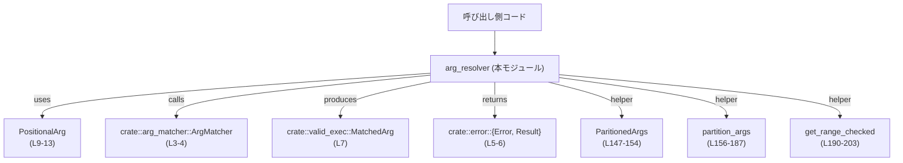
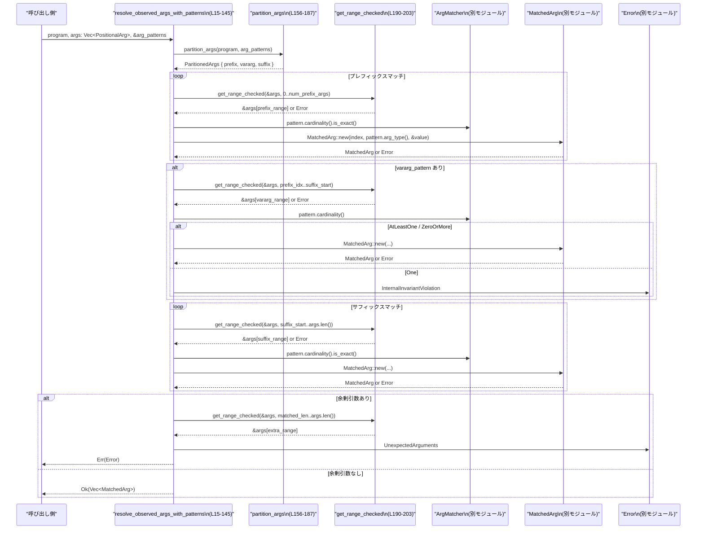

# execpolicy-legacy/src/arg_resolver.rs コード解説

## 0. ざっくり一言

コマンド実行時に観測された位置引数（`PositionalArg`）の列を、事前定義された引数マッチパターン（`ArgMatcher`）に割り当てて `MatchedArg` を生成するマッチングロジックを提供するモジュールです（`arg_resolver.rs:L15-145`）。

---

## 1. このモジュールの役割

### 1.1 概要

- このモジュールは、**実際に与えられたコマンドライン引数列**を、**期待される引数パターン**（`ArgMatcher`）に基づいて分類・検証し、`MatchedArg` の列として返す役割を持ちます（`arg_resolver.rs:L15-145`）。
- パターン列は「プレフィックス（先頭）」「オプションの可変長パターン（vararg）」「サフィックス（末尾）」の 3 つの領域に分割され、各領域ごとに位置引数が対応付けられます（`arg_resolver.rs:L20-41`, `L147-187`）。
- 範囲外アクセスやパターン定義の矛盾は、`Error` 型の様々なバリアントとして検出・報告されます（`arg_resolver.rs:L48-53`, `L65-71`, `L74-76`, `L81-85`, `L87-91`, `L136-141`, `L171-183`, `L191-200`）。

### 1.2 アーキテクチャ内での位置づけ

このファイルは、他モジュールの型に依存しつつ、**純粋なマッチングアルゴリズム**のみを実装しています。

- 依存先
  - `crate::arg_matcher::{ArgMatcher, ArgMatcherCardinality}`（パターン定義とその多重度判定に使用, `arg_resolver.rs:L3-4`, `L35-40`, `L48-53`, `L80-113`, `L151-153`, `L160-183`）
  - `crate::error::{Error, Result}`（すべてのエラー表現と戻り値に使用, `arg_resolver.rs:L5-6`, 全関数で使用）
  - `crate::valid_exec::MatchedArg`（マッチ済み引数の表現, `arg_resolver.rs:L7`, `L35-43`, `L55-60`, `L94-100`, `L105-110`, `L126-131`）

依存関係を簡略化した図です。



### 1.3 設計上のポイント

コードから読み取れる特徴を列挙します。

- **プレフィックス / vararg / サフィックスへの分割**
  - `ParitionedArgs` 構造体と `partition_args` 関数により、`ArgMatcher` 列を 3 つの領域に分割します（`arg_resolver.rs:L147-154`, `L156-187`）。
  - vararg パターンは 0 個または 1 個であることを前提とし、2 個以上ある場合は `Error::MultipleVarargPatterns` を返します（`arg_resolver.rs:L171-183`）。

- **範囲チェック付きスライス取得**
  - `get_range_checked` によって、スライスの開始・終了インデックスの妥当性を検証してからスライスを取得します（`arg_resolver.rs:L190-203`）。
  - これにより、Rust の生スライスインデックスによる panic をエラーとして扱う設計になっています。

- **カードinality（多重度）の厳格な取り扱い**
  - プレフィックス／サフィックスに対しては `cardinality().is_exact()` が `Some(n)` であることを内部不変条件とし、`None` の場合は `InternalInvariantViolation` を返します（`arg_resolver.rs:L48-53`, `L119-124`）。
  - vararg パターンに対しては `ArgMatcherCardinality::AtLeastOne` と `ZeroOrMore` を区別して扱い、`AtLeastOne` で 1 つもマッチしない場合は専用エラーを返します（`arg_resolver.rs:L86-92`）。

- **状態を持たない構造**
  - すべての関数は入力引数とローカル変数のみを扱っており、グローバル状態や内部キャッシュは持ちません（ファイル全体から状態フィールドは `ParitionedArgs` のみで、関数内ローカルに生成されるだけ, `arg_resolver.rs:L147-154`, `L156-187`）。
  - このため、同じ入力に対しては常に同じ結果を返す純粋な計算に近い構造です。

- **並行性の観点**
  - 共有ミュータブル状態やスレッドローカルなどは使っていないため、このモジュールの関数は**並行に呼び出しても内部競合を起こさない構造**になっています。
  - ただし、引数として渡される `Vec<PositionalArg>` や `Vec<ArgMatcher>` の所有権・共有方法は呼び出し側の設計に依存します（`args` は by-value、`arg_patterns` は `&Vec` 借用, `arg_resolver.rs:L16-18`）。

---

## 2. 主要な機能一覧

- `PositionalArg`: 観測された 1 つの位置引数を「インデックス＋文字列値」として保持する構造体（`arg_resolver.rs:L9-13`）。
- `resolve_observed_args_with_patterns`: 位置引数列とパターン列を突き合わせて `MatchedArg` 列を生成するメイン関数（`arg_resolver.rs:L15-145`）。
- `ParitionedArgs`: パターン列をプレフィックス・vararg・サフィックスに分けて保持する内部用構造体（`arg_resolver.rs:L147-154`）。
- `partition_args`: `ArgMatcher` 列を `ParitionedArgs` に分割するヘルパー関数（`arg_resolver.rs:L156-187`）。
- `get_range_checked`: インデックス範囲を検査し、安全にスライス参照を取得するユーティリティ関数（`arg_resolver.rs:L190-203`）。

---

## 3. 公開 API と詳細解説

### 3.1 型一覧（構造体・列挙体など）

このファイル内で定義されている型の一覧です。

| 名前 | 種別 | 公開範囲 | 役割 / 用途 | 定義位置 |
|------|------|----------|------------|----------|
| `PositionalArg` | 構造体 | `pub` | 観測された位置引数を、元のインデックスと値文字列の組で表現する（`index`, `value` フィールド） | `arg_resolver.rs:L9-13` |
| `ParitionedArgs` | 構造体 | モジュール内部（非 `pub`） | パターン列のプレフィックス／サフィックス／vararg の分割結果と、それぞれが消費する引数の個数を保持する | `arg_resolver.rs:L147-154` |

※ `ParitionedArgs` の名前は `PartitionedArgs` ではなく、コード上は `ParitionedArgs` となっています（`arg_resolver.rs:L147`）。

---

### 3.2 関数詳細

#### `resolve_observed_args_with_patterns(program: &str, args: Vec<PositionalArg>, arg_patterns: &Vec<ArgMatcher>) -> Result<Vec<MatchedArg>>`

**定義位置**

- `arg_resolver.rs:L15-145`

**概要**

- 与えられたプログラム名 `program`、位置引数列 `args`、パターン列 `arg_patterns` をもとに、各位置引数を対応する `ArgMatcher` へ割り当てて `MatchedArg` の列を返します。
- パターン列は内部でプレフィックス／vararg／サフィックスに分割され、それぞれに対応するスライス区間の位置引数がマッチングされます（`arg_resolver.rs:L20-41`, `L35-41`, `L45-62`, `L78-114`, `L116-134`）。

**引数**

| 引数名 | 型 | 説明 |
|--------|----|------|
| `program` | `&str` | 対象プログラム名。エラーメッセージ中に含めるために使用されます（`arg_resolver.rs:L16`, `L67`, `L89`, `L139` など）。 |
| `args` | `Vec<PositionalArg>` | 観測された位置引数列。各要素は元のインデックスと文字列値を持ちます（`arg_resolver.rs:L17`）。関数内で消費され、一部はエラー時にそのまま `Error` に組み込まれます（`arg_resolver.rs:L65-70`）。 |
| `arg_patterns` | `&Vec<ArgMatcher>` | 想定される引数パターン列。`ArgMatcher` の詳細はこのチャンクには現れませんが、多重度（`cardinality()`）と型（`arg_type()`）が利用されます（`arg_resolver.rs:L18`, `L35-40`, `L48-53`, `L80-113`, `L119-124`）。 |

**戻り値**

- `Result<Vec<MatchedArg>>`（`arg_resolver.rs:L19`）
  - `Ok(Vec<MatchedArg>)`: すべての位置引数がパターンと整合し、余りや不足なくマッチングできた場合（`arg_resolver.rs:L142-144`）。
  - `Err(Error)`: パターン定義の矛盾、不足・過剰な引数、範囲外インデックスなど、さまざまな理由による失敗（詳細は後述の「Errors」参照）。

**内部処理の流れ（アルゴリズム）**

おおまかな流れはコメントに書かれている通りです（`arg_resolver.rs:L20-34`）。

1. **パターン列の分割**  
   - `partition_args(program, arg_patterns)?` を呼び出し、`ParitionedArgs` を取得します（`arg_resolver.rs:L35-41`）。
   - ここで `num_prefix_args`, `num_suffix_args`, `prefix_patterns`, `suffix_patterns`, `vararg_pattern` が得られます。

2. **プレフィックス部のマッチング**  
   - `prefix = get_range_checked(&args, 0..num_prefix_args)?;` で先頭 `num_prefix_args` 個の引数スライスを取得します（`arg_resolver.rs:L45`）。
   - `prefix_patterns` を順に走査し（`arg_resolver.rs:L47`）、各パターンの `cardinality().is_exact()` が返す個数 `n` を取得します（`arg_resolver.rs:L48-53`）。
   - `prefix` スライスから `prefix_arg_index..prefix_arg_index + n` を取り出し（`arg_resolver.rs:L54`）、各 `PositionalArg` について `MatchedArg::new(...)` を呼んで `matched_args` に追加します（`arg_resolver.rs:L55-60`）。
   - `prefix_arg_index` はその都度 `n` だけ進められます（`arg_resolver.rs:L62`）。

3. **サフィックス部の引数数チェック**  
   - `num_suffix_args > args.len()` の場合、サフィックスのための引数数が不足しているとみなし `Error::NotEnoughArgs` を返します（`arg_resolver.rs:L65-71`）。
   - `initial_suffix_args_index = args.len() - num_suffix_args` を計算し（`arg_resolver.rs:L73`）、ここがサフィックス開始インデックスになります。
   - `prefix_arg_index > initial_suffix_args_index` の場合、プレフィックス領域とサフィックス領域が重なってしまうため `Error::PrefixOverlapsSuffix` を返します（`arg_resolver.rs:L74-76`）。

4. **vararg 部のマッチング（存在する場合）**  
   - `if let Some(pattern) = vararg_pattern { ... }` で vararg パターンの有無を確認します（`arg_resolver.rs:L78`）。
   - vararg に割り当てる引数スライスは `prefix_arg_index..initial_suffix_args_index` で算出され、`get_range_checked` により取得されます（`arg_resolver.rs:L79`）。
   - `pattern.cardinality()` に応じて分岐します（`arg_resolver.rs:L80-113`）:
     - `ArgMatcherCardinality::One`: vararg が 1 固定であるのは内部矛盾として扱い、`InternalInvariantViolation` を返します（`arg_resolver.rs:L81-85`）。
     - `AtLeastOne`: スライスが空であれば `VarargMatcherDidNotMatchAnything` エラー（`arg_resolver.rs:L87-91`）。空でなければ全要素を `MatchedArg` として追加（`arg_resolver.rs:L93-101`）。
     - `ZeroOrMore`: 空でもよく、全要素を `MatchedArg` として追加します（`arg_resolver.rs:L103-112`）。

5. **サフィックス部のマッチング**  
   - `suffix = get_range_checked(&args, initial_suffix_args_index..args.len())?;` で末尾 `num_suffix_args` 個のスライスを取得します（`arg_resolver.rs:L116`）。
   - `suffix_patterns` を順に走査し、プレフィックスと同様に `cardinality().is_exact()` の値 `n` 個分を各パターンに対応付けて `MatchedArg` を生成します（`arg_resolver.rs:L118-134`）。

6. **余剰引数の検出**  
   - `matched_args.len() < args.len()` の場合、マッチされていない余剰引数が存在するため、`get_range_checked(&args, matched_args.len()..args.len())?` で該当部分を取得し（`arg_resolver.rs:L136-137`）、`Error::UnexpectedArguments` に詰めて返します（`arg_resolver.rs:L138-141`）。
   - そうでなければ `Ok(matched_args)` を返します（`arg_resolver.rs:L142-144`）。

**Examples（使用例）**

このファイルからは `ArgMatcher` の具体的な構築方法が分からないため、パターン生成はダミー関数として表現します。

```rust
use crate::arg_resolver::{PositionalArg, resolve_observed_args_with_patterns};
use crate::arg_matcher::ArgMatcher;
use crate::error::Result;

// 例示用: 具体的なパターン構築方法はこのチャンクにはないため未実装
fn create_example_patterns() -> Vec<ArgMatcher> {
    // ArgMatcher をどのように構築するかは `arg_matcher` モジュール側の仕様に依存します
    unimplemented!();
}

fn example() -> Result<()> {
    let program = "my_program";

    // 観測された引数列（インデックスと値）
    let args = vec![
        PositionalArg { index: 0, value: "input.txt".to_string() },
        PositionalArg { index: 1, value: "--flag".to_string() },
        PositionalArg { index: 2, value: "extra".to_string() },
    ];

    let patterns = create_example_patterns(); // 期待されるパターン列（詳細は別モジュール）

    // メイン関数の呼び出し
    let matched_args = resolve_observed_args_with_patterns(program, args, &patterns)?;

    // matched_args を使った後続処理...
    println!("{:?}", matched_args);

    Ok(())
}
```

この例では、エラーが出なければ `matched_args` に `args` の各要素が対応するパターン情報付きで格納されていることが期待されます。

**Errors / Panics**

この関数は `Result` を返し、panic を起こすコード（`unwrap` や `expect`）は含まれていません。主なエラー条件は以下の通りです。

- **パターン定義関連**
  - `Error::MultipleVarargPatterns`  
    - `partition_args` 内で vararg パターンが 2 つ以上見つかった場合（`arg_resolver.rs:L171-183`）。
  - `Error::InternalInvariantViolation`  
    - プレフィックス／サフィックスのパターンについて `cardinality().is_exact()` が `None` を返した場合（`arg_resolver.rs:L48-53`, `L119-124`）。
    - vararg パターンの `cardinality()` が `ArgMatcherCardinality::One` の場合（`arg_resolver.rs:L81-85`）。

- **引数個数関連**
  - `Error::NotEnoughArgs`  
    - サフィックスが要求する数 `num_suffix_args` が、総引数数 `args.len()` より大きい場合（`arg_resolver.rs:L65-71`）。
  - `Error::PrefixOverlapsSuffix`  
    - プレフィックスで消費した引数数 `prefix_arg_index` が、サフィックス開始位置 `initial_suffix_args_index` を超えてしまい、領域が重なる場合（`arg_resolver.rs:L73-76`）。
  - `Error::VarargMatcherDidNotMatchAnything`  
    - vararg パターンの多重度が `AtLeastOne` であるにもかかわらず、vararg 部に割り当てられる引数が 1 つもない場合（`arg_resolver.rs:L86-92`）。
  - `Error::UnexpectedArguments`  
    - プレフィックス＋vararg＋サフィックスのいずれにもマッチしない余剰引数が残っている場合（`arg_resolver.rs:L136-141`）。

- **範囲チェック関連**
  - `Error::RangeStartExceedsEnd` / `Error::RangeEndOutOfBounds`  
    - `get_range_checked` において、`range.start > range.end` または `range.end > vec.len()` の場合に発生します（`arg_resolver.rs:L190-200`）。
    - 正常なパターン定義と計算式が守られていれば基本的には起きない想定の内部不変条件エラーと解釈できます。

**Edge cases（エッジケース）**

- `arg_patterns` が空
  - コメントでは non-empty を想定と書かれていますが（`arg_resolver.rs:L20-22`）、コード上は空でも動作します。
  - `partition_args` は空の `ParitionedArgs` を返し（`arg_resolver.rs:L156-187`）、`matched_args` も空のまま処理が進みます。
    - `args` も空なら `Ok([])` を返す（`arg_resolver.rs:L136-144`）。
    - `args` が非空なら、すべてが余剰とみなされ `Error::UnexpectedArguments` になります（`arg_resolver.rs:L136-141`）。

- `args` が空で、パターンが vararg のみ (`ZeroOrMore`)
  - `num_prefix_args == 0`, `num_suffix_args == 0`、vararg 範囲も長さ 0 となり、`ZeroOrMore` の場合はマッチ数 0 でもエラーになりません（`arg_resolver.rs:L78-114`）。
  - 結果として `Ok([])` が返ると考えられます（`arg_resolver.rs:L136-144`）。

- `args` が空で、パターンが `AtLeastOne` vararg のみ
  - vararg スライスが空になるため、`Error::VarargMatcherDidNotMatchAnything` が返されます（`arg_resolver.rs:L86-92`）。

- パターン側が要求する固定個数（プレフィックス＋サフィックスの合計）が `args.len()` を超える
  - プレフィックス側の不足は `get_range_checked` により範囲外エラー（`RangeEndOutOfBounds`）として検出される可能性があります（`arg_resolver.rs:L45`, `L190-200`）。
  - サフィックス側の不足は明示的に `NotEnoughArgs` として報告されます（`arg_resolver.rs:L65-71`）。

**使用上の注意点**

- **前提条件**
  - 同じ `ArgMatcher` インスタンスに対する `cardinality()` と `cardinality().is_exact()` の結果が、呼び出しのたびに一貫していることを前提にしています（`arg_resolver.rs:L48-53`, `L119-124`, `L160-183`）。
  - vararg パターンは 0 または 1 個であることが前提です。2 個以上を渡すと `MultipleVarargPatterns` エラーになります（`arg_resolver.rs:L171-183`）。

- **エラー時の情報量**
  - `Error::NotEnoughArgs` は `args` 全体と `arg_patterns` 全体を埋め込むため、エラーがロギングされる環境では、コマンドライン引数の値がログに残る可能性があります（`arg_resolver.rs:L65-70`）。
  - センシティブな情報（パスワードなど）が引数で渡される場合、上位レイヤーでのログポリシーに注意が必要です。

- **性能上の注意**
  - `partition_args` では各 `ArgMatcher` を `clone()` して `ParitionedArgs` に保持しています（`arg_resolver.rs:L160-169`, `L171-183`）。`ArgMatcher` が大きな構造体である場合、パターン数に比例したコピーコストが発生します。
  - 一方で、マッチング自体は引数／パターン数に対して線形時間（O(N)）であり、計算量的には穏当な設計といえます。

- **並行性**
  - 関数は `args` を所有権ごと受け取り、`arg_patterns` は不変参照として扱うため、呼び出し側が同じ `Vec<ArgMatcher>` を複数スレッドから共有しても、この関数内部でミュータブルなアクセスは行われません（`arg_resolver.rs:L16-18`, `L160-183`）。

---

#### `partition_args(program: &str, arg_patterns: &Vec<ArgMatcher>) -> Result<ParitionedArgs>`

**定義位置**

- `arg_resolver.rs:L156-187`

**概要**

- `ArgMatcher` の列から、「プレフィックス」「vararg」「サフィックス」に対応するパターン群を抽出し、それぞれの領域が消費する位置引数の個数を計算して `ParitionedArgs` にまとめます。
- vararg パターンは 0 個または 1 個であることを保証します（`arg_resolver.rs:L171-183`）。

**引数**

| 引数名 | 型 | 説明 |
|--------|----|------|
| `program` | `&str` | プログラム名。vararg が複数ある場合などのエラーメッセージで使用されます（`arg_resolver.rs:L156`, `L177-179`）。 |
| `arg_patterns` | `&Vec<ArgMatcher>` | 引数パターン列。各パターンから `cardinality().is_exact()` を用いて多重度を取得します（`arg_resolver.rs:L156`, `L160-183`）。 |

**戻り値**

- `Ok(ParitionedArgs)`:
  - `prefix_patterns`, `suffix_patterns`, `vararg_pattern` と、それぞれが消費する位置引数数 `num_prefix_args`, `num_suffix_args` が埋め込まれます（`arg_resolver.rs:L147-154`, `L162-169`, `L171-175`, `L187`）。
- `Err(Error)`:
  - vararg パターンが 2 つ以上存在する場合に `Error::MultipleVarargPatterns` を返します（`arg_resolver.rs:L171-183`）。

**内部処理の流れ**

1. 初期化
   - `in_prefix = true` とし、現在の位置がプレフィックス領域かどうかを示します（`arg_resolver.rs:L157`）。
   - `ParitionedArgs::default()` で空の分割結果を用意します（`arg_resolver.rs:L158`）。

2. パターン列の走査
   - `for pattern in arg_patterns { ... }` で順に処理します（`arg_resolver.rs:L160`）。
   - 各 `pattern` について `pattern.cardinality().is_exact()` を評価します（`arg_resolver.rs:L161`）。

3. `is_exact()` が `Some(n)` の場合（固定個数）
   - `in_prefix` が `true` なら `prefix_patterns.push(pattern.clone())` および `num_prefix_args += n`（`arg_resolver.rs:L162-165`）。
   - `in_prefix` が `false` なら `suffix_patterns.push(pattern.clone())` および `num_suffix_args += n`（`arg_resolver.rs:L166-169`）。

4. `is_exact()` が `None` の場合（vararg 候補）
   - `partitioned_args.vararg_pattern` が `None` なら、そこに `pattern.clone()` を格納し、以降のパターンはサフィックス扱いにするため `in_prefix = false` に設定します（`arg_resolver.rs:L171-175`）。
   - すでに `Some(existing_pattern)` が入っている場合、vararg が複数あると判断して `Error::MultipleVarargPatterns` を返します（`arg_resolver.rs:L176-182`）。

5. すべてのパターンを処理し終えたら `Ok(partitioned_args)` を返します（`arg_resolver.rs:L187`）。

**Examples（使用例）**

分割結果自体は `resolve_observed_args_with_patterns` 内でのみ利用されるため、通常の呼び出し側が直接使うことは少ないと考えられます。

デバッグやテストの補助として、分割の様子を確認するコード例を示します。

```rust
use crate::arg_resolver::ParitionedArgs; // 実際には非公開なのでテストモジュールなどから利用すると想定
use crate::arg_resolver::partition_args;
use crate::arg_matcher::ArgMatcher;
use crate::error::Result;

fn inspect_patterns(program: &str, patterns: &Vec<ArgMatcher>) -> Result<()> {
    let p = partition_args(program, patterns)?; // パターン列を分割

    // それぞれの領域の長さを確認
    println!("prefix count: {}", p.num_prefix_args);
    println!("suffix count: {}", p.num_suffix_args);
    println!(
        "has vararg: {}",
        if p.vararg_pattern.is_some() { "yes" } else { "no" }
    );

    Ok(())
}
```

※ 実際には `ParitionedArgs` は `pub` ではないため、このようなコードは同一モジュール内やテストコード内でのみ記述可能です。

**Errors / Panics**

- `Error::MultipleVarargPatterns`  
  - `is_exact()` が `None` となるパターン（vararg 候補）が 2 つ目以降見つかった時点で返されます（`arg_resolver.rs:L171-183`）。
- panic を発生させるコードは含まれていません。

**Edge cases**

- `arg_patterns` が空  
  - `for` ループが 1 度も回らず、すべてのフィールドがデフォルト値（0 / 空ベクタ / `None`）の `ParitionedArgs` が返されます（`arg_resolver.rs:L147-154`, `L156-158`, `L187`）。
- すべてのパターンが固定個数 (`is_exact() == Some(n)`) で、vararg が存在しない  
  - すべてがプレフィックスとして扱われ、`in_prefix` はずっと `true` のままです（`arg_resolver.rs:L162-165`）。

**使用上の注意点**

- `ArgMatcher` の `cardinality().is_exact()` 実装に依存したロジックのため、`is_exact()` の意味付けを変える場合はこの関数の挙動も変わることに注意が必要です。
- この関数で `ArgMatcher` が `clone()` されるので、`ArgMatcher` が大きな構造体である場合にはコピーコストを考慮する必要があります（`arg_resolver.rs:L164-165`, `L167-168`, `L173-174`）。

---

#### `get_range_checked<T>(vec: &[T], range: std::ops::Range<usize>) -> Result<&[T]>`

**定義位置**

- `arg_resolver.rs:L190-203`

**概要**

- `vec[range]` によるスライス取得の前に、開始・終了インデックスの整合性と長さを検査し、範囲外アクセスをエラーとして返すためのユーティリティ関数です。

**引数**

| 引数名 | 型 | 説明 |
|--------|----|------|
| `vec` | `&[T]` | 任意の型 `T` のスライス。読み取り専用です（`arg_resolver.rs:L190`）。 |
| `range` | `std::ops::Range<usize>` | 取得したい範囲。`start` 以上 `end` 未満のインデックスを表します（`arg_resolver.rs:L190`）。 |

**戻り値**

- `Ok(&[T])`:
  - `range.start <= range.end` かつ `range.end <= vec.len()` が満たされる場合に `&vec[range]` を返します（`arg_resolver.rs:L201-202`）。
- `Err(Error)`:
  - `range.start > range.end` の場合 `Error::RangeStartExceedsEnd`（`arg_resolver.rs:L191-195`）。
  - `range.end > vec.len()` の場合 `Error::RangeEndOutOfBounds`（`arg_resolver.rs:L196-200`）。

**内部処理の流れ**

1. `range.start > range.end` であれば `RangeStartExceedsEnd` を返す（`arg_resolver.rs:L191-195`）。
2. そうでなく、`range.end > vec.len()` であれば `RangeEndOutOfBounds` を返す（`arg_resolver.rs:L196-200`）。
3. それ以外の場合に限り `Ok(&vec[range])` を返す（`arg_resolver.rs:L201-202`）。

**Examples（使用例）**

```rust
use crate::arg_resolver::get_range_checked;
use crate::error::Result;

fn demo() -> Result<()> {
    let items = vec![10, 20, 30, 40];

    // 正常な範囲
    let middle = get_range_checked(&items, 1..3)?; // &[20, 30]
    assert_eq!(middle, &[20, 30]);

    // start > end の範囲はエラー
    let result = get_range_checked(&items, 3..2);
    assert!(result.is_err());

    Ok(())
}
```

**Errors / Panics**

- すべての異常系は `Error` として返され、panic は発生しません。
- この関数を通してスライスを取得することで、`vec[range]` による実行時 panic を避けられます。

**Edge cases**

- `range.start == range.end`  
  - 空スライス `&[]` を返します（`arg_resolver.rs:L191-203` の条件から、どちらのエラーにも該当しないため）。
- `range.end == vec.len()`  
  - 末尾までの範囲として認められ、`Ok` になります。

**使用上の注意点**

- ここで返される `&[T]` は元のスライス `vec` に対する借用であり、所有権は移動しません。元のコレクションを破棄しない限り安全に参照できます。
- この関数を使わずに `vec[range]` を直接書く場合との違いは、panic ではなく `Error` として扱える点です。エラー制御フローを統一したい場合に有効です。

---

### 3.3 その他の関数

- このファイルには、上記 3 つ以外の関数は定義されていません（`arg_resolver.rs` 全体を参照）。

---

## 4. データフロー

代表的なシナリオとして、呼び出し側から `resolve_observed_args_with_patterns` を呼んだときの処理とデータの流れを示します。



要点：

- すべてのスライス取得が `get_range_checked` を経由しているため、範囲外アクセスは `Error` に変換されます（`arg_resolver.rs:L45`, `L79`, `L116`, `L137`, `L190-203`）。
- `partition_args` は一度だけ呼び出され、以降はその結果である `ParitionedArgs` に基づいて処理が行われます（`arg_resolver.rs:L35-41`, `L156-187`）。
- 各 `MatchedArg` の生成は `MatchedArg::new` を通して行われ、値の妥当性チェックなどは `MatchedArg` 側に委ねられていると考えられます（`arg_resolver.rs:L55-60`, `L94-100`, `L105-110`, `L126-131`）。

---

## 5. 使い方（How to Use）

### 5.1 基本的な使用方法

典型的には、以下のような流れになります。

1. 実行中のプログラム名 `program` を用意する。
2. 実際に受け取った引数を `PositionalArg` の `Vec` に変換する。
3. `ArgMatcher` の `Vec` として想定パターン列を用意する。
4. `resolve_observed_args_with_patterns(program, args, &arg_patterns)` を呼び出し、`Vec<MatchedArg>` を得る。
5. `Result` をパターンマッチして成功と失敗を処理する。

```rust
use crate::arg_resolver::{PositionalArg, resolve_observed_args_with_patterns};
use crate::arg_matcher::ArgMatcher;
use crate::error::Result;

fn main_logic(program: &str, raw_args: &[String], patterns: &Vec<ArgMatcher>) -> Result<()> {
    // 生の String 列から PositionalArg を構築
    let args: Vec<PositionalArg> = raw_args
        .iter()
        .enumerate()
        .map(|(i, v)| PositionalArg { index: i, value: v.clone() })
        .collect();

    // パターンに基づくマッチング
    let matched_args = resolve_observed_args_with_patterns(program, args, patterns)?;

    // matched_args を使って後続の検証や実行ポリシー判定を行う
    println!("{:?}", matched_args);

    Ok(())
}
```

### 5.2 よくある使用パターン

- **vararg を使わない単純な引数列**
  - すべての `ArgMatcher` が固定個数 (`cardinality().is_exact() == Some(n)`) の場合、プレフィックス／サフィックス問わず、`args` の先頭から順に対応付けられます。
  - この場合、`partition_args` の結果は vararg を含まないため、処理はプレフィックスとサフィックスだけで完結します（`arg_resolver.rs:L162-169`）。

- **オプション部分を vararg で受ける**
  - 中間に `ZeroOrMore` あるいは `AtLeastOne` の vararg パターンを置くことで、「先頭数個の必須引数 + 任意個のオプション + 末尾の必須引数」といった構造を表現できます。
  - vararg に実際に割り当てられる数は、`args` 全体の長さとサフィックスが必要とする個数から自動的に決まります（`arg_resolver.rs:L73`, `L78-114`）。

### 5.3 よくある間違い

コードから推測される誤用例と正しい例を示します。

```rust
use crate::arg_resolver::resolve_observed_args_with_patterns;
use crate::arg_matcher::ArgMatcher;

// 誤り例: vararg パターンを 2 つ含めてしまう
fn wrong_usage(program: &str, args: Vec<PositionalArg>, patterns: &Vec<ArgMatcher>) {
    // patterns が vararg（AtLeastOne / ZeroOrMore）を 2 個以上含むと
    // partition_args 内で MultipleVarargPatterns エラーになる（L171-183）
    let result = resolve_observed_args_with_patterns(program, args, patterns);
    assert!(result.is_err());
}

// 正しい例: vararg は 0 個または 1 個のみにする
fn correct_usage(program: &str, args: Vec<PositionalArg>, patterns: &Vec<ArgMatcher>) -> Result<()> {
    let matched = resolve_observed_args_with_patterns(program, args, patterns)?;
    // ...
    Ok(())
}
```

また、プレフィックスとサフィックスの固定個数の合計が `args.len()` を超えるようなパターンを定義すると、
`NotEnoughArgs` や範囲外エラーが発生しうるため、パターン設計時に注意が必要です（`arg_resolver.rs:L65-71`, `L190-200`）。

### 5.4 使用上の注意点（まとめ）

- vararg パターンは**高々 1 個**にすること。
- `AtLeastOne` vararg は必ず 1 つ以上の引数を消費できる位置に置くこと（そうでないと `VarargMatcherDidNotMatchAnything` になりうる, `arg_resolver.rs:L86-92`）。
- エラーには実際の引数列やパターン列が含まれるため、ログ出力ポリシーに注意すること（`arg_resolver.rs:L65-70`, `L138-141`）。
- このモジュールは状態を持たずスレッドセーフな構造ですが、`ArgMatcher` や `MatchedArg` の実装がスレッドセーフであるかは別モジュール側の仕様に依存します。

---

## 6. 変更の仕方（How to Modify）

### 6.1 新しい機能を追加する場合

このモジュールの主な責務は「引数列とパターン列のマッチング」です。新機能を追加する際の入口の目安を示します。

- **新しいエラーパターンを追加したい場合**
  - `Error` 型に新 variant を追加し（別ファイル）、ここから適切な場所で返すように分岐を追加します。
    - 例: 特定の `ArgMatcher` の組み合わせを禁止するなど。
  - 関連する条件分岐は主に `resolve_observed_args_with_patterns` 内に集中しています（`arg_resolver.rs:L65-76`, `L78-113`, `L136-141`）。

- **マッチング戦略を拡張したい場合**
  - プレフィックス／vararg／サフィックス以外の領域概念を導入する場合は、`ParitionedArgs` と `partition_args` の設計を見直す必要があります（`arg_resolver.rs:L147-154`, `L156-187`）。
  - 範囲取得ロジックは `get_range_checked` に集約されているため、新しい範囲の扱いもできるだけこの関数を通すと一貫性が保たれます（`arg_resolver.rs:L190-203`）。

### 6.2 既存の機能を変更する場合

- **カードinalityの扱いを変更する際の注意点**
  - `cardinality().is_exact()` を使って固定個数かどうかを判定している箇所が複数あります（`arg_resolver.rs:L48-53`, `L119-124`, `L160-183`）。
  - `is_exact()` の意味や挙動を変える場合、このファイル内のすべての呼び出し箇所の契約が変わることになるため、影響範囲を慎重に確認する必要があります。

- **エラー種別を変更する場合**
  - 例: プレフィックス部の不足を現在は `RangeEndOutOfBounds` として扱っている部分を、よりユーザーフレンドリーな `NotEnoughArgs` に変えたい場合など。
  - その場合、`get_range_checked` の戻り値を解釈する箇所（`resolve_observed_args_with_patterns` 内の呼び出し全体, `arg_resolver.rs:L45`, `L79`, `L116`, `L137`）と、`Error` 型定義・利用箇所を合わせて修正する必要があります。

- **テスト・検証**
  - このファイル内にはテストコードは含まれていません（`arg_resolver.rs` 全体に `#[cfg(test)]` 等は見当たりません）。
  - 実際のテストは別ファイルで行われている可能性がありますが、このチャンクからは分かりません。
  - 変更時には特に次のケースをテストするのが妥当と考えられます（一般論として）:
    - vararg なし／あり（AtLeastOne / ZeroOrMore）のパターン
    - 引数が不足している場合
    - 余剰引数がある場合
    - vararg が 2 個あるパターン

---

## 7. 関連ファイル

このモジュールと密接に関係するモジュール（パスはモジュールパスのみ。実際のファイル構成はこのチャンクからは不明です）。

| モジュール / パス | 役割 / 関係 | 根拠 |
|-------------------|------------|------|
| `crate::arg_matcher` | `ArgMatcher` と `ArgMatcherCardinality` を提供し、パターンの多重度や型情報を供給する | `use crate::arg_matcher::ArgMatcher;` / `ArgMatcherCardinality`（`arg_resolver.rs:L3-4`）、`cardinality()`, `arg_type()` の呼び出し（`arg_resolver.rs:L48-53`, `L80-113`, `L119-124`） |
| `crate::error` | `Error` 型と `Result` エイリアスを提供し、すべてのエラー伝播に使用される | `use crate::error::Error;` / `Result;`（`arg_resolver.rs:L5-6`）、全関数の戻り値型およびエラー生成箇所（`arg_resolver.rs:L48-53`, `L65-71`, `L74-76`, `L81-85`, `L87-92`, `L136-141`, `L171-183`, `L191-200`） |
| `crate::valid_exec` | `MatchedArg` 型を提供し、マッチ済み引数の表現として利用される | `use crate::valid_exec::MatchedArg;`（`arg_resolver.rs:L7`）、`MatchedArg::new` の呼び出し（`arg_resolver.rs:L55-60`, `L94-100`, `L105-110`, `L126-131`） |

このチャンクには、それ以外の関連ファイル（例: テストコードのパス）は現れていないため、詳細は不明です。
