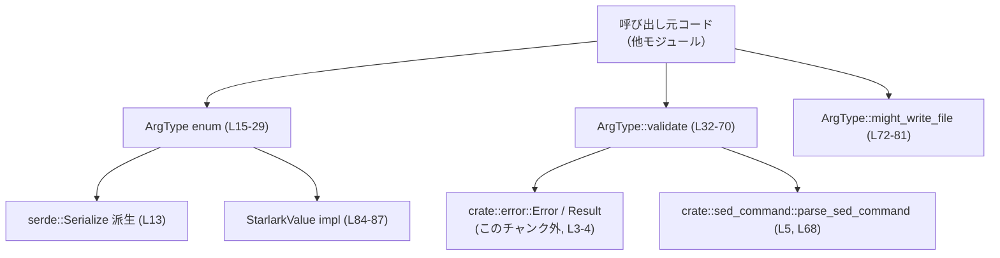
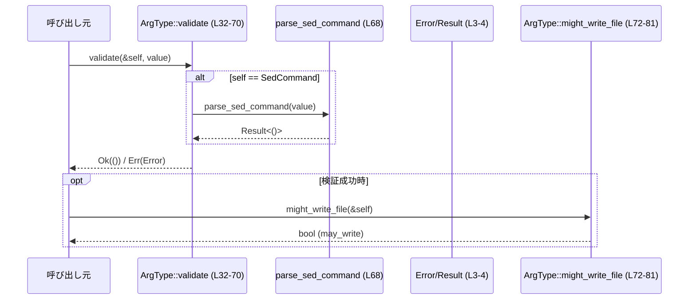

# execpolicy-legacy/src/arg_type.rs コード解説

## 0. ざっくり一言

このファイルは、コマンド引数を「リテラル」「ファイル」「整数」「sed コマンド」などの種類ごとに表現する `ArgType` 列挙体と、その **検証ロジック**・**ファイルを書きうるかの判定ロジック** を提供するモジュールです（arg_type.rs:L15-81）。

※ 行番号は、この回答内で `#![allow(...)]` 行を 1 行目とした相対行番号です。

---

## 1. このモジュールの役割

### 1.1 概要

- このモジュールは、コマンド実行ポリシーの中で「各引数がどのような型か」を表現し（`ArgType` 列挙体, arg_type.rs:L15-29）、
- 実際の文字列値がその型に適合しているかを検証します（`ArgType::validate`, arg_type.rs:L32-70）。
- さらに、その引数が「ファイルを書きうるか」をブール値で判定する補助メソッドを提供します（`ArgType::might_write_file`, arg_type.rs:L72-81）。
- `ArgType` は Starlark の値としても扱えるように定義されており、ビルドスクリプト言語との橋渡しも担っています（arg_type.rs:L84-87）。

### 1.2 アーキテクチャ内での位置づけ

このモジュールと周辺コンポーネントの関係を図示します。



- 呼び出し元コードは `ArgType` 値を生成し、`validate` と `might_write_file` を呼び出します（arg_type.rs:L31-81）。
- 検証結果やエラー表現には `crate::error::Result` / `Error` が使われます（arg_type.rs:L3-4, L32-69）。
- `ArgType::SedCommand` に対する検証は `parse_sed_command` に委譲されます（arg_type.rs:L5, L68）。
- `serde::Serialize` や `StarlarkValue` の実装により、シリアライズや Starlark との連携が可能です（arg_type.rs:L13, L84-87）。

### 1.3 設計上のポイント

- **列挙体での型分類**  
  - 引数の種類は `ArgType` 列挙体のバリアントとして表現されます（arg_type.rs:L15-28）。
- **純粋関数スタイル**  
  - `validate` / `might_write_file` は `&self` と引数を受け取り、内部状態を変更しません（arg_type.rs:L32-81）。
  - グローバル状態や `unsafe` は使用していません（arg_type.rs:L1-87）。
- **エラーハンドリング**  
  - 検証結果は `Result<()>` で返され、エラー時には `Error` 列挙体のバリアントが返ります（arg_type.rs:L3-4, L32-69）。
  - `Result` / `Error` の具体的な定義はこのチャンクにはありませんが、少なくとも `LiteralValueDidNotMatch`, `EmptyFileName`, `InvalidPositiveInteger` を含みます（arg_type.rs:L36, L46, L53, L60, L65）。
- **保守性**  
  - 新しい引数種別を追加する場合は、`ArgType` のバリアント追加と、`validate` / `might_write_file` の `match` への分岐追加で対応できる構造です（arg_type.rs:L15-28, L32-69, L73-79）。
- **並行性**  
  - `ArgType` はフィールドに `String` を含むだけの列挙体であり、メソッドは `&self` を取るだけなので、`ArgType` インスタンスを複数スレッドから参照してもデータ競合を起こさない構造になっています（arg_type.rs:L15-29, L31-81）。  
    （標準ライブラリの知識から、`String` は `Send + Sync` であり、従って `ArgType` も `Send + Sync` であると考えられます。）

---

## 2. 主要な機能一覧

- 引数種別の表現: `ArgType` 列挙体で引数の意味（ファイル／整数／sed コマンドなど）を表現する（arg_type.rs:L15-28）。
- 引数値の検証: `ArgType::validate` で与えられた文字列が期待された形式か検証する（arg_type.rs:L32-70）。
- ファイル書き込み可能性の判定: `ArgType::might_write_file` で、その型の引数がファイルを書きうる可能性を判定する（arg_type.rs:L72-81）。
- Starlark との連携: `ArgType` を Starlark の値として扱えるようにする（arg_type.rs:L84-87）。
- シリアライズ: `ArgType` を `serde::Serialize` 経由でシリアライズ可能にする（arg_type.rs:L13）。

---

## 3. 公開 API と詳細解説

### 3.1 型一覧（構造体・列挙体など）

#### コンポーネント一覧（型）

| 名前 | 種別 | 行 | 役割 / 用途 | 根拠 |
|------|------|----|-------------|------|
| `ArgType` | 列挙体 | 15-29 | コマンド引数の種別（リテラル、ファイル、整数、sed コマンド、未知）を表現する | arg_type.rs:L15-29 |
| `ArgType::Literal` | 列挙体バリアント | 16 | 特定の文字列リテラルと完全一致することを期待する引数 | arg_type.rs:L16 |
| `ArgType::OpaqueNonFile` | 列挙体バリアント | 17-18 | 何らかの値だが「ファイルパスではない」とわかっている引数 | arg_type.rs:L17-18 |
| `ArgType::ReadableFile` | 列挙体バリアント | 19-20 | コマンドで読み取りが期待されるファイルまたはディレクトリ | arg_type.rs:L19-20 |
| `ArgType::WriteableFile` | 列挙体バリアント | 21-22 | コマンドで書き込みが期待されるファイルまたはディレクトリ | arg_type.rs:L21-22 |
| `ArgType::PositiveInteger` | 列挙体バリアント | 23-24 | `head -n` のように正の整数を期待する引数 | arg_type.rs:L23-24 |
| `ArgType::SedCommand` | 列挙体バリアント | 25-26 | 安全な sed コマンドを表すための専用引数種別 | arg_type.rs:L25-26 |
| `ArgType::Unknown` | 列挙体バリアント | 27-28 | 型が不明であり、ファイルかもしれないしそうでないかもしれない引数 | arg_type.rs:L27-28 |
| `impl<'v> StarlarkValue<'v> for ArgType` | トレイト実装 | 85-87 | `ArgType` を Starlark の値として扱うための実装 | arg_type.rs:L84-87 |

#### コンポーネント一覧（関数／メソッド）

| 名前 | 種別 | 行 | 役割 / 用途 | 根拠 |
|------|------|----|-------------|------|
| `ArgType::validate(&self, value: &str) -> Result<()>` | メソッド | 32-70 | 文字列引数 `value` が `self` で表される種別に適合するか検証する | arg_type.rs:L32-70 |
| `ArgType::might_write_file(&self) -> bool` | メソッド | 72-81 | その引数種別がファイルを書きうる可能性があるかどうかを判定する | arg_type.rs:L72-81 |

### 3.2 関数詳細

#### `ArgType::validate(&self, value: &str) -> Result<()>`（arg_type.rs:L32-70）

**概要**

- `self`（`ArgType`）で表される引数種別に対し、実際の文字列 `value` が妥当かどうかを検証し、問題なければ `Ok(())`、不正な場合は `Error` を返すメソッドです（arg_type.rs:L32-69）。
- 種別ごとに検証内容が変わります（リテラル一致／空文字チェック／整数パース／sed コマンド検証など）。

**引数**

| 引数名 | 型 | 説明 | 根拠 |
|--------|----|------|------|
| `self` | `&ArgType` | 検証に使う引数種別。所有権は移動せず参照のみ。 | arg_type.rs:L32 |
| `value` | `&str` | 実際のコマンドライン引数文字列。 | arg_type.rs:L32 |

**戻り値**

- 型: `Result<()>`（`crate::error::Result` 型エイリアス）（arg_type.rs:L4, L32）。
- 意味:
  - `Ok(())`: 与えられた `value` が `self` に対応する型として妥当である。
  - `Err(Error::...)`: 不正な値であり、その理由を示すエラー（`LiteralValueDidNotMatch`, `EmptyFileName`, `InvalidPositiveInteger` または `parse_sed_command` からのエラー）が返る（arg_type.rs:L36, L46, L53, L60, L65, L68）。

**内部処理の流れ（アルゴリズム）**

`match self` でバリアントごとに次のように処理します（arg_type.rs:L33-69）。

1. **`ArgType::Literal(literal_value)` の場合（arg_type.rs:L34-43）**
   - `value != *literal_value` なら `Error::LiteralValueDidNotMatch { expected: literal_value.clone(), actual: value.to_string() }` を返す（arg_type.rs:L35-39）。
   - 一致していれば `Ok(())` を返す（arg_type.rs:L40-42）。

2. **`ArgType::ReadableFile` の場合（arg_type.rs:L44-50）**
   - `value.is_empty()` なら `Error::EmptyFileName {}` を返す（arg_type.rs:L45-47）。
   - それ以外は `Ok(())` を返す（arg_type.rs:L48-49）。
   - ファイル名の形式（パスの有効性など）については、空文字以外のチェックは行っていません（コード上は現れません）。

3. **`ArgType::WriteableFile` の場合（arg_type.rs:L51-57）**
   - ロジックは `ReadableFile` と同じで、空文字のみをエラーとします（arg_type.rs:L52-56）。

4. **`ArgType::OpaqueNonFile` または `ArgType::Unknown` の場合（arg_type.rs:L58）**
   - いかなる `value` に対しても検証を行わず、そのまま `Ok(())` を返します。

5. **`ArgType::PositiveInteger` の場合（arg_type.rs:L59-67）**
   - `value.parse::<u64>()` を行い、結果に応じて分岐します（arg_type.rs:L59）。
   - `Ok(0)` の場合: 「0 は正の整数ではない」とみなし、`Error::InvalidPositiveInteger { value: value.to_string() }` を返す（arg_type.rs:L60-62）。
   - `Ok(_)`（0 以外の非負整数）の場合: `Ok(())` を返す（arg_type.rs:L63）。
   - `Err(_)`（数値として解釈できない文字列）の場合: 同じく `Error::InvalidPositiveInteger { value: value.to_string() }` を返す（arg_type.rs:L64-66）。

6. **`ArgType::SedCommand` の場合（arg_type.rs:L68）**
   - `parse_sed_command(value)` をそのまま返します。
   - この関数の具体的な検証内容は `crate::sed_command` モジュール側にあり、このチャンクからは分かりません（arg_type.rs:L5, L68）。

**Examples（使用例）**

1. **Literal の検証**

```rust
use crate::arg_type::ArgType;               // 同一クレート内の ArgType をインポートする（慣例的なモジュールパス）
use crate::error::Result;                   // Result 型エイリアスをインポートする

fn check_literal() -> Result<()> {          // エラーをそのまま呼び出し元に返す関数
    let arg_type = ArgType::Literal("ls".to_owned()); // "ls" というコマンド名を期待する引数種別を作成する
    let value = "ls";                       // 実際の引数文字列

    arg_type.validate(value)?;              // "ls" と一致するので Ok(()) が返り、? でそのまま通過する
    Ok(())                                  // ここまで来れば検証成功
}
```

1. **正の整数の検証（エラーケース）**

```rust
use crate::arg_type::ArgType;               // ArgType をインポート
use crate::error::{Result, Error};          // Result と Error 型をインポート（Error 定義はこのチャンク外）

fn check_positive_integer() {               // ここでは Result を返さず、match で処理する例
    let arg_type = ArgType::PositiveInteger; // 正の整数を期待する引数種別
    let value = "0";                        // 0 は正の整数としては無効

    match arg_type.validate(value) {        // 検証を行う
        Ok(()) => println!("OK"),          // 正常時: OK と出力
        Err(Error::InvalidPositiveInteger { value }) => { // 0 や不正な文字列のとき
            println!("invalid positive integer: {}", value); // エラー内容を表示
        }
        Err(e) => {                         // 他のエラー種別（この関数では通常発生しないが網羅性のため）
            println!("unexpected error: {:?}", e); // デバッグ出力
        }
    }
}
```

1. **SedCommand の検証**

```rust
use crate::arg_type::ArgType;               // ArgType をインポート
use crate::error::Result;                   // Result 型エイリアス

fn check_sed_command(cmd: &str) -> Result<()> { // sed コマンド文字列を検証する関数
    let arg_type = ArgType::SedCommand;     // sed コマンド用の ArgType
    arg_type.validate(cmd)?;                // parse_sed_command による検証結果を ? で伝播する
    Ok(())                                  // 検証成功
}
```

**Errors / Panics**

- `Err` となる条件（コードに現れているもの）:
  - `Literal`:
    - `value` が期待する文字列と一致しない場合、`Error::LiteralValueDidNotMatch`（expected / actual を含む）を返す（arg_type.rs:L35-39）。
  - `ReadableFile` / `WriteableFile`:
    - `value.is_empty()`（空文字列）の場合、`Error::EmptyFileName {}` を返す（arg_type.rs:L45-47, L52-54）。
  - `PositiveInteger`:
    - `value.parse::<u64>()` が失敗した場合（非数値）、または 0 だった場合、`Error::InvalidPositiveInteger { value: value.to_string() }` を返す（arg_type.rs:L60-66）。
  - `SedCommand`:
    - `parse_sed_command(value)` が `Err` を返した場合、そのエラーがそのまま返る（arg_type.rs:L68）。  
      エラーの具体的な型や内容はこのチャンクからは分かりません。
- `OpaqueNonFile` / `Unknown` では、どのような入力でも `Err` にはなりません（arg_type.rs:L58）。
- この関数内で `panic!`・`unwrap`・`expect` などのパニック要因は使われていません（arg_type.rs:L32-70）。

**Edge cases（エッジケース）**

- `Literal`:
  - `value` が空文字列であっても、`literal_value` と一致していれば OK です（arg_type.rs:L35-41）。
  - 大文字小文字の扱いは単純な文字列比較であり、区別されます（`==` を使用, arg_type.rs:L35）。
- `ReadableFile` / `WriteableFile`:
  - 完全な空文字列だけがエラーとなり、それ以外の文字列はファイル名として許容されます（arg_type.rs:L45-49, L52-56）。
  - パスに含まれる文字（`..` や絶対パス、無効文字など）については検証していません。
- `OpaqueNonFile` / `Unknown`:
  - どのような文字列（空文字列や、非常に長い文字列も含む）でも常に `Ok(())` です（arg_type.rs:L58）。
- `PositiveInteger`:
  - `"0"` はエラーです（`Ok(0)` をエラー扱い, arg_type.rs:L60-62）。
  - `"0001"` のような先頭ゼロ付きでも `parse::<u64>()` が成功し 0 でなければ OK です（arg_type.rs:L59-63）。
  - `"-1"` のような負数表現は `u64` への変換で失敗し、エラーになります（arg_type.rs:L59-66）。
  - 空文字列や空白のみはパースに失敗し、エラーになります。
- `SedCommand`:
  - どのような文字列が OK / NG になるかは `parse_sed_command` の実装次第であり、このチャンクからは分かりません（arg_type.rs:L68）。

**使用上の注意点**

- `ArgType::Unknown` は検証上は常に `Ok(())` ですが、`might_write_file` では「書きうる」と判定されます（arg_type.rs:L58, L74）。  
  - 政策上、「不明な引数は危険側（書きうる）に倒す」という設計になっています。
- `ReadableFile` / `WriteableFile` の検証は空文字チェックのみに限定されています（arg_type.rs:L44-57）。  
  - パスの正当性や存在確認は別の層で行う必要があります。この関数は形式の一部しか担っていません。
- `PositiveInteger` は 0 を許容しない点に注意が必要です（arg_type.rs:L60-63）。  
  - 0 を許容したい仕様の場合、このロジックを変更する必要があります。
- すべての分岐で `Result` を用いており、`panic!` は発生しません（arg_type.rs:L32-70）。  
  - 呼び出し側でエラーをハンドリングすることが前提です。
- 並行呼び出しについて:
  - 関数は `&self` と `&str` のみを参照し、副作用を持たないため、複数スレッドから同一 `ArgType` インスタンスに対して `validate` を呼び出しても、データ競合や状態破壊は起こりません（arg_type.rs:L32-70）。

---

#### `ArgType::might_write_file(&self) -> bool`（arg_type.rs:L72-81）

**概要**

- `ArgType` の各バリアントに対し、「この引数がファイルを書きうる可能性があるか」をブール値で返すメソッドです（arg_type.rs:L72-79）。
- ポリシー判定やサンドボックス構成で、「書き込みを伴うかどうか」の大まかな推定に使うことが想定されます（命名と実装からの推測）。

**引数**

| 引数名 | 型 | 説明 | 根拠 |
|--------|----|------|------|
| `self` | `&ArgType` | 判定対象の引数種別。 | arg_type.rs:L72 |

**戻り値**

- 型: `bool`（arg_type.rs:L72）。
- 意味:
  - `true`: この種別の引数はファイルを書きうる（可能性を否定できない）。
  - `false`: この種別の引数はファイルを書かないとみなされる。

**内部処理の流れ（アルゴリズム）**

`match self` によって単純にバリアントを分類しています（arg_type.rs:L73-79）。

1. **`WriteableFile` または `Unknown` の場合（arg_type.rs:L74）**
   - `true` を返す。  
     - `WriteableFile`: 書き込みが期待されるファイルであるため。
     - `Unknown`: 型が分からないため、安全側に倒して「書きうる」とみなしていると解釈できます。

2. **その他のバリアント（`Literal(_)`, `OpaqueNonFile`, `PositiveInteger`, `ReadableFile`, `SedCommand`）の場合（arg_type.rs:L75-79）**
   - `false` を返す。
   - 読み取り専用 (`ReadableFile`) や単なる値 (`Literal`, `PositiveInteger`, `OpaqueNonFile`, `SedCommand`) は書き込みを伴わないとみなされています。

**Examples（使用例）**

```rust
use crate::arg_type::ArgType;               // ArgType をインポート

fn inspect_arg_type(arg_type: ArgType) {    // ArgType を受け取って挙動を観察する関数
    if arg_type.might_write_file() {        // ファイルを書きうるか判定する
        println!("this argument may write files"); // true の場合のメッセージ
    } else {
        println!("this argument will not write files"); // false の場合のメッセージ
    }
}

fn main() {
    inspect_arg_type(ArgType::ReadableFile);  // 読み取り専用: "will not write" が出力される
    inspect_arg_type(ArgType::WriteableFile); // 書き込み: "may write" が出力される
    inspect_arg_type(ArgType::Unknown);       // 不明: "may write" が出力される
}
```

**Errors / Panics**

- `Result` ではなく `bool` を返す単純な関数であり、エラーやパニックを発生させるコードは含みません（arg_type.rs:L72-81）。

**Edge cases（エッジケース）**

- `Unknown` を `true` とみなすのが重要なポイントです（arg_type.rs:L74）。
- `SedCommand` は `false` です（arg_type.rs:L78-79）。  
  - sed コマンドがファイルを書きうる可能性は本来ありますが、このメソッドはその情報を持ちません。  
  - `SedCommand` のファイル書き込み可能性は、別の層で管理していると推測されます（コード外の可能性）。

**使用上の注意点**

- `Unknown` を `true` と扱うことで、「不明なものは危険側に倒す」という保守的な判定になっています（arg_type.rs:L74）。
- `ReadableFile` は `false` なので、「読み取りしかしない」とみなされます（arg_type.rs:L78）。  
  - 実際には同じパスが別の引数で書き込まれる可能性もありますが、それはこのメソッドの責務外です。
- `SedCommand` も `false` のため、sed コマンドの中でのファイル書き込みは考慮されません（arg_type.rs:L78-79）。  
  - sed の安全性／副作用については `parse_sed_command` や他のポリシーレイヤに委ねられている可能性があります（arg_type.rs:L68）。

---

### 3.3 その他の関数

- このファイルには、上記 2 つのメソッド以外の関数・メソッドは定義されていません（arg_type.rs:L31-81）。

---

## 4. データフロー

ここでは典型的な使用シナリオとして、「引数の検証と、書き込み可能性の判定」を行う流れを示します。

1. 呼び出し元が `ArgType` と実際の文字列引数を持っている。
2. `ArgType::validate` を呼び出して引数値の妥当性を検証する。
   - 場合によっては `parse_sed_command` が呼ばれる。
   - エラーがあれば `Error` が返る。
3. 検証が通った後、`ArgType::might_write_file` で書き込み可能性を判定する。



- この図は arg_type.rs:L32-81 に現れる処理の流れに基づいています。
- 実際の利用においては、Caller となるのは「コマンド仕様を評価するモジュール」「Starlark スクリプト」「ポリシーエンジン」などと考えられますが、具体的なモジュール名はこのチャンクには現れません。

---

## 5. 使い方（How to Use）

### 5.1 基本的な使用方法

「コマンド仕様に基づいて、ユーザーから渡された引数を検証し、ポリシーに利用する」典型的なコードフローの例です。

```rust
use crate::arg_type::ArgType;               // ArgType 列挙体をインポートする（arg_type.rs:L15）
use crate::error::Result;                   // Result 型エイリアスをインポートする（arg_type.rs:L4）

// 単一の引数を検証し、その結果を返す関数
fn validate_and_check_write(arg_type: ArgType, value: &str) -> Result<bool> {
    arg_type.validate(value)?;              // ArgType に応じて value の妥当性を検証する（L32-70）

    let may_write = arg_type.might_write_file(); // 書き込み可能性を判定する（L72-81）
    Ok(may_write)                           // bool を Result で包んで返す
}
```

このパターンでは:

- `validate` で入力値の形式・意味の検証を行い、
- `might_write_file` でファイル書き込みポリシーへと接続するブール値を得ています。

### 5.2 よくある使用パターン

1. **複数引数の一括検証**

```rust
use crate::arg_type::ArgType;               // ArgType をインポート
use crate::error::Result;                   // Result をインポート

// (ArgType, 値) のペアを列挙してまとめて検証する
fn validate_args(spec_and_values: &[(ArgType, String)]) -> Result<()> {
    for (arg_type, value) in spec_and_values { // 各引数仕様と値を順番に取り出す
        arg_type.validate(value)?;        // それぞれの組を検証し、エラーなら早期リターン
    }
    Ok(())                                  // 全ての引数が妥当なら Ok(()) を返す
}
```

1. **書き込み引数だけを抽出する**

```rust
use crate::arg_type::ArgType;               // ArgType をインポート

fn count_potential_writers(arg_types: &[ArgType]) -> usize {
    arg_types
        .iter()                             // ArgType のスライスをイテレートする
        .filter(|t| t.might_write_file())   // 書き込み可能性があるものだけに絞り込む
        .count()                            // 件数を数える
}
```

### 5.3 よくある間違い

**誤り例: `validate` を呼ばずに値を使用する**

```rust
use crate::arg_type::ArgType;               // ArgType をインポート

fn use_without_validation(arg_type: ArgType, value: &str) {
    // NG 例: validate を呼び出さずに value を前提として扱っている
    if arg_type.might_write_file() {        // 種別だけを見て判断している
        println!("will write to {}", value); // value が空文字や不正でもここまで来てしまう
    }
}
```

**正しい例: まず `validate` を通す**

```rust
use crate::arg_type::ArgType;               // ArgType をインポート
use crate::error::Result;                   // Result をインポート

fn safe_use(arg_type: ArgType, value: &str) -> Result<()> {
    arg_type.validate(value)?;              // 先に妥当性を検証する（L32-70）

    if arg_type.might_write_file() {        // その後に書き込み可能性を確認する（L72-81）
        println!("will write to {}", value); // この時点の value は ArgType の制約を満たしている
    }
    Ok(())
}
```

### 5.4 使用上の注意点（まとめ）

- **検証の順序**  
  - `might_write_file` は単に種別に基づく判定であり、値の中身（空文字など）を見ません（arg_type.rs:L72-79）。  
    - 値を信頼する前に必ず `validate` を通すことが前提になります。
- **Unknown の扱い**  
  - `Unknown` は検証では常に合格 (`Ok(())`) ですが、書き込み判定では `true` になります（arg_type.rs:L58, L74）。  
    - ポリシー的には「未知のものは危険寄り」とみなされています。
- **ファイル名の検証範囲**  
  - `ReadableFile` / `WriteableFile` は「空文字でないこと」だけを検証します（arg_type.rs:L44-57）。  
    - パスの正当性・アクセス権・実在性などは別レイヤに任されています。
- **整数の範囲**  
  - `PositiveInteger` は 0 を不正とし、`u64` で表現可能な範囲以外も不正とします（arg_type.rs:L59-66）。  
    - 非負整数であっても、`u64` を超えるような大きすぎる値はエラーになります。
- **観測性（ログ等）**  
  - このファイル内にはログ出力やメトリクス送信などのコードはなく、エラーは `Error` 型でのみ表現されます（arg_type.rs:L32-69）。  
    - ログや監視への連携は、呼び出し側で `Result` / `Error` を解釈して行う前提です。

---

## 6. 変更の仕方（How to Modify）

### 6.1 新しい機能を追加する場合

**例: 新しい引数種別 `BooleanFlag` を追加したい場合**

1. **`ArgType` にバリアントを追加する**  
   - `ArgType` 列挙体に `BooleanFlag` を追加します（arg_type.rs:L15-28 内に追記）。
   - 追加する位置やドキュメンテーションコメントは既存のパターンに合わせます。

2. **`validate` に分岐を追加する**  
   - `match self` に `ArgType::BooleanFlag` 用の分岐を追加します（arg_type.rs:L33-69）。  
   - たとえば `"true"` / `"false"` のみ許容する、といったロジックを記述します。
   - `Error` 型に新しいバリアントが必要であれば、`crate::error` 側も変更する必要があります（このチャンク外）。

3. **`might_write_file` に分岐を追加する**  
   - `match self` に `ArgType::BooleanFlag` を含め、通常は `false` を返すことになると考えられます（arg_type.rs:L73-79）。

4. **Starlark との連携**  
   - `StarlarkValue` の実装自体は `ArgType` 全体に対する実装であり、新バリアント追加だけでは変更不要です（arg_type.rs:L84-87）。  
   - ただし、Starlark スクリプト側の期待に応じた変更が必要かどうかは、このチャンクからは分かりません。

### 6.2 既存の機能を変更する場合

- **`PositiveInteger` の仕様変更（0 を許容したいなど）**
  - `Ok(0)` をエラーとする分岐を削除し、`Ok(_)` をそのまま `Ok(())` にするように変更します（arg_type.rs:L60-63）。
  - `Error::InvalidPositiveInteger` に依存する呼び出し側の挙動が変わるため、影響範囲の確認が必要です。

- **ファイル名検証を強化したい場合**
  - `ReadableFile` / `WriteableFile` の分岐（arg_type.rs:L44-57）に、パス形式のチェックを追加します。
  - ただし、現在は空文字のみを検知している仕様なので、既存コードが「どんな文字列でも許容される」前提で動いていないか確認する必要があります。

- **`Unknown` のポリシー変更（書き込みなしとみなしたい場合）**
  - `might_write_file` において `ArgType::Unknown` を `true` から `false` に変更します（arg_type.rs:L74）。
  - これにより、未知の引数による書き込みの可能性を無視することになるため、安全性への影響を検討する必要があります。

- **コンパイラによる影響範囲の把握**
  - `ArgType` に対する `match` はコンパイル時に網羅性チェックが行われるため、新バリアントを追加したときに対応漏れがあればコンパイルエラーになります（arg_type.rs:L33-69, L73-79）。
  - そのため、影響範囲の特定は比較的容易です。

---

## 7. 関連ファイル

このモジュールと密接に関係する他モジュール（ファイルパスはこのチャンクからは分かりません）を整理します。

| モジュール / パス（推定） | 役割 / 関係 |
|---------------------------|------------|
| `crate::error` | `Error` 型と `Result` 型エイリアスを定義しているモジュールです。`ArgType::validate` で返されるエラー種別（`LiteralValueDidNotNotMatch`, `EmptyFileName`, `InvalidPositiveInteger` など）がここで定義されていると分かります（arg_type.rs:L3-4, L36, L46, L53, L60, L65）。 |
| `crate::sed_command` | `parse_sed_command` 関数を提供するモジュールです。`ArgType::SedCommand` の検証ロジックがここに委譲されています（arg_type.rs:L5, L68）。 |
| 外部クレート `allocative` | `Allocative` トレイトの derive により、メモリ使用状況のトラッキングや計測に関連する機能を利用できるようにしていると推測されますが、詳細はこのチャンクからは分かりません（arg_type.rs:L6, L13）。 |
| 外部クレート `serde` | `Serialize` トレイトの derive により、`ArgType` インスタンスを JSON などの形式でシリアライズ可能にしています（arg_type.rs:L8, L13）。 |
| 外部クレート `starlark` | `ProvidesStaticType` と `StarlarkValue` を通じて、`ArgType` を Starlark スクリプト言語と統合するために利用されています（arg_type.rs:L9-11, L13, L84-87）。 |

**テストコードについて**

- このチャンクにはテストモジュール（`mod tests { ... }`）やテスト関数は含まれていません（arg_type.rs:L1-87）。
- `ArgType::validate` や `ArgType::might_write_file` の仕様が重要であるため、実際のコードベースでは別ファイルや別モジュールでテストが存在する可能性がありますが、このチャンクからは確認できません。

以上が、`execpolicy-legacy/src/arg_type.rs` の公開 API・コアロジック・安全性・エッジケース・データフローを中心とした解説です。
