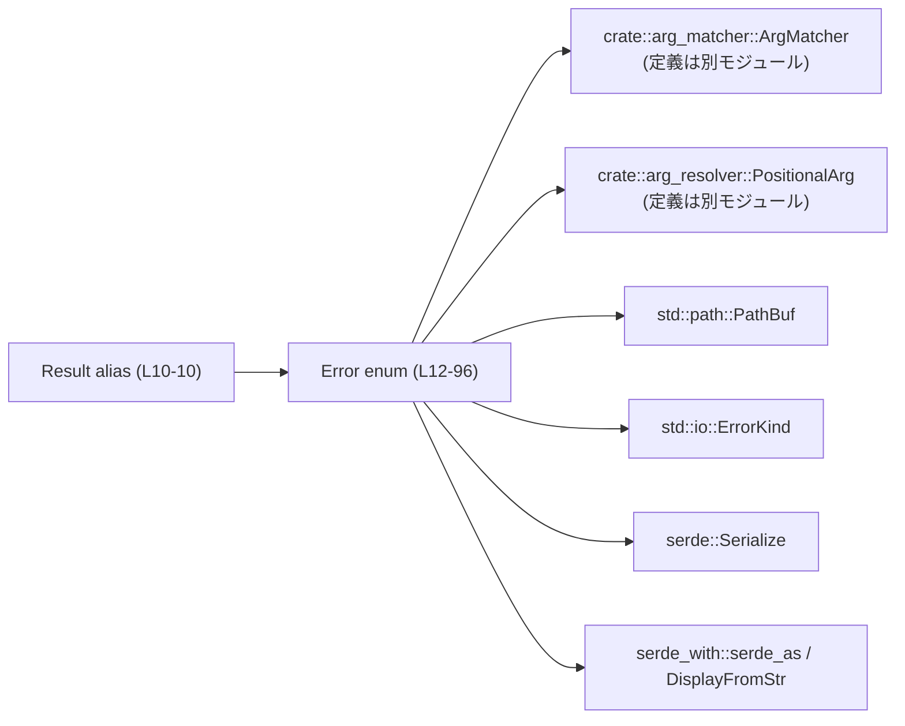
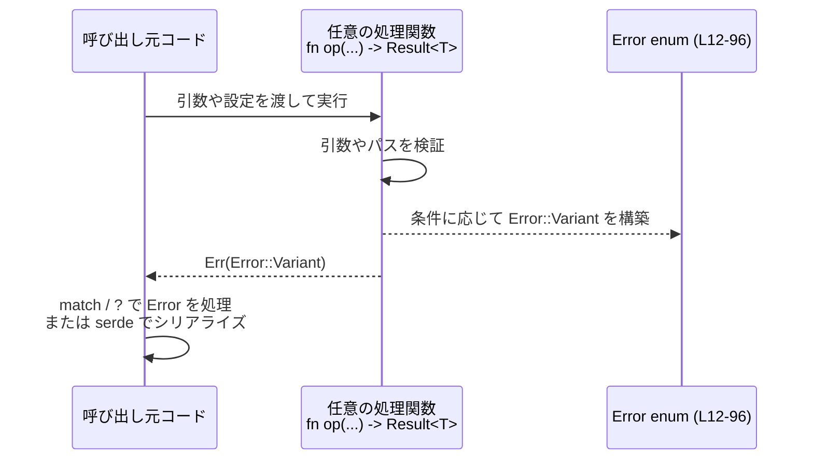

# execpolicy-legacy/src/error.rs コード解説

## 0. ざっくり一言

- コマンドライン引数のマッチングやファイルパスの安全性チェックなどで発生しうるエラーを表現する、**共通エラー型 `Error` と `Result<T>` エイリアス**を定義するモジュールです（`execpolicy-legacy/src/error.rs:L10-10, L12-96`）。
- エラーはすべて `serde` でシリアライズ可能になっており、JSON 等で外部に出力しやすい構造になっています（`Serialize` 派生と `#[serde(tag = "type")]`、`#[serde_as]` に基づく、`error.rs:L3, L12-15, L93-94`）。

---

## 1. このモジュールの役割

### 1.1 概要

- このモジュールは、**execpolicy-legacy 内で共通して使用されるエラー表現**を提供します。
  - `pub type Result<T> = std::result::Result<T, Error>;` により、戻り値のエラー型をこの `Error` に統一するための型エイリアスを定義しています（`error.rs:L10-10`）。
  - `pub enum Error { ... }` では、引数仕様の不一致・オプションの不備・パス検証の失敗など、多数のエラーケースを列挙しています（`error.rs:L15-95`）。
- `Error` は `Serialize` を derive しており、`#[serde(tag = "type")]` で **バリアント名を `"type"` フィールドとして付加した内部タグ付き表現**でシリアライズされます（`error.rs:L3, L13-15`）。

### 1.2 アーキテクチャ内での位置づけ

このモジュールは、他モジュールで使われる **エラー型の定義モジュール**として位置づけられます。

依存関係としては以下が読み取れます。

- ドメイン型
  - `crate::arg_matcher::ArgMatcher`（可変長引数などのマッチャー型と推測されるが、定義はこのチャンクには現れません。`error.rs:L5, L39-43, L53-57, L61-63`）
  - `crate::arg_resolver::PositionalArg`（位置引数を表す型と推測されるが、定義はこのチャンクには現れません。`error.rs:L6, L32-35, L53-56`）
- 標準ライブラリ
  - `std::path::PathBuf`（ファイル・ディレクトリパスの所有型。`error.rs:L1, L80-90`）
  - `std::io::ErrorKind`（パスの正規化に失敗した際のエラー種別。`error.rs:L94-94`）
- シリアライズ関連
  - `serde::Serialize`（`Error` のシリアライズを可能にします。`error.rs:L3, L13-13`）
  - `serde_with::serde_as` および `serde_with::DisplayFromStr`（`ErrorKind` を文字列表現でシリアライズするための補助。`error.rs:L7-8, L93-94`）

依存関係図は次の通りです。



- この図は、本チャンク（`execpolicy-legacy/src/error.rs`）に現れる依存関係のみを表しています。他モジュールから `Error` / `Result` がどう使われているかは、このチャンクには現れません。

### 1.3 設計上のポイント

コードから読み取れる設計上の特徴は以下の通りです。

- **エラーの一元管理**
  - すべてのエラーを単一の `Error` 列挙体で表現し、`Result<T>` エイリアスで利用する設計になっています（`error.rs:L10-15`）。
- **構造化されたエラー情報**
  - 多くのバリアントで、失敗の原因だけでなく文脈（どのプログラムか・どのオプションか・どのパスかなど）をフィールドとして保持します。
    - 例: `UnknownOption { program: String, option: String }`（`error.rs:L28-31`）
    - 例: `ReadablePathNotInReadableFolders { file: PathBuf, folders: Vec<PathBuf> }`（`error.rs:L80-83`）
- **ドメイン型を含むエラー**
  - 一部のエラーは `ArgMatcher` や `PositionalArg` をフィールドに含み、エラー時にもマッチングルールや未消費の引数といった情報を保持します（`error.rs:L32-35, L39-43, L53-57, L61-63`）。
- **シリアライズ前提の設計**
  - `Error` に `Serialize` を derive し、`#[serde(tag = "type")]` でバリアント名を `"type"` フィールドに出すシリアライズ形式を固定しています（`error.rs:L3, L13-15`）。
  - `CannotCanonicalizePath` の `error: std::io::ErrorKind` フィールドは、`#[serde_as(as = "DisplayFromStr")]` を通して文字列表現でシリアライズされるようになっています（`error.rs:L91-94`）。
- **安全性 / 並行性**
  - このファイルには `unsafe` ブロックやスレッド／非同期関連のコードは存在せず、**純粋なデータ定義**のみです（`error.rs` 全体に `unsafe` や `std::thread` / `async` 等は登場しません）。
  - 列挙体と所有型（`String`, `Vec`, `PathBuf` 等）だけで構成されており、メモリアクセスの安全性は Rust の型システムと所有権ルールに従って静的に保証されます。

---

## 2. 主要な機能一覧（コンポーネントインベントリー）

このモジュールが提供する主要な「機能」は型定義です。関数定義はありません。

### 2.1 型・エイリアス インベントリー

| 名前 | 種別 | 行範囲 | 役割 / 用途 |
|------|------|--------|-------------|
| `Result<T>` | 型エイリアス | `execpolicy-legacy/src/error.rs:L10-10` | 戻り値を `std::result::Result<T, Error>` に統一するための汎用 `Result` 型エイリアスです。 |
| `Error` | 列挙体 | `execpolicy-legacy/src/error.rs:L15-95` | コマンドライン引数の検証やファイルシステム関連のチェックにおける、さまざまなエラーケースを列挙した共通エラー型です。`Serialize` 派生と `#[serde(tag = "type")]` を持ちます。 |

---

## 3. 公開 API と詳細解説

### 3.1 型一覧（構造体・列挙体など）

上と重複しますが、公開 API 観点で整理します。

| 名前 | 種別 | 修飾子 | 役割 / 用途 |
|------|------|--------|-------------|
| `Result<T>` | 型エイリアス | `pub` | 任意の処理の結果を `Ok(T)` / `Err(Error)` で返すための統一型。エラー部分を本モジュールの `Error` に固定します（`error.rs:L10-10`）。 |
| `Error` | 列挙体 | `pub` | 引数仕様エラー・ランタイムでの検証エラー・ファイルパス安全性エラーなどを一元的に表す列挙体です。`Debug`, `Eq`, `PartialEq`, `Serialize` を derive しています（`error.rs:L13-15`）。 |

#### `Error` 列挙体のバリアント概要

各バリアントの詳細な意味は、名前とフィールドから推測されますが、**正確な振る舞い（どの条件で発生するか）はこのチャンクには現れません**。ここでは名前とフィールドのみ整理します。

- 引数仕様 / オプション関連（プログラム名を含むもの）
  - `NoSpecForProgram { program: String }`（`error.rs:L16-18`）  
    - 指定された `program` に対する仕様が見つからなかったことを表すと解釈できます。
  - `OptionMissingValue { program: String, option: String }`（`error.rs:L19-22`）
  - `OptionFollowedByOptionInsteadOfValue { program: String, option: String, value: String }`（`error.rs:L23-27`）
  - `UnknownOption { program: String, option: String }`（`error.rs:L28-31`）
  - `UnexpectedArguments { program: String, args: Vec<PositionalArg> }`（`error.rs:L32-35`）
  - `DoubleDashNotSupportedYet { program: String }`（`error.rs:L36-38`）
  - `NotEnoughArgs { program: String, args: Vec<PositionalArg>, arg_patterns: Vec<ArgMatcher> }`（`error.rs:L53-57`）
  - `MissingRequiredOptions { program: String, options: Vec<String> }`（`error.rs:L73-76`）
- 可変長引数・パターンマッチ関連
  - `MultipleVarargPatterns { program: String, first: ArgMatcher, second: ArgMatcher }`（`error.rs:L39-43`）
  - `VarargMatcherDidNotMatchAnything { program: String, matcher: ArgMatcher }`（`error.rs:L61-63`）
- 範囲・内部整合性
  - `RangeStartExceedsEnd { start: usize, end: usize }`（`error.rs:L44-47`）
  - `RangeEndOutOfBounds { end: usize, len: usize }`（`error.rs:L48-51`）
  - `PrefixOverlapsSuffix {}`（`error.rs:L52-52`）
  - `InternalInvariantViolation { message: String }`（`error.rs:L58-60`）
- 入力値の整合性
  - `EmptyFileName {}`（`error.rs:L65-65`）
  - `LiteralValueDidNotMatch { expected: String, actual: String }`（`error.rs:L66-69`）
  - `InvalidPositiveInteger { value: String }`（`error.rs:L70-72`）
- コマンド安全性（sed）
  - `SedCommandNotProvablySafe { command: String }`（`error.rs:L77-79`）
- ファイルパス・アクセス権関連
  - `ReadablePathNotInReadableFolders { file: PathBuf, folders: Vec<PathBuf> }`（`error.rs:L80-83`）
  - `WriteablePathNotInWriteableFolders { file: PathBuf, folders: Vec<PathBuf> }`（`error.rs:L84-87`）
  - `CannotCheckRelativePath { file: PathBuf }`（`error.rs:L88-90`）
  - `CannotCanonicalizePath { file: String, #[serde_as(as = "DisplayFromStr")] error: std::io::ErrorKind }`（`error.rs:L91-94`）

### 3.2 関数詳細

- このモジュールには **関数定義が一切存在しません**（`error.rs` 全体に `fn` が登場しません）。
- そのため、「関数詳細テンプレート」を適用すべき公開関数はありません。

### 3.3 その他の関数

- 関数は存在しないため、このセクションも該当なしです。

---

## 4. データフロー

このモジュールはデータ定義のみですが、典型的な使用シナリオとしては、

1. 他モジュールの処理関数が `Result<T>` を返すよう定義される（`error.rs:L10-10`）。
2. その関数内で検証や操作に失敗した場合、適切な `Error` バリアントが構築され `Err(Error::...)` が返される（`error.rs:L15-95`）。
3. 呼び出し側は `Result<T>` を `match` や `?` 演算子で扱うか、`Error` をシリアライズして外部に出力する。

この一般的な流れをシーケンス図で示します（関数名などは例であり、このチャンクには現れません）。



- この図に登場する `op` 関数はサンプルであり、実際の定義はこのチャンクには現れません。

---

## 5. 使い方（How to Use）

### 5.1 基本的な使用方法

`Result<T>` エイリアスと `Error` バリアントを用いた基本的なパターンの例です。  
※ これはあくまで使用例であり、このリポジトリ内に同一のコードが存在するわけではありません。

```rust
// error モジュールから Result と Error をインポートする
use execpolicy_legacy::error::{Result, Error};              // error.rs:L10-15 に基づく利用例

// 範囲の整合性をチェックする処理の例
fn check_range(start: usize, end: usize) -> Result<()> {    // 戻り値に Result<()> を使用
    if start > end {                                        // start が end より大きい場合
        // Error::RangeStartExceedsEnd バリアントを構築して Err で返す
        return Err(Error::RangeStartExceedsEnd {            // error.rs:L44-47 に対応
            start,
            end,
        });
    }

    Ok(())                                                  // 問題なければ Ok(()) を返す
}
```

- ここで `Result<()>` は `std::result::Result<(), Error>` の別名です（`error.rs:L10-10`）。

### 5.2 よくある使用パターン

#### 5.2.1 コマンドライン引数エラーの生成

```rust
use execpolicy_legacy::error::{Result, Error};              // error.rs:L10-15

fn handle_option(program: &str, option: &str, value: Option<&str>) -> Result<()> {
    if value.is_none() {                                    // 値が指定されていない場合
        return Err(Error::OptionMissingValue {             // error.rs:L19-22
            program: program.to_string(),                  // &str から String を生成
            option: option.to_string(),
        });
    }

    // ここでは成功とする
    Ok(())
}
```

#### 5.2.2 ファイルパスエラーの利用とシリアライズ

`Error` が `Serialize` を実装しているため（`error.rs:L3, L13-15`）、`serde_json` 等でシリアライズできます。

```rust
use execpolicy_legacy::error::Error;                       // Error 列挙体を利用
use serde_json;                                            // 別途 Cargo.toml に依存を追加している前提

fn main() -> Result<(), Box<dyn std::error::Error>> {
    // 読み取り可能フォルダ外のパスであったというエラーの例
    let error = Error::ReadablePathNotInReadableFolders {  // error.rs:L80-83
        file: std::path::PathBuf::from("/tmp/file.txt"),
        folders: vec![
            std::path::PathBuf::from("/safe"),
            std::path::PathBuf::from("/data"),
        ],
    };

    // JSON にシリアライズする
    let json = serde_json::to_string_pretty(&error)?;      // Serialize 実装に依存
    println!("{json}");

    Ok(())
}
```

- このとき JSON の `"type"` フィールドにはバリアント名（例: `"ReadablePathNotInReadableFolders"`）が入る形式になります（`#[serde(tag = "type")]`, `error.rs:L14-15` に基づく）。

### 5.3 よくある間違い（起こりうる誤用例）

このモジュールの観点で起こりうる誤用例と、その修正例です。

```rust
use execpolicy_legacy::error::{Result, Error};

// 誤り例: Error を返すべき関数が、型エイリアス Result を使っていない
fn parse_args_wrong() -> std::result::Result<(), Error> {   // コンパイルは通るが、一貫性に欠ける
    Err(Error::EmptyFileName {})                           // error.rs:L65-65
}

// 正しい例: error.rs で定義された Result<T> を利用する
fn parse_args() -> Result<()> {                            // error.rs:L10-10 に合わせたシグネチャ
    Err(Error::EmptyFileName {})
}
```

- どちらも型としては同じですが、**プロジェクト内のスタイルとして `Result<T>` エイリアスを使う前提**であれば、後者の形に揃えるのが一貫性のある使い方になります。

### 5.4 使用上の注意点（まとめ）

- **シリアライズ互換性**
  - `Error` は `#[serde(tag = "type")]` によってシリアライズ形式が固定されています（`error.rs:L14-15`）。  
    バリアント名やフィールド名を変更すると、既存の JSON との互換性が失われる可能性があります。
- **フィールド型の `Serialize` 実装**
  - `Error` に `Serialize` を derive しているため（`error.rs:L13-13`）、すべてのフィールド型は `Serialize` を実装している必要があります。  
    `ArgMatcher` や `PositionalArg` など、crate 内の他の型も `Serialize` 対応であることが前提になりますが、このチャンクにはその定義は現れません。
- **範囲・整合性エラーの意味**
  - `RangeStartExceedsEnd` と `RangeEndOutOfBounds` は、**呼び出し元のバグまたは入力の矛盾**を表す用途が想定されます（`error.rs:L44-51`）。  
    呼び出し側では、これらのエラーが発生しないように事前条件を満たすことが望ましいです。
- **並行性**
  - このモジュールにはスレッド・非同期処理・ロック等は登場しません。`Error` 自体が `Send` / `Sync` かどうかは、内部で使用している型（`String`, `PathBuf`, `Vec<T>`, `ArgMatcher`, `PositionalArg` 等）の特性に依存しますが、このチャンクだけからは断定できません。  
  - ただし、`Error` は単なる所有データの集まりであり、共有の可否は通常 Rust の所有権・借用ルールに従って安全に判断されます。

---

## 6. 変更の仕方（How to Modify）

### 6.1 新しいエラー種別を追加する場合

1. **バリアントの追加場所を決める**
   - 既存の分類（引数関連 / 範囲関連 / パス関連 など）を参考に、近いカテゴリのバリアントの近くに追加すると可読性が保たれます（例: パス関連は `ReadablePathNotInReadableFolders` 周辺に集まっています。`error.rs:L80-90`）。
2. **フィールド型を決める**
   - 追加するフィールド型がすべて `Serialize` を実装していることを確認する必要があります（`Serialize` の derive による制約, `error.rs:L13-13`）。
3. **シリアライズ形式への影響を考える**
   - `#[serde(tag = "type")]` のため、新しいバリアントは `"type": "NewVariantName"` のような新しい種類の JSON を生成します（`error.rs:L14-15`）。  
     既存クライアントがその `"type"` を知らない場合の影響を考慮する必要があります。
4. **利用箇所を更新**
   - 新しいバリアントを返す処理を他モジュールに追加し、必要に応じて `match Error { ... }` の分岐に新バリアントを追加する必要があります。  
     これらの実際の利用箇所はこのチャンクには現れません。

### 6.2 既存のエラー仕様を変更する場合

- **バリアント削除・名称変更**
  - 名前を変更するとシリアライズ時の `"type"` が変わるため、**外部とのプロトコル変更**になります（`error.rs:L14-15`）。  
    既存の JSON ログやクライアント側のデシリアライズ処理が新名称に対応できるか確認が必要です。
- **フィールドの追加・削除**
  - フィールドの追加は、シリアライズフォーマットに新しいフィールドを追加することを意味します。  
    受信側が余分なフィールドを無視できる設計であれば後方互換を保てますが、厳格にフィールドを検証している場合は影響します。
  - フィールド削除は、必要な情報を失う可能性があります。特に `program`, `file` などコンテキスト情報はデバッグ・ログ解析に有用です（`error.rs:L16-18, L80-90`）。
- **内部整合性エラー (`InternalInvariantViolation`)**
  - このバリアントは自由形式の `message: String` のみを持つため（`error.rs:L58-60`）、内部ロジックの前提条件が破れた際などの最後の手段として使う設計と考えられます。  
    利用箇所を変更する場合は、メッセージ文字列に頼りすぎず、可能なら他の構造化バリアントで表現できないか検討するのが一般的です。

---

## 7. 関連ファイル・モジュール

このモジュールと密接に関係する他モジュール・型は、インポートとフィールド型から次のように読み取れます。

| パス / モジュール | 役割 / 関係 |
|-------------------|------------|
| `crate::arg_matcher`（正確なファイルパスはこのチャンクには現れません） | 型 `ArgMatcher` を定義するモジュールと推測されます（`use crate::arg_matcher::ArgMatcher;` に基づく, `error.rs:L5-5`）。`Error` の `MultipleVarargPatterns`, `NotEnoughArgs`, `VarargMatcherDidNotMatchAnything` などで利用されています（`error.rs:L39-43, L53-57, L61-63`）。 |
| `crate::arg_resolver`（正確なファイルパスはこのチャンクには現れません） | 型 `PositionalArg` を定義するモジュールと推測されます（`use crate::arg_resolver::PositionalArg;`, `error.rs:L6-6`）。`Error` の `UnexpectedArguments`, `NotEnoughArgs` で使用されています（`error.rs:L32-35, L53-56`）。 |
| `serde` | `Serialize` トレイトを提供し、`Error` のシリアライズを可能にしています（`error.rs:L3, L13-13`）。 |
| `serde_with` | `#[serde_as]` と `DisplayFromStr` を提供し、`std::io::ErrorKind` を文字列表現でシリアライズするために使用されています（`error.rs:L7-8, L93-94`）。 |
| `std::path` | `PathBuf` 型を提供し、パス関連エラーの `file` や `folders` フィールドに利用されています（`error.rs:L1, L80-90`）。 |
| `std::io` | `ErrorKind` 型を提供し、`CannotCanonicalizePath` のエラー種別として利用されています（`error.rs:L94-94`）。 |

### テストコードについて

- このファイルにはテストモジュール（`#[cfg(test)] mod tests { ... }`）やテスト関数は存在しません（`error.rs` 全体に `#[test]` 等は登場しません）。  
  テストが存在する場合は別ファイルか別モジュールにあると考えられますが、このチャンクには現れません。

---

以上が、`execpolicy-legacy/src/error.rs` に含まれるエラー定義モジュールの構造と利用上のポイントです。このファイルは関数ロジックを持たないため、**エラーの種類とその表現の仕方**に焦点を当てて理解・変更することが中心になります。
