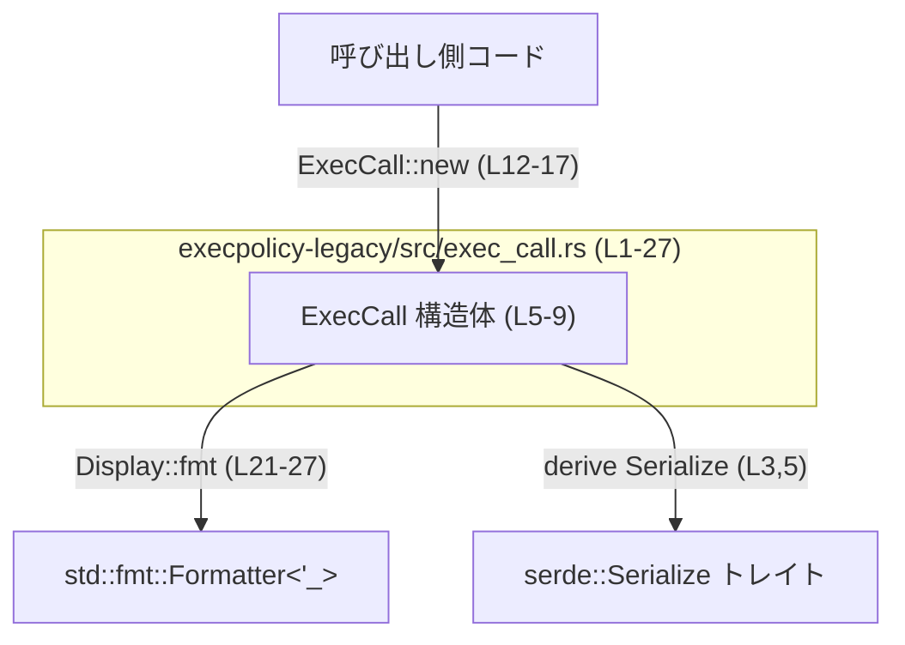
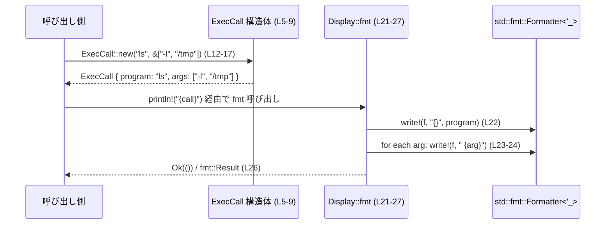

# execpolicy-legacy/src/exec_call.rs コード解説

---

## 0. ざっくり一言

このファイルは、**外部プログラム名とその引数を表現するデータ構造 `ExecCall` と、その生成・表示ロジック**を提供するモジュールです（根拠: `ExecCall` 定義と `impl` 群 `execpolicy-legacy/src/exec_call.rs:L5-27`）。

---

## 1. このモジュールの役割

### 1.1 概要

- このモジュールは、**「プログラム名 + 引数リスト」からなる実行コマンドを、安全に所有型として保持する**ための `ExecCall` 構造体を提供します（根拠: フィールド `program`, `args` 定義 `L6-8`）。
- `ExecCall::new` で `&str` から生成し、`Display` 実装により `"prog arg1 arg2"` 形式の文字列表現に変換できます（根拠: `impl ExecCall` と `impl Display` `L11-27`）。
- `Serialize` の派生により、Serde ベースのシリアライザと連携して JSON 等へシリアライズ可能です（根拠: `use serde::Serialize` と `#[derive(..., Serialize)]` `L3,5`）。

### 1.2 アーキテクチャ内での位置づけ

このファイル内で確認できる依存関係は、以下のとおりです。



- 呼び出し側コードは `ExecCall::new` を通じて `ExecCall` を構築します（根拠: `pub fn new` `L12`）。
- その後、`println!("{call}")` や `format!("{call}")` などで `Display::fmt` が呼ばれ、`Formatter` に文字列が書き込まれます（根拠: `impl Display for ExecCall` `L20-27`）。
- `Serialize` 派生により、`serde_json::to_string(&exec_call)` などのシリアライズが利用可能です（根拠: `Serialize` 派生 `L3,5`）。実際にどのシリアライザを使うかは、このチャンクには現れません。

### 1.3 設計上のポイント

- **純粋なデータ構造**  
  - `ExecCall` は `String` と `Vec<String>` だけをフィールドに持つ、状態を持たない単純な値型です（根拠: 構造体定義 `L6-8`）。
- **所有権ベースの設計**  
  - コンストラクタは `&str` / `&[&str]` を受け取り、内部では `String` にコピーして所有権を持つため、ライフタイムパラメータが不要で扱いやすくなっています（根拠: `program: program.to_string()`, `args.iter().map(|&s| s.into())` `L14-15`）。
- **トレイトによる拡張性**  
  - `Clone`, `Debug`, `Eq`, `PartialEq`, `Serialize`, `Display` を備え、ログ出力・比較・シリアライズなど多様な用途で利用可能です（根拠: `#[derive(...)]` `L5`, `impl Display` `L20-27`）。
- **エラーハンドリング方針**  
  - コンストラクタ `new` は失敗しない純粋関数です（`Result` などを返さない `Self` 戻り値 `L12`）。
  - `Display::fmt` は、フォーマッタへの書き込みエラーを `std::fmt::Result` としてそのまま伝播します（根拠: `?` 演算子の使用 `L22,24`）。
- **並行性**  
  - フィールドが `String` と `Vec<String>` のみであるため、Rust の自動トレイトにより `Send` / `Sync` になり得る構造です（この特性は型構成からの言語仕様上の事実であり、このファイル内に明示的な記述はありません）。

---

## 2. 主要な機能一覧

- `ExecCall` 型の定義: プログラム名と引数を保持するデータ構造（根拠: `L5-9`）。
- `ExecCall::new`: `&str` / `&[&str]` から `ExecCall` を構築するコンストラクタ（根拠: `L11-17`）。
- `Display` 実装: `"program arg1 arg2"` 形式の文字列表現を生成する機能（根拠: `L20-27`）。
- `Serialize` 派生: Serde によるシリアライズ対応（根拠: `use serde::Serialize` と `Serialize` 派生 `L3,5`）。

---

## 3. 公開 API と詳細解説

### 3.1 型一覧（構造体・列挙体など）

#### 構造体インベントリー

| 名前 | 種別 | 役割 / 用途 | 根拠 |
|------|------|-------------|------|
| `ExecCall` | 構造体 | 実行するプログラム名と、その引数文字列を保持するコマンド表現 | `execpolicy-legacy/src/exec_call.rs:L5-9` |

- フィールド詳細（根拠: `L6-8`）  
  - `program: String`  
    - 実行するプログラムの名前またはパスを表す文字列です。
  - `args: Vec<String>`  
    - コマンドライン引数のリストです。順序が保持されます。

- 派生トレイト（根拠: `L5`）  
  - `Clone`, `Debug`, `Eq`, `PartialEq`, `Serialize`

#### 関数 / メソッド インベントリー

| 関数名 | 所属 | シグネチャ（概要） | 公開性 | 役割 | 根拠 |
|--------|------|--------------------|--------|------|------|
| `ExecCall::new` | `impl ExecCall` | `pub fn new(program: &str, args: &[&str]) -> Self` | 公開 | `&str` 群から `ExecCall` を生成するコンストラクタ | `execpolicy-legacy/src/exec_call.rs:L11-17` |
| `Display::fmt` | `impl Display for ExecCall` | `fn fmt(&self, f: &mut Formatter<'_>) -> fmt::Result` | 非公開（トレイト実装） | `ExecCall` を `"prog arg1 ..."` 形式でフォーマットする | `execpolicy-legacy/src/exec_call.rs:L20-27` |

> 公開 API として外部から直接使われるのは `ExecCall` と `ExecCall::new` です（根拠: `pub struct`, `pub fn` `L6,12`）。

---

### 3.2 関数詳細

#### `ExecCall::new(program: &str, args: &[&str]) -> Self`

**概要**

- プログラム名と `&str` の引数スライスから、新しい `ExecCall` インスタンスを生成します（根拠: `Self { program: ..., args: ... }` `L13-16`）。

**引数**

| 引数名 | 型 | 説明 |
|--------|----|------|
| `program` | `&str` | 実行するプログラム名またはパスを表す UTF-8 文字列。空文字列も許容されます（検証は行っていません）（根拠: そのまま `to_string` している `L14`）。 |
| `args` | `&[&str]` | コマンドライン引数のスライス。各要素が `String` にコピーされ、内部の `Vec<String>` に格納されます（根拠: `args.iter().map(|&s| s.into())` `L15`）。 |

**戻り値**

- `Self` (`ExecCall`)  
  - 渡された `program` と `args` を、それぞれ `String` / `Vec<String>` に変換して保持した新しいインスタンスです（根拠: フィールド初期化 `L13-16`）。

**内部処理の流れ（アルゴリズム）**

1. `program` を `String` に変換し、`program` フィールドに格納します（`program.to_string()` `L14`）。
2. `args` スライスの各要素 `&str` を走査します（`args.iter()` `L15`）。
3. 各 `&str` を `String` に変換し（`|&s| s.into()` `L15`）、新しい `Vec<String>` に収集します（`collect()` `L15`）。
4. 上記 2 フィールドを持つ `ExecCall` インスタンスを作って返します（`Self { ... }` `L13-16`）。

この処理はすべてヒープ上の新しいメモリ領域へコピーを行い、元の `&str` のライフタイムには依存しません。

**Examples（使用例）**

> クレート名やモジュール階層はこのチャンクからは分からないため、`use` のパスは仮のものです。

```rust
// 仮のモジュールパス。実際のパスはプロジェクト全体の構成に依存します。
use execpolicy_legacy::exec_call::ExecCall; // この行は例示であり、このチャンクからは正確なパスは分かりません。

fn main() {
    // "ls -l /tmp" に相当するコマンドを構築する
    let call = ExecCall::new("ls", &["-l", "/tmp"]); // &str から ExecCall を生成

    assert_eq!(call.program, "ls".to_string());      // program フィールドを確認
    assert_eq!(
        call.args,
        vec!["-l".to_string(), "/tmp".to_string()]  // args フィールドを確認
    );
}
```

**Errors / Panics**

- `ExecCall::new` 自体は **エラーも panic も発生させません**。
  - 返り値は `Self` であり、`Result` などを返していません（根拠: シグネチャ `L12`）。
  - 内部処理も `to_string` と `into` のみで、通常の UTF-8 文字列であれば panic を生じません（根拠: 本文 `L14-15`）。
- `to_string()` や `into()` は `&str` から `String` へのコピーであり、ここでは失敗しない標準ライブラリの操作です。

**Edge cases（エッジケース）**

- `program` が空文字列のとき  
  - そのまま空の `String` として保持します。検証やエラーは行いません（根拠: 事前条件チェックが存在しないこと `L12-16`）。
- `args` が空スライス (`&[]`) のとき  
  - `args.iter()` が空となり、`Vec<String>` も空になります（根拠: `iter().map(...).collect()` の通常挙動 `L15`）。
- `args` の中に空文字列や空白のみの文字列が含まれるとき  
  - そのまま `String` 化して格納されます。表示時には空の引数として扱われます（検証・トリム処理はありません）（根拠: 加工処理が無い `L15`）。

**使用上の注意点**

- `ExecCall` は `String` を所有するため、非常に長い引数リストや大きな文字列を大量に構築する場合、メモリ確保コストがかかります。
  - 頻繁に同じ引数を再利用する場合は、再利用戦略（キャッシュなど）を検討する余地があります。
- `program` / `args` の妥当性（存在するコマンドか、不正な文字を含まないか等）は本関数ではチェックされません。  
  実際に OS コマンドとして使用する場合は、呼び出し側で検証が必要です。  
  （このファイルには `std::process::Command` などの利用は現れないため、実際の起動方法は不明です。）

---

#### `Display for ExecCall::fmt(&self, f: &mut std::fmt::Formatter<'_>) -> std::fmt::Result`

**概要**

- `ExecCall` を `"program arg1 arg2 ..."` の形式で文字列に整形するための表示ロジックです（根拠: `write!(f, "{}", self.program)` と引数ループ `L22-25`）。

**引数**

| 引数名 | 型 | 説明 |
|--------|----|------|
| `&self` | `&ExecCall` | 表示対象の `ExecCall` です。所有権を移動せず借用で受け取ります（根拠: シグネチャ `L21`）。 |
| `f` | `&mut std::fmt::Formatter<'_>` | 出力先のフォーマッタ。`println!` や `format!` から渡される内部オブジェクトです（根拠: シグネチャ `L21`）。 |

**戻り値**

- `std::fmt::Result` (`Result<(), std::fmt::Error>`)  
  - すべての書き込みが成功すれば `Ok(())` を返し、途中で書き込みエラーが発生した場合は `Err(fmt::Error)` を返します（根拠: `?` を使ったエラー伝播と `Ok(())` `L22-26`）。

**内部処理の流れ（アルゴリズム）**

1. プログラム名をそのまま出力します（`write!(f, "{}", self.program)?;` `L22`）。
2. `args` の各要素について、先頭にスペースを付けて順に出力します（`for arg in &self.args` と `write!(f, " {arg}")?;` `L23-24`）。
3. すべての書き込みが成功したら `Ok(())` を返します（根拠: `Ok(())` `L26`）。

結果として、`program` と各 `args` はスペース区切りで 1 行の文字列になります。

**Examples（使用例）**

```rust
// 仮のパス。正確なモジュールパスはこのチャンクからは不明です。
use execpolicy_legacy::exec_call::ExecCall;

fn main() {
    let call = ExecCall::new("ls", &["-l", "/tmp"]);

    // Display 実装により、to_string() / println! で整形される
    assert_eq!(call.to_string(), "ls -l /tmp");

    println!("{call}"); // "ls -l /tmp" が出力される
}
```

**Errors / Panics**

- **Errors**
  - `write!` マクロが失敗した場合（例えば、`Formatter` の内部バッファがエラーを返すような状況）、
    その `fmt::Error` が `?` によってそのまま呼び出し元に伝播します（根拠: `?` 使用 `L22,24`）。
  - 通常の `println!` や `format!` の利用では、ほとんどの場合エラーは発生しません。
- **Panics**
  - この関数内に `panic!` 呼び出しは無く、標準ライブラリ呼び出しも通常は panic を起こさないため、通常の利用では panic しません（根拠: 関数本体に panic 要素が無いこと `L21-26`）。

**Edge cases（エッジケース）**

- `args` が空の場合  
  - 出力は `program` のみとなり、後続のスペースや引数は付きません（根拠: `for` ループが 1 回も回らない `L23-24`）。
- `program` が空文字列の場合  
  - 出力の先頭は空文字になり、例えば `args = ["a"]` なら `" a"` となります。空文字に対する特別扱いはありません（根拠: 条件分岐が無い `L21-26`）。
- 引数にスペースを含むケース  
  - 例えば `args = ["a b"]` の場合、出力は `"prog a b"` となり、引数境界が曖昧になります。エスケープや引用符の付加は行いません（根拠: 単純に `" {arg}"` としている `L24`）。

**使用上の注意点**

- **シェルコマンド文字列としての利用に関する注意**
  - 出力は単純にスペース区切り文字列であり、シェル用のエスケープやクォート処理を行いません（根拠: エスケープ処理が存在しない `L22-25`）。
  - この文字列をそのままシェル（`/bin/sh` など）に渡すと、空白や特殊文字を含む引数が意図しない解釈をされる可能性があります。
  - 実際にどのように使われているかはこのファイルからは分かりませんが、必要なら呼び出し側でエスケープ処理を行う必要があります。
- ロケールやエンコーディングを意識した特別な処理は行っていません。`String` は UTF-8 文字列として扱われます。

---

### 3.3 その他の関数

- このファイルには、上記以外の関数やメソッドは定義されていません（根拠: 全行を通して `fn` の定義は `new` と `fmt` の 2 つのみ `L12,21`）。

---

## 4. データフロー

代表的な利用シナリオとして、**コマンド定義の構築 → 表示（ログ出力など）** の流れを示します。



- データは常に `String` / `Vec<String>` の所有ヴァリューとして扱われ、借用ライフタイムの制約は `Display::fmt` の一時的な参照にのみ存在します（根拠: `&self` とフィールド型 `L6-8,21`）。
- 並行性に関する処理や共有状態は持たず、`ExecCall` インスタンスは他スレッドにムーブしても問題ない構造になっています（型構成による言語仕様上の性質。コード中にスレッド関連 API は現れません `L1-27`）。

---

## 5. 使い方（How to Use）

### 5.1 基本的な使用方法

`ExecCall::new` でコマンドを構築し、そのまま `Display` や `Serialize` を利用する基本的なフローです。

```rust
// 実際の use パスはプロジェクト構成に依存します。このチャンクからは不明です。
use execpolicy_legacy::exec_call::ExecCall;
use serde_json; // 例: Serde JSON。依存有無はこのチャンクには現れません。

fn main() -> Result<(), Box<dyn std::error::Error>> {
    // 1. ExecCall を構築する
    let call = ExecCall::new("ls", &["-l", "/tmp"]); // L12-17 相当

    // 2. 表示用文字列として利用する（Display 実装）
    println!("{call}"); // 出力: "ls -l /tmp"（L21-27 相当）

    // 3. JSON などへシリアライズする（Serialize 派生）
    let json = serde_json::to_string(&call)?; // Serialize 派生 L3,5 に依存
    println!("{json}");

    Ok(())
}
```

### 5.2 よくある使用パターン

1. **ログ出力用途**
   - 実際のプロセス起動処理（このチャンクには現れない）と組み合わせ、実行前に
     `info!("executing: {call}")` のようにログに出す用途が想定できます。
   - `Display` により `"program args..."` 形式で読みやすいログになります（根拠: `fmt` 実装 `L21-27`）。

2. **設定やポリシーのシリアライズ**
   - `ExecCall` を設定ファイルやポリシーとして JSON/YAML 等に保存する場合、`Serialize` 派生が利用できます（根拠: `Serialize` 派生 `L3,5`）。

### 5.3 よくある間違い

```rust
// 間違い例: Display 文字列をシェルにそのまま渡してしまう
// （このコードは例示であり、このプロジェクト内に実際に存在するとは限りません）
use std::process::Command;
use execpolicy_legacy::exec_call::ExecCall;

fn wrong_usage() {
    let call = ExecCall::new("echo", &["hello world"]);

    // NG 例: Display 出力をシェルにまとめて渡す（エスケープなし）
    let cmd_str = call.to_string(); // "echo hello world"
    // Command::new("sh").arg("-c").arg(cmd_str).status().unwrap(); // シェルインジェクションのリスク

    // 正しい方向性の例（概念的）:
    // Command::new(&call.program).args(&call.args).status().unwrap();
}
```

- `ExecCall` 自身はエスケープを行わず、単に文字列を保持・表示するだけです（根拠: `fmt` が `" {arg}"` しか行わない `L22-24`）。
- OS コマンド実行に使う場合は、`std::process::Command` に `program` と `args` を個別に渡す方が安全です。

### 5.4 使用上の注意点（まとめ）

- `ExecCall` は **検証や正規化を行わない純粋なコンテナ** です。
  - プログラム名や引数の妥当性チェックは、呼び出し側で実装する必要があります（根拠: バリデーションロジックが存在しない `L5-27`）。
- 表示文字列は **シェル安全ではありません**。
  - 特殊文字や空白の扱いは一切行っていません（根拠: `write!(f, " {arg}")` だけの実装 `L24`）。
- 巨大な引数リストを頻繁に生成すると、`String` と `Vec` の再確保コストがかさみます。
  - 必要に応じて、`ExecCall` の再利用やキャッシュ戦略を検討できます。

---

## 6. 変更の仕方（How to Modify）

### 6.1 新しい機能を追加する場合

例: 引数に環境変数や作業ディレクトリ情報を追加したい場合。

1. **構造体にフィールドを追加する**
   - `ExecCall` に新フィールド（例: `env: Vec<(String, String)>`）を追加（根拠: 構造体定義 `L6-8`）。
2. **コンストラクタのインターフェースを拡張する**
   - `ExecCall::new` の引数に新フィールド用のパラメータを追加し、`Self { ... }` の初期化を更新します（根拠: コンストラクタ定義 `L11-17`）。
3. **`Display` 実装の振る舞いを定義する**
   - 追加情報をどのように表示に反映するかを決め、`fmt` 内に追記します（根拠: `fmt` 実装 `L21-27`）。
4. **Serialize 派生の影響**
   - `#[derive(Serialize)]` により、新フィールドも自動的にシリアライズ対象になります（根拠: 派生 `L5`）。

### 6.2 既存の機能を変更する場合

- **`ExecCall::new` の契約変更**
  - 例えば、空の `program` を禁止してエラーにしたい場合は、戻り値を `Result<Self, Error>` に変更し、呼び出し側の全てに影響します。
  - 影響範囲の洗い出しには、`ExecCall::new` を呼んでいる箇所を検索する必要があります（このチャンクには呼び出し元は現れません）。
- **表示形式の変更**
  - `Display` 出力を `"program: [arg1, arg2]"` のように変えると、既存ログやテストの期待値が変わります。
  - 変更時には、テストコードやログ解析ツール（存在する場合）への影響に注意が必要です。
- **並行性への影響**
  - 新たにスレッド非安全なフィールド（`Rc` や内部可変性を持つ型など）を追加すると、暗黙の `Send` / `Sync` 性質が失われる可能性があります。
  - 並行処理で使われている場合は特に注意が必要です。このファイル内に並行処理は現れませんが、外部での利用状況は不明です。

---

## 7. 関連ファイル

このチャンクには、`ExecCall` を実際にどのモジュールから使用しているか、あるいはプロセス起動ロジックがどこにあるかといった情報は現れません。

| パス | 役割 / 関係 |
|------|------------|
| （不明） | `ExecCall` を生成し、ログ出力・シリアライズ・プロセス起動に利用している呼び出し側コード。 |
| （不明） | `execpolicy-legacy` 全体のポリシー定義や設定ファイルの読み書きに関わるモジュール。 |

> 実際の関連ファイルやモジュール構成を特定するには、プロジェクト全体のディレクトリ・クレート構成を確認する必要があります。この情報はこのチャンクには含まれていません。

---

### テスト・安全性・性能に関する補足

- **テスト**
  - このファイル内にはテストコード（`#[cfg(test)]` モジュールなど）は存在しません（根拠: 全行にそのような記述が無い `L1-27`）。
- **安全性（Rust 言語特有の観点）**
  - `unsafe` ブロックや生ポインタ操作は一切使用していません（根拠: `unsafe` キーワード不在 `L1-27`）。
  - すべて所有型 (`String`, `Vec<String>`) によるメモリ管理であり、ライフタイム指定は `Display::fmt` の参照に限られています（根拠: 型定義とシグネチャ `L6-8,21`）。
- **性能 / スケーラビリティ**
  - `ExecCall::new` は引数の数に対して O(n) のコピーコストがあります（根拠: `iter().map(...).collect()` `L15`）。
  - `Display::fmt` も引数の数に対して線形時間のフォーマットを行います（根拠: `for arg in &self.args` ループ `L23-24`）。
  - 一般的な引数個数であれば軽量ですが、非常に長いコマンドラインを大量に生成するケースではコストに留意する必要があります。
