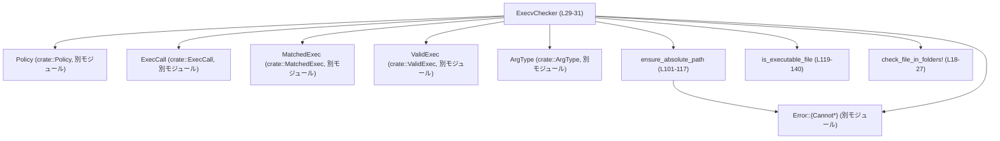

# execpolicy-legacy/src/execv_checker.rs

## 0. ざっくり一言

- 実行ポリシーに基づき `exec` 呼び出しを検証し、  
  「ファイル引数が許可されたディレクトリ配下にあるか」を確認したうえで、実際に使うプログラムパス文字列を決定するモジュールです（`ExecvChecker`）。  
  （根拠: `ExecvChecker::check` 実装と戻り値 `Result<String>`、`ArgType` の分岐 `execv_checker.rs:L42-98`）

---

## 1. このモジュールの役割

### 1.1 概要

- このモジュールは **exec 呼び出しの安全性検査** を行うために存在し、次の機能を提供します。
  - `Policy` による `ExecCall` のマッチング（安全に実行してよいかどうかの判定）  
    （`ExecvChecker::r#match` が `self.execv_policy.check(exec_call)` を委譲 `execv_checker.rs:L38-40`）
  - マッチ済みの `ValidExec` に含まれる **読み取り／書き込みファイル引数が、許可されたフォルダ配下かどうかのチェック**  
    （`ArgType::ReadableFile` / `WriteableFile` 分岐 `execv_checker.rs:L62-78`）
  - システムパス候補から実際の実行ファイルを選び、最終的な **プログラムパス文字列** を返す  
    （`valid_exec.program` / `valid_exec.system_path` から `program: String` を決定 `execv_checker.rs:L89-97`）

### 1.2 アーキテクチャ内での位置づけ

- 依存関係の概要は次の通りです。



- `ExecvChecker` はポリシー（`Policy`）の上に立つ「ファサード」として機能し、  
  `r#match` でポリシーによるマッチング、`check` でファイルパスレベルの追加検証を行います。

### 1.3 設計上のポイント

- 状態管理
  - `ExecvChecker` は `Policy` を 1 フィールドとして保持するのみで、その他の内部状態は持ちません（`execv_checker.rs:L29-31`）。
  - すべてのメソッドは `&self` を取り、副作用はファイルシステムのメタデータ参照のみに限定されています。
- エラーハンドリング
  - すべての失敗は `crate::Result`（カスタム `Error` 型）で表現され、`?` 演算子で伝播されています（例: `ensure_absolute_path` 呼び出し `execv_checker.rs:L64-65,L72-73`）。
  - ファイルパスの検査に失敗した場合には、`ReadablePathNotInReadableFolders` / `WriteablePathNotInWriteableFolders` / `CannotCheckRelativePath` / `CannotCanonicalizePath` といった **明示的なエラー variant** が使われます（`execv_checker.rs:L7-10,L101-117`）。
- セキュリティ方針
  - 呼び出し元から渡される「許可フォルダ」を基準とし、実際の引数パスがその配下かどうかを `Path::starts_with` で検証する設計になっています（`check_file_in_folders!` マクロ `execv_checker.rs:L18-25`）。
  - 絶対パス化・正規化は `path_absolutize` クレートで行い、相対パスによるディレクトリトラバーサルの影響を抑えています（`execv_checker.rs:L16,L101-110`）。
- 並行性
  - このファイル内ではスレッド・非同期処理に関するコードはなく、`ExecvChecker` 自体は `&self` だけを使用するため、  
    `Policy` がスレッドセーフならば `ExecvChecker` も共有しやすい構造です（ただし `Policy` の実装はこのチャンクには現れません）。

---

## 2. 主要な機能一覧

- exec 呼び出しのポリシーマッチング: `ExecvChecker::r#match` により `ExecCall` を `MatchedExec` へ検査・変換する（`execv_checker.rs:L38-40`）
- ファイル引数のフォルダ制約チェックと実行パス決定: `ExecvChecker::check` により `ValidExec` を検査し、最終的なプログラムパス `String` を返す（`execv_checker.rs:L42-98`）
- パスの絶対化・正規化: `ensure_absolute_path` により相対パスを `cwd` 基準で正規化し、`PathBuf` として返す（`execv_checker.rs:L101-117`）
- 実行可能ファイルの判定: `is_executable_file` により、与えられたパスが実行可能なファイルかどうかを OS ごとに判定する（`execv_checker.rs:L119-140`）

---

## 3. 公開 API と詳細解説

### 3.1 型一覧（構造体・列挙体など）

| 名前 | 種別 | 役割 / 用途 | 定義位置 |
|------|------|-------------|----------|
| `ExecvChecker` | 構造体 | `Policy` を保持し、`ExecCall` / `ValidExec` に対する検証・プログラムパス決定を行うファサード | `execv_checker.rs:L29-31` |

※ `Policy`, `ExecCall`, `MatchedExec`, `ValidExec`, `ArgType`, `Error` はすべて `crate::...` として参照されており、このチャンクには定義が現れません。

---

### 3.2 関数詳細

#### `ExecvChecker::check(&self, valid_exec: ValidExec, cwd: &Option<OsString>, readable_folders: &[PathBuf], writeable_folders: &[PathBuf]) -> Result<String>`

**定義位置**

- `execv_checker.rs:L42-98`

**概要**

- ポリシーにより一度検証された `ValidExec` について、
  - 読み取りファイル／書き込みファイル引数がそれぞれ許可フォルダ配下にあるかを検査し、
  - システムパス候補の中から実際に存在する（／実行可能な）プログラムパスを決定して `String` として返します。
- 失敗した場合は、原因に応じた `Error` variant を含む `Err` を返します。

**引数**

| 引数名 | 型 | 説明 |
|--------|----|------|
| `valid_exec` | `ValidExec` | 事前に `Policy` によって検証済みの exec 呼び出し情報。`program`, `args`, `opts`, `system_path` フィールドを使用します（`execv_checker.rs:L51-60,L89-90`）。所有権ごと消費されます。 |
| `cwd` | `&Option<OsString>` | 相対パスを絶対パスに直す際のカレントディレクトリ。`None` の場合、相対パス引数はエラーになります（`execv_checker.rs:L47,L103-107`）。 |
| `readable_folders` | `&[PathBuf]` | 読み取り可能と許可されたフォルダ（絶対・正規化済みであることが前提）。`ReadableFile` 引数がこのいずれかの配下かどうかを検査します（`execv_checker.rs:L42-43,L64-69`）。 |
| `writeable_folders` | `&[PathBuf]` | 書き込み可能と許可されたフォルダ（同じく正規化済みを前提）。`WriteableFile` 引数について検査します（`execv_checker.rs:L42-43,L72-77`）。 |

**戻り値**

- `Result<String>`:
  - `Ok(program_path)`:
    - `valid_exec.system_path` の中から最初に「実行可能」と判定されたパス、または候補が無ければ `valid_exec.program` を `String` 化したもの（`execv_checker.rs:L89-97`）。
  - `Err(e)`:
    - パスが許可フォルダ外、または絶対パス化に失敗／相対パスなのに `cwd` がない場合など、各種検査に失敗したときのエラー。

**内部処理の流れ（アルゴリズム）**

1. `valid_exec.args` と `valid_exec.opts` の双方から `(ArgType, value)` のペアを作り、1 つのイテレータにまとめてループします（`execv_checker.rs:L51-60`）。
2. 各ペアについて `arg_type` に応じて分岐します（`execv_checker.rs:L62-86`）。
   - `ArgType::ReadableFile`:
     1. `ensure_absolute_path(&value, cwd)?` で絶対パス化・正規化を行う（`execv_checker.rs:L64-65`）。
     2. `check_file_in_folders!` マクロで `readable_folders` のいずれかを prefix に持つか確認し、そうでなければ `ReadablePathNotInReadableFolders` エラーで早期 return（`execv_checker.rs:L65-69,L18-25`）。
   - `ArgType::WriteableFile`:
     1. 同様に絶対パス化（`execv_checker.rs:L72-73,L101-110`）。
     2. `writeable_folders` に含まれるどれかの配下でなければ `WriteablePathNotInWriteableFolders`（`execv_checker.rs:L73-77`）。
   - それ以外 (`OpaqueNonFile`, `Unknown`, `PositiveInteger`, `SedCommand`, `Literal(_)`) はチェック対象外としてスキップ（`execv_checker.rs:L79-85`）。
3. すべての引数検査が完了したら、プログラムパスを決定します（`execv_checker.rs:L89-95`）。
   - 初期値として `valid_exec.program.to_string()` を `program` に入れる（`execv_checker.rs:L89`）。
   - `valid_exec.system_path` を先頭から走査し、
     - `is_executable_file(&system_path)` が `true` となる最初のエントリを見つけたら、それを `program` に代入してループを抜ける（`execv_checker.rs:L90-93,L119-129`）。
4. 最終的な `program` を `Ok(program)` で返します（`execv_checker.rs:L97`）。

**Examples（使用例）**

テストコードを単純化した使用例です（`execv_checker.rs:L199-241` を元にしています）。

```rust
use std::path::PathBuf;
use std::ffi::OsString;
use crate::{ExecvChecker, ExecCall, MatchedExec, PolicyParser, ArgType, ValidExec};

// 事前にポリシーを読み込んで ExecvChecker を構築する
let policy_source = r#"
define_program(
  program="cp",
  args=[ARG_RFILE, ARG_WFILE],
  system_path=["/usr/bin/cp"]
)
"#;
let parser = PolicyParser::new("#example", policy_source);
let policy = parser.parse().unwrap();                   // ポリシー構築
let checker = ExecvChecker::new(policy);                // ExecvChecker の生成

// 実際の exec 呼び出し
let exec_call = ExecCall {
    program: "cp".into(),
    args: vec!["/data/source".into(), "/data/dest".into()],
};

// まずポリシーに照らしてマッチング
let valid_exec = match checker.r#match(&exec_call)? {
    MatchedExec::Match { exec } => exec,
    other => panic!("unexpected exec: {:?}", other),
};

// 許可フォルダ（ここでは /data/ のみ許可とする）
let root = PathBuf::from("/data");
let cwd = Some(OsString::from("/"));                   // 相対パスが来た時の基準。ここでは未使用

// check でファイルパスと実行パスを検証
let program_path = checker.check(
    valid_exec,
    &cwd,
    std::slice::from_ref(&root),   // readable_folders
    std::slice::from_ref(&root),   // writeable_folders
)?;

// program_path は /usr/bin/cp などの絶対パスになる想定
println!("will exec: {}", program_path);
```

**Errors / Panics**

- `Err(ReadablePathNotInReadableFolders)`  
  - `ArgType::ReadableFile` のパスが `readable_folders` のいずれの prefix にも一致しないとき（`execv_checker.rs:L64-69`）。
- `Err(WriteablePathNotInWriteableFolders)`  
  - `ArgType::WriteableFile` のパスが `writeable_folders` のいずれにも一致しないとき（`execv_checker.rs:L72-77`）。
- `Err(CannotCheckRelativePath { .. })`  
  - 引数が相対パスで、かつ `cwd` が `None` のとき。`ensure_absolute_path` 内で返されます（`execv_checker.rs:L101-107`）。
- `Err(CannotCanonicalizePath { .. })`  
  - `path_absolutize` による絶対パス化・正規化が失敗したとき（`execv_checker.rs:L111-116`）。
- `panic!` はこの関数自体からは発生しません（`unwrap` や `expect` は使用していません）。

**Edge cases（エッジケース）**

- `readable_folders` / `writeable_folders` が空
  - いずれかが空で対応するファイル引数が存在すると、必ず `*_NotIn*Folders` エラーになります。  
    （テストで `folders: vec![]` が検証されています `execv_checker.rs:L209-216,L218-230`）
- フォルダそのものが引数として渡される場合
  - 引数パスが許可フォルダと完全に一致する場合でも、`Path::starts_with` は `true` になるため、許可されます。  
    （「Args are the readable and writeable folders, not files within the folders.」のテスト `execv_checker.rs:L243-264`）
- 許可フォルダの親ディレクトリを指定した場合
  - たとえ許可フォルダの親でも `starts_with` は `false` になるため、エラーになります。  
    （`execv_checker.rs:L266-291` のテストケース）
- `system_path` に有効な実行ファイルが一つもない場合
  - `is_executable_file` が一度も `true` を返さなければ、元の `valid_exec.program.to_string()` がそのまま返されます（`execv_checker.rs:L89-97`）。
- `cwd` が `Some` でも、`value` が絶対パスであれば `cwd` は使われません（`execv_checker.rs:L103-110`）。

**使用上の注意点**

- **前提条件**
  - ドキュメントコメントにある通り、`readable_folders` / `writeable_folders` は **呼び出し元の責任で正規化済み（canonical form）** にしておく必要があります（`execv_checker.rs:L42-43`）。  
    そうでないと `starts_with` による包含判定が期待通りに働かない可能性があります。
- **セキュリティ上の注意**
  - この関数は「引数がどのフォルダ配下か」を検査するだけであり、ファイルの実在や実際のアクセス権限までは検証しません。  
    実際の open や書き込み時に OS レベルのエラー処理が別途必要です（このチャンクにはその処理は現れません）。
  - シンボリックリンクの扱いなど、`path_absolutize` の挙動に依存する部分があります。リンク解決の詳細はこのファイルからは分かりません。
- **並行性**
  - `&self` しか使用しておらず、外部状態に書き込まないため、この関数自体はスレッドから安全に並列呼び出しできる設計です。  
    ただし `Policy` のスレッドセーフ性はこのチャンクでは不明です。
- **パフォーマンス**
  - 引数の数に比例して `ensure_absolute_path` と `starts_with` チェックが実行されます。  
    通常のコマンドライン程度の引数数であれば問題になりにくいですが、非常に大量の引数を扱う場合はコストになります。

---

#### `ExecvChecker::r#match(&self, exec_call: &ExecCall) -> Result<MatchedExec>`

**定義位置**

- `execv_checker.rs:L38-40`

**概要**

- `ExecCall` を `Policy` に渡して検査し、その結果である `MatchedExec` を返す薄いラッパーです。  
  中身は `self.execv_policy.check(exec_call)` の一行のみです。

**引数**

| 引数名 | 型 | 説明 |
|--------|----|------|
| `exec_call` | `&ExecCall` | 実行しようとしているプログラム名と引数を表す構造体。構造の詳細はこのチャンクには現れません。 |

**戻り値**

- `Result<MatchedExec>`:  
  `Policy::check` の戻り値をそのまま返します（`execv_checker.rs:L38-40`）。

**内部処理の流れ**

1. `self.execv_policy.check(exec_call)` を呼び、その結果をそのまま返す（`execv_checker.rs:L39`）。

**Examples（使用例）**

テスト中での利用例（簡略化）です（`execv_checker.rs:L199-207`）。

```rust
let checker = setup(&fake_cp);                    // Policy を含む ExecvChecker を構築
let exec_call = ExecCall {
    program: "cp".into(),
    args: vec![source, dest.clone()],
};

let valid_exec = match checker.r#match(&exec_call)? {
    MatchedExec::Match { exec } => exec,         // 成功した exec 定義を取り出す
    unexpected => panic!("Expected a safe exec but got {:?}", unexpected),
};
```

**Errors / Panics**

- エラー／パニックの条件は `Policy::check` の実装に依存します（このチャンクには現れません）。

**使用上の注意点**

- この関数はポリシーエンジンのインターフェースを隠蔽する役割のみであり、  
  どのような `ExecCall` が `MatchedExec::Match` になるかといったポリシー内容は、別モジュール（`Policy`）側の仕様に従います。

---

#### `ExecvChecker::new(execv_policy: Policy) -> Self`

**定義位置**

- `execv_checker.rs:L34-36`

**概要**

- `Policy` を受け取り、それを内部に保持する `ExecvChecker` を生成します。

**引数**

| 引数名 | 型 | 説明 |
|--------|----|------|
| `execv_policy` | `Policy` | exec 検査ポリシー。所有権は `ExecvChecker` に移動します。 |

**戻り値**

- `ExecvChecker` インスタンス（`Self { execv_policy }` で初期化 `execv_checker.rs:L35`）。

**内部処理の流れ**

1. フィールド初期化構文で `execv_policy` をそのまま格納し、構造体を返すだけです。

---

#### `ensure_absolute_path(path: &str, cwd: &Option<OsString>) -> Result<PathBuf>`

**定義位置**

- `execv_checker.rs:L101-117`

**概要**

- 文字列パスを `PathBuf` に変換し、必要に応じて `path_absolutize` を使って絶対パス・正規化済みの `PathBuf` を返します。
- 相対パスで `cwd` が指定されていない場合や、絶対化そのものに失敗した場合はカスタムエラーを返します。

**引数**

| 引数名 | 型 | 説明 |
|--------|----|------|
| `path` | `&str` | 入力のパス文字列。相対・絶対どちらも可です（`execv_checker.rs:L101-103`）。 |
| `cwd` | `&Option<OsString>` | 相対パス時の基準ディレクトリ。`None` の場合は相対パスを扱えません（`execv_checker.rs:L103-107`）。 |

**戻り値**

- `Result<PathBuf>`:
  - `Ok(abs_path)`:
    - 絶対化・正規化に成功した `PathBuf`（`execv_checker.rs:L111-112`）。
  - `Err(CannotCheckRelativePath { .. })`:
    - `file.is_relative()` かつ `cwd` が `None` のとき（`execv_checker.rs:L103-107`）。
  - `Err(CannotCanonicalizePath { .. })`:
    - `absolutize` / `absolutize_from` がエラーを返したとき（`execv_checker.rs:L111-116`）。

**内部処理の流れ**

1. `PathBuf::from(path)` で `file` を生成（`execv_checker.rs:L102`）。
2. `file.is_relative()` かどうかで分岐（`execv_checker.rs:L103`）。
   - 相対パスの場合:
     - `cwd` が `Some(cwd)` なら `file.absolutize_from(cwd)` を呼ぶ（`execv_checker.rs:L105`）。
     - `cwd` が `None` なら `Err(CannotCheckRelativePath { file })` を即座に返す（`execv_checker.rs:L106-107`）。
   - 絶対パスの場合:
     - `file.absolutize()` を呼ぶ（`execv_checker.rs:L109`）。
3. `absolutize*` の戻り値（`Result<Cow<Path>>` を想定）を
   - `.map(Cow::into_owned)` で `PathBuf` に変換し、
   - `.map_err(|error| CannotCanonicalizePath { .. })` でカスタムエラーに変換（`execv_checker.rs:L111-116`）。

**使用上の注意点**

- 呼び出し元で `cwd` を `Some` にしておけば、相対パスを許容できますが、その `cwd` 自体が正しい絶対パスであることが前提です。
- エラー内容として `CannotCanonicalizePath` の `file` には元の文字列 `path.to_string()` が入るのに対し、  
  `CannotCheckRelativePath` の `file` には `PathBuf` がそのまま渡されています（`execv_checker.rs:L106,L114`）。  
  これはログ出力などの際に区別できる情報になります。

---

#### `is_executable_file(path: &str) -> bool`

**定義位置**

- `execv_checker.rs:L119-140`

**概要**

- 与えられたファイルパスが「実行可能なファイル」とみなせるかどうかを、OS ごとに異なる方法で判定します。
- `ExecvChecker::check` の中で、`valid_exec.system_path` の候補選別に利用されます（`execv_checker.rs:L90-92`）。

**引数**

| 引数名 | 型 | 説明 |
|--------|----|------|
| `path` | `&str` | 判定対象ファイルのパス文字列（`execv_checker.rs:L119-120`）。 |

**戻り値**

- `bool`:
  - `true` なら「実行可能なファイル」と見なす。
  - `false` なら実行不可、もしくはファイルが存在しない。

**内部処理の流れ**

1. `Path::new(path)` から `file_path` を作成（`execv_checker.rs:L120`）。
2. `std::fs::metadata(file_path)` に成功した場合のみ、プラットフォーム別に判定（`execv_checker.rs:L122-137`）。
   - Unix (`#[cfg(unix)]`):
     - `metadata.is_file()` かつ `permissions.mode() & 0o111 != 0` のときに `true` を返す（`execv_checker.rs:L125-129`）。
     - これはオーナー・グループ・その他のどれかに実行ビットが立っていることを意味します。
   - Windows (`#[cfg(windows)]`):
     - 現在は `metadata.is_file()` であれば `true` を返すだけで、拡張子や実行権限は考慮していません（`execv_checker.rs:L132-136`）。
     - `TODO` コメントで `PATHEXT` 環境変数に基づく判定が未実装であることが示されています（`execv_checker.rs:L134`）。
3. `metadata` の取得に失敗した場合は何も返さずに `false` となります（`execv_checker.rs:L122,L138-139`）。

**Edge cases / セキュリティ上の注意**

- Unix では
  - ディレクトリは `metadata.is_file()` が `false` のため、`false` になります。
  - 実行ビットは「現在のユーザに対して実行可能か」まではチェックしていません（owner/group/other のいずれかにビットが立てば `true`）。
- Windows では
  - 現状、**存在するファイルであれば全て実行可能とみなされます**（`execv_checker.rs:L132-136`）。  
    これはセキュリティ的には緩い判定であり、`PATHEXT` を使った拡張子チェックなどが今後必要とされていることがコメントから分かります。
- いずれの OS でも、メタデータ取得に失敗した場合は単に `false` を返すため、  
  存在しないファイルは `ExecvChecker::check` の `system_path` 候補として採用されません（`execv_checker.rs:L90-95`）。

---

### 3.3 その他の関数・マクロ・テスト（コンポーネントインベントリー）

このファイルに定義されている主なコンポーネント一覧です。

| 名前 | 種別 | 役割（1 行） | 定義位置 |
|------|------|--------------|----------|
| `check_file_in_folders!` | マクロ | パスが許可フォルダ配下かを `starts_with` でチェックし、外れていれば指定のエラー型で即座に `Err` を返す | `execv_checker.rs:L18-27` |
| `ExecvChecker` | 構造体 | `Policy` を保持し、exec 検査ロジックを提供する | `execv_checker.rs:L29-31` |
| `ExecvChecker::new` | メソッド | `Policy` を受け取り `ExecvChecker` を生成する | `execv_checker.rs:L34-36` |
| `ExecvChecker::r#match` | メソッド | `Policy::check` を呼び出して `ExecCall` を検査する | `execv_checker.rs:L38-40` |
| `ExecvChecker::check` | メソッド | ファイル引数と実行パスの検査・決定を行うコアロジック | `execv_checker.rs:L42-98` |
| `ensure_absolute_path` | 関数 | パスを `cwd` を基準に絶対・正規化し `PathBuf` を返す | `execv_checker.rs:L101-117` |
| `is_executable_file` | 関数 | OS 依存の方法でファイルが実行可能かを判定する | `execv_checker.rs:L119-140` |
| `tests::setup` | テスト用関数 | テスト用のポリシーと `ExecvChecker` を生成するヘルパー | `execv_checker.rs:L152-165` |
| `tests::test_check_valid_input_files` | テスト関数 | `check` の正常系／異常系を一連のシナリオで検証する | `execv_checker.rs:L167-294` |

---

## 4. データフロー

代表的なシナリオとして、`ExecCall` から最終的なプログラムパスが決定されるまでの流れを示します。

### フローの概要

1. 呼び出し側が `ExecCall` を構築し、`ExecvChecker::r#match` に渡す（`execv_checker.rs:L199-207`）。
2. `Policy::check` により、ポリシーに合致した場合は `MatchedExec::Match { exec: ValidExec }` が返される（`execv_checker.rs:L38-40`）。
3. 呼び出し側は `ValidExec` を `ExecvChecker::check` に渡し、ファイル引数とプログラムパスの検査を行う（`execv_checker.rs:L42-98,L209-241`）。
4. `check` 内で `ensure_absolute_path` と `check_file_in_folders!` により引数パスを検証し、最後に `is_executable_file` により `system_path` から実行ファイルを選ぶ。

### シーケンス図（`r#match` と `check` の流れ）

```mermaid
sequenceDiagram
    %% この図は execv_checker.rs:L38-40 および L42-98 を対象としています
    participant Caller as 呼び出し側
    participant EC as ExecvChecker
    participant Pol as Policy
    participant EAP as ensure_absolute_path
    participant IEF as is_executable_file

    Caller->>EC: r#match(&ExecCall) (L38-40)
    EC->>Pol: check(exec_call)
    Pol-->>EC: Result<MatchedExec>
    EC-->>Caller: Result<MatchedExec>

    Caller->>EC: check(valid_exec, &cwd, readable, writeable) (L42-50)

    loop 各引数 (args + opts) (L51-61)
        EC->>EAP: ensure_absolute_path(&value, &cwd) (L64-65,72-73,101-110)
        EAP-->>EC: Result<PathBuf>
        alt ReadableFile / WriteableFile
            EC->>EC: check_file_in_folders! (L18-27,66-69,73-77)
            EC-->>Caller: Err(...) (フォルダ外なら) (L20-24)
        else その他の ArgType
            EC->>EC: continue (L79-85)
        end
    end

    EC->>EC: program = valid_exec.program.to_string() (L89)
    loop system_path 候補 (L90-95)
        EC->>IEF: is_executable_file(&system_path) (L90-92,119-140)
        IEF-->>EC: bool
        alt true
            EC->>EC: program = system_path; break (L91-93)
        end
    end
    EC-->>Caller: Ok(program: String) (L97)
```

---

## 5. 使い方（How to Use）

### 5.1 基本的な使用方法

テストコード（`execv_checker.rs:L152-165,L167-241`）を基にした、典型的な利用フローです。

```rust
use std::ffi::OsString;
use std::path::PathBuf;

use crate::{
    ExecCall, ExecvChecker, MatchedExec, PolicyParser,
    ArgType, MatchedArg, ValidExec,
};

fn main() -> anyhow::Result<()> {
    // 1. ポリシーをパースして ExecvChecker を作る
    let source = r#"
define_program(
  program="cp",
  args=[ARG_RFILE, ARG_WFILE],
  system_path=["/usr/local/bin/cp"]
)
"#;
    let parser = PolicyParser::new("#example", source);   // ポリシー定義文字列をパースするパーサ
    let policy = parser.parse()?;                        // Policy を構築
    let checker = ExecvChecker::new(policy);             // ExecvChecker を生成

    // 2. 実際の exec 呼び出しを表現する
    let exec_call = ExecCall {
        program: "cp".into(),                            // 実行したいコマンド名
        args: vec![
            "/data/source".into(),                       // 読み取りファイル
            "/data/dest".into(),                         // 書き込みファイル
        ],
    };

    // 3. ポリシーに照らしてマッチング（構文・引数数などの検査）
    let valid_exec = match checker.r#match(&exec_call)? {
        MatchedExec::Match { exec } => exec,             // 実行してよいコマンド
        other => anyhow::bail!("not allowed: {:?}", other),
    };

    // 4. 許可フォルダを決める（canonical form にするのは呼び出し側の責任）
    let root = PathBuf::from("/data");
    let cwd = Some(OsString::from("/"));                 // 相対パスが来たときの基準

    // 5. ファイルパスと実行パスをチェック
    let program_path = checker.check(
        valid_exec,
        &cwd,
        std::slice::from_ref(&root),                     // readable_folders
        std::slice::from_ref(&root),                     // writeable_folders
    )?;

    println!("exec: {}", program_path);                  // 例: "/usr/local/bin/cp"
    Ok(())
}
```

### 5.2 よくある使用パターン

- **1 回のマッチ結果を複数のポリシー条件でチェックしたい**
  - `check` は `ValidExec` を消費するため、同じ `ValidExec` を複数回使うには `Clone`（テストから `valid_exec.clone()` が使われていることが分かる `execv_checker.rs:L210-235`）が必要です。
  - 例:

    ```rust
    let valid_exec = /* ... */;

    let result1 = checker.check(valid_exec.clone(), &cwd, &readable_set1, &writeable_set1);
    let result2 = checker.check(valid_exec,         &cwd, &readable_set2, &writeable_set2);
    ```

- **カレントディレクトリを使った相対パスの許可**
  - `cwd` に `Some(std::env::current_dir()?)` を渡すことで、引数が相対パスでも `ensure_absolute_path` が正しく絶対化できます。
  - `cwd = None` の場合、相対パス引数は `CannotCheckRelativePath` で拒否されます（`execv_checker.rs:L103-107`）。

- **ディレクトリ自体を引数として扱う**
  - テストの「Args are the readable and writeable folders」（`execv_checker.rs:L243-264`）から、  
    許可フォルダそのものを `ReadableFile` / `WriteableFile` として扱う設計も可能であることが分かります。

### 5.3 よくある間違い

```rust
// 間違い例: 許可フォルダを canonical form にせず渡してしまう
let readable = vec![PathBuf::from("data")];     // 相対パス＆正規化されていない
let cwd = Some(OsString::from("/home/user"));
let result = checker.check(valid_exec, &cwd, &readable, &readable);
// "data" が実際には "/home/user/data" を指すのか、`starts_with` の判定が期待とずれる可能性がある

// 正しい例: 許可フォルダも絶対パスかつ正規化する
let root = PathBuf::from("/home/user/data").canonicalize()?;  // call-site で正規化
let result = checker.check(
    valid_exec,
    &cwd,
    std::slice::from_ref(&root),
    std::slice::from_ref(&root),
);
```

```rust
// 間違い例: 相対パスなのに cwd を None にしている
let cwd = None;
let exec_call = ExecCall {
    program: "cp".into(),
    args: vec!["source".into(), "dest".into()],  // 相対パス
};
let valid_exec = /* checker.r#match(...) */;
// ここで CannotCheckRelativePath エラーになる
let result = checker.check(valid_exec, &cwd, &[], &[]);

// 正しい例: cwd を設定する
let cwd = Some(std::env::current_dir()?.into());
let result = checker.check(valid_exec, &cwd, &[], &[]);
```

### 5.4 使用上の注意点（まとめ）

- **許可フォルダは絶対・正規化済みであることが前提**（`execv_checker.rs:L42-43`）。
- **相対パス引数を許可するには `cwd` を必ず `Some` にする必要**があります（`execv_checker.rs:L103-107`）。
- **`check` はファイルの存在・アクセス権を保証しません**。場所だけを検証するため、その後の I/O で `ENOENT` やパーミッションエラーが起き得ます。
- **Windows 上では `is_executable_file` が緩い判定**である点に注意が必要です（全ての既存ファイルを実行可能と見なす、`execv_checker.rs:L132-136`）。
- このモジュールからログ出力やメトリクスなどの「観測性」を提供するコードは一切ありません。  
  どのパスが弾かれたかを追跡したい場合は、呼び出し側で `Error` をログに記録する必要があります。

---

## 6. 変更の仕方（How to Modify）

### 6.1 新しい機能を追加する場合

例: 新しい `ArgType` を追加し、そのパスも特定のフォルダ配下に制限したい場合。

1. **`ArgType` 側の定義追加**  
   - `ArgType` 列挙体は別モジュールに定義されているため、そちらに新 variant を追加します（このチャンクには現れません）。
2. **`ExecvChecker::check` の `match arg_type` を拡張**  
   - 新しい `ArgType::Xxx` に対応する分岐を追加し、必要なら新しい許可フォルダ引数を `check` のシグネチャに追加するか、既存フォルダ群を再利用します（`execv_checker.rs:L62-86`）。
3. **エラー型の追加・利用**  
   - 許可フォルダ外を検出するエラー variant を `crate::Error` に追加し、`check_file_in_folders!` マクロから利用できるようにします（`execv_checker.rs:L18-25`）。
4. **テストの追加**  
   - 既存の `test_check_valid_input_files` と同様のスタイルで、新しい `ArgType` 用のテストケースを追加します（`execv_checker.rs:L167-294`）。

### 6.2 既存の機能を変更する場合

- **`is_executable_file` の判定ロジックを変えたい場合**
  - Windows で `PATHEXT` を用いた厳密な判定を追加するなどの変更は、`is_executable_file` 内の `#[cfg(windows)]` ブロックを編集する形になります（`execv_checker.rs:L132-136`）。
  - その際、`ExecvChecker::check` の動作（どの `system_path` が採用されるか）にも影響するため、既存テストが通るかを確認する必要があります（`execv_checker.rs:L90-95,L171-185`）。
- **フォルダチェックの仕様変更**
  - `check_file_in_folders!` マクロに手を入れると、`ReadableFile`／`WriteableFile` 両方に影響します（`execv_checker.rs:L18-27,L64-77`）。  
    prefix ではなく、より厳密な条件（例えば実際のファイルの存在やパーミッション）を追加する場合はここが入口です。
- **エラー契約の維持**
  - テストは特定のエラー variant と `file` / `folders` フィールドの内容まで `assert_eq!` で比較しています（`execv_checker.rs:L209-216,L218-230,L281-291`）。
  - エラー型のフィールドや意味を変更する場合は、テストコードも合わせて更新する必要があります。

---

## 7. 関連ファイル

このモジュールと密接に関係する型はすべて `crate::...` として参照されており、具体的なファイルパスはこのチャンクには現れません。  
ここではモジュールパスレベルで整理します。

| パス / 型 | 役割 / 関係 |
|----------|------------|
| `crate::Policy` | 実行ポリシーを表す型。`ExecvChecker` が保持し、`r#match` で `Policy::check` を呼び出します（`execv_checker.rs:L29-30,L38-40`）。 |
| `crate::ExecCall` | 生の exec 呼び出し（プログラム名と引数）を表す型。`r#match` の入力、テストで構築されています（`execv_checker.rs:L11,L199-203,L245-248`）。 |
| `crate::MatchedExec` | `Policy` によるマッチング結果。`MatchedExec::Match { exec: ValidExec }` を `ExecvChecker::check` に渡します（`execv_checker.rs:L12,L204-207,L249-254`）。 |
| `crate::ValidExec` | マッチ済みで安全と判定された exec 情報。`check` のコア入力として使われます（`execv_checker.rs:L15,L46,L267-280`）。 |
| `crate::ArgType` | 引数の意味（ReadableFile など）を表す列挙体。`check` 内の分岐に使用されます（`execv_checker.rs:L6,L62-83,L271-273,L276`）。 |
| `crate::Error` | `CannotCanonicalizePath` / `CannotCheckRelativePath` / `ReadablePathNotInReadableFolders` / `WriteablePathNotInWriteableFolders` などのエラー型を含む列挙体（`execv_checker.rs:L7-10,L106,L114,L212-215,L226-229,L288-291`）。 |
| `crate::PolicyParser` | ポリシー定義文字列を `Policy` に変換するパーサ。テストで `setup` 関数内から使用されています（`execv_checker.rs:L148,L152-165`）。 |
| `crate::MatchedArg` | `ValidExec` 内で使われる、型付き引数の表現。最後のテストケースで手動構築に使われています（`execv_checker.rs:L147,L267-278`）。 |

これらの型の実装詳細はこのファイルには含まれていないため、挙動のさらなる理解には対応するモジュールのコード（このチャンクには現れない）を参照する必要があります。
