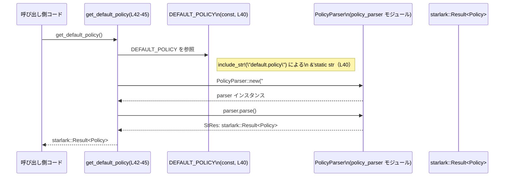

# execpolicy-legacy/src/lib.rs コード解説

## 0. ざっくり一言

このファイルは `execpolicy-legacy` クレートのルートモジュールで、内部サブモジュールを宣言して公開 API として再エクスポートしつつ、同梱された `default.policy` をパースして `Policy` を生成する `get_default_policy` 関数を提供しています（根拠: `execpolicy-legacy/src/lib.rs:L6-17, L19-38, L40-45`）。

---

## 1. このモジュールの役割

### 1.1 概要

- このモジュールは、ポリシー関連・exec 呼び出し関連・引数マッチング関連のサブモジュールを 1 箇所に集約し、クレート外から使いやすいように再エクスポートする役割を持ちます（根拠: `pub use` 群 `L19-38`）。
- また、ビルド時に埋め込まれた `default.policy` の内容を `PolicyParser` でパースし、`Policy` 型として取得するための `get_default_policy` 関数を提供します（根拠: `L40-45`）。

### 1.2 アーキテクチャ内での位置づけ

このファイルはクレートのエントリーポイントとして、外部クレート `starlark` と複数の内部モジュールを仲介します（根拠: `extern crate starlark; L3-4`, `mod` 群 `L6-17`）。

```mermaid
%% この図は execpolicy-legacy/src/lib.rs (L1-45) から読み取れる依存関係を要約しています
graph LR
    Lib["lib.rs（本ファイル）"]

    ArgMods["arg_* 系モジュール\n(arg_matcher, arg_resolver, arg_type)"]
    ExecMods["exec_* 系モジュール\n(exec_call, execv_checker, valid_exec)"]
    PolicyMods["ポリシー関連モジュール\n(policy, policy_parser, program)"]
    SedMod["sed_command モジュール"]
    Starlark["外部クレート starlark"]
    DefaultPolicy["const DEFAULT_POLICY\n(include_str!(\"default.policy\"))"]
    GetDefault["fn get_default_policy\n(L42-45)"]

    Lib --> ArgMods
    Lib --> ExecMods
    Lib --> PolicyMods
    Lib --> SedMod
    Lib --> Starlark
    Lib --> DefaultPolicy
    Lib --> GetDefault

    GetDefault --> PolicyMods
    GetDefault --> Starlark
    GetDefault --> DefaultPolicy
```

### 1.3 設計上のポイント

- **Clippy の一部 lint を全体で無効化**  
  クレート全体に対して `type_complexity` と `too_many_arguments` の lint を許可しています（根拠: `#![allow(clippy::type_complexity)]`, `#![allow(clippy::too_many_arguments)] L1-2`）。  
  これは「複雑な型」や「引数の多い関数」が存在する設計であることを示唆しますが、具体例はこのチャンクには現れません。

- **マクロの一括インポート**  
  `#[macro_use] extern crate starlark;` により、`starlark` クレート由来のマクロをクレート全体で直接利用できるようにしています（根拠: `L3-4`）。  
  Rust では古いスタイルのマクロインポート方法であり、他モジュールで `starlark` のマクロが使われていると考えられますが、このチャンクには現れません。

- **再エクスポートによる API 集約**  
  全てのサブモジュールは `mod` 宣言のみで、このファイルから `pub use` されており、利用者は `execpolicy-legacy` クレートのトップレベルから主な型・関数にアクセスできます（根拠: `L6-17`, `L19-38`）。

- **組み込みデフォルトポリシー**  
  `include_str!("default.policy")` により、`default.policy` ファイルの中身をビルド時にバイナリへ埋め込む設計になっています（根拠: `L40`）。  
  これにより、実行時に外部ファイルを読むことなく、デフォルトのポリシーを `get_default_policy` で取得できます（根拠: `L42-45`）。

- **安全性 / 並行性の観点（このファイルに限った話）**  
  - このファイル内には `unsafe` ブロックは存在しません（全行確認: `L1-45`）。
  - `get_default_policy` はグローバルな可変状態を扱わず、`DEFAULT_POLICY` は読み取り専用の `&'static str` 定数です（根拠: `const DEFAULT_POLICY: &str = ... L40`, `get_default_policy L42-45`）。  
    そのため、この関数自体はスレッド間で同時に呼び出しても、少なくともこのチャンクから見える範囲ではデータ競合の要素を含みません。  
    ただし、最終的なスレッド安全性は `PolicyParser` と `starlark` の実装に依存し、このチャンクからは判断できません。

### 1.4 コンポーネント一覧（このファイルのみ）

#### サブモジュール一覧

| モジュール名 | 種別 | 役割 / 用途 | 定義位置 |
|-------------|------|-------------|----------|
| `arg_matcher` | サブモジュール宣言 | 具体的な中身はこのチャンクには現れません。名前からは「引数をマッチングするロジック」を含むモジュールと推測されますが、断定はできません。 | `execpolicy-legacy/src/lib.rs:L6` |
| `arg_resolver` | サブモジュール宣言 | 中身は不明。名前からは「位置引数などを解決する処理」を含む可能性がありますが、コードからは断定できません。 | `L7` |
| `arg_type` | サブモジュール宣言 | 中身は不明。名前からは「引数の型分類」などを扱う可能性があります。 | `L8` |
| `error` | サブモジュール宣言 | エラー型や Result エイリアスを定義している可能性がありますが、このチャンクには定義がありません。 | `L9` |
| `exec_call` | サブモジュール宣言 | 名前からは `exec` 呼び出しを表現する型・ロジックを含む可能性があります。 | `L10` |
| `execv_checker` | サブモジュール宣言 | `execv` 呼び出しの検査ロジックを含む可能性があります。 | `L11` |
| `opt` | サブモジュール宣言 | オプション（コマンドラインオプション）関連の型・ロジックを含む可能性があります。 | `L12` |
| `policy` | サブモジュール宣言 | ポリシー本体（`Policy` 型など）を定義していると推測されます。 | `L13` |
| `policy_parser` | サブモジュール宣言 | ポリシーのパーサ（`PolicyParser`）を定義するモジュールと推測されます。`get_default_policy` から利用されています（根拠: `L28, L42-44`）。 | `L14` |
| `program` | サブモジュール宣言 | 実行プログラム仕様（`ProgramSpec` 等）を定義するモジュールと推測されます。 | `L15` |
| `sed_command` | サブモジュール宣言 | `sed` コマンド解析関連と推測されますが、詳細は不明です。 | `L16` |
| `valid_exec` | サブモジュール宣言 | 有効な exec 呼び出し（`ValidExec` 等）を表現するモジュールと推測されます。 | `L17` |

> 「役割 / 用途」欄の具体的用途は、いずれも命名に基づく推測であり、このチャンクのコードだけでは断定できません。

#### 公開アイテム一覧（再エクスポートと定数・関数）

| 名前 | 種別（このチャンクで分かる範囲） | 出所 | 定義位置（再エクスポート位置） |
|------|----------------------------------|------|--------------------------------|
| `ArgMatcher` | 公開アイテム（詳細種別は不明） | `arg_matcher` モジュールからの再エクスポート | `L19` |
| `PositionalArg` | 公開アイテム（詳細種別は不明） | `arg_resolver` からの再エクスポート | `L20` |
| `ArgType` | 公開アイテム（詳細種別は不明） | `arg_type` からの再エクスポート | `L21` |
| `Error` | 公開アイテム（詳細種別は不明） | `error` からの再エクスポート | `L22` |
| `Result` | 公開アイテム（詳細種別は不明） | `error` からの再エクスポート | `L23` |
| `ExecCall` | 公開アイテム（詳細種別は不明） | `exec_call` からの再エクスポート | `L24` |
| `ExecvChecker` | 公開アイテム（詳細種別は不明） | `execv_checker` からの再エクスポート | `L25` |
| `Opt` | 公開アイテム（詳細種別は不明） | `opt` からの再エクスポート | `L26` |
| `Policy` | 公開アイテム（詳細種別は不明） | `policy` からの再エクスポート | `L27` |
| `PolicyParser` | 公開アイテム（詳細種別は不明） | `policy_parser` からの再エクスポート | `L28` |
| `Forbidden` | 公開アイテム（詳細種別は不明） | `program` からの再エクスポート | `L29` |
| `MatchedExec` | 公開アイテム（詳細種別は不明） | `program` からの再エクスポート | `L30` |
| `NegativeExamplePassedCheck` | 公開アイテム（詳細種別は不明） | `program` からの再エクスポート | `L31` |
| `PositiveExampleFailedCheck` | 公開アイテム（詳細種別は不明） | `program` からの再エクスポート | `L32` |
| `ProgramSpec` | 公開アイテム（詳細種別は不明） | `program` からの再エクスポート | `L33` |
| `parse_sed_command` | 公開アイテム（詳細種別は不明） | `sed_command` からの再エクスポート | `L34` |
| `MatchedArg` | 公開アイテム（詳細種別は不明） | `valid_exec` からの再エクスポート | `L35` |
| `MatchedFlag` | 公開アイテム（詳細種別は不明） | `valid_exec` からの再エクスポート | `L36` |
| `MatchedOpt` | 公開アイテム（詳細種別は不明） | `valid_exec` からの再エクスポート | `L37` |
| `ValidExec` | 公開アイテム（詳細種別は不明） | `valid_exec` からの再エクスポート | `L38` |
| `DEFAULT_POLICY` | `&'static str` 定数 | `include_str!("default.policy")` により埋め込まれる | `L40` |
| `get_default_policy` | 関数 `fn() -> starlark::Result<Policy>` | 本ファイル内で定義 | `L42-45` |

`Result` という名前の公開アイテム（`error` モジュール由来）と、`get_default_policy` の戻り値である `starlark::Result<Policy>` は別物である点が、このファイルから読み取れます（根拠: `L23`, `L42`）。

---

## 2. 主要な機能一覧

このファイル単体から確実に言える主な機能は次のとおりです。

- サブモジュールの公開 API 集約: 各種サブモジュールの主なアイテム（`ArgMatcher`, `Policy`, `ValidExec` など）をクレートルートからアクセス可能にする（根拠: `L19-38`）。
- デフォルトポリシー文字列の埋め込み: `default.policy` ファイルの内容を `&'static str` としてバイナリに埋め込む（根拠: `L40`）。
- デフォルトポリシーのパース: 埋め込んだ `DEFAULT_POLICY` を `PolicyParser` でパースし、`Policy` を返す `get_default_policy` 関数（根拠: `L42-45`）。

その他、モジュール名・アイテム名から以下のような用途が想定されますが、詳細はこのチャンクには現れません。

- 引数マッチング・解決・型分類（`ArgMatcher`, `PositionalArg`, `ArgType`, `Opt`, `Matched*` など）。
- `exec`/`execv` 呼び出しの表現と検査（`ExecCall`, `ExecvChecker`, `ValidExec` など）。
- Starlark ベースのポリシー定義・パース・検査（`Policy`, `PolicyParser`, `ProgramSpec`, `Forbidden` など）。
- `sed` コマンドの解析（`parse_sed_command`）。

これらはあくまで命名規則に基づく推測であり、コード断片からは機能詳細を断定できません。

---

## 3. 公開 API と詳細解説

### 3.1 公開アイテム一覧（型・関数など）

3.1 の表はすでに 1.4 に示したとおりです。  
このファイルには型定義本体や関数本体は `get_default_policy` 以外現れないため、どれが構造体・列挙体・トレイト・関数であるかは、このチャンクからは判別できません。

以降では、このファイルで唯一本体が定義されている `get_default_policy` 関数について詳しく説明します。

### 3.2 `get_default_policy() -> starlark::Result<Policy>`

```rust
pub fn get_default_policy() -> starlark::Result<Policy> {
    let parser = PolicyParser::new("#default", DEFAULT_POLICY);
    parser.parse()
}
```

（根拠: `execpolicy-legacy/src/lib.rs:L42-45`）

#### 概要

- ビルド時に埋め込まれた `DEFAULT_POLICY`（`default.policy` ファイルの内容）を `PolicyParser` でパースし、その結果として `Policy` を返す関数です。
- エラー処理にはこのクレート固有の `Result` ではなく、`starlark::Result<Policy>` を直接使っています（根拠: 戻り値型 `L42`）。

#### 引数

この関数は引数を取りません。

| 引数名 | 型 | 説明 |
|--------|----|------|
| なし | なし | 呼び出し時に外部から値を渡す必要はありません。 |

#### 戻り値

- 型: `starlark::Result<Policy>`（根拠: シグネチャ `L42`）
  - `Ok(Policy)`: `DEFAULT_POLICY` の内容が `PolicyParser` によって正しくパースされた場合。
  - `Err(e)`: パース時に何らかのエラーが起きた場合。エラー型の具体的な型は `starlark` クレート側に依存し、このチャンクからは不明です。

#### 内部処理の流れ（アルゴリズム）

コードから読み取れる処理の流れは次のとおりです（根拠: `L42-44`）。

1. `PolicyParser::new("#default", DEFAULT_POLICY)` を呼び出し、ポリシーパーサのインスタンス `parser` を生成する。
   - 第 1 引数 `"#default"` は、エラー報告などで使用するソース名（ファイル名やラベル）の可能性がありますが、`PolicyParser::new` の実装はこのチャンクには現れません。
   - 第 2 引数 `DEFAULT_POLICY` は `include_str!("default.policy")` 由来の `&'static str` です（根拠: `L40`）。
2. 生成した `parser` に対して `parser.parse()` を呼び出し、パース結果を取得する。
3. `parser.parse()` の戻り値（`starlark::Result<Policy>`）をそのまま呼び出し元に返す。

簡単なフローチャートで表現すると次のようになります。

```mermaid
%% get_default_policy の処理フロー（execpolicy-legacy/src/lib.rs:L42-45）
flowchart TD
    A["get_default_policy 呼び出し"] --> B["PolicyParser::new(\"#default\", DEFAULT_POLICY)"]
    B --> C["parser インスタンス"]
    C --> D["parser.parse()"]
    D --> E["starlark::Result&lt;Policy&gt; を呼び出し元へ返す"]
```

#### Examples（使用例）

以下の例では、同一クレート内から `get_default_policy` を呼び出すことを想定しています。  
（別クレートから利用する場合は、`crate::` を実際のクレート名に置き換える必要があります。）

**例 1: デフォルトポリシーを読み込んでエラーをハンドリングする**

```rust
use crate::get_default_policy; // クレートルートから関数をインポートする
use crate::Policy;             // ポリシー型もクレートルートからインポートする

fn main() {
    // デフォルトポリシーをパースする
    match get_default_policy() {
        Ok(policy) => {
            // 成功した場合: policy は Policy 型
            use_policy(policy); // ポリシーを使った何らかの処理（仮）
        }
        Err(e) => {
            // 失敗した場合: e は starlark 由来のエラー型（詳細はこのチャンクからは不明）
            eprintln!("failed to parse default policy: {e}");
        }
    }
}

// Policy を使う処理の例（仮置き）
fn use_policy(_policy: Policy) {
    // 具体的な利用方法は policy モジュールの設計に依存します
}
```

この例では、`get_default_policy` が返す `starlark::Result<Policy>` を `match` で分岐し、成功と失敗で処理を分けています。

**例 2: 別関数から `?` 演算子で使う（戻り値も starlark::Result を使う場合）**

```rust
use crate::get_default_policy;
use crate::Policy;

// 戻り値も starlark::Result<Policy> に合わせる必要がある
fn load_default_policy() -> starlark::Result<Policy> {
    // ? 演算子でエラーをそのまま呼び出し元に伝搬する
    let policy = get_default_policy()?;
    Ok(policy)
}
```

ここでは、呼び出し側の戻り値も `starlark::Result<Policy>` にすることで、`?` 演算子でエラーを自然に伝搬させています。

#### Errors / Panics

- **Err になる条件**
  - `parser.parse()` が `Err` を返した場合、そのまま呼び出し元に返されます（根拠: `parser.parse()` をそのまま返している `L44`）。
  - 具体的にどのような入力でエラーになるかは `PolicyParser` の実装と `default.policy` の文法に依存し、このチャンクからは分かりません。

- **panic の可能性**
  - この関数内には `panic!`, `unwrap`, `expect` などの明示的なパニックを起こすコードはありません（全行確認: `L42-44`）。
  - `PolicyParser::new` や `parser.parse()` の内部で panic する可能性については、このチャンクからは判断できません。

- **ビルド時エラー**
  - `include_str!("default.policy")` はビルド時にファイルを読み込むため、`default.policy` ファイルが存在しない場合や読み込みに失敗した場合、コンパイルエラーになります（根拠: `L40`）。  
    これは実行時エラーではなくビルドエラーです。

#### Edge cases（エッジケース）

この関数に関して、コードから読み取れる代表的なエッジケースは次のとおりです。

- **`default.policy` が存在しない / パスが誤っている**
  - `DEFAULT_POLICY` の定義でコンパイル時にエラーとなり、バイナリが生成されません（根拠: `include_str!` がビルド時にファイルを読む `L40`）。

- **`default.policy` が空ファイルもしくは不正な内容**
  - `DEFAULT_POLICY` は空文字列または不正な内容になりますが、それ自体はコンパイルを通過します。
  - 実行時に `get_default_policy` を呼び出すと、`parser.parse()` が `Err` を返す可能性があります。  
    どのようなメッセージになるか、あるいはどの程度の不正を許容するかは `PolicyParser` の実装に依存し、このチャンクからは分かりません。

- **大きな `default.policy`**
  - パース処理は入力サイズに比例したコストがかかるのが一般的であり、`DEFAULT_POLICY` が非常に大きい場合、`get_default_policy` の実行時間も増加することが予想されます。  
    ただし、具体的なパフォーマンス特性は `PolicyParser` の実装に依存します。

#### 使用上の注意点

- **戻り値の型に注意 (`starlark::Result` vs このクレートの `Result`)**
  - `get_default_policy` の戻り値は `starlark::Result<Policy>` であり、このクレートが公開している `Result`（`error` モジュール由来）とは異なります（根拠: `L23`, `L42`）。
  - 呼び出し側で `?` 演算子を使う場合、呼び出し側関数の戻り値型も `starlark::Result<_>` か、そのエラー型を扱える別の `Result` 型にする必要があります。

- **キャッシュ戦略**
  - この関数は呼び出しのたびに `PolicyParser::new` を呼び出し、`DEFAULT_POLICY` を再度パースします（根拠: 関数本体 `L42-44`）。
  - デフォルトポリシーが固定であり、何度も同じポリシーを利用する場合は、アプリケーション側で 1 度だけ `get_default_policy` を呼び出して `Policy` をキャッシュし、以降再利用する設計が一般的です。  
    （これは文字列パース処理の一般的なパフォーマンス上の配慮に基づく説明であり、このチャンクのコードのみから導かれる厳密な仕様ではありません。）

- **並行性**
  - 関数本体は `DEFAULT_POLICY`（不変の `&'static str`）とローカル変数のみを扱っているため、この関数自体はスレッドセーフなパターンになっています（根拠: `L40, L42-44`）。
  - ただし、`Policy` 型や `PolicyParser`、`starlark` の内部実装がスレッドセーフかどうかはこのチャンクからは判断できません。

- **セキュリティ観点**
  - `get_default_policy` が扱う入力は、ビルド時に埋め込まれた静的な `default.policy` に限定されます（根拠: `L40, L42`）。
  - したがって、この関数のレベルでは「ユーザー入力に基づくコードインジェクション」のような典型的な入力ベースの攻撃ベクトルは存在しません。  
    ただし、`Policy` の内容に基づいて後続処理がどのように振る舞うかについては、他モジュールのコードを見ないと評価できません。

### 3.3 その他の関数

このファイルで他に名前が現れる関数様のアイテムとしては `parse_sed_command` がありますが、本体は別モジュールで定義されており、このチャンクには出てきません。

| 関数名（推定） | 役割（1 行、推測） | 根拠 |
|----------------|---------------------|------|
| `parse_sed_command` | `sed_command` モジュールから再エクスポートされている公開アイテムです（根拠: `pub use sed_command::parse_sed_command; L34`）。名前からは `sed` コマンド文字列をパースする関数である可能性が高いですが、シグネチャや詳細な挙動はこのチャンクには現れません。 | `L34` |

---

## 4. データフロー

### 4.1 `get_default_policy` を中心としたデータフロー

このセクションでは、典型的なシナリオとして「アプリケーションがデフォルトポリシーを取得する」流れを示します。



この図から分かる通り:

- `default.policy` の内容は、実行時ではなくビルド時に `DEFAULT_POLICY` として読み込まれています（根拠: `L40`）。
- `get_default_policy` はその文字列を `PolicyParser` に渡してパースし、その結果を呼び出し側に返すだけの薄いラッパーです（根拠: `L42-44`）。
- エラー情報（`Err` の中身）は `PolicyParser` / `starlark` 側で構築され、この関数はそれを改変せずに透過的に返します。

---

## 5. 使い方（How to Use）

### 5.1 基本的な使用方法

`get_default_policy` を使ってデフォルトポリシーを取得し、その後の処理に渡す基本的な流れは次のようになります。

```rust
use crate::get_default_policy; // クレートルートからインポート
use crate::Policy;             // ポリシー型

fn main() {
    // デフォルトポリシーをパースする
    let policy: Policy = match get_default_policy() {
        Ok(p) => p,             // 正常にパースできた場合
        Err(e) => {
            // エラー時の処理（ログ出力・異常終了など）
            eprintln!("failed to load default policy: {e}");
            return;
        }
    };

    // ここから下は取得したポリシーを使う処理になる
    run_with_policy(policy);
}

// ポリシーを受け取って処理する関数（具体的内容は不明）
fn run_with_policy(_policy: Policy) {
    // Policy 型の具体的なメソッドやフィールドは、このチャンクには現れません
}
```

このパターンでは、一度だけ `get_default_policy` を呼び出し、取得した `Policy` を後続処理に渡しています。

### 5.2 よくある使用パターン（推奨される構成例）

このチャンクから直接読み取れる情報を前提にした、典型的なパターンを挙げます。

1. **アプリケーション起動時に一度だけパースしてキャッシュする**

    ```rust
    use crate::{get_default_policy, Policy};

    struct AppState {
        default_policy: Policy,
        // 他の状態...
    }

    fn initialize() -> Result<AppState, starlark::Error> {
        // 一度だけ get_default_policy を呼ぶ
        let policy = get_default_policy()?; // starlark::Result<Policy> をそのまま ? で伝搬
        Ok(AppState {
            default_policy: policy,
        })
    }
    ```

    - `Policy` が不変である前提では、起動時に一度だけパースしてアプリケーション全体で共有するのが自然です。
    - ここでの `starlark::Error` 型は仮の表記であり、実際のエラー型名は `starlark::Result` の定義に依存します。

2. **テストコードなどで `default.policy` の妥当性を検査する**

    テストコード側から `get_default_policy` を呼び出し、エラーにならないことだけを検証すると、`default.policy` の文法誤りなどを検出できます。

    ```rust
    #[test]
    fn default_policy_parses_successfully() {
        // エラーにならずにパースできることだけを確認する
        crate::get_default_policy().expect("default.policy should be valid");
    }
    ```

    このテストパターンは、この関数のエラー条件を明確にするものではありませんが、少なくとも「現時点の default.policy がパーサに受理されるか」を検査する用途には適しています。

### 5.3 よくある間違い（起こりうる混乱例）

このファイルから推測される、型に関する混乱の例を示します。

- **このクレートの `Result` と `starlark::Result` を混同する**

  ```rust
  use crate::{get_default_policy, Policy, Result}; // ここでの Result は error モジュール由来

  // 戻り値にこのクレートの Result<Policy> を使っている例
  fn load_policy_wrong() -> Result<Policy> {
      // get_default_policy() は starlark::Result<Policy> を返す（L42）
      // そのまま ? を使うと、エラー型が一致せずコンパイルエラーになる可能性がある
      let policy = get_default_policy()?; // 型不整合の可能性
      Ok(policy)
  }
  ```

  上記はあくまで「起こりうる混乱の例」であり、`error::Result` の正確な定義によってはコンパイルが通る可能性もあります。  
  重要な点は、

  - `get_default_policy` は `starlark::Result<Policy>` を返す（根拠: `L42`）。
  - クレートが公開している `Result` は `error` モジュール由来の別型である（根拠: `L23`）。

  という 2 点が異なるという事実です。

### 5.4 使用上の注意点（まとめ）

- `get_default_policy` を頻繁に呼び出すと、毎回ポリシーのパース処理が走るため、性能上はアプリケーション側でキャッシュする構成が一般的です（根拠: 毎回 `PolicyParser::new` と `parse` を呼んでいる `L42-44`）。
- このファイルにはログ出力やメトリクス計測などの「観測可能性（オブザーバビリティ）」に関するコードは含まれていません（全行確認: `L1-45`）。  
  パースエラー時のログやメトリクスが必要な場合は、呼び出し側で `Err` を受け取って処理する必要があります。
- `default.policy` のパスや内容を変更する場合は、`include_str!("default.policy")` の仕様（ソースファイルからの相対パスであること）に注意する必要があります（根拠: `L40`）。

---

## 6. 変更の仕方（How to Modify）

### 6.1 新しい機能を追加する場合

このファイルの構造から、新機能追加の典型的な手順は次のようになります。

1. **適切なサブモジュールに実装を追加する**
   - 例えば、`exec` 関連の新しい検査ロジックを追加する場合は、`exec_call` や `execv_checker`、または `valid_exec` モジュールに新しい型・関数を追加するのが自然と考えられます（どのモジュールに置くかは既存コードの設計に依存し、このチャンクからは断定できません）。

2. **必要に応じてクレートルートから再エクスポートする**
   - 外部利用者にも使わせたい API であれば、この `lib.rs` に `pub use ...;` を追加して公開します（既存の `pub use` パターン: `L19-38` を参照）。

3. **デフォルトポリシーを利用する新機能の場合**
   - `get_default_policy` を内部で呼び出し、取得した `Policy` を利用する補助関数を別モジュールに用意する、という構成が考えられます。

### 6.2 既存の機能を変更する場合

特に `get_default_policy` や `DEFAULT_POLICY` を変更する際の注意点を整理します。

- **`default.policy` の場所・読み込み方法を変えたい場合**
  - 現在は `include_str!("default.policy")` によりビルド時に埋め込みになっているため（`L40`）、実行時に外部ファイルから読みたい場合は、この定数定義を別の仕組みに置き換える必要があります。
  - その場合、`get_default_policy` のシグネチャを維持するかどうか（例: 戻り値を `Result<Policy, Error>` に変えるかなど）は、既存利用者への影響を考慮する必要があります。

- **`get_default_policy` の契約（前提条件・戻り値の意味）**
  - 現状、この関数は「常に同じ `DEFAULT_POLICY` をパースする」という前提で設計されています（根拠: 引数なし `L42`, `DEFAULT_POLICY` 使用 `L43`）。
  - ここで異なるポリシーを返すように仕様変更すると、既存コードが「デフォルトポリシー」を前提にしている場合に影響が出る可能性があります。

- **影響範囲の確認**
  - `get_default_policy` を検索し、どのモジュール・関数から呼ばれているかを調べることで、仕様変更の影響範囲を把握できます。
  - 特に、戻り値型（`starlark::Result<Policy>`）を変更する場合は、`?` 演算子でこの関数を呼び出している箇所にコンパイルエラーが発生するため、ビルドエラーを手掛かりに修正対象を確認できます。

---

## 7. 関連ファイル

このファイルと密接に関係すると考えられるファイル・ディレクトリ（このチャンクに名前だけ登場するもの）をまとめます。

| パス（推定） | 役割 / 関係 |
|--------------|------------|
| `execpolicy-legacy/src/arg_matcher.rs` | `mod arg_matcher;` で読み込まれるモジュールです（根拠: `L6`）。`ArgMatcher` の定義を含むと推測されますが、内容はこのチャンクには現れません。 |
| `execpolicy-legacy/src/arg_resolver.rs` | `PositionalArg` 等を定義するモジュールと推測されます（根拠: `L7, L20`）。 |
| `execpolicy-legacy/src/arg_type.rs` | `ArgType` を定義するモジュールと推測されます（根拠: `L8, L21`）。 |
| `execpolicy-legacy/src/error.rs` | `Error` および `Result` を定義しているモジュールと推測されます（根拠: `L9, L22-23`）。 |
| `execpolicy-legacy/src/exec_call.rs` | `ExecCall` を定義するモジュールと推測されます（根拠: `L10, L24`）。 |
| `execpolicy-legacy/src/execv_checker.rs` | `ExecvChecker` を定義するモジュールと推測されます（根拠: `L11, L25`）。 |
| `execpolicy-legacy/src/opt.rs` | `Opt` を定義するモジュールと推測されます（根拠: `L12, L26`）。 |
| `execpolicy-legacy/src/policy.rs` | `Policy` を定義するモジュールと推測されます（根拠: `L13, L27`）。 |
| `execpolicy-legacy/src/policy_parser.rs` | `PolicyParser` を定義するモジュールであり、`get_default_policy` から利用されています（根拠: `L14, L28, L42-44`）。 |
| `execpolicy-legacy/src/program.rs` | `Forbidden`, `MatchedExec`, `NegativeExamplePassedCheck`, `PositiveExampleFailedCheck`, `ProgramSpec` を定義するモジュールと推測されます（根拠: `L15, L29-33`）。 |
| `execpolicy-legacy/src/sed_command.rs` | `parse_sed_command` を定義するモジュールと推測されます（根拠: `L16, L34`）。 |
| `execpolicy-legacy/src/valid_exec.rs` | `MatchedArg`, `MatchedFlag`, `MatchedOpt`, `ValidExec` を定義するモジュールと推測されます（根拠: `L17, L35-38`）。 |
| `execpolicy-legacy/src/default.policy` | `include_str!("default.policy")` によりビルド時に読み込まれるポリシーファイルです（根拠: `L40`）。デフォルトポリシーの文法や意味論はこのファイルの内容と `PolicyParser` の実装に依存します。 |

ここに挙げたファイルの具体的な中身は、このチャンクには含まれていないため、詳細な挙動や設計は別途コードを参照する必要があります。
