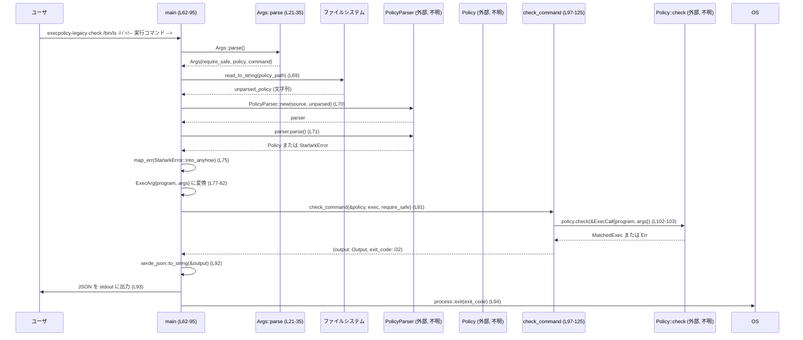

# execpolicy-legacy/src/main.rs コード解説

## 0. ざっくり一言

- コマンド実行ポリシー（`Policy`）に対して、指定されたコマンドが安全かどうかを判定し、その結果を JSON 形式と終了コードで返す CLI バイナリのエントリポイントです（`execpolicy-legacy/src/main.rs:L21-169`）。

---

## 1. このモジュールの役割

### 1.1 概要

- このモジュールは **外部のポリシーエンジン（`codex_execpolicy_legacy` クレート）** を利用して、与えられたコマンド（プログラム＋引数）が許可されるかを検査します（`main.rs:L4-9, L97-125`）。
- 入力は CLI のサブコマンド `check` または `check-json` で受け取り、出力は JSON と終了コードとして標準出力／プロセス終了コードに反映します（`main.rs:L37-52, L62-95, L127-151`）。
- エラー処理には `anyhow::Result` を用い、ポリシー読み込み・パース失敗などは Rust 標準のエラー終了（コード 1）として扱います（`main.rs:L1, L62-75`）。

### 1.2 アーキテクチャ内での位置づけ

このファイルは「CLI フロントエンド」として、ポリシーエンジン（`codex_execpolicy_legacy`）の結果をユーザが扱いやすい JSON と終了コードに変換する役割を持ちます。

```mermaid
flowchart LR
    subgraph CLIバイナリ
        A["Args (L21-35)"] -->|parse()| M["main (L62-95)"]
        C["Command (L37-52)"] --> M
        EA["ExecArg (L54-60)"] --> M
        M --> CC["check_command (L97-125)"]
        CC --> O["Output (L127-151)"]
    end

    subgraph ポリシーライブラリ（codex_execpolicy_legacy, このチャンク外）
        P["Policy (外部, 不明)"]
        PP["PolicyParser (外部, 不明)"]
        EC["ExecCall (外部, 不明)"]
        ME["MatchedExec (外部, 不明)"]
    end

    M --> PP
    PP --> P
    M --> P
    CC --> EC
    P -->|check(&ExecCall)| ME
    ME --> CC

    CC -->|JSON化| JS["serde_json::to_string (外部, 不明)"]
    JS --> STDOUT["stdout / JSON"]
    M --> EXIT["std::process::exit (終了コード)"]
```

- `Policy` や `ExecCall` などの実装は `codex_execpolicy_legacy` クレート側にあり、このチャンクには現れません。

### 1.3 設計上のポイント

- **責務分割**
  - CLI パースと入出力制御：`Args`, `Command`, `main`（`main.rs:L21-35, L37-52, L62-95`）
  - ポリシー評価と結果→出力形式変換：`check_command`, `Output`（`main.rs:L97-125, L127-151`）
- **状態管理**
  - 構造体／列挙体はいずれも単純なデータ保持のみで、グローバルな可変状態はありません。
  - `ExecArg` はプログラム名と引数の所有権を持つシンプルなデータ構造です（`main.rs:L54-60`）。
- **エラーハンドリング**
  - `main` は `anyhow::Result<()>` を返し、`?` 演算子で I/O や JSON 変換エラーを呼び出し元（Rust ランタイム）に伝播します（`main.rs:L62-75, L91-93`）。
  - ポリシー評価エラーは `check_command` 内で `Output::Unverified` として JSON 化しつつ、オプションに応じて終了コードを変えます（`main.rs:L120-123`）。
  - ポリシーパースエラーは `StarlarkError` を `anyhow` に変換してプロセス終了（コード 1）となります（`main.rs:L13, L75`）。
- **並行性**
  - スレッドや `async` は使用しておらず、すべて同期的・単一スレッドで処理されます（このチャンクに並行処理関連のコードは現れません）。

---

## 2. 主要な機能一覧

- CLI 引数のパース（サブコマンド `check` / `check-json` の処理分岐）  
- ポリシーファイルの読み込みと Starlark ポリシーのパース（外部 `PolicyParser` 利用）
- コマンド（プログラム＋引数）から `ExecCall` を構築し、`Policy::check` で評価
- 評価結果を `Output` 列挙体として表現し、JSON にシリアライズして標準出力に出力
- 評価結果と「安全性の厳格さフラグ（`require_safe`）」に応じた終了コード算出

---

## 3. 公開 API と詳細解説

### 3.1 型一覧（構造体・列挙体など）

#### 型インベントリー（構造体・列挙体）

| 名前      | 種別   | 役割 / 用途                                                                 | 定義位置 |
|-----------|--------|------------------------------------------------------------------------------|----------|
| `Args`    | 構造体 | CLI 全体の引数（`require_safe` フラグ、ポリシーパス、サブコマンド）を保持。`clap::Parser` でパース対象。 | `execpolicy-legacy/src/main.rs:L21-35` |
| `Command` | 列挙体 | サブコマンド定義。`Check`（通常の引数列）と `CheckJson`（JSON 文字列）を表現。 | `execpolicy-legacy/src/main.rs:L37-52` |
| `ExecArg` | 構造体 | 実行対象プログラム名と引数リストを表す。ポリシー評価の入力モデル。                | `execpolicy-legacy/src/main.rs:L54-60` |
| `Output`  | 列挙体 | ポリシー評価結果を JSON 出力しやすい形で保持するタグ付き列挙体。              | `execpolicy-legacy/src/main.rs:L127-151` |

#### 定数インベントリー

| 名前 | 型  | 役割 / 用途 | 定義位置 |
|------|-----|------------|----------|
| `MATCHED_BUT_WRITES_FILES_EXIT_CODE` | `i32` | 「ポリシーにはマッチしたが書き込みの可能性がある」場合の終了コード（12）。 | `execpolicy-legacy/src/main.rs:L17` |
| `MIGHT_BE_SAFE_EXIT_CODE`            | `i32` | 「検証できなかった（unverified）」場合の終了コード（13）。 | `execpolicy-legacy/src/main.rs:L18` |
| `FORBIDDEN_EXIT_CODE`                | `i32` | 「明示的に禁止された」場合の終了コード（14）。 | `execpolicy-legacy/src/main.rs:L19` |

### 3.2 関数・メソッド詳細

#### `main() -> Result<()>`

**概要**

- CLI アプリケーションのエントリポイントです（`main.rs:L62-95`）。
- ロガー初期化、引数パース、ポリシー読み込み・パース、`ExecArg` 構築、`check_command` 呼び出し、結果の JSON 出力とプロセス終了コード設定を行います。

**引数**

- なし（`std::env::args` を `clap` が内部で使用）。

**戻り値**

- `Result<()>`（`anyhow::Result<()>`）
  - 成功時：`Ok(())` が暗黙に返される前に `std::process::exit` が呼ばれるため、通常は呼び出し元に戻りません（`main.rs:L94`）。
  - 失敗時：ポリシー読み込み・パースや JSON シリアライズでエラーが発生すると `Err(anyhow::Error)` を返し、Rust ランタイムにより終了コード 1 で終了します（`main.rs:L69-75, L91-93`）。

**内部処理の流れ**

1. ロガー初期化  
   - `env_logger::init();`（`main.rs:L63`）。

2. CLI 引数のパース  
   - `let args = Args::parse();` により `Args` 構造体を生成（`main.rs:L65`）。

3. ポリシーの読み込み
   - `args.policy` が `Some(path)` の場合:
     - `std::fs::read_to_string(policy)?` でファイル内容を読み込み（同期 I/O）（`main.rs:L69`）。
     - `PolicyParser::new(&policy_source, &unparsed_policy)` でパーサーを生成し（`main.rs:L70`）、`parser.parse()` を実行（`main.rs:L71`）。
   - `args.policy` が `None` の場合:
     - `get_default_policy()` を呼び出してデフォルトポリシーを取得（`main.rs:L73`）。

4. ポリシーパース結果を `anyhow::Error` に統一
   - `let policy = policy.map_err(StarlarkError::into_anyhow)?;` で `StarlarkError` を `anyhow::Error` に変換し、エラー時は早期リターン（`main.rs:L75`）。

5. 実行対象コマンド（`ExecArg`）の決定
   - サブコマンド `args.command` に応じて分岐（`main.rs:L77-89`）。
   - `Command::Check { command }` の場合:
     - `command.split_first()` で先頭要素をプログラム名、残りを引数リストとして分割（`main.rs:L78-82`）。
     - 空の場合はエラーメッセージを標準エラーに出力し、終了コード 1 で即終了（`main.rs:L83-86`）。
   - `Command::CheckJson { exec }` の場合:
     - 既にデシリアライズ済みの `ExecArg` をそのまま利用（`main.rs:L88`）。

6. ポリシー評価と結果の取得
   - `check_command(&policy, exec, args.require_safe)` を呼び出し、`(output, exit_code)` を得る（`main.rs:L91`）。

7. JSON 出力とプロセス終了
   - `serde_json::to_string(&output)?` で `Output` を JSON 文字列に変換（`main.rs:L92`）。
   - `println!("{json}");` で標準出力に出力（`main.rs:L93`）。
   - `std::process::exit(exit_code);` で指定の終了コードでプロセス終了（`main.rs:L94`）。

**Examples（使用例）**

CLI からの呼び出し例（概念的な使用例です）:

```text
# ポリシーファイルを指定し、コマンドを検査
$ execpolicy-legacy --require-safe -p policy.star check /bin/ls -l /
{"result":"safe","match":{ ... 有効な Exec 情報 ... }}
$ echo $?  # 終了コードの確認
0

# JSON 形式でコマンド指定
$ execpolicy-legacy --require-safe -p policy.star check-json \
    '{"program":"/bin/rm","args":["-rf","/tmp"]}'
{"result":"forbidden","reason":"...","cause":{...}}
$ echo $?
14
```

※ 実際のバイナリ名やパスはこのチャンクからは分かりません。

**Errors / Panics**

- `std::fs::read_to_string` 失敗（ファイルが存在しない、権限不足など）で `Err(anyhow::Error)` を返します（`main.rs:L69`）。
- `PolicyParser::parse()` が `Err(StarlarkError)` を返した場合、`map_err` により `anyhow::Error` として伝播します（`main.rs:L70-75`）。
- `serde_json::to_string` 失敗時も `?` により `anyhow::Error` として伝播します（`main.rs:L92`）。
- 明示的な `panic!` はこのファイル内にはありません。

**Edge cases（エッジケース）**

- `check` サブコマンドでコマンド引数が空 (`command.is_empty()`) の場合:
  - `"no command provided"` を標準エラーに出力し、終了コード 1 で即終了します（`main.rs:L83-86`）。
- `policy` オプション未指定:
  - `get_default_policy()` を使用（`main.rs:L73`）。その中身はこのチャンクには現れません。
- `require_safe` が `false` の場合:
  - ポリシー的に禁止や未検証であっても、`check_command` により終了コード 0 で終了するケースがあります（`main.rs:L91, L97-125`）。

**使用上の注意点**

- ファイル I/O やポリシーパースに失敗すると、JSON 出力前にプロセスがエラー終了するため、呼び出し側は「JSON が出力されたかどうか」と「終了コード」を両方確認する必要があります。
- `std::process::exit` を使用しているため、`main` の後続処理（`Drop` 実行など）は一部スキップされる可能性があります。リソースの明示的な解放が必要な処理は `exit` より前に行う設計であることが前提です。

---

#### `check_command(policy: &Policy, ExecArg { program, args }: ExecArg, check: bool) -> (Output, i32)`

**概要**

- `Policy` と `ExecArg` を受け取り、ポリシー評価を実行して `Output` 列挙体と終了コードを返すコアロジックです（`main.rs:L97-125`）。
- `require_safe` フラグ（ここでは `check`）に応じて、禁止・未検証の場合に専用の終了コードを返します。

**引数**

| 引数名 | 型 | 説明 |
|--------|----|------|
| `policy` | `&Policy` | ポリシー評価を行うためのポリシーオブジェクトへの参照。`codex_execpolicy_legacy` クレートから提供される型です（`main.rs:L6`）。 |
| `ExecArg { program, args }` | `ExecArg`（分配パターン） | 検査対象コマンド。プログラム名と引数リストを所有する構造体を分解して受け取ります（`main.rs:L55-60, L99`）。 |
| `check` | `bool` | 「安全性を厳格に要求するか」を表すフラグ。`Args::require_safe` がそのまま渡されます（`main.rs:L27, L91, L100`）。 |

**戻り値**

- `(Output, i32)`
  - `Output`: 検査結果を表す列挙体（`Safe` / `Match` / `Forbidden` / `Unverified`）（`main.rs:L127-151`）。
  - `i32`: 終了コード。`check` フラグの値と結果に応じて 0 または 12/13/14 を返します（`main.rs:L105-123`）。

**内部処理の流れ（アルゴリズム）**

1. `ExecArg` から `ExecCall` を構築
   - `let exec_call = ExecCall { program, args };`（`main.rs:L102`）。
   - `ExecCall` の定義は外部クレート側で、このチャンクには現れません。

2. ポリシー評価の実行
   - `match policy.check(&exec_call)` で評価（`main.rs:L103`）。
   - 戻り値は `Result<MatchedExec, Error>` 型と推測されますが、正確な型はこのチャンクには現れません。
   - 成功時の `MatchedExec` には以下の 2 パターンがあることが分かります（`main.rs:L104, L116`）:
     - `MatchedExec::Match { exec }`
     - `MatchedExec::Forbidden { reason, cause }`

3. `MatchedExec::Match { exec }` の場合
   - `exec.might_write_files()` を呼び出し（`main.rs:L105`）、ファイル書き込みの可能性を判定します。
   - `true` の場合:
     - `check` が `true` なら終了コード `MATCHED_BUT_WRITES_FILES_EXIT_CODE`（12）、`false` なら 0（`main.rs:L105-110`）。
     - `Output::Match { r#match: exec }` を返します（`main.rs:L111`）。
   - `false` の場合:
     - `Output::Safe { r#match: exec }` と終了コード 0 を返します（`main.rs:L112-114`）。

4. `MatchedExec::Forbidden { reason, cause }` の場合
   - `check` が `true` なら `FORBIDDEN_EXIT_CODE`（14）、`false` なら 0（`main.rs:L117`）。
   - `Output::Forbidden { reason, cause }` を返します（`main.rs:L118`）。

5. `policy.check(&exec_call)` が `Err(err)` の場合
   - これはポリシーがコマンドを判定できなかった / エラーになったケースとみなされています。
   - `check` が `true` なら `MIGHT_BE_SAFE_EXIT_CODE`（13）、`false` なら 0（`main.rs:L121`）。
   - `Output::Unverified { error: err }` を返します（`main.rs:L122`）。

**Examples（使用例）**

Rust コードから直接呼び出す例（ライブラリ的な利用想定）:

```rust
use codex_execpolicy_legacy::{Policy, ExecCall};      // Policy 型は外部クレート（このチャンク外）
use execpolicy_legacy_main::{ExecArg, Output};        // 仮想的なモジュール名。実際の構成は不明。

fn run_check(policy: &Policy) {
    // ExecArg を手動で構築                                    // 検査したいコマンドを表す
    let exec = ExecArg {
        program: "/bin/ls".to_string(),               // プログラム名
        args: vec!["-l".to_string(), "/".to_string()],// 引数
    };

    // 厳格チェック（require_safe = true）                     // ポリシー違反なら非 0 の終了コード
    let (output, exit_code) = check_command(policy, exec, true);

    println!("output = {:?}", output);                // Output の Debug 表示（構造は JSON と同じ）
    println!("exit_code = {exit_code}");
}
```

※ `execpolicy_legacy_main` というモジュール名は説明用の仮定であり、このチャンクからは実際のパスは分かりません。

**Errors / Panics**

- `policy.check(&exec_call)` がエラーを返した場合でも、`check_command` 自体はパニックせず、`Output::Unverified` として扱います（`main.rs:L120-123`）。
- 明示的なパニックはありません。

**Edge cases（エッジケース）**

- `ExecArg.program` が空文字列のケース:
  - この関数内ではチェックしておらず、そのまま `ExecCall` に渡されます（`main.rs:L102`）。
  - その結果どう扱われるかは `Policy::check` の実装次第であり、このチャンクからは分かりません。
- `exec.might_write_files()` の判定結果はポリシーライブラリ側の実装に依存します（`main.rs:L105`）。

**使用上の注意点**

- `check` フラグと終了コードの組み合わせが重要です。JSON の `result` が `forbidden` や `unverified` であっても、`check == false` の場合は終了コード 0 が返されるため、呼び出し側では **JSON と終了コードを両方確認する前提** になっています。
- 「ファイルを書き込む可能性のあるマッチ（`Match` + `might_write_files == true`）」も、`check == false` の場合は終了コード 0 で返されます。安全性を終了コードで厳密に判断したい場合は `require_safe` を `true` にする必要があります。

---

#### `deserialize_from_json<'de, D>(deserializer: D) -> Result<ExecArg, D::Error>`

**概要**

- `ExecArg` のためのカスタムデシリアライザです（`main.rs:L153-161`）。
- いったん入力を `String` としてデシリアライズし、その文字列を JSON とみなして `ExecArg` に再デシリアライズします。

**引数**

| 引数名 | 型 | 説明 |
|--------|----|------|
| `deserializer` | `D`（`D: de::Deserializer<'de>`） | Serde のデシリアライザ。呼び出し側（Serde）が提供します。 |

**戻り値**

- `Result<ExecArg, D::Error>`
  - 成功時：`ExecArg`。
  - 失敗時：`serde::de::Error` 型のエラー。

**内部処理の流れ**

1. 入力を文字列としてデシリアライズ  
   - `let s = String::deserialize(deserializer)?;`（`main.rs:L157`）。

2. 文字列を JSON としてパース  
   - `serde_json::from_str(&s)` を使って `ExecArg` に変換（`main.rs:L158`）。

3. JSON パースエラーの変換  
   - `map_err(|e| serde::de::Error::custom(format!("JSON parse error: {e}")))` により、エラーメッセージを含むカスタム serde エラーに変換（`main.rs:L158-159`）。

4. 成功した `ExecArg` を返却  
   - `Ok(decoded)`（`main.rs:L160`）。

**Examples（使用例）**

Serde 経由での概念的な利用例（実際の呼び出し元は `Command::CheckJson` フィールドの属性に依存します: `main.rs:L49-50`）。

```rust
use serde::Deserialize;

#[derive(Deserialize)]
struct Wrapper {
    #[serde(deserialize_with = "deserialize_from_json")]      // ExecArg を JSON 文字列から復元する
    exec: ExecArg,
}

fn example() {
    // "exec" フィールドの値自体が JSON 文字列になっている想定                     // 文字列の中に JSON
    let data = r#"{ "exec": "{\"program\":\"/bin/ls\",\"args\":[\"-l\"]}" }"#;

    let wrapper: Wrapper = serde_json::from_str(data).unwrap(); // まず "exec" を String として読む
    assert_eq!(wrapper.exec.program, "/bin/ls");                // その後 JSON として ExecArg に変換
}
```

**Errors / Panics**

- 入力が文字列として解釈できない場合、`String::deserialize` の段階で `D::Error` が返されます（`main.rs:L157`）。
- 文字列が `ExecArg` として妥当な JSON でない場合、`"JSON parse error: {e}"` というエラーメッセージを持つ `serde::de::Error` が返されます（`main.rs:L158-159`）。
- パニックを発生させるコードは含まれていません。

**Edge cases（エッジケース）**

- 空文字列 `""` が渡された場合:
  - `serde_json::from_str` がパースエラーを返します（エラーメッセージは `serde_json` 側に依存）。
- `program` キーが欠けているなど `ExecArg` として必須フィールドが足りない JSON:
  - デシリアライズエラーとして扱われます（`ExecArg` の `Deserialize` 実装による）。

**使用上の注意点**

- このデシリアライザを使う場合、元データのフィールドは「JSON 文字列」である必要があります。通常の入れ子オブジェクトとしての `ExecArg` とは異なる点に注意が必要です（呼び出し元のフォーマットに依存し、このチャンクだけでは詳細は分かりません）。
- エラーメッセージは 1 つの文字列にまとめられるため、プログラム的にエラーの種類を判別するには別途パースが必要になります。

---

#### `ExecArg::from_str(s: &str) -> Result<ExecArg, anyhow::Error>`

**概要**

- `ExecArg` に対する `FromStr` 実装です（`main.rs:L163-169`）。
- 与えられた文字列を `ExecArg` の JSON 表現とみなしてパースします。

**引数**

| 引数名 | 型 | 説明 |
|--------|----|------|
| `s` | `&str` | `ExecArg` を表現する JSON 文字列。 |

**戻り値**

- `Result<ExecArg, anyhow::Error>`
  - 成功時：`ExecArg`。
  - 失敗時：`serde_json::Error` を `anyhow::Error` に変換したもの。

**内部処理の流れ**

1. `serde_json::from_str(s)` による `ExecArg` へのデシリアライズ（`main.rs:L167`）。
2. エラーが発生した場合、`map_err(Into::into)` によって `anyhow::Error` に変換して呼び出し元へ返却（`main.rs:L167`）。

**Examples（使用例）**

`FromStr` を利用したパース例:

```rust
use std::str::FromStr;

// ExecArg は FromStr を実装しているので parse() が使える
let exec: ExecArg = r#"{"program":"/bin/ls","args":["-l","/"]}"#
    .parse()                                     // &str -> ExecArg
    .expect("invalid ExecArg JSON");             // JSON が不正ならエラー

assert_eq!(exec.program, "/bin/ls".to_string()); // プログラム名を確認
assert_eq!(exec.args, vec!["-l".to_string(), "/".to_string()]);
```

**Errors / Panics**

- JSON が不正な場合、`serde_json::from_str` のエラーが `anyhow::Error` にラップされて返ります（`main.rs:L167`）。
- 関数内での `panic!` はありません。

**Edge cases（エッジケース）**

- `args` フィールドが欠けている JSON:
  - `ExecArg` の `Deserialize` 実装は `#[serde(default)]` により `args` を空ベクタに初期化するため、パースは成功します（`main.rs:L58-59`）。
- `program` フィールドが欠けている場合:
  - `Deserialize` 時にエラーとなり、`Err(anyhow::Error)` が返されます。

**使用上の注意点**

- `FromStr` 実装は `anyhow::Error` を返すため、`?` 演算子で簡潔に呼び出し元にエラーを伝播できます。
- `Deserialize` と同様に、`program` が必須、`args` が省略可能（デフォルト空）という性質を前提とした JSON を渡す必要があります。

---

### 3.3 その他の関数

このファイル内の関数は、上記の `main`, `check_command`, `deserialize_from_json`, `ExecArg::from_str` の 4 つのみです（`execpolicy-legacy/src/main.rs:L62-95, L97-125, L153-161, L163-169`）。補助的なヘルパー関数は存在しません。

---

## 4. データフロー

ここでは、典型的なシナリオ「CLI から `check` サブコマンドでコマンドを検査する場合」のデータの流れを示します。

### 4.1 処理の流れ（文章）

1. ユーザが CLI から `check` サブコマンドとコマンドを指定して実行します。
2. `Args::parse()` により CLI 引数が `Args` 構造体にマッピングされます（`main.rs:L21-35, L65`）。
3. `main` がポリシーファイルを読み込み、`Policy` オブジェクトを生成します（`main.rs:L66-75`）。
4. `args.command` が `Command::Check { command }` であれば、最初の要素を `ExecArg.program`、残りを `ExecArg.args` として構築します（`main.rs:L77-82`）。
5. `check_command` が `Policy::check(&ExecCall)` を呼び出し、`MatchedExec` またはエラーを受け取ります（`main.rs:L102-103`）。
6. `MatchedExec`（もしくはエラー）に応じて `Output` を構築し、終了コードを決定します（`main.rs:L104-123`）。
7. `main` が `Output` を JSON にシリアライズして標準出力に書き出し、終了コードでプロセスを終了させます（`main.rs:L91-94`）。

### 4.2 シーケンス図（`check` サブコマンドの例）



- `PolicyParser` と `Policy::check` の内部挙動はこのチャンクには現れず、「外部ライブラリの機能」に属します。

---

## 5. 使い方（How to Use）

### 5.1 基本的な使用方法

基本的なフローは以下の通りです。

1. ポリシーファイル（Starlark スクリプト等）を用意する。
2. CLI から `check` または `check-json` サブコマンドで検査対象コマンドを指定する。
3. JSON 出力と終了コードを解釈する。

疑似コード（Rust）で表すと次のようになります。

```rust
// 1. ポリシーや依存オブジェクトは内部で用意される                    // main 内で処理される

// 2. バイナリを CLI から実行（例）
// $ execpolicy-legacy --require-safe -p policy.star check /bin/ls -l /

/*
3. 出力例（概念的な JSON）:
{
  "result": "safe",                       // Output::Safe
  "match": { /* ValidExec のフィールド */ }
}
終了コード: 0
*/
```

- 出力 JSON のトップレベルには常に `result` フィールドがあり、その値に応じて他のフィールドが変わります（`main.rs:L127-151`）。

### 5.2 よくある使用パターン

#### パターン 1: `check` サブコマンド（POSIX `execv(3)` 風）

```text
$ execpolicy-legacy --require-safe -p policy.star check /usr/bin/python3 script.py arg1
{"result":"match","match":{ ... }}
$ echo $?
12  # might_write_files == true だった場合の例
```

- 「プログラム名＋引数列」をそのまま CLI 引数として渡すパターンです。
- `command` ベクタの先頭が `program`、残りが `args` として扱われます（`main.rs:L78-82`）。

#### パターン 2: `check-json` サブコマンド（JSON オブジェクト入力）

```text
$ execpolicy-legacy --require-safe -p policy.star check-json \
  '{"program":"/bin/rm","args":["-rf","/tmp"]}'
{"result":"forbidden","reason":"...","cause":{...}}
$ echo $?
14
```

- `ExecArg` に対応する JSON を直接指定するパターンです。
- `ExecArg` のデフォルトでは `args` は省略可能で、指定しない場合は空リストになります（`main.rs:L54-60`）。

### 5.3 よくある間違い

```rust
// 間違い例: check サブコマンドでプログラム名を渡し忘れる
// CLI: execpolicy-legacy check
// 結果: "no command provided" と表示し、終了コード 1 で終了（main.rs:L83-86）
```

```rust
// 正しい例: 少なくとも 1 つはプログラム名を指定する
// CLI: execpolicy-legacy check /bin/ls
```

```rust
// 間違い例: JSON 形式で ExecArg を渡すが、必須フィールドが欠けている
let exec: ExecArg = r#"{"args":["-l"]}"#.parse()?;  // program がないためエラー

// 正しい例: program を必ず指定する
let exec: ExecArg = r#"{"program":"/bin/ls","args":["-l"]}"#.parse()?;
```

### 5.4 使用上の注意点（まとめ）

- **終了コードと JSON の両方を確認する前提**
  - `require_safe == false` の場合、`forbidden` や `unverified` でも終了コード 0 になり得ます（`main.rs:L117, L121`）。
  - 安全性の判定を自動化する際には `Output` の `result` フィールドも必ずチェックする必要があります。
- **ポリシーファイルのエラー**
  - ポリシーファイルの読み込みやパースに失敗すると、JSON は出力されず `anyhow::Error` により即時終了（終了コード 1）します（`main.rs:L69-75, L92`）。
- **I/O とパフォーマンス**
  - ポリシーファイルは起動時に `read_to_string` で全読み込みされます（`main.rs:L69`）。通常の設定ファイルサイズであれば問題になりにくいですが、非常に大きなファイルの場合は起動時間に影響します。
- **並行性**
  - 本ファイル内にはスレッド生成や `async` に関するコードがなく、すべて同期処理で行われます。高頻度で多数のリクエストを処理する用途では、外部からの並列実行（複数プロセスなど）を考慮する必要があります。
- **監視・観測性**
  - `env_logger::init()` によりログ基盤の初期化は行われていますが、このファイル内でログマクロ（`log::info!` など）は使用されていません（`main.rs:L63`）。
  - 観測の主な手段は標準出力の JSON と終了コードです。

---

## 6. 変更の仕方（How to Modify）

### 6.1 新しい機能を追加する場合

#### 例: 新しいサブコマンドを追加したい場合

1. **`Command` 列挙体の拡張**  
   - `Command` に新Variantを追加します（`main.rs:L37-52`）。
   - 必要に応じて `clap` 属性（`#[clap(...)]` や `#[arg(...)]`）を付与します。

2. **`main` の分岐拡張**  
   - `match args.command { ... }` に新しい `Command` Variant の分岐を追加し、適切に `ExecArg` などを構築します（`main.rs:L77-89`）。

3. **ポリシー評価との接続**  
   - 既存の `check_command` に渡せる `ExecArg` に落とし込めるのであれば、そのまま `check_command` を再利用します（`main.rs:L97-125`）。
   - もし別の評価手順が必要なら、新たな関数を定義し `main` から呼び出します。

4. **JSON 出力形式の検討**
   - `Output` 列挙体の Variant を追加する場合は、タグ付き enum としてのシリアライズ形式（`#[serde(tag = "result")]`）との整合性を確認する必要があります（`main.rs:L127-151`）。

### 6.2 既存の機能を変更する場合

- **影響範囲の確認**
  - `check_command` のロジックや終了コードを変更する場合、`main` からの唯一の呼び出し部分（`main.rs:L91`）と、呼び出し元（CLI や外部ツール）が期待している終了コードとの契約を確認する必要があります。
- **契約（前提条件・返り値の意味）**
  - 現状、`Output::result` と終了コードの組み合わせが事実上のプロトコルになっています（`main.rs:L104-123, L127-151`）。
  - これを変更すると、既存の利用者（スクリプトや他サービス）が解釈に失敗する可能性があります。
- **テストの確認**
  - このファイル内にはテストコード（`#[cfg(test)]`）は存在しません（このチャンクには現れません）。
  - 変更時には、別ファイルや外部リポジトリにあるテスト（存在するなら）を確認し、終了コードや JSON 形式に依存したテストケースがないかを調べる必要があります（テストの所在はこのチャンクからは不明です）。
- **安全性とセキュリティ**
  - ポリシー評価の結果を緩和（例: 禁止を未検証扱いにする）するような変更は、セキュリティポリシー全体に影響します。`FORBIDDEN_EXIT_CODE` や `MIGHT_BE_SAFE_EXIT_CODE` の扱いを変更する際には、ポリシーの意図と利用者の期待の両方を整理する必要があります（`main.rs:L17-19, L117, L121`）。

---

## 7. 関連ファイル

このモジュールと密接に関係する外部クレート・型は以下の通りです。

| パス / クレート | 役割 / 関係 |
|-----------------|------------|
| `codex_execpolicy_legacy::Policy` / `PolicyParser` / `ExecCall` / `MatchedExec` / `ValidExec` / `Forbidden` / `Error` | ポリシー定義・解析・評価を提供するコアライブラリ。`main` および `check_command` から利用されます（`main.rs:L4-9, L97-125, L127-151`）。実装はこのチャンクには現れません。 |
| `env_logger` クレート | ログ出力の初期化を行うクレート。`main` 冒頭で `env_logger::init()` が呼ばれます（`main.rs:L63`）。 |
| `clap` クレート | CLI 引数パーサー。`Args` と `Command` で `derive(Parser, Subcommand)` を利用しています（`main.rs:L2-3, L21, L37`）。 |
| `serde` / `serde_json` クレート | 構造体・列挙体の（デ）シリアライズを提供。`Args`, `Command`, `ExecArg`, `Output` および補助関数で使用されています（`main.rs:L10-12, L127-151, L153-161, L163-167`）。 |
| `starlark::Error` | ポリシーパース時のエラー型。`StarlarkError::into_anyhow` を通じて `anyhow::Error` に変換されます（`main.rs:L13, L75`）。 |

このファイルは主に CLI のインターフェースとポリシーライブラリを橋渡しする役割を持ち、実際のポリシー言語や評価ロジックは `codex_execpolicy_legacy` 側にあります（このチャンクには詳細な実装は現れません）。
