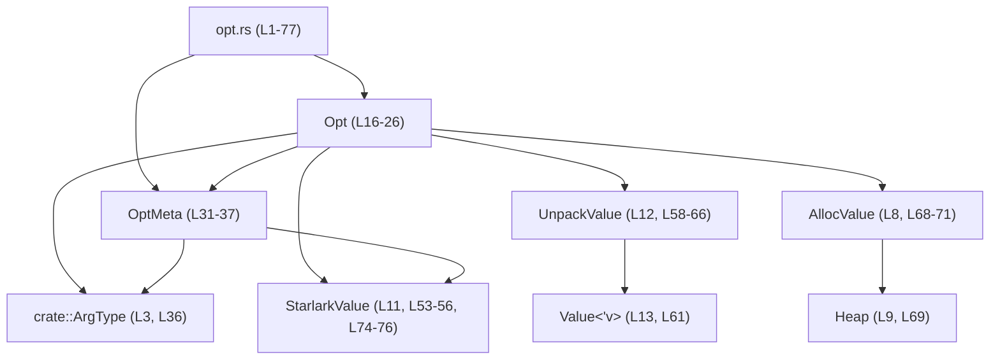

# execpolicy-legacy/src/opt.rs

## 0. ざっくり一言

コマンドラインオプションの名前・型・必須フラグを表す `Opt` 型と、その付随メタ情報 `OptMeta` を定義し、Starlark の値との相互変換（割り当て・アンパック）を行うモジュールです（`Opt` / `OptMeta` と各種トレイト実装が定義されていることから判断、execpolicy-legacy/src/opt.rs:L16-26, L31-37, L53-56, L58-66, L68-71, L74-76）。

---

## 1. このモジュールの役割

### 1.1 概要

- コマンドラインオプションを表す構造体 `Opt` を定義し、そのオプション名（例: `--help`）、値の型、必須かどうかを保持します（L16-26）。
- オプションが値を取るかどうか、値を取る場合の型などを表現するための列挙型 `OptMeta` を提供します（L31-37）。
- `Opt` と `OptMeta` を Starlark ランタイムの値として扱うために、`StarlarkValue`, `UnpackValue`, `AllocValue` などのトレイト実装を提供します（L53-56, L58-66, L68-71, L74-76）。
- コマンドライン解析ロジックや Starlark スクリプトから、同じ `Opt` 表現を共有して使えるようにするための基盤となるモジュールと解釈できます。ただし、このファイル単体から呼び出し元は分かりません。

### 1.2 アーキテクチャ内での位置づけ

このモジュール自体は小さいですが、以下のような依存関係を持っています。

- `crate::ArgType` に依存しており、オプション値の型情報を外部型で表しています（L3, L36）。
- Starlark ランタイムの値型やヒープ型（`starlark::values::{Value, Heap}`）およびトレイト群（`StarlarkValue`, `UnpackValue`, `AllocValue`）に依存して、`Opt` / `OptMeta` を Starlark の値として扱えるようにしています（L7-13, L53-56, L58-66, L68-71, L74-76）。
- `derive_more::Display`, `ProvidesStaticType`, `NoSerialize`, `Allocative` といった derive マクロ・トレイトを利用し、表示・型情報・シリアライズ制御・メモリ計測などのメタ的な振る舞いを付与しています（L5-7, L10, L17-18, L29-30）。

依存関係の概略を Mermaid で表すと次のようになります。



### 1.3 設計上のポイント

コードから読み取れる設計上の特徴は次のとおりです。

- **責務の分割**
  - オプション個体を表す `Opt` と、その「値を取るか・どの型か」を表す `OptMeta` を分離しています（L16-26, L31-37）。
- **メタ情報の型安全な表現**
  - オプションが値を取らない「フラグ」と、値を取る「値オプション」を `OptMeta::Flag` / `OptMeta::Value(ArgType)` という enum で区別しています（L31-37）。
- **Starlark との統合**
  - `#[starlark_value(type = "Opt")]` / `#[starlark_value(type = "OptMeta")]` と `StarlarkValue` トレイト実装により、Starlark ランタイムでこれらの型を値として扱えるようにしています（L53-56, L74-76）。
  - `UnpackValue` と `AllocValue` を実装することで、`Value<'v>` と `Opt` の間の相互変換が可能になっています（L58-66, L68-71）。
- **エラーハンドリング方針**
  - Starlark から `Opt` を取り出す `unpack_value_impl` は `starlark::Result<Option<Self>>` を返しますが、現状は常に `Ok(...)` を返し、`Err` を返す条件は実装されていません（L58-66）。
  - 型不一致の場合は `Ok(None)` が返る実装になっており、例外的状況をエラーではなく「値なし」として表現していると解釈できます（L61-65）。
- **所有権・ライフタイム**
  - `Opt` 自体はライフタイムパラメータを持たず、所有する `String` と `ArgType` から構成されています（L23-25）。
  - `UnpackValue` 実装では `Value<'v>` から `Opt` をクローンして取得するため、Starlark のライフタイム `'v` に依存しない独立した Rust 所有の値になります（L61-65）。
- **静的解析の調整**
  - `#![allow(clippy::needless_lifetimes)]` により、不要なライフタイムに関する clippy の警告を抑制しています（L1）。これは Starlark のトレイトシグネチャ互換性などのためと推測されますが、このファイルからは理由は断定できません。

---

## 1.4 コンポーネント一覧（インベントリー）

### 構造体・列挙体

| 名前      | 種別   | 定義位置                                      | 概要 |
|-----------|--------|-----------------------------------------------|------|
| `Opt`     | 構造体 | execpolicy-legacy/src/opt.rs:L16-26          | コマンドラインオプションの名前・メタ情報・必須フラグを保持する。`StarlarkValue`, `UnpackValue`, `AllocValue` を実装し、Starlark 値としても扱える。 |
| `OptMeta` | 列挙体 | execpolicy-legacy/src/opt.rs:L31-37          | オプションがフラグか値付きか、および値付きの場合の引数型 `ArgType` を表す。 |

### メソッド・関数・トレイト実装

| シンボル / メソッド名                                      | 所属 / トレイト       | 定義位置                                      | 役割（1 行） |
|------------------------------------------------------------|------------------------|-----------------------------------------------|--------------|
| `Opt::new(opt: String, meta: OptMeta, required: bool)`     | inherent impl `Opt`    | execpolicy-legacy/src/opt.rs:L39-46          | `Opt` のフィールドをそのまま初期化するコンストラクタ。 |
| `Opt::name(&self) -> &str`                                 | inherent impl `Opt`    | execpolicy-legacy/src/opt.rs:L48-50          | オプション名（`opt` フィールド）の文字列スライスを返す。 |
| `impl<'v> StarlarkValue<'v> for Opt`                       | `StarlarkValue` impl   | execpolicy-legacy/src/opt.rs:L53-56          | `Opt` を Starlark ランタイムの値型として登録する。`Canonical = Opt`。 |
| `impl<'v> UnpackValue<'v> for Opt::unpack_value_impl`      | `UnpackValue` impl     | execpolicy-legacy/src/opt.rs:L58-66          | `Value<'v>` から `Opt` を取り出す（ダウンキャスト＋クローン）。 |
| `impl<'v> AllocValue<'v> for Opt::alloc_value`             | `AllocValue` impl      | execpolicy-legacy/src/opt.rs:L68-71          | `Opt` を Starlark ヒープに割り当て、`Value<'v>` を生成する。 |
| `impl<'v> StarlarkValue<'v> for OptMeta`                   | `StarlarkValue` impl   | execpolicy-legacy/src/opt.rs:L74-76          | `OptMeta` を Starlark の値型として登録する。`Canonical = OptMeta`。 |

---

## 2. 主要な機能一覧

- コマンドラインオプション定義の保持: オプション名・メタ情報・必須フラグを `Opt` に保持する（L16-26, L39-46）。
- オプション種別の表現: `OptMeta::Flag` / `OptMeta::Value(ArgType)` により、値なしフラグと型付き値オプションを区別する（L31-37）。
- Starlark 値としての公開: `Opt` / `OptMeta` を `StarlarkValue` として登録し、Starlark ランタイムで利用可能にする（L53-56, L74-76）。
- Starlark 値からの取り出し: `UnpackValue` 実装を通じて、`Value<'v>` から `Opt` を安全に取得する（L58-66）。
- Starlark ヒープへの割り当て: `AllocValue` 実装により、`Opt` を `Heap` 上に割り当て `Value<'v>` として返す（L68-71）。

---

## 3. 公開 API と詳細解説

### 3.1 型一覧（構造体・列挙体など）

| 名前      | 種別   | フィールド / バリアント | 役割 / 用途 | 定義位置 |
|-----------|--------|-------------------------|-------------|----------|
| `Opt`     | 構造体 | `opt: String`<br>`meta: OptMeta`<br>`required: bool` | コマンドラインオプションの名前・メタ情報・必須かどうかを表現する。Starlark の値としても扱われる。 | L16-26 |
| `OptMeta` | 列挙体 | `Flag`<br>`Value(ArgType)` | オプションが値を取らないフラグか、`ArgType` に従う値を取るオプションかを表す。 | L31-37 |

補足:

- `ArgType` の具体的な定義や意味は、このファイルには現れません（L3, L36）。名前から「引数の型情報」を表すと想像されますが、詳細は不明です。

### 3.2 関数詳細

#### `Opt::new(opt: String, meta: OptMeta, required: bool) -> Opt`

**概要**

`Opt` の 3 つのフィールド `opt`, `meta`, `required` を引数として受け取り、そのまま格納した新しい `Opt` インスタンスを生成します（L39-46）。

**引数**

| 引数名    | 型          | 説明 |
|-----------|-------------|------|
| `opt`     | `String`    | コマンドラインオプション名。例: `"-h"`, `"--help"` など（L20-23, L39）。 |
| `meta`    | `OptMeta`   | オプションが値を取るか、取る場合の型などを表すメタ情報（L24-25, L31-37）。 |
| `required`| `bool`      | このオプションが必須 (`true`) か任意 (`false`) かを表すフラグ（L25, L39-45）。 |

**戻り値**

- 新しく生成した `Opt` 構造体インスタンス（L40-45）。

**内部処理の流れ**

1. `Self { opt, meta, required }` というフィールド初期化構文で、引数をそのまま対応するフィールドに代入します（L41-45）。
2. 追加の検証や変換は行っていません。

**Examples（使用例）**

`Opt` を単純に初期化する例です。`ArgType` の具体的な値はこのファイルからは分からないため、ここではコメントで示します。

```rust
use crate::opt::{Opt, OptMeta}; // モジュールパスは仮の例

// コマンドラインオプション "--help" を表す Opt を作る例
fn make_help_opt(meta: OptMeta) -> Opt {
    // meta には呼び出し元で構築した OptMeta を渡す
    Opt::new("--help".to_owned(), meta, false) // 非必須オプションとして初期化
}
```

※ `ArgType` の具象値はこのファイルに現れないため、`OptMeta::Value` の具体例は示していません。

**Errors / Panics**

- エラー型や `Result` を返さず、内部でも `panic!` などを呼んでいないため、通常の使用ではパニックは発生しません（L39-46）。
- 入力値の妥当性チェックも行わないため、「不正な」オプション名やメタ情報もそのまま格納されます。

**Edge cases（エッジケース）**

- `opt` が空文字列 `""` の場合も、そのままフィールドに入ります。妥当性は呼び出し元の責務です（L39-45）。
- `required` に任意の真偽値を指定できますが、他のフィールドとの一貫性チェック（例: 必須だが実際には利用されないなど）は行いません。
- `meta` がどのバリアントでも同様に格納されます。`Flag` と `Value` の関係性チェックなどは行いません。

**使用上の注意点**

- `Opt::new` は単純な構造体初期化のラッパであり、検証ロジックを含んでいません。フォーマットや意味の検証は呼び出し側で行う必要があります。
- 大量の `Opt` を生成する場合、`opt: String` のアロケーションコストが支配的になります。再利用やインターン化などが必要かどうかは、他コードとの兼ね合いで検討されるべきですが、このファイルからは詳細は分かりません。

---

#### `Opt::name(&self) -> &str`

**概要**

`Opt` に保持されているオプション名 `opt` の `&str` ビューを返します（L48-50）。

**引数**

| 引数名 | 型       | 説明 |
|--------|----------|------|
| `self` | `&Opt`   | 対象となる `Opt` インスタンスへの参照。 |

**戻り値**

- `&str`: `self.opt` の文字列スライス（L49）。

**内部処理の流れ**

1. `&self.opt` を返すだけのアクセサです（L49）。

**Examples（使用例）**

```rust
use crate::opt::{Opt, OptMeta};

// Opt からオプション名を取り出して表示する
fn print_opt_name(opt: &Opt) {
    // name() は opt フィールドの &str を返す
    println!("option name = {}", opt.name());
}
```

**Errors / Panics**

- 単にフィールド参照を返すだけであり、パニックやエラーは発生しません（L48-50）。

**Edge cases（エッジケース）**

- `opt` が空文字列でも、そのまま空の `&str` が返ります。
- `opt` が無効な UTF-8 を含むことは Rust の `String` 型上あり得ないため、戻り値は常に有効な UTF-8 文字列です。

**使用上の注意点**

- `name()` は `&self` を取るので所有権を消費せず、`Opt` を他でも使用できます。
- 戻り値は `self` のライフタイムに束縛される `&str` となるため、`Opt` より長く生存させることはできません。

---

#### `<Opt as UnpackValue<'v>>::unpack_value_impl(value: Value<'v>) -> starlark::Result<Option<Opt>>`

**概要**

Starlark ランタイムの動的な値 `Value<'v>` から、この型 `Opt` を取り出すための実装です。`Value` が `Opt` を保持していればクローンした `Opt` を返し、そうでなければ `None` を返します（L58-66）。

**引数**

| 引数名 | 型             | 説明 |
|--------|----------------|------|
| `value`| `Value<'v>`    | Starlark ランタイムの値。`Opt` かもしれないし、そうでないかもしれない（L61）。 |

**戻り値**

- `starlark::Result<Option<Opt>>`:
  - `Ok(Some(opt))`: `value` が `Opt` 型の値だった場合、そのクローン。
  - `Ok(None)`: `value` が `Opt` 型ではなかった場合（`downcast_ref::<Opt>()` が `None` を返すケース）と考えられます（L61-65）。
  - 現行実装では `Err` を返していません。

**内部処理の流れ**

1. `value.downcast_ref::<Opt>()` を呼び出し、`Value` 内部に `Opt` が格納されているかを確認します（L61-64）。
   - 型推論と `cloned()` 呼び出しから、このメソッドは `Option<&Opt>` のような参照型の `Option` を返していると考えられます。
2. `Option<&Opt>` に対して `.cloned()` を呼び出し、`Option<Opt>` に変換します（L64）。
   - 見つかった場合は `Opt` インスタンスがクローンされ、所有権を持つ値として返されます。
3. その結果を `Ok(...)` で包んで返します（L61-65）。
4. コメントには「クローン無しでできるのでは？」という TODO があるため、現状はクローンに伴うコストを受け入れていると読み取れます（L62-63）。

**Examples（使用例）**

`Value<'v>` から `Opt` を取り出す最小限の例です。`Value` の生成方法はこのファイルに現れないため、引数として受け取る形にしています。

```rust
use starlark::values::Value;
use starlark::values::UnpackValue;
use crate::opt::Opt;

// Value<'v> から Opt を試しに取り出すヘルパ関数
fn try_unpack_opt<'v>(value: Value<'v>) -> starlark::Result<Option<Opt>> {
    // トレイトメソッドを完全修飾で呼び出す
    <Opt as UnpackValue<'v>>::unpack_value_impl(value)
}
```

**Errors / Panics**

- 戻り値の型は `starlark::Result` を返すよう定義されていますが、実装では常に `Ok(...)` を返しており `Err` を返す分岐はありません（L61-65）。
- `downcast_ref::<Opt>()` が `None` を返した場合も、そのまま `Ok(None)` となるため、パニックは発生しません（L61-65）。
- `downcast_ref::<Opt>()` 自体の実装がどのような場合にパニックするかはこのファイルには現れませんが、通常の型ダウンキャスト API であればパニックはせず `None` で表現されるのが一般的です。

**Edge cases（エッジケース）**

- `value` の内部が `Opt` ではない場合:
  - `downcast_ref::<Opt>()` は `None` を返し、`.cloned()` の結果は `None` となるため、`Ok(None)` が返ります（L61-65）。
  - 呼び出し側が `None` を「値なし」と見なすか「型不一致」と見なすかは、呼び出し側の設計次第です。
- `value` に格納されている `Opt` が巨大なデータを持つ場合:
  - `.cloned()` により、そのコピーが生成されるためメモリ／CPU コストが増大します（L61-65）。
- `value` が Starlark ヒープ上からすでに無効になっているなどのケースは、このファイルだけでは判断できません。

**使用上の注意点**

- 「型が違う場合は `Err` になる」と期待すると誤る可能性があります。現実装では型不一致は `Ok(None)` です（L61-65）。
- 戻り値が `Option<Opt>` であるため、`match` や `if let` で `None` ケースを必ず扱う必要があります。
- `.cloned()` により `Opt` がコピーされるため、大量のアンパックを行う箇所では性能に注意が必要です。これはコメントの TODO にも示されています（L62-63）。

---

#### `<Opt as AllocValue<'v>>::alloc_value(self, heap: &'v Heap) -> Value<'v>`

**概要**

所有権を持つ `Opt` を Starlark のヒープ `Heap` 上に割り当て、Starlark の値型 `Value<'v>` として返します（L68-71）。

**引数**

| 引数名 | 型          | 説明 |
|--------|-------------|------|
| `self` | `Opt`       | 割り当て対象となる `Opt` インスタンス。所有権はこの関数に移動します（L68-70）。 |
| `heap` | `&'v Heap`  | `Opt` を割り当てる対象の Starlark ヒープ（L69）。 |

**戻り値**

- `Value<'v>`: ヒープ上に割り当てられた `Opt` を指す Starlark の値を表す型（L69-70）。

**内部処理の流れ**

1. `heap.alloc_simple(self)` を呼び出し、`self` をヒープ上に割り当てます（L69-70）。
2. `alloc_simple` の戻り値（`Value<'v>`）をそのまま返します（L69-70）。

`alloc_simple` の詳細な挙動（コピーかムーブか、GC の扱いなど）はこのファイルには現れません。

**Examples（使用例）**

```rust
use starlark::values::{Heap, AllocValue, Value};
use crate::opt::{Opt, OptMeta};

// 既存の Heap に Opt を割り当てて Value<'v> を得る例
fn alloc_opt_on_heap<'v>(heap: &'v Heap, opt: Opt) -> Value<'v> {
    // AllocValue トレイト経由で Opt をヒープに割り当てる
    opt.alloc_value(heap)
}
```

※ `Heap` の生成方法はこのファイルには現れないため、ここでは外部から引数で受け取る形にしています。

**Errors / Panics**

- `alloc_value` 自身は `Result` を返さず、内部で `heap.alloc_simple(self)` を 1 回呼ぶだけです（L69-70）。
- `heap.alloc_simple` がどのような条件でパニック・エラーとなるかはこのファイルからは分かりません。

**Edge cases（エッジケース）**

- `Opt` の内容（文字列や `ArgType`）がどのようなものであっても、そのままヒープに割り当てられます。内容に対する検証は行われません。
- `heap` が `None` であるようなケースは Rust の型システム上存在しません（`&Heap`）。

**使用上の注意点**

- `self` をムーブで受け取るため、`alloc_value` 呼び出し後に元の `Opt` は使用できません。これは Rust の所有権ルールに従っています。
- `Value<'v>` はライフタイム `'v` に束縛されているため、`heap` のライフタイムより長く保持することはできません。

---

### 3.3 その他の関数

このファイルには、上記以外の非トレイトメソッドや補助関数は存在しません（L39-71 にすべてのメソッド実装が含まれています）。

---

## 4. データフロー

ここでは、`Opt` が Starlark ランタイムの `Value<'v>` と相互変換される際のデータフローを整理します。

### 4.1 Starlark 値から `Opt` へのアンパック

1. 呼び出し側（Rust 側のコード）が `Value<'v>` を受け取る。
2. `<Opt as UnpackValue<'v>>::unpack_value_impl` を呼び出す（L58-66）。
3. `value.downcast_ref::<Opt>()` により、内部に `Opt` が格納されているかを確認する（L61-64）。
4. 見つかった場合は `&Opt` が返り、`.cloned()` により `Opt` のコピーが生成される（L64）。
5. `Ok(Some(Opt))` として返却される。見つからなければ `Ok(None)` が返る（L61-65）。

### 4.2 `Opt` から Starlark 値への割り当て

1. 呼び出し側が所有権付きの `Opt` を持っている。
2. `opt.alloc_value(heap)` を呼び出す（`AllocValue` トレイト、L68-71）。
3. `heap.alloc_simple(self)` により `Opt` がヒープに格納され、`Value<'v>` が返る（L69-70）。
4. 呼び出し側はこの `Value<'v>` を Starlark ランタイムに渡すことができます（詳細は他ファイル）。

### データフローのシーケンス図

```mermaid
sequenceDiagram
  participant Caller as "呼び出し側 Rust コード"
  participant Val as "Value<'v>"
  participant Unpack as "unpack_value_impl (L61-65)"
  participant Opt as "Opt (L16-26)"
  participant Heap as "Heap"
  participant Alloc as "alloc_value (L69-70)"

  Caller->>Unpack: <Opt as UnpackValue<'v>>::unpack_value_impl(Val)
  Unpack->>Val: downcast_ref::<Opt>()
  alt Val が Opt を保持
    Val-->>Unpack: Some(&Opt)
    Unpack->>Opt: cloned()
    Unpack-->>Caller: Ok(Some(Opt))
  else Val が別型
    Val-->>Unpack: None
    Unpack-->>Caller: Ok(None)
  end

  Caller->>Alloc: opt.alloc_value(&Heap)
  Alloc->>Heap: alloc_simple(self)
  Heap-->>Caller: Value<'v>
```

この図は、`unpack_value_impl`（L61-65）と `alloc_value`（L69-70）の処理フローを表しています。

---

## 5. 使い方（How to Use）

### 5.1 基本的な使用方法

#### `Opt` の構築と参照

```rust
use crate::opt::{Opt, OptMeta};

// 既存の OptMeta（例: フラグ）から Opt を組み立てる
fn build_opt(meta: OptMeta) -> Opt {
    // "--verbose" という非必須フラグオプションの定義
    let opt = Opt::new("--verbose".to_owned(), meta, false); // L39-46

    // name() でオプション名にアクセスできる
    println!("defined option = {}", opt.name()); // L48-50

    opt
}
```

この例では、`Opt::new` により CLI オプションを定義し、`name()` メソッドで名前を取得しています。

#### Starlark 値との相互変換（概念的な例）

```rust
use starlark::values::{Value, Heap, UnpackValue, AllocValue};
use crate::opt::{Opt, OptMeta};

fn from_starlark<'v>(value: Value<'v>) -> starlark::Result<Option<Opt>> {
    // Value<'v> から Opt を試しに取り出す（L61-65）
    <Opt as UnpackValue<'v>>::unpack_value_impl(value)
}

fn to_starlark<'v>(heap: &'v Heap, opt: Opt) -> Value<'v> {
    // Opt を Heap に割り当てて Value<'v> を得る（L69-70）
    opt.alloc_value(heap)
}
```

`Heap` や `Value` の生成・利用パターンはこのファイルには現れませんが、`UnpackValue` / `AllocValue` の実装から、このように利用されることが想定されます。

### 5.2 よくある使用パターン

- **フラグオプションの定義**
  - `OptMeta::Flag` を使い、値を取らないオプションを表すパターン（L31-33）。
- **値付きオプションの定義**
  - `OptMeta::Value(ArgType)` によって、型情報付きのオプションとして表すパターン（L35-36）。
  - `ArgType` の具体的な作り方はこのファイルには現れません。

`Opt` 自体は単純なデータキャリアであり、実際の解析・バリデーション・ヘルプ出力などは他モジュールで実装されると考えられますが、このチャンクには現れません。

### 5.3 よくある間違い（起こり得る誤用）

このファイルの実装から推測できる、誤用しやすい点を挙げます。

```rust
use starlark::values::Value;
use starlark::values::UnpackValue;
use crate::opt::Opt;

// 誤り: 型不一致を Err とみなしている
fn wrong_assumption<'v>(v: Value<'v>) -> starlark::Result<Opt> {
    // NG: None のケースを考慮していない
    let opt = <Opt as UnpackValue<'v>>::unpack_value_impl(v)?; // Ok(None) もあり得る (L61-65)
    Ok(opt.unwrap()) // None の場合にパニック
}
```

正しい扱い方の一例:

```rust
fn correct_handling<'v>(v: Value<'v>) -> starlark::Result<Option<Opt>> {
    // Ok(Some(Opt)) / Ok(None) の両方をそのまま返す
    <Opt as UnpackValue<'v>>::unpack_value_impl(v)
}
```

### 5.4 使用上の注意点（まとめ）

- **前提条件**
  - `Opt::new` は引数の形式・整合性をチェックしません。オプション名のフォーマットや `meta` と `required` の整合性は呼び出し側で保証する必要があります（L39-46）。
  - `unpack_value_impl` は `Opt` 型でない `Value` を受け取る可能性を想定しており、その場合は `Ok(None)` を返します（L61-65）。
- **エラー処理**
  - `unpack_value_impl` は現状 `Err` を返さないため、呼び出し側は「エラー」と「型不一致（None）」を区別したい場合、自身で規約を設ける必要があります（L61-65）。
- **所有権とライフタイム**
  - `alloc_value` は `self` をムーブし、`heap` のライフタイム `'v` と結びついた `Value<'v>` を返します（L68-71）。
  - `unpack_value_impl` は `Opt` をクローンして返すため、Starlark ランタイムのライフタイム `'v` に依存しない所有権を持つ値として利用できます（L61-65）。
- **並行性**
  - このファイルには `Send` / `Sync` に関する明示的な実装やコメントは存在せず、スレッド安全性については不明です。
  - `Opt` のフィールドは `String` と `ArgType` と `bool` だけですが、`ArgType` のスレッド安全性はこのファイルからは判断できません。

---

## 6. 変更の仕方（How to Modify）

### 6.1 新しい機能を追加する場合

このモジュールの構造から、以下のような拡張ポイントが考えられます（あくまで「どこを触るか」の観点です）。

1. **オプション種別の追加**
   - 複数の値を取るオプションなど、新たな種別を表現したい場合は `OptMeta` の列挙体にバリアントを追加するのが自然です（L31-37）。
   - 追加後は、`OptMeta` を利用する他モジュール側の `match` 式などを拡張する必要がありますが、そのコードはこのチャンクには現れません。
2. **表示形式の変更**
   - `Opt` の表示（`Display`）は `#[display("opt({})", opt)]` で定義されています（L17-18）。ここを変更することで `Opt` の文字列表現を変更できます。
   - 同様に、`OptMeta` の `Display` は `#[display("{}", self)]` によって自動導出されています（L29-30）。
3. **Starlark 統合の拡張**
   - `StarlarkValue` の実装自体は最小限で、`type Canonical = Opt` / `OptMeta` のみです（L53-56, L74-76）。Starlark 側でのメソッドなどを追加したい場合は、`StarlarkValue` の拡張実装を追加する必要があります。

### 6.2 既存の機能を変更する場合

変更時に確認すべきポイントを整理します。

- **`Opt::new` の契約を変える場合**
  - 例えば「必須オプションは特定の条件を満たす」などの検証を追加する場合、`Opt::new` にバリデーションロジックや `Result` 戻り値を導入することになります（L39-46）。
  - その場合、この関数を呼び出す全ての箇所でエラーハンドリングが必要になるため、影響範囲に注意が必要です。
- **`unpack_value_impl` の挙動変更**
  - 型不一致時に `Err` を返すようにしたい場合は、`Ok(None)` の代わりに `Err(...)` を返すロジックを追加することになります（L61-65）。
  - これにより、既存コードが `None` を期待している場合に挙動が変わるため、呼び出し元の見直しが必要です。
- **クローンの削減**
  - コメントにもある通り、クローンなしで値を取り出したい場合は `unpack_value_impl` の設計そのもの（所有権の扱い）を見直す必要があります（L62-63）。
  - ただし、Starlark のライフタイム `'v` と Rust 側所有権の関係が絡むため、他モジュールの設計も含めた検討が必要になります。

---

## 7. 関連ファイル・シンボル

このモジュールと密接に関連する外部シンボル・モジュールは次のとおりです。

| パス / シンボル                                | 役割 / 関係 |
|-----------------------------------------------|-------------|
| `crate::ArgType`                              | 値付きオプションの引数型を表す型として `OptMeta::Value(ArgType)` で利用されています（L3, L36）。型の詳細はこのファイルには現れません。 |
| `crate::starlark::values::ValueLike`          | インポートされていますが、このチャンクの明示的なコード中では参照されていません（L4）。`#[starlark_value]` マクロ内部などで利用されている可能性がありますが、詳細は不明です。 |
| `starlark::values::{Value, Heap}`             | Starlark ランタイムの動的値とヒープ型として、`UnpackValue` / `AllocValue` 実装で利用されています（L9, L13, L61, L69-70）。 |
| `starlark::values::{StarlarkValue, UnpackValue, AllocValue}` | Starlark 統合のためのトレイト群であり、`Opt` / `OptMeta` に対して実装されています（L8, L11-12, L53-56, L58-66, L68-71, L74-76）。 |
| `starlark::any::ProvidesStaticType`           | `Opt` / `OptMeta` に derive されており、静的型情報の提供に使われます（L7, L17, L29）。 |
| `derive_more::derive::Display`                | `Opt` / `OptMeta` の `Display` 実装を自動生成するために利用されています（L6, L17-18, L29-30）。 |
| `allocative::Allocative`                      | メモリ計測・解析用と思われるトレイトが `Opt` / `OptMeta` に derive されています（L5, L17, L29）。 |

このファイルにはテストコードやその参照は含まれず、テストの所在や内容はこのチャンクからは分かりません。
