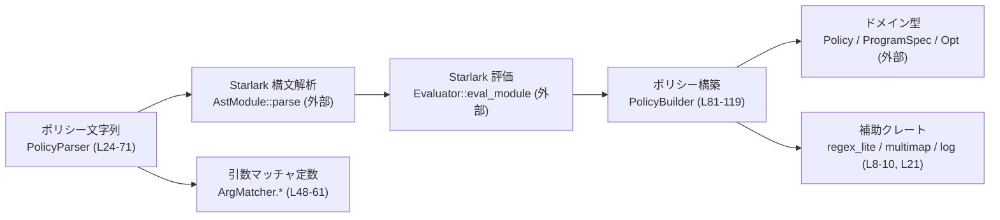
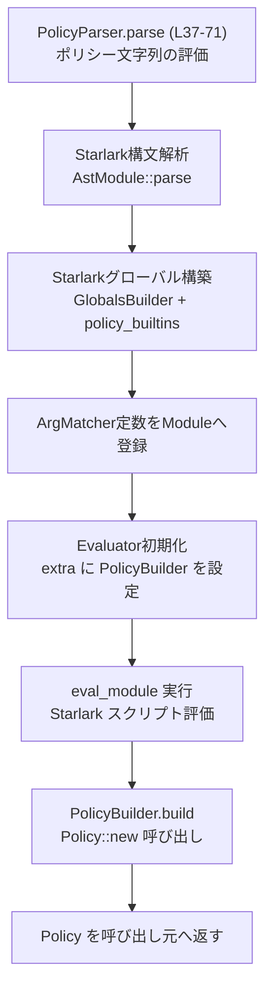
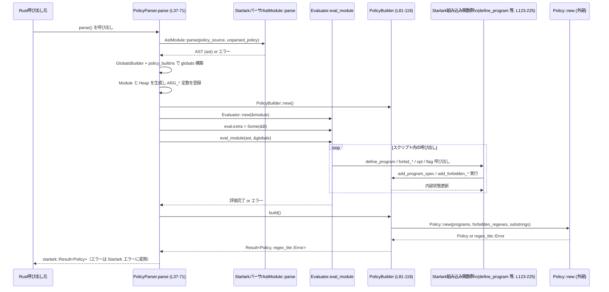

# execpolicy-legacy/src/policy_parser.rs コード解説

## 0. ざっくり一言

Starlark で書かれたポリシースクリプトを評価し、`Policy` ドメインオブジェクトに変換するための **ポリシーパーサ**と、そのための Starlark 組み込み関数群を定義するモジュールです（`execpolicy-legacy/src/policy_parser.rs:L24-71, L121-225`）。

---

## 1. このモジュールの役割

### 1.1 概要

- このモジュールは、文字列として与えられたポリシー（Starlark スクリプト）を評価し、内部表現である `Policy` に変換する役割を持ちます（`L24-71`）。
- 変換処理では、`PolicyBuilder` が Starlark 側から呼び出される組み込み関数（`define_program`, `forbid_substrings`, `forbid_program_regex`, `opt`, `flag`）を通じて設定を蓄積し、最後に `Policy::new` を呼び出して確定します（`L81-101, L121-225`）。
- Starlark スクリプトからは、各種 `ArgMatcher` 定数や `opt`/`flag` 関数を用いて、各プログラムの許可オプションや引数制約、禁止パターンを宣言的に記述できます（`L48-61, L215-225`）。

### 1.2 アーキテクチャ内での位置づけ

このモジュールは「ポリシー文字列 → Starlark 実行 → `Policy` オブジェクト」という変換の中心に位置します。



- `PolicyParser::parse` が Starlark AST の構文解析と評価の全体フローを管理します（`L37-71`）。
- `policy_builtins` で定義された組み込み関数群が Starlark 側 API となり、`PolicyBuilder` にポリシー情報を書き込みます（`L81-119, L121-225`）。
- 最終的に `PolicyBuilder::build` が `Policy::new` を呼び出し、`Policy` を生成します（`L96-101`）。

### 1.3 設計上のポイント

- **DSL としての Starlark 利用**  
  - ポリシー言語として Starlark を採用し、`policy_builtins` で専用の組み込み関数を提供しています（`L121-225`）。
- **ビルダーオブジェクト + interior mutability**  
  - `PolicyBuilder` は `RefCell` を使った内部可変な構造で、Starlark からの複数回の呼び出しを通じて状態を蓄積します（`L81-85`）。
- **Evaluator.extra による橋渡し**  
  - Starlark の `Evaluator` の `extra` フィールドに `PolicyBuilder` への参照を格納し、組み込み関数から Rust 側オブジェクトにアクセスしています（`L63-67, L172-178, L187-193, L203-209`）。
- **エラー処理の一元化**  
  - 構文解析や評価エラーは `starlark::Result` として伝播し（`L37-40, L67`）、`PolicyBuilder::build` 内部で生じた `regex_lite::Error` は `starlark::ErrorKind::Other` に変換して返しています（`L69-70`）。
- **禁止パターンの表現**  
  - 禁止すべきプログラム名を正規表現で表す `ForbiddenProgramRegex` 型と、そのリストを `Policy` に渡す設計になっています（`L74-78, L81-84, L115-118`）。

---

## 2. 主要な機能一覧

このモジュールが提供する主な機能は次の通りです。

- ポリシー文字列の解析と評価: Starlark 方言を使ってポリシーを構文解析・評価し、`Policy` を生成する（`PolicyParser::parse`, `L37-71`）。
- Starlark 組み込み関数の提供:
  - `define_program`: プログラムとそのオプション・引数制約を定義（`L123-181`）。
  - `forbid_substrings`: 禁止されるコマンド文字列の部分文字列を登録（`L183-196`）。
  - `forbid_program_regex`: 禁止プログラム名用の正規表現と理由を登録（`L198-212`）。
  - `opt`, `flag`: プログラムオプション仕様 (`Opt`) の生成（`L215-225`）。
- ArgMatcher 定数のエクスポート: Starlark 側から使う各種引数マッチャ定数 (`ARG_RFILE`, `ARG_POS_INT` など) を Starlark モジュールに登録（`L48-61`）。
- 禁止条件の内部表現:
  - `ForbiddenProgramRegex`: 正規表現と理由からなる禁止プログラムパターン（`L74-78`）。

---

## 3. 公開 API と詳細解説

### 3.0 コンポーネント一覧（型・関数インベントリー）

#### 型

| 名前 | 種別 | 公開 | 役割 / 用途 | 定義位置 |
|------|------|------|-------------|-----------|
| `PolicyParser` | 構造体 | 公開 | ポリシー文字列を受け取り、Starlark を評価して `Policy` を生成するフロントエンド | `policy_parser.rs:L24-27` |
| `ForbiddenProgramRegex` | 構造体 | 公開 | 禁止プログラムを表す正規表現と、その理由のペア | `policy_parser.rs:L74-78` |
| `PolicyBuilder` | 構造体 | 非公開 | Starlark 評価中に `ProgramSpec` や禁止条件を蓄積し、最終的に `Policy` を構築するビルダー | `policy_parser.rs:L80-85` |

#### 関数・メソッド

| 名前 | 種別 | 公開 | 役割（1 行） | 定義位置 |
|------|------|------|--------------|-----------|
| `PolicyParser::new` | `impl` メソッド | 公開 | ポリシー文字列とソース名から `PolicyParser` を作成 | `policy_parser.rs:L29-35` |
| `PolicyParser::parse` | `impl` メソッド | 公開 | Starlark でポリシーを評価し、`Policy` を返す | `policy_parser.rs:L37-71` |
| `PolicyBuilder::new` | `impl` メソッド | 非公開 | 空のビルダーを生成 | `policy_parser.rs:L88-94` |
| `PolicyBuilder::build` | `impl` メソッド | 非公開 | 蓄積した情報から `Policy` を生成 | `policy_parser.rs:L96-101` |
| `PolicyBuilder::add_program_spec` | `impl` メソッド | 非公開 | 1 つの `ProgramSpec` を MultiMap に追加 | `policy_parser.rs:L103-108` |
| `PolicyBuilder::add_forbidden_substrings` | `impl` メソッド | 非公開 | 禁止部分文字列を追加 | `policy_parser.rs:L110-113` |
| `PolicyBuilder::add_forbidden_program_regex` | `impl` メソッド | 非公開 | `ForbiddenProgramRegex` を追加 | `policy_parser.rs:L115-118` |
| `policy_builtins` | 関数（マクロ展開対象） | 非公開 | Starlark グローバル環境に組み込み関数を登録 | `policy_parser.rs:L121-225` |
| `define_program` | Starlark 組み込み | Starlark から公開 | 1 プログラムの仕様を宣言的に定義 | `policy_parser.rs:L123-181` |
| `forbid_substrings` | Starlark 組み込み | Starlark から公開 | 禁止部分文字列リストを追加 | `policy_parser.rs:L183-196` |
| `forbid_program_regex` | Starlark 組み込み | Starlark から公開 | 禁止プログラム名の正規表現と理由を追加 | `policy_parser.rs:L198-212` |
| `opt` | Starlark 組み込み | Starlark から公開 | 値をとるオプション (`Opt`) を生成 | `policy_parser.rs:L215-221` |
| `flag` | Starlark 組み込み | Starlark から公開 | フラグ型オプション (`Opt`) を生成 | `policy_parser.rs:L223-225` |

### 3.1 型一覧（構造体・列挙体など）

| 名前 | 種別 | 役割 / 用途 | 主なフィールド | 定義位置 |
|------|------|-------------|----------------|-----------|
| `PolicyParser` | 構造体 | ポリシー文字列を保持し、`parse` で `Policy` に変換するフロントエンド | `policy_source: String`, `unparsed_policy: String` | `L24-27` |
| `ForbiddenProgramRegex` | 構造体 | 禁止プログラム名マッチング用の正規表現と、その理由 | `regex: Regex`, `reason: String`（いずれも `pub`） | `L74-78` |
| `PolicyBuilder` | 構造体 | Starlark 評価中の一時的な蓄積先。`RefCell` を用いて内部可変 | `programs: RefCell<MultiMap<String, ProgramSpec>>`, `forbidden_program_regexes: RefCell<Vec<ForbiddenProgramRegex>>`, `forbidden_substrings: RefCell<Vec<String>>` | `L80-85` |

### 3.2 関数詳細（重要な 7 件）

#### `PolicyParser::new(policy_source: &str, unparsed_policy: &str) -> PolicyParser`

**概要**

- ポリシーのソース名（通常はファイル名に相当）と、その内容文字列から `PolicyParser` を生成します（`L29-35`）。

**引数**

| 引数名 | 型 | 説明 |
|--------|----|------|
| `policy_source` | `&str` | Starlark パーサに渡すソース名（エラーメッセージ等に使用される想定） |
| `unparsed_policy` | `&str` | 実際のポリシースクリプト文字列 |

**戻り値**

- `PolicyParser`: 渡された 2 つの文字列を `String` にコピーして保持する新しいインスタンスです（`L31-33`）。

**内部処理の流れ**

1. `policy_source.to_string()` と `unparsed_policy.to_string()` で所有権を持つ `String` に変換（`L31-33`）。
2. それらをフィールドに格納した `PolicyParser` インスタンスを返却（`L30-35`）。

**Examples（使用例）**

```rust
use crate::policy_parser::PolicyParser; // モジュールパスは実際の構成に依存

fn load_policy() -> starlark::Result<crate::Policy> {
    // ポリシーファイルの内容を読み込んだと仮定
    let source_name = "policy.star";                 // エラー表示などに使うソース名
    let policy_text = r#"
        # ここに Starlark でポリシー定義を書く
    "#;

    let parser = PolicyParser::new(source_name, policy_text); // Parser を作成
    parser.parse()                                            // Policy を生成
}
```

**Errors / Panics**

- このメソッド自体はエラーや panic を発生させません（単純な `String` のコピーのみ、`L31-33`）。

**Edge cases（エッジケース）**

- `policy_source` や `unparsed_policy` が空文字列でも、そのまま保持されます。後続の処理（`parse`）での扱いに依存します。

**使用上の注意点**

- `PolicyParser` は `String` を所有するため、大きなポリシーを多数同時に保持するとメモリを多く消費します。

---

#### `PolicyParser::parse(&self) -> starlark::Result<Policy>`

**概要**

- 内部に保持したポリシー文字列を Starlark として解析・評価し、`Policy` オブジェクトを構築して返します（`L37-71`）。

**引数**

| 引数名 | 型 | 説明 |
|--------|----|------|
| `&self` | `&PolicyParser` | 内部の `policy_source` と `unparsed_policy` を参照します |

**戻り値**

- `starlark::Result<Policy>`: 成功時は `Policy`、失敗時は Starlark 由来のエラー（解析・評価・正規表現エラーのラップ）を返します（`L69-70`）。

**内部処理の流れ**

1. 拡張 Dialect の設定  
   - `Dialect::Extended.clone()` し、`enable_f_strings` を有効化（`L38-39`）。

2. AST への構文解析  
   - `AstModule::parse(&self.policy_source, self.unparsed_policy.clone(), &dialect)?` を呼び出し、構文エラーがあれば即座に `Err` を返します（`L40`）。  
   - `self.unparsed_policy.clone()` により `String` を複製してパーサに渡しています。

3. グローバル環境の構築  
   - `GlobalsBuilder::extended_by(&[LibraryExtension::Typing])` で Typing 拡張を有効化（`L41`）。
   - `.with(policy_builtins)` により、本モジュールの Starlark 組み込み関数群を登録（`L42`）。
   - `.build()` で `globals` を生成（`L41-43`）。

4. Starlark モジュールとヒープのセットアップ  
   - `Module::new()` で空のモジュールを作成（`L44`）。
   - `Heap::new()` で Starlark 値を格納するヒープを作成（`L46`）。
   - 各種 `ArgMatcher` 定数 (`ARG_RFILE` など) をヒープに確保してモジュールに登録（`L48-61`）。

5. PolicyBuilder と Evaluator の準備  
   - `PolicyBuilder::new()` で空のビルダーを作成（`L63`）。
   - `Evaluator::new(&module)` で評価器を作り、`eval.extra = Some(&policy_builder)` により Starlark 側から `PolicyBuilder` にアクセスできるようにする（`L65-66`）。
   - `eval.eval_module(ast, &globals)?` で AST を評価。評価エラーがあれば `Err` を返します（`L67`）。

6. Policy の構築とエラー変換  
   - `policy_builder.build()` で `Policy` を構築（`L69`）。
   - ここで `regex_lite::Error` が発生した場合は、`starlark::ErrorKind::Other(e.into())` にラップしてエラーとして返します（`L69-70`）。

**簡易フローチャート**



**Examples（使用例）**

```rust
use crate::policy_parser::PolicyParser; // 実際のパスはプロジェクト構成に依存

fn main() -> Result<(), Box<dyn std::error::Error>> {
    // Starlark で記述された簡単なポリシー
    let policy_text = r#"
def _():
    # 例: /bin/ls のプログラム仕様を定義
    define_program(
        program = "/bin/ls",
        system_path = ["PATH"],
        option_bundling = False,
        combined_format = False,
        options = [
            flag("-l"),
            opt("--color", ARG_OPAQUE_VALUE),
        ],
        args = [ARG_RFILES],
    )
"#;

    let parser = PolicyParser::new("example_policy.star", policy_text); // パーサ作成
    let policy = parser.parse()?;                                      // Policy を取得
    // ここで policy を利用する
    Ok(())
}
```

**Errors / Panics**

- `AstModule::parse` での構文エラー → `Err(starlark::Error)` として返る（`L40`）。
- `eval.eval_module` での実行エラー（組み込み関数からの `Err` 含む） → `Err` として返る（`L67`）。
- `PolicyBuilder::build` → `Policy::new` での `regex_lite::Error` は `ErrorKind::Other` として返る（`L69-70`）。
- `parse` 内で直接 `unwrap` は使っておらず、このメソッド自体は panic を発生させません（pankc は組み込み関数側のみ、`L172-178` など）。

**Edge cases（エッジケース）**

- `unparsed_policy` が空文字列の場合: `AstModule::parse` が空モジュールとして受理するかエラーにするかは外部クレート依存で、このチャンクからは断定できません（`L40`）。
- どの組み込み関数も呼ばれないポリシー: `PolicyBuilder` のフィールドはデフォルトの空コレクションのまま `Policy::new` に渡されます（`L88-94, L96-100`）。`Policy::new` がこれをどう扱うかはこのチャンクには現れません。
- 評価途中で `forbid_program_regex` に無効な正規表現が渡された場合: `Regex::new` がエラーを返し、その時点で評価が失敗します（`L198-212`）。

**使用上の注意点**

- `parse` は `&self` を受け取るため、同じ `PolicyParser` インスタンスに対して複数回呼び出すことができますが、内部ポリシー文字列は変化しないため**同一の `Policy` が返る**点に注意が必要です（`L24-27, L37-71`）。
- `PolicyParser` 自体は共有状態を持たないため、このモジュールのコードを見る限り、複数スレッドから同時に `parse` を呼び出しても共有変数のレースコンディションは生じません。ただし、`starlark` クレートのスレッド安全性は別途確認が必要です（このチャンクには情報がありません）。

---

#### `PolicyBuilder::build(self) -> Result<Policy, regex_lite::Error>`

**概要**

- `PolicyBuilder` に蓄積されたデータ構造を取り出し、それらを `Policy::new` に渡して最終的な `Policy` を構築します（`L96-101`）。

**引数**

| 引数名 | 型 | 説明 |
|--------|----|------|
| `self` | `PolicyBuilder` | 所有権をムーブして受け取り、内部の `RefCell` を破棄しながら中身を取り出します |

**戻り値**

- `Result<Policy, regex_lite::Error>`: 成功時に `Policy` を返し、失敗時は `Policy::new` からの `regex_lite::Error` を返します（`L96-101`）。

**内部処理の流れ**

1. `self.programs.into_inner()` で `RefCell` から `MultiMap<String, ProgramSpec>` を取り出し（`L97`）。
2. `self.forbidden_program_regexes.into_inner()` で禁止正規表現の `Vec<ForbiddenProgramRegex>` を取り出し（`L98`）。
3. `self.forbidden_substrings.into_inner()` で `Vec<String>` を取り出す（`L99`）。
4. `Policy::new(programs, forbidden_program_regexes, forbidden_substrings)` を呼び、`Result<Policy, regex_lite::Error>` を返す（`L100`）。

**Examples（使用例）**

`PolicyBuilder::build` は通常、`PolicyParser::parse` 経由でしか呼ばれません（`L63-71`）。直接使用する場合は、組み込み関数群を通じて状態を構築する必要があります。

**Errors / Panics**

- `Policy::new` が `regex_lite::Error` を返す場合に、それをそのまま `Err` として返します（`L100`）。
  - 具体的にどのような条件でエラーになるかは、このチャンクには現れません（`Policy::new` の定義不明）。

**Edge cases（エッジケース）**

- すべてのコレクションが空（プログラム定義も禁止条件もなし）の場合でも、そのまま `Policy::new` に渡されます。この挙動の詳細は `Policy::new` に依存します。

**使用上の注意点**

- `self` を消費するメソッドであり、一度 `build` を呼んだ `PolicyBuilder` を再利用して再度ビルドすることはできません（`L96`）。
- `RefCell` の `into_inner` を使っているため、`build` 実行時点で未解放の可変借用が残っているとパニックする可能性がありますが、通常は `PolicyParser::parse` の評価が完了した後に呼び出されるため、このパターンでは問題ありません（`L63-71, L96-101`）。

---

#### `PolicyBuilder::add_program_spec(&self, program_spec: ProgramSpec)`

**概要**

- 1 つの `ProgramSpec` をログに出力しつつ、プログラム名をキーとする `MultiMap` に追加します（`L103-108`）。

**引数**

| 引数名 | 型 | 説明 |
|--------|----|------|
| `&self` | `&PolicyBuilder` | 内部の `RefCell` を通じて可変アクセスします |
| `program_spec` | `ProgramSpec` | 追加するプログラム仕様。`program` フィールドからキーとなる名前を取得します（`L105`） |

**戻り値**

- なし（`()`）。エラーは返さず、パニックもしません（`L103-108`）。

**内部処理の流れ**

1. `info!("adding program spec: {program_spec:?}")` でデバッグログを出力（`L104`）。
2. `let name = program_spec.program.clone();` でプログラム名を取得・複製（`L105`）。
3. `self.programs.borrow_mut()` で `MultiMap` への可変参照を取得（`L106`）。
4. `programs.insert(name, program_spec);` で MultiMap に追加（`L107`）。

**Examples（使用例）**

- 通常は `define_program` 組み込み関数から呼ばれます（`L172-180`）。

**Errors / Panics**

- `RefCell::borrow_mut()` が二重可変借用のときにパニックしますが、Starlark 評価は単一スレッドで逐次的に組み込み関数を処理する想定であり、このチャンク内に並行的に同じ `PolicyBuilder` にアクセスするコードはありません（`L63-71, L103-107`）。

**Edge cases**

- 同じ `program` 名で複数の `ProgramSpec` が追加された場合も MultiMap に複数エントリとして保持されます（`L82-83, L107`）。重複の扱いは `Policy` 側の実装に依存します。

**使用上の注意点**

- 重複チェックなどは本メソッドでは行わず、`define_program` 側でフラグ名の重複のみチェックしている点に注意が必要です（`L141-149`）。

---

#### `define_program<'v>(...) -> anyhow::Result<NoneType>`

**概要**

- Starlark 側から 1 つのプログラムの仕様（パス、オプション、引数マッチャ、テスト例など）を宣言的に定義し、それを `PolicyBuilder` に登録します（`L123-181`）。

**引数**

| 引数名 | 型 | 説明 |
|--------|----|------|
| `program` | `String` | 対象プログラム（コマンド）のパスまたは名前（`L124`） |
| `system_path` | `Option<UnpackList<String>>` | 環境変数名などのリスト。`None` の場合は空リスト（`L125, L136`） |
| `option_bundling` | `Option<bool>` | オプションの束ね書きを許可するか（`-abc` 形式など）。`None` なら `false`（`L126, L135`） |
| `combined_format` | `Option<bool>` | 結合形式のオプションを許可するかどうか。`None` なら `false`（`L127-137`） |
| `options` | `Option<UnpackList<Opt>>` | 利用可能なオプション一覧。`None` なら空リスト（`L128, L138`） |
| `args` | `Option<UnpackList<ArgMatcher>>` | 位置引数のマッチャ一覧。`None` なら空リスト（`L129, L139`） |
| `forbidden` | `Option<String>` | このプログラム自体を禁止する理由などの文字列と推測されますが、`ProgramSpec::new` の仕様はこのチャンクからは不明です（`L130, L152-160`）。 |
| `should_match` | `Option<UnpackList<UnpackList<String>>>` | 許可されるべきコマンドライン例のリスト（多重リスト）。`None` なら空リスト（`L131, L160-164`）。 |
| `should_not_match` | `Option<UnpackList<UnpackList<String>>>` | 禁止されるべきコマンドライン例のリストと推測されます（`L132, L165-169`）。 |
| `eval` | `&mut Evaluator` | `extra` から `PolicyBuilder` を取得するための評価器（`L133, L172-178`）。 |

**戻り値**

- `anyhow::Result<NoneType>`: 成功時は `Starlark` の `None` を表す `NoneType` を返し、エラー時は `anyhow::Error` を返します（`L134, L148-149, L180-181`）。

**内部処理の流れ**

1. `option_bundling` と `combined_format` の `Option<bool>` を `unwrap_or(false)` で `bool` に変換（`L135, L137`）。
2. `system_path`, `options`, `args` の `Option<UnpackList<...>>` をそれぞれ `Vec<...>` に変換し、`None` の場合は空ベクタにする（`L136-139`）。
3. `HashMap<String, Opt>` を生成し、`options` 内の各 `Opt` を `name` をキーとして登録。  
   - 同じ名前が 2 回以上出現した場合は `Err(anyhow::format_err!("duplicate flag: {name}"))` を返す（`L141-149`）。
4. `ProgramSpec::new(...)` を呼んで `program_spec` を構築（`L152-170`）。  
   - `should_match` / `should_not_match` は `Vec<Vec<String>>` に変換されます（`L160-169`）。
5. `eval.extra` から `PolicyBuilder` を取り出し（`as_ref().unwrap().downcast_ref::<PolicyBuilder>().unwrap()`）、`add_program_spec` で登録（`L172-180`）。
6. `Ok(NoneType)` を返す（`L180-181`）。

**Examples（Starlark 側からの使用例のイメージ）**

※ Starlark 側のコードは推測になりますが、関数シグネチャから以下のような利用が想定されます。

```python
# policy.star の一部（参考イメージ）
define_program(
    program = "/usr/bin/grep",
    system_path = ["PATH"],
    option_bundling = True,
    combined_format = False,
    options = [
        flag("-i"),
        opt("-e", ARG_OPAQUE_VALUE),
    ],
    args = [ARG_RFILE],
    should_match = [
        ["grep", "-i", "pattern", "file.txt"],
    ],
    should_not_match = [
        ["grep", "-r", "pattern", "/"],
    ],
)
```

**Errors / Panics**

- **エラー条件**
  - 同一名前の `Opt` が複数回 `options` に含まれている場合、`duplicate flag: {name}` というメッセージで `Err` を返す（`L141-149`）。
  - `ProgramSpec::new` 自体のエラー条件はこのチャンクでは不明ですが、`anyhow::Result` ではなく直接 `ProgramSpec` を返しているため、少なくとも `define_program` 内では発生しません（`L152-170`）。
- **panic 条件**
  - `eval.extra` が `None` の場合、`unwrap()` で panic（`L175-176`）。
  - `eval.extra` が `PolicyBuilder` 以外の型の場合、`downcast_ref::<PolicyBuilder>().unwrap()` で panic（`L177-178`）。

**Edge cases（エッジケース）**

- `options` が `None` または空の場合でも `HashMap` は空のまま `ProgramSpec::new` に渡されます（`L138, L141`）。
- `should_match` / `should_not_match` が `None` の場合は空の `Vec<Vec<String>>` になります（`L160-169`）。
- `system_path` が `None` の場合、環境変数などの探索パスは空リストになります（`L136`）。
- `option_bundling`, `combined_format` が与えられない場合は `false` になるため、オプションの束ね書きや結合形式は許可されない設定になります（`L135, L137`）。

**使用上の注意点**

- `PolicyParser::parse` の内部でしか利用しない前提で `eval.extra` の `unwrap` を行っているため、`policy_builtins` を他の `Evaluator` に流用する場合は **必ず `extra` に `PolicyBuilder` を設定する必要があります**（`L172-178`）。
- Starlark の呼び出し側から見ると、フラグ名の重複はポリシー定義エラーとして扱われるため、ポリシーファイル作成時に注意が必要です（`L141-149`）。

---

#### `forbid_program_regex(regex: String, reason: String, eval: &mut Evaluator) -> anyhow::Result<NoneType>`

**概要**

- 禁止すべきプログラム名を正規表現 `regex` として登録し、その理由 `reason` とともに `PolicyBuilder` に追加します（`L198-212`）。

**引数**

| 引数名 | 型 | 説明 |
|--------|----|------|
| `regex` | `String` | プログラム名にマッチさせる正規表現パターン（`L199`） |
| `reason` | `String` | なぜ禁止されているかの説明文（`L200`） |
| `eval` | `&mut Evaluator` | `extra` から `PolicyBuilder` を取り出すための評価器（`L201-209`） |

**戻り値**

- `anyhow::Result<NoneType>`: 成功時は `NoneType`、無効な正規表現などでエラーの場合は `anyhow::Error` です（`L202, L210-212`）。

**内部処理の流れ**

1. `eval.extra` から `PolicyBuilder` への参照を `unwrap` + `downcast_ref` で取り出す（`L203-209`）。
2. `regex_lite::Regex::new(&regex)?` で正規表現をコンパイル（`L210`）。
3. 成功した `Regex` と `reason` を `policy_builder.add_forbidden_program_regex` で登録（`L211`）。
4. `Ok(NoneType)` を返す（`L212`）。

**Examples（Starlark 側からの利用イメージ）**

```python
# 禁止したいプログラム名パターンを登録する例
forbid_program_regex(
    regex = ".*rm$",
    reason = "ファイル削除コマンドの使用を禁止するため",
)
```

**Errors / Panics**

- **エラー条件**
  - `regex` が無効なパターンの場合、`Regex::new` がエラーとなり `?` により `anyhow::Error` が返されます（`L210`）。
- **panic 条件**
  - `define_program` と同様、`eval.extra` が `PolicyBuilder` でない場合や `None` の場合、`unwrap` で panic します（`L203-209`）。

**Edge cases**

- 同じ `regex` が複数回登録されても特にチェックは行われず、そのまま複数の `ForbiddenProgramRegex` として保持されます（`L115-118, L210-211`）。
- 空文字列の `regex` が渡された場合でも、`Regex::new` の仕様次第で受理されるかエラーになります。この詳細は `regex_lite` クレートに依存し、このチャンクには記述がありません。

**使用上の注意点**

- 禁止パターンが多すぎると、後段のチェック処理でパフォーマンスに影響する可能性があります（ただし、`regex_lite` は線形時間マッチングを意図した実装であり、典型的な「ReDoS」のリスクは小さいとされています）。
- 理由 `reason` は UI やログ出力で利用される可能性が高いため、ユーザーに分かりやすいメッセージを記述することが前提となります（`L74-78, L115-118`）。

---

#### `opt(name: String, r#type: ArgMatcher, required: Option<bool>) -> anyhow::Result<Opt>`

**概要**

- 値付きオプションを表す `Opt` オブジェクトを生成する Starlark 組み込み関数です（`L215-221`）。

**引数**

| 引数名 | 型 | 説明 |
|--------|----|------|
| `name` | `String` | オプション名（例: `"-o"`, `"--output"`）（`L215-216`） |
| `r#type` | `ArgMatcher` | 値の型を表す引数マッチャ。`arg_type()` メソッドで `OptMeta::Value` 用の型情報を取得（`L215-218`） |
| `required` | `Option<bool>` | 必須オプションかどうか。`None` なら `false`（必須ではない）（`L215, L219`） |

**戻り値**

- `anyhow::Result<Opt>`: 成功時は `Opt`、エラーは現状ここでは発生しません（`L215-221`）。

**内部処理の流れ**

1. `r#type.arg_type()` を呼び出して、`OptMeta::Value` に埋め込む型情報を取得（`L218`）。
2. `required.unwrap_or(false)` で必須フラグを決定（`L219`）。
3. `Opt::new(name, OptMeta::Value(...), required_flag)` を呼び出し、その結果を `Ok(...)` で返す（`L216-220`）。

**Examples（Starlark 側の利用イメージ）**

```python
# 値を取るオプション --file を定義
file_opt = opt(
    name = "--file",
    type = ARG_RFILE,
    required = True,
)
```

**Errors / Panics**

- この関数内で `unwrap` は使用されておらず、`Opt::new` が panic しない限りはエラーも panic も発生しません（`L215-221`）。`Opt::new` の詳細はこのチャンクには現れません。

**Edge cases**

- `required = None` とした場合、必須ではないオプションとして扱われます（`L219`）。
- オプション名が空文字列でも `Opt::new` にそのまま渡されます。許可されるかどうかは `Opt` 型の仕様次第です。

**使用上の注意点**

- `ArgMatcher` によって値の種類（ファイルパス、整数など）が変わるため、適切なマッチャを指定する必要があります（`L48-61, L215-219`）。
- `opt` 自体は `PolicyBuilder` と直接は関係せず、`define_program` の `options` 引数として渡されることで `Policy` に取り込まれます（`L128, L138, L141-149, L152-170`）。

---

#### `forbid_substrings(strings: UnpackList<String>, eval: &mut Evaluator) -> anyhow::Result<NoneType>`

**概要**

- コマンドライン文字列に含まれていると禁止される「部分文字列」を複数まとめて登録します（`L183-196`）。

**引数**

| 引数名 | 型 | 説明 |
|--------|----|------|
| `strings` | `UnpackList<String>` | 禁止部分文字列のリスト（`L184, L194`） |
| `eval` | `&mut Evaluator` | `extra` から `PolicyBuilder` を取り出す評価器（`L185-193`） |

**戻り値**

- `anyhow::Result<NoneType>`: 成功時に `NoneType` を返し、`eval.extra` 関連の不整合があれば panic（`L187-195`）。

**内部処理の流れ**

1. `eval.extra` から `PolicyBuilder` を取り出す（`L187-193`）。
2. `strings.items.to_vec()` で `Vec<String>` を生成し、それを参照で `add_forbidden_substrings` に渡す（`L194`）。
3. `Ok(NoneType)` を返す（`L195-196`）。

**Errors / Panics**

- この関数自体は `Result::Ok` しか返しませんが、`eval.extra` の `unwrap` が失敗すると panic します（`L187-193`）。

**Edge cases**

- 空リストの場合、何も追加されません（`L184, L194`）。
- 同じ部分文字列を複数回登録しても、そのまま `Vec<String>` に追加されます（`L110-113, L194`）。

**使用上の注意点**

- 「部分文字列」はコマンド名全体ではなく、その一部にマッチする文字列である点に注意が必要です（具体的な評価ロジックは `Policy` 側に依存します）。

---

### 3.3 その他の関数

| 関数名 | 役割（1 行） | 定義位置 |
|--------|--------------|-----------|
| `PolicyBuilder::new` | 空の `PolicyBuilder` を生成し、各コレクションを空で初期化する | `policy_parser.rs:L88-94` |
| `PolicyBuilder::add_forbidden_substrings` | 禁止部分文字列を内部の `Vec<String>` に追加する | `policy_parser.rs:L110-113` |
| `PolicyBuilder::add_forbidden_program_regex` | 正規表現と理由のペアを `Vec<ForbiddenProgramRegex>` に追加する | `policy_parser.rs:L115-118` |
| `policy_builtins` | `GlobalsBuilder` に `define_program` などの組み込み関数を登録するマクロ定義関数 | `policy_parser.rs:L121-225` |
| `flag` | boolean フラグ型の `Opt` を生成する Starlark 組み込み関数 | `policy_parser.rs:L223-225` |

---

## 4. データフロー

ここでは、`PolicyParser::parse` を呼び出して `Policy` を得るまでの代表的なデータフローを示します。

### 4.1 処理の要点

1. Rust 側で `PolicyParser::parse` が呼ばれ、Starlark スクリプトが AST にパースされます（`L37-40`）。
2. `policy_builtins` によって定義された Starlark 組み込み関数群および `ARG_*` 定数が、評価環境に組み込まれます（`L41-43, L48-61, L121-225`）。
3. Starlark スクリプトが実行され、`define_program`、`forbid_substrings`、`forbid_program_regex` 等が呼ばれて `PolicyBuilder` に設定が蓄積されます（`L63-67, L123-212`）。
4. 評価後、`PolicyBuilder::build` が `Policy::new` を呼び出して最終的な `Policy` を生成します（`L69-70, L96-101`）。

### 4.2 シーケンス図



---

## 5. 使い方（How to Use）

### 5.1 基本的な使用方法（Rust 側）

`PolicyParser` を使って Starlark ポリシーを読み込む典型的な流れです。

```rust
use crate::policy_parser::PolicyParser; // 実際のパスはプロジェクト構成に依存
use crate::Policy;                      // Policy 型も同一クレートからインポートすると仮定

fn load_policy_from_str(source_name: &str, policy_text: &str) -> starlark::Result<Policy> {
    // PolicyParser を初期化する（文字列の所有権を内部にコピー）
    let parser = PolicyParser::new(source_name, policy_text);      // L29-35

    // Starlark を解析・評価し、Policy を構築する
    let policy = parser.parse()?;                                  // L37-71

    Ok(policy)                                                     // 呼び出し元に返す
}
```

### 5.1 基本的な使用方法（Starlark 側ポリシー）

Starlark 側で利用できる主なビルトインと定数は以下です（`L48-61, L121-225`）。

- 定数（Starlark グローバル変数として利用可能）
  - `ARG_OPAQUE_VALUE`, `ARG_RFILE`, `ARG_WFILE`, `ARG_RFILES`, `ARG_RFILES_OR_CWD`, `ARG_POS_INT`, `ARG_SED_COMMAND`, `ARG_UNVERIFIED_VARARGS`（`L48-61`）。
- 関数
  - `define_program(...)`
  - `forbid_substrings([...])`
  - `forbid_program_regex(regex, reason)`
  - `opt(name, type, required=None)`
  - `flag(name)`

イメージとしては次のようなポリシーになります（挙動の詳細は外部型に依存します）。

```python
# policy.star の例（イメージ）

# 危険なコマンドを禁止
forbid_program_regex(".*rm$", "rm コマンドの使用は許可されていません")
forbid_substrings(["; rm -rf /"])

# /bin/ls の振る舞いを定義
define_program(
    program = "/bin/ls",
    system_path = ["PATH"],
    option_bundling = False,
    combined_format = False,
    options = [
        flag("-l"),
        flag("-a"),
        opt("--color", ARG_OPAQUE_VALUE),
    ],
    args = [ARG_RFILES],
)
```

### 5.2 よくある使用パターン

- **複数のポリシーをロードする**

```rust
fn load_multiple_policies(policies: Vec<(&str, &str)>) -> Vec<starlark::Result<crate::Policy>> {
    policies
        .into_iter()
        .map(|(name, text)| {
            let parser = PolicyParser::new(name, text); // 毎回新しい Parser を作成
            parser.parse()                              // Policy を生成
        })
        .collect()
}
```

- **一つのポリシーを何度も評価する**

同じ `PolicyParser` に対して `parse` を複数回呼び出すことは可能です（`&self` で受け取るため、`L37`）。  
ただし、結果は常に同一のポリシーとなるため、通常は 1 回だけ評価して `Policy` をキャッシュするほうが効率的です。

### 5.3 よくある間違い

```python
# 間違い例: 同じオプション名を重複定義している
define_program(
    program = "/usr/bin/grep",
    options = [
        flag("-i"),
        flag("-i"),  # 同じフラグ名が2回
    ],
)

# 実際の挙動: define_program 内で duplicate flag エラーになる（L141-149）
```

```python
# 間違い例: 無効な正規表現を渡している
forbid_program_regex("[unclosed", "理由")

# 実際の挙動: Regex::new がエラーになり、ポリシー評価が失敗（L210）
```

```rust
// 間違い例: PolicyBuilder をセットせずに policy_builtins を直接使う（イメージ）
use starlark::environment::GlobalsBuilder;

fn wrong_usage() {
    let mut globals = GlobalsBuilder::extended_by(&[starlark::environment::LibraryExtension::Typing])
        .with(crate::policy_parser::policy_builtins)  // 直接利用
        .build();

    // extra に PolicyBuilder が設定されていない Evaluator で実行すると、
    // define_program 内の unwrap が panic する（L172-178, L187-193, L203-209）
}
```

### 5.4 使用上の注意点（まとめ）

- **Evaluator.extra の前提条件**  
  - `policy_builtins` で定義された組み込み関数を使う場合、`Evaluator.extra` に **必ず `PolicyBuilder` への参照** をセットする必要があります（`L63-67, L172-178, L187-193, L203-209`）。  
  - これを満たさないと `unwrap` による panic が発生します。

- **RefCell とスレッド安全性**  
  - `PolicyBuilder` は `RefCell` により内部可変ですが、`RefCell` はスレッド安全ではありません（`L81-85`）。  
  - 本コードでは `PolicyBuilder` は `PolicyParser::parse` 内のローカル変数であり、単一スレッドの Evaluator からのみアクセスされているため、このチャンク単体ではデータ競合の兆候は見られません（`L63-71`）。

- **エラー処理の境界**  
  - Starlark スクリプト内での論理的なエラー（重複フラグ名、無効な正規表現など）は `starlark::Error` として Rust 側に返ります（`L141-149, L198-212, L69-70`）。  
  - 呼び出し側では `parse()` の戻り値を必ずチェックする必要があります。

- **パフォーマンス上の注意**  
  - `unparsed_policy.clone()` によりポリシー文字列がコピーされるため、非常に大きなポリシーファイルの場合はコストになります（`L40`）。  
  - ただし、`parse` は通常 1 回しか呼び出さない使い方が想定され、実務上は問題になりにくいと考えられます。

- **テストに関する補足**  
  - このチャンク内にはテストコードは現れません。  
  - 振る舞いを検証するには、Starlark のポリシーファイルを用意し、`parse()` の結果得られた `Policy` に対して期待されるプログラム定義・禁止条件が含まれているかを確認するユニットテストを追加するのが自然です。

---

## 6. 変更の仕方（How to Modify）

### 6.1 新しい機能を追加する場合

1. **新しい ArgMatcher 定数を Starlark から使いたい場合**  
   - `ArgMatcher` に新しいバリアントやメソッドを追加（別ファイル。`crate::arg_matcher` モジュールで定義されていると推測されます）。  
   - `PolicyParser::parse` 内の `module.set("ARG_...", ...)` の箇所に対応する定数登録を追加します（`L48-61`）。

2. **新しい Starlark 組み込み関数を追加したい場合**  
   - `policy_builtins` の中に新しい `fn ...` を追加し、必要であれば `PolicyBuilder` に新たなフィールドとメソッドを追加します（`L81-85, L121-225`）。
   - 新関数内で `Evaluator` の `extra` から `PolicyBuilder` を取得するパターンは既存の `forbid_substrings` / `forbid_program_regex` を踏襲できます（`L187-193, L203-209`）。

3. **Policy への新たな設定項目を追加する場合**  
   - `PolicyBuilder` に対応するフィールド（`RefCell<...>`）と setter メソッドを追加（`L81-85, L88-118`）。
   - `build` の中で `into_inner()` を使って取り出し、`Policy::new` のシグネチャを対応するように変更（`L96-101`）。

### 6.2 既存の機能を変更する場合

- **`define_program` の引数仕様を変更する場合**
  - Starlark 側の API であるため、互換性への影響が大きい点に注意が必要です。  
  - 変更時には:
    - シグネチャ（引数の追加・削除）を `policy_builtins` 内で調整（`L123-133`）。
    - `ProgramSpec::new` のシグネチャと対応させる（`L152-170`）。
    - 既存ポリシーファイルに対する後方互換性をどう扱うかを検討します。

- **エラーメッセージやログの変更**
  - 重複フラグ名のメッセージ `"duplicate flag: {name}"` を変更する場合は `define_program` 内を修正（`L148-149`）。
  - プログラム仕様追加時のログフォーマットは `PolicyBuilder::add_program_spec` 内を修正（`L104`）。

- **panic を避けたい場合**
  - `eval.extra` に対する `unwrap` を安全なパターン（`if let Some(extra) = eval.extra` など）に差し替えることができます（`L175-178, L189-193, L205-209`）。  
  - その場合、Starlark 側へのエラー伝播方法（`anyhow::Error` を返す等）を決める必要があります。

- **影響範囲の確認方法**
  - `Policy`, `ProgramSpec`, `Opt`, `ArgMatcher` はすべて他モジュールの型であり（`L3-7`）、これらのシグネチャ変更は全体に広く影響します。
  - `rg "define_program" -n` のようなコマンドでポリシーファイルやテストコードの使用箇所を列挙し、動作確認する必要があります（実際のパスはこのチャンクからは不明）。

---

## 7. 関連ファイル

このモジュールと密接に関係する型・モジュールは、`use` 宣言から次のように推測されます（正確なファイルパスはこのチャンクには現れません）。

| パス / モジュール | 役割 / 関係 |
|-------------------|------------|
| `crate::Policy` | 最終的なポリシーオブジェクトの型。`PolicyBuilder::build` から `Policy::new` が呼ばれる（`policy_parser.rs:L4, L96-101`）。 |
| `crate::ProgramSpec` | 各プログラムの仕様を表すドメイン型。`define_program` で構築され、`PolicyBuilder` に蓄積される（`L5, L82-83, L103-108, L152-170`）。 |
| `crate::Opt` / `crate::opt::OptMeta` | コマンドラインオプションの仕様を表す型。`opt`/`flag` 組み込み関数で生成され、`define_program` の `options` で使用される（`L3, L7, L128, L141-149, L215-221, L223-225`）。 |
| `crate::arg_matcher::ArgMatcher` | 引数マッチングロジックを表す型。Starlark 側の `ARG_*` 定数や `opt` の `type` 引数で使用される（`L6, L48-61, L129, L215-219`）。 |
| 外部クレート `starlark` | Starlark 言語のパーサ・評価器・値表現を提供。`AstModule`, `Dialect`, `GlobalsBuilder`, `Evaluator`, `Heap` などを使用（`L11-20, L37-71, L121-225`）。 |
| 外部クレート `regex_lite` | 禁止プログラム名の正規表現コンパイル・マッチングを提供。`ForbiddenProgramRegex` と `forbid_program_regex` で利用（`L10, L74-78, L96-101, L115-118, L198-212`）。 |
| 外部クレート `multimap::MultiMap` | 同じキーに複数の `ProgramSpec` を格納するコレクションとして使用（`L9, L82-83, L90, L103-108`）。 |
| 外部クレート `log` | プログラム仕様追加時のログ出力に使用（`L8, L103-104`）。 |

---

### Bugs / Security 観点の補足（このファイルから読み取れる範囲）

- **panic リスク（契約違反時）**  
  - `define_program`, `forbid_substrings`, `forbid_program_regex` で `eval.extra` や `downcast_ref` に対して `unwrap` を使用しているため、`Evaluator` に `PolicyBuilder` を設定せずにこれらの組み込み関数を実行すると **必ず panic** します（`L172-178, L187-193, L203-209`）。  
  → `policy_builtins` を他用途で流用する場合のセキュリティ / 安定性上の注意点となります。

- **正規表現の安全性**  
  - 正規表現は `regex_lite` クレートでコンパイルされており、一般的な PCRE とは異なりカタストロフィック・バックトラッキングによる ReDoS のリスクが抑えられている実装とされています。  
  - それでも禁止パターンの数が多すぎる場合のパフォーマンス影響は、`Policy` 側の利用方法に依存します。

- **入力バリデーション**  
  - Starlark 組み込み関数は型レベルではある程度安全（`UnpackList<String>` や `ArgMatcher` など）ですが、論理的な整合性（例: 空のプログラム名、意味を成さない `should_match`）についてはこのファイルでは特に検証していません（`L123-170`）。  
  → これらは `Policy` や実行時チェック側で扱う前提と思われますが、このチャンクからは断定できません。

以上が、このファイル単体から読み取れる構造と挙動、および安全性・エラー・並行性の観点での整理です。
