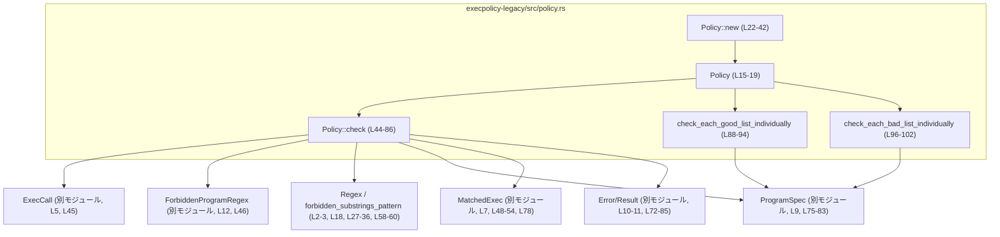
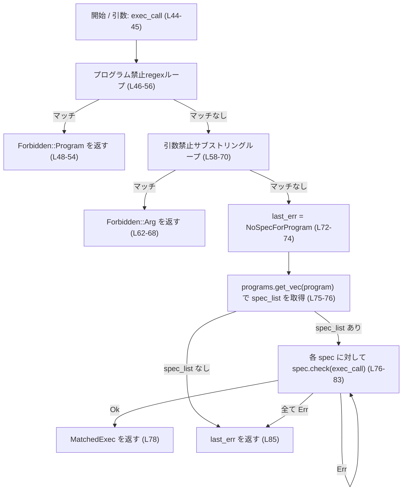

# execpolicy-legacy/src/policy.rs

## 0. ざっくり一言

- 外部コマンド実行（`ExecCall`）に対して、「禁止プログラム」「禁止サブストリング」「個別のプログラム仕様（`ProgramSpec`）」の3段階でチェックを行うポリシー本体 `Policy` を定義するモジュールです。[execpolicy-legacy/src/policy.rs:L15-19, L44-86]

---

## 1. このモジュールの役割

### 1.1 概要

- このモジュールは、実行しようとしているプログラム呼び出し（`ExecCall`）が許可されるべきかどうかを判定するためのポリシーを表現します。[L5, L7, L44-86]
- ポリシーは、プログラム名ごとの仕様（`ProgramSpec`）の集合、禁止プログラム名を表す正規表現リスト（`ForbiddenProgramRegex`）、引数に含まれてはいけないサブストリングの正規表現の3つから構成されます。[L15-19, L22-25, L46, L58-60]
- さらに、仕様に付属する良い例／悪い例（ポジティブ／ネガティブ例）を一括で検証するユーティリティメソッドも提供します。[L88-102]

### 1.2 アーキテクチャ内での位置づけ

このモジュールは、実行ポリシー判定の中核として、他モジュールの型を集約して利用します。

- `Policy` は
  - 入力として `ExecCall` を受け取り、[L44]
  - 内部に保持する `programs: MultiMap<String, ProgramSpec>` から該当プログラムの仕様を引き出し、[L15-17, L75-76]
  - 直列に `ProgramSpec::check` を呼びます。[L76-83]
- その前に、より粗い粒度の禁止条件として
  - `ForbiddenProgramRegex` のリストでプログラム名自体を拒否し、[L46-56]
  - 必要に応じて禁止サブストリング正規表現で引数を拒否します。[L58-70]
- 結果として `MatchedExec` もしくは `Error` を返す設計になっています。[L44, L72-85]



> 注: `ExecCall`, `ProgramSpec`, `ForbiddenProgramRegex`, `MatchedExec`, `Error`, `Result` などの定義本体はこのチャンクには現れません。

### 1.3 設計上のポイント

- **読み取り専用のポリシーオブジェクト**
  - `Policy` のフィールドはすべて非公開で、メソッドはすべて `&self` を取り内部状態を変更しません。[L15-19, L44, L88, L96]
  - 一度構築したポリシーを参照専用で使い回す設計になっています。

- **段階的な拒否ロジック**
  1. 禁止プログラム名（正規表現）で即座に拒否。[L46-56]
  2. 引数中の禁止サブストリングで拒否。[L58-70]
  3. 該当プログラムの `ProgramSpec` 群で詳細チェック。[L72-85]

- **複数仕様のサポート**
  - `MultiMap<String, ProgramSpec>` により、1つのプログラム名に複数の仕様（`ProgramSpec`）を紐付けられます。[L16, L75-83]
  - `ProgramSpec::check` を順に試し、最初に成功したものの結果を返します。[L76-78]

- **エラーハンドリングの方針**
  - `crate::error::Result` を返すことで、正常系（`MatchedExec`）と異常系（`Error`）を明確に分けています。[L10-11, L44, L72-85]
  - 仕様が見つからない場合は `Error::NoSpecForProgram` を返し、仕様があるがすべて失敗した場合は「最後に失敗した仕様」からのエラーを返します。[L72-85]

- **並行性**
  - `unsafe` やスレッド同期プリミティブ（`Mutex`, `Arc` など）はこのファイルには登場しません。[L1-103]
  - メソッドはすべて `&self` かつ内部可変性も使っていないため、`Policy` 自体は読み取り専用オブジェクトとして複数スレッドから同時に呼び出すことを想定した設計と解釈できますが、実際のスレッド安全性は `MultiMap` や `ProgramSpec` などの `Sync` 実装に依存し、このチャンクだけからは断定できません。

---

## 2. 主要な機能一覧

- ポリシーインスタンスの構築: `Policy::new` で `MultiMap`・禁止プログラム正規表現・禁止サブストリングから `Policy` を生成します。[L22-42]
- 実行要求の評価: `Policy::check` で `ExecCall` を評価し、許可／禁止／エラーを判定します。[L44-86]
- ポジティブ例の検証: `check_each_good_list_individually` で各 `ProgramSpec` の「通るべき例」が本当に通るかを検証します。[L88-94]
- ネガティブ例の検証: `check_each_bad_list_individually` で各 `ProgramSpec` の「通ってはいけない例」が通っていないかを検証します。[L96-102]

---

## 3. 公開 API と詳細解説

### 3.1 型一覧（構造体・列挙体など）

#### このモジュールで定義される型

| 名前 | 種別 | 公開 | 定義位置 | 役割 / 用途 |
|------|------|------|----------|-------------|
| `Policy` | 構造体 | `pub` | execpolicy-legacy/src/policy.rs:L15-19 | 実行ポリシーの本体。プログラム名→`ProgramSpec` の MultiMap、禁止プログラム正規表現リスト、禁止サブストリング正規表現を保持するコンテナです。 |

#### このモジュールが利用する外部型（定義は別モジュール）

| 名前 | 所属モジュール | 用途 / このチャンクから分かること | 根拠 |
|------|----------------|------------------------------------|------|
| `ExecCall` | `crate` ルート（`use crate::ExecCall`） | 少なくとも `program` と `args` フィールドを持つ構造体。`program` はプログラム名、`args` は引数リストで、文字列として正規表現マッチに使われます。 | 分配束縛と使用から: `let ExecCall { program, args } = &exec_call;`、`regex.is_match(program)`、`for arg in args` [L5, L45-60] |
| `ProgramSpec` | `crate::program` モジュール | 個々のプログラムの仕様。`check(&ExecCall)` と「通るべき例」「通ってはいけない例」を検証する `verify_should_match_list` / `verify_should_not_match_list` を持つことが分かります。 | 使用箇所: `spec.check(exec_call)`、`spec.verify_should_match_list()`、`spec.verify_should_not_match_list()` [L9, L76-83, L90-91, L98-99] |
| `ForbiddenProgramRegex` | `crate::policy_parser` | プログラム名に対する禁止ルール。フィールド `regex`, `reason` を持つ構造体です。 | 分配束縛: `for ForbiddenProgramRegex { regex, reason } in ...` [L12, L46] |
| `MatchedExec` | `crate` ルート | チェック結果。少なくとも `MatchedExec::Forbidden { cause: Forbidden, reason: String }` バリアントが存在します。 | 使用: `MatchedExec::Forbidden { cause: ..., reason: ... }` [L7, L48-54, L62-68] |
| `Forbidden` | `crate` ルート | 禁止の原因を表す型。少なくとも `Forbidden::Program` と `Forbidden::Arg` バリアントがあります。 | 使用: `Forbidden::Program { ... }`、`Forbidden::Arg { ... }` [L6, L49, L63-64] |
| `Error` / `Result` | `crate::error` | エラー型と結果型。`Error` には `NoSpecForProgram { program: ... }` バリアントがあります。`Result` は通常 `Result<T, Error>` の型エイリアスであることが多いですが、このチャンクから定義は確認できません。 | 使用: `Error::NoSpecForProgram { ... }`、`Result<MatchedExec>` [L10-11, L44, L72-74] |
| `PositiveExampleFailedCheck` | `crate::program` | 「通るべき例が通らなかった」ことを表す検証結果。`check_each_good_list_individually` の戻り値です。 | 使用: 戻り値型と `verify_should_match_list()` の戻り値 [L13, L88-93] |
| `NegativeExamplePassedCheck` | `crate` ルート | 「通ってはいけない例が通ってしまった」ことを表す検証結果。`check_each_bad_list_individually` の戻り値です。 | 使用: 戻り値型と `verify_should_not_match_list()` の戻り値 [L8, L96-101] |

#### 関数・メソッドインベントリー（このチャンク）

| 名前 | 所属 | 公開 | 定義位置 | 役割（1 行） |
|------|------|------|----------|--------------|
| `Policy::new` | `impl Policy` | `pub` | L22-42 | `MultiMap` と禁止条件から `Policy` を構築するコンストラクタです。 |
| `Policy::check` | `impl Policy` | `pub` | L44-86 | 1つの `ExecCall` をポリシーに照らして判定します。 |
| `Policy::check_each_good_list_individually` | `impl Policy` | `pub` | L88-94 | 全 `ProgramSpec` のポジティブ例を検証し、失敗したものを列挙します。 |
| `Policy::check_each_bad_list_individually` | `impl Policy` | `pub` | L96-102 | 全 `ProgramSpec` のネガティブ例を検証し、通ってしまったものを列挙します。 |

### 3.2 関数詳細

#### `Policy::new(programs: MultiMap<String, ProgramSpec>, forbidden_program_regexes: Vec<ForbiddenProgramRegex>, forbidden_substrings: Vec<String>) -> std::result::Result<Self, RegexError>`

**概要**

- プログラム名ごとの仕様マップと禁止プログラム正規表現リスト、禁止サブストリング一覧から `Policy` を構築します。[L22-26, L37-41]
- 禁止サブストリングは単一の正規表現にまとめられ、部分文字列としてマッチするよう設定されます。[L27-36]

**引数**

| 引数名 | 型 | 説明 |
|--------|----|------|
| `programs` | `MultiMap<String, ProgramSpec>` | プログラム名文字列をキーにした仕様 `ProgramSpec` のマルチマップです。[L16, L22-23] |
| `forbidden_program_regexes` | `Vec<ForbiddenProgramRegex>` | 禁止したいプログラム名を表す正規表現と理由のペアのリストです。[L17, L24] |
| `forbidden_substrings` | `Vec<String>` | 各引数に含まれていてはならないサブストリングの一覧です。文字列として解釈され、正規表現で OR 結合されます。[L25, L30-35] |

**戻り値**

- `Ok(Policy)`:
  - 与えられた情報から `Policy` を正常に構築できた場合。[L37-41]
- `Err(RegexError)`:
  - 禁止サブストリングから生成した正規表現のコンパイルに失敗した場合。[L35-36]

**内部処理の流れ**

1. `forbidden_substrings` が空かどうかを判定します。[L27]
2. 空の場合は `forbidden_substrings_pattern` を `None` とします。[L27-28]
3. 空でない場合は:
   - 各サブストリングに `regex_lite::escape` を適用して正規表現メタ文字をエスケープします。[L30-33]
   - `|` で結合して OR パターンを作り、全体をカッコで囲んだ正規表現文字列を組み立てます（例: `"(foo|bar)"`）。[L34-35]
   - その文字列から `Regex::new` で `Regex` を生成します。[L35]
4. 上記の `programs`, `forbidden_program_regexes`, `forbidden_substrings_pattern` をフィールドに持つ `Policy` を構築して返します。[L37-41]

**Examples（使用例）**

※ `ProgramSpec` や `ForbiddenProgramRegex` の実際のコンストラクタはこのチャンクにはないため、疑似コードとして示します。

```rust
use multimap::MultiMap;
use regex_lite::Regex;
use execpolicy_legacy::policy::Policy;
use execpolicy_legacy::{ProgramSpec, ExecCall, Forbidden, MatchedExec};
use execpolicy_legacy::policy_parser::ForbiddenProgramRegex;

// Policy を構築する例（概念的なコード）
fn build_policy() -> Result<Policy, regex_lite::Error> {
    let mut programs: MultiMap<String, ProgramSpec> = MultiMap::new();       // プログラム仕様のマルチマップ
    programs.insert("ls".to_string(), ProgramSpec::new_for_ls()?);          // 例: "ls" 用の ProgramSpec（実際のAPIは別モジュール参照）

    let forbidden_program_regexes = vec![
        ForbiddenProgramRegex {
            regex: Regex::new(r"^rm(\..*)?$")?,                             // "rm" や "rm.*" を禁止する例
            reason: "dangerous program".to_string(),
        },
    ];

    let forbidden_substrings = vec![
        "..".to_string(),                                                   // ディレクトリトラバーサルを防ぎたい例
        ";".to_string(),                                                    // シェルインジェクションを防ぎたい例
    ];

    Policy::new(programs, forbidden_program_regexes, forbidden_substrings)   // Policy を構築
}
```

**Errors / Panics**

- `Regex::new` が失敗した場合にのみ `Err(RegexError)` を返します。[L35-36]
  - ただし、`regex_lite::escape` によってサブストリング中のメタ文字はすべてエスケープされているため、通常は妥当なパターンが生成されるよう意図されています。[L30-35]
- panic を起こすコード（`unwrap` や `expect` 等）はこの関数内にはありません。[L22-42]

**Edge cases（エッジケース）**

- `forbidden_substrings` が空:
  - `forbidden_substrings_pattern` は `None` になり、後段の引数チェックはスキップされる状態の `Policy` が構築されます。[L27-28, L58-60]
- 非常に多くの `forbidden_substrings`:
  - 全てを OR で結合した 1 つの大きな正規表現が生成されるため、パターンが大きくなります。[L30-35]
- サブストリングに正規表現メタ文字が含まれる:
  - `regex_lite::escape` によりエスケープされ、純粋な「文字列としての一致」になります。[L30-33]

**使用上の注意点**

- 禁止サブストリングは正規表現ではなく「文字列」として扱われる点に注意が必要です。パターンとして使いたい場合でも、`regex_lite::escape` によりエスケープされます。[L30-33]
- 多数のサブストリングを登録すると、1 つの大きな正規表現になるため、コンパイルコストやマッチングコストが増加する可能性があります。[L30-35]
- この関数自体はスレッド安全ですが、構築した `Policy` を複数スレッドで共有する場合は、呼び出し側で適切な同期（例: `Arc` 等）を行う必要があります。このチャンクには共有方法に関するコードはありません。

---

#### `Policy::check(&self, exec_call: &ExecCall) -> Result<MatchedExec>`

**概要**

- 1 件の実行要求 `ExecCall` に対してポリシーを適用し、許可／禁止／仕様エラーのいずれかを判定します。[L44-86]
- チェックの順番は、(1) 禁止プログラム名、(2) 引数中の禁止サブストリング、(3) プログラム仕様 `ProgramSpec` です。[L46-56, L58-70, L72-83]

**引数**

| 引数名 | 型 | 説明 |
|--------|----|------|
| `&self` | `&Policy` | 構築済みのポリシー。内部状態は変更されません。 |
| `exec_call` | `&ExecCall` | 実行しようとしているプログラム名と引数を含む呼び出し情報です。[L44-45] |

**戻り値**

- `Ok(MatchedExec)`:
  - 実行が禁止される場合: `MatchedExec::Forbidden` として禁止理由を返します。[L48-54, L62-68]
  - 実行が許可され、`ProgramSpec::check` が成功した場合: 仕様に応じた `MatchedExec`（詳細は別モジュール）を返します。[L76-78]
- `Err(Error)`:
  - 該当プログラムの仕様が存在しない場合: `Error::NoSpecForProgram { program }`。[L72-74]
  - 該当プログラムの仕様は存在するが、全ての `ProgramSpec::check` が失敗した場合: 最後に失敗した仕様から返された `Error` をそのまま返します。[L76-83]

**内部処理の流れ（アルゴリズム）**

1. `ExecCall` から `program`（プログラム名）と `args`（引数リスト）を借用します。[L45]
2. 禁止プログラム名チェック:
   - `for ForbiddenProgramRegex { regex, reason } in &self.forbidden_program_regexes` で全パターンを走査し、`regex.is_match(program)` が真になった時点で `MatchedExec::Forbidden::Program` を返します。[L46-55]
3. 禁止サブストリングチェック:
   - 各 `arg` について、`forbidden_substrings_pattern` が存在し、かつ `regex.is_match(arg)` が真ならば、`MatchedExec::Forbidden::Arg` を返します。[L58-69]
4. 仕様エラーのデフォルト値を `Error::NoSpecForProgram { program: program.clone() }` として `last_err` に設定します。[L72-74]
5. `self.programs.get_vec(program)` で該当プログラム名に紐づく `ProgramSpec` リストを取り出します。[L75-76]
   - 存在する場合、各 `spec` について `spec.check(exec_call)` を実行し、`Ok` なら即座にその `MatchedExec` を返します。[L76-78]
   - `Err(err)` の場合は `last_err = Err(err)` として上書きし、次の `spec` を試します。[L79-81]
6. `spec_list` が存在しない、またはすべての `spec.check` が失敗した場合、`last_err` をそのまま返します。[L72-85]

**簡易フローチャート**



**Examples（使用例）**

`ExecCall` の実際の定義は別モジュールですが、このチャンクからは以下の 2 フィールドを持つことが分かります。[L45]

```rust
// 概念的な ExecCall の定義例（実際の定義は別モジュール参照）
struct ExecCall {
    program: String,      // 実行するプログラム名（正規表現マッチに使用される）
    args: Vec<String>,    // 引数リスト
}

// Policy::check の利用例（概念コード）
fn evaluate_exec(policy: &Policy) -> crate::error::Result<crate::MatchedExec> {
    let exec_call = ExecCall {
        program: "ls".to_string(),
        args: vec!["-l".to_string(), "/tmp".to_string()],
    };

    let result = policy.check(&exec_call)?;              // ポリシーに照らして評価 [L44]

    // result（MatchedExec）に応じて処理を分岐するのは呼び出し側の責任
    Ok(result)
}
```

禁止マッチの例:

```rust
fn check_forbidden(program: &str, policy: &Policy) {
    let exec_call = ExecCall {
        program: program.to_string(),
        args: vec!["-rf".to_string(), "/".to_string()],
    };

    match policy.check(&exec_call) {
        Ok(crate::MatchedExec::Forbidden { cause, reason }) => {
            eprintln!("Execution is forbidden: {:?}, reason={}", cause, reason);
        }
        Ok(other) => {
            println!("Execution is allowed or matched specific spec: {:?}", other);
        }
        Err(e) => {
            eprintln!("Policy error: {:?}", e);          // 仕様未定義など [L72-85]
        }
    }
}
```

**Errors / Panics**

- `Err(Error::NoSpecForProgram{..})`:
  - `self.programs` に対応するプログラム名のエントリが存在しない場合。[L72-76]
  - または、`get_vec` は成功したが `spec_list` が空で、`last_err` が初期値のままの場合（実質的には同じ扱い）。[L72-76]
- その他の `Err(Error)`:
  - `ProgramSpec::check(exec_call)` が返したエラーをそのまま返します。どのようなバリアントがありうるかは `ProgramSpec` の実装に依存し、このチャンクからは分かりません。[L76-83]
- panic:
  - このメソッド内に明示的な `panic!`, `unwrap`, `expect` は存在せず、通常はパニックしない設計です。[L44-86]

**Edge cases（エッジケース）**

- `forbidden_program_regexes` が空:
  - プログラム名による即時拒否は行われず、次のステップ（禁止サブストリング→`ProgramSpec`）に進みます。[L46-56]
- `forbidden_substrings_pattern` が `None`:
  - `if let Some(regex) = ... && regex.is_match(arg)` の条件が常に偽になり、引数のサブストリングチェックはスキップされます。[L58-60]
- `args` が空:
  - `for arg in args` のループは一度も実行されず、サブストリングチェックは行われません。[L58-70]
- 該当プログラムに複数の `ProgramSpec` がある:
  - 最初に `Ok` を返す仕様の結果が採用されます。すべてが `Err` の場合は最後の `Err` が返されます。[L75-83]
- `ExecCall` の `program` や `args` に非常に長い文字列が入っている:
  - 正規表現マッチ（禁止プログラム名・禁止サブストリング）のコストが増加しますが、挙動自体は変わりません。[L46-47, L58-60]

**使用上の注意点**

- チェックは早期リターンする設計であり、「禁止条件」が満たされた場合は以降の詳細な仕様チェックは行われません。[L46-56, L58-69]
- `Error::NoSpecForProgram` は「仕様が存在しない／適用できる仕様がない」という状態を表すため、呼び出し側で適切に処理する必要があります（例: デフォルト拒否にするか、別途ログを出すかなど）。[L72-85]
- このメソッドは内部状態を変更しないため、同じ `Policy` を複数スレッドから同時に呼び出しやすい構造です。ただし `ExecCall` や `ProgramSpec` のスレッド安全性は別途確認が必要です。

---

#### `Policy::check_each_good_list_individually(&self) -> Vec<PositiveExampleFailedCheck>`

**概要**

- 全ての `ProgramSpec` について、「通るべき例（ポジティブ例）」が仕様通りに通っているかを検証し、通らなかったケースを `PositiveExampleFailedCheck` として収集して返します。[L88-93]

**引数**

| 引数名 | 型 | 説明 |
|--------|----|------|
| `&self` | `&Policy` | 構築済みのポリシー。内部状態は変更されません。 |

**戻り値**

- `Vec<PositiveExampleFailedCheck>`:
  - 各 `ProgramSpec` ごとに `verify_should_match_list` が返した違反情報をすべて集めたベクタです。[L88-93]
  - 空ベクタの場合は、全てのポジティブ例が仕様通りに通ったことを意味します。

**内部処理の流れ**

1. 空の `violations` ベクタを用意します。[L89]
2. `self.programs.flat_iter()` で、全ての `(program, spec)` の組み合わせを順番に取得します。[L90]
3. 各 `spec` に対して `spec.verify_should_match_list()` を呼び、その結果（`Vec<PositiveExampleFailedCheck>` と推測されます）を `violations.extend(...)` で結合します。[L90-91]
4. 最後に `violations` を返します。[L93]

**Examples（使用例）**

```rust
fn validate_positive_examples(policy: &Policy) {
    let violations = policy.check_each_good_list_individually();   // 全仕様のポジティブ例を検証 [L88-93]

    if violations.is_empty() {
        println!("All positive examples passed.");
    } else {
        eprintln!("Positive example violations:");
        for v in violations {
            eprintln!("{:?}", v);                                  // 実際のフィールド構造は別モジュール参照
        }
    }
}
```

**Errors / Panics**

- 戻り値は `Vec` であり、このメソッド自体は `Result` を返しません。[L88]
- panic を明示的に発生させるコードは含まれていません。[L88-93]
- 実際には、`spec.verify_should_match_list()` の実装に panic の可能性があるかどうかは別モジュールのコードに依存します。

**Edge cases（エッジケース）**

- `self.programs` が空:
  - `flat_iter()` で何も返らず、`violations` は空のまま返されます。[L90-93]
- 特定の `ProgramSpec` でポジティブ例が 0 件:
  - `verify_should_match_list` が空ベクタを返す実装であれば、その仕様からは違反は追加されません。[L90-91]

**使用上の注意点**

- このメソッドは「仕様の自己検証」のような用途に向いており、通常は起動時やテスト時に実行して、ポリシー定義の整合性を確認するのに適しています。
- 実行時のリクエストごとに呼ぶよりも、あらかじめポリシーの健全性チェックとして実行する方が効率的です。

---

#### `Policy::check_each_bad_list_individually(&self) -> Vec<NegativeExamplePassedCheck>`

**概要**

- 全ての `ProgramSpec` について、「通ってはいけない例（ネガティブ例）」が誤って通っていないかを検証し、通ってしまったケースを `NegativeExamplePassedCheck` として収集して返します。[L96-101]

**引数**

| 引数名 | 型 | 説明 |
|--------|----|------|
| `&self` | `&Policy` | 構築済みのポリシー。内部状態は変更されません。 |

**戻り値**

- `Vec<NegativeExamplePassedCheck>`:
  - 各 `ProgramSpec` ごとに `verify_should_not_match_list` が返した違反情報を全て結合したベクタです。[L96-101]

**内部処理の流れ**

1. 空の `violations` ベクタを初期化します。[L97]
2. `self.programs.flat_iter()` で全ての `(program, spec)` を走査します。[L98]
3. 各 `spec` に対して `spec.verify_should_not_match_list()` を呼び、その結果を `violations.extend(...)` で結合します。[L98-99]
4. `violations` を返します。[L101]

**Examples（使用例）**

```rust
fn validate_negative_examples(policy: &Policy) {
    let violations = policy.check_each_bad_list_individually();    // 全仕様のネガティブ例を検証 [L96-101]

    if violations.is_empty() {
        println!("All negative examples are correctly rejected.");
    } else {
        eprintln!("Negative example violations:");
        for v in violations {
            eprintln!("{:?}", v);
        }
    }
}
```

**Errors / Panics**

- このメソッドも `Result` ではなく `Vec` を返すため、エラーはベクタの要素として表現されます。[L96-101]
- panic を起こすコードは含まれていません。[L96-101]

**Edge cases（エッジケース）**

- `self.programs` が空:
  - ポジティブ側と同様に、空のベクタが返ります。[L98-101]
- ネガティブ例が 0 件の仕様:
  - その仕様からは違反も追加されません。[L98-99]

**使用上の注意点**

- こちらもポリシー定義の検証用途に向いており、実行時よりもテストや起動時のヘルスチェックとして利用するのが自然です。
- ポジティブ例とネガティブ例の両方を検証することで、`ProgramSpec` の仕様が「開けすぎていないか」「厳しすぎないか」を確認できます。

### 3.3 その他の関数

- このファイルには、上記以外の関数やメソッド定義はありません。[L21-103]

---

## 4. データフロー

典型的なシナリオとして、`Policy::check` による 1 回の実行要求評価のデータフローを示します。

1. 呼び出し側が `ExecCall` を構築し、`policy.check(&exec_call)` を呼び出します。[L44-45]
2. `Policy::check` は内部で:
   - 禁止プログラム名正規表現リストと `exec_call.program` を照合し、マッチした時点で `MatchedExec::Forbidden::Program` を返します。[L46-55]
   - 次に、引数リスト `exec_call.args` の各要素に対して禁止サブストリング正規表現を適用し、マッチした時点で `MatchedExec::Forbidden::Arg` を返します。[L58-69]
   - どちらもマッチしない場合、`programs: MultiMap` から該当プログラムの `ProgramSpec` のベクタを取得し、順に `spec.check(exec_call)` を呼びます。[L72-83]
3. `ProgramSpec::check` が成功 (`Ok`) した場合、その `MatchedExec` を返し、失敗 (`Err`) の場合は次の `ProgramSpec` を試します。[L76-83]
4. 該当する `ProgramSpec` が存在しないか、すべて失敗した場合は、`Error` として `Err` を返します。[L72-85]

```mermaid
sequenceDiagram
    participant C as 呼び出し側
    participant P as Policy.check (L44-86)
    participant FPR as ForbiddenProgramRegexリスト (L46-56)
    participant FSP as forbidden_substrings_pattern (L27-36, L58-60)
    participant MM as programs: MultiMap (L16, L75-76)
    participant PS as ProgramSpec (別モジュール, L76-83)

    C->>P: check(&exec_call)
    P->>FPR: program に対して regex.is_match を順に適用
    alt プログラム名が禁止マッチ
        FPR-->>P: マッチした regex, reason
        P-->>C: Ok(MatchedExec::Forbidden::Program)
    else プログラム名は許可
        P->>FSP: for arg in args { pattern が Some なら regex.is_match(arg) }
        alt 引数が禁止サブストリングにマッチ
            FSP-->>P: マッチ
            P-->>C: Ok(MatchedExec::Forbidden::Arg)
        else 引数も許可
            P->>MM: get_vec(program)
            alt spec_list あり
                loop 各 spec
                    P->>PS: spec.check(exec_call)
                    alt Ok(matched_exec)
                        PS-->>P: Ok(matched_exec)
                        P-->>C: Ok(matched_exec)
                    else Err(err)
                        PS-->>P: Err(err)
                        P: last_err = Err(err)
                    end
                end
                P-->>C: last_err (最後の Err)
            else spec_list なし
                P-->>C: Err(Error::NoSpecForProgram)
            end
        end
    end
```

---

## 5. 使い方（How to Use）

### 5.1 基本的な使用方法

典型的なフローは次のようになります。

1. ポリシー定義（`ProgramSpec` 群、禁止プログラム正規表現、禁止サブストリング）を組み立てる。
2. `Policy::new` で `Policy` を構築する。[L22-42]
3. 実行要求ごとに `Policy::check` を呼び、結果に応じて実際の `exec` を行うかどうかを決定する。[L44-86]

```rust
use multimap::MultiMap;
use regex_lite::Regex;
use execpolicy_legacy::policy::Policy;
use execpolicy_legacy::{ExecCall, MatchedExec};
use execpolicy_legacy::policy_parser::ForbiddenProgramRegex;

// 概念的なエントリポイント
fn main() -> Result<(), Box<dyn std::error::Error>> {
    // 1. Policy を構築する
    let mut programs = MultiMap::new();
    programs.insert("ls".to_string(), ProgramSpec::new_for_ls()?);         // ProgramSpec の実装は別モジュール

    let forbidden_program_regexes = vec![
        ForbiddenProgramRegex {
            regex: Regex::new(r"^rm$")?,
            reason: "rm is not allowed".to_string(),
        },
    ];

    let forbidden_substrings = vec!["..".to_string(), ";".to_string()];

    let policy = Policy::new(programs, forbidden_program_regexes, forbidden_substrings)?; // [L22-42]

    // 2. ExecCall を用意する
    let exec_call = ExecCall {
        program: "ls".to_string(),
        args: vec!["-l".to_string(), "/tmp".to_string()],
    };

    // 3. Policy::check で判定する
    match policy.check(&exec_call) {                                       // [L44-86]
        Ok(MatchedExec::Forbidden { cause, reason }) => {
            eprintln!("Forbidden: {:?}, reason={}", cause, reason);
        }
        Ok(other) => {
            println!("Allowed / matched spec: {:?}", other);
            // 実際の exec をここで行うかどうかを決める
        }
        Err(e) => {
            eprintln!("Policy error: {:?}", e);
            // 仕様未定義の場合に拒否するかどうかは運用ポリシー次第
        }
    }

    Ok(())
}
```

### 5.2 よくある使用パターン

1. **起動時のポリシー検証**

   - `check_each_good_list_individually` と `check_each_bad_list_individually` を起動時に呼び出し、ポリシー定義が期待通りに振る舞うかを確認するパターンです。[L88-94, L96-101]

   ```rust
   fn validate_policy(policy: &Policy) {
       let pos_violations = policy.check_each_good_list_individually();  // [L88-94]
       let neg_violations = policy.check_each_bad_list_individually();   // [L96-101]

       if !pos_violations.is_empty() {
           eprintln!("Positive example violations:");
           for v in pos_violations {
               eprintln!("{:?}", v);
           }
       }

       if !neg_violations.is_empty() {
           eprintln!("Negative example violations:");
           for v in neg_violations {
               eprintln!("{:?}", v);
           }
       }

       if !pos_violations.is_empty() || !neg_violations.is_empty() {
           // 必要であればプロセスを終了するなど
       }
   }
   ```

2. **ポリシーの共有**

   - `Policy` は内部状態を変更しないため、`Arc<Policy>` で共有し、複数のワーカー（スレッドやタスク）が同じポリシーを参照して `check` を呼び出す設計と相性が良いと考えられます。ただし、そのような並行利用コードはこのチャンクには含まれていません。

### 5.3 よくある間違い

コードから推測できる誤用例と、その修正例です。

```rust
// 誤り例: check の Err を無視している
fn handle_exec_wrong(policy: &Policy, exec_call: &ExecCall) {
    if policy.check(exec_call).is_ok() {                 // Err(NoSpecForProgram) も "OK" と見なされてしまう [L72-85]
        // 実行してしまう
    }
}

// 正しい例: Ok/Err を区別して扱う
fn handle_exec_correct(policy: &Policy, exec_call: &ExecCall) {
    match policy.check(exec_call) {
        Ok(matched) => {
            // Forbidden かどうか、あるいは特定の ProgramSpec にマッチしたかを確認する
            println!("Matched: {:?}", matched);
        }
        Err(e) => {
            // 仕様未定義などのエラー。運用ポリシーに応じて拒否する・警告するなどを行う。
            eprintln!("Policy error: {:?}", e);
        }
    }
}
```

### 5.4 使用上の注意点（まとめ）

- **エラーと禁止の区別**
  - `MatchedExec::Forbidden` は「ポリシーによって明示的に禁止された」ことを表しますが、`Err(Error)` は「ポリシーが適用できなかった／仕様が不整合である」ことを表します。[L48-54, L62-68, L72-85]
- **仕様の存在保証**
  - すべての「実行を許したいプログラム」について `ProgramSpec` を用意しないと、`Error::NoSpecForProgram` となりうる点に注意が必要です。[L72-76]
- **パフォーマンス**
  - 禁止プログラム数やサブストリング数、`ProgramSpec` 数が増えると、`check` の処理コストも増加します。[L46-47, L58-60, L75-83]
- **セキュリティ**
  - 禁止サブストリングは `regex_lite::escape` でエスケープされるため、ポリシー定義側で正規表現を悪用した ReDoS などの攻撃を仕掛けるリスクを抑えていますが、実際の安全性は `regex_lite` 実装に依存します。[L30-35]

---

## 6. 変更の仕方（How to Modify）

### 6.1 新しい機能を追加する場合

例として、「プログラム名や引数以外（環境変数など）」に対する禁止条件を追加したいケースを考えます。

1. **データ構造の拡張**
   - 追加したい条件に応じて、`Policy` に新しいフィールドを追加します（例: `forbidden_env_vars_pattern: Option<Regex>`）。[L15-19]
2. **コンストラクタの拡張**
   - `Policy::new` の引数と初期化処理を拡張し、新しいフィールドを構築します。[L22-42]
3. **チェックロジックへの統合**
   - `Policy::check` の中で、新しいフィールドを使ったチェックステップを挿入します。例えば、禁止プログラムチェックと禁止サブストリングチェックの間や後ろなど、適切な位置に追加します。[L46-70]
4. **ポジティブ／ネガティブ例との整合**
   - 必要に応じて `ProgramSpec` 側の「例」の定義も拡張し、新しい条件をテストできるようにします（この部分のコードはこのチャンクにはありません）。

### 6.2 既存の機能を変更する場合

変更時に注意すべき点です。

- **禁止条件の優先順位**
  - 現在は「禁止プログラム名 → 禁止サブストリング → ProgramSpec」の順でチェックしています。[L46-56, L58-70, L72-83]
  - この順序を変える場合、呼び出し側の期待する結果（どの禁止理由が出るか）が変わる可能性があるため、影響範囲を慎重に確認する必要があります。
- **エラーの意味**
  - `last_err` に `Error::NoSpecForProgram` を初期値として設定し、`ProgramSpec::check` が失敗した場合にそのエラーで上書きする、という「最後のエラーを返す」仕様になっています。[L72-81]
  - これを「最初のエラーを返す」に変更する場合、`last_err` の更新ロジックを変更し、テストコードも更新する必要があります。
- **関連するテスト**
  - `check_each_good_list_individually` / `check_each_bad_list_individually` を使うことで、`ProgramSpec` の仕様変更によるポジティブ／ネガティブ例の崩れを検出できます。[L88-94, L96-101]
  - 仕様を変更した場合は、それらのメソッドを用いるテストケースも合わせて更新することが推奨されます。

---

## 7. 関連ファイル

このモジュールと密接に関係する他の型・モジュール（ファイルパスはこのチャンクからは特定できないものを含みます）の一覧です。

| パス / モジュール | 役割 / 関係 |
|-------------------|------------|
| `crate::ExecCall` | 実行要求を表す構造体。少なくとも `program` と `args` フィールドを持ち、`Policy::check` の入力として使用されます。[L5, L45] |
| `crate::MatchedExec` | チェック結果を表す型。禁止された場合や、特定の `ProgramSpec` にマッチした場合の情報を保持すると考えられます。[L7, L48-54, L62-68, L78] |
| `crate::Forbidden` | 禁止理由を表す列挙体。`Program` と `Arg` バリアントが `MatchedExec::Forbidden` の `cause` として使用されます。[L6, L49, L63-64] |
| `crate::ProgramSpec` | 各プログラムの詳細な仕様を表す型。`check`, `verify_should_match_list`, `verify_should_not_match_list` を提供し、`Policy` から呼び出されます。[L9, L76-83, L90-91, L98-99] |
| `crate::error` モジュール | `Error` と `Result` 型を定義するモジュール。`Error::NoSpecForProgram` がこのファイルで利用されています。[L10-11, L44, L72-74] |
| `crate::policy_parser::ForbiddenProgramRegex` | 禁止プログラム正規表現と理由のペアを表す構造体。`Policy` のフィールドと `check` のループで利用されます。[L12, L17, L46-47] |
| `crate::program::PositiveExampleFailedCheck` | ポジティブ例の検証結果型。`check_each_good_list_individually` の戻り値要素として使用されます。[L13, L88-93] |
| `crate::NegativeExamplePassedCheck` | ネガティブ例の検証結果型。`check_each_bad_list_individually` の戻り値要素として使用されます。[L8, L96-101] |

> これらの型やモジュールの具体的な実装は、このチャンクには含まれていません。挙動やフィールド構造を詳しく知るには、それぞれの定義ファイルを参照する必要があります。
