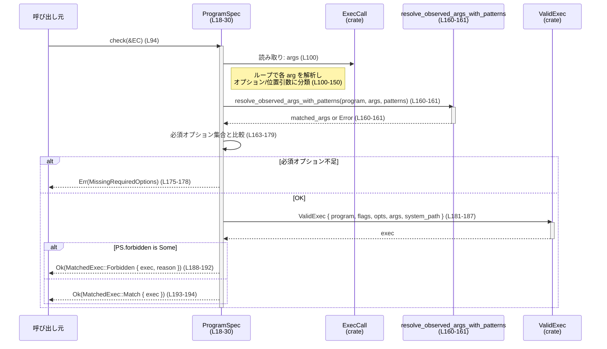
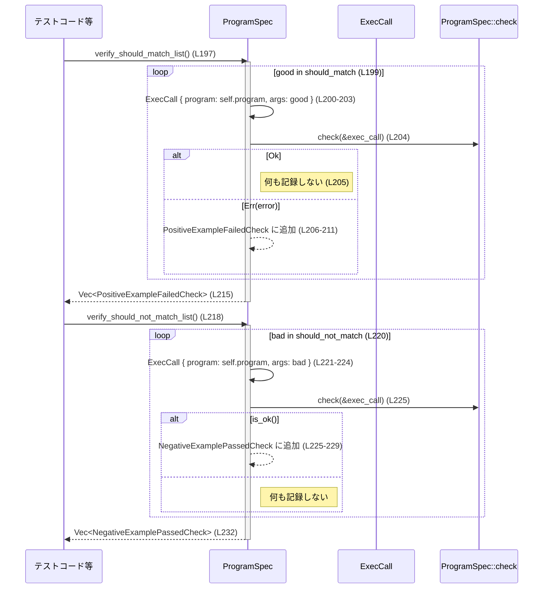

# execpolicy-legacy/src/program.rs コード解説

## 0. ざっくり一言

このファイルは、**1つの外部プログラムに対する実行ポリシー（許可されるオプション・引数パターン）を表現し、その ExecCall がポリシーに合致するかを検証するロジック**を提供します（`ProgramSpec` と `ProgramSpec::check` が中核、program.rs:L18-L30, L94-L195）。

---

## 1. このモジュールの役割

### 1.1 概要

- このモジュールは、**あるプログラムに対して許可されたコマンドラインオプション・引数パターンを定義し、実際の実行要求（ExecCall）がその定義に従っているかをチェックする**ために存在します（program.rs:L18-L30, L94-L195）。
- チェック結果は `MatchedExec` として返され、**許可された実行（ValidExec）**か、**禁止された実行（Forbidden）**か、または `Error` による失敗か、を区別できます（program.rs:L69-L88, L94-L195）。
- さらに `should_match`・`should_not_match` のサンプル引数リストに対して自己検証を行う API も提供します（program.rs:L197-L233）。

### 1.2 アーキテクチャ内での位置づけ

このモジュールは、ExecCall の引数を解析し、他モジュールの型を組み合わせて `ValidExec`／`Error` を生成する「ポリシー・オーケストレーター」の役割を担います。

```mermaid
graph LR
  PS[ProgramSpec<br/>(program.rs:L18-30)] -->|設定を保持| Opt[Opt<br/>(crate::opt)]
  PS -->|設定を保持| ArgPat[ArgMatcher<br/>(crate::arg_matcher)]
  PS -->|入力| ExecCall[ExecCall<br/>(crate::ExecCall)]
  PS -->|引数位置情報生成| PosArg[PositionalArg<br/>(crate::arg_resolver)]
  PS -->|呼び出し| Resolver[resolve_observed_args_with_patterns<br/>(program.rs:L160-161)]
  PS -->|結果構築| Valid[ValidExec<br/>(crate::valid_exec)]
  PS -->|結果として返す| MExec[MatchedExec<br/>(program.rs:L69-73)]
  PS -->|エラーとして返す| ErrT[Error<br/>(crate::error)]

  MExec -->|原因を保持| Forbid[Forbidden<br/>(program.rs:L75-88)]
```

- `ProgramSpec` は、どのオプションが使えるか (`allowed_options`)、位置引数をどう解釈するか (`arg_patterns`)、どのオプションが必須か (`required_options`) などを保持します（program.rs:L18-L29, L44-L53）。
- 実際の ExecCall を受け取り、`arg_resolver::resolve_observed_args_with_patterns` に委譲して位置引数をマッチングし（program.rs:L160-L161）、`ValidExec` を構築して返します（program.rs:L181-L187）。

### 1.3 設計上のポイント

- **設定と検証ロジックの分離**  
  - `ProgramSpec` は主に設定情報（許可オプション、引数パターン、例示サンプル）を保持し、`check` メソッドで検証を行う構造になっています（program.rs:L18-L30, L94-L195）。
- **不変な設定・可変なローカル状態**  
  - `ProgramSpec` はフィールドを一度初期化すると、このファイル内では書き換えません（`&self` しか取らない、program.rs:L94, L197, L218）。
  - 検証時の状態（現在どのオプション値を待っているかなど）はローカル変数で管理されています（program.rs:L95-L98, L100-L150）。
- **エラーハンドリングは Result と専用 Error 型**  
  - すべての検証は `Result<MatchedExec, Error>` で返却され、様々な異常ケースごとに専用の `Error` バリアントが使われています（例: `OptionFollowedByOptionInsteadOfValue`, `UnknownOption`, program.rs:L107-L111, L140-L143, L154-L157, L175-L178）。
- **禁止ポリシーの表現**  
  - `ProgramSpec` 自体に `forbidden: Option<String>` を持ち、これが `Some` の場合は常に `MatchedExec::Forbidden` を返す挙動になっています（program.rs:L26, L188-L194）。
- **自己検証用のサンプル引数**  
  - `should_match` / `should_not_match` にサンプルコマンドラインを保持し、それらに対して `check` を回す検証 API を提供しています（program.rs:L28-L29, L197-L233）。

---

## 2. 主要な機能一覧

- **ProgramSpec の構築**: 対象プログラムの許可オプション・引数パターン・必須オプションなどをまとめた仕様を生成する（`ProgramSpec::new`、program.rs:L32-L67）。
- **ExecCall のポリシーチェック**: 実際のコマンドライン引数列を解析し、許可・禁止・エラーを判定する（`ProgramSpec::check`、program.rs:L94-L195）。
- **「許可されるべき」引数例の検証**: `should_match` に登録されたサンプルが全て `check` に通るか検証する（`verify_should_match_list`、program.rs:L197-L216）。
- **「禁止されるべき」引数例の検証**: `should_not_match` に登録されたサンプルが一つも `check` に通らないか検証する（`verify_should_not_match_list`、program.rs:L218-L233）。
- **チェック結果の表現**:  
  - `MatchedExec`: 許可された実行か禁止された実行かを表現（program.rs:L69-L73）。  
  - `Forbidden`: 禁止理由の粒度（プログラム単位・引数単位・Exec 全体）を表現（program.rs:L75-L88）。
- **自己検証結果の表現**:  
  - `PositiveExampleFailedCheck`: 「許可されるべき例」が失敗したときの記録（program.rs:L236-L241）。  
  - `NegativeExamplePassedCheck`: 「禁止されるべき例」が通ってしまったときの記録（program.rs:L243-L247）。

---

## 3. 公開 API と詳細解説

### 3.1 型一覧（構造体・列挙体など）

このファイルで定義され、外部から利用可能な主な型の一覧です。

| 名前 | 種別 | 公開? | 行番号 | 役割 / 用途 |
|------|------|-------|--------|-------------|
| `ProgramSpec` | 構造体 | `pub` | program.rs:L18-L30 | 1つのプログラムに対する実行ポリシー（許可/必須オプション、引数パターン、例示サンプルなど）を保持し、検証メソッドを提供します。 |
| `MatchedExec` | 列挙体 | `pub` | program.rs:L69-L73 | `check` の結果として、許可された `ValidExec` か、禁止された `Forbidden`+理由文字列かを表現します。`Debug`/`Serialize` 派生済みです。 |
| `Forbidden` | 列挙体 | `pub` | program.rs:L75-L88 | 禁止された場合の原因をプログラム単位・特定引数・`ValidExec` 全体のいずれかの粒度で表現します。 |
| `PositiveExampleFailedCheck` | 構造体 | `pub` | program.rs:L236-L241 | `should_match` に登録された「良い例」が `check` で `Err` になった場合の詳細（プログラム名・引数列・Error）を保持します。 |
| `NegativeExamplePassedCheck` | 構造体 | `pub` | program.rs:L243-L247 | `should_not_match` に登録された「悪い例」が `check` で `Ok` になってしまった場合の詳細（プログラム名・引数列）を保持します。 |

> `ExecCall`, `ValidExec`, `Opt`, `ArgMatcher` などは他モジュールで定義されており、このチャンクには定義が現れません（program.rs:L5-L16）。

### 3.2 関数詳細（4件）

#### `ProgramSpec::new(...) -> ProgramSpec`

**シグネチャ**

```rust
impl ProgramSpec {
    pub fn new(
        program: String,
        system_path: Vec<String>,
        option_bundling: bool,
        combined_format: bool,
        allowed_options: HashMap<String, Opt>,
        arg_patterns: Vec<ArgMatcher>,
        forbidden: Option<String>,
        should_match: Vec<Vec<String>>,
        should_not_match: Vec<Vec<String>>,
    ) -> Self
}
```

（program.rs:L32-L43）

**概要**

- `ProgramSpec` の全フィールドを初期化しつつ、`allowed_options` から「必須オプション」の集合を自動的に抽出して `required_options` に格納するコンストラクタです（program.rs:L44-L53）。

**引数**

| 引数名 | 型 | 説明 |
|--------|----|------|
| `program` | `String` | 対象プログラム名（例: `"ls"`）。`ExecCall` の `program` と論理的に対応します（program.rs:L34）。 |
| `system_path` | `Vec<String>` | `ValidExec` に引き継がれるシステム PATH 情報（program.rs:L35, L181-L187）。 |
| `option_bundling` | `bool` | オプション束ね書き（例: `-abc`）を想定したフラグと思われますが、このファイルでは未使用です（program.rs:L22, L36）。 |
| `combined_format` | `bool` | `--opt=value` スタイルなどを表すフラグと推測されますが、このファイルでは未使用です（program.rs:L23, L37）。 |
| `allowed_options` | `HashMap<String, Opt>` | 許可されるオプション名（キー）とそのメタ情報 `Opt` の対応（program.rs:L24, L38）。 |
| `arg_patterns` | `Vec<ArgMatcher>` | 位置引数のパターンマッチングに用いるマッチャの一覧（program.rs:L25, L39）。 |
| `forbidden` | `Option<String>` | このプログラム自体を常に禁止する場合の理由文字列。`Some` なら `check` は常に `MatchedExec::Forbidden` を返します（program.rs:L26, L188-L194）。 |
| `should_match` | `Vec<Vec<String>>` | 「許可されるべき」引数列のサンプル集（program.rs:L28, L41, L197-L203）。 |
| `should_not_match` | `Vec<Vec<String>>` | 「禁止されるべき」引数列のサンプル集（program.rs:L29, L42, L218-L224）。 |

**戻り値**

- 新しい `ProgramSpec` インスタンス。`required_options` は `allowed_options` の中で `opt.required == true` のものだけから構成されます（program.rs:L44-L53）。

**内部処理の流れ**

1. `allowed_options.iter()` で全てのオプションを走査します（program.rs:L44-L45）。
2. それぞれについて `opt.required` が `true` なら、そのキー名（`name`）を `required_options` 集合に追加します（program.rs:L46-L52）。
3. 収集した集合を `required_options` とし、他の引数で受け取った値と共に `Self { ... }` で構造体を構築して返します（program.rs:L54-L65）。

**Examples（使用例）**

`Opt` や `ArgMatcher` の具体的なコンストラクタはこのチャンクには現れないため、擬似コードレベルの例です。

```rust
use std::collections::{HashMap, HashSet};               // HashMap, HashSet を利用
// use crate::{Opt, ArgMatcher, ProgramSpec};           // 実際には crate からインポートする

// allowed_options や arg_patterns の具体的な作り方はこのファイルには出てこない
let allowed_options: HashMap<String, Opt> = HashMap::new(); // 空の許可オプション集合
let arg_patterns: Vec<ArgMatcher> = Vec::new();             // 引数パターンは空

let spec = ProgramSpec::new(
    "ls".to_string(),               // program
    vec!["/usr/bin".to_string()],   // system_path
    false,                          // option_bundling（未使用）
    false,                          // combined_format（未使用）
    allowed_options,
    arg_patterns,
    None,                           // forbidden 理由なし
    vec![],                         // should_match サンプルなし
    vec![],                         // should_not_match サンプルなし
);
```

**Errors / Panics**

- `ProgramSpec::new` 自体は `Result` を返さず、関数内にも `panic!` 相当のコードはありません（`unwrap` などがない、program.rs:L32-L67）。
- `Opt` や `ArgMatcher` の生成時にエラーが起こりうるかは、このチャンクには現れません。

**Edge cases（エッジケース）**

- `allowed_options` が空の場合  
  - `required_options` も空となり、後続の必須オプションチェックは常に成功します（program.rs:L44-L53, L168-L179）。
- `allowed_options` のキー（文字列）が実際の ExecCall のオプション表記と一致していない場合  
  - この関数では何も検証せず、そのズレは `check` 実行時に `UnknownOption` などとして現れます（program.rs:L121-L143）。

**使用上の注意点**

- `option_bundling` / `combined_format` はこのファイル内では使用されておらず、これらのフラグだけを設定しても挙動は変わりません（program.rs:L22-L23, L36-L37）。
- `allowed_options` のキー文字列は `check` の中で `arg` と `HashMap` のキーを文字列として比較して使われるため（program.rs:L121-L123）、実際にコマンドラインに現れるオプション文字列（例: `"-v"` や `"--verbose"）と完全一致させる必要があります。

---

#### `ProgramSpec::check(&self, exec_call: &ExecCall) -> Result<MatchedExec>`

**シグネチャ**

```rust
impl ProgramSpec {
    pub fn check(&self, exec_call: &ExecCall) -> Result<MatchedExec>
}
```

（program.rs:L94）

**概要**

- `ExecCall` に含まれる引数列を解析し、`ProgramSpec` によって定義された:
  - 許可オプション (`allowed_options`)
  - 必須オプション (`required_options`)
  - 引数パターン (`arg_patterns`)
- に照らして検証し、
  - 成功時は `MatchedExec::Match { exec: ValidExec }`
  - `ProgramSpec::forbidden` が `Some` の場合は `MatchedExec::Forbidden { ... }`
  - ポリシー違反や解析不能な入力では `Error` を返します（program.rs:L94-L195）。

**引数**

| 引数名 | 型 | 説明 |
|--------|----|------|
| `&self` | `&ProgramSpec` | 対象プログラムのポリシー定義。内部状態は変更されません（program.rs:L94）。 |
| `exec_call` | `&ExecCall` | 実際の実行要求。`exec_call.args` のみが `check` の中で利用されています（program.rs:L100-L150）。`exec_call.program` はこの関数内では参照されません。 |

**戻り値**

- `Result<MatchedExec, Error>`  
  - `Ok(MatchedExec::Match { exec })`  
    - ポリシーに従った実行であり、`ValidExec` として構造化された結果が得られた場合（program.rs:L181-L187, L193-L194）。
  - `Ok(MatchedExec::Forbidden { cause, reason })`  
    - ポリシーに従ってはいるが、`ProgramSpec` がそもそも「実行禁止」に設定されている場合（program.rs:L188-L194）。
  - `Err(Error::...)`  
    - 解析中に仕様違反／サポート外入力が見つかった場合（program.rs:L107-L111, L117-L119, L140-L143, L154-L157, L175-L178, L160-L161）。

**内部処理の流れ（アルゴリズム）**

高レベルの流れを示すフローチャートです（ProgramSpec::check, program.rs:L94-L195）。

```mermaid
flowchart TD
  A["開始: check(&self, &ExecCall) (L94)"] --> B["状態初期化<br/>expecting_option_value=None<br/>args/flags/opts=空 (L95-98)"]
  B --> C["各引数をループ (index, arg) (L100)"]
  C --> D{"expecting_option_value は Some か? (L101)"}
  D -->|Yes| E["値として扱うべき引数 (L101-115)"]
  E --> F{"arg.starts_with(\"-\") ? (L106)"}
  F -->|Yes| G["Error::OptionFollowedByOptionInsteadOfValue (L107-111)"]
  F -->|No| H["MatchedOpt を追加し expecting=None (L114-115)"] --> C
  D -->|No| I{"arg == \"--\" ? (L116)"}
  I -->|Yes| J["Error::DoubleDashNotSupportedYet (L117-119)"]
  I -->|No| K{"arg.starts_with(\"-\") ? (L120)"}
  K -->|Yes| L["allowed_options.get(arg) を検索 (L121)"]
  L --> M{"Some(opt) ? (L121-123)"}
  M -->|Yes & Flag| N["MatchedFlag 追加 (L124-127)"] --> C
  M -->|Yes & Value| O["expecting_option_value にセット (L129-131)"] --> C
  M -->|No| P["Error::UnknownOption (L135-143)"]
  K -->|No| Q["位置引数として PositionalArg に追加 (L144-148)"] --> C
  C --> R["ループ終了 (L150)"]
  R --> S{"expecting_option_value が Some ? (L152-157)"}
  S -->|Yes| T["Error::OptionMissingValue (L154-157)"]
  S -->|No| U["resolve_observed_args_with_patterns 呼び出し (L160-161)"]
  U --> V{"必須オプションが揃っているか? (L163-179)"}
  V -->|No| W["Error::MissingRequiredOptions (L168-178)"]
  V -->|Yes| X["ValidExec 構築 (L181-187)"]
  X --> Y{"self.forbidden が Some か? (L188)"}
  Y -->|Yes| Z["MatchedExec::Forbidden { Exec, reason } (L188-192)"]
  Y -->|No| AA["MatchedExec::Match { Exec } (L193-194)"]
```

**Examples（使用例）**

`ExecCall` や `ValidExec` の完全な定義はこのチャンクにはないため、戻り値をそのまま `Debug` 表示する簡単な例です。

```rust
// use crate::{ProgramSpec, MatchedExec, ExecCall};     // 実際には crate からインポート

// ProgramSpec の構築は前述の new の例と同様（詳細はこのファイル外）
let spec: ProgramSpec = /* ... */;

// 実行要求を作成（ExecCall のフィールド構造はこのチャンクには出てこないため擬似コード）
let exec_call = ExecCall {
    program: "ls".to_string(),                          // ProgramSpec::program と一致させるのが自然
    args: vec!["-l".to_string(), "/tmp".to_string()],   // 実際のコマンドライン引数
};

// ポリシーチェックを実行
match spec.check(&exec_call) {
    Ok(matched) => {
        // MatchedExec は Debug/Serialize 派生済み（program.rs:L69）
        println!("MatchedExec: {:?}", matched);
    }
    Err(e) => {
        eprintln!("Policy error: {:?}", e);
    }
}
```

**Errors / Panics**

`check` が返す可能性のある `Error` は、このファイルから次の条件で発生することが読み取れます:

- `Error::OptionFollowedByOptionInsteadOfValue`（program.rs:L107-L111）  
  - 値を取るオプションの直後に、別のオプション（先頭が `-` の文字列）が続いた場合。
- `Error::DoubleDashNotSupportedYet`（program.rs:L117-L119）  
  - 引数に `"--"` が含まれていた場合。オプション終端の `--` 記法は現状サポート外です。
- `Error::UnknownOption`（program.rs:L140-L143）  
  - 先頭が `-` の引数が `allowed_options` に存在しない場合。  
  - `--option=value` のような形式も現状パースされず、Unknown として扱われます（コメントのみ、program.rs:L135-L137）。
- `Error::OptionMissingValue`（program.rs:L154-L157）  
  - 値を取るオプションが現れた後、その値となるべき引数が存在しないまま引数列が終わった場合。
- `Error::MissingRequiredOptions`（program.rs:L175-L178）  
  - `ProgramSpec::new` で抽出された `required_options` のいずれかが、`exec_call.args` 内に現れなかった場合。
- さらに `resolve_observed_args_with_patterns` によって `Error` が返される可能性がありますが、その詳細はこのチャンクには現れません（program.rs:L160-L161）。

**Panics**

- この関数内には `panic!`、`unwrap`、`expect`、インデックスアクセス `vec[i]` など、明示的にパニックを引き起こすコードは存在しません（program.rs:L94-L195）。
- ただし、`MatchedOpt::new` の内部実装はこのチャンクにはないため、その中で panic する可能性については不明です（program.rs:L114）。

**Edge cases（エッジケース）**

- **引数が空 (`exec_call.args.is_empty()`) の場合**  
  - ループは一度も回らず `args`/`matched_flags`/`matched_opts` は空のままです（program.rs:L100-L150）。
  - `required_options` が非空であれば `MissingRequiredOptions` エラーになります（program.rs:L168-L178）。
  - 位置引数パターン `arg_patterns` がどのように扱うかは、`resolve_observed_args_with_patterns` の実装次第で、このチャンクからは分かりません（program.rs:L160-L161）。
- **負の数など、`"-"` で始まる値を引数として渡したい場合**  
  - `arg.starts_with("-")` によりオプションとして扱われます（program.rs:L120）。
  - `allowed_options` に該当エントリがない場合、`UnknownOption` エラーになります（program.rs:L140-L143）。
  - これは仕様かもしれませんが、負数を位置引数として扱いたい場合は現在のロジックではサポートされない可能性があります（意図はコードから断定できません）。
- **`"--"`（オプション終端）が含まれる場合**  
  - 即座に `DoubleDashNotSupportedYet` エラーとなります（program.rs:L116-L119）。

**使用上の注意点**

- **ExecCall.program は無視される**  
  - `check` 内では `exec_call.program` は一切参照されず、`exec_call.args` のみを解析します（program.rs:L100-L150）。  
    呼び出し側で `ProgramSpec.program` と `ExecCall.program` の整合性を保証する必要があります。
- **オプション名の完全一致が必要**  
  - `allowed_options.get(arg)` で文字列そのものをキーに検索しているため（program.rs:L121）、`"--verbose"` と `"--verbose "` のような微小な違いも別オプションとして扱われます。
- **並行性（スレッドセーフ性）の観点**  
  - `check` は `&self` とローカル変数のみを使い、`ProgramSpec` のフィールドを書き換えません（program.rs:L94-L98, L181-L187）。  
    このファイルを見る限り、`ProgramSpec` は複数スレッドから同時に `check` を呼び出しても、少なくともこの関数内でデータ競合を起こすコードはありません。  
    ただし、`ProgramSpec` が保持する型（`ArgMatcher` など）が内部的に可変状態を持っているかどうかは、このチャンクには現れません。
- **セキュリティ的観点**  
  - この関数は、許可されていないオプションや必須オプションの不足を検出し、`Error` として返すことで、想定外のコマンドライン引数による実行を抑止する役割を持ちます（program.rs:L140-L143, L168-L178, L181-L194）。  
  - 一方で、引数がポリシーに合致していれば `ValidExec` を構築して返しますが、その後「実際にどのようにプロセスを起動するか」はこのファイルの外で決まるため、実行自体のセキュリティは別コンポーネントの責務となります。

---

#### `ProgramSpec::verify_should_match_list(&self) -> Vec<PositiveExampleFailedCheck>`

**シグネチャ**

```rust
impl ProgramSpec {
    pub fn verify_should_match_list(&self) -> Vec<PositiveExampleFailedCheck>
}
```

（program.rs:L197）

**概要**

- `ProgramSpec` に定義された「許可されるべき引数例」(`should_match`) をすべて `check` に通し、**通るはずなのに `Error` になってしまったケース**を `PositiveExampleFailedCheck` として収集します（program.rs:L197-L216）。
- 一種の「自己テスト」機能として使えるメソッドです。

**引数**

| 引数名 | 型 | 説明 |
|--------|----|------|
| `&self` | `&ProgramSpec` | 検証対象のポリシー。内部状態は変更されません（program.rs:L197）。 |

**戻り値**

- `Vec<PositiveExampleFailedCheck>`  
  - 各要素は、`should_match` に含まれていた `Vec<String>` のうち `check` が `Err` を返してしまったものと、そのエラー内容を保持します（program.rs:L199-L211, L236-L241）。

**内部処理の流れ**

1. `violations` ベクタを空で初期化します（program.rs:L198）。
2. `self.should_match` の各要素（`good: &Vec<String>`）についてループします（program.rs:L199）。
3. 各 `good` に対して、`ExecCall { program: self.program.clone(), args: good.clone() }` を構築します（program.rs:L200-L203）。  
   - `ExecCall` の他フィールドがあるかどうかは、このチャンクには現れません。
4. `self.check(&exec_call)` を呼び出し、結果を `match` します（program.rs:L204-L213）。
   - `Ok(_)` の場合は何もせず次の例へ進みます（program.rs:L205）。
   - `Err(error)` の場合は `PositiveExampleFailedCheck { program: self.program.clone(), args: good.clone(), error }` を `violations` に追加します（program.rs:L206-L211, L236-L241）。
5. 最後に `violations` を返します（program.rs:L215）。

**Examples（使用例）**

`ProgramSpec` に正しい `should_match` を設定できているか確認する簡単な例です。

```rust
// ProgramSpec の構築時に should_match を設定しておく
let spec: ProgramSpec = /* ... */;

// 期待通りに「すべてマッチしているか」を検証
let failures = spec.verify_should_match_list();

if failures.is_empty() {
    println!("すべての should_match サンプルがポリシーを満たしています。");
} else {
    for f in &failures {
        eprintln!("should_match なのに失敗: program={} args={:?} error={:?}",
            f.program, f.args, f.error);
    }
}
```

**Errors / Panics**

- この関数自身は `Result` を返さず、内部で `check` を呼び出した結果の `Err` を `PositiveExampleFailedCheck` として記録するだけです（program.rs:L204-L211）。
- `check` がパニックを起こさない限り、この関数からパニックが発生するコードはありません。

**Edge cases（エッジケース）**

- `should_match` が空の場合  
  - ループは一度も実行されず、空の `Vec` を返します（program.rs:L199-L215）。
- `should_match` に `ProgramSpec` のポリシーと明らかに矛盾したサンプルが含まれている場合  
  - そのサンプルごとに `PositiveExampleFailedCheck` が生成されます（program.rs:L206-L211）。

**使用上の注意点**

- `ExecCall.program` には常に `self.program.clone()` が設定されます（program.rs:L200-L203）。  
  呼び出し側で別のプログラム名を入れた ExecCall をテストしたい場合は、このメソッドではなく直接 `check` を呼び出す必要があります。
- このメソッドは、**ポリシー定義 (`ProgramSpec`) とサンプル (`should_match`) の整合性を検証するためのものであり、実行時の本番チェックを代替するものではありません**。実運用では通常 `check` が直接使われます。

---

#### `ProgramSpec::verify_should_not_match_list(&self) -> Vec<NegativeExamplePassedCheck>`

**シグネチャ**

```rust
impl ProgramSpec {
    pub fn verify_should_not_match_list(&self) -> Vec<NegativeExamplePassedCheck>
}
```

（program.rs:L218）

**概要**

- `ProgramSpec` に定義された「禁止されるべき引数例」(`should_not_match`) をすべて `check` に通し、**禁止されるべきなのに `Ok` になってしまったケース**を `NegativeExamplePassedCheck` として収集します（program.rs:L218-L233）。

**引数**

| 引数名 | 型 | 説明 |
|--------|----|------|
| `&self` | `&ProgramSpec` | 検証対象のポリシー。内部状態は変更されません（program.rs:L218）。 |

**戻り値**

- `Vec<NegativeExamplePassedCheck>`  
  - 各要素は、`should_not_match` に含まれていた `Vec<String>` のうち `check` が `Ok` を返してしまったものを保持します（program.rs:L220-L229, L243-L247）。

**内部処理の流れ**

1. `violations` ベクタを空で初期化します（program.rs:L219）。
2. `self.should_not_match` の各要素（`bad: &Vec<String>`）についてループします（program.rs:L220）。
3. 各 `bad` について、`ExecCall { program: self.program.clone(), args: bad.clone() }` を構築します（program.rs:L221-L224）。
4. `self.check(&exec_call)` を呼び出し、結果が `is_ok()` かどうかを判定します（program.rs:L225）。
   - `Ok(_)` だった場合は `NegativeExamplePassedCheck { program: self.program.clone(), args: bad.clone() }` を `violations` に追加します（program.rs:L225-L229, L243-L247）。
   - `Err(_)` の場合は何もせず次の例へ進みます。
5. 最後に `violations` を返します（program.rs:L232）。

**Examples（使用例）**

```rust
let spec: ProgramSpec = /* ... */;

// 「禁止されるべきサンプル」が実際に禁止されているかを検証
let wrong_passes = spec.verify_should_not_match_list();

if wrong_passes.is_empty() {
    println!("すべての should_not_match サンプルが正しく拒否されています。");
} else {
    for np in &wrong_passes {
        eprintln!("should_not_match なのに通ってしまった: program={} args={:?}",
            np.program, np.args);
    }
}
```

**Errors / Panics**

- この関数自身は `Result` を返さず、`check` の結果が `Ok` か `Err` かだけを見ています（program.rs:L225）。
- `check` 内のエラーは `Err` として自然に扱われ、この関数から表に出ることはありません。

**Edge cases（エッジケース）**

- `should_not_match` が空の場合  
  - ループは一度も実行されず、空の `Vec` を返します（program.rs:L220-L232）。
- `should_not_match` にも `should_match` にも同じ引数列が登録されていた場合  
  - 片方では `verify_should_match_list`、もう片方では `verify_should_not_match_list` によって矛盾が検出される可能性があります。  
  - この状況をどう扱うかは、このファイルからは決まりません。

**使用上の注意点**

- `check` が `Ok(MatchedExec::Forbidden { .. })` を返した場合も `is_ok()` は `true` になります（program.rs:L188-L194, L225）。  
  したがって、このメソッドは「`check` がエラーで落ちていない」ことを問題視しますが、「`MatchedExec::Match` か `MatchedExec::Forbidden` か」は区別していません。  
  - 禁止例が `MatchedExec::Forbidden` になることを許容する設計であれば、この挙動は妥当ですが、そうでない場合は呼び出し側で `MatchedExec` の中身まで確認するテストを追加する必要があります。

---

### 3.3 その他の関数

このファイルには、上記以外のヘルパー関数やラッパー関数は定義されていません（program.rs 全体を確認）。

---

## 4. データフロー

ここでは、典型的な「ExecCall を `check` に通して結果を得る」シナリオと、自己検証メソッドを含むデータフローを示します。

### 4.1 `ProgramSpec::check` を中心としたフロー



**要点**

- `ExecCall` からは `args` のみが参照され、プログラム名などは `check` 内では使われません（program.rs:L100-L150）。
- 位置引数の解釈（「第1引数はファイル、第2引数はモード」など）は `resolve_observed_args_with_patterns` に委譲されており、その詳細はこのチャンクには現れません（program.rs:L160-L161）。
- `ValidExec` は `ProgramSpec` の情報と解析結果をまとめた「検証済み実行」であり、最終的な `MatchedExec` にラップされて返却されます（program.rs:L181-L187, L69-L73）。

### 4.2 自己検証 (`verify_should_match_list`, `verify_should_not_match_list`)



---

## 5. 使い方（How to Use）

### 5.1 基本的な使用方法

このファイルだけでは `Opt` や `ArgMatcher` の具体的な初期化方法は分かりませんが、**大まかな利用フロー**は次のようになります。

```rust
use std::collections::HashMap;
// use crate::{ProgramSpec, ExecCall, MatchedExec, Opt, ArgMatcher}; // 実際のパスは crate 構成による

// 1. 許可オプション・引数パターンなどを用意する
let allowed_options: HashMap<String, Opt> = HashMap::new(); // Opt の中身はこのファイル外
let arg_patterns: Vec<ArgMatcher> = Vec::new();             // ArgMatcher もこのファイル外

// 2. ProgramSpec を構築する
let spec = ProgramSpec::new(
    "myprog".to_string(),     // 対象プログラム名
    vec![],                   // system_path（必要に応じて設定）
    false,                    // option_bundling（未使用）
    false,                    // combined_format（未使用）
    allowed_options,
    arg_patterns,
    None,                     // forbidden 理由（None なら許可可能）
    vec![],                   // should_match サンプル
    vec![],                   // should_not_match サンプル
);

// 3. 実際の ExecCall を作成する（観測されたコマンドラインを表現）
let exec_call = ExecCall {
    program: "myprog".to_string(),           // ProgramSpec::program と一致させるのが自然
    args: vec!["-v".to_string(), "foo".to_string()],
};

// 4. ポリシーチェックを実行する
match spec.check(&exec_call) {
    Ok(MatchedExec::Match { exec }) => {
        // exec: ValidExec （このファイル外で定義）
        // ここで実際のプロセス起動などを行うことが想定されます
    }
    Ok(MatchedExec::Forbidden { cause, reason }) => {
        eprintln!("Forbidden: {:?}, reason: {}", cause, reason);
    }
    Err(e) => {
        eprintln!("Policy error: {:?}", e);
    }
}
```

### 5.2 よくある使用パターン

1. **ポリシー定義＋自己検証**

   - `ProgramSpec` を構築し、`should_match` と `should_not_match` を設定した上で、アプリケーション起動時やテストで自己検証を行うパターンです。

   ```rust
   let spec: ProgramSpec = /* 設定ファイル等から構築 */;

   // should_match がすべて通るか
   let pos_failures = spec.verify_should_match_list();
   assert!(pos_failures.is_empty(), "should_match サンプルに失敗があります");

   // should_not_match がすべて拒否されるか
   let neg_failures = spec.verify_should_not_match_list();
   assert!(neg_failures.is_empty(), "should_not_match サンプルに通ってしまうものがあります");
   ```

2. **複数スレッドからの並行チェック**

   - `ProgramSpec` は `check(&self, &ExecCall)` のように `&self` しか取らないため（program.rs:L94, L197, L218）、一度構築した `ProgramSpec` を複数スレッドに共有し、それぞれから `check` を呼ぶ使い方が想定できます。  
   - `ProgramSpec` 内でミュータブルな状態を書き換えていない点は、このファイルから確認できます（program.rs:L95-L98, L181-L187）。

### 5.3 よくある間違い

以下は、このコードから推測される「起こりがちな誤用例」と、その修正例です。

```rust
// 間違い例: ProgramSpec::program と異なる ExecCall.program を渡してもエラーにはならない
let spec = ProgramSpec::new(
    "expected_prog".to_string(),
    vec![],
    false,
    false,
    HashMap::new(),
    Vec::new(),
    None,
    vec![],
    vec![],
);

let exec_call = ExecCall {
    program: "other_prog".to_string(),  // ProgramSpec::program と不一致
    args: vec![],                       // しかし check は program を見ない
};

let result = spec.check(&exec_call);    // コード上は program 不一致を検出しない (program.rs:L100-L150)

// 正しい例: ProgramSpec::program と ExecCall.program の整合性は呼び出し側で保証する
let exec_call = ExecCall {
    program: spec.program.clone(),      // 同じ program 名をセット
    args: vec![],
};
let result = spec.check(&exec_call);
```

```rust
// 間違い例: 負の数を位置引数として渡したつもりが UnknownOption になる可能性
let exec_call = ExecCall {
    program: "prog".to_string(),
    args: vec!["-1".to_string()],       // 先頭が '-' のためオプション扱い (program.rs:L120)
};

// allowed_options に "-1" がないと UnknownOption エラー (program.rs:L140-L143)
let result = spec.check(&exec_call);

// 対処案（仕様次第）:
// - allowed_options に "-1" を追加する
// - あるいはダブルダッシュ "--" の扱いを拡張し、
//   "--" 以降の引数を常に位置引数として扱うように `check` を拡張するなど
//   （現状は DoubleDashNotSupportedYet エラー、program.rs:L116-L119）
```

### 5.4 使用上の注意点（まとめ）

- **前提条件**
  - `ProgramSpec` を構築する際、`allowed_options` は実際に使用されるオプションと一致するキー名で構成されている必要があります（program.rs:L121-L123）。
  - `Opt.required` フラグは正しく設定する必要があります。誤って `true` にすると、実際の実行で `MissingRequiredOptions` エラーを引き起こします（program.rs:L47, L168-L178）。
- **禁止事項 / 注意事項**
  - 現状 `"--"` はサポートされておらず、引数に含めるとエラーになります（program.rs:L116-L119）。
  - `--option=value` スタイルのオプションはコメント上で示唆されるものの、実装されていません（program.rs:L135-L137, L140-L143）。
- **エラー・例外の扱い**
  - このモジュールは Rust の `Result` 型によりエラーを明示的に扱っています。`check` の呼び出し側は `?` 演算子や `match` でエラーをハンドリングする必要があります（program.rs:L94-L195）。
- **パフォーマンス上の注意**
  - `check` は `self.program.clone()` や `self.system_path.clone()` を毎回行います（program.rs:L108-L109, L155-L156, L181-L187）。  
    `system_path` が大きい場合、頻繁な `check` 呼び出しではコピーコストが無視できない可能性があります。
- **観測可能性（ログ等）**
  - このファイルにはログ出力やメトリクス送信は含まれておらず、`Error` と戻り値を通じてのみ状態が観測できます。必要なら呼び出し側でログを追加する設計になります。

---

## 6. 変更の仕方（How to Modify）

### 6.1 新しい機能を追加する場合

1. **`--option=value` 形式のサポートを追加する場合**

   - 解析ロジックは `ProgramSpec::check` の `arg.starts_with("-")` 分岐内に集中しています（program.rs:L120-L143）。
   - 現在は `allowed_options.get(arg)` のキーとして引数全体（例: `"--opt=value"`）を使っているため（program.rs:L121）、`value` 部分を分割する処理を追加する場合はここを変更するのが自然です。
   - 分割したオプション名で `allowed_options` を引き直し、値部分を `MatchedOpt` に渡すロジックを追加する想定になります（`MatchedOpt::new` 呼び出し周辺、program.rs:L114）。

2. **`"--"` によるオプション終端をサポートする場合**

   - 現在は `"--"` を見つけると即座に `Error::DoubleDashNotSupportedYet` を返しています（program.rs:L116-L119）。
   - ここを変更し、`"--"` を境にそれ以降をすべて位置引数扱いするよう、ループ以降の処理を追加するのが自然です。

3. **より詳細な禁止ルールを追加する場合**

   - 現在 `ProgramSpec` の `forbidden` は単なる `Option<String>` で、理由文字列のみを保持しています（program.rs:L26）。
   - より複雑な条件（特定の引数パターンのみ禁止など）を表現したい場合は、`Forbidden` 列挙体（program.rs:L75-L88）や `ProgramSpec` にルール集合を追加し、`check` の末尾（`ValidExec` 構築後）でそのルールを適用する拡張が考えられます（program.rs:L181-L194）。

### 6.2 既存の機能を変更する場合

- **影響範囲の確認**
  - `ProgramSpec::check` はこのファイルの中核であり、`verify_should_match_list` / `verify_should_not_match_list` の両方から呼ばれています（program.rs:L204, L225）。
  - さらに、他のモジュールからも直接呼び出されている可能性が高いため、シグネチャや戻り値の意味を変える場合は広範囲な影響を考慮する必要があります。

- **契約（前提条件・返り値の意味）**
  - 現在の契約は「`Ok` のときは解析に成功し、`MatchedExec` によって許可/禁止が区別される」「入力が仕様外なら `Error`」という形に見えます（program.rs:L188-L194）。
  - ここを変えたい場合（たとえば「禁止も `Err` として扱う」など）は、`MatchedExec` と `Forbidden` の意味も再設計する必要があります（program.rs:L69-L88）。

- **関連するテスト・自己検証**
  - `should_match` と `should_not_match` を利用した自己検証 API は、仕様変更の回帰チェックに利用できます（program.rs:L197-L233, L236-L247）。
  - 仕様変更時は、これらのサンプルも更新または追加することが望ましいです（このファイルからはサンプルの定義場所は分かりません）。

---

## 7. 関連ファイル

このモジュールと密接に関係する他ファイル・型を、インポートから列挙します。

| パス / 型名 | 役割 / 関係 |
|-------------|------------|
| `crate::ExecCall` | 実行要求（プログラム名と引数列）を表す型として使用されています（program.rs:L6, L94, L200-L203, L221-L224）。フィールド構造はこのチャンクには現れません。 |
| `crate::ArgType` | オプションが取る引数の型情報を表すと推測されます。`expecting_option_value` に格納され、`MatchedOpt::new` に渡されています（program.rs:L5, L95, L105, L114）。 |
| `crate::arg_matcher::ArgMatcher` | 位置引数のマッチングルールを表す型として `ProgramSpec.arg_patterns` で使用されています。詳細はこのチャンクには現れません（program.rs:L7, L25, L39, L160-L161）。 |
| `crate::arg_resolver::{PositionalArg, resolve_observed_args_with_patterns}` | 位置引数をインデックス付きで保持する `PositionalArg` と、観測された引数列をパターンに基づいて解釈する関数として使用されています（program.rs:L8-L9, L96, L145-L148, L160-L161）。 |
| `crate::opt::{Opt, OptMeta}` | オプションのメタ情報（フラグか値を取るか、必須かどうかなど）を表す型として使用されています。`OptMeta::Flag` / `OptMeta::Value` により解析分岐が行われています（program.rs:L12-L13, L44-L47, L121-L133）。 |
| `crate::valid_exec::{MatchedFlag, MatchedOpt, ValidExec}` | 解析されたオプション・フラグ・位置引数を保持する「検証済み実行」を表す型群として使用されています（program.rs:L14-L16, L97-L98, L114, L164-L167, L181-L187）。 |
| `crate::error::{Error, Result}` | すべての検証エラーを表現する `Error` 型と、その別名 `Result<T>` として使用されます（program.rs:L10-L11, L94-L195, L236-L241）。 |

> これらの型の具体的なフィールド・挙動はこのチャンクには定義が存在せず、型名や使用箇所から用途のみが推測できます。
