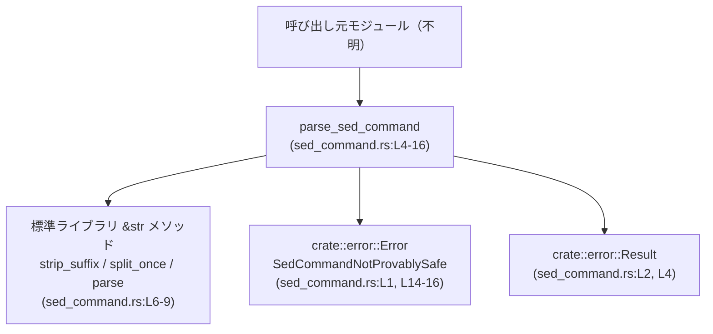
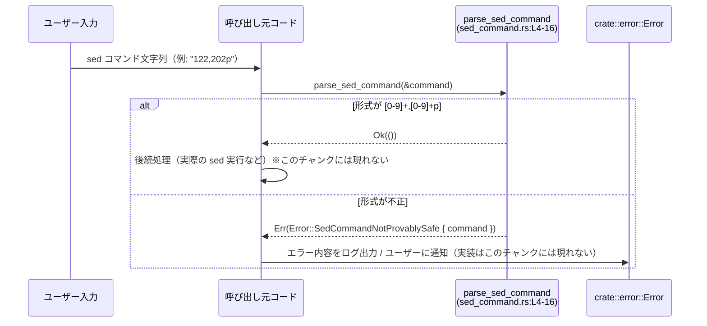

# execpolicy-legacy/src/sed_command.rs

## 0. ざっくり一言

`sed` コマンド文字列が「`数値,数値p` 形式」であるかどうかを検証し、それ以外を「安全性が証明できないコマンド」としてエラーにする関数を提供するモジュールです（`sed_command.rs:L4-16`）。

---

## 1. このモジュールの役割

### 1.1 概要

- このモジュールは、外部から渡された `sed` コマンド文字列が、安全とみなせるごく限定的な形式かどうかを検証するために存在しています（`sed_command.rs:L4-16`）。
- 現状は `122,202p` のような「開始行番号,終了行番号p」という形式のみを受け付け、それ以外は `Error::SedCommandNotProvablySafe` を返します（`sed_command.rs:L5-9`, `L14-16`）。

### 1.2 アーキテクチャ内での位置づけ

このファイル自体は 1 関数のみですが、エラー型を通じて `crate::error` モジュールへ依存しています（`sed_command.rs:L1-2`, `L14-16`）。



> 呼び出し元の具体的なモジュール構成は、このチャンクには現れません。

### 1.3 設計上のポイント

- **責務の分割**
  - このモジュールは「`sed` コマンド文字列の安全性チェック」のみを行い、コマンドの実行などは行いません（`sed_command.rs:L4-16`）。
- **状態管理**
  - グローバル状態や内部状態を一切持たない純粋関数です。入力文字列から結果を計算して返すだけです（`sed_command.rs:L4-16`）。
- **エラーハンドリング**
  - 形式が期待通りでない場合は、単一のエラー種別 `Error::SedCommandNotProvablySafe { command }` を返します（`sed_command.rs:L14-16`）。
- **安全性と並行性**
  - `unsafe` ブロックはなく、標準ライブラリの安全な API のみを利用しています（`sed_command.rs` 全体）。
  - 共有状態を持たないため、複数スレッドから同じ入力に対して同時に呼び出しても競合は発生しません（設計上、関数本体がローカル変数しか使っていないことから言えます: `sed_command.rs:L4-16`）。

---

## 2. コンポーネント一覧（インベントリー）

このファイル内で定義・利用されている主なコンポーネントを一覧にします。

| 種別 | 名前 | 概要 | 根拠行（ファイル:行） |
|------|------|------|------------------------|
| 関数（公開） | `parse_sed_command` | `sed` コマンド文字列が `[0-9]+,[0-9]+p` 形式かどうかを検証する | `sed_command.rs:L4-16` |
| 型（外部） | `crate::error::Error` | エラーを表す型。少なくとも `SedCommandNotProvablySafe { command: String }` というバリアントを持つ | `sed_command.rs:L1, L14-16` |
| 型（外部） | `crate::error::Result` | 戻り値として使用される結果型。具体的な定義はこのチャンクには現れないが、`Result<()>` として利用されている | `sed_command.rs:L2, L4` |

---

## 3. 公開 API と詳細解説

### 3.1 型一覧（構造体・列挙体など）

このファイル内で新たな型定義（構造体・列挙体など）は行われていません。

外部から利用している型は次の通りです。

| 名前 | 種別 | 役割 / 用途 | 定義有無 |
|------|------|-------------|----------|
| `crate::error::Error` | 列挙体（構文より） | エラー情報を表す。ここでは `SedCommandNotProvablySafe { command: String }` バリアントの生成に使用 | このファイルには定義されていない（`sed_command.rs:L1, L14-16`） |
| `crate::error::Result` | 型（恐らく `Result<T, Error>` に類するエイリアス） | `parse_sed_command` の戻り値型として利用 | このファイルには定義されていない（`sed_command.rs:L2, L4`） |

> `Error::SedCommandNotProvablySafe { ... }` という書き方から、`Error` は少なくとも構造体風のフィールドを持つ enum バリアントを含む列挙体であると分かります（`sed_command.rs:L14-16`）。

### 3.2 関数詳細

#### `parse_sed_command(sed_command: &str) -> Result<()>`

**概要**

- 引数 `sed_command` が、「`数値,数値p`」という形式であれば `Ok(())` を返し、それ以外は `Error::SedCommandNotProvablySafe { command: sed_command.to_string() }` を返します（`sed_command.rs:L5-9`, `L11`, `L14-16`）。
- 実質的に、「`[0-9]+,[0-9]+p` という正規表現にマッチするかどうか」をチェックする関数です（この性質は `strip_suffix("p")` と `parse::<u64>()` から読み取れる: `sed_command.rs:L6-9`）。

**引数**

| 引数名 | 型 | 説明 | 根拠 |
|--------|----|------|------|
| `sed_command` | `&str` | 検証対象となる `sed` コマンド文字列 | `sed_command.rs:L4` |

**戻り値**

- `Result<()>`（`crate::error::Result` 型を通じて返されるユニット型 `()` の成功/失敗結果）（`sed_command.rs:L4`）。
  - 成功 (`Ok(())`)：入力が `[0-9]+,[0-9]+p` 形式である場合（`sed_command.rs:L6-11`）。
  - 失敗 (`Err(Error::SedCommandNotProvablySafe { command })`)：それ以外の文字列である場合（`sed_command.rs:L14-16`）。

**内部処理の流れ（アルゴリズム）**

コードの流れをステップ化すると、次のようになります（`sed_command.rs:L5-12`）。

1. コメントで「現在は `122,202p` のようなコマンドだけをパースする」と明示（`sed_command.rs:L5`）。
2. `sed_command.strip_suffix("p")` を呼び出し、末尾が `"p"` で終わっているかをチェックし、終端の `"p"` を除いた部分を `stripped` として取得（`sed_command.rs:L6`）。
3. `stripped.split_once(",")` で最初のカンマより前と後ろを `(first, rest)` に分割し、両方が存在するかをチェック（`sed_command.rs:L7`）。
4. `first.parse::<u64>().is_ok()` で `first` が `u64` としてパース可能であることを確認（`sed_command.rs:L8`）。
5. `rest.parse::<u64>().is_ok()` で `rest` が `u64` としてパース可能であることを確認（`sed_command.rs:L9`）。
6. 上記 2〜5 のすべてが成功 (`if let ... && ...` の条件すべてが真) の場合、`Ok(())` を返して終了（`sed_command.rs:L6-11`）。
7. いずれかの条件が失敗した場合、`Error::SedCommandNotProvablySafe { command: sed_command.to_string() }` を生成し、`Err(...)` として返す（`sed_command.rs:L14-16`）。

**処理フロー図**

```mermaid
flowchart TD
    A["入力: sed_command (&str)"] --> B["parse_sed_command<br/>(sed_command.rs:L4-16)"]
    B --> C{"末尾が 'p' か？<br/>strip_suffix(\"p\")<br/>(L6)"}
    C -- "いいえ / None" --> Z["Err(SedCommandNotProvablySafe)<br/>(L14-16)"]
    C -- "はい" --> D{"',' で分割できるか？<br/>split_once(\",\")<br/>(L7)"}
    D -- "いいえ / None" --> Z
    D -- "はい" --> E{"first が u64 か？<br/>first.parse::<u64>()<br/>(L8)"}
    E -- "いいえ" --> Z
    E -- "はい" --> F{"rest が u64 か？<br/>rest.parse::<u64>()<br/>(L9)"}
    F -- "いいえ" --> Z
    F -- "はい" --> G["Ok(()) を返す<br/>(L11)"]
```

**Examples（使用例）**

> ここでは、同一クレート内の別モジュールから利用する例を示します。モジュール構成は一般的な `src/sed_command.rs` を前提とした例であり、実際の `mod` 構成はこのチャンクには現れません。

```rust
// 別モジュールから parse_sed_command を利用する例
use crate::sed_command::parse_sed_command;         // sed_command.rs に定義された関数をインポートする
use crate::error::Result;                          // 統一された Result 型をインポートする

fn validate_user_input(input: &str) -> Result<()> { // ユーザー入力された sed コマンドを検証する関数
    parse_sed_command(input)?;                      // 形式が正しければ Ok(())、そうでなければ Err(...) が返る
    Ok(())                                          // ここに到達した時点で input は「安全とみなされた形式」
}

// 実際の利用例
fn main() -> Result<()> {
    // 正常な例
    validate_user_input("122,202p")?;               // Ok(()) になる

    // 異常な例（この呼び出しは Err(...) になり、? によって早期リターン）
    validate_user_input("1,10d")?;                  // 'd' コマンドは許可されていない

    Ok(())
}
```

**Errors / Panics**

- **Err が返る条件**（すべて `Error::SedCommandNotProvablySafe` になります）:
  - 末尾が `"p"` ではない場合（例: `"1,10d"`, `"1,10"`）（`sed_command.rs:L6, L14-16`）。
  - カンマ `","` が含まれない、または分割後にどちらかが空文字列になる場合（例: `"p"`, `"10p"`, `",10p"`, `"10,p"`）（`sed_command.rs:L7, L14-16`）。
  - 先頭部 `first` が `u64` にパースできない場合（例: `"a,10p"`, `" 1,10p"`）（`sed_command.rs:L8, L14-16`）。
  - 後半部 `rest` が `u64` にパースできない場合（例: `"1,bp"`, `"1, 10p"`）（`sed_command.rs:L9, L14-16`）。
- **panic の可能性**
  - 関数本体に `panic!` や `unwrap` などは登場せず、標準メソッドもエラーを `Result` で返すもののみを使用しているため、通常の入力に対して panic する経路はコード上見当たりません（`sed_command.rs:L5-16`）。

**Edge cases（エッジケース）**

この関数がどう振る舞うかが分かりにくい境界条件を列挙します。

- **空文字列**
  - `sed_command = ""` の場合、`strip_suffix("p")` が `None` になり、`Err(SedCommandNotProvablySafe)` が返ります（`sed_command.rs:L6, L14-16`）。
- **`"p"` だけ**
  - `strip_suffix("p")` により空文字列 `""` になり、その後 `split_once(",")` が `None` となるため `Err` になります（`sed_command.rs:L6-7, L14-16`）。
- **カンマがない**
  - `"10p"` など、`","` を含まない文字列は `split_once(",")` が `None` となり `Err` になります（`sed_command.rs:L7, L14-16`）。
- **空要素を含む**
  - `",10p"` や `"10,p"` のようにどちらかの側が空文字列の場合、`split_once` 自体は `Some(("", "10"))` を返しますが、その後の `parse::<u64>()` で `is_ok()` が偽となり `Err` になります（`sed_command.rs:L7-9, L14-16`）。
- **空白を含む**
  - `"1, 10p"` のように `rest` に空白が含まれる場合、`parse::<u64>()` が失敗し `Err` になります（`sed_command.rs:L9, L14-16`）。
- **ゼロや大小関係**
  - `"0,0p"` や `"200,100p"` のような文字列も、形式としては `u64` にパース可能なため `Ok(())` になります。開始行 ≤ 終了行であることなどはチェックしていません（`sed_command.rs:L8-11`）。
- **非常に大きな数値**
  - `u64` の範囲内であれば、どれだけ大きくても `Ok(())` になります（`sed_command.rs:L8-9`）。

**使用上の注意点**

- **許可される形式は非常に限定的**
  - 現在の実装では、以下の条件をすべて満たす文字列のみ `Ok(())` になります（`sed_command.rs:L6-9, L11`）。
    - 正規表現で書くと概ね `^[0-9]+,[0-9]+p$` に対応する形式
    - 先頭から末尾まで、数字と 1 つのカンマ、末尾の `p` 以外の文字は含まない
  - これ以外の一般的な `sed` 構文（例: `/pattern/p`, `10p`, `1,10d` など）はすべて `Err` になります。
- **数値範囲の妥当性までは検証しない**
  - 開始行と終了行の大小関係（開始 ≤ 終了）や、対象となるファイルの行数以内かどうかは、この関数では検証しません（`sed_command.rs:L8-11`）。
  - そのため、実際の `sed` 実行側では別途範囲チェックを行う必要がある場合があります。
- **エラー時に元のコマンドを保持**
  - エラー生成時には `sed_command.to_string()` が格納されるため（`sed_command.rs:L14-16`）、呼び出し元でログ出力やメッセージ表示に利用できます。
- **並行性**
  - グローバル状態や外部リソースを扱わないため、この関数は複数スレッドから同時に安全に呼び出すことができます（`sed_command.rs:L4-16`）。

### 3.3 その他の関数

このファイルには、補助関数やラッパー関数は定義されていません（`sed_command.rs` 全体）。

---

## 4. データフロー

ここでは、「ユーザー入力された `sed` コマンドを検証してから、後続処理に渡す」という典型的なデータフローを示します。実際の後続処理（実際に `sed` を実行するなど）はこのチャンクには現れないため、概念的な図として記述します。



要点:

- `parse_sed_command` は、入力文字列の検証のみを行い、後続のコマンド実行は呼び出し元の責務です（`sed_command.rs:L4-16`）。
- `Ok(())` を受け取った呼び出し元は、「この文字列は指定された制約の範囲では安全とみなせる」と判断できます。

---

## 5. 使い方（How to Use）

### 5.1 基本的な使用方法

`parse_sed_command` を利用して、ユーザーから渡された `sed` コマンド文字列の安全性を事前に検証する基本的なパターンです。

```rust
use crate::sed_command::parse_sed_command;   // sed_command.rs の関数をインポート（同一クレート内の想定）
use crate::error::{Result, Error};          // 統一 Result と Error をインポート

fn handle_sed_option(sed_arg: &str) -> Result<()> {
    // 1. sed のオプション文字列を検証
    parse_sed_command(sed_arg)?;            // 形式が不正なら Err(...) が返り、? により早期リターン

    // 2. ここから先は sed_arg が [0-9]+,[0-9]+p 形式であることが保証される
    //    実際の sed 呼び出しなどは、このチャンクには定義されていない

    Ok(())
}
```

この例では、`parse_sed_command` を通過した時点で、`sed_arg` が危険な文字（空白・セミコロン・パイプなど）を含まず、安全な範囲の数値と `,` および `p` のみから構成される文字列であることが保証されます（`sed_command.rs:L6-9`）。

### 5.2 よくある使用パターン

1. **コマンドラインオプションの前検証**
   - CLI アプリケーションにおいて、`--sed '1,10p'` のようなオプションを受け取った際に、この関数で事前検証を行うパターン。
2. **設定ファイルの検証**
   - 設定ファイルに `sed` 風の表現を許可する場合に、ロード時にこの関数で検証しておき、不正な設定を早期に弾くパターン。

> これらは関数の性質から想定される利用例であり、実際の呼び出し箇所はこのチャンクには現れません。

### 5.3 よくある間違い

```rust
use crate::sed_command::parse_sed_command;
use crate::error::Result;

// 間違い例: 一般的な sed 構文も許可されると誤解している
fn wrong_usage() -> Result<()> {
    parse_sed_command("10p")?;          // カンマがないため Err になる
    parse_sed_command("1,10d")?;        // 'd' は許可されていないため Err になる
    Ok(())
}

// 正しい理解に基づく例: [0-9]+,[0-9]+p のみが許可される
fn correct_usage() -> Result<()> {
    parse_sed_command("1,10p")?;        // Ok(())
    parse_sed_command("001,010p")?;     // 先頭ゼロ付きでも u64 としてはパース可能なので Ok(())

    // 必要に応じて、開始行 <= 終了行などの追加チェックは呼び出し元で行う
    Ok(())
}
```

### 5.4 使用上の注意点（まとめ）

- `[0-9]+,[0-9]+p` 以外の sed 構文はすべてエラー扱いになります。
- 行番号の大小や、ファイル実体との整合性は別途呼び出し元で確認する必要があります。
- この関数はログ出力などの副作用を持たないため、エラー時のログやユーザーへのメッセージ表示は呼び出し元で行う必要があります（`sed_command.rs:L4-16`）。
- 並列実行に関する制約はなく、どのスレッドから呼び出しても問題ありません。

---

## 6. 変更の仕方（How to Modify）

### 6.1 新しい機能を追加する場合

この関数の責務は「安全とみなせる sed コマンド形式のホワイトリストチェック」です。新たな安全な形式を追加したい場合、主な変更ポイントは次の通りです。

1. **parse_sed_command 内の条件分岐を拡張**
   - 現在は 1 つの `if let ... && ...` ブロックで `[0-9]+,[0-9]+p` の判定を行っています（`sed_command.rs:L6-11`）。
   - 他の形式（例: `"10p"` のみや、複数範囲など）を許可したい場合は、条件を追加して `Ok(())` を返すパスを増やすことになります。
2. **エラー型の拡張が必要な場合**
   - 「どの形式チェックに失敗したか」をより細かく区別したい場合は、`Error` 型側（`crate::error` モジュール）のバリアント追加を検討する必要がありますが、その定義はこのチャンクには現れません。
3. **契約の明確化**
   - 関数コメント（現在は 1 行のみ: `sed_command.rs:L5`）を拡張し、許可する形式を列挙しておくと、呼び出し元・変更者双方にとって分かりやすくなります。

### 6.2 既存の機能を変更する場合

- **影響範囲の確認**
  - `parse_sed_command` は公開関数であるため（`pub fn`、`sed_command.rs:L4`）、クレート内の複数箇所から呼び出されている可能性があります。呼び出しサイトはこのチャンクには現れないため、IDE 検索や `rg parse_sed_command` などで利用箇所を確認する必要があります。
- **契約（前提条件・返り値の意味）の維持**
  - 現状の契約：
    - `Ok(())` の場合、「入力は指定されたホワイトリスト条件を満たす」。
    - `Err(SedCommandNotProvablySafe { command })` の場合、「安全とはみなせない形式」。
  - この意味を変えると、呼び出し側の安全性保証が崩れる可能性があるため、変更時には契約の明文化と、呼び出し側の修正が必要です。
- **テスト**
  - このチャンクにはテストコードが現れませんが、仕様上重要な境界ケース（前述の Edge cases）については、単体テストでカバーしておくことが望ましいです。

---

## 7. 関連ファイル

このモジュールと密接に関連するコンポーネント（このチャンクから分かる範囲）は次の通りです。

| パス / モジュール名 | 役割 / 関係 |
|---------------------|------------|
| `crate::error` | `Error` 型および `Result` 型を提供するモジュール。`parse_sed_command` の戻り値とエラー構築に使用される（`sed_command.rs:L1-2, L14-16`）。ファイルパス（`src/error.rs` 等）はこのチャンクには現れません。 |

> テストコードや他の呼び出しモジュールの具体的なパスは、このチャンクには現れないため不明です。
