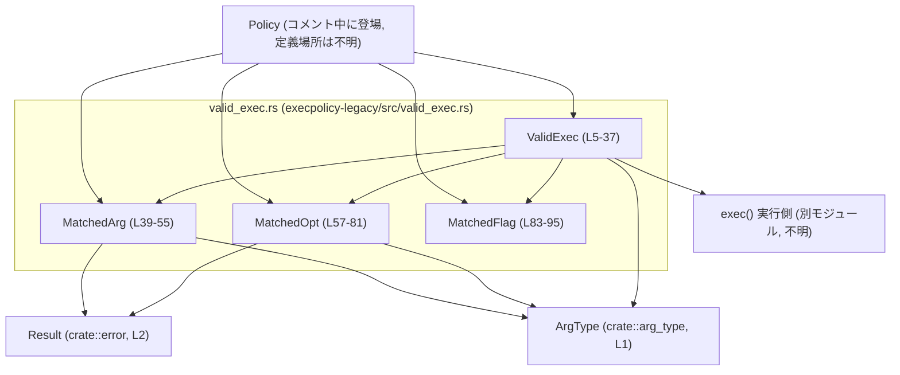
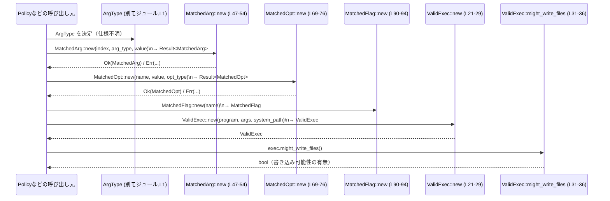

# execpolicy-legacy/src/valid_exec.rs コード解説

## 0. ざっくり一言

`exec()` コマンド呼び出しが `Policy` によって許可された結果を表す `ValidExec` と、その構成要素（引数・オプション・フラグ）を表すデータ構造と簡単なユーティリティ関数を定義するモジュールです。  
各引数は `ArgType` によって検証され、ファイル書き込みが起こりうるかを判定できます。

---

## 1. このモジュールの役割

### 1.1 概要

- このモジュールは、**ポリシーによって許可された `exec()` 呼び出しを表現・検査する**ために存在し、次の機能を提供します。
  - 実行ファイル名とシステムパス候補を保持する `ValidExec` の定義と構築（`new`）  
    → `execpolicy-legacy/src/valid_exec.rs:L5-29`
  - 各引数・オプション・フラグのマッチ結果を表す `MatchedArg` / `MatchedOpt` / `MatchedFlag` の定義と構築  
    → `MatchedArg`: L39-55, `MatchedOpt`: L57-81, `MatchedFlag`: L83-95
  - 引数やオプションの型情報 (`ArgType`) に基づいて、「ファイル書き込みが起こりうるか」を判定するメソッド  
    → `ValidExec::might_write_files`: L31-36

### 1.2 アーキテクチャ内での位置づけ

このモジュールは、外部のポリシー評価ロジックから呼び出されて `ValidExec` を構築し、その後、実際に `exec()` するコンポーネントに渡される「中間表現」のような位置づけと解釈できます（`/// exec() invocation that has been accepted by a Policy.` より。`L5-5`）。

依存関係を簡略化した図を示します。



- `ArgType` と `Result` は他モジュールからインポートされています（`use crate::arg_type::ArgType;` `L1-1`, `use crate::error::Result;` `L2-2`）。
- `Policy` や `exec` 実行側コンポーネントの実装は、このチャンクには現れません。

### 1.3 設計上のポイント

- **構造体中心の設計**  
  - `ValidExec`, `MatchedArg`, `MatchedOpt`, `MatchedFlag` の 4 構造体で、コマンドライン要素を明示的に分割しています。  
    → 定義は `L5-18`, `L39-44`, `L57-66`, `L83-87`
- **型ベースの検証**  
  - `MatchedArg::new` / `MatchedOpt::new` で、`ArgType::validate` を必ず呼び出してからインスタンスを構築しています。  
    → `r#type.validate(value)?;` `L48-48`, `L70-70`
- **副作用の判定の分離**  
  - 実際にファイルを書く処理は行わず、`ArgType::might_write_file()` の情報を集約して `might_write_files()` が真偽値を返すだけの純粋関数です。  
    → `L33-36`
- **シリアライズ可能なデータモデル**  
  - 全構造体が `serde::Serialize` を実装しており、他モジュールから JSON などへシリアライズしやすくなっています。  
    → `#[derive(..., Serialize)]` `L6-6`, `L39-39`, `L58-58`, `L83-83`
- **状態・並行性**  
  - どの型も内部に可変状態や `unsafe` を持たず、このファイル内ではスレッド間共有や非同期処理は行っていません。  
  - 実際に `Send` / `Sync` かどうかは、`ArgType` の実装に依存するため、このチャンクからは判断できません。

---

## 2. 主要な機能一覧

- `ValidExec` の構築: 許可された `exec()` 呼び出しのプログラム名・フラグ・オプション・引数・システムパス候補を一つのオブジェクトにまとめる（`new`）  
  → `L5-29`
- ファイル書き込みの可能性判定: `ArgType` に基づき、オプション・引数がファイルの書き込みを伴うかどうかを判定（`might_write_files`）  
  → `L31-36`
- `MatchedArg` の構築と検証: 位置・型・値を持つ引数オブジェクトを、`ArgType::validate` によって検証しながら作る（`MatchedArg::new`）  
  → `L39-55`
- `MatchedOpt` の構築と検証: 名前・値・型を持つオプションオブジェクトを、`ArgType::validate` によって検証しながら作る（`MatchedOpt::new`）  
  → `L57-76`
- `MatchedOpt` からの名前参照: オプション名を `&str` で取得（`MatchedOpt::name`）  
  → `L78-80`
- `MatchedFlag` の構築: 名前だけを持つフラグオブジェクトを作成（`MatchedFlag::new`）  
  → `L83-95`

---

## 3. 公開 API と詳細解説

### 3.1 型一覧（構造体）

このファイルで定義される主要型の一覧です。

| 名前 | 種別 | 役割 / 用途 | 定義位置 |
|------|------|-------------|----------|
| `ValidExec` | 構造体 | 許可された `exec()` 呼び出しを表現する。プログラム名、マッチしたフラグ・オプション・引数、優先システムパス候補を保持する。 | `execpolicy-legacy/src/valid_exec.rs:L5-18` |
| `MatchedArg` | 構造体 | コマンドライン引数 1 つ分のマッチ結果を保持する。インデックス（位置）、型（`ArgType`）、文字列値を持つ。 | `L39-44` |
| `MatchedOpt` | 構造体 | `.policy` ファイルの `opt()` に対応するオプションのマッチ結果を保持する。名前、値、値の型（`ArgType`）を持つ。 | `L57-66` |
| `MatchedFlag` | 構造体 | `.policy` ファイルのフラグマッチ結果を保持する。フラグ名のみを持つ。 | `L83-87` |

### 3.2 関数詳細（6 件）

#### `ValidExec::new(program: &str, args: Vec<MatchedArg>, system_path: &[&str]) -> ValidExec`

**概要**

- プログラム名・引数・システムパス候補から `ValidExec` を構築します。  
- フラグ・オプションは空のベクタで初期化されます。  
  → 実装: `L21-29`

**引数**

| 引数名 | 型 | 説明 |
|--------|----|------|
| `program` | `&str` | 実行するプログラム名（例: `"ls"` や `"/bin/ls"`）。 |
| `args` | `Vec<MatchedArg>` | すでに検証済みの引数リスト。`MatchedArg::new` 等で構築されている前提です。 |
| `system_path` | `&[&str]` | `program` の代わりに優先的に試すべきフルパス（例: `["/bin/ls"]`）。空でもよい。 |

**戻り値**

- 新しい `ValidExec` インスタンスを返します。  
  - `flags` フィールドは空の `Vec<MatchedFlag>` で、`opts` フィールドは空の `Vec<MatchedOpt>` で初期化されます。  
  - `system_path` は `&[&str]` から `Vec<String>` に変換されて保存されます。  
  → `L23-27`

**内部処理の流れ**

1. `program` を `String` に変換して `program` フィールドに格納する。→ `program: program.to_string(),` `L23-23`
2. `flags` フィールドに空ベクタ `vec![]` をセットする。→ `L24-24`
3. `opts` フィールドに空ベクタ `vec![]` をセットする。→ `L25-25`
4. 渡された `args` ベクタをそのまま `args` フィールドに格納する。→ `L26-26`
5. `system_path` スライスの各 `&str` を `String` に変換し、`Vec<String>` に収集して `system_path` フィールドに格納する。→ `system_path.iter().map(|&s| s.to_string()).collect()` `L27-27`

**Examples（使用例）**

```rust
use crate::valid_exec::{ValidExec, MatchedArg};        // 同一クレート内の型をインポートする
use crate::arg_type::ArgType;                          // ArgType も別モジュールからインポートする
use crate::error::Result;                              // 統一された Result 型

fn build_valid_exec(arg_type: ArgType) -> Result<ValidExec> { // ValidExec を構築するヘルパ関数
    let arg = MatchedArg::new(0, arg_type, "file.txt")?;      // 0 番目の引数として "file.txt" を検証付きで作成する
    let system_path = &["/bin/ls"];                           // 優先的に使うプログラムのフルパス候補
    let ve = ValidExec::new("ls", vec![arg], system_path);    // プログラム名・引数・system_path から ValidExec を作成
    Ok(ve)                                                    // 呼び出し元に返す
}
```

**Errors / Panics**

- この関数自体は `Result` を返さず、エラーを返しません。  
- 内部で呼び出すのは `to_string` と `Vec` の構築のみであり、通常の利用条件では panic を発生させる要素はありません。

**Edge cases（エッジケース）**

- `system_path` が空スライスの場合: `system_path` フィールドは空の `Vec<String>` になります。  
- `args` が空のベクタの場合: `ValidExec` は引数なしコマンドを表すだけで、特別な処理はありません。  
- `program` が空文字列の場合: 特別なバリデーションは行われないため、そのまま空文字列のプログラム名を持つ `ValidExec` が生成されます。妥当性の確認は他モジュール側の責務です。

**使用上の注意点**

- `flags` と `opts` はこの関数では常に空です。フラグ・オプションも利用する場合は、呼び出し側で後から適切な値をセットする必要があります。
- `ValidExec` のフィールドは `pub` なので、構築後に自由に書き換え可能です。`new` が保証したい不変条件（例えば `system_path` が `program` と整合しているかどうかなど）は、呼び出し側が守る必要があります。

---

#### `ValidExec::might_write_files(&self) -> bool`

**概要**

- `ValidExec` に含まれるオプション (`opts`) と引数 (`args`) の `ArgType` を調べ、コマンドを実行した結果として「ファイルを書き込む可能性」があるかどうかを真偽値で返します。  
  → 実装: `L31-36`

**引数**

| 引数名 | 型 | 説明 |
|--------|----|------|
| `&self` | `&ValidExec` | 判定対象の `ValidExec` インスタンスへの参照です。 |

**戻り値**

- `bool`  
  - `true`: いずれかのオプションまたは引数が `ArgType::might_write_file()` によって「ファイル書き込みあり」と判定される場合。  
  - `false`: どのオプション・引数も `might_write_file()` が `false` を返す場合、または `opts` / `args` が空の場合。

**内部処理の流れ**

1. `self.opts` をイテレートし、各 `MatchedOpt` の `r#type.might_write_file()` が一つでも `true` を返すかを調べる。→ `self.opts.iter().any(|opt| opt.r#type.might_write_file())` `L34-34`
2. もしオプションで `true` が見つからなければ、`self.args` をイテレートして、各 `MatchedArg` の `r#type.might_write_file()` が一つでも `true` を返すかを調べる。→ `|| self.args.iter().any(...)` `L35-35`
3. どちらかで `true` が見つかった時点で `true` を返し、見つからなければ `false` を返す。

**Examples（使用例）**

```rust
use crate::valid_exec::ValidExec;                        // ValidExec 型をインポートする

fn check_side_effects(exec: &ValidExec) {                // 副作用をチェックするヘルパ関数
    if exec.might_write_files() {                       // ファイル書き込みの可能性があるか判定する
        // ここで追加のセキュリティ確認やログ出力などを行う想定
        println!("This command might write files.");    // 実装側で好きな処理を追加できる
    } else {
        println!("No file writes expected.");           // 書き込みがないと見なされる場合の処理
    }
}
```

**Errors / Panics**

- この関数は `Result` ではなく `bool` を返すだけで、エラーを返しません。  
- 内部で panic を起こす可能性のある処理は行っていません（イテレータ処理と `any` のみ）。

**Edge cases（エッジケース）**

- `opts` / `args` が空のとき: いずれの `any` も要素がないため、両方とも `false` を返し、結果的に `false` になります。  
- すべての `ArgType` が `might_write_file()` で `false` を返すとき: `false` が返ります。  
- `MatchedFlag` はこの関数では参照されません。フラグがファイル書き込みに影響する仕様があっても、この関数の結果には現れません。

**使用上の注意点**

- この判定は **`ArgType::might_write_file()` の実装に全面的に依存** しています。`ArgType` 側で適切に「書き込みを行う型」を定義しなければ、判定は不完全になります。
- `MatchedFlag` の情報は無視されるため、「書き込みを有効化するフラグ」が存在する設計の場合は、この関数を拡張する必要があります（現状はそうしたフラグを考慮しない仕様になっています）。

---

#### `MatchedArg::new(index: usize, r#type: ArgType, value: &str) -> Result<MatchedArg>`

**概要**

- 引数の位置、型、文字列値から `MatchedArg` を構築します。  
- 構築前に `ArgType::validate(value)` を呼び出し、値が型に適合していることを検証します。  
  → 実装: `L47-54`

**引数**

| 引数名 | 型 | 説明 |
|--------|----|------|
| `index` | `usize` | 引数の位置（0 ベースインデックス）です。元のコマンドライン中の順序を表します。 |
| `r#type` | `ArgType` | この引数に期待される型情報。`validate` や `might_write_file` を提供する型です。 |
| `value` | `&str` | 実際に与えられた引数文字列。 |

**戻り値**

- `Result<MatchedArg>`（`crate::error::Result` の型エイリアス）  
  - `Ok(MatchedArg)`: `value` が `r#type` による検証に合格した場合。  
  - `Err(e)`: `r#type.validate(value)` がエラーを返した場合、そのエラーをそのまま返します。

**内部処理の流れ**

1. `r#type.validate(value)?;` を呼び出し、値が型に適合しているか検証する。→ `L48-48`  
   - 検証に失敗した場合は `Err` を返し、関数を早期終了します（`?` 演算子）。  
2. 検証に成功した場合、`index`, `r#type`, `value.to_string()` を使って `MatchedArg` を構築し、`Ok(Self { ... })` を返します。→ `L49-53`

**Examples（使用例）**

```rust
use crate::valid_exec::MatchedArg;                      // MatchedArg 型をインポートする
use crate::arg_type::ArgType;                           // ArgType 型をインポートする
use crate::error::Result;                               // 統一された Result 型

fn build_arg(idx: usize, arg_type: ArgType, raw: &str)  // 1 つの引数を構築する関数
    -> Result<MatchedArg>
{
    let arg = MatchedArg::new(idx, arg_type, raw)?;     // ArgType による検証付きで MatchedArg を生成する
    Ok(arg)                                             // 呼び出し元に返す
}
```

**Errors / Panics**

- `r#type.validate(value)` が `Err` を返した場合、そのエラーがそのまま返されます。  
  - どういう条件で `Err` になるかは `ArgType` の実装に依存し、このチャンクからは分かりません。
- この関数自体は内部で panic を起こすような処理（`unwrap` など）を使っていません。

**Edge cases（エッジケース）**

- `value` が空文字列: 許容されるかどうかは `ArgType::validate` の実装に依存します。  
- `index` が大きな値: 特別な制御はなく、そのまま格納されます。元の引数位置との整合は呼び出し側の責務です。  
- `r#type` によっては、ファイルパス・数値・列挙値など様々な制約がありえますが、具体的なバリデーション内容はこのチャンクには現れません。

**使用上の注意点**

- 構造体のフィールドは `pub` なので、`MatchedArg { index, r#type, value: value.to_string() }` のように直接構築することも可能ですが、その場合 `ArgType::validate` が実行されません。  
  - セキュリティ・一貫性の観点から、値の検証を必須としたい場合は `new` を経由することが推奨されます。
- `ArgType` が所有権を持って `MatchedArg` に保存されるため、同じ `ArgType` インスタンスを複数の引数に使い回す場合は `Clone` などの設計が必要です（`ArgType` 側の仕様はこのチャンクには現れません）。

---

#### `MatchedOpt::new(name: &str, value: &str, r#type: ArgType) -> Result<MatchedOpt>`

**概要**

- オプション名・値・型情報から `MatchedOpt` を構築します。  
- 構築の前に `ArgType::validate(value)` によって値が妥当かどうかを検証します。  
  → 実装: `L69-76`

**引数**

| 引数名 | 型 | 説明 |
|--------|----|------|
| `name` | `&str` | オプションの名前（例: `"--output"` や `"--config"`）。 |
| `value` | `&str` | オプションに与えられた文字列値。 |
| `r#type` | `ArgType` | オプション値の型情報。`validate` / `might_write_file` を提供する。 |

**戻り値**

- `Result<MatchedOpt>`  
  - `Ok(MatchedOpt)`: `value` が `r#type` による検証に合格した場合。  
  - `Err(e)`: `r#type.validate(value)` がエラーを返した場合。

**内部処理の流れ**

1. `r#type.validate(value)?;` を呼び出し、値が型に適合しているか検証する。→ `L70-70`
2. `name.to_string()`, `value.to_string()`, `r#type` を使って `MatchedOpt` を構築し、`Ok(Self { ... })` を返します。→ `L71-75`

**Examples（使用例）**

```rust
use crate::valid_exec::MatchedOpt;                      // MatchedOpt 型をインポートする
use crate::arg_type::ArgType;                           // ArgType 型をインポートする
use crate::error::Result;                               // 統一された Result 型

fn build_opt(name: &str, raw_value: &str, opt_type: ArgType) // 1 つのオプションを構築する関数
    -> Result<MatchedOpt>
{
    let opt = MatchedOpt::new(name, raw_value, opt_type)?;   // ArgType による検証付きで MatchedOpt を生成する
    Ok(opt)                                                  // 呼び出し元に返す
}
```

**Errors / Panics**

- `r#type.validate(value)` が `Err` を返した場合、そのエラーがそのまま返されます。  
- この関数自体は panic を起こす処理を含みません。

**Edge cases（エッジケース）**

- `name` が空文字列: 特別なバリデーションは行っていないため、そのまま保存されます。  
- `value` が空文字列: 許容されるかどうかは `ArgType::validate` に依存します。  
- 同じ `name` を持つ `MatchedOpt` が複数存在しても、この型自体は制約を設けていません（一意性の管理は呼び出し側の責務です）。

**使用上の注意点**

- ここでも `MatchedOpt { ... }` とリテラル構築すれば `validate` をスキップできますが、セキュリティ上は `new` を使って検証を通す方が安全です。
- どのようなオプションが「ファイル書き込みを伴うか」は、`r#type.might_write_file()` の実装に依存します。

---

#### `MatchedOpt::name(&self) -> &str`

**概要**

- `MatchedOpt` に格納されたオプション名を `&str` として返します。  
  → 実装: `L78-80`

**引数**

| 引数名 | 型 | 説明 |
|--------|----|------|
| `&self` | `&MatchedOpt` | 参照先の `MatchedOpt` です。 |

**戻り値**

- `&str`  
  - 内部フィールド `name: String` への参照を返します。→ `&self.name` `L79-79`

**内部処理の流れ**

- 単純に `&self.name` を返すだけです。

**Examples（使用例）**

```rust
use crate::valid_exec::MatchedOpt;                      // MatchedOpt 型をインポートする

fn print_opt_name(opt: &MatchedOpt) {                   // オプション名を表示するヘルパ関数
    println!("option name: {}", opt.name());            // name() で &str を取得して出力する
}
```

**Errors / Panics**

- エラーを返さず、panic を起こす要素もありません。

**Edge cases（エッジケース）**

- `name` が空文字列であっても、そのまま空文字列の参照が返ります。

**使用上の注意点**

- 返り値は `String` の内部への参照なので、`MatchedOpt` がスコープを抜けると無効になります。これは通常のライフタイムルールでコンパイラが保証します。

---

#### `MatchedFlag::new(name: &str) -> MatchedFlag`

**概要**

- フラグ名から `MatchedFlag` を構築します。  
  → 実装: `L90-94`

**引数**

| 引数名 | 型 | 説明 |
|--------|----|------|
| `name` | `&str` | フラグの名前（例: `"-f"` や `"--force"`）。 |

**戻り値**

- `MatchedFlag`  
  - `name.to_string()` を内部に保持したシンプルな構造体です。

**内部処理の流れ**

1. `name.to_string()` で `String` に変換し、`Self { name: ... }` を返します。→ `L91-93`

**Examples（使用例）**

```rust
use crate::valid_exec::MatchedFlag;                     // MatchedFlag 型をインポートする

fn build_flag(raw: &str) -> MatchedFlag {               // 1 つのフラグを構築する関数
    MatchedFlag::new(raw)                               // &str から MatchedFlag を生成する
}
```

**Errors / Panics**

- この関数はエラーを返さず、通常の利用では panic も発生しません。

**Edge cases（エッジケース）**

- `name` が空文字列: そのまま空文字列のフラグ名として保存されます。  
- 同じ名前の `MatchedFlag` が複数作られても、この型自体は何も制約しません。

**使用上の注意点**

- 他の構造体と違い、`ArgType` による検証は行われません。フラグ自体の妥当性チェックは、別のレイヤ（パーサや `Policy`）で行う設計になっています。

---

### 3.3 その他の関数

- このファイルには、上記で説明した 6 関数以外の関数定義はありません。

---

## 4. データフロー

このモジュールにおける代表的な処理シナリオとして、次の流れが想定されます。

1. コマンドラインパーサや `Policy` ロジックが、引数文字列・オプション文字列を解析する（このチャンクには未定義）。  
2. 解析結果に応じて、`ArgType` インスタンスと生の文字列から `MatchedArg::new` / `MatchedOpt::new` / `MatchedFlag::new` が呼ばれ、各マッチ結果が構築される。  
3. それらをまとめて `ValidExec::new` が呼ばれ、`ValidExec` が作られる。  
4. 実行前に `ValidExec::might_write_files` を呼んで、副作用（ファイル書き込み）の有無をチェックする。

これを sequence diagram で表すと、次のようになります。



- `ArgType` がどのように決定されるか、どのようなバリデーションを行うかは、このチャンクには現れません。
- `Result` のエラー型も `crate::error` に依存し、ここからは不明です。

---

## 5. 使い方（How to Use）

### 5.1 基本的な使用方法

`ValidExec` を構築し、副作用をチェックするまでの典型的な流れの例です。

```rust
use crate::valid_exec::{ValidExec, MatchedArg, MatchedOpt, MatchedFlag}; // このモジュールの公開型をインポートする
use crate::arg_type::ArgType;                                            // 引数型を表す ArgType
use crate::error::Result;                                               // 共通 Result 型

fn build_and_check(                                                   // ValidExec を構築してチェックする関数
    prog_type: ArgType,                                               // プログラム引数の ArgType（実際の意味は ArgType 側に依存）
    opt_type: ArgType,                                                // オプション引数の ArgType
) -> Result<()> {
    // 0 番目の位置引数を作成する（例: ファイル名）
    let arg0 = MatchedArg::new(0, prog_type, "file.txt")?;           // ArgType::validate が実行される

    // オプション "--output" を作成する（値 "out.txt"）
    let opt = MatchedOpt::new("--output", "out.txt", opt_type)?;     // こちらも validate される

    // フラグ "-f" を作成する
    let flag = MatchedFlag::new("-f");                               // 検証は行わず name を保持するだけ

    // ValidExec を構築する（ここでは flags/opts を後から代入する例とする）
    let mut exec = ValidExec::new("myprog", vec![arg0], &["/usr/bin/myprog"]); // プログラム名・引数・system_path をセット

    // フラグとオプションを追加する
    exec.flags.push(flag);                                           // pub なフィールドに直接 push している
    exec.opts.push(opt);                                             // オプションも同様に追加

    // ファイル書き込みの可能性をチェックする
    if exec.might_write_files() {                                    // ArgType::might_write_file に基づいてチェック
        println!("This exec might write files.");                    // 書き込みありと見なされる場合の処理
    }

    Ok(())                                                           // 正常終了
}
```

### 5.2 よくある使用パターン

1. **実行前のセキュリティチェック**

   - `ValidExec` が構築された後、`might_write_files()` を呼んで、サンドボックスや権限昇格の要否を判断する。

   ```rust
   fn should_escalate(exec: &ValidExec) -> bool {                // 権限昇格が必要かどうかを判定する関数
       exec.might_write_files()                                  // ファイル書き込みがありうるなら true を返す
   }
   ```

2. **シリアライズして別プロセスに渡す**

   - すべての構造体が `Serialize` を実装しているため、`serde` 対応のフォーマット（例: JSON）にシリアライズできます。
   - ただし `serde_json` などのクレートが依存関係に含まれているかどうかは、このチャンクからは分からないため、例は「依存を追加した場合」という前提になります。

   ```rust
   // （serde_json を依存に追加している場合の例）
   use crate::valid_exec::ValidExec;                            // ValidExec 型をインポートする
   use serde_json;                                              // JSON へのシリアライズ用クレート

   fn serialize_exec(exec: &ValidExec) -> serde_json::Result<String> { // ValidExec を JSON 文字列に変換する関数
       serde_json::to_string(exec)                                      // Serialize 実装に基づいて JSON に変換する
   }
   ```

### 5.3 よくある間違い

1. **`new` を使わずに直接構造体リテラルで構築してしまう**

```rust
use crate::valid_exec::MatchedArg;
use crate::arg_type::ArgType;

// 間違い例: validate を通さずに直接フィールドを設定している
fn bad_build_arg(index: usize, arg_type: ArgType, value: &str) -> MatchedArg {
    MatchedArg {                                    // pub フィールドなので直接構築できてしまう
        index,
        r#type: arg_type,
        value: value.to_string(),                   // ArgType::validate が呼ばれない
    }
}

// 正しい例: new() を通して検証を行う
fn good_build_arg(index: usize, arg_type: ArgType, value: &str)
    -> crate::error::Result<MatchedArg>
{
    MatchedArg::new(index, arg_type, value)         // validate() を必ず通す
}
```

1. **`Result` を無視してしまう**

```rust
use crate::valid_exec::MatchedOpt;
use crate::arg_type::ArgType;

// 間違い例: unwrap() で強制的に取り出し、バリデーション失敗時に panic する
fn build_opt_unchecked(name: &str, value: &str, ty: ArgType) -> MatchedOpt {
    MatchedOpt::new(name, value, ty).unwrap()       // エラー時に panic する
}

// より安全な例: ? 演算子で呼び出し元にエラーを伝播する
fn build_opt_checked(name: &str, value: &str, ty: ArgType)
    -> crate::error::Result<MatchedOpt>
{
    Ok(MatchedOpt::new(name, value, ty)?)           // 失敗時は Err(...) が返る
}
```

### 5.4 使用上の注意点（まとめ）

- **検証の経路**
  - `MatchedArg` と `MatchedOpt` は、`new` を通した場合のみ `ArgType::validate` による検証が保証されます。  
  - フィールドが `pub` であるため、構造体リテラルで不正な値を挿入することも可能です。バリデーションを重要視する場合は、`new` の使用を前提としたコーディング規約が必要です。
- **ファイル書き込み判定の限界**
  - `ValidExec::might_write_files` は `MatchedFlag` を見ていません。フラグにより書き込みが有効化される仕様がある場合、この関数だけでは検出できません。
- **スレッド安全性**
  - このファイルの型は `String` や `Vec` など標準ライブラリの所有型のみを含みますが、`ArgType` の実装次第で `Send` / `Sync` でない可能性があります。並行処理で共有する場合はコンパイラのエラーや `ArgType` のドキュメントを確認する必要があります。
- **ロギング・観測性**
  - このモジュール自体はログ出力やメトリクス送信を一切行いません。実行状況の観測は呼び出し側で行う必要があります。

---

## 6. 変更の仕方（How to Modify）

### 6.1 新しい機能を追加する場合

例として、「コマンドの実行時刻」などのメタ情報を `ValidExec` に追加したい場合を考えます。

1. **フィールド追加**
   - `ValidExec` 構造体に新フィールドを追加します。  
     → 編集箇所: `ValidExec` 定義 `L7-18`
2. **コンストラクタの更新**
   - `ValidExec::new` に引数を追加するか、もしくは新フィールドにデフォルト値を設定します。  
     → 編集箇所: `ValidExec::new` `L21-29`
3. **シリアライズへの影響確認**
   - `Serialize` 派生により、自動的にシリアライズ対象に含まれます。フォーマット互換性（JSON スキーマなど）が必要であれば、利用側も合わせて確認する必要があります。
4. **利用箇所の修正**
   - `ValidExec::new` のシグネチャが変わる場合は、呼び出し元をすべて修正する必要があります。  
   - 使用箇所の特定には IDE の参照検索などが役立ちます。

### 6.2 既存の機能を変更する場合

- `might_write_files` の判定ロジックを変える場合
  - 影響箇所: `L31-36`
  - 変更例: `flags` も考慮する、`ArgType` の判定に加えて別のルールを導入するなど。
  - 契約: 戻り値 `bool` の意味（「ファイルを書き込む可能性があるかどうか」）は維持した方が、利用側のコード変更が少なく済みます。
- `MatchedArg::new` / `MatchedOpt::new` の検証戦略を変える場合
  - 影響箇所: `L47-54`, `L69-76`
  - たとえば、より詳細なエラー情報を返すために `Result` のエラー型を変更すると、`crate::error::Result` の定義変更が波及します。
- テストに関する注意
  - このファイルにはテストコードは含まれていません（`#[cfg(test)]` などはこのチャンクには現れません）。
  - 振る舞いを変える場合は、別ファイルにあるであろうユニットテスト・統合テストを合わせて更新する必要があります（テストファイルの場所はこのチャンクからは不明です）。

---

## 7. 関連ファイル

このモジュールと密接に関係しそうなファイル・モジュールです（いずれもこのチャンクには定義が現れません）。

| パス / モジュール名（推定含む） | 役割 / 関係 |
|---------------------------------|------------|
| `crate::arg_type` (`ArgType`) | 引数値の型情報・バリデーション・副作用情報を提供する。`MatchedArg` / `MatchedOpt` / `ValidExec::might_write_files` が利用。→ `L1-1`, `L42-42`, `L65-65` |
| `crate::error` (`Result`) | 統一されたエラー型 `Result` を提供する。`MatchedArg::new` / `MatchedOpt::new` の戻り値に使用。→ `L2-2`, `L47-47`, `L69-69` |
| `Policy` を定義するモジュール（パス不明） | `/// exec() invocation that has been accepted by a Policy.`（`L5-5`）というコメントから、`ValidExec` を生成するポリシー評価ロジックが存在すると考えられますが、定義場所はこのチャンクには現れません。 |
| `exec` 実行ロジックを持つモジュール（パス不明） | `ValidExec` を受け取り、実際に `exec()` システムコールを行う側のコード。`ValidExec` の利用者ですが、詳細はこのチャンクには現れません。 |

---

## Bugs / Security 観点（まとめ）

- **バリデーションの抜け道**
  - フィールドが `pub` のため、`MatchedArg` / `MatchedOpt` を `new` を通さずに構築できてしまいます。  
  - `ArgType::validate` を通っていない値を `ValidExec` に含めることが技術的には可能であり、ポリシー実装によってはセキュリティ上の抜け穴となりえます。
- **副作用判定のカバレッジ**
  - `might_write_files` は `opts` と `args` の `ArgType` だけを見ており、`flags` は考慮していません（`L33-35`）。  
  - 特定のフラグがファイル書き込みをオンにする仕様がある場合、現状の判定では検出されません。

これらの点は、実際にどのようにこのモジュールが使われているか（他ファイル）を合わせて確認することが重要です。このチャンク単体では、それ以上の判断はできません。
