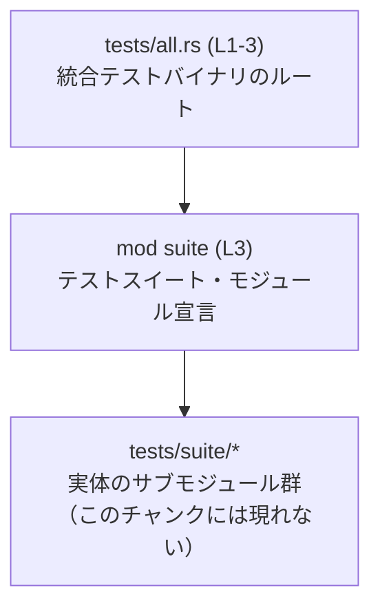

# execpolicy-legacy/tests/all.rs コード解説

## 0. ざっくり一言

- `execpolicy-legacy/tests/all.rs` は、統合テスト用バイナリのエントリポイントとして、`suite` モジュールを 1 つだけ宣言し、その配下にある全テストモジュールを集約するためのファイルです（`execpolicy-legacy/tests/all.rs:L1-3`）。

---

## 1. このモジュールの役割

### 1.1 概要

- コメントから、このファイルは「単一の統合テストバイナリとして、すべてのテストモジュールを集約する」ために存在すると読めます（`execpolicy-legacy/tests/all.rs:L1-1`）。
- `mod suite;` によって、実際のテストコードを含む `suite` モジュール（実体は `tests/suite/` 配下）をこのテストバイナリに取り込んでいます（`execpolicy-legacy/tests/all.rs:L2-3`）。
- このファイル自身には関数や構造体などのロジックはなく、モジュール宣言のみが記述されています（`execpolicy-legacy/tests/all.rs:L3-3`）。

### 1.2 アーキテクチャ内での位置づけ

- Rust の慣習として、`tests/all.rs` は 1 つの「統合テストクレート（テスト用バイナリ）」になります。
- このファイルは、そのテストクレートのルートに位置し、`suite` モジュールを通じて個々のテストモジュールへアクセスする構造になっています（`execpolicy-legacy/tests/all.rs:L2-3`）。
- コメントから、個々のテストモジュールは `tests/suite/` ディレクトリ配下に存在することが分かります（`execpolicy-legacy/tests/all.rs:L2-2`）。

この関係を簡略化して図示します。



### 1.3 設計上のポイント

- **単一バイナリへの集約**  
  - コメントに「Single integration test binary」とあり、このファイルを通じてテストを 1 つのバイナリにまとめる意図が示されています（`execpolicy-legacy/tests/all.rs:L1-1`）。
- **責務の分離**  
  - このファイルは「エントリポイントとしてモジュールをまとめる」責務のみを持ち、実際のテストロジックは `suite` モジュール側に委ねられています（`execpolicy-legacy/tests/all.rs:L3-3`）。
- **状態・エラー・並行性**  
  - このファイルにはグローバル状態、関数、スレッド生成、エラーハンドリングロジックなどは一切ありません。  
    → メモリ安全性・エラー処理・並行性に関する挙動は、すべて `suite` 配下の実装に依存します（`execpolicy-legacy/tests/all.rs:L3-3`）。

---

## 2. 主要な機能一覧

このファイル単体で提供している機能は 1 つだけです。

- **テストスイートモジュールの集約**  
  - `suite` モジュールを統合テストバイナリに取り込み、その配下にあるテストモジュール群をまとめて実行可能にする（`execpolicy-legacy/tests/all.rs:L1-3`）。

実際の「テストをどう実行するか」「どのような挙動を検証しているか」は、このチャンクには現れません。

---

## 3. 公開 API と詳細解説

### 3.1 コンポーネント一覧（モジュール・型）

このファイルに現れるコンポーネントはモジュール宣言のみです。  
（構造体・列挙体などの型定義は存在しません。）

#### モジュール・インベントリー

| 種別     | 名前      | 役割 / 用途                                                                                           | 定義位置 |
|----------|-----------|--------------------------------------------------------------------------------------------------------|----------|
| モジュール宣言 | `suite` | 統合テストのサブモジュール群を含むルートモジュールを現在のテストクレートに取り込む。実体は `tests/suite/` 配下にあるとコメントから読み取れる。 | `execpolicy-legacy/tests/all.rs:L3-3` |

#### 型一覧

このファイルには構造体・列挙体・型エイリアスは定義されていません。

| 名前 | 種別 | 役割 / 用途 | 定義位置 |
|------|------|-------------|----------|
| なし | –    | –           | –        |

### 3.2 関数詳細（最大 7 件）

- このファイルには関数・メソッド・`#[test]` 関数などは定義されていません（`execpolicy-legacy/tests/all.rs:L1-3`）。
- したがって、「公開 API」として詳細に説明すべき関数は存在しません。

### 3.3 その他の関数

- 補助関数やラッパー関数も、このチャンクには現れません。

| 関数名 | 役割（1 行） | 定義位置 |
|--------|--------------|----------|
| なし   | –            | –        |

---

## 4. データフロー

このファイルには実行時のロジックは含まれていませんが、Rust のテスト実行モデルとコメントから、統合テスト実行時のおおまかなデータ・制御フローを次のように整理できます。

1. `cargo test` / `cargo test --test all` によって、`tests/all.rs` が 1 つの統合テストバイナリとしてコンパイル・起動される（一般的な Rust の仕様）。
2. コンパイル時に `mod suite;` に対応する `suite` モジュール（`tests/suite/` 配下）が読み込まれる（`execpolicy-legacy/tests/all.rs:L2-3`）。
3. 実際のテスト関数（`#[test]` 付き関数など）は `suite` モジュールおよびそのサブモジュール内に定義されており、テストランナーがそれらを検出・実行する（このチャンクには現れない）。

これをシーケンス図として表します。

```mermaid
sequenceDiagram
    participant Runner as Rustテストランナー\n（このチャンクには現れない）
    participant All as tests/all.rs (L1-3)\n統合テストバイナリ
    participant Suite as suiteモジュール (宣言: L3)
    participant Submods as tests/suite/*\nサブモジュール群（このチャンクには現れない）

    Runner->>All: バイナリ all を起動（cargo test --test all）
    Note over All: コンパイル時に mod suite; を解決（L3）
    All->>Suite: suite モジュールをリンク
    Suite->>Submods: サブモジュールを読み込み（tests/suite/*）
    Runner->>Submods: #[test] 付き関数を検出・実行<br/>（このチャンクには詳細は現れない）
```

### 安全性・エラー・並行性の観点

- **メモリ安全性**  
  - このファイルはコンパイル時のモジュール宣言のみであり、実行時にオブジェクトを生成したりポインタを操作したりするコードはありません（`execpolicy-legacy/tests/all.rs:L1-3`）。
- **エラーハンドリング**  
  - 自らエラーを生成・処理するコードはありません。  
  - `suite` モジュールが見つからない場合などは、コンパイル時エラーとして扱われます（Rust のモジュール解決仕様）。
- **並行性**  
  - スレッド・非同期タスク・チャネルなどの並行処理は一切行っておらず、並行性に関する責務もありません。  
  - テストの並列実行は Rust テストランナー側の責務であり、このファイルからは制御できません。

---

## 5. 使い方（How to Use）

### 5.1 基本的な使用方法

このファイルはライブラリ API のように他コードから直接呼び出すものではなく、「テストを実行する際に `cargo test` が利用するエントリポイント」です。

#### テストの実行

```bash
# プロジェクト全体のテストを実行（単体テスト＋統合テスト）
cargo test

# このファイルに対応する統合テストバイナリ（all）のみを実行
cargo test --test all
```

- 上記コマンドにより、`tests/all.rs` が統合テストクレートとしてコンパイルされ、`mod suite;` を通じて `tests/suite/` 配下のテスト群が実行対象になります（`execpolicy-legacy/tests/all.rs:L2-3`）。

### 5.2 よくある使用パターン

- **テストモジュールを増やす**  
  - コメントから、個々のテストモジュールは `tests/suite/` 配下に置く想定であることが分かります（`execpolicy-legacy/tests/all.rs:L2-2`）。
  - 一般的なパターンとしては、新しい統合テストを追加する場合は `tests/suite/` 以下に新しい `.rs` ファイルやサブディレクトリを作成し、`suite` モジュールの中で `mod` 宣言を追加します（`suite` 実装はこのチャンクには現れません）。

### 5.3 よくある間違い

Rust のモジュールシステムとこのファイルの内容から、起こりうる典型的な問題を挙げます。

```rust
// 間違い例: mod 名とディレクトリ構成が一致していない
mod suites; // 実際のディレクトリは tests/suite/ のまま など

// 正しい例: コメントの通り、tests/suite/ に対応した mod 名
mod suite;  // execpolicy-legacy/tests/all.rs:L3-3
```

- **モジュール名とディレクトリが不一致**  
  - `mod suite;` に対応するパスが見つからない場合、コンパイル時に「モジュールが見つからない」エラーになります（`execpolicy-legacy/tests/all.rs:L3-3`）。
- **`tests/suite/` ではなく他の場所にテストを置く**  
  - コメントと異なるディレクトリ構成（例: `tests/integration/`）にしていると、意図通りにテストが集約されない可能性があります（`execpolicy-legacy/tests/all.rs:L2-2`）。

### 5.4 使用上の注意点（まとめ）

- **前提条件**
  - `mod suite;` に対応する `suite` モジュールが Rust のモジュール規約に従って正しく配置されている必要があります（通常は `tests/suite/mod.rs` 等；`execpolicy-legacy/tests/all.rs:L3-3`）。
- **禁止事項 / 推奨されないこと**
  - このファイルにアプリケーションロジックや重い処理を直接書くことは、テストコードの責務の分離を損ねるため避けるのが一般的です。テスト内容は `suite` 側に置くのが自然です。
- **エッジケース**
  - `suite` モジュールが空、もしくは `#[test]` 関数を持たない場合でも、このファイルはコンパイルされますが、実行されるテストは 0 件になります。
- **性能面**
  - このファイル自体は性能への影響をほぼ持ちません。  
    コンパイル時間・実行時間の大部分は `suite` 配下のテストコードに依存します。

---

## 6. 変更の仕方（How to Modify）

### 6.1 新しい機能（テスト）を追加する場合

このファイルのコメントから、実際のテストコードは `tests/suite/` 配下にあることが分かります（`execpolicy-legacy/tests/all.rs:L2-2`）。  
したがって、新しいテストを追加する場合、通常は以下のような流れになります。

1. **`tests/suite/` 配下に新しいテストファイルを追加する**  
   - 例: `tests/suite/new_feature.rs` を作成し、そこに `#[test]` 関数を定義する。  
   - このステップはこのチャンクには現れませんが、コメントから妥当な場所と判断できます。
2. **`suite` モジュール側で `mod new_feature;` を宣言する**  
   - `tests/suite/mod.rs` 等のファイルが存在する想定です（このチャンクには現れない）。
3. **`tests/all.rs` 側は通常変更不要**  
   - すでに `mod suite;` があり、`suite` 配下に新しいモジュールをぶら下げる設計であるためです（`execpolicy-legacy/tests/all.rs:L3-3`）。

### 6.2 既存の機能を変更する場合

`tests/all.rs` 自体で行える変更は限定的です。

- **テストスイート名を変更する場合**
  - 例: `mod suite;` を別名に変更する場合は、対応するディレクトリ・ファイル名も Rust のモジュール規約に従って変更する必要があります（`execpolicy-legacy/tests/all.rs:L3-3`）。
- **複数の統合テストバイナリに分割する場合**
  - このファイルとは別に `tests/other.rs` などを追加し、そこでも別のモジュールを `mod` するという構成にできます。  
  - この場合、このファイルのコメント「Single integration test binary」は設計意図と合わなくなるため、コメントの更新が必要になります（`execpolicy-legacy/tests/all.rs:L1-1`）。

変更時の注意点:

- **契約（Contracts）**
  - `mod suite;` が有効であること（対応するモジュールが存在すること）が、このファイルの唯一の前提条件です。これが崩れるとコンパイルエラーになります（`execpolicy-legacy/tests/all.rs:L3-3`）。
- **影響範囲**
  - このファイルを変更すると、「どのモジュールがこの統合テストバイナリに含まれるか」という単位に影響しますが、個々のテスト内容の動作には直接の変更はありません。

---

## 7. 関連ファイル

このチャンクとコメントから、密接に関係すると考えられるファイル・コンポーネントをまとめます。

| パス / コンポーネント | 役割 / 関係 | 根拠 |
|-----------------------|------------|------|
| `execpolicy-legacy/tests/suite/` | 実際のテストモジュール群が配置されるディレクトリ。`suite` モジュールの実体がここにあるとコメントから読み取れます。 | 「The submodules live in `tests/suite/`.」というコメント（`execpolicy-legacy/tests/all.rs:L2-2`） |
| `suite` モジュールの実体（例: `execpolicy-legacy/tests/suite/mod.rs`） | `mod suite;` に対応するモジュール本体。ここでさらにサブモジュールを `mod` し、個々のテストを定義していると考えられます。 | `mod suite;` 宣言と Rust のモジュール規約（`execpolicy-legacy/tests/all.rs:L3-3`） |
| Rust テストランナー（`cargo test` により起動される） | `tests/all.rs` を統合テストクレートとしてコンパイル・実行し、`suite` 配下の `#[test]` 関数を実行するコンポーネントです。 | Rust のテスト実行仕様と `tests/` ディレクトリの位置付け（一般仕様、コード外） |

> 補足: このチャンクには `suite` モジュールやそのサブモジュールの中身は一切現れないため、それらの具体的な API・テスト内容・内部構造については「不明」です。
