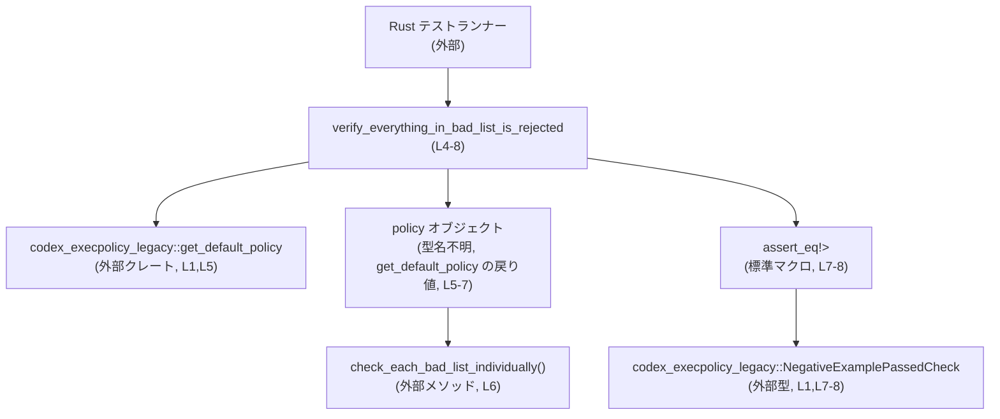
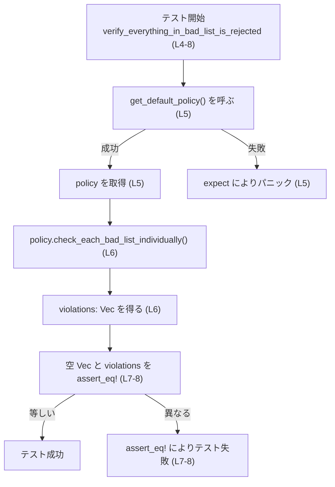
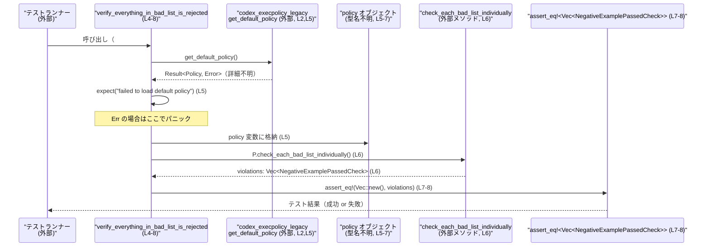

# execpolicy-legacy\tests\suite\bad.rs

## 0. ざっくり一言

`codex_execpolicy_legacy` クレートの「デフォルトポリシー」が、すべての「bad list」項目を正しく拒否していることを検証する単一のテスト関数を定義するファイルです（`execpolicy-legacy\tests\suite\bad.rs:L1-8`）。

---

## 1. このモジュールの役割

### 1.1 概要

- このテストモジュールは、`codex_execpolicy_legacy::get_default_policy` が返すデフォルトポリシーに対して、
  「bad list」と呼ばれる負例集合を個別にチェックした結果、**1件の違反（`NegativeExamplePassedCheck`）も発生しないこと**を確認する役割を持ちます（`execpolicy-legacy\tests\suite\bad.rs:L1-2,L4-8`）。
- 具体的には、`policy.check_each_bad_list_individually()` の戻り値ベクタが空であることを `assert_eq!` で検証します（`execpolicy-legacy\tests\suite\bad.rs:L6-8`）。

※ 「bad list」の具体的な中身やチェック内容は、このファイルには現れません。

### 1.2 アーキテクチャ内での位置づけ

このファイルは、アプリケーション本体ではなく **テストスイート** に属するモジュールです。ライブラリ本体の API を利用して、期待されるポリシー挙動を検証しています。

依存関係の概略は次の通りです。



- このファイル自身は `codex_execpolicy_legacy` の型や関数を **使用** するのみで、定義は行いません（`execpolicy-legacy\tests\suite\bad.rs:L1-2`）。
- テスト実行時には Rust のテストランナーが `#[test]` 属性付き関数を自動で呼び出します（`execpolicy-legacy\tests\suite\bad.rs:L3-4`）。

### 1.3 設計上のポイント

このテストから読み取れる設計上の特徴は次の通りです。

- **エラーの扱い**  
  - `get_default_policy()` の失敗は `expect("failed to load default policy")` により **テストのパニック（強制失敗）** として扱われます（`execpolicy-legacy\tests\suite\bad.rs:L5`）。
- **期待する契約（テストの前提）**  
  - `policy.check_each_bad_list_individually()` が返す `Vec<NegativeExamplePassedCheck>` は **常に空であるべき** という契約を置いています（`execpolicy-legacy\tests\suite\bad.rs:L6-8`）。
- **状態管理**  
  - このファイル内ではグローバル状態を持たず、`policy` ローカル変数のみを利用する純粋なテストになっています（`execpolicy-legacy\tests\suite\bad.rs:L5-7`）。
- **並行性**  
  - 並行処理やスレッド関連の API は登場せず、テストは単一スレッド前提の同期処理のみです（全行を通じて該当コードなし）。

---

## 2. 主要な機能一覧

このファイルが提供する機能は単一のテスト関数です。

- `verify_everything_in_bad_list_is_rejected`: デフォルトポリシーに対して bad list を個別にチェックし、違反ベクタが空であることを検証するテスト（`execpolicy-legacy\tests\suite\bad.rs:L4-8`）。

---

## 3. 公開 API と詳細解説

### 3.1 型・関数インベントリー

このチャンクに「定義」として現れるのはテスト関数のみです。その他は外部クレートまたは標準マクロの利用です。

#### 定義されている関数

| 名前 | 種別 | 役割 / 用途 | 定義箇所 |
|------|------|-------------|----------|
| `verify_everything_in_bad_list_is_rejected` | 関数（テスト） | デフォルトポリシーが bad list の全項目を拒否していることを検証する | `execpolicy-legacy\tests\suite\bad.rs:L4-8` |

#### 外部から使用している主要コンポーネント

| 名前 | 種別 | 役割 / 用途（このファイルから読み取れる範囲） | 使用箇所 |
|------|------|----------------------------------------------|----------|
| `codex_execpolicy_legacy::NegativeExamplePassedCheck` | 構造体 or 列挙体（型） | `Vec<NegativeExamplePassedCheck>` 型の空ベクタを期待値として使う。違反情報（「bad な例が通ってしまった」ケース）を表す型と推測されるが、詳細なフィールドや意味はこのチャンクには現れません。 | `execpolicy-legacy\tests\suite\bad.rs:L1,L7-8` |
| `codex_execpolicy_legacy::get_default_policy` | 関数 | デフォルトポリシーをロードする。`expect` から、`Result` などエラーを返しうる API であることが分かります。具体的な戻り値の型名はこのチャンクには現れません。 | `execpolicy-legacy\tests\suite\bad.rs:L2,L5` |
| `policy.check_each_bad_list_individually` | メソッド | `policy` オブジェクトに対して bad list を個別にチェックし、`Vec<NegativeExamplePassedCheck>` を返します。具体的なチェック手順やデータ構造はこのチャンクには現れません。 | `execpolicy-legacy\tests\suite\bad.rs:L6` |
| `assert_eq!` | マクロ（標準ライブラリ） | 実際の違反ベクタと、空の期待ベクタを比較し、一致しなければテストを失敗させる | `execpolicy-legacy\tests\suite\bad.rs:L7-8` |

> 補足: `policy` 変数の型は `get_default_policy` の戻り値として使われているだけで、このチャンクには型名が現れません（`execpolicy-legacy\tests\suite\bad.rs:L5`）。

---

### 3.2 関数詳細

#### `verify_everything_in_bad_list_is_rejected() -> ()`

**概要**

- `#[test]` 属性が付与されたテスト関数です（`execpolicy-legacy\tests\suite\bad.rs:L3-4`）。
- デフォルトポリシーを取得し、bad list を個別にチェックした結果、**違反ベクタが空であること**を検証します（`execpolicy-legacy\tests\suite\bad.rs:L5-8`）。

**引数**

- 引数はありません（`fn verify_everything_in_bad_list_is_rejected()` の定義より、`execpolicy-legacy\tests\suite\bad.rs:L4`）。

**戻り値**

- 戻り値型は明示されていませんが、Rust の慣習に従ってユニット型 `()` です（テスト関数のため、戻り値は利用されません）。

**内部処理の流れ（アルゴリズム）**

1. `get_default_policy` を呼び出し、デフォルトポリシーを取得する（`execpolicy-legacy\tests\suite\bad.rs:L5`）。
   - 戻り値に対して `.expect("failed to load default policy")` を呼び出しているため、`Result` などエラーを返しうる API であると分かります。
   - エラーが返された場合はパニックし、テストは直ちに失敗します。
2. 取得した `policy` 変数に対して `check_each_bad_list_individually()` メソッドを呼び出し、`violations` ベクタを受け取ります（`execpolicy-legacy\tests\suite\bad.rs:L6`）。
3. 期待値として空の `Vec::<NegativeExamplePassedCheck>::new()` を作り、`violations` と `assert_eq!` で比較します（`execpolicy-legacy\tests\suite\bad.rs:L7-8`）。
   - ベクタが空であればテストは成功し、
   - 1件でも `NegativeExamplePassedCheck` が入っていれば、`assert_eq!` によりテストが失敗します。

簡易フローチャートは次の通りです。



**Examples（使用例）**

この関数はテストランナーから自動で呼ばれるため、通常コードから直接呼び出すことは想定されていません。利用イメージとしては、プロジェクトルートで次のようにテストを実行する形になります。

```bash
# プロジェクト全体のテストを実行
cargo test

# （名前で絞込みたい場合の一例）
cargo test verify_everything_in_bad_list_is_rejected
```

このとき、`codex_execpolicy_legacy` クレートがビルドされ、`get_default_policy` および関連コードがリンクされたうえで、本テスト関数が実行されます。

**Errors / Panics**

- `get_default_policy` がエラーを返した場合  
  - `.expect("failed to load default policy")` により **パニック** します（`execpolicy-legacy\tests\suite\bad.rs:L5`）。
  - パニックメッセージは `"failed to load default policy"` になります。
- `check_each_bad_list_individually` の戻り値が空でない場合  
  - `assert_eq!` によりテストが失敗し、Rust のテストランナーは失敗として報告します（`execpolicy-legacy\tests\suite\bad.rs:L7-8`）。
- その他のパニック要因  
  - `check_each_bad_list_individually` 自体の内部で起こりうるパニックやエラーについては、このチャンクには情報がありません。

**Edge cases（エッジケース）**

この関数の観点から重要になりうるケースは次の通りです。

- `get_default_policy` が一時的な環境要因（設定ファイル欠如など）で失敗する場合  
  - テストはポリシーの内容とは無関係に失敗します（`execpolicy-legacy\tests\suite\bad.rs:L5`）。
- `check_each_bad_list_individually` が `Ok(Vec::new())` 相当の空ベクタを返す場合  
  - テストは成功します（`execpolicy-legacy\tests\suite\bad.rs:L6-8`）。
- `check_each_bad_list_individually` が1件以上の `NegativeExamplePassedCheck` を含むベクタを返す場合  
  - テストは失敗し、「本来は拒否されるべき bad list の要素が通っている」ことを示すシグナルとなります（`execpolicy-legacy\tests\suite\bad.rs:L6-8`）。

`NegativeExamplePassedCheck` 構造体の詳細な中身や、どのような状態が「違反」とみなされるかは、このチャンクには現れません。

**使用上の注意点**

- この関数はテスト専用であり、ライブラリ使用者が直接呼び出す API ではありません。
- テストの前提（契約）として、
  - 「デフォルトポリシーのロードが成功すること」
  - 「bad list の各要素がポリシーにより拒否されること」
  を要求していますが、後者の具体的な仕様は他ファイル側に依存します。
- テストが失敗した場合、ポリシー実装に問題があるのか、テストデータ（bad list）が期待とずれているのかを切り分けるには、`codex_execpolicy_legacy` クレート内の実装を確認する必要があります（このチャンクからは分かりません）。

---

### 3.3 その他の関数

このファイル内に他の関数定義はありません（`execpolicy-legacy\tests\suite\bad.rs:L1-8`）。

---

## 4. データフロー

### 4.1 代表的な処理シナリオ

テスト実行時のデータと呼び出しの流れを、テストランナーから見たシーケンスで表します。



要点:

- このファイルの中で生成されるデータは `policy` と `violations` の 2 つのローカル変数のみです（`execpolicy-legacy\tests\suite\bad.rs:L5-6`）。
- `violations` は `NegativeExamplePassedCheck` のベクタであり、これが空であるかどうかだけがこのテストで検証されます（`execpolicy-legacy\tests\suite\bad.rs:L6-8`）。
- `get_default_policy` と `check_each_bad_list_individually` の内部データフローは、このチャンクには現れません。

---

## 5. 使い方（How to Use）

### 5.1 基本的な使用方法

このファイルは **テストコード** なので、「使い方」は主にテスト実行方法と保守方法に関するものになります。

- テスト実行:
  - 通常の Cargo プロジェクトであれば、プロジェクトルートで `cargo test` を実行すると、`#[test]` が付いた本関数も含めてテストが実行されます。
- テストの意味:
  - デフォルトポリシーを変更したときに、本テストが通るかどうかが、bad list への対応が維持されているかどうかの一つの指標になります（`execpolicy-legacy\tests\suite\bad.rs:L5-8`）。

### 5.2 よくある使用パターン

このテストのパターンは、次のような形で再利用できます。

- **別の観点の検証テストを追加する場合のパターン**

```rust
use codex_execpolicy_legacy::get_default_policy;                  // デフォルトポリシーを取得する関数（L2 と同様）
use codex_execpolicy_legacy::NegativeExamplePassedCheck;          // 必要に応じて利用（L1 と同様）

#[test]
fn another_policy_property_is_held() {                             // 新しいテスト（名前は例）
    let policy = get_default_policy().expect("failed to load default policy"); // L5 と同じ取得パターン

    // ここで policy に対する別のメソッドを呼び、
    // 結果が期待通りかを assert_* マクロで検証する ...... という流れは同じです。
}
```

この例のうち、実際に使われているのは以下のパターンです（このファイルのコードから見た事実）:

- `get_default_policy()` でポリシーを取得する（`execpolicy-legacy\tests\suite\bad.rs:L5`）。
- 取得したポリシーに対して何らかの検証メソッドを呼ぶ（ここでは `check_each_bad_list_individually`）（`execpolicy-legacy\tests\suite\bad.rs:L6`）。
- 結果を `assert_eq!` などで検証する（`execpolicy-legacy\tests\suite\bad.rs:L7-8`）。

### 5.3 よくある間違い

このファイルから推測される、起こりやすい誤用・注意点を挙げます。

```rust
// 誤りの可能性がある例: get_default_policy のエラーを無視してしまう
fn bad_test() {
    let policy = get_default_policy().unwrap_or_else(|_| {
        // 適当なデフォルトを返してしまうなど
        unimplemented!()
    });
    // ここで検証しても、本来のデフォルトポリシーではない可能性がある
}

// 正しいパターンの例: エラーならテストを失敗させる（このファイルと同じ）
fn correct_test() {
    let policy = get_default_policy().expect("failed to load default policy");
    // 取得した policy に対して検証を行う
}
```

- 本ファイルでは `expect` を使うことで、デフォルトポリシーのロードに失敗した場合には **テスト自体を失敗** とみなす設計になっています（`execpolicy-legacy\tests\suite\bad.rs:L5`）。
- エラーを握りつぶしてテストを通過させてしまうと、テストの意味が損なわれることになります。

### 5.4 使用上の注意点（まとめ）

- このファイルはテスト専用であり、ライブラリ API の一部ではありません。
- `get_default_policy` や `check_each_bad_list_individually` の挙動に依存しているため、これらのシグネチャや戻り値の意味を変更する場合は、本テストの期待値（空ベクタ）との整合性に注意する必要があります（`execpolicy-legacy\tests\suite\bad.rs:L5-8`）。
- テストが失敗した場合、まず `get_default_policy` のロードに問題がないか（環境依存要因など）、次に bad list の中身やポリシー実装を確認する必要がありますが、その詳細はこのチャンクには現れません。

---

## 6. 変更の仕方（How to Modify）

### 6.1 新しい機能を追加する場合（テスト追加）

デフォルトポリシーに新しい性質を持たせ、それをテストしたい場合、このファイルのパターンを再利用できます。

1. `execpolicy-legacy\tests\suite\` ディレクトリに、別のテストファイルを追加するか、このファイルに新しい `#[test]` 関数を追加します。
2. 既存と同様に `get_default_policy` を呼び出し、`expect` でエラーをテスト失敗として扱います（`execpolicy-legacy\tests\suite\bad.rs:L5`）。
3. 追加機能に対応するメソッドやチェック関数を呼び出し、`assert_eq!` や `assert!` を用いて期待する性質を検証します（`execpolicy-legacy\tests\suite\bad.rs:L6-8` のパターン）。

このチャンクには他のポリシー API が現れないため、どのメソッドを呼ぶべきかなどの詳細は、`codex_execpolicy_legacy` クレート側の定義を確認する必要があります。

### 6.2 既存の機能を変更する場合（このテストの更新）

`check_each_bad_list_individually` の仕様や、`NegativeExamplePassedCheck` の解釈が変わる場合、本テストの「期待値が空ベクタであること」という契約を見直す必要が出てきます（`execpolicy-legacy\tests\suite\bad.rs:L6-8`）。

変更時の注意点:

- `check_each_bad_list_individually` の戻り値が、今後は「一定数の警告を含むのが正しい」など仕様変更される場合、
  - `assert_eq!(Vec::<NegativeExamplePassedCheck>::new(), violations);` という検証は仕様に合わなくなります（`execpolicy-legacy\tests\suite\bad.rs:L7-8`）。
- その場合は、仕様に沿った新しいアサーション（例えば「特定条件を満たす要素だけが含まれる」など）に書き換える必要があります。

どのような仕様変更が妥当かは `codex_execpolicy_legacy` クレート側の設計に依存し、このチャンクだけからは判断できません。

---

## 7. 関連ファイル

このファイルと密接に関係するのは、`codex_execpolicy_legacy` クレート内の実装ファイル群です。ただし、具体的なパスはこのチャンクからは分かりません。

| パス / コンポーネント | 役割 / 関係 |
|-----------------------|------------|
| `codex_execpolicy_legacy::get_default_policy`（定義ファイル不明） | デフォルトポリシーを構築またはロードする関数。本テストで必須の依存であり、失敗時はテストも失敗します（`execpolicy-legacy\tests\suite\bad.rs:L2,L5`）。 |
| `codex_execpolicy_legacy::NegativeExamplePassedCheck`（定義ファイル不明） | bad list の要素が誤って「通ってしまった」ケースを表す違反情報と推測される型。テストでは、この型のベクタが空であることを期待します（`execpolicy-legacy\tests\suite\bad.rs:L1,L7-8`）。 |
| `policy.check_each_bad_list_individually`（メソッド定義ファイル不明） | デフォルトポリシーに対して bad list をチェックし、`Vec<NegativeExamplePassedCheck>` を返すメソッド。本テストが直接検証しているコアロジックです（`execpolicy-legacy\tests\suite\bad.rs:L6`）。 |

> 補足: ここで挙げた関連コンポーネントの正確なファイルパスや内部実装は、**このチャンクには現れない** ため不明です。
