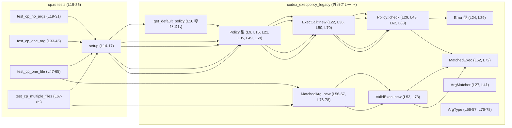
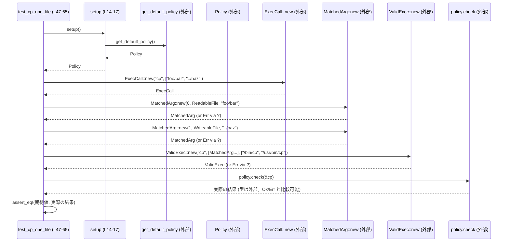

# execpolicy-legacy/tests/suite/cp.rs

## 0. ざっくり一言

`codex_execpolicy_legacy` クレートにおける `cp` コマンド用の実行ポリシーが、引数の個数・内容に応じて正しくエラー／成功を返すかを検証するテスト群です（cp.rs:L19-L85）。

---

## 1. このモジュールの役割

### 1.1 概要

- このモジュールは、`get_default_policy()` で取得したデフォルトの `Policy` が、`cp` プログラムを
  - 引数なし
  - 1 つだけ
  - 2 つ（コピー元 1 つ + コピー先 1 つ）
  - 3 つ（コピー元 2 つ + コピー先 1 つ）  
  といったケースでどう扱うかをテストします（cp.rs:L19-L31, L33-L45, L47-L65, L67-L85）。
- 具体的には、`Policy::check` に `ExecCall` を渡し、その戻り値が想定どおり
  - `Err(Error::NotEnoughArgs { ... })`
  - `Err(Error::VarargMatcherDidNotMatchAnything { ... })`
  - `Ok(MatchedExec::Match { exec: ValidExec::new(...)} )`  
  になることを `assert_eq!` で検証しています（cp.rs:L23-L30, L38-L44, L51-L63, L71-L83）。

### 1.2 アーキテクチャ内での位置づけ

このファイルは「テスト側」であり、本体ロジックはすべて `codex_execpolicy_legacy` クレートにあります。  
依存関係は概ね次のようになります。



- テストは `setup` で `Policy` を取得し（cp.rs:L14-L17）、`ExecCall::new` で「コマンド名＋引数列」を表すオブジェクトを作成して `Policy::check` に渡します（cp.rs:L22, L36, L50, L70）。
- 成功系では、テスト側で `MatchedArg`・`ValidExec`・`MatchedExec` から期待されるマッチ結果オブジェクトを構築し、`policy.check(&cp)` の戻り値と比較します（cp.rs:L51-L63, L71-L83）。

### 1.3 設計上のポイント

- **テスト専用の初期化関数**  
  - `setup()` で `get_default_policy()` を呼び、`Policy` を 1 行で取得できるようにしています（cp.rs:L14-L17）。
- **エラーケースと成功ケースを明示したテスト**  
  - 引数不足 (`NotEnoughArgs`) と可変長マッチャ未マッチ (`VarargMatcherDidNotMatchAnything`) の 2 種類のエラーを個別のテストで検証しています（cp.rs:L19-L31, L33-L45）。
  - 正常系では `MatchedExec::Match` を明示的に組み立てて比較しており、マッチした引数の型・順序も含めて検証しています（cp.rs:L51-L63, L71-L83）。
- **Rust のエラーハンドリングの利用**  
  - 成功系テストは `Result<()>` を返し、`MatchedArg::new` や `ValidExec::new` で発生しうるエラーを `?` で伝播します（cp.rs:L48, L56-57, L76-78）。
  - `setup()` 内ではポリシー取得失敗を `.expect("failed to load default policy")` で即時 panic に変換しています（cp.rs:L16）。

---

## 2. 主要な機能一覧

このモジュール内で定義されている関数の一覧です。

### 2.1 コンポーネントインベントリー（関数）

| 関数名 | 種別 | 役割 / 用途 | 行範囲 |
|--------|------|-------------|--------|
| `setup()` | ヘルパー関数 | デフォルトの `Policy` を取得するテスト用初期化処理 | cp.rs:L14-L17 |
| `test_cp_no_args()` | テスト | `cp` を引数ゼロで呼んだ場合に `Error::NotEnoughArgs` になることを検証 | cp.rs:L19-L31 |
| `test_cp_one_arg()` | テスト | 引数 1 個の `cp` が `Error::VarargMatcherDidNotMatchAnything` になることを検証 | cp.rs:L33-L45 |
| `test_cp_one_file()` | テスト（`Result` 返り値） | コピー元 1 件 + コピー先 1 件の正常ケースを検証 | cp.rs:L47-L65 |
| `test_cp_multiple_files()` | テスト（`Result` 返り値） | コピー元 2 件 + コピー先 1 件の正常ケースを検証 | cp.rs:L67-L85 |

### 2.2 コンポーネントインベントリー（外部クレートからの利用）

| 名前 | 種別（このファイルから分かる範囲） | 用途 / 備考 | 行範囲 |
|------|------------------------------------|-------------|--------|
| `Policy` | 外部型（詳細不明） | ポリシーオブジェクト。`setup` の戻り値とテスト内の `policy` 変数の型（cp.rs:L15, L21 など）。`check` メソッドを持つ | cp.rs:L9, L15, L21, L35, L49, L69 |
| `get_default_policy` | 関数 | デフォルトの `Policy` を取得。`setup` から呼び出される | cp.rs:L12, L16 |
| `ExecCall` | 外部型（詳細不明） | `ExecCall::new("cp", &["foo"])` のように、プログラム名と引数の組み合わせを表現 | cp.rs:L6, L22, L36, L50, L70 |
| `Error` | 外部型（おそらく列挙体） | `NotEnoughArgs`・`VarargMatcherDidNotMatchAnything` などのバリアントを持つエラー型 | cp.rs:L5, L24-28, L39-42 |
| `MatchedExec` | 外部型（詳細不明） | 成功時の結果をラップする型。ここでは `MatchedExec::Match { exec: ... }` のバリアントが使われる | cp.rs:L8, L52, L72 |
| `ValidExec` | 外部型（詳細不明） | 実行可能と判断されたコマンドを表現する型。`ValidExec::new("cp", vec![...], &["/bin/cp", ...])` で生成 | cp.rs:L11, L53, L73 |
| `MatchedArg` | 外部型（詳細不明） | マッチ済み引数を表現する型。`MatchedArg::new(index, ArgType::..., "value")?` で生成 | cp.rs:L7, L56-57, L76-78 |
| `ArgMatcher` | 外部型（詳細不明） | ポリシー側の引数マッチングルール。`ReadableFiles` や `WriteableFile` として使用 | cp.rs:L3, L27, L41 |
| `ArgType` | 外部型（詳細不明） | 実際にマッチした引数の型。`ReadableFile` / `WriteableFile` を指定 | cp.rs:L4, L56-57, L76-78 |
| `Result` | 外部型（詳細不明） | `Result<()>` としてテスト関数の戻り値に利用。実体はクレート側で定義 | cp.rs:L10, L48, L68 |

---

## 3. 公開 API と詳細解説

このファイル自体はライブラリ API を公開していませんが、テストとして重要な 5 関数を詳細に整理します。

### 3.1 型一覧（外部型の役割）

> 種別はこのファイルからは確定できないため「外部型」としています。

| 名前 | 種別 | 役割 / 用途 | 根拠 |
|------|------|-------------|------|
| `Policy` | 外部型 | 実行ポリシーのコンテキスト。`setup` の戻り値として扱われ、`policy.check(&cp)` として利用される | cp.rs:L15, L21, L29, L35, L43, L49, L62, L69, L83 |
| `ExecCall` | 外部型 | 実行しようとしているコマンドとその引数をまとめる。`ExecCall::new("cp", &["foo"])` の形で使われる | cp.rs:L22, L36, L50, L70 |
| `Error` | 外部型 | エラーの種類を表す。少なくとも `NotEnoughArgs` と `VarargMatcherDidNotMatchAnything` バリアントを持つ | cp.rs:L24-28, L39-42 |
| `MatchedExec` | 外部型 | ポリシーが「許可」と判断した実行の情報を包む。ここでは `Match { exec: ValidExec }` バリアントが期待値として使用される | cp.rs:L52, L72 |
| `ValidExec` | 外部型 | 実行許可されたコマンド詳細。プログラム名・マッチ済み引数の列・候補パスの配列から構築 | cp.rs:L53-60, L73-81 |
| `MatchedArg` | 外部型 | マッチした 1 つの引数を表現。元の引数インデックス・`ArgType`・値文字列を受け取り `Result` を返すと推測される（`?` 使用より） | cp.rs:L56-57, L76-78 |
| `ArgMatcher` | 外部型 | ポリシー定義側の「引数パターン」。`NotEnoughArgs` エラー内の `arg_patterns` や `VarargMatcherDidNotMatchAnything` の `matcher` に使われる | cp.rs:L27, L41 |
| `ArgType` | 外部型 | 実際にマッチした引数の分類。`ReadableFile` / `WriteableFile` を指定 | cp.rs:L56-57, L76-78 |
| `Result` | 外部型 | テスト関数の戻り値型として `Result<()>` が利用され、失敗時には何らかのエラー型を返す | cp.rs:L48, L68 |

### 3.2 関数詳細

#### `fn setup() -> Policy`

**概要**

- デフォルトのポリシー (`Policy`) を取得するヘルパー関数です（cp.rs:L14-L17）。
- `get_default_policy()` が失敗した場合は `expect` により panic します（cp.rs:L16）。

**引数**

なし。

**戻り値**

- `Policy`  
  - デフォルト設定が読み込まれたポリシーオブジェクトです（cp.rs:L15-16）。

**内部処理の流れ**

1. `get_default_policy()` を呼び出し、`Result<Policy, _>` と思われる値を取得する（cp.rs:L16）。
2. その結果に対して `.expect("failed to load default policy")` を呼び出し、エラー時は panic、成功時は `Policy` を返す（cp.rs:L16）。

**Examples（使用例）**

このファイル内では各テストから同じように呼び出されています。

```rust
let policy = setup(); // デフォルトポリシーを取得する（cp.rs:L21, L35, L49, L69）
```

**Errors / Panics**

- `get_default_policy()` がエラーを返した場合、`expect("failed to load default policy")` によりテストは panic します（cp.rs:L16）。
- この panic は `#[expect(clippy::expect_used)]` によって Clippy の警告を抑制しており、テストでの使用が許容されていることが示されています（cp.rs:L14）。

**Edge cases（エッジケース）**

- `get_default_policy()` が失敗するケース（設定ファイルが存在しない等）は、このテストでは「テスト全体が成立しない」とみなし panic させる構造になっています。エラー内容は `"failed to load default policy"` のメッセージになります（cp.rs:L16）。

**使用上の注意点**

- 実務コードで同様の初期化を行う場合には `expect` ではなく適切なエラーハンドリングが必要ですが、このファイルはテストであるため、起動不能な状態を早期に顕在化させる目的と考えられます（cp.rs:L14-L17 の構造からの解釈、実務利用有無自体はこのチャンクには現れません）。

---

#### `fn test_cp_no_args()`

**概要**

- 引数なしで `cp` を実行しようとした場合に、`Error::NotEnoughArgs` が返されることを検証するテストです（cp.rs:L19-L31）。

**引数**

なし（テスト関数）。

**戻り値**

- 返り値型は指定されておらず、通常の `#[test]` 関数として `()` を返します（cp.rs:L19-31）。

**内部処理の流れ**

1. `setup()` を呼んで `policy` を取得（cp.rs:L21）。
2. `ExecCall::new("cp", &[])` で引数ゼロの `cp` 呼び出しを表現（cp.rs:L22）。
3. 期待値として `Err(Error::NotEnoughArgs { ... })` を構築（cp.rs:L24-28）。
   - `program: "cp".to_string()`
   - `args: vec![]`
   - `arg_patterns: vec![ArgMatcher::ReadableFiles, ArgMatcher::WriteableFile]`
4. `policy.check(&cp)` の戻り値と期待値を `assert_eq!` で比較（cp.rs:L23-L30）。

**Examples（使用例）**

このテスト自体が唯一の使用例です。パターンとしては、エラー期待テストの基本形になります。

```rust
let policy = setup();
let cp = ExecCall::new("cp", &[]); // 引数なし

assert_eq!(
    Err(Error::NotEnoughArgs {
        program: "cp".to_string(),
        args: vec![],
        arg_patterns: vec![ArgMatcher::ReadableFiles, ArgMatcher::WriteableFile]
    }),
    policy.check(&cp)
);
```

**Errors / Panics**

- `policy.check(&cp)` が他のエラーを返したり `Ok(...)` を返した場合、`assert_eq!` が失敗し、このテストは panic します（cp.rs:L23-L30）。
- `setup()` 内のエラーにより panic する可能性もあります（cp.rs:L21, L16）。

**Edge cases（エッジケース）**

- このテスト自体が「引数ゼロ」というエッジケースをカバーしています（cp.rs:L22）。
- 期待値の `arg_patterns` から、`cp` に対しては `ReadableFiles` と `WriteableFile` という 2 種類の引数パターンが定義されていることが分かりますが、その詳細な意味はこのチャンクには現れません（cp.rs:L27）。

**使用上の注意点**

- `Error::NotEnoughArgs` の `program` フィールドは単純に `"cp".to_string()` で比較しているため、`Policy` 側の実装でここに別形式の名前（フルパスなど）を入れるとテストが失敗します（cp.rs:L25）。
- `args` フィールドを `vec![]` として期待しているため、実装側が「渡された引数列」をそのまま保持していることを前提としています（cp.rs:L26）。

---

#### `fn test_cp_one_arg()`

**概要**

- 引数を 1 つだけ渡して `cp` を実行しようとした場合に、`Error::VarargMatcherDidNotMatchAnything` が返されることを検証するテストです（cp.rs:L33-L45）。

**引数**

なし。

**戻り値**

- 返り値型は `()`（通常のテスト関数）です（cp.rs:L33-L45）。

**内部処理の流れ**

1. `setup()` で `policy` を取得（cp.rs:L35）。
2. `ExecCall::new("cp", &["foo/bar"])` で 1 引数の `cp` 呼び出しを表現（cp.rs:L36）。
3. 期待値として `Err(Error::VarargMatcherDidNotMatchAnything { program, matcher })` を構築（cp.rs:L38-42）。
   - `program: "cp".to_string()`
   - `matcher: ArgMatcher::ReadableFiles`
4. `policy.check(&cp)` の結果と期待値を `assert_eq!` で比較（cp.rs:L38-L44）。

**Examples（使用例）**

```rust
let policy = setup();
let cp = ExecCall::new("cp", &["foo/bar"]);

assert_eq!(
    Err(Error::VarargMatcherDidNotMatchAnything {
        program: "cp".to_string(),
        matcher: ArgMatcher::ReadableFiles,
    }),
    policy.check(&cp)
);
```

**Errors / Panics**

- `policy.check(&cp)` が別のエラーや成功を返した場合、`assert_eq!` が失敗して panic します（cp.rs:L38-L44）。
- `setup()` 由来の panic の可能性は `test_cp_no_args` と同様です（cp.rs:L35）。

**Edge cases（エッジケース）**

- このテストは、「可変長（vararg）として扱われるはずの `ReadableFiles` マッチャが 1 つの引数に対してもマッチしない」という挙動を検証しているように見えますが、実際に何が「マッチ」と見なされるかはクレート内部実装に依存し、このチャンクには現れません（cp.rs:L38-42）。

**使用上の注意点**

- `VarargMatcherDidNotMatchAnything` の `matcher` フィールドは `ArgMatcher::ReadableFiles` 固定で比較しているため、将来的に `cp` のポリシー定義を変更して別のマッチャを用いる場合、このテストも更新が必要になります（cp.rs:L41）。

---

#### `fn test_cp_one_file() -> Result<()>`

**概要**

- `"cp foo/bar ../baz"` のような「コピー元 1 つ + コピー先 1 つ」の呼び出しが正常に許可され、`MatchedExec::Match` が返ることを検証するテストです（cp.rs:L47-L65）。

**引数**

なし。

**戻り値**

- `Result<()>`（cp.rs:L48）  
  - テスト内部で使用する `?` 演算子のために `Result` を返しています。成功時は `Ok(())`、失敗時は何らかのエラーを返します。

**内部処理の流れ**

1. `setup()` で `policy` を取得（cp.rs:L49）。
2. `ExecCall::new("cp", &["foo/bar", "../baz"])` を作成（cp.rs:L50）。
3. 期待される成功結果として `Ok(MatchedExec::Match { exec: ValidExec::new(...) })` を構築（cp.rs:L51-61）。
   1. `ValidExec::new("cp", vec![...], &["/bin/cp", "/usr/bin/cp"])` を呼び出し（cp.rs:L53-60）。
   2. `vec![...]` 内で 2 つの `MatchedArg` を `MatchedArg::new` で生成（cp.rs:L56-57）。
      - `MatchedArg::new(0, ArgType::ReadableFile, "foo/bar")?`
      - `MatchedArg::new(1, ArgType::WriteableFile, "../baz")?`
   3. `?` により、これらの生成時にエラーが起きるとテスト関数自体が `Err` を返して終了します（cp.rs:L48, L56-57）。
4. `policy.check(&cp)` の戻り値と、上記で組み立てた `Ok(MatchedExec::Match { ... })` を `assert_eq!` で比較（cp.rs:L51-L63）。
5. 最後に `Ok(())` を返します（cp.rs:L64）。

**Examples（使用例）**

このテストのパターンは「正常系 + `Result<()>` + `?`」という典型的な Rust テストのスタイルです。

```rust
#[test]
fn test_cp_one_file() -> Result<()> {
    let policy = setup();
    let cp = ExecCall::new("cp", &["foo/bar", "../baz"]);

    assert_eq!(
        Ok(MatchedExec::Match {
            exec: ValidExec::new(
                "cp",
                vec![
                    MatchedArg::new(0, ArgType::ReadableFile, "foo/bar")?,
                    MatchedArg::new(1, ArgType::WriteableFile, "../baz")?,
                ],
                &["/bin/cp", "/usr/bin/cp"]
            )
        }),
        policy.check(&cp)
    );

    Ok(())
}
```

**Errors / Panics**

- `MatchedArg::new` や `ValidExec::new` がエラーを返した場合、`?` によりこのテストは `Err(_)` を返し、テストは失敗と扱われます（cp.rs:L48, L56-57, L53）。
- `policy.check(&cp)` が異なる値を返した場合、`assert_eq!` の失敗により panic します（cp.rs:L51-L63）。
- `setup()` 由来の panic の可能性もあります（cp.rs:L49）。

**Edge cases（エッジケース）**

- コピー先 `"../baz"` のように親ディレクトリを含むパスを使用していますが、このファイル内ではあくまで「文字列」として扱われており、実際にファイルシステムアクセスが行われているかどうかは、このチャンクからは分かりません（cp.rs:L50, L57）。
- `MatchedArg::new` がどのような条件でエラーを返すかは、このチャンクには現れません。そのため、このテストは「`MatchedArg::new` が成功すること」を前提として書かれており、`MatchedArg::new` 自体の失敗ケース検証は行っていません（cp.rs:L56-57）。

**使用上の注意点**

- `ValidExec::new` の第 3 引数 `&["/bin/cp", "/usr/bin/cp"]` によって、`cp` の実行パス候補を 2 つ渡していますが、実装がこれをどのように扱うか（先勝ちか、検索順か）はこのチャンクからは分かりません（cp.rs:L59）。
- 期待値側で `MatchedArg` のインデックスと `ArgType` を明示しているため、ポリシー実装が引数の順序や型解釈を変更した場合、このテストも合わせて更新する必要があります（cp.rs:L56-57）。

---

#### `fn test_cp_multiple_files() -> Result<()>`

**概要**

- `"cp foo bar baz"` のように「コピー元 2 つ + コピー先 1 つ」の呼び出しが正常に許可されることを検証するテストです（cp.rs:L67-L85）。

**引数**

なし。

**戻り値**

- `Result<()>`（cp.rs:L68）。`?` によるエラー伝播に使われます。

**内部処理の流れ**

1. `setup()` で `policy` を取得（cp.rs:L69）。
2. `ExecCall::new("cp", &["foo", "bar", "baz"])` を作成（cp.rs:L70）。
3. 期待値として `Ok(MatchedExec::Match { exec: ValidExec::new(...) })` を構築（cp.rs:L71-81）。
   1. `ValidExec::new("cp", vec![...], &["/bin/cp", "/usr/bin/cp"])` を呼び出し（cp.rs:L73-81）。
   2. `vec![...]` の中で 3 つの `MatchedArg` を `MatchedArg::new` で生成（cp.rs:L76-78）。
      - 0 番目: `ReadableFile` `"foo"`
      - 1 番目: `ReadableFile` `"bar"`
      - 2 番目: `WriteableFile` `"baz"`
4. `policy.check(&cp)` の結果と期待値を `assert_eq!` で比較（cp.rs:L71-83）。
5. 最後に `Ok(())` を返す（cp.rs:L85）。

**Examples（使用例）**

```rust
#[test]
fn test_cp_multiple_files() -> Result<()> {
    let policy = setup();
    let cp = ExecCall::new("cp", &["foo", "bar", "baz"]);

    assert_eq!(
        Ok(MatchedExec::Match {
            exec: ValidExec::new(
                "cp",
                vec![
                    MatchedArg::new(0, ArgType::ReadableFile, "foo")?,
                    MatchedArg::new(1, ArgType::ReadableFile, "bar")?,
                    MatchedArg::new(2, ArgType::WriteableFile, "baz")?,
                ],
                &["/bin/cp", "/usr/bin/cp"]
            )
        }),
        policy.check(&cp)
    );

    Ok(())
}
```

**Errors / Panics**

- `test_cp_one_file` と同様、`MatchedArg::new` / `ValidExec::new` の失敗は `Err` としてテスト結果に伝播し、`policy.check` の不一致は `assert_eq!` による panic を引き起こします（cp.rs:L71-83）。
- `setup()` 由来の panic の可能性があります（cp.rs:L69）。

**Edge cases（エッジケース）**

- このテストは「コピー元が複数」のケースをカバーしており、少なくとも 2 つの `ReadableFile` 引数と 1 つの `WriteableFile` 引数の組み合わせを `cp` が許可することを確認しています（cp.rs:L76-78）。
- コピー元を 0 個・1 個としたケースは別テストでカバーされています（cp.rs:L19-L45）。

**使用上の注意点**

- `MatchedArg::new` のインデックスは 0, 1, 2 と連番で指定されています。ここから「元の引数位置を保持する設計」が推測されますが、実際にどのように利用されるかはクレート内部実装に依存し、このチャンクには現れません（cp.rs:L76-78）。

---

### 3.3 その他の関数

- このファイル内には上記 5 つ以外の関数は定義されていません（cp.rs:L1-L85 を通読）。

---

## 4. データフロー

ここでは、`test_cp_one_file` を代表例として、テスト内でのデータフローを整理します。

### 4.1 処理の要点

1. テスト関数内で `ExecCall` と期待される `MatchedExec` を構築します（cp.rs:L50-60）。
2. `setup()` から `Policy` を取得し、`policy.check(&cp)` を実行します（cp.rs:L49, L62）。
3. `assert_eq!` で期待値と実際の戻り値を比較し、一致しなければ panic します（cp.rs:L51-L63）。

### 4.2 シーケンス図



- `MatchedArg::new` と `ValidExec::new` は `?` によりエラー時に早期リターンするため、この図では「Err via ?」の可能性を併記しています（cp.rs:L48, L56-57, L53）。
- `policy.check` の内部実装やその戻り値の具体的な型は、このチャンクには現れませんが、`Ok(MatchedExec::Match { ... })` や `Err(Error::...)` と比較可能であることは `assert_eq!` から分かります（cp.rs:L23-L30, L38-L44, L51-L63, L71-L83）。

---

## 5. 使い方（How to Use）

このファイルはテストモジュールですが、`codex_execpolicy_legacy` クレートの API をどのように利用しているかという観点で「使い方」を整理します。

### 5.1 基本的な使用方法（テストを書く流れ）

`Policy` に対するテストを書く基本フローは次のようになります。

```rust
// 1. デフォルトポリシーを取得する（cp.rs:L14-L17, L49）
let policy = setup(); // テスト用ヘルパー

// 2. 検証したいコマンド呼び出しを ExecCall で表現する（cp.rs:L22, L36, L50, L70）
let cp_call = ExecCall::new("cp", &["src", "dst"]);

// 3. 期待される結果（エラー or 成功）を構築する
//  - エラーケース: Error のバリアントを直接構築（cp.rs:L24-28, L39-42）
let expected_err = Err(Error::NotEnoughArgs {
    program: "cp".to_string(),
    args: vec!["src".to_string(), "dst".to_string()],
    arg_patterns: vec![ArgMatcher::ReadableFiles, ArgMatcher::WriteableFile],
});

//  - 成功ケース: MatchedArg / ValidExec / MatchedExec を組み立てる（cp.rs:L52-60）
let expected_ok = Ok(MatchedExec::Match {
    exec: ValidExec::new(
        "cp",
        vec![
            MatchedArg::new(0, ArgType::ReadableFile, "src")?,
            MatchedArg::new(1, ArgType::WriteableFile, "dst")?,
        ],
        &["/bin/cp", "/usr/bin/cp"],
    ),
});

// 4. policy.check(&cp_call) と期待値を assert_eq! で比較する（cp.rs:L23-L30 など）
assert_eq!(expected_ok, policy.check(&cp_call));
```

※ 上記はこのファイルのパターンを一般化した例であり、`Error` や `MatchedExec` の具体的なフィールドは実装に依存します。

### 5.2 よくある使用パターン

1. **エラーを期待するテスト**（cp.rs:L19-L31, L33-L45）
   - `ExecCall::new` で入力を構築
   - `Error` の該当バリアントを手で組み立てる
   - `assert_eq!(Err(...), policy.check(&call))`

2. **成功を期待するテスト**（cp.rs:L47-L65, L67-L85）
   - `MatchedArg::new` でマッチ済み引数を構築（`?` を使うためにテスト関数を `Result<()>` にする）
   - `ValidExec::new` → `MatchedExec::Match` → `Ok(...)` とネストした期待値を作る
   - `assert_eq!(Ok(MatchedExec::Match { ... }), policy.check(&call))`

### 5.3 よくある間違い（推測される誤用例）

このファイルのコードパターンから、起こりそうな誤用例と正しい書き方を対比します。

```rust
// 誤りの例: setup() を通さずに Policy を使おうとする
// let policy = get_default_policy(); // 戻り値が Result の場合、このままではコンパイルエラーや unwrap の必要が生じる

// 正しいパターン: テストでは setup() を経由し、expect で失敗を即時に顕在化させる（cp.rs:L14-L17）
let policy = setup();
```

```rust
// 誤りの例: MatchedArg::new を使うテストなのに、関数シグネチャを () のままにする
#[test]
fn test_cp_wrong() {
    let _arg = MatchedArg::new(0, ArgType::ReadableFile, "foo")?; // コンパイルエラー: ? には Result が必要
}

// 正しいパターン: 戻り値に Result<()> を使い、? を許可する（cp.rs:L48, L68）
#[test]
fn test_cp_correct() -> Result<()> {
    let _arg = MatchedArg::new(0, ArgType::ReadableFile, "foo")?;
    Ok(())
}
```

```rust
// 誤りの例: program フィールドと policy 側の表現が一致しない期待値
let expected = Err(Error::NotEnoughArgs {
    program: "/bin/cp".to_string(), // 実装側が "cp" を入れている場合、この比較は失敗する
    args: vec![],
    arg_patterns: vec![ArgMatcher::ReadableFiles, ArgMatcher::WriteableFile],
});

// 正しいパターン: このファイルでは "cp".to_string() としている（cp.rs:L25）
let expected = Err(Error::NotEnoughArgs {
    program: "cp".to_string(),
    args: vec![],
    arg_patterns: vec![ArgMatcher::ReadableFiles, ArgMatcher::WriteableFile],
});
```

### 5.4 使用上の注意点（まとめ）

- **前提条件**
  - `setup()` は `get_default_policy()` が成功することを前提としており、失敗時には panic します（cp.rs:L16）。CI 等でテストを走らせる前に、構成ファイルなどが整っている必要があります。
- **エラー伝播**
  - `Result<()>` を返すテストでは、`?` を使って `MatchedArg::new` や `ValidExec::new` のエラーをそのままテスト失敗として扱っています（cp.rs:L48, L68）。これによりエラー処理が明示的になりますが、「どの API が失敗したか」を個別に検証するテストではありません。
- **セキュリティ・安全性**
  - このファイル自体は外部コマンドの実行やファイルシステムへのアクセスを行っておらず、すべて文字列とポリシーオブジェクトのやり取りにとどまっています（cp.rs:L19-L85）。従って、このテストコード単独で副作用やセキュリティリスクが生じるような箇所は見当たりません。
- **並行性**
  - すべてのテストは同期的であり、スレッド生成や `async`/`await` は使用していません（cp.rs:L19-L85）。`Policy` がスレッドセーフかどうかは、このチャンクからは判断できません。
- **パフォーマンス**
  - テスト内での処理は小さなオブジェクトの生成と比較に限られており、パフォーマンス上の負荷はごく小さいと考えられますが、実際の `Policy::check` のコストはクレート実装に依存し、このチャンクには現れません（cp.rs:L23-L30, L38-L44, L51-L63, L71-L83）。

---

## 6. 変更の仕方（How to Modify）

### 6.1 新しいテストケースを追加する場合

`cp` に関する新しい挙動をテストしたい場合、このファイルの既存パターンに倣うと次のような手順になります。

1. **テスト関数を追加**
   - `#[test]` 属性付きの関数を追加します。`MatchedArg::new` など `?` を使いたい場合は戻り値を `Result<()>` にします（cp.rs:L47, L68）。

2. **ポリシーと `ExecCall` を準備**

   ```rust
   let policy = setup(); // cp.rs:L21, L35, L49, L69
   let cp = ExecCall::new("cp", &["arg1", "arg2", "..."]);
   ```

3. **期待値を構築**
   - エラーを期待するなら `Error` バリアントを、成功を期待するなら `MatchedArg` → `ValidExec` → `MatchedExec::Match` → `Ok(...)` の順に構築します（cp.rs:L24-28, L39-42, L52-61, L72-81）。

4. **`policy.check(&cp)` との比較**

   ```rust
   assert_eq!(expected, policy.check(&cp));
   ```

5. **`Result<()>` の場合は最後に `Ok(())` を返す**

   ```rust
   Ok(())
   ```

### 6.2 既存のテストを変更する場合

- **ポリシー仕様が変わった場合**
  - 例えば `cp` の引数パターンを変更した場合、`Error::NotEnoughArgs` の `arg_patterns`（cp.rs:L27）や `VarargMatcherDidNotMatchAnything` の `matcher`（cp.rs:L41）、`ArgType`（cp.rs:L56-57, L76-78）などを新しい仕様に合わせて更新する必要があります。
- **`Policy::check` の戻り値型を変更する場合**
  - 現在は `Ok(MatchedExec::Match { ... })` と `Err(Error::...)` で比較しているため（cp.rs:L23-L30, L38-L44, L51-L63, L71-L83）、戻り値型が変わるとこれらの期待値の構造も合わせて変更する必要があります。
- **影響範囲の確認**
  - このファイル以外にも `cp` に関連するテストや `Policy` の利用箇所がある可能性がありますが、それらのファイルパスや内容はこのチャンクには現れません。リポジトリ全体で `cp` や `ArgMatcher::ReadableFiles` を検索するのが自然です。

---

## 7. 関連ファイル

このチャンクから直接参照できるのは `codex_execpolicy_legacy` クレートのみであり、その内部構造やファイルパスは分かりません。

| パス / クレート | 役割 / 関係 |
|-----------------|------------|
| `codex_execpolicy_legacy` | 本テストが対象としている実行ポリシーの本体。`Policy`, `ExecCall`, `Error`, `MatchedExec`, `ValidExec`, `MatchedArg`, `ArgMatcher`, `ArgType`, `Result`, `get_default_policy` などを提供する（cp.rs:L3-L12）。 |

- `execpolicy-legacy/tests/suite` 配下には他にも類似のテストファイルが存在する可能性がありますが、その具体的なファイル名や内容はこのチャンクには現れません。
