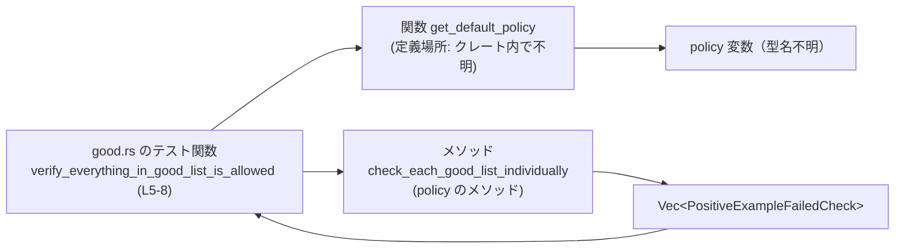
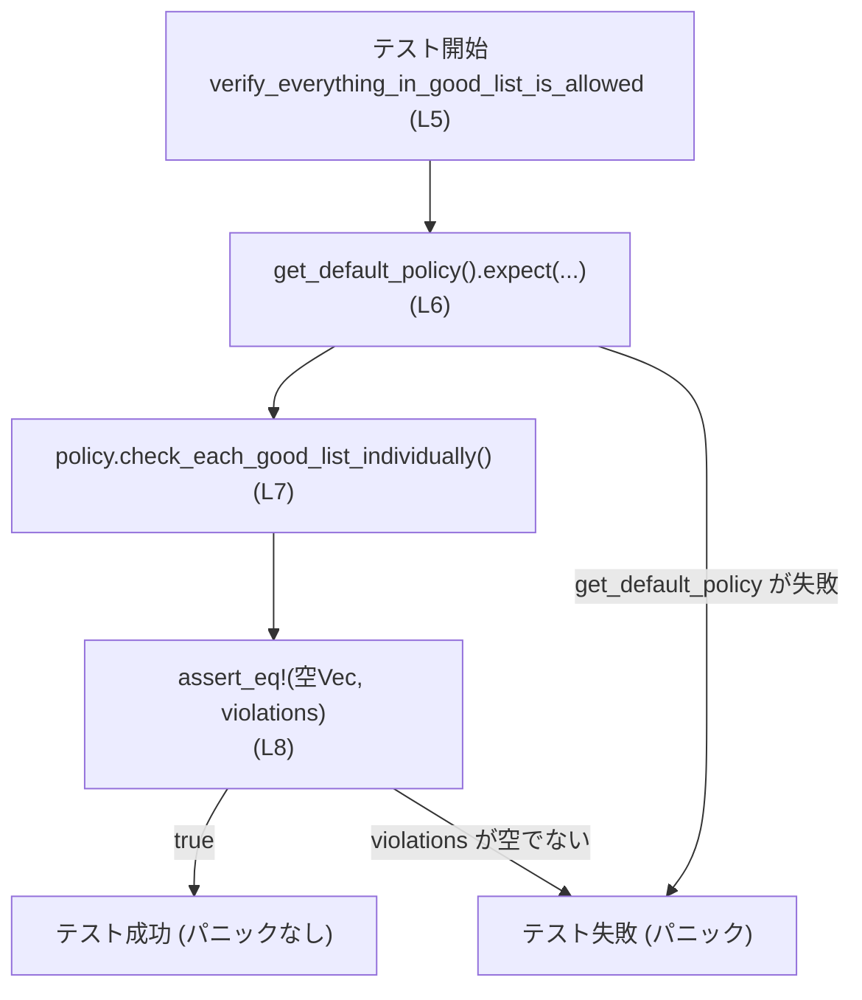
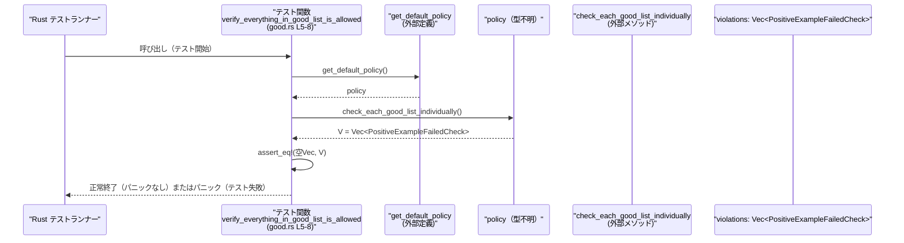

# execpolicy-legacy/tests/suite/good.rs コード解説

## 0. ざっくり一言

このファイルは、`codex_execpolicy_legacy` クレートの **デフォルトポリシー** に対して、「good リスト」に属するすべての要素が許可されており、`PositiveExampleFailedCheck` が一つも発生しないことを検証する単一のテストを提供しています（`execpolicy-legacy/tests/suite/good.rs:L4-8`）。

---

## 1. このモジュールの役割

### 1.1 概要

- このモジュールは、`codex_execpolicy_legacy` クレートが提供するデフォルトの実行ポリシーが期待通りであるかを検証するための **テスト** を提供します。
- 具体的には、`get_default_policy` で取得したポリシーに対して `check_each_good_list_individually` を実行し、その結果として得られる `Vec<PositiveExampleFailedCheck>` が **空であること** をアサートします（`execpolicy-legacy/tests/suite/good.rs:L5-8`）。

### 1.2 アーキテクチャ内での位置づけ

このファイルはテストディレクトリ `tests/suite` にあり、ライブラリクレート `codex_execpolicy_legacy` に依存して、その挙動を検証する「外側のテスト」です。

依存関係の概略は次の通りです。



- `good.rs` は `codex_execpolicy_legacy` クレートの公開 API である `get_default_policy` と型 `PositiveExampleFailedCheck` を利用します（`execpolicy-legacy/tests/suite/good.rs:L1-2`）。
- `policy` 変数の型はこのファイルからは分かりませんが、その値に対して `check_each_good_list_individually()` メソッドを呼び出し、`Vec<PositiveExampleFailedCheck>` を受け取っています（`execpolicy-legacy/tests/suite/good.rs:L6-7`）。

### 1.3 設計上のポイント

- **テストとしての最小構成**  
  - 単一のテスト関数 `verify_everything_in_good_list_is_allowed` のみを定義しています（`execpolicy-legacy/tests/suite/good.rs:L4-8`）。
- **パニック駆動の失敗判定**  
  - デフォルトポリシーの取得に失敗した場合は `expect` によって即座にパニック（＝テスト失敗）します（`execpolicy-legacy/tests/suite/good.rs:L6`）。
  - ポリシーチェックの結果に違反が一つでもあると `assert_eq!` によりテストが失敗します（`execpolicy-legacy/tests/suite/good.rs:L8`）。
- **状態管理**  
  - このファイル自体はグローバルな状態を持たず、ローカル変数 `policy` および `violations` のみを扱います（`execpolicy-legacy/tests/suite/good.rs:L6-7`）。
- **安全性・並行性**  
  - `unsafe` ブロックやスレッド／非同期処理は一切使用していません。このファイルのコードはすべて安全な Rust の範囲です（`execpolicy-legacy/tests/suite/good.rs:L1-8`）。

---

## 2. 主要な機能一覧

このモジュールで提供される機能は、テスト関数 1 つに集約されています。

- `verify_everything_in_good_list_is_allowed`: デフォルトポリシーに対して `check_each_good_list_individually` を実行し、`PositiveExampleFailedCheck` の違反が一つも無いことを検証するテスト（`execpolicy-legacy/tests/suite/good.rs:L4-8`）。

### コンポーネントインベントリー（関数・型）

このチャンクに現れる関数／型の一覧です。

| 名前 | 種別 | 定義 or 利用 | 行 | 説明 |
|------|------|--------------|----|------|
| `verify_everything_in_good_list_is_allowed` | 関数（テスト） | 定義 | `good.rs:L5-8` | デフォルトポリシーが good リストに対して違反を出さないことを検証するテスト |
| `PositiveExampleFailedCheck` | 型（外部） | 利用 | `good.rs:L1,8` | ベクタの要素型として使用。型名から用途は推測できますが、定義はこのチャンクには現れません |
| `get_default_policy` | 関数（外部） | 利用 | `good.rs:L2,6` | デフォルトポリシーを返す関数。戻り値の正確な型は不明ですが `expect` メソッドを持つ型です |
| `check_each_good_list_individually` | メソッド（外部） | 利用 | `good.rs:L7` | `policy` に対して呼び出され、`Vec<PositiveExampleFailedCheck>` を返すメソッド |
| `Vec::<PositiveExampleFailedCheck>::new` | 関数（標準ライブラリ） | 利用 | `good.rs:L8` | 空の `Vec<PositiveExampleFailedCheck>` を生成します |
| `#[test]` | 属性マクロ（標準ライブラリ） | 利用 | `good.rs:L4` | 関数をテストとして登録する属性 |

---

## 3. 公開 API と詳細解説

このファイル自身はライブラリの公開 API を定義していませんが、テストのエントリポイントとして重要な関数を説明します。

### 3.1 型一覧（構造体・列挙体など）

このファイルで **出現する** 主な型（定義は外部を含む）の一覧です。

| 名前 | 種別 | 役割 / 用途 | 定義有無 | 根拠 |
|------|------|-------------|----------|------|
| `PositiveExampleFailedCheck` | （外部の）型 | `Vec<PositiveExampleFailedCheck>` の要素型として利用されます。型名からは「ポジティブ例のチェック失敗」を表すと読めますが、意味やフィールドはこのチャンクからは分かりません。 | このファイル内には定義なし | `good.rs:L1,8` |
| `Vec<PositiveExampleFailedCheck>` | 標準ライブラリのベクタ型 | `check_each_good_list_individually` の戻り値および期待値として使用され、違反情報のリストとして扱われます。 | 定義は標準ライブラリ | `good.rs:L7-8` |

> 注: `policy` 変数の具体的な型名はコード上に現れないため、このチャンクからは不明です（`good.rs:L6`）。

### 3.2 関数詳細（重要関数）

#### `verify_everything_in_good_list_is_allowed()`

**概要**

- `codex_execpolicy_legacy::get_default_policy` でデフォルトポリシーを取得し、そのポリシーに対して `check_each_good_list_individually` を実行します。
- その結果として得られる `Vec<PositiveExampleFailedCheck>` が空ベクタと等しいことを `assert_eq!` で検証します（`execpolicy-legacy/tests/suite/good.rs:L5-8`）。
- Rust のテストランナーから自動的に呼び出されるユニットテスト関数です（`#[test]` 属性、`execpolicy-legacy/tests/suite/good.rs:L4`）。

**引数**

この関数は引数を取りません。

| 引数名 | 型 | 説明 |
|--------|----|------|
| なし | - | この関数はテストであり、テストランナーから直接呼び出されるため、引数はありません。 |

**戻り値**

- 戻り値の型は `()`（ユニット型）です。これは `fn name() { ... }` というシグニチャから分かります（`execpolicy-legacy/tests/suite/good.rs:L5`）。
- テストの成否は戻り値ではなく、関数内部で発生するパニック（`expect` や `assert_eq!`）により判定されます。

**内部処理の流れ（アルゴリズム）**

内部処理は非常にシンプルで、次の 3 ステップで構成されます。

1. **デフォルトポリシーの取得**  
   - `get_default_policy()` を呼び出し、返ってきた値に対して `expect("failed to load default policy")` を呼びます（`good.rs:L6`）。
   - ここで `get_default_policy()` の戻り値型は `expect` メソッドを持つ型（例えば `Option` や `Result`）であることが分かりますが、具体的な型はこのチャンクには現れません。
   - `expect` が成功すると、`policy` 変数にデフォルトポリシーの値が格納されます。

2. **good リストのチェック実行**  
   - `policy` に対して `check_each_good_list_individually()` メソッドを呼び出します（`good.rs:L7`）。
   - 戻り値は `violations` という変数に束縛され、型は `Vec<PositiveExampleFailedCheck>` に推論されます（`good.rs:L7-8`）。

3. **違反がないことの検証**  
   - `assert_eq!(Vec::<PositiveExampleFailedCheck>::new(), violations);` により、`violations` が空の `Vec<PositiveExampleFailedCheck>` と等しいことを検証します（`good.rs:L8`）。
   - 等しくない場合は `assert_eq!` マクロがパニックを起こし、このテストは失敗します。

この流れを簡易なフローチャートとして示すと次のようになります。



**Examples（使用例）**

この関数自体が唯一の使用例ですが、コメント付きで再掲すると以下のようになります。

```rust
use codex_execpolicy_legacy::PositiveExampleFailedCheck; // 違反情報を表す型（定義はクレート側）
use codex_execpolicy_legacy::get_default_policy;          // デフォルトポリシーを取得する関数

#[test]                                                   // テスト関数として登録
fn verify_everything_in_good_list_is_allowed() {          // 戻り値は暗黙に ()
    // デフォルトポリシーを取得する。失敗した場合はパニック（テスト失敗）。
    let policy = get_default_policy()
        .expect("failed to load default policy");         // good.rs:L6

    // ポリシーに対して good リストのチェックを行い、
    // PositiveExampleFailedCheck の一覧（Vec）を受け取る。
    let violations = policy.check_each_good_list_individually(); // good.rs:L7

    // 期待値: 違反は一つもない（空の Vec）。
    // Vec::<PositiveExampleFailedCheck>::new() は空ベクタを生成する。
    assert_eq!(Vec::<PositiveExampleFailedCheck>::new(), violations); // good.rs:L8
}
```

このコードは `cargo test` を実行した際に Rust のテストランナーから自動的に呼び出されます。

**Errors / Panics**

この関数は戻り値としてエラーを返しませんが、次の条件でパニックを発生させる可能性があります。

1. **デフォルトポリシーの取得失敗**  
   - `get_default_policy().expect("failed to load default policy")` において、`get_default_policy()` の戻り値が「失敗状態」（`None` や `Err(_)` など）だった場合、`expect` はパニックを起こします（`good.rs:L6`）。
   - その結果、このテスト関数は途中で終了し、テストは失敗として扱われます。

2. **違反が存在する場合**  
   - `assert_eq!` による比較で `violations` が空ベクタと等しくない場合、`assert_eq!` はパニックを起こします（`good.rs:L8`）。
   - つまり、`check_each_good_list_individually()` が一つでも `PositiveExampleFailedCheck` を返すと、このテストは失敗します。

**Edge cases（エッジケース）**

- `get_default_policy` の戻り値や `check_each_good_list_individually` の内部でどのような入力・状態が想定されているかは、このファイルからは分かりません。
- したがって、
  - good リストが空の場合に `violations` がどうなるか、
  - 無効な設定などがある場合にどのような `PositiveExampleFailedCheck` が生成されるか、  
  といった細かいエッジケースは、このチャンクには現れません。

**使用上の注意点**

- この関数はユニットテストであり、他のコードから呼び出して再利用する設計にはなっていません（`#[test]` 属性付き、`good.rs:L4-5`）。
- テストの成功条件は **パニックが発生しないこと** に依存しているため、外部環境の変化により `get_default_policy` の挙動が変わると、このテストの結果も変化します。
  - 例えば、`get_default_policy` がファイルや環境変数に依存する実装であった場合、その詳細によってはテストが環境依存になる可能性があります。ただし、そのような実装であるかどうかはこのチャンクからは分かりません。

### 3.3 その他の関数

このファイル内で定義されている関数は `verify_everything_in_good_list_is_allowed` のみです。その他に定義されている補助関数やラッパー関数はありません（`execpolicy-legacy/tests/suite/good.rs:L1-8`）。

---

## 4. データフロー

このセクションでは、テスト関数の内部でどのようにデータが流れているかを示します。

### 4.1 代表的なシナリオ：テスト実行時のフロー

このファイルにおける唯一のシナリオは、「テストランナーが `verify_everything_in_good_list_is_allowed` を実行し、違反がないことを確認する」というものです。



要点:

- デフォルトポリシー（`policy`）がどのように構築されるか、`check_each_good_list_individually` が good リストをどのように評価するかは、このファイルからは分かりません。
- このテストの観点では、「`get_default_policy` が成功し」「`check_each_good_list_individually` の結果 Vec が空であるか」を検証しているだけです。

---

## 5. 使い方（How to Use）

### 5.1 基本的な使用方法

このファイルは通常の Rust プロジェクトのテストとして利用されます。

1. プロジェクトルートで次を実行します。

   ```bash
   cargo test verify_everything_in_good_list_is_allowed
   ```

   - これにより、`#[test]` が付与された `verify_everything_in_good_list_is_allowed` 関数のみが実行されます（`good.rs:L4-5`）。

2. テストが成功する条件:
   - `get_default_policy()` が失敗せずに `policy` を返すこと（`good.rs:L6`）。
   - `policy.check_each_good_list_individually()` が返す `Vec<PositiveExampleFailedCheck>` が空であること（`good.rs:L7-8`）。

3. いずれかの条件を満たさない場合、パニックが発生し、このテストは失敗します。

### 5.2 よくある使用パターン

このテストの構造は「**違反のリストが空であることを検証する**」という一般的なパターンになっています。似た検証を行う場合、次のような形に整理できます。

```rust
// (1) チェック対象のコンテキストや設定を取得する
let context = get_context().expect("failed to load context");

// (2) チェックを実行し、違反のリストを得る
let violations = context.run_checks();

// (3) 違反が一つもないことを検証する
assert_eq!(Vec::<Violation>::new(), violations);
```

`good.rs` の場合、`get_context` が `get_default_policy` に、`run_checks` が `check_each_good_list_individually` に対応しています（`good.rs:L6-8`）。

### 5.3 よくある間違い

このファイル自体から具体的な誤用例は読み取れませんが、同種のテストを書く際に起こりがちな点を挙げます（一般論としての注意点です）。

- `assert_eq!(violations, Vec::<...>::new())` のように **引数の順序** を逆にすると、テスト失敗時のメッセージの表示順が変わります。`good.rs` では「期待値（空ベクタ）」を先に書いています（`good.rs:L8`）。
- `Vec::new()` の型注釈（`::<PositiveExampleFailedCheck>`）を書かないと、型推論が行えずコンパイルエラーになる場合があります。`good.rs` では明示的に型を指定しています（`good.rs:L8`）。

### 5.4 使用上の注意点（まとめ）

- このファイルは **テスト専用** であり、ライブラリコードから直接使うことはありません。
- テスト結果は `codex_execpolicy_legacy` クレートの実装に強く依存します。特に:
  - `get_default_policy` の実装が変わると、このテストの前提も変わります。
  - `check_each_good_list_individually` が返す `Vec<PositiveExampleFailedCheck>` の仕様が変わった場合も、テストの意味が変化します。
- 並行性や非同期処理は一切使用していないため、テストはシングルスレッドな文脈でも問題なく動作します（`good.rs:L1-8`）。

---

## 6. 変更の仕方（How to Modify）

### 6.1 新しい機能を追加する場合（テスト追加）

このファイルに「good リスト」以外の検証を追加する場合の一般的な手順です。

1. **新しいテスト関数の追加**
   - 同じファイル内に `#[test]` 属性を持つ新しい関数を追加します。

   ```rust
   #[test]
   fn verify_some_other_property() {
       let policy = get_default_policy().expect("failed to load default policy");
       // ここで policy に対する追加の検証を行う
   }
   ```

   - `get_default_policy` や `PositiveExampleFailedCheck` はすでに `use` されていますので、同じスコープ内で再利用できます（`good.rs:L1-2`）。

2. **既存のチェックロジックの再利用**
   - `policy.check_each_good_list_individually()` と同様に、ポリシーオブジェクトに対する他のメソッドが存在する場合、それらを呼び出して期待する振る舞いを `assert_eq!` や `assert!` で検証できます。
   - ただし、どのようなメソッドが存在するかはこのチャンクからは分からないため、実際にはクレート内の実装を参照する必要があります。

### 6.2 既存の機能を変更する場合（テスト仕様変更）

`verify_everything_in_good_list_is_allowed` の仕様を変更する場合の注意点です。

- **期待値の見直し**
  - 現在は「違反が一つもない」ことを期待していますが（`good.rs:L8`）、もし一部の `PositiveExampleFailedCheck` を許容するような仕様に変える場合、`assert_eq!` の条件をそれに合わせて変更する必要があります。
- **影響範囲の把握**
  - このテストは `get_default_policy` と `check_each_good_list_individually` の組み合わせの挙動を前提にしています（`good.rs:L6-7`）。
  - いずれかの関数やメソッドの契約（前提条件・戻り値の意味）が変わる場合は、このテストの意味合いも変わるため、一緒に見直す必要があります。
- **テスト名の整合性**
  - 関数名 `verify_everything_in_good_list_is_allowed` は「good リストの全要素が許可されること」を示唆しています（`good.rs:L5`）。
  - テスト内容を大きく変更する場合は、関数名も新しい振る舞いを反映する名前に変更した方が、コードの読みやすさが保たれます。

---

## 7. 関連ファイル

このモジュールと密接に関係するのは、`codex_execpolicy_legacy` クレート内の実装部分です。ただし、このチャンクからは具体的なファイルパスは分かりません。

| パス | 役割 / 関係 |
|------|------------|
| `codex_execpolicy_legacy`（クレート全体） | `PositiveExampleFailedCheck` 型および `get_default_policy` 関数、`policy.check_each_good_list_individually` メソッドの実装を提供します（`good.rs:L1-2,6-7`）。具体的なモジュール構成やファイルパスはこのチャンクには現れません。 |
| `execpolicy-legacy/tests/suite/good.rs` | 本ファイル。デフォルトポリシーが good リストに対して違反を一切出さないことを検証するテストを定義します。 |

このファイルだけでは「good リスト」の定義場所や `PositiveExampleFailedCheck` の詳細な構造・意味は分からないため、それらを理解するには `codex_execpolicy_legacy` クレート内のソースコードを参照する必要があります。
