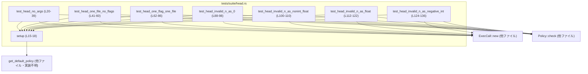
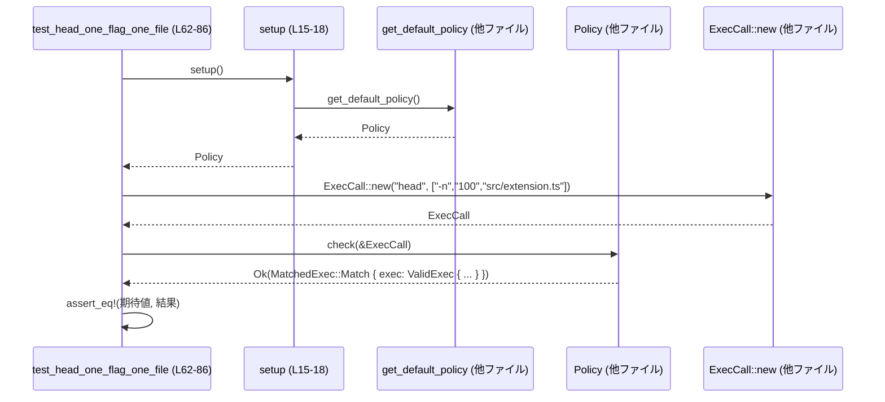

# execpolicy-legacy/tests/suite/head.rs コード解説

## 0. ざっくり一言

`codex_execpolicy_legacy` クレートが `head` コマンドをどのようにポリシーチェックするかを検証するためのテストモジュールです。主に、ファイル引数と `-n` オプション（行数指定）のバリデーション挙動をカバーしています。

---

## 1. このモジュールの役割

### 1.1 概要

- このモジュールは、`head` コマンドに対する **引数・オプションのポリシーチェック** が期待どおりに動いているかを検証します。
- 特に次を確認しています（根拠: `assert_eq!` の期待値定義）。
  - 引数なし `head` が拒否され、特定の `Error` バリアントが返ること (L20-39)。
  - ファイル 1 つのみの `head` 呼び出しが許可され、`ValidExec` としてマッチすること (L41-60)。
  - `-n` の値が正の整数でない場合に各種エラーが返ること (L88-136)。

### 1.2 アーキテクチャ内での位置づけ

このファイルはテストコードであり、`codex_execpolicy_legacy` クレートの公開 API（`Policy`, `ExecCall`, `ValidExec`, `Error` 等）を利用して振る舞いを検証しています。

主な依存関係は次のようになります。



- `get_default_policy`, `ExecCall::new`, `Policy::check` などの実装はこのチャンクには現れず、詳細は不明です。
- テストはそれらを **ブラックボックス** として扱い、戻り値の `Ok(MatchedExec::…)` / `Err(Error::…)` だけを検証しています (L32-38, L45-58, L66-84, L92-97, L104-109, L116-121, L128-135)。

### 1.3 設計上のポイント

- **責務分割**
  - 実際のポリシー判定ロジックはライブラリ側 (`Policy`, `ExecCall` 等) にあり、このファイルはシナリオごとの入力と期待結果の定義に専念しています (L20-38, L41-58, L62-84 など)。
- **状態管理**
  - `setup` 関数で `Policy` を生成し、各テストごとに新しいポリシーインスタンスを取得する構造になっています (L15-18, L22, L43, L64, L90, L102, L114, L126)。
  - グローバルなミュータブル状態は使用していないため、テスト間の状態干渉リスクは低いです。
- **エラーハンドリング方針**
  - ライブラリ固有の `Error` 列挙体を通じてエラーを表現し、テストではその **バリアントとペイロードを厳密に比較** しています (L33-36, L93-95, L105-107, L117-119, L129-133)。
  - `setup` 内では `expect` によりポリシー読み込み失敗時にパニックさせる設計です (L15-18)。
- **並行性**
  - スレッドや `async` は一切使用しておらず、並行性に関わる挙動はこのファイルからは読み取れません。

---

## 2. 主要な機能一覧（コンポーネントインベントリー）

このファイル内で定義される関数（テストを含む）の一覧です。

| 名前 | 種別 | 役割 / シナリオ | 定義位置 |
|------|------|-----------------|----------|
| `setup` | ヘルパー関数 | デフォルトの `Policy` インスタンスを生成する | `execpolicy-legacy/tests/suite/head.rs:L15-L18` |
| `test_head_no_args` | テスト | 引数なしの `head` がエラー（`VarargMatcherDidNotMatchAnything`）になることを確認 | L20-L39 |
| `test_head_one_file_no_flags` | テスト | ファイル 1 つのみの `head` が成功し、`ValidExec::new` で構成された `MatchedExec::Match` が返ることを確認 | L41-L60 |
| `test_head_one_flag_one_file` | テスト | `-n 100` + ファイル 1 つの `head` が成功し、`MatchedOpt` と `MatchedArg` が期待どおりマッチすることを確認 | L62-L86 |
| `test_head_invalid_n_as_0` | テスト | `-n 0` が `Error::InvalidPositiveInteger` になることを確認 | L88-L98 |
| `test_head_invalid_n_as_nonint_float` | テスト | `-n 1.5` が `Error::InvalidPositiveInteger` になることを確認 | L100-L110 |
| `test_head_invalid_n_as_float` | テスト | `-n 1.0` が `Error::InvalidPositiveInteger` になることを確認 | L112-L122 |
| `test_head_invalid_n_as_negative_int` | テスト | `-n -1` が `Error::OptionFollowedByOptionInsteadOfValue` になることを確認 | L124-L136 |

---

## 3. 公開 API と詳細解説

### 3.1 型一覧（このファイルで利用している型）

このモジュール自身は型を定義していませんが、`codex_execpolicy_legacy` の型を多数利用しています。

| 名前 | 種別 | 役割 / 用途（このファイルから読み取れる範囲） | 使用箇所 / 根拠 |
|------|------|---------------------------------------------|----------------|
| `Policy` | 構造体（推定） | コマンドに対するポリシーチェックを行うオブジェクト。`check(&ExecCall)` を呼び出して `Result` を返す | `setup` 戻り値型・`policy.check(&head)` (L16, L22, L43, L64, L90, L102, L115, L127, L37, L57, L83, L96, L108, L120, L134) |
| `ExecCall` | 構造体（推定） | 実行しようとしているコマンド（プログラム名 + 引数列）を表す | `ExecCall::new("head", …)` (L23, L44, L65, L91, L103, L115, L127) |
| `Error` | 列挙体（推定） | ポリシーチェックに失敗した際のエラー内容を表す。複数のバリアントを持つ | `Error::VarargMatcherDidNotMatchAnything`, `Error::InvalidPositiveInteger`, `Error::OptionFollowedByOptionInsteadOfValue` (L33-36, L93-95, L105-107, L117-119, L129-133) |
| `ArgMatcher` | 列挙体（推定） | 可変長引数に対するマッチャー種別。ここでは `ReadableFiles` を使用 | `ArgMatcher::ReadableFiles` (L35) |
| `ArgType` | 列挙体（推定） | 引数・オプション値の型種別。ここでは `ReadableFile`, `PositiveInteger` を使用 | (L51, L72, L77) |
| `MatchedArg` | 構造体（推定） | 成功時にマッチした位置付きの引数を表す | `MatchedArg::new(/*index*/ 0, ArgType::ReadableFile, "src/extension.ts")` など (L49-53, L75-79) |
| `MatchedOpt` | 構造体（推定） | 成功時にマッチしたオプションを表す | `MatchedOpt::new("-n", "100", ArgType::PositiveInteger)` (L72-73) |
| `MatchedExec` | 列挙体（推定） | ポリシーチェック結果のうち「マッチした実行」を表す型。少なくとも `Match { exec: ValidExec }` バリアントを持つ | `MatchedExec::Match { exec: … }` (L46-56, L67-81) |
| `ValidExec` | 構造体（推定） | 許可された実行コマンドの詳細（プログラム名、引数、システムパスなど）を表す | `ValidExec::new(...)` およびリテラル `ValidExec { ... }` (L47-55, L68-81) |
| `Result` | 型エイリアス（推定） | テスト関数の戻り値として使用。エラー型はこのクレートの `Error` であると考えられるが、このチャンクには定義が現れません | 関数シグネチャ `-> Result<()>` (L42, L63) |
| `get_default_policy` | 関数 | デフォルト設定の `Policy` を返す。失敗すると `Error` を返すと推定される | `setup` 内で呼び出され `expect` でラップ (L16-17) |

> `Policy`, `ExecCall` などの具体的なフィールドや実装はこのチャンクには現れず、詳細は不明です。

### 3.2 関数詳細（抜粋・7件）

#### `fn setup() -> Policy`

**概要**

- デフォルトのポリシー (`Policy`) を読み込み、テストで使うために返します (L15-18)。

**引数**

- なし。

**戻り値**

- `Policy`: `codex_execpolicy_legacy` クレートが提供するポリシーオブジェクト (L16)。

**内部処理の流れ**

1. `get_default_policy()` を呼び出す (L17)。
2. その戻り値で `expect("failed to load default policy")` を呼び出し、`Result` が `Err` ならパニック、`Ok(policy)` なら `policy` を返します (L17)。

**Rust の安全性・エラー**

- `expect` を使うことで、**ポリシー読み込み失敗をコンパイル時ではなくランタイムのパニックで扱う**設計になっています。
- `#[expect(clippy::expect_used)]` により、`expect` 使用に関する clippy 警告を抑制しています (L15)。

**Edge cases**

- デフォルトポリシーが読み込めない場合（例: 設定ファイル欠如などの理由）は、テストプロセス全体がパニックで終了します (L17)。
- 成功時の通常パスについては、この関数は副作用を持たず `Policy` を返すだけです。

**使用上の注意点**

- ライブラリ利用コードに転用する場合、`expect` の代わりに呼び出し元へ `Result` を返した方がエラー制御しやすい点に注意が必要です。
- テストでは「ポリシーが読めること」を前提条件とし、失敗を即座に検出する意図で `expect` を使用していると解釈できます。

---

#### `fn test_head_no_args()`

**概要**

- 引数なしの `head` コマンドが拒否され、`Error::VarargMatcherDidNotMatchAnything` が返ることを検証します (L20-39)。

**引数**

- なし（テスト関数なので引数は取りません）。

**戻り値**

- なし（失敗時には `assert_eq!` マクロがパニックします）。

**内部処理の流れ**

1. `setup()` で `Policy` インスタンスを取得 (L22)。
2. `ExecCall::new("head", &[])` で、引数なしの `head` 呼び出しを表す `ExecCall` を生成 (L23)。
3. コメントで、シェル的には `head` 単体呼び出しが標準入力から読む「合法な」呼び出しであるが、このライブラリがそれを安全とみなせるかは別問題である旨を説明 (L24-31)。
4. `policy.check(&head)` の結果が `Err(Error::VarargMatcherDidNotMatchAnything { program: "head".to_string(), matcher: ArgMatcher::ReadableFiles })` と等しいことを `assert_eq!` で検証 (L32-38)。

**Errors / Panics**

- `policy.check(&head)` は `Result` を返し、その `Err` バリアントを確認しています (L32-38)。
- 期待したエラーでない場合、`assert_eq!` がパニックします。
- `setup` が内部で `expect` を使うため、ポリシー読み込み失敗でもパニックします (L22, L17)。

**Edge cases / 契約**

- このテストによって、**「`head` の可変長ファイル引数を 1 つも与えない場合、`ArgMatcher::ReadableFiles` が何もマッチせず、対応するエラーが返る」**という契約が固定されます (L33-36)。
- コメントでは、「将来的にコマンドパイプラインの一部として `head` を検証したい場合には、引数なしを許可したくなるかもしれない」と示唆していますが、現状の仕様としては拒否する挙動がテストで固定されています (L24-31)。

**使用上の注意点**

- ポリシー API を利用する側は、「シェル的に合法でもポリシー上拒否される」ケースがあること（ここでは `head` の引数なし）がある点を前提条件として扱う必要があります。

---

#### `fn test_head_one_file_no_flags() -> Result<()>`

**概要**

- `head` にファイル 1 つだけを渡した場合に、ポリシーチェックが成功し、期待どおりの `MatchedExec::Match` が返ることを確認します (L41-60)。

**引数**

- なし。

**戻り値**

- `Result<()>`: テスト内では常に `Ok(())` を返しており、エラーは発生しない前提になっています (L59-60)。

**内部処理の流れ**

1. `setup()` で `Policy` を取得 (L43)。
2. `ExecCall::new("head", &["src/extension.ts"])` で、単一ファイル引数付きの `head` 呼び出しを表す `ExecCall` を生成 (L44)。
3. `policy.check(&head)` の結果が、以下の値と等しいことを `assert_eq!` で検証 (L45-58)。
   - `Ok(MatchedExec::Match { exec: ValidExec::new("head", vec![MatchedArg::new(0, ArgType::ReadableFile, "src/extension.ts")?], &["/bin/head", "/usr/bin/head"]) })` (L46-55)。
4. テスト関数として `Ok(())` を返す (L59-60)。

**Errors / Panics**

- `MatchedArg::new(...)` が `?` によって伝播可能なエラーを返し得ますが、このテストでは「成功するはず」という前提で `?` を使用しています (L49-53)。
- `ValidExec::new` も `Result` を返す可能性がありますが、`?` が使われていない点から、このシグネチャはこのチャンクからは読み取れません。ここでは単に `ValidExec::new(...)` の戻り値を使用しています (L47-55)。
- `assert_eq!` の比較が失敗した場合はパニックします (L45-58)。

**Edge cases / 契約**

- 少なくとも 1 つの `ReadableFile` としてマッチする引数が存在すれば、`MatchedExec::Match` が返るという契約がこのテストで固定されています (L49-53)。
- `system_path` として `"/bin/head"` および `"/usr/bin/head"` の 2 つが候補として含まれることも契約の一部になっています (L54)。

**使用上の注意点**

- 呼び出し側が `MatchedExec::Match` の中身を検査する場合、`MatchedArg` の `index` と `ArgType` を意識する必要があります (ここでは index 0 が `ReadableFile`) (L49-53)。
- このテストはファイルパス `"src/extension.ts"` の実在性までは確認しておらず、**文字列レベルでのマッチ** のみを検証している点に注意が必要です。

---

#### `fn test_head_one_flag_one_file() -> Result<()>`

**概要**

- `head -n 100 src/extension.ts` の形で `-n` オプションとファイル 1 つを渡した場合の成功パスを検証します (L62-86)。

**内部処理の流れ**

1. `setup()` で `Policy` を取得 (L64)。
2. `ExecCall::new("head", &["-n", "100", "src/extension.ts"])` を作成 (L65)。
3. `policy.check(&head)` の結果が、以下の `Ok(MatchedExec::Match { ... })` と一致することを `assert_eq!` で検証 (L66-84)。
   - `ValidExec { program: "head".to_string(), flags: vec![], opts: vec![MatchedOpt::new("-n", "100", ArgType::PositiveInteger).expect("should validate")], args: vec![MatchedArg::new(2, ArgType::ReadableFile, "src/extension.ts")?], system_path: vec!["/bin/head".to_string(), "/usr/bin/head".to_string()], }` (L68-81)。

**Errors / Panics**

- `MatchedOpt::new(...).expect("should validate")` により、`-n 100` が有効な `PositiveInteger` であることを前提とし、検証失敗時にはパニックする設計です (L72-73)。
- `MatchedArg::new(...)` は `?` を通じてエラーを返す可能性がありますが、このテストでは成功前提です (L75-79)。
- `assert_eq!` の比較失敗や `setup` の `expect` もパニック要因となります。

**Edge cases / 契約**

- `-n` の値が `"100"` のような正の整数文字列である場合に `ArgType::PositiveInteger` として正しく検証される必要があること (L72-73)。
- `"-n"` 自体は `flags` ではなく `opts` の一部（オプション + 値）として扱われる契約が前提となっています（`flags: vec![]`, `opts: vec![MatchedOpt::new("-n", "100", ...)]`）(L70-72)。

**使用上の注意点**

- `MatchedOpt::new(...).expect("should validate")` のように、**テストでは意図的に「失敗しないはず」のパスに `expect` を使う**ことで、意図しない挙動をすぐに検出できるようにしています。
- 実運用コードで同様の API を使う場合は、`expect` ではなく `Result` を呼び出し元に返して処理する方が安全です。

---

#### `fn test_head_invalid_n_as_0()`

**概要**

- `head -n 0 src/extension.ts` の `-n` 値として `0` を指定した場合、`Error::InvalidPositiveInteger { value: "0".to_string() }` が返ることを確認します (L88-98)。

**内部処理の流れ**

1. `setup()` で `Policy` を取得 (L90)。
2. `ExecCall::new("head", &["-n", "0", "src/extension.ts"])` を生成 (L91)。
3. `policy.check(&head)` の結果と `Err(Error::InvalidPositiveInteger { value: "0".to_string() })` を比較 (L92-97)。

**Errors / Panics**

- `policy.check(&head)` は `Err(Error::InvalidPositiveInteger { .. })` を返すことが期待されます (L93-95)。
- そうでない場合、`assert_eq!` がパニックします。

**Edge cases / 契約**

- このテストにより、「**0 は正の整数として扱われない**」という契約が明確化されています。
  - `ArgType::PositiveInteger` は 1 以上の整数を指すと解釈できますが、これは型名からの推測であり、テストから読み取れる事実は「0 が `InvalidPositiveInteger` になる」という点だけです (L93-95)。

---

#### `fn test_head_invalid_n_as_nonint_float()`

**概要**

- `head -n 1.5 src/extension.ts` の `-n` 値として `1.5` を指定した場合も `InvalidPositiveInteger` エラーになることを確認します (L100-110)。

**内部処理の流れ**

1. `setup()` で `Policy` を取得 (L102)。
2. `ExecCall::new("head", &["-n", "1.5", "src/extension.ts"])` を生成 (L103)。
3. `policy.check(&head)` の結果と `Err(Error::InvalidPositiveInteger { value: "1.5".to_string() })` を比較 (L104-109)。

**Edge cases / 契約**

- 小数（ここでは `1.5`）は整数として解釈されず、`InvalidPositiveInteger` になるという契約が固定されています (L105-107)。

---

#### `fn test_head_invalid_n_as_negative_int()`

**概要**

- `head -n -1 src/extension.ts` の `-n` 値として `-1` を指定した場合、`Error::OptionFollowedByOptionInsteadOfValue` が返ることを確認します (L124-136)。

**内部処理の流れ**

1. `setup()` で `Policy` を取得 (L126)。
2. `ExecCall::new("head", &["-n", "-1", "src/extension.ts"])` を生成 (L127)。
3. `policy.check(&head)` の結果と、以下の `Err` を比較 (L128-135)。
   - `Error::OptionFollowedByOptionInsteadOfValue { program: "head".to_string(), option: "-n".to_string(), value: "-1".to_string() }` (L129-133)。

**Edge cases / 契約**

- `"-1"` のような負の数はオプションの値ではなく **新たなオプションとして解釈される** 振る舞いになっていることが、このテストから読み取れます (L129-133)。
- 結果として、「`-n` の値として負の整数を渡すと、構文上の誤りとして扱われる」という契約が固定されます。

**使用上の注意点**

- コマンドライン解析を利用するコードでは、「値が負の数の場合、オプションと誤解される可能性がある」という一般的な CLI パーサの性質がここでも現れていると考えられます。

---

### 3.3 その他の関数

より詳細な説明を省略した補助的テスト関数です。

| 関数名 | 役割（1 行） | 定義位置 |
|--------|--------------|----------|
| `test_head_invalid_n_as_float` | `head -n 1.0 src/extension.ts` が `Error::InvalidPositiveInteger { value: "1.0" }` になることを確認するテストです (小数だが整数値に見えるケース) | `execpolicy-legacy/tests/suite/head.rs:L112-L122` |

---

## 4. データフロー

ここでは、代表的なシナリオとして `test_head_one_flag_one_file` の処理の流れを図示します。

### シナリオ概要

- 入力: `"head"` プログラム、引数 `["-n", "100", "src/extension.ts"]` (L65)。
- 処理:
  1. デフォルトポリシーの取得 (`setup` → `get_default_policy`) (L64, L16-17)。
  2. `ExecCall` の構築 (L65)。
  3. `Policy::check` によるポリシー検査 (L83)。
  4. 成功時の結果 `MatchedExec::Match { exec: ValidExec { … } }` の比較 (L66-82)。



- `Policy` や `ExecCall` 内部でどのような解析が行われるかは、このチャンクには現れません。

---

## 5. 使い方（How to Use）

### 5.1 基本的な使用方法

このテストファイルから読み取れる、`codex_execpolicy_legacy` クレートの基本的な使い方は次のとおりです。

```rust
use codex_execpolicy_legacy::{ExecCall, Policy, get_default_policy, Result};

// デフォルトポリシーを取得する（テストでは expect でラップしている）
fn setup_policy() -> Policy {
    get_default_policy().expect("failed to load default policy")
}

fn check_head_example() -> Result<()> {
    let policy = setup_policy();                           // Policy を取得
    let call = ExecCall::new("head", &["-n", "100", "src/extension.ts"]); // コマンド呼び出しを表現

    // ポリシーチェックを行う
    let result = policy.check(&call);                      // Result<MatchedExec, Error>（推定）

    // 結果に応じて処理する（ここでは単純に返すだけ）
    println!("{:?}", result);                              // Debug 出力（Error/MatchedExec）

    Ok(())
}
```

- 実際のテストでは `println!` ではなく `assert_eq!` による厳密な比較を行っています (L32-38, L45-58, L66-84, L92-97 など)。

### 5.2 よくある使用パターン（テストから読み取れるパターン）

1. **単純なファイル引数の検証**

   ```rust
   let head = ExecCall::new("head", &["src/extension.ts"]);  // L44
   let result = policy.check(&head);                         // L57 付近

   match result {
       Ok(matched) => {
           // MatchedExec を検査して許可されたコマンドとして扱う
       }
       Err(err) => {
           // Error に応じて拒否する
       }
   }
   ```

2. **オプション付き引数列の検証**

   ```rust
   let head = ExecCall::new("head", &["-n", "100", "src/extension.ts"]); // L65
   let result = policy.check(&head);

   // テストでは Ok(MatchedExec::Match { ... }) と比較 (L66-82)
   ```

3. **エラーケースの扱い（数値引数のバリデーション）**

   ```rust
   let head = ExecCall::new("head", &["-n", "0", "src/extension.ts"]); // L91
   let result = policy.check(&head);

   assert!(matches!(result,
       Err(Error::InvalidPositiveInteger { value })
       if value == "0"
   ));
   ```

### 5.3 よくある間違い（テストから見える誤用例）

テストが明示的にカバーしている「誤った使い方」を逆に見ると、以下のような誤用が抽出できます。

```rust
// 誤用例 1: head を引数なしで呼ぶ（このポリシーでは拒否）
let head = ExecCall::new("head", &[]);                      // L23
let result = policy.check(&head);
// -> Err(Error::VarargMatcherDidNotMatchAnything { ... }) が返る契約 (L33-37)

// 誤用例 2: -n の値に 0 や小数を渡す
let head_zero  = ExecCall::new("head", &["-n", "0",   "src/extension.ts"]); // L91
let head_float = ExecCall::new("head", &["-n", "1.5", "src/extension.ts"]); // L103

// どちらも InvalidPositiveInteger になる契約 (L93-95, L105-107)
```

### 5.4 使用上の注意点（まとめ）

- `Error` バリアント単位で挙動がテストで固定されているため、**Error の設計やメッセージを変えるとテストが壊れる**点に注意が必要です。
- `head` の引数なし呼び出しなど、シェルとしては合法な呼び出しがポリシー上は拒否されるケースがあることを前提とする必要があります (L24-31, L33-36)。
- 数値引数 (`-n` の値) については、整数表現・0・小数・負数それぞれに異なる扱いがあるため、CLI レベルでの UX と安全性のバランスを考える際にはこれら契約を意識する必要があります (L88-98, L100-110, L112-122, L124-136)。

---

## 6. 変更の仕方（How to Modify）

### 6.1 新しいテストシナリオを追加する場合

このファイルのパターンに従うと、新たな `head` シナリオを追加する手順は次のようになります。

1. **ヘッダ部をそのまま利用**
   - 既存の `use` 群と `setup` 関数をそのまま利用します (L1-18)。

2. **新しい `#[test]` 関数を追加**
   - `#[test]` 属性を付けた関数を定義し、`setup()` で `Policy` を取得 (L20, L22 を参照)。
   - `ExecCall::new("head", &["..."])` で対象とする引数列を定義 (L23, L44, L65 などを参照)。

3. **期待結果を `assert_eq!` または `matches!` で定義**
   - 成功パスなら `Ok(MatchedExec::Match { ... })` を構築して比較 (L45-58, L66-84)。
   - 失敗パスなら `Err(Error::...)` を構築して比較 (L32-38, L92-97, L104-109, L116-121, L128-135)。

### 6.2 既存の挙動を変更する場合

- 例: `head` の引数なしを許可するようポリシーを変更したい場合
  - ライブラリ側で `Policy::check` の実装を変更するとともに、`test_head_no_args` の期待値 (`Err(Error::VarargMatcherDidNotMatchAnything { ... })`) を成功パスに合わせて修正する必要があります (L33-36)。
- 数値引数のバリデーション仕様の変更（例: `0` を許容するなど）
  - 対応するテスト（`test_head_invalid_n_as_0`, `test_head_invalid_n_as_nonint_float`, `test_head_invalid_n_as_float`, `test_head_invalid_n_as_negative_int`）の期待値も合わせて修正する必要があります (L88-136)。

このように、**テストが契約の具体的な表現**になっているため、仕様変更時は必ず該当テストを見直すことが重要です。

---

## 7. 関連ファイル

このモジュールと密接に関係するコンポーネントは、インポートされている `codex_execpolicy_legacy` クレート内に存在しますが、このチャンクからはそれぞれのファイルパスまでは分かりません。

| パス / モジュール名 | 役割 / 関係 |
|---------------------|------------|
| `codex_execpolicy_legacy::Policy` | コマンドのポリシーチェックを行う中心的な型。`setup` で生成し、各テストで `check` を呼び出しています (L16, L22, L43, L64, L90, L102, L115, L127)。 |
| `codex_execpolicy_legacy::ExecCall` | 実行コマンド（`"head"` とその引数）を表す型。全テストで入力として使用 (L23, L44, L65, L91, L103, L115, L127)。 |
| `codex_execpolicy_legacy::Error` | ポリシーチェックの失敗理由を表す列挙体。テストでは各バリアントごとに期待値を定義 (L33-36, L93-95, L105-107, L117-119, L129-133)。 |
| `codex_execpolicy_legacy::MatchedExec`, `ValidExec`, `MatchedArg`, `MatchedOpt`, `ArgType`, `ArgMatcher` | 成功時に返されるマッチ結果を構成する型群であり、このファイルでは期待値構築のために使用しています (L45-56, L67-81)。 |
| `codex_execpolicy_legacy::get_default_policy` | デフォルトの `Policy` を提供する関数で、`setup` の内部で使用 (L16-17)。 |

このファイル自体は実行ポリシーのコアロジックを持たず、**仕様を固定する回帰テスト**として機能している、という位置づけになります。
