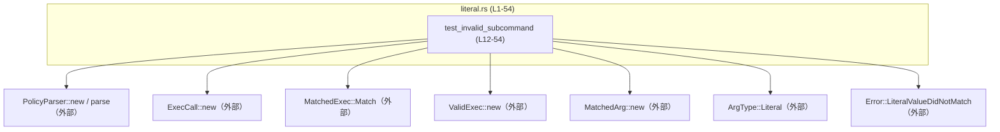
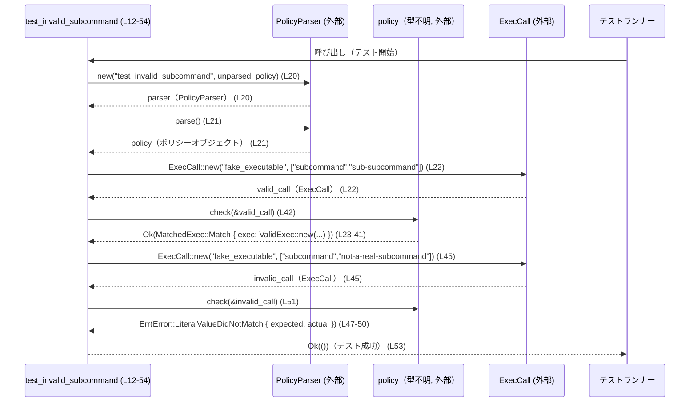

# execpolicy-legacy/tests/suite/literal.rs コード解説

## 0. ざっくり一言

- `codex_execpolicy_legacy` クレートのポリシーエンジンが、**リテラル引数によるサブコマンド指定を正しくマッチさせ、誤ったサブコマンドに対して適切なエラーを返すこと**を検証する単体テストです（`execpolicy-legacy/tests/suite/literal.rs:L12-54`）。

---

## 1. このモジュールの役割

### 1.1 概要

- このファイルは `#[test]` 付きの関数 `test_invalid_subcommand` を 1 つ定義しており、ポリシー定義文字列をパースして得たポリシーに対し、  
  - 正しいサブコマンド列が **成功（`Ok(MatchedExec::Match { ... })`）** すること  
  - 2 番目のサブコマンドが誤っている呼び出しが **特定のエラー（`Error::LiteralValueDidNotMatch`）** になること  
  を確認します（`execpolicy-legacy/tests/suite/literal.rs:L12-54`）。

### 1.2 アーキテクチャ内での位置づけ

このテストは外部クレート `codex_execpolicy_legacy` の複数の型と関数を利用しており、それらの振る舞いを統合的に検証する位置づけです。

依存関係を簡易図にすると次のようになります。



- すべての外部コンポーネントは `use codex_execpolicy_legacy::...;` でインポートされており、このファイル内には定義が現れません（`execpolicy-legacy/tests/suite/literal.rs:L1-8`）。

### 1.3 設計上のポイント

コードから読み取れる設計上の特徴は次のとおりです。

- **DSL 文字列からのポリシー生成**  
  生のポリシー文字列（`unparsed_policy`）を `PolicyParser::new` に渡してパースする構造になっています（`execpolicy-legacy/tests/suite/literal.rs:L14-21`）。
- **強い型付けによる検証**  
  実行呼び出しは `ExecCall` 型、マッチ結果は `MatchedExec`／`ValidExec`／`MatchedArg`、エラーは `Error` 型で表現されており、`assert_eq!` で期待値と実際の戻り値を直接比較するスタイルになっています（`execpolicy-legacy/tests/suite/literal.rs:L22-43,L45-52`）。
- **Result によるエラー伝播とテストの失敗**  
  テスト関数自体が `Result<()>` を返しており（`execpolicy-legacy/tests/suite/literal.rs:L13`）、`MatchedArg::new(...)?` のように `?` 演算子を使うことで、内部エラーがあればテストを失敗として扱う設計です（`execpolicy-legacy/tests/suite/literal.rs:L28-37`）。
- **明示的なパニックポイント**  
  ポリシーのパース失敗は `expect("failed to parse policy")` により即座にパニック扱い（= テスト失敗）になります（`execpolicy-legacy/tests/suite/literal.rs:L21`）。

---

## 2. 主要な機能一覧

このファイルが提供する主要な機能は 1 つです。

- `test_invalid_subcommand`: リテラルサブコマンドを含むポリシーに対し、  
  - 正常なサブコマンド列が `MatchedExec::Match` を返すこと  
  - 2 番目のサブコマンドが異なる場合に `Error::LiteralValueDidNotMatch` が返ること  
  を検証する単体テスト（`execpolicy-legacy/tests/suite/literal.rs:L12-54`）。

---

## 3. 公開 API と詳細解説

### 3.1 型・関数の一覧（コンポーネント・インベントリー）

このチャンクに「定義」が現れるのはテスト関数のみで、他はすべて外部クレートからの利用です。

#### このファイル内で定義されているもの

| 名前 | 種別 | 定義位置 | 役割 / 用途 |
|------|------|----------|-------------|
| `test_invalid_subcommand` | 関数（テスト） | `execpolicy-legacy/tests/suite/literal.rs:L12-54` | ポリシーのサブコマンドリテラルマッチの成功・失敗パターンを検証する単体テスト |

#### 外部クレートから利用しているもの

| 名前 | 種別（コードから分かる範囲） | 定義場所（推測不可） | 使用位置（このファイル） | 役割 / 用途（コードからの解釈） |
|------|---------------------------|----------------------|--------------------------|----------------------------------|
| `ArgType` | 型（`Literal` という関連コンストラクタ／関連項目を持つ） | `codex_execpolicy_legacy` クレート内（このチャンクには現れない） | `L30-31, L35-36` | 引数の種別を表現する型。ここでは `"subcommand"` や `"sub-subcommand"` をリテラルとして表すために `ArgType::Literal(...)` が使われています。 |
| `Error` | 構造体または列挙体（`LiteralValueDidNotMatch { ... }` というフィールド付きコンストラクタを持つ） | 同上 | `L47-50` | チェック処理のエラーを表す型。ここでは「期待したリテラル値と実際の値が異なる」ことを表す `LiteralValueDidNotMatch` が使われています。 |
| `ExecCall` | 型（`ExecCall::new` 関連関数を持つ） | 同上 | `L22, L45` | 実行しようとしているコマンドとその引数を表現する呼び出しオブジェクトと解釈できます。 |
| `MatchedArg` | 型（`MatchedArg::new` 関連関数を持つ） | 同上 | `L28-37` | マッチに成功した 1 つの引数を表す型。`new(index, ArgType::Literal(...), "実際の引数")?` の形で構築されます。 |
| `MatchedExec` | 構造体または列挙体（`Match { exec: ... }` というフィールドを持つコンストラクタ） | 同上 | `L24-41` | ポリシーとのマッチ結果を表す型。ここでは `MatchedExec::Match { exec: ValidExec::new(...) }` という形で「マッチした実行」を表現しています。 |
| `PolicyParser` | 型（`new`・`parse` メソッドを持つ） | 同上 | `L20-21` | ポリシー定義文字列を解析し、内部表現のポリシーオブジェクト（ここでは `policy`）を生成するパーサです。 |
| `Result` | 型エイリアスまたは型 | 同上 | `L7, L13, L28-37` | テスト関数の戻り値型として使われています。`MatchedArg::new(...)?` から推測すると、`Error` 型をエラーとする `Result` である可能性がありますが、正確な定義はこのチャンクには現れません。 |
| `ValidExec` | 型（`ValidExec::new` 関連関数を持つ） | 同上 | `L25-40` | ポリシーに照らして「有効」と判断された実行呼び出しを表すオブジェクトと解釈できます。 |

> ※ 型の内部構造（フィールドや完全なメソッド一覧）、およびこれらがどのモジュールファイルに定義されているかは、このチャンクからは分かりません。

### 3.2 関数詳細

このファイルで定義されている重要な関数は `test_invalid_subcommand` の 1 つです。

#### `test_invalid_subcommand() -> Result<()>`

**概要**

- リテラル引数によるサブコマンド指定を含むポリシーを文字列で定義し、それをパースした上で、
  - 正しいサブコマンド列を渡したときに `Ok(MatchedExec::Match { ... })` が返ること
  - 2 番目のサブコマンドを誤った値にしたときに `Err(Error::LiteralValueDidNotMatch { ... })` が返ること  
  を `assert_eq!` で検証するテストです（`execpolicy-legacy/tests/suite/literal.rs:L12-54`）。

**引数**

- 引数はありません（テスト関数であるため）（`execpolicy-legacy/tests/suite/literal.rs:L12-13`）。

**戻り値**

- `Result<()>`  
  - `Ok(())` の場合: テストが正常終了したことを意味します（`execpolicy-legacy/tests/suite/literal.rs:L53`）。
  - `Err(...)` の場合: テストフレームワークから見ると「テスト失敗」として扱われます。ここでは主に `MatchedArg::new(...)?` から伝播するエラーが該当します（`execpolicy-legacy/tests/suite/literal.rs:L28-37`）。

**内部処理の流れ**

行番号を対応させながら処理の流れを分解すると次のようになります。

1. **ポリシー文字列の定義**  
   - `unparsed_policy` という変数に、`define_program` DSL で書かれたポリシー文字列を格納します（`execpolicy-legacy/tests/suite/literal.rs:L14-19`）。
     - `program="fake_executable"`  
     - `args=["subcommand", "sub-subcommand"]`
2. **ポリシーパーサの生成とポリシーのパース**  
   - `PolicyParser::new("test_invalid_subcommand", unparsed_policy)` でパーサを生成します（`execpolicy-legacy/tests/suite/literal.rs:L20`）。
   - `parser.parse().expect("failed to parse policy")` でポリシーをパースし、失敗した場合はメッセージ付きでパニックします（`execpolicy-legacy/tests/suite/literal.rs:L21`）。
3. **「正しい」呼び出しの構築**  
   - `ExecCall::new("fake_executable", &["subcommand", "sub-subcommand"])` で、ポリシーと一致する引数列を持つ呼び出しを構築します（`execpolicy-legacy/tests/suite/literal.rs:L22`）。
4. **正しい呼び出しに対するマッチ結果の検証**  
   - 期待値として `Ok(MatchedExec::Match { exec: ValidExec::new("fake_executable", vec![ ... ], &[]) })` を組み立てます（`execpolicy-legacy/tests/suite/literal.rs:L23-41`）。
     - `MatchedArg::new(0, ArgType::Literal("subcommand".to_string()), "subcommand")?`（`execpolicy-legacy/tests/suite/literal.rs:L28-32`）
     - `MatchedArg::new(1, ArgType::Literal("sub-subcommand".to_string()), "sub-subcommand")?`（`execpolicy-legacy/tests/suite/literal.rs:L33-37`）
   - `policy.check(&valid_call)` の結果がこの期待値と等しいことを `assert_eq!` で確認します（`execpolicy-legacy/tests/suite/literal.rs:L23-43`）。
5. **「誤った」呼び出しの構築**  
   - `ExecCall::new("fake_executable", &["subcommand", "not-a-real-subcommand"])` で、2 番目のサブコマンドだけ異なる呼び出しを構築します（`execpolicy-legacy/tests/suite/literal.rs:L45`）。
6. **誤った呼び出しに対するエラーの検証**  
   - 期待値として `Err(Error::LiteralValueDidNotMatch { expected: "sub-subcommand".to_string(), actual: "not-a-real-subcommand".to_string() })` を組み立てます（`execpolicy-legacy/tests/suite/literal.rs:L46-50`）。
   - `policy.check(&invalid_call)` の結果がこのエラーと等しいことを `assert_eq!` で確認します（`execpolicy-legacy/tests/suite/literal.rs:L46-52`）。
7. **テストの正常終了**  
   - `Ok(())` を返してテストを終了します（`execpolicy-legacy/tests/suite/literal.rs:L53`）。

**Errors / Panics（エラーとパニックの条件）**

- **パース時のパニック**  
  - `parser.parse().expect("failed to parse policy")` は、パースに失敗した場合にパニックします（`execpolicy-legacy/tests/suite/literal.rs:L21`）。  
    テストとしては「ポリシー文字列が有効であること」を前提条件にしていると言えます。
- **`MatchedArg::new` からのエラー伝播**  
  - `MatchedArg::new(...)` の戻り値に対して `?` を使っているため（`execpolicy-legacy/tests/suite/literal.rs:L28-37`）、ここでエラーが返されると `test_invalid_subcommand` 自体が `Err(...)` を返し、テストは失敗になります。
  - `MatchedArg::new` がどの条件で `Err` を返すかは、このチャンクからは分かりません。
- **アサーション失敗によるパニック**  
  - 2 箇所の `assert_eq!`（`execpolicy-legacy/tests/suite/literal.rs:L23-43,L46-52`）は、期待値と実際の値が等しくない場合にパニックし、テストは失敗します。

**Edge cases（エッジケース）**

この関数が明示的に検証している、あるいは暗に前提としているケースは次のとおりです。

- **完全一致のリテラル引数列**  
  - `"fake_executable"` + `["subcommand", "sub-subcommand"]` の組み合わせが、ポリシーに対して完全に一致するケースを検証しています（`execpolicy-legacy/tests/suite/literal.rs:L22-43`）。
- **途中まで一致し、途中で不一致になるケース**  
  - 1 つ目の引数 `"subcommand"` は一致しているが、2 つ目 `"not-a-real-subcommand"` が `"sub-subcommand"` と一致しない場合に、`Error::LiteralValueDidNotMatch` が返ることを検証しています（`execpolicy-legacy/tests/suite/literal.rs:L45-52`）。
- **ポリシー文字列の前後の空白や改行**  
  - `r#"...\n"#` 形式で複数行の文字列を与えており（`execpolicy-legacy/tests/suite/literal.rs:L14-19`）、パーサがこのようなフォーマットに対応していることが暗に前提とされています。ただし、空白や改行の扱いの詳細はこのチャンクからは分かりません。

**使用上の注意点（このテスト関数の観点）**

- **ポリシー文字列の妥当性が前提**  
  - パース失敗は即パニックとなるため（`execpolicy-legacy/tests/suite/literal.rs:L21`）、このテストは「ポリシー DSL が正しく書かれていること」を前提にしています。
- **`MatchedArg::new` のエラーをテストしていない**  
  - `?` でそのまま伝播しているため、`MatchedArg::new` のエラーシナリオ自体はこのテストでは直接検証していません（`execpolicy-legacy/tests/suite/literal.rs:L28-37`）。
- **並行性（スレッド安全性）の観点**  
  - このテストは単一スレッド上で同期的に実行されており、スレッド間共有や `Send` / `Sync` といった並行性に関する要素は登場しません。このチャンクから並行実行時の安全性は判断できません。

### 3.3 その他の関数

- このファイルには、補助的な関数やラッパー関数は定義されていません。定義されているのは `test_invalid_subcommand` のみです（`execpolicy-legacy/tests/suite/literal.rs:L12-54`）。

---

## 4. データフロー

ここでは `test_invalid_subcommand` 内でデータがどのように流れているかを、1 つのシナリオとして整理します。

### 4.1 処理の要点

- DSL 形式のポリシー文字列 `unparsed_policy` から `policy` オブジェクトを生成する（`execpolicy-legacy/tests/suite/literal.rs:L14-21`）。
- `ExecCall` で表された実際の呼び出し（`valid_call` / `invalid_call`）を `policy.check` に渡し、その結果を `MatchedExec` / `Error` 型として受け取る（`execpolicy-legacy/tests/suite/literal.rs:L22-43,L45-52`）。
- 結果が期待する値（成功時・失敗時それぞれ）と一致するかどうかを検証する（`execpolicy-legacy/tests/suite/literal.rs:L23-43,L46-52`）。

### 4.2 シーケンス図

以下は `test_invalid_subcommand (L12-54)` における代表的なデータフローです。



> `policy` の具体的な型や `check` の内部実装は、このチャンクには現れませんが、`policy.check(&ExecCall)` が `Result<MatchedExec, Error>` 互換の値を返していることは `assert_eq!` の使い方から読み取れます（`execpolicy-legacy/tests/suite/literal.rs:L23-43,L46-52`）。

---

## 5. 使い方（How to Use）

ここでは、このファイルのコードを参考にして「どのようにポリシーをパースし、実行呼び出しをチェックするテストを書くか」を整理します。

### 5.1 基本的な使用方法

以下は、`test_invalid_subcommand` と同様のパターンでテストを書くときの最小構成の例です。

```rust
use codex_execpolicy_legacy::PolicyParser;          // ポリシーパーサをインポートする
use codex_execpolicy_legacy::ExecCall;              // 実行呼び出しを表す型
use codex_execpolicy_legacy::MatchedExec;           // マッチ結果を表す型
use codex_execpolicy_legacy::ValidExec;             // 有効な実行を表す型
use codex_execpolicy_legacy::MatchedArg;            // マッチした引数を表す型
use codex_execpolicy_legacy::ArgType;               // 引数の種別（ここではリテラル）を表す型
use codex_execpolicy_legacy::Error;                 // エラー型
use codex_execpolicy_legacy::Result;                // 共通のResult型

#[test]                                             // テスト関数であることを示す属性
fn example_literal_test() -> Result<()> {           // Result<()> を返すことで ? を使ったエラー伝播が可能になる
    let policy_src = r#"
define_program(
    program="fake_executable",
    args=["subcommand", "sub-subcommand"],
)
"#;                                                 // DSL形式のポリシー文字列を定義

    let parser = PolicyParser::new("example", policy_src); // ポリシーパーサを生成
    let policy = parser.parse().expect("parse failed");    // ポリシーをパースし、失敗時はパニック

    let call = ExecCall::new(
        "fake_executable",
        &["subcommand", "sub-subcommand"],
    );                                              // ポリシーに一致する実行呼び出しを構築

    let expected = Ok(MatchedExec::Match {
        exec: ValidExec::new(
            "fake_executable",
            vec![
                // 1つ目のマッチした引数
                MatchedArg::new(
                    0,
                    ArgType::Literal("subcommand".to_string()),
                    "subcommand",
                )?,
                // 2つ目のマッチした引数
                MatchedArg::new(
                    1,
                    ArgType::Literal("sub-subcommand".to_string()),
                    "sub-subcommand",
                )?,
            ],
            &[],                                    // 追加情報（このテストでは空）
        ),
    });                                             // 期待されるマッチ結果を構築

    assert_eq!(expected, policy.check(&call));      // 実際の結果と期待値が一致するか検証
    Ok(())                                          // テスト成功
}
```

- この例は、`literal.rs` の `test_invalid_subcommand` と同じパターンを、名前を変えて整理したものです。

### 5.2 よくある使用パターン

このチャンクで見える範囲では、次のようなパターンが典型的です。

- **テスト関数で `Result<()>` を返し、`?` で内部エラーを伝播する**  
  - `fn test_invalid_subcommand() -> Result<()> { ... }`（`execpolicy-legacy/tests/suite/literal.rs:L13`）  
  - `MatchedArg::new(...)?` のように `?` を使うことで、エラー時のボイラープレートを減らしつつ失敗を表現できます（`execpolicy-legacy/tests/suite/literal.rs:L28-37`）。
- **`assert_eq!` で複合的な期待値を比較する**  
  - `Ok(MatchedExec::Match { exec: ValidExec::new(...) })` をそのまま `assert_eq!` の左辺に置くことで、「戻り値の型」と「中身の構造」を同時に検証しています（`execpolicy-legacy/tests/suite/literal.rs:L23-43`）。
  - エラー時も `Err(Error::LiteralValueDidNotMatch { ... })` を期待値として直接記述しています（`execpolicy-legacy/tests/suite/literal.rs:L46-50`）。

### 5.3 よくある間違い（このコードから想定できるもの）

このチャンクから直接読み取れる範囲で、「やると意図したテストにならない」例を挙げます。

```rust
// 間違い例: 誤った呼び出しに対して Ok を期待してしまう
assert_eq!(
    Ok(MatchedExec::Match { /* ... */ }),
    policy.check(&invalid_call),                  // invalid_call（2つ目のサブコマンドが異なる）
);
// → 本来は Err(Error::LiteralValueDidNotMatch { ... }) を期待すべきケース
```

正しい例は `literal.rs` の実装どおり、誤った呼び出しに対しては `Err(Error::LiteralValueDidNotMatch { ... })` を期待することになります（`execpolicy-legacy/tests/suite/literal.rs:L45-52`）。

### 5.4 使用上の注意点（まとめ）

- **ポリシー DSL の変更に対する影響**  
  - `define_program` の構文や意味が変わると、このテストのポリシー文字列（`execpolicy-legacy/tests/suite/literal.rs:L14-18`）は更新が必要になります。
- **型構造の変更に対する影響**  
  - `MatchedExec::Match { exec: ValidExec::new(...) }` や `Error::LiteralValueDidNotMatch { ... }` のフィールド構造が変わると、このテストはコンパイルエラーやアサーション失敗になります（`execpolicy-legacy/tests/suite/literal.rs:L24-41,L47-50`）。
- **並列実行**  
  - Rust のテストランナーはデフォルトでテストを並列実行することがありますが、このテストはグローバル状態や I/O を扱っておらず、並列実行に関する特別な配慮は必要ないように見えます（このチャンクには並行処理は現れません）。

---

## 6. 変更の仕方（How to Modify）

### 6.1 新しいテストシナリオを追加する場合

リテラル引数まわりの別のパターン（例えば、引数数の違い、先頭のサブコマンドが違う場合など）をテストしたい場合の手順例です。

1. **新しいテスト関数を追加する**
   - `#[test]` 属性を付けて、`fn test_xxx() -> Result<()> { ... }` 形式で関数を追加します（`execpolicy-legacy/tests/suite/literal.rs:L12-13` を参考）。
2. **ポリシー文字列を定義する**
   - 必要に応じて `define_program` の `args=[...]` を変更し、新しい条件を表す DSL を作ります（`execpolicy-legacy/tests/suite/literal.rs:L14-18`）。
3. **`ExecCall` のパターンを用意する**
   - テストしたい入力に応じて `ExecCall::new(...)` を複数用意します（`execpolicy-legacy/tests/suite/literal.rs:L22,L45`）。
4. **期待される結果を `MatchedExec` / `Error` で記述する**
   - 正常系は `Ok(MatchedExec::Match { ... })`  
   - 異常系は `Err(Error::... { ... })`  
   のように期待値を構築し、`assert_eq!` で検証します（`execpolicy-legacy/tests/suite/literal.rs:L23-43,L46-52`）。
5. **必要に応じて `MatchedArg::new` による詳細な引数マッチを組み立てる**
   - インデックスや `ArgType::...` の指定を変更することで、どの引数がどのようにマッチするかを明示できます（`execpolicy-legacy/tests/suite/literal.rs:L28-37`）。

### 6.2 既存の振る舞いを変更する場合

ライブラリ側の仕様変更に合わせてこのテストを修正する場合の注意点です。

- **`Error::LiteralValueDidNotMatch` のフィールド変更**
  - フィールド名や型が変わった場合、テスト側のリテラル構築（`expected`, `actual`）も更新が必要です（`execpolicy-legacy/tests/suite/literal.rs:L47-50`）。
- **マッチ結果の表現変更**
  - 例えば `MatchedExec::Match { exec: ... }` から別の構造に変わった場合、テストが直接その構造を組み立てて比較しているため、変更点をすべて反映させる必要があります（`execpolicy-legacy/tests/suite/literal.rs:L24-41`）。
- **契約（前提条件）の確認**
  - `policy.check(&ExecCall)` が
    - 「一致すれば Ok、そうでなければ特定の Error」という契約を続けているのか
    - 「最初に不一致になった箇所のみを報告する」のか  
    など、期待される仕様がライブラリ側で変わっていないかを確認し、それに合わせてテストの期待値を調整する必要があります。ただし、このチャンクからは契約の詳細までは分かりません。

---

## 7. 関連ファイル

このチャンクから分かる関連コンポーネントはクレート単位にとどまります。個々のソースファイルパスは登場しません。

| パス / コンポーネント | 役割 / 関係 |
|------------------------|------------|
| `codex_execpolicy_legacy`（crate全体） | `ArgType`, `Error`, `ExecCall`, `MatchedArg`, `MatchedExec`, `PolicyParser`, `Result`, `ValidExec` など、本テストで利用している全ての型・関数を提供するクレートです（`execpolicy-legacy/tests/suite/literal.rs:L1-8,L10`）。具体的なモジュール構成やファイルパスは、このチャンクには現れません。 |
| `execpolicy-legacy/tests/suite/literal.rs` | 本ドキュメントの対象ファイルであり、リテラルサブコマンドに関する挙動を検証する単体テストを提供します（`execpolicy-legacy/tests/suite/literal.rs:L12-54`）。 |

---

### バグ・セキュリティ観点（このチャンクから読める範囲）

- **バグの可能性**
  - テスト名 `test_invalid_subcommand` ですが、関数内で「正常系」も同時に検証しています（`execpolicy-legacy/tests/suite/literal.rs:L22-43,L45-52`）。これは動作として問題ではありませんが、テストを分割した方が意図が明確になる可能性はあります。
  - その他、明らかに誤った挙動を引き起こすコード上のバグは、この短いチャンクからは読み取れません。
- **セキュリティ**
  - テストで扱っている入力はソースコード中に埋め込まれたリテラル文字列のみであり（`execpolicy-legacy/tests/suite/literal.rs:L14-19,L22,L45`）、外部からの任意入力や I/O は登場しません。そのため、このテストコード自体が直接的なセキュリティリスクになる要素は見当たりません。  
  - 実際のセキュリティ特性（例えばポリシー DSL によるコマンド制御の強度）は、ライブラリ側の実装に依存し、このチャンクだけからは評価できません。
