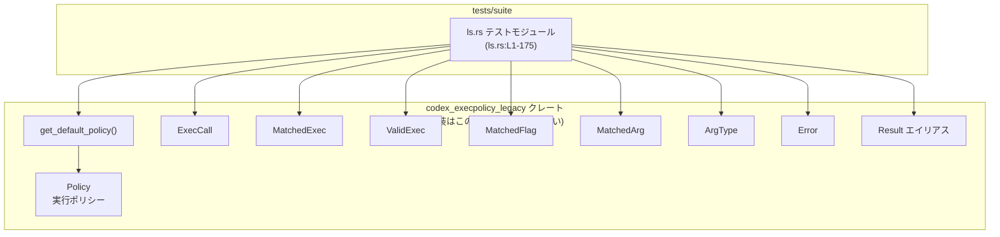
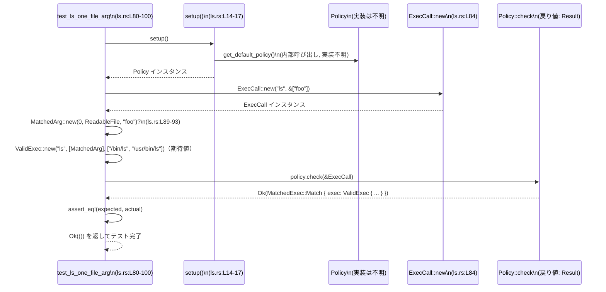

# execpolicy-legacy/tests/suite/ls.rs コード解説

---

## 0. ざっくり一言

- `ls` コマンドに対する **execpolicy のデフォルトポリシーの挙動** を、さまざまな引数パターンで検証するテストモジュールです（`ls.rs:L19-175`）。
- 成功パターンだけでなく、未知オプションや将来対応予定の挙動（オプションバンドル、ファイル後のフラグ）もテストケースとして含みます（`ls.rs:L53-55, L69-70, L152-156`）。

---

## 1. このモジュールの役割

### 1.1 概要

- このモジュールは、`codex_execpolicy_legacy` クレートが提供する **`Policy`** に対し、`ls` コマンドを実行する各種ケースの **検査結果（`MatchedExec` / `Error`）が期待通りか** を確認します（`ls.rs:L3-12, L21-28`）。
- 引数なし、フラグのみ、ファイル引数のみ、フラグ＋ファイル引数、未知オプション、オプションバンドル、ファイルの後ろのフラグといったケースを網羅的にテストしています（`ls.rs:L19-175`）。

### 1.2 アーキテクチャ内での位置づけ

このファイルは **テスト層** に属し、本体クレート `codex_execpolicy_legacy` の API を利用するだけで、内部実装は持ちません。



- 依存方向は一方向で、テストがクレートの公開 API を呼び出します（`ls.rs:L3-12, L21-28`）。
- `get_default_policy()` の実装や `Policy::check()` の中身はこのファイルには存在しないため、不明です。

### 1.3 設計上のポイント

- **共通セットアップ関数**  
  - すべてのテストで共通の `Policy` を取得するために `setup()` 関数を定義しています（`ls.rs:L14-17`）。  
  - `get_default_policy().expect(...)` により、ポリシーのロード失敗時はテストを即座に panic させます。これは「ポリシーが読み込めないならテスト全体が意味をなさない」という前提を表現しています。

- **成功ケースとエラーケースの両方を明示的に検証**  
  - 成功時は `Ok(MatchedExec::Match { ... })`（`ls.rs:L24-28, L37-45, L86-98, L108-120, L130-144, L159-173`）、
  - 失敗時は `Err(Error::UnknownOption { ... })`（`ls.rs:L57-61, L72-76`）を `assert_eq!` で期待値と比較しています。

- **Result と `?` 演算子によるエラーハンドリング**  
  - 一部テストは `-> Result<()>` を返し、`MatchedArg::new(...)?` のエラーをそのままテスト関数から伝播します（`ls.rs:L80-100, L102-122, L124-146, L148-175`）。
  - これにより、引数マッチングのエラーが発生した場合、テストは `Err(...)` で失敗します。

- **並行性**  
  - 非同期 (`async`) やスレッド (`std::thread`) は一切使用しておらず、すべて同期的なテストです。このファイルには並行処理上の懸念点はありません。

---

## 2. 主要な機能一覧（コンポーネントインベントリ）

このモジュール内で定義される関数（すべてテスト）とその役割、および定義位置です。

| 関数名 | 役割 / 説明 | 定義位置 |
|--------|-------------|----------|
| `setup` | デフォルトポリシー `Policy` を読み込む共通ヘルパー。ロード失敗時は panic する。 | `ls.rs:L14-17` |
| `test_ls_no_args` | 引数なしの `ls` 実行が、フラグ・引数なしの `ValidExec` としてマッチすることを検証。 | `ls.rs:L19-29` |
| `test_ls_dash_a_dash_l` | `ls -a -l` が、`MatchedFlag("-a")` と `MatchedFlag("-l")` を持つ `ValidExec` としてマッチすることを検証。 | `ls.rs:L31-47` |
| `test_ls_dash_z` | 未知フラグ `-z` に対して `Error::UnknownOption` が返ることを検証。 | `ls.rs:L49-63` |
| `test_ls_dash_al` | オプションバンドル `-al` が現状は未知オプションとして拒否されることを検証（将来の仕様変更を見越したテスト）。 | `ls.rs:L65-78` |
| `test_ls_one_file_arg` | ファイル引数 1 つ（`foo`）のみの場合に、`MatchedArg(index=0, ArgType::ReadableFile, "foo")` としてマッチすることを検証。 | `ls.rs:L80-100` |
| `test_ls_multiple_file_args` | ファイル引数複数（`foo`, `bar`, `baz`）が、それぞれ読み取り可能ファイルとしてマッチすることを検証。 | `ls.rs:L102-122` |
| `test_ls_multiple_flags_and_file_args` | フラグ `-l`, `-a` とファイル 3 つを混在させた場合のマッチ内容（フラグとインデックス付き引数の組み合わせ）を検証。 | `ls.rs:L124-146` |
| `test_flags_after_file_args` | ファイルの後ろにフラグを置いた `ls foo -l` が、現状の設定では許可されていることを検証（コメントで将来の変更予定を明示）。 | `ls.rs:L148-175` |

---

## 3. 公開 API と詳細解説

### 3.1 このモジュールで利用している主な型一覧（外部クレート）

このファイル内では、すべて `codex_execpolicy_legacy` クレートからインポートして使用しています（`ls.rs:L3-12`）。定義そのものはこのチャンクには現れません。

| 名前 | 種別 | このファイルでの用途 | 使用位置 |
|------|------|----------------------|----------|
| `Policy` | 構造体（推定） | `check(&ExecCall)` でコマンド呼び出しを検査。`setup()` の戻り値。 | `ls.rs:L9, L15-17, L21, L33, L51, L67, L82, L104, L126, L150` |
| `ExecCall` | 構造体（推定） | 検査対象のコマンド名と引数リストを表現する。`ExecCall::new("ls", &[..])` で生成。 | `ls.rs:L5, L22, L35, L55, L70, L84, L106, L128, L157` |
| `MatchedExec` | 列挙体または構造体（推定） | `Policy::check()` の成功結果を表現。ここでは `MatchedExec::Match { exec: ValidExec { ... } }` として使用。 | `ls.rs:L7, L24, L37, L86, L108, L130, L159` |
| `ValidExec` | 構造体 | マッチした実行の詳細（`program`, `flags`, `args`, `system_path` など）を保持。`new(..)` または構造体リテラルで構築。 | `ls.rs:L11, L25, L38-42, L87-95, L109-116, L131-140, L160-168` |
| `MatchedFlag` | 構造体（推定） | マッチしたフラグ 1 つを表現。`MatchedFlag::new("-a")` のように生成。 | `ls.rs:L8, L40, L133, L162` |
| `MatchedArg` | 構造体（推定） | マッチした位置付き引数を表現。`MatchedArg::new(index, ArgType::ReadableFile, "foo")?` のように生成。 | `ls.rs:L6, L89-93, L112-114, L135-137, L163-167` |
| `ArgType` | 列挙体（推定） | 引数の種類を表す。ここでは `ArgType::ReadableFile` のみ使用。 | `ls.rs:L3, L91, L112-114, L135-137, L165` |
| `Error` | 列挙体（推定） | ポリシーチェック失敗時のエラー。ここでは `Error::UnknownOption { program, option }` を検証。 | `ls.rs:L4, L57-60, L72-75` |
| `Result` | 型エイリアス（推定） | テスト関数の戻り値型として使用。`MatchedArg::new` などからのエラーを `?` で伝播。 | `ls.rs:L10, L81, L103, L125, L149` |
| `get_default_policy` | 関数 | デフォルトの `Policy` を読み込む。`setup()` からのみ使用。 | `ls.rs:L12, L15-16` |

> 注: 上記型・関数の実体（フィールドや詳細なバリアント）は、すべてこのチャンクには現れません。用途はこのファイル内での使用方法と命名から説明しています。

---

### 3.2 関数詳細（7 件）

#### `setup() -> Policy` （ls.rs:L14-17）

**概要**

- デフォルトの実行ポリシーを取得するヘルパー関数です。  
- `get_default_policy()` の結果が `Err` の場合は `expect` によって panic します。

**引数**

- なし。

**戻り値**

- `Policy`  
  `codex_execpolicy_legacy::Policy` 型のインスタンス（`ls.rs:L15-16`）。

**内部処理の流れ**

1. `get_default_policy()` を呼び出して、デフォルトポリシーの取得を試みます（`ls.rs:L15`）。
2. 戻り値に対して `.expect("failed to load default policy")` を呼び出します（`ls.rs:L16`）。
   - `Ok(policy)` の場合は `policy` を返却します。
   - `Err(e)` の場合はメッセージ `"failed to load default policy"` とともに panic します。

**Examples（使用例）**

```rust
// デフォルトポリシーを 1 回取得し、複数テストで共有する
let policy = setup(); // ls.rs のテストでは各テスト関数内で都度呼び出している（ls.rs:L21 など）
let ls_call = ExecCall::new("ls", &[]); // 検査対象のコマンド
let result = policy.check(&ls_call);
```

**Errors / Panics**

- `get_default_policy()` が `Err(_)` を返した場合、`expect` により **panic** します（`ls.rs:L16`）。
- これはテスト前提条件（デフォルトポリシーが有効に読み込めること）が満たされない場合にテストを強制的に失敗させる設計です。

**Edge cases（エッジケース）**

- この関数自体に引数はなく、エッジケースは「デフォルトポリシーが読み込めない場合」に集約されます。具体的な失敗要因はこのチャンクからは分かりません（`get_default_policy` の実装が見えないため）。

**使用上の注意点**

- 本来のアプリケーションコードでは、`expect` による panic ではなく `Result` を呼び出し元に返す構造にすることが多いですが、このファイルはテスト用であり、「ロード失敗＝テスト不能」とみなして強制終了する構造になっています。

---

#### `test_ls_no_args()` （ls.rs:L19-29）

**概要**

- 引数なしで `ls` を実行した場合に、フラグ・引数ともに空で、`system_path` が `/bin/ls`, `/usr/bin/ls` の `ValidExec` としてマッチすることを検証するテストです（`ls.rs:L21-28`）。

**引数**

- なし（テストとして使用される）。

**戻り値**

- `()`（`#[test]` 関数の標準的な戻り値）。

**内部処理の流れ**

1. `setup()` を呼び出し、`Policy` を取得します（`ls.rs:L21`）。
2. `ExecCall::new("ls", &[])` で引数なしの `ls` 呼び出しを表現するオブジェクトを作成します（`ls.rs:L22`）。
3. `policy.check(&ls)` を呼び出し、検査結果を得ます（`ls.rs:L27`）。
4. 期待値として `Ok(MatchedExec::Match { exec: ValidExec::new("ls", vec![], &["/bin/ls", "/usr/bin/ls"]) })` を構築し（`ls.rs:L24-26`）、`assert_eq!` で比較します（`ls.rs:L23-28`）。

**Examples（使用例）**

テストそのものが API の基本的な使い方のサンプルになっています。

```rust
let policy = setup();                                   // ポリシーの取得
let call = ExecCall::new("ls", &[]);                    // 引数なし ls
let expected = Ok(MatchedExec::Match {
    exec: ValidExec::new("ls", vec![], &["/bin/ls", "/usr/bin/ls"]),
});
assert_eq!(expected, policy.check(&call));              // 実際の判定と比較
```

**Errors / Panics**

- `setup()` 内で説明した理由により、デフォルトポリシーが取得できない場合には panic する可能性があります（`ls.rs:L21`）。
- `policy.check(&ls)` の戻り値型は `Result<MatchedExec, Error>`（と推定）ですが、このテストでは `Ok(..)` を期待しているため、`Err` が返却された場合は `assert_eq!` の失敗としてテストが落ちます。

**Edge cases（エッジケース）**

- 引数配列を空（`&[]`）にすることで、「まったく引数を指定しない」ケースを網羅しています（`ls.rs:L22`）。
- `system_path` が固定で `/bin/ls` と `/usr/bin/ls` であることも契約の一部になっており、環境依存の変更がある場合はテスト修正が必要になります（`ls.rs:L25`）。

**使用上の注意点**

- このテストが通ることは、「デフォルトポリシーが `ls` を標準的なパスに限定している」ことを前提にしています。別のインストールパスに `ls` がある環境を想定する場合、ポリシー側またはテスト側を変更する必要があります。

---

#### `test_ls_dash_a_dash_l()` （ls.rs:L31-47）

**概要**

- `ls -a -l` のように **複数の短いフラグを別々に指定** した場合に、2 つの `MatchedFlag` と適切な `system_path` を持つ `ValidExec` としてマッチすることを検証します（`ls.rs:L33-46`）。

**引数**

- なし。

**戻り値**

- `()`。

**内部処理の流れ**

1. `setup()` で `Policy` を取得（`ls.rs:L33`）。
2. `args = &["-a", "-l"]` としてフラグ配列を定義（`ls.rs:L34`）。
3. `ExecCall::new("ls", args)` を作成（`ls.rs:L35`）。
4. 期待値として、`flags` フィールドに `MatchedFlag::new("-a")` と `MatchedFlag::new("-l")` を並べた `ValidExec` を構築（`ls.rs:L37-42`）。
5. `policy.check(&ls_a_l)` の結果と `assert_eq!` で比較（`ls.rs:L36-46`）。

**Errors / Panics**

- 既出のとおり、`setup()` で panic の可能性があります。
- `MatchedFlag::new` のエラー有無はこのチャンクからは分かりませんが、このテストでは `MatchedFlag::new("-a")` などは `Result` を返さず直接値を生成しているため、少なくともこのコンストラクタは panic しない想定の API です（`ls.rs:L40, L133`）。

**Edge cases（エッジケース）**

- 同一のフラグを繰り返すケースや、順序が逆の場合の挙動はこのテストでは検証していません。
- ここでは **それぞれ独立した短いフラグが 2 つ** のケースのみを対象としています。

**使用上の注意点**

- `flags: vec![MatchedFlag::new("-a"), MatchedFlag::new("-l")]` の順序も `assert_eq!` の比較対象になっているため、`Policy::check()` 内部のフラグ並べ替え（ソート）などを行うとテストが失敗する可能性があります。

---

#### `test_ls_dash_z()` （ls.rs:L49-63）

**概要**

- `ls -z` のような **未知の短いフラグ** を指定した場合に、`Error::UnknownOption { program: "ls", option: "-z" }` が返ることを検証します（`ls.rs:L53-60`）。

**引数**

- なし。

**戻り値**

- `()`。

**内部処理の流れ**

1. `setup()` で `Policy` を取得（`ls.rs:L51`）。
2. コメントで `-z` が現時点では無効なオプションである旨を説明（`ls.rs:L53-55`）。
3. `ExecCall::new("ls", &["-z"])` を作成（`ls.rs:L55`）。
4. 期待値として `Err(Error::UnknownOption { program: "ls".into(), option: "-z".into() })` を構築（`ls.rs:L57-60`）。
5. `policy.check(&ls_z)` の戻り値と `assert_eq!` で比較（`ls.rs:L56-61`）。

**Errors / Panics**

- `Policy::check()` が `Error::UnknownOption` を返すことが前提です（`ls.rs:L57-61`）。
- エラーが別の型（例: `Error::InvalidArgs`）で返った場合でも `assert_eq!` によりテストは失敗します。

**Edge cases（エッジケース）**

- コメントに「将来 `ls` に `-z` が追加される可能性」についての言及があり（`ls.rs:L53-55`）、ポリシーはコマンド実装の更新に追従する必要があることを示唆しています。
- 長い未知オプション（例: `--does-not-exist`）や別の未知フラグについてはこのテストでは扱っていません。

**使用上の注意点**

- ポリシーが「未知オプションは常に拒否する」という契約を持っていることを、このテストが固定化しています。実際の CLI 挙動に合わせて柔軟なポリシーを許容する場合、テストやポリシーの設計変更が必要になります。

---

#### `test_ls_one_file_arg() -> Result<()>` （ls.rs:L80-100）

**概要**

- ファイル引数を 1 つだけ指定した `ls foo` が、`ArgType::ReadableFile` として位置付き引数 0 でマッチすることを検証します（`ls.rs:L84-98`）。

**引数**

- なし。

**戻り値**

- `Result<()>`（`codex_execpolicy_legacy::Result` エイリアス。具体的な型はこのチャンクには現れません）（`ls.rs:L80-81`）。

**内部処理の流れ**

1. `setup()` で `Policy` を取得（`ls.rs:L82`）。
2. `ExecCall::new("ls", &["foo"])` を作成（`ls.rs:L84`）。
3. 期待値として `ValidExec::new("ls", vec![MatchedArg::new(0, ArgType::ReadableFile, "foo")?], &["/bin/ls", "/usr/bin/ls"])` を構築（`ls.rs:L86-95`）。
   - `MatchedArg::new(...)` が `Result` を返すため、`?` によってエラーがあればテスト関数から早期に `Err` として返されます（`ls.rs:L89-93`）。
4. `policy.check(&ls_one_file_arg)` の結果と `assert_eq!` で比較（`ls.rs:L85-98`）。
5. 成功した場合は `Ok(())` を返してテスト成功を表します（`ls.rs:L99`）。

**Errors / Panics**

- `MatchedArg::new` が `Err(...)` を返した場合（例えば `"foo"` が `ArgType::ReadableFile` として無効と判定された場合など）、`?` により `test_ls_one_file_arg` 自体が `Err` を返します（`ls.rs:L89-93`）。
  - 具体的なエラー型や条件は、このチャンクには現れません。
- `Policy::check` が `Err(...)` を返した場合は `assert_eq!` が失敗します。

**Edge cases（エッジケース）**

- `"foo"` が存在しないファイルである場合の扱いは、このテストからは分かりません。`ArgType::ReadableFile` の解釈（「存在する必要があるのか」「パターン指定を許すのか」など）はこのチャンクには現れません。
- index に `0` を指定していることから、`MatchedArg::new` の第 1 引数は「元の引数リスト中の位置」を表していると解釈できます（`ls.rs:L89-90`）。

**使用上の注意点**

- テストコード中で `?` を使うためには、テスト関数の戻り値を `Result<()>` にする必要があります（`ls.rs:L80-81`）。これは「エラーが起きたら `Err` でテスト失敗を表現する」Rust のよくあるテストパターンです。

---

#### `test_ls_multiple_flags_and_file_args() -> Result<()>` （ls.rs:L124-146）

**概要**

- `ls -l -a foo bar baz` のように、複数のフラグと複数のファイル引数を併用した場合のマッチ結果（フラグと引数の位置情報）が正しく構成されることを検証します（`ls.rs:L128-144`）。

**引数**

- なし。

**戻り値**

- `Result<()>`。

**内部処理の流れ**

1. `setup()` で `Policy` を取得（`ls.rs:L126`）。
2. `ExecCall::new("ls", &["-l", "-a", "foo", "bar", "baz"])` でコマンドを構築（`ls.rs:L128`）。
3. 期待値として `ValidExec` を構造体リテラルで構築（`ls.rs:L130-140`）:
   - `program: "ls".into()`（`ls.rs:L132`）
   - `flags: vec![MatchedFlag::new("-l"), MatchedFlag::new("-a")]`（`ls.rs:L133`）
   - `args`:  
     - index 2 -> `"foo"`  
     - index 3 -> `"bar"`  
     - index 4 -> `"baz"`（`ls.rs:L134-137`）
   - `system_path`: `/bin/ls`, `/usr/bin/ls`（`ls.rs:L139`）
4. `policy.check(&ls_multiple_flags_and_file_args)` の結果と `assert_eq!` で比較（`ls.rs:L129-144`）。
5. 成功時は `Ok(())` を返す（`ls.rs:L145`）。

**Errors / Panics**

- 各 `MatchedArg::new(...)?` からのエラーは `?` によってテスト関数に伝播します（`ls.rs:L135-137`）。
- `MatchedFlag::new` はエラーを返さない API として使用されています（`ls.rs:L133`）。

**Edge cases（エッジケース）**

- ここでは **フラグが先、ファイル引数が後** という順序のケースのみを検証しています。
- index が 2, 3, 4 となっていることから、元の引数列における位置情報が `MatchedArg` に保持される設計であることが分かります（`ls.rs:L134-137`）。
- フラグとファイル引数が交互に混ざる場合の挙動は別のテスト（`test_flags_after_file_args`）で扱っています（`ls.rs:L148-175`）。

**使用上の注意点**

- `assert_eq!` による構造体比較のため、フィールドの **順序や値が完全一致** する必要があります。`Policy::check` 実装におけるフラグ・引数のソートなどの変更はこのテストに影響します。

---

#### `test_flags_after_file_args() -> Result<()>` （ls.rs:L148-175）

**概要**

- `ls foo -l` のように **ファイル引数の後ろにフラグを置いた場合** の挙動を検証します（`ls.rs:L152-157`）。
- コメントによると、実際の `ls` はこのようなフラグの位置を許容しないため、将来的にはポリシー側で禁止設定にすべきである旨が書かれています（`ls.rs:L152-156`）。

**引数**

- なし。

**戻り値**

- `Result<()>`。

**内部処理の流れ**

1. `setup()` で `Policy` を取得（`ls.rs:L150`）。
2. コメントで、このテストケースの安全性と `ls` の仕様との差異について説明（`ls.rs:L152-156`）。
3. `ExecCall::new("ls", &["foo", "-l"])` を作成（`ls.rs:L157`）。
4. 期待値として `ValidExec` を構造体リテラルで構築（`ls.rs:L159-168`）:
   - `flags: vec![MatchedFlag::new("-l")]`（`ls.rs:L162`）
   - `args: vec![MatchedArg::new(0, ArgType::ReadableFile, "foo")?]`（`ls.rs:L163-167`）
5. `policy.check(&ls_flags_after_file_args)` の結果と `assert_eq!` で比較（`ls.rs:L158-173`）。
6. 成功した場合は `Ok(())` を返す（`ls.rs:L174`）。

**Errors / Panics**

- `MatchedArg::new` がエラーを返した場合、`?` により `test_flags_after_file_args` 自体が `Err` を返します（`ls.rs:L163-167`）。
- このテストでは **現在のポリシー設定下で OK であること** を検証していますが、コメントによると将来的にポリシー設定を変更してこのコマンドを禁止することが想定されています（`ls.rs:L152-156`）。設定変更時にはテスト内容も変更が必要です。

**Edge cases（エッジケース）**

- 「ファイルの後ろにフラグを置く」という、CLI 的には少し特殊なケースを扱っています。
- index 0 の引数 `"foo"` が `args` に、index 1 の `"-l"` が `flags` に分類されていることから、`Policy::check` は「フラグ位置の制約をこの設定では課していない」ことが分かります（このファイルから読み取れる範囲では）（`ls.rs:L159-167`）。

**使用上の注意点**

- コメントに書かれているとおり、このテストは「安全ではあるが、実際の `ls` の仕様とは異なる」状態を表現しているため、仕様を実 CLI に合わせ込む場合にはテストの期待値を `Err(...)` に変更するなどのメンテナンスが必須です。

---

### 3.3 その他の関数

詳細解説から省いたテスト関数の一覧です。

| 関数名 | 役割（1 行） | 定義位置 |
|--------|--------------|----------|
| `test_ls_dash_al` | オプションバンドル `-al` が現状は未知オプションとして拒否されることを検証し、将来 `option_bundling=True` 実装時の挙動変更をコメントで示唆するテスト。 | `ls.rs:L65-78` |
| `test_ls_multiple_file_args` | `["foo", "bar", "baz"]` の 3 つのファイル引数が、それぞれ index 0, 1, 2 の `ArgType::ReadableFile` としてマッチすることを検証。 | `ls.rs:L102-122` |

---

## 4. データフロー

ここでは代表的なシナリオとして、`test_ls_one_file_arg` のデータフローを示します。

### 4.1 `test_ls_one_file_arg` のフロー



- 実際の検査ロジック（`Policy::check` が `ExecCall` をどのように解析するか）はこのチャンクには現れません。
- テストは「入力（`ExecCall`）と期待される出力（`MatchedExec` または `Error`）の対応」が変わらないことを保証する **契約テスト** 的な役割を担っています。

---

## 5. 使い方（How to Use）

### 5.1 基本的な使用方法

このテストファイルは、`codex_execpolicy_legacy` クレートの基本的な使い方のサンプルともなっています。典型的なフローは以下のとおりです。

```rust
use codex_execpolicy_legacy::{
    get_default_policy, ExecCall, MatchedExec, ValidExec, Result,
};

fn main() -> Result<()> {
    // ポリシーを用意する（テストでは setup() がこれを行う: ls.rs:L14-17）
    let policy = get_default_policy()?;

    // ユーザーのコマンド入力を ExecCall に変換する（テストでは文字列リテラルを使用: ls.rs:L22 など）
    let call = ExecCall::new("ls", &["-l", "foo"]);

    // ポリシーで検査する（ls.rs:L27, L45, L61 等）
    match policy.check(&call) {
        Ok(MatchedExec::Match { exec }) => {
            // exec.program, exec.flags, exec.args, exec.system_path などから
            // 実行方針を決定する（詳細なフィールドはこのチャンクには現れない）
            println!("Allowed exec: {:?}", exec);
        }
        Err(e) => {
            // Error（例: Error::UnknownOption）に応じて処理を分岐
            eprintln!("Rejected: {:?}", e);
        }
    }

    Ok(())
}
```

### 5.2 よくある使用パターン

テストから読み取れる、よくあるパターンをまとめます。

1. **フラグのみのコマンドを検査する**（`test_ls_dash_a_dash_l`）
   - `ExecCall::new("ls", &["-a", "-l"])`
   - 期待値の `flags` に `MatchedFlag::new("-a")`, `MatchedFlag::new("-l")` を並べる（`ls.rs:L34-41`）。

2. **ファイル引数のみのコマンドを検査する**（`test_ls_one_file_arg`, `test_ls_multiple_file_args`）
   - `ExecCall::new("ls", &["foo"])` や `&["foo", "bar", "baz"]` を渡す（`ls.rs:L84, L106`）。
   - 位置情報と型情報を付与した `MatchedArg::new(index, ArgType::ReadableFile, name)?` で期待値を構築（`ls.rs:L89-93, L112-114`）。

3. **フラグ＋ファイル引数混在のコマンドを検査する**（`test_ls_multiple_flags_and_file_args`, `test_flags_after_file_args`）
   - フラグと引数の並びによって `flags` と `args` にどのように分類されるかをテストで固定（`ls.rs:L128-140, L157-168`）。

### 5.3 よくある間違い（推測される誤用と対比）

このファイルから推測できる、誤用の例と正しい使い方です。

```rust
// 誤り例: ExecCall を作らずに直接 Policy に文字列を渡そうとする
// let result = policy.check("ls -l"); // コンパイルエラー: &str は期待される型ではない

// 正しい例: まず ExecCall を構築し、その参照を渡す（ls.rs:L22, L35 など）
let call = ExecCall::new("ls", &["-l"]);
let result = policy.check(&call);
```

```rust
// 誤り例: テスト関数で ? を使うが、戻り値が Result ではない
#[test]
fn my_test() {
    let arg = MatchedArg::new(0, ArgType::ReadableFile, "foo")?; // コンパイルエラー
}

// 正しい例: 戻り値を Result<()> にし、末尾で Ok(()) を返す（ls.rs:L80-100）
#[test]
fn my_test() -> Result<()> {
    let arg = MatchedArg::new(0, ArgType::ReadableFile, "foo")?;
    // ... 検証処理 ...
    Ok(())
}
```

### 5.4 使用上の注意点（まとめ）

- **ポリシーのロード前提**  
  - `setup()` が `expect` を使っているとおり、テストは「デフォルトポリシーが必ずロード可能」という前提で書かれています（`ls.rs:L14-17`）。  
  - 実運用コードで同じパターンをそのまま用いると、設定ファイル破損などでアプリケーション全体が panic で終了する可能性があります。

- **環境依存パス**  
  - テストは `system_path` が `/bin/ls` と `/usr/bin/ls` 固定であることを前提にしています（`ls.rs:L25, L41, L94-95, L116, L139, L168`）。
  - 別の OS や PATH 環境に対応する場合、この前提は崩れうるため、ポリシーの設定・テストの期待値のいずれかを調整する必要があります。

- **実コマンド仕様とのギャップ**  
  - `test_flags_after_file_args` のコメントにあるように、現状のポリシーは「ファイルの後ろのフラグ」を許可していますが、実際の `ls` はこれを拒否するようです（`ls.rs:L152-156`）。  
  - セキュリティ上、ポリシーを「実コマンドと同じ仕様」に合わせたい場合、このギャップに注意が必要です。

---

## 6. 変更の仕方（How to Modify）

### 6.1 新しい機能（テストケース）を追加する場合

`ls` に新しいオプションや挙動をサポートしたい場合に考えられる手順です。

1. **期待する挙動を決める**
   - 例: 新しいフラグ `-F` を許可するか、未知オプションとして拒否するか。
2. **テストを追加**
   - 本ファイル（`execpolicy-legacy/tests/suite/ls.rs`）に新しい `#[test]` 関数を追加し、`ExecCall::new("ls", &["-F"])` に対する `Policy::check` の戻り値を `assert_eq!` で検証します。
3. **ポリシー定義を変更**
   - `ls` のポリシー定義（`define_program()` など、コメントに出てくる関数: `ls.rs:L154-155`）を更新し、テストの期待値に合うようにします。  
   - これらの実装ファイルはこのチャンクには現れないため、実際の編集場所はリポジトリ構造に依存します。

### 6.2 既存の機能（挙動）を変更する場合

例: `-al` のオプションバンドルを許可したい場合。

- **影響範囲の確認**
  - `test_ls_dash_al` の期待値は現状 `Err(Error::UnknownOption { option: "-al" })` です（`ls.rs:L69-76`）。
  - `option_bundling=True` を導入すると、このテストの期待値を `Ok(MatchedExec::Match { .. })` に変更する必要があります。
- **契約の確認**
  - テストは「現在の仕様」の契約を表しているため、仕様を変える場合にはテストも一緒に更新し、変更の意図をコメントに残すと分かりやすくなります。
- **関連テストの再確認**
  - フラグの並び順や位置に関するテスト（`test_ls_dash_a_dash_l`, `test_ls_multiple_flags_and_file_args`, `test_flags_after_file_args`）も挙動変更の影響を受ける可能性があります。

---

## 7. 関連ファイル

このモジュールと密接に関連すると考えられるファイル・コンポーネントです。

| パス / コンポーネント | 役割 / 関係 |
|-----------------------|------------|
| `execpolicy-legacy/tests/suite/ls.rs` | 本ファイル。`ls` コマンドに対するデフォルト実行ポリシーのテストを定義。 |
| `codex_execpolicy_legacy` クレート（パス不明） | `Policy`, `ExecCall`, `MatchedExec`, `ValidExec`, `MatchedArg`, `MatchedFlag`, `ArgType`, `Error`, `Result`, `get_default_policy` などを提供する本体。実装はこのチャンクには現れません。 |
| `define_program()` を含むモジュール（パス不明） | コメントによれば、`ls` のフラグ位置制約などを設定する機能を持つとされています（`ls.rs:L154-155`）。この関数の実体はこのチャンクには現れません。 |

---

### Bugs / Security 的な観点の補足（このファイルから読み取れる範囲）

- **潜在的な仕様ギャップ**  
  - `test_flags_after_file_args` が示すように、現在のポリシーは `ls foo -l` を許可していますが、コメントによると実際の `ls` はこれを認めないようです（`ls.rs:L152-156`）。  
  - ポリシーの目的が「実コマンドの安全なサブセットを正確に模倣すること」である場合、このギャップはセキュリティ／ポリシー上のリスクになる可能性があります。

- **テストとしての堅牢性**  
  - `setup()` で `expect` を用いているため、デフォルトポリシーのロードに失敗した場合に早期にテストが止まる構造になっています（`ls.rs:L14-17`）。これは「ポリシー未設定でテストが続行してしまう」状態を防ぐという意味で安全側の設計です。

この範囲を超える具体的な脆弱性や内部仕様は、このチャンクの情報だけからは判断できません。
