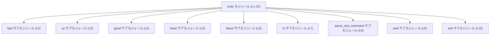

execpolicy-legacy/tests/suite/mod.rs の解説です。

# execpolicy-legacy/tests/suite/mod.rs

## 0. ざっくり一言

このファイルは、複数の統合テストをサブモジュールとしてまとめる **テスト用モジュール集約ファイル** です（`execpolicy-legacy/tests/suite/mod.rs:L1-10`）。  
自前のロジックや関数は一切定義されておらず、すべて `mod ...;` によるモジュール宣言のみで構成されています。

---

## 1. このモジュールの役割

### 1.1 概要

- 先頭コメントにある通り、「以前はスタンドアロンだった統合テストを、モジュールとして集約する」ことが役割です（`execpolicy-legacy/tests/suite/mod.rs:L1-1`）。
- 実際には、`bad`, `cp`, `good`, `head`, `literal`, `ls`, `parse_sed_command`, `pwd`, `sed` という 9 個のテストモジュールを宣言しています（`execpolicy-legacy/tests/suite/mod.rs:L2-10`）。
- このファイル自身はテストコードを持たず、「テスト群を 1 つのモジュール階層にまとめるための玄関口」として機能しています。

### 1.2 アーキテクチャ内での位置づけ

このファイルは `suite` モジュールとして機能し、そこから各テストモジュールをサブモジュールとして読み込んでいます。

**コンポーネント（モジュール）一覧**

| 名前 | 種別 | 定義位置 | 説明 |
|------|------|----------|------|
| `suite` | モジュール | `execpolicy-legacy/tests/suite/mod.rs:L1-10` | 本ファイルに対応するテスト用モジュール。9 個のサブモジュールを集約する。 |
| `bad` | サブモジュール宣言 | `execpolicy-legacy/tests/suite/mod.rs:L2-2` | `bad` という名前のテストサブモジュールを宣言。実体は別ファイルに存在（本チャンクには未掲載）。 |
| `cp` | サブモジュール宣言 | `execpolicy-legacy/tests/suite/mod.rs:L3-3` | `cp` サブモジュールを宣言。 |
| `good` | サブモジュール宣言 | `execpolicy-legacy/tests/suite/mod.rs:L4-4` | `good` サブモジュールを宣言。 |
| `head` | サブモジュール宣言 | `execpolicy-legacy/tests/suite/mod.rs:L5-5` | `head` サブモジュールを宣言。 |
| `literal` | サブモジュール宣言 | `execpolicy-legacy/tests/suite/mod.rs:L6-6` | `literal` サブモジュールを宣言。 |
| `ls` | サブモジュール宣言 | `execpolicy-legacy/tests/suite/mod.rs:L7-7` | `ls` サブモジュールを宣言。 |
| `parse_sed_command` | サブモジュール宣言 | `execpolicy-legacy/tests/suite/mod.rs:L8-8` | `parse_sed_command` サブモジュールを宣言。 |
| `pwd` | サブモジュール宣言 | `execpolicy-legacy/tests/suite/mod.rs:L9-9` | `pwd` サブモジュールを宣言。 |
| `sed` | サブモジュール宣言 | `execpolicy-legacy/tests/suite/mod.rs:L10-10` | `sed` サブモジュールを宣言。 |

この関係を Mermaid の依存関係図で表すと、次のようになります。



> 親モジュール（例えば `tests/suite.rs` など）から `mod suite;` されている可能性はありますが、その情報はこのチャンクには現れません。

### 1.3 設計上のポイント

コードから読み取れる範囲での設計上の特徴は次の通りです。

- **責務の分割**  
  - 各テストグループを独立したサブモジュールに分割し、それらを `suite` で集約する構造になっています（`execpolicy-legacy/tests/suite/mod.rs:L2-10`）。
- **状態を持たないモジュール**  
  - このファイルにはグローバル変数や構造体などの状態を持つ要素は一切なく、モジュール宣言のみです（`execpolicy-legacy/tests/suite/mod.rs:L1-10`）。
- **エラーハンドリング・並行性**  
  - 関数やロジックを定義していないため、エラーハンドリングや非同期処理／並行性に関するコードはここにはありません（`execpolicy-legacy/tests/suite/mod.rs:L1-10`）。

---

## 2. 主要な機能一覧

このファイル自体が提供する「機能」は、実行時の処理というより **コンパイル時のモジュール構成** に関するものです。

- テストモジュールの集約: 以前個別ファイルだった統合テストを、`suite` モジュール配下にサブモジュールとしてまとめる（コメントより：`execpolicy-legacy/tests/suite/mod.rs:L1-1`）。
- サブモジュール宣言:
  - `bad` テストモジュールの宣言（`execpolicy-legacy/tests/suite/mod.rs:L2-2`）
  - `cp` テストモジュールの宣言（`execpolicy-legacy/tests/suite/mod.rs:L3-3`）
  - `good` テストモジュールの宣言（`execpolicy-legacy/tests/suite/mod.rs:L4-4`）
  - `head` テストモジュールの宣言（`execpolicy-legacy/tests/suite/mod.rs:L5-5`）
  - `literal` テストモジュールの宣言（`execpolicy-legacy/tests/suite/mod.rs:L6-6`）
  - `ls` テストモジュールの宣言（`execpolicy-legacy/tests/suite/mod.rs:L7-7`）
  - `parse_sed_command` テストモジュールの宣言（`execpolicy-legacy/tests/suite/mod.rs:L8-8`）
  - `pwd` テストモジュールの宣言（`execpolicy-legacy/tests/suite/mod.rs:L9-9`）
  - `sed` テストモジュールの宣言（`execpolicy-legacy/tests/suite/mod.rs:L10-10`）

各モジュールの中身（どのようなテストケースを持つか）は、このチャンクには現れません。

---

## 3. 公開 API と詳細解説

### 3.1 型一覧（構造体・列挙体など）

このファイルには、構造体・列挙体・型エイリアスなどの **型定義は存在しません**。

- 根拠: 全行がコメント 1 行と `mod` 宣言 9 行のみであり、`struct` / `enum` / `type` / `pub` などのキーワードが登場しないためです（`execpolicy-legacy/tests/suite/mod.rs:L1-10`）。

そのため、型一覧の表は空になります。

| 名前 | 種別 | 役割 / 用途 |
|------|------|-------------|
| （なし） | - | このファイルには型定義がありません |

### 3.2 関数詳細（最大 7 件）

このファイルには **関数定義が 1 つもありません**。

- `fn` キーワードが登場しないことから、自由関数・メソッド・テスト関数などが定義されていないと判断できます（`execpolicy-legacy/tests/suite/mod.rs:L1-10`）。

したがって、詳細解説すべき関数も存在しません。

### 3.3 その他の関数

補助的な関数やラッパー関数も存在しません（同上）。

---

## 4. データフロー

このファイルには実行時ロジックがないため、「値がどのように流れるか」という意味でのデータフローは存在しません。  
ただし、**モジュールの読み込みフロー** という観点で、テスト実行時の流れを一般的な Rust のテスト動作に基づいて整理すると、次のようになります。

1. `cargo test` を実行すると、テスト用クレートがビルドされます。
2. その中で `suite` モジュールがコンパイルされ、このファイルの `mod bad;` などの宣言により、各サブモジュールがコンパイル対象に含まれます（`execpolicy-legacy/tests/suite/mod.rs:L2-10`）。
3. 各サブモジュール内の `#[test]` 関数が Rust のテストハーネスから検出され、実行されます（`#[test]` 自体やテスト関数はこのチャンクには現れません）。

この流れを、Mermaid のシーケンス図で表すと次のようになります。

```mermaid
sequenceDiagram
    participant Cargo as cargo test
    participant Harness as テストハーネス
    participant Suite as suite モジュール (L1-10)
    participant Bad as bad モジュール (L2)
    participant Cp as cp モジュール (L3)
    participant Good as good モジュール (L4)
    %% 他モジュールも同様に存在するが、図は代表のみを記載

    Cargo->>Harness: テスト実行を開始
    Harness->>Suite: suite モジュールを読み込み
    Suite->>Bad: mod bad; により bad をコンパイル対象に含める
    Suite->>Cp: mod cp; により cp をコンパイル対象に含める
    Suite->>Good: mod good; により good をコンパイル対象に含める
    Note right of Harness: 各モジュール内の #[test] 関数が検出・実行される（このチャンクには定義なし）
```

> 図中のテストハーネスの挙動は、Rust の標準的なテスト実行モデルに基づく一般的説明であり、このファイル単体からテスト関数の存在までは確認できません。

---

## 5. 使い方（How to Use）

### 5.1 基本的な使用方法

このファイルは「プロダクションコードから呼び出す」対象ではなく、**テストをグループ化するためのモジュール定義**です。

Rust のモジュールシステムの観点から見ると：

- `mod bad;` という宣言により、コンパイラは同じディレクトリ内の `bad.rs` か `bad/mod.rs` をサブモジュールとして探します（一般的な Rust の規則）。
- そのサブモジュール内に `#[test]` 関数を書いておくと、`cargo test` 実行時にテストとして認識されます。

新しいテストグループを追加する典型的な手順は、次のように整理できます（ファイル構成は一般則であり、このチャンクからは具体ファイル名までは確定できません）。

```rust
// execpolicy-legacy/tests/suite/mod.rs にサブモジュールを追加
mod new_group;  // 新しいテストグループ new_group を宣言する
```

```rust
// execpolicy-legacy/tests/suite/new_group.rs （または new_group/mod.rs）例
#[test]                           // テスト関数であることを示す属性
fn my_new_test() {                // テスト関数本体
    // ここにテスト内容を書く
    // assert_eq!(...);
}
```

このように、このファイルは **「どのテストモジュールをテストスイートに含めるか」** を列挙する場所として機能します。

### 5.2 よくある使用パターン

コードから読み取れる使用パターンは次の通りです（`execpolicy-legacy/tests/suite/mod.rs:L2-10`）。

- **機能単位／コマンド単位の分割**  
  モジュール名 `cp`, `ls`, `sed`, `pwd`, `head` などから、Unix コマンド名ごとにテストを分割している可能性がありますが、**これは名前からの推測であり、このチャンクだけでは断定できません**。
- **ケース種別による分割**  
  `good` / `bad` という名前から、成功系／失敗系テストを分けていることが想像されますが、これもあくまでモジュール名からの推測です。

確実に言えることは、「複数のテストモジュールを 1 つの `suite` モジュール配下に集約している」という点のみです（`execpolicy-legacy/tests/suite/mod.rs:L2-10`）。

### 5.3 よくある間違い

Rust のモジュールシステムに基づいた、起こりやすい誤用とその修正例を示します。

```rust
// 誤り例: ファイルを作っただけで mod 宣言を追加していない

// ファイル: tests/suite/new_group.rs を作成したが…
// tests/suite/mod.rs には何も追加していない
// ⇒ new_group モジュールはコンパイルされず、テストも実行されない
```

```rust
// 正しい例: mod 宣言を追加する

// tests/suite/mod.rs
mod bad;
mod cp;
// ...
mod sed;
mod new_group; // ← ここを追加することで new_group のテストが有効になる
```

```rust
// 誤り例: ファイル名と mod 名が不一致

// tests/suite/mod.rs
mod new_group;

// ファイル名: tests/suite/newGroup.rs など
// ⇒ Rust の規則では new_group.rs または new_group/mod.rs を探すため、
//    コンパイルエラーになる
```

Rust では「`mod 名前;` とファイル名（またはディレクトリ名）は一致している必要がある」という点が、このファイルを編集する際の重要な前提条件になります。

### 5.4 使用上の注意点（まとめ）

- **前提条件**
  - `mod name;` に対応する `name.rs` または `name/mod.rs` が存在している必要があります。
  - モジュール名とファイル名の小文字・アンダースコアなどを含めたスペルが一致していることが前提です。
- **禁止事項／注意事項**
  - ファイルだけ追加して `mod` 宣言を忘れると、そのテストモジュールはコンパイルも実行もされません。
  - 逆に、`mod` 宣言を残したままファイルを削除するとコンパイルエラーになります。
- **安全性・セキュリティ**
  - このファイルは単にテストモジュールを列挙しているのみであり、実際の権限操作や I/O などはサブモジュール側に依存します。このチャンクからはセキュリティに関する挙動は一切読み取れません。

---

## 6. 変更の仕方（How to Modify）

### 6.1 新しい機能（テストグループ）を追加する場合

新しいテストモジュールを追加する一般的な手順を整理します。

1. **サブモジュールファイルを作成**  
   - `execpolicy-legacy/tests/suite/new_group.rs` などを作成し、その中に `#[test]` 関数を定義する。  
   - このステップの詳細は、このチャンクには現れませんが、Rust の標準的な慣習です。

2. **`mod` 宣言を追加**  
   - 本ファイルの末尾などに `mod new_group;` を追加する（`execpolicy-legacy/tests/suite/mod.rs:L2-10` に倣う）。

   ```rust
   // 既存
   mod pwd;
   mod sed;

   // 追加
   mod new_group;
   ```

3. **ビルド／テストを実行**
   - `cargo test` でコンパイルとテスト実行を行い、新しいテストが認識されることを確認する。

### 6.2 既存の機能を変更する場合

このファイルで行う変更は主に「モジュールの追加・削除・リネーム」です。

- **モジュール名を変更する場合**
  - このファイルの `mod name;` を新しい名前に変更するとともに、対応するファイル名も同じ名前に変更する必要があります。
  - 例: `mod bad;` → `mod invalid_cases;` に変えるなら、`bad.rs` → `invalid_cases.rs` などに変更。

- **モジュールを削除する場合**
  - サブモジュールの `.rs` ファイル（またはディレクトリ）を削除し、同時に本ファイルの `mod` 宣言行も削除します。
  - 片方のみ削除するとコンパイルエラーの原因になります。

- **影響範囲の確認**
  - このファイル自体はテストモジュールを集約するだけですが、サブモジュール名を変更すると、そのモジュールを参照している他のテストコード（`use suite::bad::...` など）があれば影響を受けます。  
    ただし、そのような参照が存在するかどうかは、このチャンクには現れません。

---

## 7. 関連ファイル

このモジュールと密接に関係するファイルは、「`mod` 宣言で参照しているサブモジュールの実体」です。

| パス（候補） | 役割 / 関係 |
|--------------|------------|
| `tests/suite/bad.rs` または `tests/suite/bad/mod.rs` | `mod bad;` に対応するテストモジュール。詳細はこのチャンクには現れません（`execpolicy-legacy/tests/suite/mod.rs:L2-2`）。 |
| `tests/suite/cp.rs` または `tests/suite/cp/mod.rs` | `mod cp;` に対応（`execpolicy-legacy/tests/suite/mod.rs:L3-3`）。 |
| `tests/suite/good.rs` または `tests/suite/good/mod.rs` | `mod good;` に対応（`execpolicy-legacy/tests/suite/mod.rs:L4-4`）。 |
| `tests/suite/head.rs` または `tests/suite/head/mod.rs` | `mod head;` に対応（`execpolicy-legacy/tests/suite/mod.rs:L5-5`）。 |
| `tests/suite/literal.rs` または `tests/suite/literal/mod.rs` | `mod literal;` に対応（`execpolicy-legacy/tests/suite/mod.rs:L6-6`）。 |
| `tests/suite/ls.rs` または `tests/suite/ls/mod.rs` | `mod ls;` に対応（`execpolicy-legacy/tests/suite/mod.rs:L7-7`）。 |
| `tests/suite/parse_sed_command.rs` または `tests/suite/parse_sed_command/mod.rs` | `mod parse_sed_command;` に対応（`execpolicy-legacy/tests/suite/mod.rs:L8-8`）。 |
| `tests/suite/pwd.rs` または `tests/suite/pwd/mod.rs` | `mod pwd;` に対応（`execpolicy-legacy/tests/suite/mod.rs:L9-9`）。 |
| `tests/suite/sed.rs` または `tests/suite/sed/mod.rs` | `mod sed;` に対応（`execpolicy-legacy/tests/suite/mod.rs:L10-10`）。 |

> 上記の具体的なファイルパスは、Rust の標準的なモジュール探索規則に基づく候補であり、このチャンクの情報だけではどちらの形式（`xxx.rs` / `xxx/mod.rs`）が実際に使われているかは分かりません。
