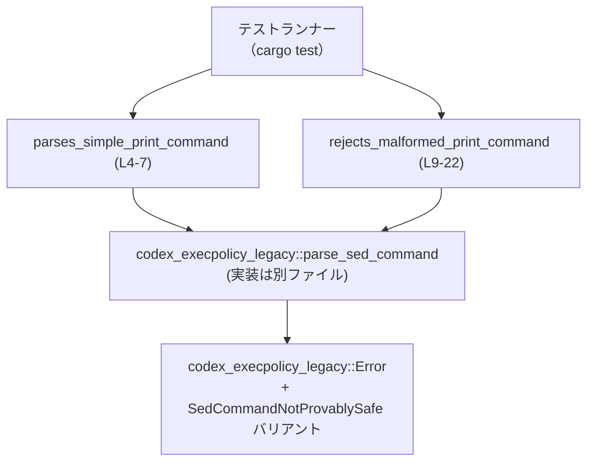
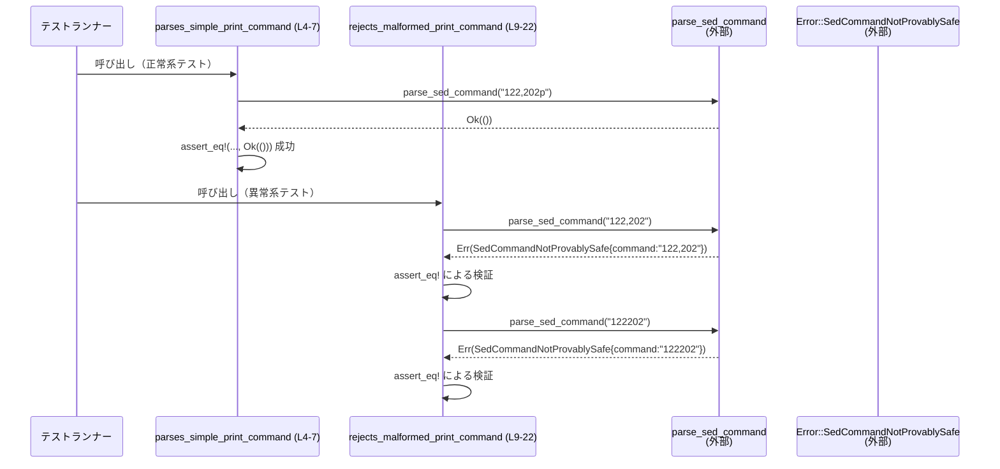

# execpolicy-legacy/tests/suite/parse_sed_command.rs

## 0. ざっくり一言

`codex_execpolicy_legacy::parse_sed_command` 関数が、特定の `sed` コマンド文字列を「安全」とみなすかどうかを検証するテストモジュールです（`parse_sed_command.rs:L1-2`）。

---

## 1. このモジュールの役割

### 1.1 概要

- このモジュールは、`codex_execpolicy_legacy::parse_sed_command` が
  - `"122,202p"` を安全なコマンドとして受理し `Ok(())` を返すこと
  - `"122,202"` と `"122202"` を安全とは見なさず、`Error::SedCommandNotProvablySafe { command }` を返すこと  
  を検証するテストを提供します（`parse_sed_command.rs:L4-22`）。

### 1.2 アーキテクチャ内での位置づけ

このファイルは **テストクレート側** にあり、本体クレート `codex_execpolicy_legacy` の API を呼び出して挙動を確認する位置づけになっています。



- テストランナーが `#[test]` 関数（`parses_simple_print_command`, `rejects_malformed_print_command`）を呼び出します（`parse_sed_command.rs:L4,9`）。
- それぞれのテスト関数は `parse_sed_command` を呼び、結果を `assert_eq!` で検証します（`parse_sed_command.rs:L6,11-16,17-22`）。
- エラーケースでは `Error::SedCommandNotProvablySafe` バリアントを期待しています（`parse_sed_command.rs:L13-15,19-21`）。

### 1.3 設計上のポイント

- **責務の分離**  
  - このファイルは **テストのみ** を含み、実装はすべて `codex_execpolicy_legacy` クレート側にあります（`parse_sed_command.rs:L1-2`）。
- **エラーハンドリングの確認**  
  - 成功ケースだけでなく、特定のエラー・バリアント（`SedCommandNotProvablySafe`）と、そのフィールド `command` の値まで検証しています（`parse_sed_command.rs:L11-22`）。
- **状態を持たないテスト**  
  - グローバル状態や共有ミューテーションはなく、各テストは独立しており副作用を持ちません。
- **並行性要素なし**  
  - `async` やスレッド、`unsafe` ブロックなどは登場せず、Rust の安全な同期コードのみで構成されています。

---

## 2. 主要な機能一覧

- `parses_simple_print_command`: `"122,202p"` のような単純な `sed` の print コマンドが `Ok(())` として受理されることを検証するテストです（`parse_sed_command.rs:L4-7`）。
- `rejects_malformed_print_command`: `"122,202"` や `"122202"` のようなコマンドがエラー `Error::SedCommandNotProvablySafe { command }` として拒否されることを検証するテストです（`parse_sed_command.rs:L9-22`）。

### 2.1 関数・型インベントリー（このチャンク）

| 名前 | 種別 | 定義/参照位置 | 役割 / 用途 | 備考 |
|------|------|---------------|-------------|------|
| `parses_simple_print_command` | 関数（テスト） | `parse_sed_command.rs:L4-7` | 正常系（安全な `sed` コマンド）の挙動を検証する `#[test]` 関数 | テストランナーから自動呼び出し |
| `rejects_malformed_print_command` | 関数（テスト） | `parse_sed_command.rs:L9-22` | 異常系（安全とみなせない `sed` コマンド）の挙動を検証する `#[test]` 関数 | テストランナーから自動呼び出し |
| `parse_sed_command` | 関数（外部 API） | インポート: `parse_sed_command.rs:L2` / 利用: `L6,12,18` | `sed` コマンド文字列を解析・検証し、`Result<(), Error>` を返す関数 | 実装は別ファイル（このチャンクには現れない） |
| `Error` | 型（詳細種別不明） | インポート: `parse_sed_command.rs:L1` / 利用: `L13,19` | `parse_sed_command` のエラー型として使われる型。少なくとも `SedCommandNotProvablySafe { command: String }` バリアントを持つことが分かります | 列挙体である可能性が高いですが、型定義はこのチャンクには現れません |
| `Error::SedCommandNotProvablySafe` | バリアント | 利用: `parse_sed_command.rs:L13-15,19-21` | 安全性が証明できない `sed` コマンドを表現するエラー。`command` フィールドに元のコマンド文字列を保持します | 少なくとも `command: String` フィールドが存在 |

---

## 3. 公開 API と詳細解説

このファイル自体はテスト専用で公開 API は持ちませんが、**呼び出している公開 API** `parse_sed_command` と、それを検証するテスト関数について整理します。

### 3.1 型一覧（構造体・列挙体など）

| 名前 | 種別 | 定義位置 | 役割 / 用途 |
|------|------|----------|-------------|
| `Error` | 不明（列挙体である可能性が高い） | このチャンクには定義なし。インポートのみ（`parse_sed_command.rs:L1`） | `parse_sed_command` が返すエラー型です。テストから、`SedCommandNotProvablySafe { command: String }` というバリアントを持つことが分かります（`parse_sed_command.rs:L13-15,19-21`）。 |
| `Error::SedCommandNotProvablySafe` | バリアント | このチャンクには定義なし。利用箇所のみ（`parse_sed_command.rs:L13-15,19-21`） | 「`sed` コマンドが安全であると証明できない」ことを表現するエラー。`command` フィールドには元のコマンド文字列（`String`）が格納されます。 |

> 注: `Error` の厳密な定義（列挙体かどうか、他のバリアントの有無など）は、このチャンクだけからは分かりません。

### 3.2 関数詳細

#### `parse_sed_command(cmd: /* 文字列型 */) -> Result<(), Error>`（外部 API）

**概要**

- `sed` のコマンド文字列を解析し、少なくとも次の 3 つの入力に対して以下の結果を返します（`parse_sed_command.rs:L6,12-15,18-21`）。
  - `"122,202p"` → `Ok(())`
  - `"122,202"` → `Err(Error::SedCommandNotProvablySafe { command: "122,202".to_string() })`
  - `"122202"` → `Err(Error::SedCommandNotProvablySafe { command: "122202".to_string() })`

**引数**

このチャンクから分かるのは「`sed` コマンド文字列を表す何らかの文字列型」である、という点のみです。

| 引数名 | 型 | 説明 |
|--------|----|------|
| `cmd`（名前は仮） | 不明（`&str`、`impl AsRef<str>` などの可能性） | `sed` のコマンドを表す文字列です。テストでは `"122,202p"` などの文字列リテラルが渡されています（`parse_sed_command.rs:L6,12,18`）。 |

**戻り値**

- 型: `Result<(), Error>`  
  - 根拠: 正常系で `Ok(())` と比較していること（`parse_sed_command.rs:L6`）、エラー系で `Err(Error::SedCommandNotProvablySafe { .. })` と比較していること（`parse_sed_command.rs:L11-16,17-22`）。
- 意味（テストから読み取れる範囲）:
  - `Ok(())`: 与えられた `sed` コマンドがテストの想定する条件のもとで「安全」と判定された。
  - `Err(Error::SedCommandNotProvablySafe { command })`: コマンドが安全とはみなされず、`command` に元の文字列が格納される。

**内部処理の流れ（アルゴリズム）**

- 実装はこのチャンクには含まれておらず、具体的な解析ロジックや安全判定条件は分かりません。
- テストから分かること:
  - 範囲指定 `"122,202"` に続けて `p` が付いている `"122,202p"` は受理されます（`parse_sed_command.rs:L6`）。
  - `p` がない `"122,202"`、およびカンマで区切られていない `"122202"` は拒否されます（`parse_sed_command.rs:L12-15,18-21`）。

**Examples（使用例）**

テストと同等の利用例です。

```rust
use codex_execpolicy_legacy::{parse_sed_command, Error}; // parse_sed_command と Error をインポート（parse_sed_command.rs:L1-2 相当）

fn example() -> Result<(), Error> {                      // Error を返す関数として定義
    // 正常系: 安全と見なされるコマンド
    parse_sed_command("122,202p")?;                      // "122,202p" は Ok(()) になることがテストで確認されています（L6）

    // 異常系: 安全と見なされないコマンド
    match parse_sed_command("122202") {                  // "122202" で試す（L18 相当）
        Ok(()) => {
            // このテストの想定では到達しないはずの分岐
            println!("unexpectedly safe");
        }
        Err(Error::SedCommandNotProvablySafe { command }) => {
            // command には "122202".to_string() が入ることがテストから分かります（L19-21）
            println!("rejected command: {}", command);
        }
        Err(other) => {
            // 他のエラーがあるかどうかはこのチャンクからは分かりません
            println!("other error: {:?}", other);
        }
    }

    Ok(())
}
```

**Errors / Panics**

- エラー:
  - 少なくとも `"122,202"` および `"122202"` に対しては `Err(Error::SedCommandNotProvablySafe { command })` を返すことがテストで確認されています（`parse_sed_command.rs:L11-16,17-22`）。
  - 他の入力に対してどのようなエラーが返るか、あるいは他のエラー型が存在するかは、このチャンクからは分かりません。
- パニック:
  - テストコードには `parse_sed_command` のパニックを想定した記述はなく、戻り値を `Result` として扱っています。
  - 実装側での `panic!` の有無は、このチャンクからは分かりません。

**Edge cases（エッジケース）**

テストが直接カバーしているケースは次の 3 つです。

- `"122,202p"`  
  - 範囲指定 + `p`（print コマンド）の形式。`Ok(())` となることを確認（`parse_sed_command.rs:L6`）。
- `"122,202"`  
  - 範囲指定だが末尾に `p` がない形式。`Err(Error::SedCommandNotProvablySafe { command: "122,202".to_string() })` となることを確認（`parse_sed_command.rs:L11-16`）。
- `"122202"`  
  - カンマ区切りでない数字列。`Err(Error::SedCommandNotProvablySafe { command: "122202".to_string() })` となることを確認（`parse_sed_command.rs:L17-22`）。

上記以外の入力（空文字列、負の値を含む、別の `sed` 構文など）に対する挙動は、このチャンクからは分かりません。

**使用上の注意点**

- 呼び出し側は `Result<(), Error>` を必ずパターンマッチや `?` 演算子などで処理する必要があります（テストでも `Err(...)` を明示的に比較しています）。
- `Error::SedCommandNotProvablySafe { command }` の `command` フィールドには、元のコマンド文字列（少なくともこのテストでは `.to_string()` したもの）が入るので、ロギングやエラーメッセージとして再利用できる設計になっています（`parse_sed_command.rs:L13-15,19-21`）。
- 安全性ポリシー（どのコマンドを安全とみなすか）はこのチャンクだけでは分からないため、`parse_sed_command` の実装・ドキュメントを併せて確認する必要があります。

---

#### `parses_simple_print_command()`

**概要**

- `"122,202p"` という `sed` コマンド文字列に対して `parse_sed_command` が `Ok(())` を返すことを検証するテストです（`parse_sed_command.rs:L4-7`）。

**引数**

- 引数はありません（テスト関数のシグネチャは `fn parses_simple_print_command()` です）。

**戻り値**

- 明示的な戻り値はなく、暗黙に `()` を返します。
- `#[test]` 関数なので、**パニックが発生しなければテスト成功** とみなされます。

**内部処理の流れ**

1. `parse_sed_command("122,202p")` を呼び出します（`parse_sed_command.rs:L6`）。
2. 戻り値を `assert_eq!(..., Ok(()))` で比較します（`parse_sed_command.rs:L6`）。
   - 結果が `Ok(())` でなければ `assert_eq!` がパニックし、テストは失敗します。

```mermaid
flowchart LR
  A["parses_simple_print_command (L4-7)"] --> B["parse_sed_command(\"122,202p\") (呼び出し)"]
  B --> C["Result<(), Error> を受け取る"]
  C --> D["assert_eq!(..., Ok(())) (L6)"]
  D --> E{"等しいか？"}
  E -->|はい| F["テスト成功<br/>(パニックしない)"]
  E -->|いいえ| G["assert_eq! が panic<br/>テスト失敗"]
```

**Examples（使用例）**

この関数自体はテスト用ですが、同様の検証は以下のように書けます。

```rust
#[test]                                                     // テスト関数であることを示す属性（L4 と同様）
fn accepts_simple_print() {                                 // 任意のテスト名
    let result = parse_sed_command("122,202p");             // "122,202p" で関数を実行（L6 と同様）
    assert_eq!(result, Ok(()));                             // 結果が Ok(()) であることを検証
}
```

**Errors / Panics**

- このテストが失敗するのは、次のような場合です。
  - `parse_sed_command("122,202p")` が `Err(...)` を返す。
  - または `Result<(), Error>` 以外の型を返すようにシグネチャが変更される（比較がコンパイルエラーになる）。
- `assert_eq!` 自体は、比較結果が異なる場合にパニックを発生させます。

**Edge cases（エッジケース）**

- テスト対象は `"122,202p"` の **1 パターンのみ** です。
  - `"1p"` や `"p"` など他の形の print コマンドは、このテストでは検証されていません。
- このテストだけでは、「どこまでの範囲の `sed` コマンドが安全と判定されるか」は分かりません。

**使用上の注意点**

- `assert_eq!` で `Result` を比較するスタイルのため、`Error` 型が `PartialEq` を実装している（または派生している）必要があります。
- `parse_sed_command` の仕様変更（例えば戻り値の型の変更）がある場合、このテストはコンパイルエラーまたは失敗の形でその変更を検出します。

---

#### `rejects_malformed_print_command()`

**概要**

- `"122,202"` および `"122202"` という 2 種類のコマンド文字列に対して、`parse_sed_command` が `Error::SedCommandNotProvablySafe { command }` を返すことを検証するテストです（`parse_sed_command.rs:L9-22`）。

**引数**

- 引数はありません。

**戻り値**

- 明示的な戻り値はなく、暗黙に `()` を返します。
- `#[test]` 関数であり、パニックしなければテスト成功です。

**内部処理の流れ**

1. `"122,202"` のケースを検証（`parse_sed_command.rs:L11-16`）。
   - `parse_sed_command("122,202")` を呼び出す（L12）。
   - 戻り値が `Err(Error::SedCommandNotProvablySafe { command: "122,202".to_string() })` と等しいか `assert_eq!` で検証（L11-16）。
2. `"122202"` のケースを検証（`parse_sed_command.rs:L17-22`）。
   - `parse_sed_command("122202")` を呼び出す（L18）。
   - 戻り値が `Err(Error::SedCommandNotProvablySafe { command: "122202".to_string() })` と等しいか `assert_eq!` で検証（L17-22）。

```mermaid
flowchart LR
  A["rejects_malformed_print_command (L9-22)"] --> B["\"122,202\" ケース (L11-16)"]
  A --> C["\"122202\" ケース (L17-22)"]

  B --> B1["parse_sed_command(\"122,202\") (L12)"]
  B1 --> B2["assert_eq!(..., Err(SedCommandNotProvablySafe{ command: \"122,202\" })) (L11-16)"]

  C --> C1["parse_sed_command(\"122202\") (L18)"]
  C1 --> C2["assert_eq!(..., Err(SedCommandNotProvablySafe{ command: \"122202\" })) (L17-22)"]
```

**Examples（使用例）**

同様の検証をまとめて行う簡略版の例です。

```rust
#[test]                                                     // テスト関数
fn rejects_two_malformed_commands() {                       // 2つの不正コマンドを検証
    for bad in &["122,202", "122202"] {                     // 不正とみなす文字列の配列をループ
        let result = parse_sed_command(bad);                // それぞれ parse_sed_command を呼ぶ（L12, L18 に対応）
        assert_eq!(                                     
            result,                                         // 実際の結果
            Err(Error::SedCommandNotProvablySafe {          // 期待するエラー
                command: (*bad).to_string(),                // コマンド文字列を String に変換（L14, L20 と同様）
            })
        );
    }
}
```

**Errors / Panics**

- それぞれの `assert_eq!` が、次の場合にパニックします。
  - 期待するエラー型（`SedCommandNotProvablySafe`）以外のエラーが返ってきた場合。
  - `Ok(())` が返ってきた場合。
  - `command` フィールドに入る文字列が元のコマンドと一致しない場合（`"122,202"` など）。
- そのため、このテストは **エラー型と、その内部フィールドの値まで** 含めて契約を検証しています。

**Edge cases（エッジケース）**

- このテストがカバーしているのは、次の 2 パターンです。
  - `p` が付いていない範囲指定 `"122,202"`（`parse_sed_command.rs:L11-16`）。
  - カンマで区切られていない `"122202"`（`parse_sed_command.rs:L17-22`）。
- これ以外の「不正な」コマンド（例えば `"122,p"` や `"p122"` など）がどう扱われるかは、このテストからは分かりません。

**使用上の注意点**

- このテストは `Error::SedCommandNotProvablySafe` の構造に依存しています（少なくとも `command` フィールドを持つことを前提としています）。
  - `Error` 型やそのバリアントの構造が変更されると、このテストはコンパイルエラーまたは失敗としてその変化を検知します。
- `Result` を値として `assert_eq!` しているため、`Error` 型に `PartialEq` 実装が必要です。

---

### 3.3 その他の関数

- このファイルには、上記 2 つの `#[test]` 関数以外の関数定義はありません。

---

## 4. データフロー

このモジュールにおける代表的な処理シナリオは、「テストランナーがテスト関数を起動し、`parse_sed_command` を呼び出して戻り値を検証する」という流れです。



- データの流れとしては、**文字列リテラル → `parse_sed_command` → `Result<(), Error>` → `assert_eq!`** という直線的な構造です。
- 共有状態や I/O、並行処理は含まれていません。

---

## 5. 使い方（How to Use）

ここでは、このテストから読み取れる範囲での `parse_sed_command` の利用例を示します。

### 5.1 基本的な使用方法

`parse_sed_command` を実装側で利用する場合の、基本的なパターンを示します。

```rust
use codex_execpolicy_legacy::{parse_sed_command, Error}; // テストと同様にクレートからインポート（L1-2 に対応）

fn validate_sed_command(cmd: &str) -> Result<(), Error> { // sed コマンドを検証する関数を定義
    // parse_sed_command を呼び出して安全性を検証
    parse_sed_command(cmd)                                // Ok(()) または Err(Error) をそのまま返す
}

fn main() {                                               // 実行例
    // 安全とみなされるコマンド（テストで確認されている例、L6）
    match validate_sed_command("122,202p") {
        Ok(()) => println!("safe command"),
        Err(e) => println!("unexpected error: {:?}", e),
    }

    // 安全とみなされないコマンド（テストで確認されている例、L12-15, L18-21）
    match validate_sed_command("122202") {
        Ok(()) => println!("unexpectedly safe"),
        Err(Error::SedCommandNotProvablySafe { command }) => {
            // command には "122202".to_string() が入ることがテストから分かる
            println!("rejected command: {}", command);
        }
        Err(other) => {
            println!("other error: {:?}", other);         // 他のエラー種別があるかどうかはこのチャンクからは不明
        }
    }
}
```

### 5.2 よくある使用パターン（推測される範囲）

このチャンクから読み取れる範囲で、想定される使い方を整理します。

- **実行前の安全性チェック**
  - `sed` コマンドを実際に実行する前に `parse_sed_command` に渡し、`Ok(())` のときだけ実行する。
  - `Err(Error::SedCommandNotProvablySafe { command })` の場合は、ログに残した上で実行を拒否する。
- **エラー内容のログ出力**
  - `command` フィールドに元のコマンド文字列が格納されるため、不正なコマンドの記録に利用できる（`parse_sed_command.rs:L13-15,19-21`）。

> 上記はテストの命名やエラー名から推測される利用パターンであり、厳密な仕様は `parse_sed_command` の実装や公式ドキュメントを確認する必要があります。

### 5.3 よくある間違い（一般的な注意）

このファイルそのものから直接読み取れる誤用例はありませんが、`Result<(), Error>` 型の関数に関して一般的に起こりうる誤りを挙げます。

```rust
// 誤りの例: エラーを無視してしまう
let _ = parse_sed_command("122202");                    // 戻り値を捨てると、失敗を検知できない

// よい例: 戻り値をマッチして扱う
match parse_sed_command("122202") {                     // テストと同様の不正コマンド
    Ok(()) => { /* 実行を続ける */ }
    Err(Error::SedCommandNotProvablySafe { command }) => {
        eprintln!("unsafe command: {}", command);       // 不正コマンドをログに残す
    }
    Err(other) => {
        eprintln!("error: {:?}", other);                // 他のエラーも識別
    }
}
```

### 5.4 使用上の注意点（まとめ）

- `parse_sed_command` は `Result<(), Error>` を返すため、**必ずエラーを処理する** 必要があります。
- エラーケースでは `Error::SedCommandNotProvablySafe { command }` が返ることがあり、`command` フィールドには元のコマンド文字列が格納されます（`parse_sed_command.rs:L13-15,19-21`）。
- どのような `sed` コマンドが「安全」とみなされるかの厳密な基準は、このチャンクだけでは分からないため、実装側のコードやドキュメントを確認する必要があります。

---

## 6. 変更の仕方（How to Modify）

### 6.1 新しい機能を追加する場合（テスト観点）

`parse_sed_command` の機能拡張に伴い、新しいテストケースを追加する場合の自然な変更ポイントです。

1. **新しい `sed` コマンドの挙動を検証したい場合**
   - このファイルに新たな `#[test]` 関数を追加し、`parse_sed_command("新しいコマンド")` の戻り値を `assert_eq!` または `matches!` などで検証します。
   - 既存テストでは `"122,202p"`, `"122,202"`, `"122202"` を扱っているため（`parse_sed_command.rs:L6,12,18`）、他形式のコマンド（例: 行単位の `p`、削除コマンドなど）があれば、同様のスタイルで追加できます。
2. **安全とみなす条件を増やしたい場合**
   - `parse_sed_command` 実装側を変更した上で、その挙動を反映する新しいテストをこのファイルに追加することが自然です。

> どのコマンドを安全とみなすかというポリシー自体は、このテストファイルからは分からないため、実装側の仕様を前提にテストを設計する必要があります。

### 6.2 既存の機能を変更する場合（契約と影響範囲）

`parse_sed_command` の仕様変更があった場合、このファイルのテストに与える影響を整理します。

- **戻り値の型を変更する場合**
  - 現状は `Result<(), Error>` を前提に `Ok(())` や `Err(Error::SedCommandNotProvablySafe { .. })` と比較しています（`parse_sed_command.rs:L6,11-16,17-22`）。
  - 戻り値の型やエラー型が変わった場合、これらのテストはコンパイルエラーまたは失敗となるため、テストを新しい契約に合わせて更新する必要があります。
- **`Error::SedCommandNotProvablySafe` の構造を変更する場合**
  - 例えば、`command` フィールド名の変更や、フィールド追加／削除が行われると、このテスト内の構造体リテラル（`Error::SedCommandNotProvablySafe { command: "...".to_string() }`）が影響を受けます（`parse_sed_command.rs:L13-15,19-21`）。
- **安全・不安全の判定基準を変更する場合**
  - `"122,202p"` を不安全とみなすように変更するなど、仕様が変わった場合には、`parses_simple_print_command` と `rejects_malformed_print_command` の期待値を見直す必要があります（`parse_sed_command.rs:L6,11-22`）。

---

## 7. 関連ファイル

このチャンクから分かる範囲で、関連するコンポーネントをまとめます。

| パス / シンボル | 役割 / 関係 |
|----------------|------------|
| `codex_execpolicy_legacy::parse_sed_command` | 本テストが対象としている関数です（`parse_sed_command.rs:L2,6,12,18`）。実際の定義ファイル（`src/...` など）はこのチャンクには現れません。 |
| `codex_execpolicy_legacy::Error` | `parse_sed_command` が返すエラー型です（`parse_sed_command.rs:L1,13,19`）。少なくとも `SedCommandNotProvablySafe { command: String }` バリアントを持つことがテストから分かります。 |
| `execpolicy-legacy/tests/suite/` ディレクトリ | このファイルが位置するテストスイート用ディレクトリです。他のテストファイルが同様に `codex_execpolicy_legacy` の別 API を検証している可能性がありますが、このチャンクには具体的な一覧はありません。 |

---

### Bugs / Security / Contracts（このチャンクから分かる範囲）

- **Bugs（バグ）**
  - この短いテストコードから明確なバグは読み取れません。
- **Security（セキュリティ）**
  - `Error::SedCommandNotProvablySafe` という名称から、安全でない `sed` コマンドを検出する目的があることが示唆されますが、具体的な安全基準や脅威モデルは、このチャンクには記述されていません。
- **Contracts（契約）**
  - 少なくとも次の契約が暗黙に存在します（テストから読み取れる範囲）。
    - `parse_sed_command("122,202p") == Ok(())`（`parse_sed_command.rs:L6`）。
    - `parse_sed_command("122,202") == Err(Error::SedCommandNotProvablySafe { command: "122,202".to_string() })`（`parse_sed_command.rs:L11-16`）。
    - `parse_sed_command("122202") == Err(Error::SedCommandNotProvablySafe { command: "122202".to_string() })`（`parse_sed_command.rs:L17-22`）。
