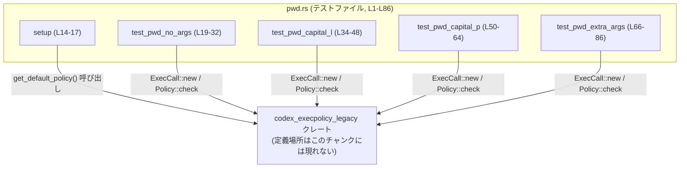
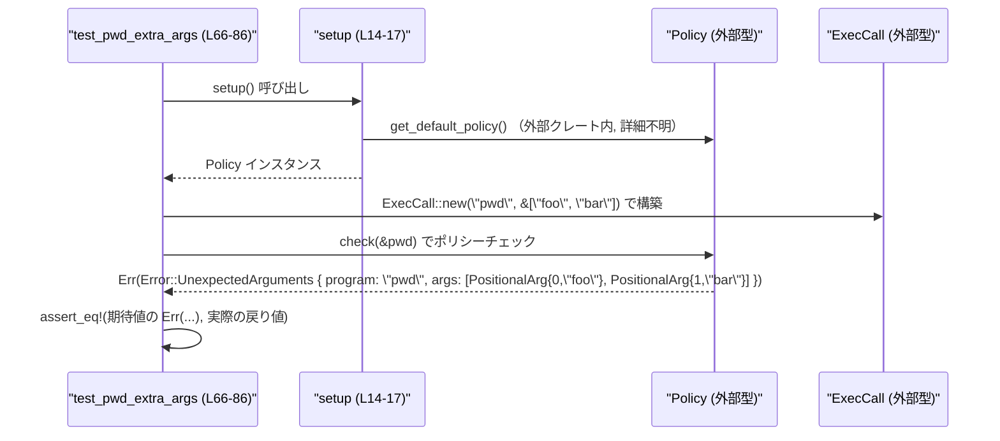

# execpolicy-legacy/tests/suite/pwd.rs コード解説

## 0. ざっくり一言

`pwd` コマンドに対して、デフォルト実行ポリシーがどう振る舞うか（許可される／拒否される引数）を検証する単体テスト群です（根拠: `#[test]` 付き関数群と `ExecCall::new("pwd", ...)` の使用, `pwd.rs:L19-L32`, `L34-L48`, `L50-L64`, `L66-L86`）。

---

## 1. このモジュールの役割

### 1.1 概要

- このモジュールは `codex_execpolicy_legacy` クレートが提供する実行ポリシー (`Policy`) に対し、`pwd` コマンドの扱いが想定通りかどうかをテストします（根拠: `use codex_execpolicy_legacy::Policy;`, `policy.check(&pwd)`, `pwd.rs:L9`, `L30`, `L46`, `L62`, `L84`）。
- 具体的には、  
  - 引数なしの `pwd` が許可されること、  
  - `-L` フラグ付き `pwd` が許可されること、  
  - `-P` フラグ付き `pwd` が許可されること、  
  - 余分な位置引数付き `pwd` が `UnexpectedArguments` エラーになること  
  を検証します（根拠: 各 `assert_eq!` の比較内容, `pwd.rs:L23-L31`, `L38-L47`, `L54-L63`, `L70-L85`）。

### 1.2 アーキテクチャ内での位置づけ

このファイルはテスト専用モジュールであり、`codex_execpolicy_legacy` クレートの公開 API を呼び出して動作を検証しています。

- 依存関係（このチャンクから読み取れる範囲）

  - 外部クレート `codex_execpolicy_legacy` に依存（根拠: `extern crate codex_execpolicy_legacy;`, `pwd.rs:L1`）。
  - そこから `Policy`, `ExecCall`, `MatchedExec`, `MatchedFlag`, `ValidExec`, `Error`, `PositionalArg`, `get_default_policy` を利用（根拠: `use` 群, `pwd.rs:L5-L12`）。
  - テスト用ヘルパー `setup()` が `get_default_policy()` を呼び出して `Policy` を構築（根拠: `pwd.rs:L14-L17`）。
  - 各 `test_*` 関数が `ExecCall::new("pwd", ...)` と `policy.check(&pwd)` を使って判定（根拠: `pwd.rs:L21-L22`, `L36-L37`, `L52-L53`, `L68-L69`）。

Mermaid 図で表すと次のようになります（ノード名に行番号を添えています）。



### 1.3 設計上のポイント

- テスト共通の初期化手順（`Policy` の取得）を `setup()` に切り出しています（根拠: `setup()` 定義と全テストからの呼び出し, `pwd.rs:L14-L17`, `L21`, `L36`, `L52`, `L68`）。
- `policy.check(&pwd)` の戻り値が `Result<MatchedExec, Error>` であることを前提に `Ok(...)` / `Err(...)` との比較で期待値を定義しています（根拠: `assert_eq!(Ok(...), policy.check(&pwd))`, `assert_eq!(Err(...), policy.check(&pwd))`, `pwd.rs:L23-L31`, `L38-L47`, `L54-L63`, `L70-L85`）。
- エラーケースでは、`Error::UnexpectedArguments` に余分な引数のインデックスと値を `PositionalArg` の配列として格納する契約をテストしています（根拠: `args: vec![ PositionalArg { index: 0, ... }, PositionalArg { index: 1, ... } ]`, `pwd.rs:L73-L82`）。
- Rust 特有の安全性・エラーハンドリング:
  - このファイルに `unsafe` ブロックはなく、すべて安全な Rust コードです（根拠: `unsafe` キーワードが存在しない）。
  - エラーは `Result` と `Error` 列挙体で表現され、テストでは `assert_eq!` で期待値と比較しています。
  - 非同期処理やスレッド並列処理は使用していません（`async`, `std::thread` 等が登場しないことから）。

---

## 2. 主要な機能一覧（コンポーネントインベントリー付き）

### 2.1 関数コンポーネント一覧

| 関数名 | 役割 / 機能概要 | 行範囲 |
|--------|----------------|--------|
| `setup` | デフォルトポリシーを取得するテスト用ヘルパー。失敗時は `expect` で panic。 | `pwd.rs:L14-L17` |
| `test_pwd_no_args` | 引数なしの `pwd` が有効な実行としてマッチすることを検証するテスト。 | `pwd.rs:L19-L32` |
| `test_pwd_capital_l` | `pwd -L` が有効であり、フラグ `-L` が `MatchedFlag` として認識されることを検証。 | `pwd.rs:L34-L48` |
| `test_pwd_capital_p` | `pwd -P` が有効であり、フラグ `-P` が `MatchedFlag` として認識されることを検証。 | `pwd.rs:L50-L64` |
| `test_pwd_extra_args` | `pwd foo bar` のような余分な位置引数がある場合に `Error::UnexpectedArguments` になることを検証。 | `pwd.rs:L66-L86` |

### 2.2 外部型・関数のコンポーネント一覧

このファイル内で利用しているが、定義は外部クレートにあるコンポーネントです。

| 名前 | 種別 | 役割 / 用途 | 使用箇所 (行) |
|------|------|-------------|----------------|
| `Policy` | 型（詳細不明、外部） | 実行ポリシーを表す型。`setup` の戻り値、および `check` メソッドのレシーバとして使用。 | `pwd.rs:L15`, `L21`, `L36`, `L52`, `L68` |
| `get_default_policy` | 関数（外部） | デフォルトの `Policy` を取得する。`Result` 互換の戻り値を返すと推測される（`.expect(...)` から）。 | `pwd.rs:L16` |
| `ExecCall` | 型（外部） | 実行しようとしているコマンドとその引数を表す。`ExecCall::new("pwd", &args)` で構築。 | `pwd.rs:L22`, `L37`, `L53`, `L69` |
| `MatchedExec` | 列挙体と思われる型（`Match` バリアントあり） | ポリシー判定の結果、許可された実行内容を表す。テストでは `MatchedExec::Match { exec: ValidExec { ... } }` を期待値として使用。 | `pwd.rs:L24`, `L39`, `L55` |
| `ValidExec` | 構造体 | 実際に許可されるコマンド実行内容（プログラム名、フラグ等）を表す。フィールド `program` と `flags` を持ち、`Default` を実装。 | `pwd.rs:L25-L27`, `L40-L43`, `L56-L59` |
| `MatchedFlag` | 型（外部） | フラグがポリシー上許可されたものとしてマッチしたことを表す。`MatchedFlag::new("-L")` のように生成。 | `pwd.rs:L42`, `L58` |
| `Error` | 列挙体 | ポリシー判定時のエラーを表現。ここでは `UnexpectedArguments` バリアントを使用。 | `pwd.rs:L71` |
| `PositionalArg` | 構造体 | 余分な位置引数のインデックスと値を持つ。`Error::UnexpectedArguments` の `args` フィールド要素として利用。 | `pwd.rs:L73-L81` |

※ 種別が「列挙体と思われる型」などと記載しているものは、構文（`Type::Variant { ... }`）から推測していますが、定義自体はこのチャンクには現れません。

### 2.3 主要な機能（テスト観点）

- `setup`: デフォルトポリシーをセットアップする共通初期化機能。
- `pwd`（引数なし）の許可判定: `Ok(MatchedExec::Match { ... })` となることを検証。
- `pwd -L` の許可判定と `-L` フラグのマッチ検証。
- `pwd -P` の許可判定と `-P` フラグのマッチ検証。
- 余分な位置引数付き `pwd` に対する `Error::UnexpectedArguments` 発生の検証。

---

## 3. 公開 API と詳細解説

このファイル自体はテスト用であり、外部に公開される API はありません。ここではテスト関数とヘルパー関数を「このモジュールが提供する機能」として整理します。

### 3.1 型一覧（このファイルで定義される型）

このファイル内で新たに定義されている型はありません（すべて外部クレートの型を利用, `pwd.rs:L1-L12`）。

### 3.2 関数詳細

#### `setup() -> Policy`

**概要**

デフォルトの実行ポリシーを取得するためのテスト用ヘルパー関数です。ポリシーの取得に失敗した場合は `expect` により panic します（根拠: `get_default_policy().expect("failed to load default policy")`, `pwd.rs:L16`）。

**引数**

なし。

**戻り値**

- `Policy`  
  実行ポリシーを表す型です（詳細は外部クレート側で定義, `pwd.rs:L15`）。

**内部処理の流れ**

1. `get_default_policy()` を呼び出してデフォルトポリシーの取得を試みる（`pwd.rs:L16`）。
2. 取得に失敗した場合（`Err` に相当する状態）は `.expect("failed to load default policy")` により panic する（`pwd.rs:L16`）。
3. 成功した場合の `Policy` インスタンスをそのまま返す（`pwd.rs:L16`）。

**Examples（使用例）**

このファイル内の全テストが `setup()` を利用しています。

```rust
let policy = setup(); // デフォルトポリシーを取得（pwd.rs:L21）
```

**エラー / パニック**

- `get_default_policy()` が失敗した場合、`expect("failed to load default policy")` により panic が発生します（根拠: `pwd.rs:L16`）。
- これはテストコードであり、起動環境でデフォルトポリシーがロードできない場合にテストを早期に失敗させるための挙動と解釈できます。

**エッジケース**

- デフォルトポリシーのロード失敗条件（設定ファイルの不在など）の詳細は、このチャンクには現れません。
- どのような環境依存要因があるかは外部クレートの実装次第です。

**使用上の注意点**

- アプリケーション本体での利用には `expect` ではなくエラーを呼び出し元へ返すべき状況も考えられますが、この関数はテスト専用であるため、ここでは panic ベースの実装になっています（`#[expect(clippy::expect_used)]` がそれを示唆, `pwd.rs:L14`）。

---

#### `test_pwd_no_args()`

```rust
fn test_pwd_no_args() { ... }
```

**概要**

`pwd` コマンドを引数なしで実行する場合に、ポリシーがそれを許可し、`MatchedExec::Match` として `ValidExec { program: "pwd", .. }` が返されることを検証します（根拠: `assert_eq!( Ok(MatchedExec::Match { exec: ValidExec { program: "pwd".into(), ..Default::default() } }), policy.check(&pwd))`, `pwd.rs:L23-L31`）。

**引数**

なし（`#[test]` 属性付きの標準的なテスト関数, `pwd.rs:L19-L20`）。

**戻り値**

- 暗黙に `()`（Rust のテスト関数の通常の形）。

**内部処理の流れ**

1. `setup()` を呼び出して `Policy` を取得する（`let policy = setup();`, `pwd.rs:L21`）。
2. `ExecCall::new("pwd", &[])` を呼び出し、コマンド名 `pwd` と引数なしを表す `ExecCall` を構築する（`pwd.rs:L22`）。
3. `policy.check(&pwd)` を呼び出し、ポリシー判定を実行する（`pwd.rs:L30`）。
4. 戻り値が `Ok(MatchedExec::Match { exec: ValidExec { program: "pwd".into(), ..Default::default() } })` と等しいことを `assert_eq!` で検証する（`pwd.rs:L23-L31`）。

**Examples（使用例）**

この関数自体が `ExecCall` と `Policy::check` の典型的な使用例になっています。

```rust
let policy = setup();                           // デフォルトポリシーを取得
let pwd = ExecCall::new("pwd", &[]);            // 引数なし pwd 呼び出しを表現
let result = policy.check(&pwd);                // ポリシーチェックを実行

assert_eq!(
    Ok(MatchedExec::Match {
        exec: ValidExec {
            program: "pwd".into(),
            ..Default::default()
        }
    }),
    result                                       // 結果が期待値と一致することを検証
);
```

**エラー / パニック**

- `setup()` 内の `get_default_policy().expect(...)` が失敗すると、このテストは panic します（`pwd.rs:L16`, `L21`）。
- `assert_eq!` が失敗した場合（戻り値が期待と異なる場合）も panic し、テストが失敗します（`pwd.rs:L23-L31`）。

**エッジケース**

- このテストは「引数が完全に空」のケースのみを扱います。`pwd` に別のフラグや引数が渡されたときの挙動は他のテストが扱います。
- `ExecCall::new("pwd", &[])` における、空スライスの扱いの詳細（内部表現など）は、このチャンクには現れません。

**使用上の注意点**

- `policy.check(&pwd)` は参照を受け取る形で呼び出されているため、`ExecCall` の所有権はテスト関数内に残ります（所有権移動は発生しない, `pwd.rs:L30`）。
- 実コードで同様のチェックを行う際も、`policy.check` の戻り値が `Ok(MatchedExec::Match { ... })` であることを前提にロジックを組む場合は、ポリシー設定変更による影響を受ける点に注意が必要です。

---

#### `test_pwd_capital_l()`

```rust
fn test_pwd_capital_l() { ... }
```

**概要**

`pwd -L` というコマンドラインがポリシーにより許可され、`ValidExec` の `flags` に `MatchedFlag::new("-L")` が含まれた形で `MatchedExec::Match` になることを検証します（根拠: `flags: vec![MatchedFlag::new("-L")]`, `pwd.rs:L42`）。

**内部処理の流れ**

1. `setup()` を呼び出し `Policy` を取得（`pwd.rs:L36`）。
2. `ExecCall::new("pwd", &["-L"])` で `pwd` に `-L` フラグを付けた呼び出しを構築（`pwd.rs:L37`）。
3. `policy.check(&pwd)` を実行（`pwd.rs:L46`）。
4. 戻り値が以下と等しいことを `assert_eq!` で検証（`pwd.rs:L38-L47`）:
   - `Ok(MatchedExec::Match { exec: ValidExec { program: "pwd".into(), flags: vec![MatchedFlag::new("-L")], ..Default::default() } })`

**Examples（使用例）**

```rust
let policy = setup();
let pwd = ExecCall::new("pwd", &["-L"]);           // -L フラグ付き
assert_eq!(
    Ok(MatchedExec::Match {
        exec: ValidExec {
            program: "pwd".into(),
            flags: vec![MatchedFlag::new("-L")],   // 許可されたフラグとしてマッチ
            ..Default::default()
        }
    }),
    policy.check(&pwd)
);
```

**エラー / パニック**

- `setup()` の失敗や `assert_eq!` の不一致で panic しうる点は、`test_pwd_no_args` と同様です。

**エッジケース**

- `-L` 以外のフラグ（例えば `-l` や `--logical` など）の扱いは、このテストからは分かりません。このファイルは `-L` が特に許可されることのみを確認しています。
- 複数フラグ（例: `pwd -L -P`）の扱いはこのチャンクには現れません。

**使用上の注意点**

- `flags` は `Vec<MatchedFlag>` として表現されていることが推測されます（根拠: `vec![MatchedFlag::new("-L")]`, `pwd.rs:L42`）。
- 追加のフラグを許可したい／禁止したい場合は、ポリシー定義側（外部クレート）を変更し、対応するテストを追加するのが自然な流れです。

---

#### `test_pwd_capital_p()`

`test_pwd_capital_l()` とほぼ対称的に、`-P` フラグを検証するテストです。

**概要**

`pwd -P` が許可され、`flags` に `MatchedFlag::new("-P")` が入った `MatchedExec::Match` が返ることを確認します（根拠: `flags: vec![MatchedFlag::new("-P")]`, `pwd.rs:L58`）。

**内部処理の流れ**

1. `setup()` で `Policy` を取得（`pwd.rs:L52`）。
2. `ExecCall::new("pwd", &["-P"])` を構築（`pwd.rs:L53`）。
3. `policy.check(&pwd)` を実行（`pwd.rs:L62`）。
4. 期待値 `Ok(MatchedExec::Match { exec: ValidExec { program: "pwd".into(), flags: vec![MatchedFlag::new("-P")], ..Default::default() } })` と一致するか `assert_eq!` で検証（`pwd.rs:L54-L63`）。

**Examples（使用例）**

```rust
let policy = setup();
let pwd = ExecCall::new("pwd", &["-P"]);
assert_eq!(
    Ok(MatchedExec::Match {
        exec: ValidExec {
            program: "pwd".into(),
            flags: vec![MatchedFlag::new("-P")],
            ..Default::default()
        }
    }),
    policy.check(&pwd)
);
```

**エラー / パニック / エッジケース**

- `test_pwd_capital_l()` と同様です。ここでは `-P` という一つのフラグパターンのみを確認しています。

---

#### `test_pwd_extra_args()`

```rust
fn test_pwd_extra_args() { ... }
```

**概要**

`pwd` に余分な位置引数が付いた場合（例: `pwd foo bar`）、ポリシーがその呼び出しを拒否し、`Error::UnexpectedArguments { program: "pwd".to_string(), args: [...] }` が返ることを検証するテストです（根拠: `assert_eq!( Err(Error::UnexpectedArguments { ... }), policy.check(&pwd))`, `pwd.rs:L70-L85`）。

**内部処理の流れ**

1. `setup()` で `Policy` を取得（`pwd.rs:L68`）。
2. `ExecCall::new("pwd", &["foo", "bar"])` を構築（`pwd.rs:L69`）。
3. `policy.check(&pwd)` を実行（`pwd.rs:L84`）。
4. 戻り値が次のエラー値と等しいことを `assert_eq!` で確認（`pwd.rs:L70-L83`）:
   - `Err(Error::UnexpectedArguments { program: "pwd".to_string(), args: vec![ PositionalArg { index: 0, value: "foo".to_string() }, PositionalArg { index: 1, value: "bar".to_string() } ] })`

**Examples（使用例）**

```rust
let policy = setup();
let pwd = ExecCall::new("pwd", &["foo", "bar"]);    // 余分な位置引数を2つ付与
assert_eq!(
    Err(Error::UnexpectedArguments {
        program: "pwd".to_string(),                 // エラー対象のプログラム名
        args: vec![
            PositionalArg {
                index: 0,
                value: "foo".to_string()
            },
            PositionalArg {
                index: 1,
                value: "bar".to_string()
            },
        ],
    }),
    policy.check(&pwd)
);
```

**エラー / パニック**

- 正常系としては `policy.check` が `Err(...)` を返すことを期待するテストです。
- 期待した `Err(...)` ではなく `Ok(...)` や別の `Err` バリアントが返った場合、`assert_eq!` が panic してテストが失敗します（`pwd.rs:L70-L85`）。
- `setup()` の段階での panic の可能性も他のテストと同様です。

**エッジケース（契約の読み取り）**

このテストから読み取れる契約は次の通りです。

- `pwd` コマンドに対し、位置引数 `"foo"`, `"bar"` が余分なものとして扱われる（`pwd.rs:L69-L69`）。
- 余分な位置引数は `PositionalArg { index, value }` のリストとしてエラーに含まれる（`pwd.rs:L73-L81`）。
  - インデックスは 0 から始まっており、コマンドライン引数の順序を反映していると考えられます。
- `Error::UnexpectedArguments` には少なくとも `program` と `args` フィールドがあることが分かります（`pwd.rs:L71-L72`）。

**使用上の注意点**

- `UnexpectedArguments` が返される条件は、「ポリシーで許可されていない位置引数が付与されている場合」と解釈できますが、どの引数が「許可」なのかの詳細はこのチャンクには現れません。
- 他のコマンドでも同様の契約（余分な位置引数を `PositionalArg` として列挙する）を利用している可能性がありますが、ここからは断定できません。

---

### 3.3 その他の関数

このファイルには、上記 5 つ以外の関数は定義されていません。

---

## 4. データフロー

ここでは代表的なシナリオとして、`test_pwd_extra_args` におけるデータの流れを説明します（`pwd.rs:L66-L86`）。

### 4.1 処理の要点

1. テスト関数 `test_pwd_extra_args` が実行されると、まず `setup()` を呼び出して `Policy` インスタンスを取得します（`pwd.rs:L68`）。
2. 次に、コマンドライン `pwd foo bar` に対応する `ExecCall` を `ExecCall::new("pwd", &["foo", "bar"])` で構築します（`pwd.rs:L69`）。
3. `policy.check(&pwd)` を呼び出し、余分な位置引数が許可されるかどうかをポリシーに問い合わせます（`pwd.rs:L84`）。
4. その結果として `Err(Error::UnexpectedArguments { ... })` が返ることを期待し、`assert_eq!` で確認します（`pwd.rs:L70-L85`）。

### 4.2 シーケンス図

このチャンク内コードのみを対象に、シーケンス図で表現します。



※ `Policy` と `ExecCall` の内部実装や `check` の内部ロジックはこのチャンクには現れないため、図では「外部型」として扱っています。

---

## 5. 使い方（How to Use）

### 5.1 基本的な使用方法

このファイルのテストは、そのまま `codex_execpolicy_legacy` クレートの利用例になっています。`pwd` コマンドに対してポリシー判定を行う基本的な手順は以下のようになります（テストコードから抽出, `pwd.rs:L21-L22`, `L30`）。

```rust
use codex_execpolicy_legacy::{
    ExecCall,
    MatchedExec,
    Policy,
    ValidExec,
    get_default_policy,
};

fn example_check_pwd() {
    // デフォルトポリシーを取得する（失敗時は panic）
    let policy: Policy =
        get_default_policy().expect("failed to load default policy"); // pwd.rs:L16 と同じパターン

    // 引数なしの pwd 呼び出しを表現する ExecCall を構築
    let pwd = ExecCall::new("pwd", &[]);                               // pwd.rs:L22

    // ポリシーチェックを実行
    let result = policy.check(&pwd);                                   // pwd.rs:L30

    // 期待されるマッチ結果と比較
    assert_eq!(
        Ok(MatchedExec::Match {
            exec: ValidExec {
                program: "pwd".into(),
                ..Default::default()
            }
        }),
        result
    );
}
```

この例は `test_pwd_no_args` の本質部分を関数化したもので、`ExecCall::new` と `Policy::check` の組み合わせ方を示しています。

### 5.2 よくある使用パターン

このテストファイルから読み取れる代表的なパターンは次の 2 種類です。

1. **許可されるフラグ付き呼び出しの検証**

   - `pwd -L` / `pwd -P` のように、特定のフラグのみが許可されるケース。
   - パターン:

   ```rust
   let policy = setup();
   let pwd = ExecCall::new("pwd", &["-L"]);          // または &["-P"]
   let expected = Ok(MatchedExec::Match {
       exec: ValidExec {
           program: "pwd".into(),
           flags: vec![MatchedFlag::new("-L")],       // または "-P"
           ..Default::default()
       }
   });
   assert_eq!(expected, policy.check(&pwd));
   ```

2. **余分な位置引数に対するエラーの検証**

   - `pwd foo bar` のように、本来不要な引数が付いているケース。
   - パターンは `test_pwd_extra_args` のとおりです（`pwd.rs:L66-L86`）。

### 5.3 よくある間違い（想定しうる誤用）

コードから推測できる範囲で、誤用になりそうなケースを挙げます。

```rust
// 誤りの例 (想定):
// 余分な引数を許可されているものと誤解している
let pwd = ExecCall::new("pwd", &["foo", "bar"]);
let result = policy.check(&pwd);
// ここで Ok(...) を前提として処理を進めると、UnexpectedArguments エラーが返る契約と矛盾する
```

```rust
// 正しい扱いの例 (テストが示す契約に沿う):
let pwd = ExecCall::new("pwd", &["foo", "bar"]);
match policy.check(&pwd) {
    Err(Error::UnexpectedArguments { program, args }) => {
        // 余分な引数があることをユーザーに通知する、など
        // program や args の使い方はこのチャンクからは詳細不明
    }
    other => {
        // 他のケース (許可される、または別種のエラー) を処理
    }
}
```

※ 実際にどの引数が「余分」なのか、どのフラグが「許可」されるのかは、ポリシー設定と外部クレートの実装に依存し、このチャンクだけでは完全には分かりません。

### 5.4 使用上の注意点（まとめ）

- `get_default_policy()` の失敗時に panic するため、テスト環境ではデフォルトポリシーが正しくロードできる前提が必要です。
- `Policy::check` の戻り値は `Result<MatchedExec, Error>` 互換であると読み取れますが、型定義はこのチャンクには現れません。
- エラーパターン `Error::UnexpectedArguments` には余分な引数情報が `PositionalArg` ベクタとして含まれる契約がありそうですが、全バリアントや他のエラー条件は不明です。
- 非同期・並行性は利用しておらず、すべてシングルスレッド・同期的なチェックです。

---

## 6. 変更の仕方（How to Modify）

### 6.1 新しい機能（テストケース）を追加する場合

このファイルは `pwd` コマンドに特化したテストです。`pwd` に関する新たな振る舞いをポリシーに追加した場合、その検証用テストを増やす際の典型的な手順は以下のようになります。

1. **どの引数パターンをテストしたいかを決める**  
   例: `pwd -L -P` や `pwd --version` など（実際に許可されるかどうかはポリシー設定によるため、このチャンクからは不明）。

2. **新しいテスト関数を追加**  
   - `#[test]` 属性を付与し、`setup()`, `ExecCall::new`, `policy.check` を使う流れを既存テストに倣って記述します。

   ```rust
   #[test]
   fn test_pwd_some_new_pattern() {
       let policy = setup();
       let pwd = ExecCall::new("pwd", &["--some-flag"]);
       // 期待する Ok / Err の形に応じて assert_eq! を構成
       // 具体的な期待値はポリシー変更内容に依存
   }
   ```

3. **期待される戻り値を明示的に記述**  
   - 許可されるケース: `Ok(MatchedExec::Match { exec: ValidExec { ... } })`
   - 拒否されるケース: `Err(Error::SomeVariant { ... })`  
   など、他のテストと同様に完全な構造を比較対象として書きます。

### 6.2 既存の機能（テスト）を変更する場合

- **影響範囲の確認方法**
  - `pwd` コマンドに関するポリシー変更が行われた場合、このファイルのすべての `test_pwd_*` 関数が影響を受ける可能性があります（`pwd.rs:L19-L32`, `L34-L48`, `L50-L64`, `L66-L86`）。
  - 例えば、`pwd` に対して位置引数を許可するようにポリシーを変更した場合、`test_pwd_extra_args` の期待値（`Err(Error::UnexpectedArguments { ... })`）は見直しが必要です。

- **注意すべき契約**
  - `Error::UnexpectedArguments` の形（`program`, `args`）や、`ValidExec` の `program`/`flags` フィールドの意味は、テストとポリシー実装との間の契約になっています。
  - フィールド名や構造を変えると、ここでのパターンマッチ（構造体初期化式）に影響します。

- **テストの再確認**
  - ポリシー定義や `Policy::check` の実装を変更した場合は、このファイルのテストを実行して、`pwd` に関する挙動が期待通りかどうかを確認する必要があります。
  - 他コマンド向けのテストがある場合（このチャンクには現れませんが）、そちらも合わせて確認することが望まれます。

---

## 7. 関連ファイル

このモジュールと密接に関係するコンポーネント（このチャンクから参照が分かるもの）は以下の通りです。

| パス / コンポーネント | 役割 / 関係 |
|-----------------------|------------|
| `codex_execpolicy_legacy::Policy` および関連型・関数 | 実行ポリシーとそのチェックロジックの本体。`Error`, `ExecCall`, `MatchedExec`, `MatchedFlag`, `ValidExec`, `PositionalArg`, `get_default_policy` などがここで定義されていると考えられます（`pwd.rs:L1-L12`）。具体的なファイルパスはこのチャンクには現れません。 |
| `execpolicy-legacy/tests/suite/pwd.rs`（本ファイル） | `pwd` コマンドに関するポリシー挙動を検証するテスト。 |

このファイル単体からは、他のコマンド用テストやポリシー定義ファイルの正確な場所までは分かりませんが、`codex_execpolicy_legacy` クレート内の実装がすべてのテストの根拠となっています。
