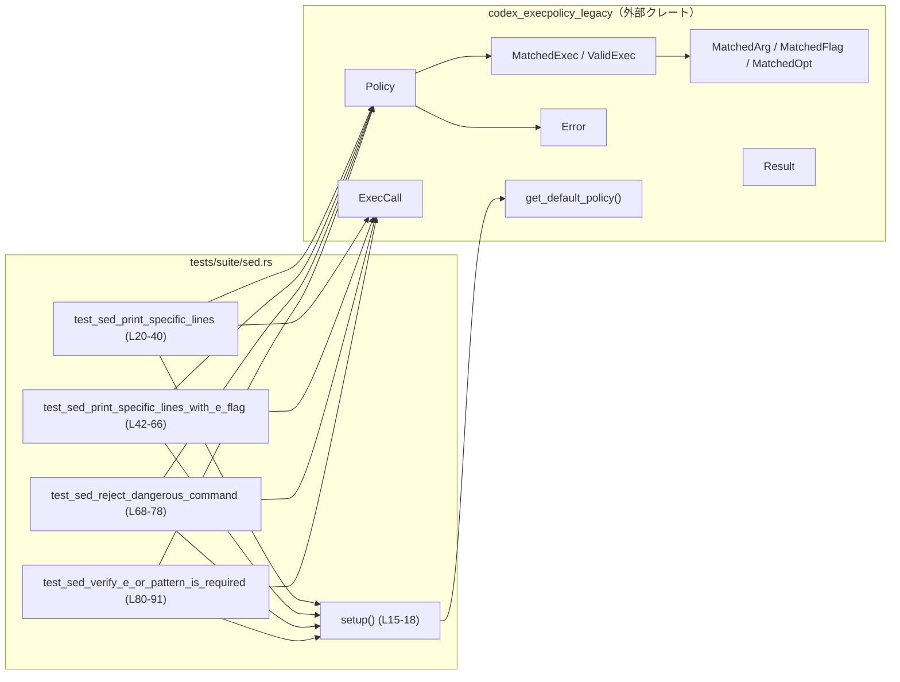
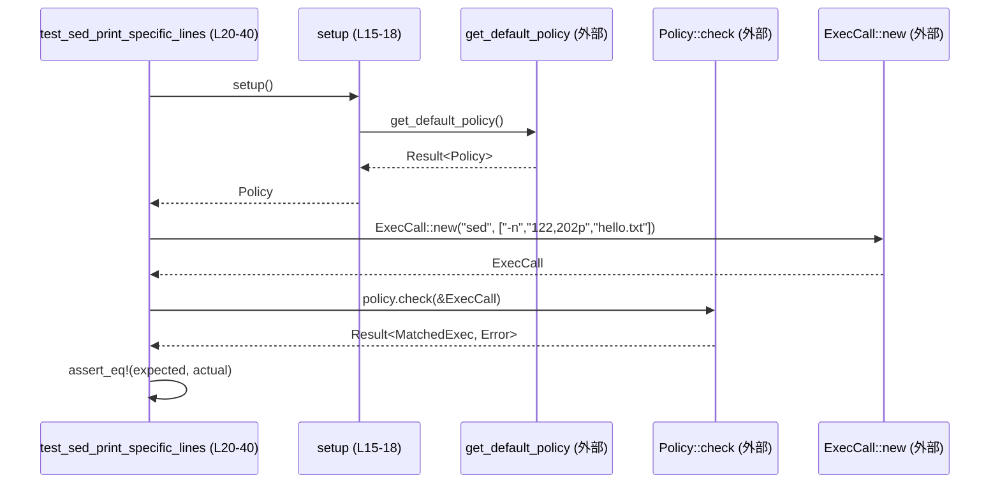

# execpolicy-legacy/tests/suite/sed.rs

## 0. ざっくり一言

`sed` コマンドに対する実行ポリシー（`codex_execpolicy_legacy` クレート）の挙動を検証するテストファイルです。  
安全な `sed` コマンドが許可され、危険なものや必須オプション不足のものが拒否されることを確認します（`execpolicy-legacy/tests/suite/sed.rs:L20-90`）。

---

## 1. このモジュールの役割

### 1.1 概要

- このテストモジュールは、`codex_execpolicy_legacy` の **デフォルトポリシー** が `sed` コマンドをどのように判定するかを検証します（`sed.rs:L3-13`）。
- 具体的には、`sed` の
  - 行指定出力（`122,202p`）が安全とみなされるケース
  - `-e` オプションを伴うスクリプトが安全とみなされるケース
  - 外部コマンド実行を含む可能性のあるスクリプトが拒否されるケース
  - 必須オプションが不足している呼び出しが拒否されるケース  
  をテストしています（`sed.rs:L20-90`）。

### 1.2 アーキテクチャ内での位置づけ

このファイルは **テストコード** であり、本体クレート `codex_execpolicy_legacy` の公開 API を呼び出す側です。

- 依存している主なコンポーネント:
  - `get_default_policy`：デフォルトポリシーを取得（`sed.rs:L13,16-17`）
  - `Policy`：ポリシーオブジェクト。`check` メソッドでコマンドを評価（`sed.rs:L16,22,44,70,82`）
  - `ExecCall`：評価対象コマンド（`sed`) の呼び出しを表現（`sed.rs:L23,45,71,83`）
  - `MatchedExec` / `ValidExec` / `MatchedFlag` / `MatchedOpt` / `MatchedArg`：`check` の結果（マッチ成功時の詳細）を表現（`sed.rs:L24-37,46-63`）
  - `Error`：`check` のエラー理由を表現（`sed.rs:L73-75,85-88`）
  - `Result`：クレート固有の `Result<T>` 型エイリアス（`sed.rs:L11,21,43,81`）

依存関係のイメージです。



### 1.3 設計上のポイント

- **テスト専用のヘルパー `setup`**  
  - 毎回 `get_default_policy` を呼ぶ処理を共通化しています（`sed.rs:L15-18`）。
  - `expect` によるパニックを許容するため `#[expect(clippy::expect_used)]` 属性が付いています（`sed.rs:L15`）。テストなので妥当な方針です。
- **`Result<()>` を返すテスト関数**  
  - 一部のテストは `Result<()>` を返し、`MatchedArg::new` などが `Result` を返す前提で `?` 演算子を利用しています（`sed.rs:L21,30-31,43,55-59`）。
- **詳細な期待値構築による契約の明示**  
  - 許可されるケースでは `ValidExec` 構造体を明示的に構築し、フラグ・オプション・引数の型と位置を厳密に検証しています（`sed.rs:L24-37,46-63`）。
- **安全性に関する明示的なエラー**  
  - 危険な `sed` スクリプトに対しては `Error::SedCommandNotProvablySafe` が返ることを確認しており、セキュリティ上の目的が明確です（`sed.rs:L73-75`）。
  - 必須オプション不足には `Error::MissingRequiredOptions` が返ることを確認しています（`sed.rs:L85-88`）。

---

## 2. 主要な機能一覧

このファイル内の主要な「機能」（関数／テストケース）は次の通りです。

- `setup`: デフォルトの `Policy` を取得するテスト用ヘルパー（`sed.rs:L15-18`）
- `test_sed_print_specific_lines`: `sed -n '122,202p' hello.txt` が安全にマッチすることを確認（`sed.rs:L20-40`）
- `test_sed_print_specific_lines_with_e_flag`: `sed -n -e '122,202p' hello.txt` が安全にマッチすることを確認（`sed.rs:L42-66`）
- `test_sed_reject_dangerous_command`: `sed -e 's/y/echo hi/e' hello.txt` が危険として拒否されることを確認（`sed.rs:L68-78`）
- `test_sed_verify_e_or_pattern_is_required`: `sed '122,202p'` のように必須オプションが不足した場合にエラーになることを確認（`sed.rs:L80-91`）

---

## 3. 公開 API と詳細解説

### 3.1 型一覧（このファイルで使用している主な型）

このファイル自身は型を定義していませんが、外部クレートから多くの型を利用しています。

| 名前 | 種別 | 役割 / 用途（このファイルから読み取れる範囲） | 根拠 |
|------|------|----------------------------------------------|------|
| `Policy` | 構造体（推定） | 実行ポリシーを表し、`check(&ExecCall)` メソッドでコマンドを評価します。 | `sed.rs:L10,16,22,44,70,82` |
| `ExecCall` | 構造体（推定） | 評価対象となるコマンド呼び出し (`"sed"` と引数列) を表します。 | `sed.rs:L5,23,45,71,83` |
| `MatchedExec` | 列挙体（推定） | `Policy::check` が返すマッチ結果であり、少なくとも `Match { exec: ValidExec }` というバリアントを持ちます。 | `sed.rs:L7,24-27,47-49` |
| `ValidExec` | 構造体（推定） | マッチしたコマンドの詳細（プログラム名、フラグ、オプション、引数、システムパスなど）を保持します。 | `sed.rs:L12,26-34,48-60` |
| `MatchedFlag` | 構造体（推定） | マッチしたフラグ（引数を取らないオプション）を表します。ここでは `-n` を扱います。 | `sed.rs:L8,28,50` |
| `MatchedOpt` | 構造体（推定） | 値をとるオプション（ここでは `-e`）とその値、値の型を表します。 | `sed.rs:L9,51-53` |
| `MatchedArg` | 構造体（推定） | 位置引数とその型（`SedCommand` や `ReadableFile`）を表します。 | `sed.rs:L6,29-31,55-59` |
| `ArgType` | 列挙体（推定） | 引数の意味を分類する型。ここでは `SedCommand` と `ReadableFile` が使用されています。 | `sed.rs:L3,30-31,52,57` |
| `Error` | 列挙体（推定） | ポリシー評価のエラー種別。少なくとも `SedCommandNotProvablySafe` と `MissingRequiredOptions` を持ちます。 | `sed.rs:L4,73-75,85-88` |
| `Result<T>` | 型エイリアス（推定） | クレート固有の `Result<T, E>` 型。テスト関数や `MatchedArg::new` で利用されます。 | `sed.rs:L11,21,30-31,43,55-59,81` |

> これらの型の内部実装やフィールド構成は、このチャンクからは分かりません。

### 3.2 関数詳細（5件）

#### `setup() -> Policy`

**概要**

- デフォルトのポリシー (`Policy`) を取得するテスト用ヘルパーです（`sed.rs:L15-18`）。
- 取得に失敗した場合はパニックします。

**定義位置**

- `execpolicy-legacy/tests/suite/sed.rs:L15-18`

**引数**

- なし

**戻り値**

- `Policy`: `get_default_policy()` が返すポリシーオブジェクトをそのまま返します（`sed.rs:L16-17`）。

**内部処理の流れ**

1. `get_default_policy()` を呼び出し、`Result<Policy>` を取得する（`sed.rs:L16`）。
2. `expect("failed to load default policy")` で成功値を取り出す。失敗時はテストをパニックで終了する（`sed.rs:L16-17`）。

**Errors / Panics**

- `get_default_policy()` が `Err` を返した場合、`expect` によりパニックします（`sed.rs:L16-17`）。
- これはテスト用コードのため、起動環境の不備を早期に発見する意図と解釈できます。

**Edge cases（エッジケース）**

- デフォルトポリシーのロードに失敗するケースは、このファイルではテストされていません。
- テスト全体がこの関数を経由するため、ここでのパニックはすべての `sed` 関連テストを中断します。

**使用上の注意点**

- 実運用コードでは `expect` ではなくエラー処理すべきですが、この関数はテスト専用であり、その前提で設計されています。

---

#### `test_sed_print_specific_lines() -> Result<()>`

**概要**

- コマンド `sed -n '122,202p' hello.txt` がポリシーにより **安全なコマンドとしてマッチ** することを検証します（`sed.rs:L20-40`）。

**定義位置**

- `execpolicy-legacy/tests/suite/sed.rs:L20-40`

**引数**

- なし（Rust のテストフレームワークが呼び出します）

**戻り値**

- `Result<()>`：`MatchedArg::new` が返す `Result` を `?` で伝播するために使用しています（`sed.rs:L21,30-31`）。

**内部処理の流れ**

1. `setup()` でポリシーを取得する（`sed.rs:L22`）。
2. `ExecCall::new("sed", &["-n", "122,202p", "hello.txt"])` で `sed` 呼び出しを表すオブジェクトを作成する（`sed.rs:L23`）。
3. 期待される `MatchedExec::Match` 値を構築する（`sed.rs:L24-35`）。
   - `program: "sed"`（`sed.rs:L27`）
   - `flags` に `MatchedFlag::new("-n")`（`sed.rs:L28`）
   - `args` に
     - インデックス1: `ArgType::SedCommand` として `"122,202p"`（`sed.rs:L30`）
     - インデックス2: `ArgType::ReadableFile` として `"hello.txt"`（`sed.rs:L31`）
   - `system_path` に `"/usr/bin/sed"`（`sed.rs:L33`）
   - その他のフィールドは `Default::default()`（`sed.rs:L34`）
4. `policy.check(&sed)` の結果と期待値を `assert_eq!` で比較する（`sed.rs:L24-38`）。
5. 最後に `Ok(())` を返す（`sed.rs:L39`）。

**Examples（使用例）**

テストとほぼ同じですが、最小限にした例です。

```rust
use codex_execpolicy_legacy::{
    get_default_policy, ExecCall, MatchedExec, MatchedFlag, MatchedArg,
    ArgType, ValidExec, Result,
};

fn example() -> Result<()> {
    let policy = get_default_policy()?; // デフォルトポリシー取得
    let sed = ExecCall::new("sed", &["-n", "122,202p", "hello.txt"]);

    let expected = MatchedExec::Match {
        exec: ValidExec {
            program: "sed".to_string(),
            flags: vec![MatchedFlag::new("-n")],
            args: vec![
                MatchedArg::new(1, ArgType::SedCommand, "122,202p")?,
                MatchedArg::new(2, ArgType::ReadableFile, "hello.txt")?,
            ],
            system_path: vec!["/usr/bin/sed".to_string()],
            ..Default::default()
        },
    };

    let actual = policy.check(&sed)?;
    assert_eq!(expected, actual);
    Ok(())
}
```

※ 実際のシグネチャやエラー型はこのテストからの推定です。

**Errors / Panics**

- `MatchedArg::new` が `Err` を返した場合、`?` によりテスト関数は `Err` を返し、テストは失敗扱いになります（`sed.rs:L30-31`）。
- `policy.check(&sed)` が期待した `Ok(MatchedExec::Match{..})` 以外の値を返すと `assert_eq!` でパニックします（`sed.rs:L24-38`）。

**Edge cases（エッジケース）**

- 行指定 `"122,202p"` が `ArgType::SedCommand` として受理されることが暗黙の前提になっています（`sed.rs:L30`）。
- ファイル `"hello.txt"` は `ReadableFile` として扱われますが、実在チェックの有無はこのファイルからは分かりません（`sed.rs:L31`）。

**使用上の注意点**

- `MatchedArg` のインデックスが 1, 2 と **1始まり**である点が契約として表現されています（`sed.rs:L30-31`）。
- `system_path` に `"/usr/bin/sed"` を期待しており、ポリシーがこのパスを返す前提になっています（`sed.rs:L33`）。環境依存かどうかは本チャンクからは不明です。

---

#### `test_sed_print_specific_lines_with_e_flag() -> Result<()>`

**概要**

- `sed -n -e '122,202p' hello.txt` のように `-e` オプションを用いた場合でも安全なコマンドとしてマッチすることを検証します（`sed.rs:L42-66`）。

**定義位置**

- `execpolicy-legacy/tests/suite/sed.rs:L42-66`

**戻り値**

- `Result<()>`：`MatchedArg::new` が返す `Result` を `?` で扱うためです（`sed.rs:L43,55-59`）。

**内部処理の流れ**

1. `setup()` でポリシーを取得（`sed.rs:L44`）。
2. `ExecCall::new("sed", &["-n", "-e", "122,202p", "hello.txt"])` を作成（`sed.rs:L45`）。
3. 期待される `MatchedExec::Match` を構築（`sed.rs:L46-61`）。
   - `program: "sed"`（`sed.rs:L49`）
   - `flags`: `vec![MatchedFlag::new("-n")]`（`sed.rs:L50`）
   - `opts`: `vec![MatchedOpt::new("-e", "122,202p", ArgType::SedCommand)?]`（`sed.rs:L51-53`）
   - `args`: インデックス3に `ReadableFile` として `"hello.txt"`（`sed.rs:L55-59`）
   - `system_path`: `"/usr/bin/sed"`（`sed.rs:L60`）
4. `policy.check(&sed)` の結果と期待値を `assert_eq!` で比較（`sed.rs:L46-63`）。
5. `Ok(())` を返す（`sed.rs:L65`）。

**Errors / Panics**

- `MatchedOpt::new` が `Err` の場合、`.expect("should validate")` によりパニックします（`sed.rs:L52-53`）。
- `MatchedArg::new` が `Err` の場合、`?` によりテストが `Err` を返します（`sed.rs:L55-59`）。
- `policy.check(&sed)` の結果が期待値と異なると `assert_eq!` でパニックします（`sed.rs:L46-63`）。

**Edge cases（エッジケース）**

- `-e` オプションがある場合、`SedCommand` はオプション値として扱われ、位置引数のインデックスは 3 から始まることが契約として表現されています（`sed.rs:L45,52,55-59`）。
- `MatchedOpt::new` の検証に失敗するケースはテストされていませんが、`.expect("should validate")` のメッセージから「この場面では必ず成功する想定」であることが分かります（`sed.rs:L52-53`）。

**使用上の注意点**

- `-n` は単なるフラグ、`-e` は値を取るオプションとして区別されています（`sed.rs:L50-53`）。
- `args` に格納するインデックス番号を、実際のコマンドライン上の位置と合わせる必要があります（`sed.rs:L55-59`）。

---

#### `test_sed_reject_dangerous_command()`

**概要**

- `sed -e 's/y/echo hi/e' hello.txt` のように、危険とみなされる `sed` コマンドがポリシーにより拒否されることを検証します（`sed.rs:L68-78`）。

**定義位置**

- `execpolicy-legacy/tests/suite/sed.rs:L68-78`

**戻り値**

- `()`：`Result` を返さず、単純なテスト関数です。

**内部処理の流れ**

1. `setup()` でポリシーを取得（`sed.rs:L70`）。
2. `ExecCall::new("sed", &["-e", "s/y/echo hi/e", "hello.txt"])` を作成（`sed.rs:L71`）。
3. `policy.check(&sed)` の結果が  
   `Err(Error::SedCommandNotProvablySafe { command: "s/y/echo hi/e".to_string() })`  
   と等しいことを `assert_eq!` で検証（`sed.rs:L72-76`）。

**Errors / Panics**

- `policy.check(&sed)` が他のエラー、あるいは `Ok` を返した場合には `assert_eq!` によりパニックします（`sed.rs:L72-77`）。

**Edge cases（エッジケース）**

- エラーバリアント `SedCommandNotProvablySafe` は、少なくとも `command: String` フィールドを持ち、問題となる `sed` コマンド文字列が格納されることがテストから分かります（`sed.rs:L73-75`）。
- このテストは「危険なスクリプトが `Ok` になること」を防ぐための回帰テストとして機能します。

**セキュリティ上の意味**

- 一般に `sed` の `s///e` のような構文は置換結果を外部コマンドとして実行できるため、入力に依存するとコマンドインジェクションのリスクがあります。
- テスト名とエラー名から、このような外部コマンド実行につながる `sed` コマンドを「証明可能に安全ではない」として拒否する設計意図が読み取れます（`sed.rs:L68-69,73-75`）。

---

#### `test_sed_verify_e_or_pattern_is_required()`

**概要**

- `sed '122,202p'` のように、必須とされるオプション（ここでは `-e`）なしでコマンドが呼び出された場合にエラーになることを検証します（`sed.rs:L80-91`）。

**定義位置**

- `execpolicy-legacy/tests/suite/sed.rs:L80-91`

**戻り値**

- `Result<()>`：`?` は使っていませんが、他のテストとインターフェイスを揃える意図が考えられます（`sed.rs:L81`）。

**内部処理の流れ**

1. `setup()` でポリシーを取得（`sed.rs:L82`）。
2. `ExecCall::new("sed", &["122,202p"])` を作成（`sed.rs:L83`）。
3. `policy.check(&sed)` の結果が  
   `Err(Error::MissingRequiredOptions { program: "sed".to_string(), options: vec!["-e".to_string()] })`  
   と等しいことを `assert_eq!` で検証（`sed.rs:L84-89`）。
4. `Ok(())` を返す（`sed.rs:L90`）。

**Errors / Panics**

- `policy.check(&sed)` の結果が期待した `Error::MissingRequiredOptions` でない場合、`assert_eq!` でパニックします（`sed.rs:L84-89`）。

**Edge cases（エッジケース）**

- エラーバリアント `MissingRequiredOptions` は、少なくとも
  - `program: String`
  - `options: Vec<String>`
  を持つことが分かります（`sed.rs:L85-88`）。
- `options` に `" -e "` だけが入っているため、このテストからは「`sed` コマンドには `-e` オプションが必須」という契約が読み取れます（`sed.rs:L85-88`）。
  - 関数名には "e_or_pattern" という表現がありますが、コード上の契約としては `-e` が要求されていることのみが確認できます（`sed.rs:L80-81,85-88`）。

**使用上の注意点**

- `ExecCall` を構築する際、「見かけ上一見安全そうなコマンド（`122,202p`）であっても、ポリシー上の必須オプションが不足している場合にはエラーになる」という契約が存在します（`sed.rs:L83-88`）。

---

### 3.3 その他の関数

このファイルには上記以外の関数はありません。

---

## 4. データフロー

### 4.1 代表的な処理シナリオ

典型的なテスト（`test_sed_print_specific_lines`）におけるデータの流れは次のとおりです（`sed.rs:L20-40`）。

1. テスト関数が `setup()` を呼び出し、`Policy` を取得します（`sed.rs:L22`）。
2. `ExecCall::new("sed", &["-n", "122,202p", "hello.txt"])` で `sed` コマンド呼び出しを表現するオブジェクトを作成します（`sed.rs:L23`）。
3. テスト側で期待する `MatchedExec::Match { exec: ValidExec { ... } }` を構築します（`sed.rs:L24-35`）。
4. `policy.check(&sed)` を呼び出し、`Result<MatchedExec, Error>` を受け取ります（`sed.rs:L37`）。
5. 期待値と実際の結果を `assert_eq!` で比較します（`sed.rs:L24-38`）。

### 4.2 シーケンス図



> `get_default_policy`, `Policy::check`, `ExecCall::new` の内部処理はこのチャンクには現れないため不明です。

---

## 5. 使い方（How to Use）

### 5.1 基本的な使用方法

このファイルはテストですが、`sed` コマンドを評価する基本フローは以下のように一般化できます。

```rust
use codex_execpolicy_legacy::{
    get_default_policy, ExecCall, Result, MatchedExec,
};

fn validate_sed_example() -> Result<()> {
    // デフォルトポリシーを取得する
    let policy = get_default_policy()?; // sed.rs:L16 を元にした利用例

    // 評価したい sed コマンドを ExecCall として構築する
    let sed = ExecCall::new("sed", &["-n", "122,202p", "hello.txt"]); // sed.rs:L23

    // ポリシーに照らして評価する
    let result = policy.check(&sed); // sed.rs:L37

    match result {
        Ok(MatchedExec::Match { exec }) => {
            // 安全と判断されたケース
            // exec.flags, exec.args などで詳細にアクセスできる（構造は sed.rs:L26-34 を参照）
            println!("sed call is allowed: {:?}", exec);
        }
        Ok(_) => {
            // 他のバリアントが存在するかどうかは、このチャンクからは不明
        }
        Err(e) => {
            // セキュリティポリシー違反など
            eprintln!("sed call rejected: {:?}", e);
        }
    }

    Ok(())
}
```

> `MatchedExec` や `Error` の全バリアントはこのファイルからは分かりません。

### 5.2 よくある使用パターン

テストから読み取れる、`sed` ポリシー評価の代表的パターンです。

1. **安全な行出力**

    - コマンド: `sed -n '122,202p' hello.txt`  
      テスト: `test_sed_print_specific_lines`（`sed.rs:L20-40`）  

    ```rust
    let sed = ExecCall::new("sed", &["-n", "122,202p", "hello.txt"]);
    let result = policy.check(&sed);
    // 期待: Ok(MatchedExec::Match { .. }) （sed.rs:L24-37）
    ```

2. **`-e` オプション付きの安全なスクリプト**

    - コマンド: `sed -n -e '122,202p' hello.txt`  
      テスト: `test_sed_print_specific_lines_with_e_flag`（`sed.rs:L42-66`）

    ```rust
    let sed = ExecCall::new("sed", &["-n", "-e", "122,202p", "hello.txt"]);
    let result = policy.check(&sed);
    // 期待: Ok(MatchedExec::Match { .. }) （sed.rs:L46-63）
    ```

3. **危険なスクリプトの拒否**

    - コマンド: `sed -e 's/y/echo hi/e' hello.txt`  
      テスト: `test_sed_reject_dangerous_command`（`sed.rs:L68-78`）

    ```rust
    let sed = ExecCall::new("sed", &["-e", "s/y/echo hi/e", "hello.txt"]);
    let result = policy.check(&sed);
    // 期待: Err(Error::SedCommandNotProvablySafe { .. }) （sed.rs:L73-75）
    ```

### 5.3 よくある間違い

テストから推測できる「誤用／契約違反」パターンです。

```rust
// 誤り例: ポリシー上必須の -e オプションを付けずに sed を呼び出す
let sed = ExecCall::new("sed", &["122,202p"]); // sed.rs:L83
let result = policy.check(&sed);
// 期待: Err(Error::MissingRequiredOptions { options: vec!["-e".to_string()], .. })
//      （sed.rs:L85-88）

// 正しい例: -e を明示してスクリプトとして渡す（テストで許可されるパターンの一つ）
let sed = ExecCall::new("sed", &["-n", "-e", "122,202p", "hello.txt"]); // sed.rs:L45
let result = policy.check(&sed);
// 期待: Ok(MatchedExec::Match { .. }) （sed.rs:L46-63）
```

### 5.4 使用上の注意点（まとめ）

- **インデックスの扱い**  
  - `MatchedArg::new` に渡すインデックスは 1 始まりであり、コマンドライン上の実際の位置に対応させる必要があります（`sed.rs:L30-31,55-59`）。
- **オプションとフラグの区別**  
  - `-n` はフラグ (`MatchedFlag`)、`-e` は値を持つオプション (`MatchedOpt`) として扱われます（`sed.rs:L28,50-53`）。
- **セキュリティ上の制約**  
  - 一部の `sed` スクリプト（例: `s/y/echo hi/e`）は「安全と証明できない」として拒否される設計です（`sed.rs:L73-75`）。
- **必須オプション**  
  - `sed "122,202p"` といった形は `MissingRequiredOptions` エラーになることがテストで示されています（`sed.rs:L85-88`）。

---

## 6. 変更の仕方（How to Modify）

### 6.1 新しい機能（テストケース）を追加する場合

`sed` 関連の新しいポリシー挙動をテストしたい場合は、以下の手順が自然です。

1. このファイルに新しい `#[test]` 関数を追加する（`sed.rs:L20,42,68,80` を参考）。
2. `setup()` を使ってポリシーを取得する（`sed.rs:L22,44,70,82`）。
3. `ExecCall::new("sed", &["…"])` で評価したい `sed` コマンドを構築する（`sed.rs:L23,45,71,83`）。
4. 期待される結果を `MatchedExec` または `Error` として構築する。
5. `assert_eq!` で `policy.check(&sed)` の結果と比較する。

### 6.2 既存の機能（テスト）を変更する場合

- **ポリシー仕様の変更に伴う修正**

  - たとえば、「`sed` に `-e` が必須」という仕様を変更した場合、
    - `test_sed_verify_e_or_pattern_is_required` の期待エラー内容を更新する必要があります（`sed.rs:L84-89`）。
  - 「安全なスクリプト／危険なスクリプト」の定義を変えた場合、
    - `test_sed_print_specific_lines*` や `test_sed_reject_dangerous_command` の期待値を合わせて調整します（`sed.rs:L24-37,46-63,73-75`）。

- **影響範囲の確認**

  - `Policy::check` のシグネチャや `MatchedExec` / `Error` のバリアントを変更した場合、このファイル以外のテスト（別ファイル）が影響を受ける可能性があります。
  - このチャンクからは他のテストファイルの構成は分かりませんが、`codex_execpolicy_legacy` のテストスイート全体を検索して確認する必要があります。

---

## 7. 関連ファイル

このチャンクから直接参照できる関連コンポーネントは以下の通りです。

| パス / コンポーネント | 役割 / 関係 |
|-----------------------|------------|
| `tests/suite/sed.rs` | 本ファイル。`sed` コマンドに対するポリシー挙動をテストする。 |
| クレート `codex_execpolicy_legacy` 内の `get_default_policy` 定義（パス不明） | デフォルト `Policy` を返し、`setup()` から呼び出される（`sed.rs:L13,16-17`）。 |
| クレート `codex_execpolicy_legacy` 内の `Policy` / `ExecCall` / `MatchedExec` / `ValidExec` / `MatchedFlag` / `MatchedOpt` / `MatchedArg` / `Error` / `ArgType` 定義（いずれもパス不明） | 本テストで使用される公開 API。`sed` コマンドの安全性検査と、その詳細なマッチ結果・エラー理由を表現する（`sed.rs:L3-12,23-37,45-63,71-75,83-88`）。 |

> 具体的なソースファイルパス（例: `src/policy.rs` など）はこのチャンクには現れないため不明です。
