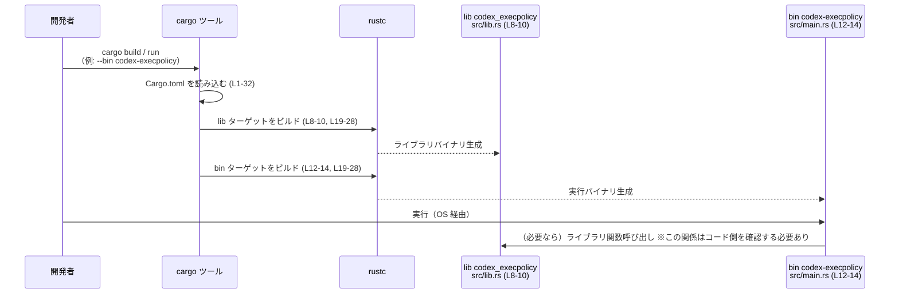

# execpolicy/Cargo.toml コード解説

## 0. ざっくり一言

`execpolicy/Cargo.toml` は、Rust クレート `codex-execpolicy` の **パッケージメタデータ・ターゲット(lib/bin)・依存クレート** を定義する Cargo マニフェストです（根拠: `Cargo.toml:L1-6, L8-14, L19-32`）。  

---

## 1. このモジュールの役割

### 1.1 概要

- このファイルは、`codex-execpolicy` クレートの
  - パッケージ名・説明文などのメタデータ（`[package]` セクション、`Cargo.toml:L1-6`）
  - ライブラリターゲット `codex_execpolicy`（`[lib]` セクション、`Cargo.toml:L8-10`）
  - バイナリターゲット `codex-execpolicy`（`[[bin]]` セクション、`Cargo.toml:L12-14`）
  - ワークスペース共通の lints 設定（`[lints]` セクション、`Cargo.toml:L16-17`）
  - ランタイム依存クレート（`[dependencies]`、`Cargo.toml:L19-28`）
  - テスト用の開発依存クレート（`[dev-dependencies]`、`Cargo.toml:L30-32`）
  を定義しています。

- 説明文には「Codex exec policy: prefix-based Starlark rules for command decisions.」とあり、クレート全体の役割として「Starlark ベースの実行ポリシー」を扱うことが示唆されていますが、**具体的な API やロジックはこのファイルには現れません**（`Cargo.toml:L6`）。

### 1.2 アーキテクチャ内での位置づけ

このファイルから読み取れる「コンポーネント（ターゲットと依存クレート）」の関係を示します。

```mermaid
graph TD
  subgraph "Package codex-execpolicy (Cargo.toml:L1-6)"
    P["パッケージ\nname = \"codex-execpolicy\" (L2)"]
  end

  subgraph "ターゲット (Cargo.toml:L8-14)"
    L["lib codex_execpolicy\npath = \"src/lib.rs\" (L8-10)"]
    B["bin codex-execpolicy\npath = \"src/main.rs\" (L12-14)"]
  end

  subgraph "ランタイム依存 (Cargo.toml:L19-28)"
    anyhow["anyhow (L20)"]
    clap["clap (L21)"]
    abs["codex-utils-absolute-path (L22)"]
    mm["multimap (L23)"]
    serde["serde (L24)"]
    serde_json["serde_json (L25)"]
    shlex["shlex (L26)"]
    starlark["starlark (L27)"]
    thiserror["thiserror (L28)"]
  end

  subgraph "開発依存 (Cargo.toml:L30-32)"
    pa["pretty_assertions (L31)"]
    tf["tempfile (L32)"]
  end

  P --> L
  P --> B

  %% Cargo の仕様上、[dependencies] は lib/bin 両方から利用可能
  L --- anyhow
  L --- clap
  L --- abs
  L --- mm
  L --- serde
  L --- serde_json
  L --- shlex
  L --- starlark
  L --- thiserror

  B --- anyhow
  B --- clap
  B --- abs
  B --- mm
  B --- serde
  B --- serde_json
  B --- shlex
  B --- starlark
  B --- thiserror

  P --- pa
  P --- tf
```

- `[dependencies]` に書かれたクレートは Cargo の仕様上、**lib と bin の両方から利用可能**ですが、「どのターゲットで実際に使っているか」はこのファイルからは分かりません。
- `[dev-dependencies]` は主にテストや開発用ツールから利用されます（どのテストファイルから使われているかは不明です）。

### 1.3 設計上のポイント（このファイルから読み取れる範囲）

- **ワークスペース一元管理**  
  - `version.workspace = true`、`edition.workspace = true`、`license.workspace = true` により、バージョン・Edition・ライセンスがワークスペース側で一括管理されています（`Cargo.toml:L3-5`）。
  - `lints.workspace = true` により、Lint 設定もワークスペース側で共通化されています（`Cargo.toml:L16-17`）。

- **ライブラリ + CLI バイナリ構成**  
  - `src/lib.rs` を入口とするライブラリターゲット（`Cargo.toml:L8-10`）と、
  - `src/main.rs` を入口とするバイナリターゲット（`Cargo.toml:L12-14`）
  が同一パッケージ内に定義されています。

- **エラー処理・CLI・シリアライズ関連の依存**  
  - エラー処理: `anyhow`, `thiserror`（`Cargo.toml:L20, L28`）
  - CLI パース: `clap`（derive 機能付き, `Cargo.toml:L21`）
  - シリアライズ: `serde`, `serde_json`（どちらも derive 機能付き、`Cargo.toml:L24-25`）
  - 文字列・パス処理: `shlex`, `codex-utils-absolute-path`, `multimap`（`Cargo.toml:L22-23, L26`）
  - 埋め込み言語: `starlark`（`Cargo.toml:L27`）

- **テスト支援用の依存**  
  - `pretty_assertions`（見やすい差分付きアサーション、`Cargo.toml:L31`）
  - `tempfile`（一時ファイル・ディレクトリ、`Cargo.toml:L32`）

---

## 2. 主要な機能一覧（コンポーネントインベントリー）

このセクションでは、**ターゲットと依存クレート**をコンポーネントとして整理します。

### 2.1 ターゲット一覧

| コンポーネント | 種別 | 役割（Cargo.toml 上の意味） | 根拠 |
|----------------|------|-----------------------------|------|
| `codex-execpolicy` | パッケージ | クレート全体の名前とメタデータを表すパッケージ定義 | `Cargo.toml:L1-6` |
| `codex_execpolicy` | lib ターゲット | `src/lib.rs` を入口とするライブラリ。公開 API やコアロジックはここに存在すると考えられますが、このチャンクには現れません。 | `Cargo.toml:L8-10` |
| `codex-execpolicy` | bin ターゲット | `src/main.rs` を入口とするバイナリ。CLI からライブラリや内部ロジックを呼び出すエントリポイントである可能性がありますが、詳細は不明です。 | `Cargo.toml:L12-14` |

※ lib と bin の具体的な関数・型・処理内容は **すべて `src/lib.rs` / `src/main.rs` 側にあり、このチャンクには現れません**。

### 2.2 ランタイム依存クレート一覧（[dependencies]）

| クレート名 | 用途（一般的な役割） | このクレート内での利用状況 | 根拠 |
|-----------|----------------------|-----------------------------|------|
| `anyhow` | エラーの集約とコンテキスト付与 | 利用箇所・エラー方針はこのチャンクには現れません。 | `Cargo.toml:L20` |
| `clap` (feature: `derive`) | コマンドライン引数パース | CLI インターフェースの詳細は `src/main.rs` 側にあり、このチャンクには現れません。 | `Cargo.toml:L21` |
| `codex-utils-absolute-path` | パス処理ユーティリティ（名称から推測） | 実際の呼び出し箇所・インターフェースは不明です。 | `Cargo.toml:L22` |
| `multimap` | 1 キーに複数値を持つマップ | どのデータ構造で利用しているかは不明です。 | `Cargo.toml:L23` |
| `serde` (feature: `derive`) | データ構造のシリアライズ/デシリアライズ | どの型をシリアライズしているかはこのチャンクには現れません。 | `Cargo.toml:L24` |
| `serde_json` | JSON シリアライズ/デシリアライズ | 具体的な JSON 形式・スキーマは不明です。 | `Cargo.toml:L25` |
| `shlex` | シェル風の文字列トークナイズ | どのような文字列を分割しているかは不明です。 | `Cargo.toml:L26` |
| `starlark` | Starlark 言語の評価 | どのような Starlark スクリプトを扱うかは、このチャンクには現れません。 | `Cargo.toml:L27` |
| `thiserror` | エラー型の定義マクロ | どのエラー型を定義しているかは不明です。 | `Cargo.toml:L28` |

### 2.3 開発依存クレート一覧（[dev-dependencies]）

| クレート名 | 一般的な用途 | このクレート内での利用状況 | 根拠 |
|-----------|-------------|-----------------------------|------|
| `pretty_assertions` | アサーション失敗時に見やすい差分を表示するテスト補助 | どのテストで使用されているかはこのチャンクには現れません。 | `Cargo.toml:L31` |
| `tempfile` | 一時ファイル・ディレクトリの生成 | どのテストや補助ツールで使っているかは不明です。 | `Cargo.toml:L32` |

---

## 3. 公開 API と詳細解説

このセクションは本来、**関数や型の公開 API** を説明するものですが、このファイルは Cargo マニフェストであり、**関数・型定義は一切含まれません**。

### 3.1 型一覧（構造体・列挙体など）

- `Cargo.toml` 自体には Rust の型定義は存在しません。
- ライブラリ `codex_execpolicy` にどのような構造体や列挙体があるかは、`src/lib.rs` などのソースコード側を確認する必要があります（このチャンクには現れません）。

### 3.2 関数詳細

- このファイルには **関数定義が存在しない** ため、関数ごとの引数・戻り値・エラー条件などは記載できません。
- 「公開 API とコアロジック」は `src/lib.rs` / `src/main.rs` 側のコードに依存します。このチャンクから読み取れるのは、「それらが存在するであろうターゲットのパス」と依存クレートのみです（`Cargo.toml:L8-10, L12-14, L19-28`）。

### 3.3 その他の関数

- Cargo マニフェストであるため、**補助関数やラッパー関数も一切現れません**。

---

## 4. データフロー（ビルド・実行時の高レベルフロー）

コードレベルの「関数呼び出しフロー」はこのチャンクには現れないため、  
ここでは **Cargo がこの `Cargo.toml` を用いて lib/bin をビルド・実行する高レベルのフロー**を示します。



- `[dependencies]` に定義したクレート（`Cargo.toml:L19-28`）は、`Lib` と `Bin` のどちらからもインポート可能です。ただし、実際にどこで使われているかはソースコード側を確認しないと分かりません。
- テスト実行時（`cargo test`）には、`[dev-dependencies]`（`Cargo.toml:L30-32`）がテストコードから利用可能になりますが、テストの中身はこのチャンクには現れません。

**Bugs / Security 観点（このファイル単体での範囲）**

- `Cargo.toml` 自体は実行ロジックを持たないため、**実行時バグやセキュリティホールそのものはここには記述されていません**。
- ただし、
  - `starlark` のようなスクリプト言語ランタイム（`Cargo.toml:L27`）や
  - コマンドラインパーサ `clap`（`Cargo.toml:L21`）
  が依存に含まれているため、**スクリプトの扱いや CLI 入力の検証方法**については、実装側で注意が必要になります。  
  具体的な防御策や危険なパターンは、このチャンクからは分かりません。

---

## 5. 使い方（How to Use）

### 5.1 基本的な使用方法（Cargo 視点）

このファイルから読み取れる範囲での「使い方」は、主に **パッケージ・ターゲット名を指定した Cargo コマンド**です。

#### バイナリをビルド・実行する

```bash
# ビルド（デフォルトで lib と bin の両方をビルド対象に含める）
cargo build -p codex-execpolicy
#           ^ パッケージ名 (Cargo.toml:L2)

# 明示的にバイナリターゲットを指定して実行
cargo run -p codex-execpolicy --bin codex-execpolicy -- [任意の引数]
#               ^ パッケージ名 (L2)      ^ bin 名 (L13)
# 実際に受け付ける引数やオプション内容は src/main.rs を確認する必要があります（このチャンクには現れません）。
```

#### ライブラリとして他クレートから利用する（例）

別のクレートの `Cargo.toml` から、このライブラリパッケージを依存として指定する場合の一般的な例です。  
（バージョン番号は公開状況に依存するため、ここではプレースホルダを用いています。）

```toml
[dependencies]
codex-execpolicy = "x.y.z"   # パッケージ名は Cargo.toml:L2 に一致させる
# どの関数・型を使えるかは codex_execpolicy の公開 API 次第であり、このチャンクには現れません。
```

### 5.2 よくある使用パターン（推測を含まない範囲）

このチャンクから確定的に言える使用パターンは次の 2 点のみです。

- lib ターゲット `codex_execpolicy` をビルドして、他クレートからライブラリとして依存できる（`Cargo.toml:L8-10`）。
- bin ターゲット `codex-execpolicy` をビルド・実行して、コマンドラインツールとして利用できる（`Cargo.toml:L12-14`）。

それ以上の「どの関数をどう呼ぶか」「どの CLI オプションがあるか」は、このチャンクには現れません。

### 5.3 よくある間違い（Cargo 設定まわり）

このファイルの編集や利用に関して起こり得る誤りと、その対策を示します。

```toml
# ❌ よくない例: ワークスペース管理と矛盾するローカル設定
[package]
name = "codex-execpolicy"
version = "0.1.0"           # ← version.workspace = true (L3) と矛盾させないこと
version.workspace = true

# ✅ 望ましい例: version は workspace で一元管理し、このファイルでは workspace 指定のみ
[package]
name = "codex-execpolicy"
version.workspace = true     # L3 に相当
```

- `edition` や `license` も同様に、`*.workspace = true` とローカル設定を混在させると整合性が崩れる可能性があります（`Cargo.toml:L3-5`）。  
  実際の禁止条件やエラーは Cargo の仕様に依存します。

### 5.4 使用上の注意点（まとめ）

- **ワークスペース依存**  
  - このパッケージはバージョン・Edition・ライセンス・Lint をワークスペースに委譲しています（`Cargo.toml:L3-5, L16-17`）。  
    これらを変更したい場合は、**ワークスペースルートの `Cargo.toml`** を編集する必要があります（具体的なパスはこのチャンクには現れません）。

- **公開 API / コアロジックは別ファイル**  
  - 実際の exec policy ロジック、Starlark の使い方、エラー処理方針、並行性（スレッド・非同期）などは `src/lib.rs` / `src/main.rs` にあり、このチャンクからは一切分かりません。  
  - 公開 API を利用したい場合や変更したい場合は、必ずソースコード側を確認する必要があります。

- **安全性・エラー・並行性**  
  - `anyhow` / `thiserror` を用いるエラー設計、`starlark` を用いるスクリプト実行の安全性、並行処理の有無などは、このチャンクには現れません。  
    これらはコードの実装を見なければ評価できません。

---

## 6. 変更の仕方（How to Modify）

### 6.1 新しい機能を追加する場合（Cargo 側）

このファイルの観点から、新機能追加時に関係しやすい変更箇所を整理します。

1. **新しい依存クレートを追加する**  
   - 例: Starlark ポリシーをファイルシステムから読み込むために別のクレートが必要になった場合など。

   ```toml
   [dependencies]
   anyhow = { workspace = true }
   # ...
   new-crate = "x.y.z"   # 新しい依存
   ```

   - 実際にどのターゲット（lib/bin）で使うかはコード側で制御します。

2. **新しいバイナリターゲットを追加する**  
   - CLI を用途別に分けたい場合など。

   ```toml
   [[bin]]
   name = "codex-execpolicy"
   path = "src/main.rs"

   [[bin]]
   name = "codex-execpolicy-tool"
   path = "src/tool_main.rs"
   ```

   - このような変更を行った場合、`src/tool_main.rs` の実装および他のドキュメントも整合させる必要があります。

3. **新しいライブラリ機能**  
   - ライブラリ機能の追加自体は `src/lib.rs` で行われ、このファイル側には通常変更は不要です（既存依存で足りるなら）。

### 6.2 既存の機能を変更する場合（Cargo 側）

- **パッケージ名の変更 (`[package].name`)**  
  - `Cargo.toml:L2` を変更すると、`cargo build -p` や他クレートからの依存指定名が変わります。  
    他の `Cargo.toml` や CI 設定などの影響範囲を確認する必要があります。
- **ターゲット名やパスの変更 (`[lib]` / `[[bin]]`)**  
  - `name` や `path` を変える場合、実ファイルパスやドキュメント、ラッパースクリプトなども合わせて更新する必要があります（`Cargo.toml:L8-10, L12-14`）。
- **依存の削除・バージョン変更**  
  - `anyhow` や `starlark` などを削除・切り替える場合は、コード側での使用箇所をすべて洗い出す必要があります（このチャンクでは使用箇所は分かりません）。  
  - ワークスペース側でバージョンを統一している点にも注意が必要です（`Cargo.toml:L3, L19-28`）。

---

## 7. 関連ファイル

このファイルから読み取れる、密接に関係するファイル・設定をまとめます。

| パス / 場所 | 役割 / 関係 | 根拠 |
|-------------|------------|------|
| `src/lib.rs` | ライブラリターゲット `codex_execpolicy` の実装ファイル。公開 API やコアロジックが含まれると考えられますが、このチャンクには現れません。 | `Cargo.toml:L8-10` |
| `src/main.rs` | バイナリターゲット `codex-execpolicy` のエントリポイント。CLI からの利用ロジックを実装しているはずですが、内容は不明です。 | `Cargo.toml:L12-14` |
| （ワークスペースルートの `Cargo.toml`） | `version.workspace`, `edition.workspace`, `license.workspace`, `lints.workspace` の実体設定が書かれているファイル。具体的なパスはこのチャンクには現れません。 | `Cargo.toml:L3-5, L16-17` |

---

### まとめ

- `execpolicy/Cargo.toml` は、**クレート構成と依存関係**を定義するメタデータファイルであり、  
  公開 API やコアロジック、エラー処理、並行性などの詳細は **一切このチャンクには現れません**。
- コンポーネントインベントリーとしては、  
  - 1 パッケージ (`codex-execpolicy`)、  
  - 1 ライブラリターゲット (`codex_execpolicy`)、  
  - 1 バイナリターゲット (`codex-execpolicy`)、  
  - ランタイム依存 9 クレート、開発依存 2 クレート  
  が定義されていることを、このファイルから確実に読み取ることができます。
